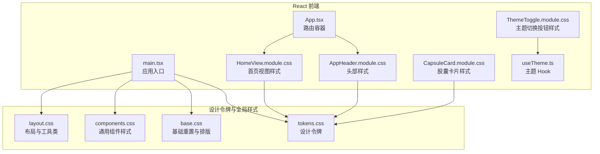
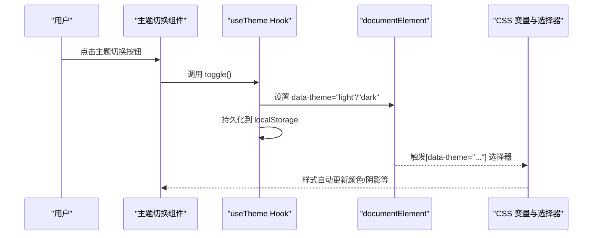
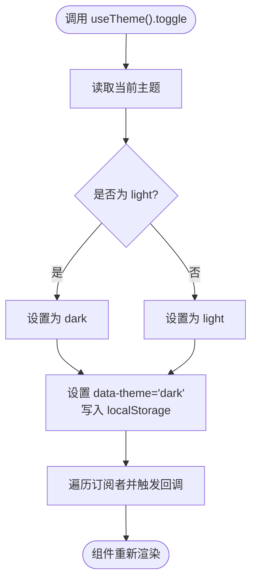
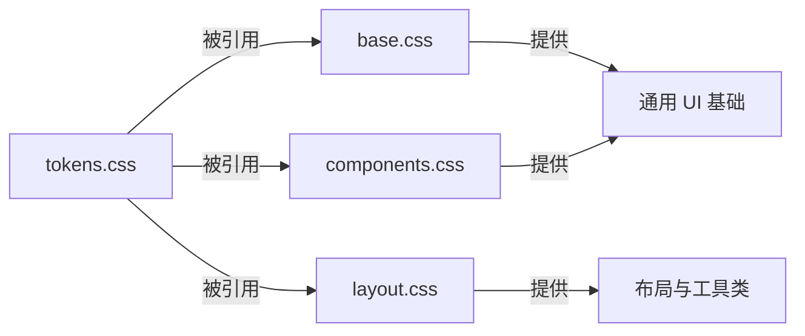
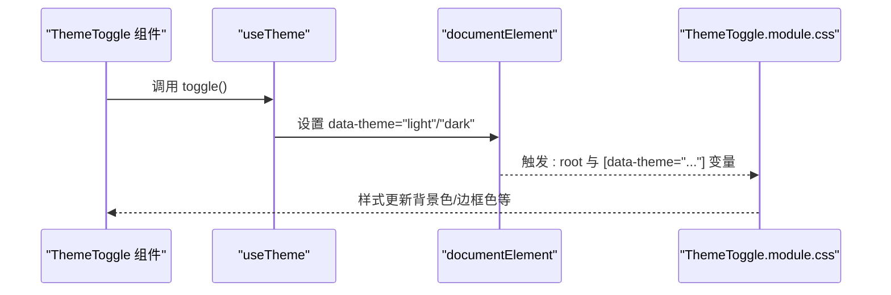
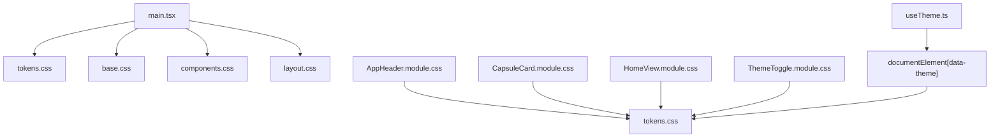

# 样式系统与主题管理

<cite>
**本文档引用的文件**
- [tokens.css](file://spec/styles/tokens.css)
- [base.css](file://spec/styles/base.css)
- [components.css](file://spec/styles/components.css)
- [layout.css](file://spec/styles/layout.css)
- [useTheme.ts](file://frontends/react-ts/src/hooks/useTheme.ts)
- [ThemeToggle.module.css](file://frontends/react-ts/src/components/ThemeToggle.module.css)
- [AppHeader.module.css](file://frontends/react-ts/src/components/AppHeader.module.css)
- [CapsuleCard.module.css](file://frontends/react-ts/src/components/CapsuleCard.module.css)
- [HomeView.module.css](file://frontends/react-ts/src/views/HomeView.module.css)
- [App.tsx](file://frontends/react-ts/src/App.tsx)
- [main.tsx](file://frontends/react-ts/src/main.tsx)
- [vite.config.ts](file://frontends/react-ts/vite.config.ts)
- [package.json](file://frontends/react-ts/package.json)
</cite>

## 目录
1. [简介](#简介)
2. [项目结构](#项目结构)
3. [核心组件](#核心组件)
4. [架构总览](#架构总览)
5. [详细组件分析](#详细组件分析)
6. [依赖关系分析](#依赖关系分析)
7. [性能考虑](#性能考虑)
8. [故障排除指南](#故障排除指南)
9. [结论](#结论)
10. [附录](#附录)

## 简介
本项目采用“设计令牌 + 全局样式 + CSS Modules”的混合样式架构，通过 CSS 变量统一管理设计令牌，结合全局基础样式与组件级样式模块，实现主题切换、样式隔离与响应式布局。React 前端通过自定义 Hook 管理主题状态并在 DOM 上应用数据属性，使 CSS 变量在不同主题间无缝切换；同时，每个组件使用独立的 CSS Module 文件进行样式隔离，避免样式冲突。

## 项目结构
前端 React 工程位于 frontends/react-ts，样式体系由两部分组成：
- 设计令牌与全局样式：位于 spec/styles，包含设计令牌、基础样式、通用组件样式与布局工具类。
- 组件样式：位于 frontends/react-ts/src 下，以模块化 CSS 文件组织，配合组件 TSX 文件使用。



**图表来源**
- [main.tsx:9-13](file://frontends/react-ts/src/main.tsx#L9-L13)
- [tokens.css:1-104](file://spec/styles/tokens.css#L1-L104)
- [base.css:1-67](file://spec/styles/base.css#L1-L67)
- [components.css:1-207](file://spec/styles/components.css#L1-L207)
- [layout.css:1-103](file://spec/styles/layout.css#L1-L103)
- [useTheme.ts:1-48](file://frontends/react-ts/src/hooks/useTheme.ts#L1-L48)
- [ThemeToggle.module.css:1-19](file://frontends/react-ts/src/components/ThemeToggle.module.css#L1-L19)
- [AppHeader.module.css:1-51](file://frontends/react-ts/src/components/AppHeader.module.css#L1-L51)
- [CapsuleCard.module.css:1-33](file://frontends/react-ts/src/components/CapsuleCard.module.css#L1-L33)
- [HomeView.module.css:1-115](file://frontends/react-ts/src/views/HomeView.module.css#L1-L115)

**章节来源**
- [main.tsx:9-13](file://frontends/react-ts/src/main.tsx#L9-L13)
- [vite.config.ts:1-23](file://frontends/react-ts/vite.config.ts#L1-L23)
- [package.json:1-31](file://frontends/react-ts/package.json#L1-L31)

## 核心组件
- 设计令牌与主题变量：集中定义颜色、字体、间距、圆角、阴影、过渡与布局尺寸等，支持明/暗两种主题变体。
- 全局基础样式：重置默认样式、设置根元素排版与过渡、为链接、输入框、按钮等提供基础样式。
- 通用组件样式：按钮、输入框、卡片、徽章、对话框、表格等通用组件的样式规范。
- 布局与工具类：容器、Flex/Grid、间距、文本、显示控制与响应式断点。
- 主题切换 Hook：使用 useSyncExternalStore 管理主题状态，持久化到 localStorage，并通过 data-theme 属性驱动 CSS 变量切换。
- 组件级 CSS Modules：每个组件拥有独立样式文件，使用设计令牌变量，确保样式隔离与可维护性。

**章节来源**
- [tokens.css:1-104](file://spec/styles/tokens.css#L1-L104)
- [base.css:1-67](file://spec/styles/base.css#L1-L67)
- [components.css:1-207](file://spec/styles/components.css#L1-L207)
- [layout.css:1-103](file://spec/styles/layout.css#L1-L103)
- [useTheme.ts:1-48](file://frontends/react-ts/src/hooks/useTheme.ts#L1-L48)

## 架构总览
整体架构围绕“设计令牌驱动的主题系统”展开：应用启动时注入全局样式，组件通过 CSS Modules 引用设计令牌变量；主题切换通过 Hook 更新 DOM 的 data-theme 属性，从而触发 CSS 变量的自动切换，实现无刷新的主题更新。



**图表来源**
- [useTheme.ts:14-22](file://frontends/react-ts/src/hooks/useTheme.ts#L14-L22)
- [tokens.css:82-103](file://spec/styles/tokens.css#L82-L103)
- [ThemeToggle.module.css:1-19](file://frontends/react-ts/src/components/ThemeToggle.module.css#L1-L19)

## 详细组件分析

### 主题系统与 Hook
- 状态模型：模块级共享状态保存当前主题，使用 Set 维护订阅者集合，实现跨组件通知。
- 数据流：toggle 切换主题 -> 更新模块内 theme -> 设置 data-theme 属性 -> localStorage 持久化 -> 触发订阅者重新渲染。
- 外部存储：useSyncExternalStore 提供与外部状态同步的能力，避免手动订阅/取消订阅。



**图表来源**
- [useTheme.ts:33-44](file://frontends/react-ts/src/hooks/useTheme.ts#L33-L44)

**章节来源**
- [useTheme.ts:1-48](file://frontends/react-ts/src/hooks/useTheme.ts#L1-L48)

### 设计令牌与主题变量
- 颜色体系：主色、背景、文本、边框、成功/警告/错误/信息等语义色。
- 字体与排版：字体族、字号、行高、字重。
- 间距与圆角：细粒度空间单位与常用半径。
- 阴影与过渡：多层级阴影与动画时长/缓动。
- 布局尺寸：页面最大宽度、头部高度等。
- 暗色主题覆盖：针对主色、背景、文本、边框与阴影进行逆向调整，保证对比度与可读性。

```mermaid
classDiagram
class Tokens {
"+颜色 : primary, bg, text, border, success, warning, error, info"
"+排版 : font-family, text sizes, leading, weights"
"+间距 : space units"
"+圆角 : radius values"
"+阴影 : shadow variants"
"+过渡 : transition durations"
"+布局 : max-width, header-height"
}
class DarkTheme {
"+覆盖 : 主色/背景/文本/边框/阴影"
}
Tokens <|-- DarkTheme : "暗色覆盖"
```

**图表来源**
- [tokens.css:1-104](file://spec/styles/tokens.css#L1-L104)

**章节来源**
- [tokens.css:1-104](file://spec/styles/tokens.css#L1-L104)

### 全局样式与组件样式
- 基础样式：重置盒模型、设置根排版与过渡、链接与表单控件的基础样式。
- 通用组件：按钮、输入框、卡片、徽章、对话框、表格等，统一风格与交互反馈。
- 布局工具：容器、Flex/Grid、间距、文本、显示控制与移动端断点。



**图表来源**
- [base.css:1-67](file://spec/styles/base.css#L1-L67)
- [components.css:1-207](file://spec/styles/components.css#L1-L207)
- [layout.css:1-103](file://spec/styles/layout.css#L1-L103)
- [tokens.css:1-104](file://spec/styles/tokens.css#L1-L104)

**章节来源**
- [base.css:1-67](file://spec/styles/base.css#L1-L67)
- [components.css:1-207](file://spec/styles/components.css#L1-L207)
- [layout.css:1-103](file://spec/styles/layout.css#L1-L103)

### 组件样式组织与隔离
- CSS Modules：每个组件拥有独立样式文件，如 AppHeader.module.css、CapsuleCard.module.css、HomeView.module.css 等，使用设计令牌变量，确保作用域隔离。
- 样式继承与覆盖：组件样式通过类名组合与伪类选择器实现 hover/active 等状态；在暗色主题下通过 [data-theme="dark"] 选择器进行局部覆盖。
- 响应式设计：在组件样式中使用媒体查询，如 AppHeader 在小屏下隐藏文字、HomeView 在小屏下调整按钮布局。

```mermaid
classDiagram
class AppHeader_module_css {
"+header : 使用 var(--header-height)"
"+logo : 使用 var(--text-lg), var(--font-bold)"
"+navLink : 使用 var(--text-sm), var(--color-text-secondary)"
+"@media(max-width : 480px) : 隐藏 logoText"
}
class CapsuleCard_module_css {
"+capsuleMeta/capsuleTimes : 使用 var(--space-*)"
"+capsuleContent : 使用 var(--color-bg-secondary), var(--radius-md)"
}
class HomeView_module_css {
"+hero : 使用 var(--space-*), var(--text-*)"
"+actionBtn* : 使用 var(--radius-xl), var(--shadow-md)"
+"@media(max-width : 480px) : 垂直布局"
}
AppHeader_module_css --> Tokens : "引用设计令牌"
CapsuleCard_module_css --> Tokens : "引用设计令牌"
HomeView_module_css --> Tokens : "引用设计令牌"
```

**图表来源**
- [AppHeader.module.css:1-51](file://frontends/react-ts/src/components/AppHeader.module.css#L1-L51)
- [CapsuleCard.module.css:1-33](file://frontends/react-ts/src/components/CapsuleCard.module.css#L1-L33)
- [HomeView.module.css:1-115](file://frontends/react-ts/src/views/HomeView.module.css#L1-L115)
- [tokens.css:1-104](file://spec/styles/tokens.css#L1-L104)

**章节来源**
- [AppHeader.module.css:1-51](file://frontends/react-ts/src/components/AppHeader.module.css#L1-L51)
- [CapsuleCard.module.css:1-33](file://frontends/react-ts/src/components/CapsuleCard.module.css#L1-L33)
- [HomeView.module.css:1-115](file://frontends/react-ts/src/views/HomeView.module.css#L1-L115)

### 主题切换组件与样式
- 主题切换按钮样式：使用设计令牌变量控制尺寸、圆角、背景色与过渡，hover 时改变背景色。
- 主题状态：通过 useTheme Hook 获取当前主题并提供切换函数；切换后通过 data-theme 属性影响全局与组件样式。



**图表来源**
- [ThemeToggle.module.css:1-19](file://frontends/react-ts/src/components/ThemeToggle.module.css#L1-L19)
- [useTheme.ts:14-22](file://frontends/react-ts/src/hooks/useTheme.ts#L14-L22)

**章节来源**
- [ThemeToggle.module.css:1-19](file://frontends/react-ts/src/components/ThemeToggle.module.css#L1-L19)
- [useTheme.ts:1-48](file://frontends/react-ts/src/hooks/useTheme.ts#L1-L48)

## 依赖关系分析
- 应用入口导入全局样式：main.tsx 中引入 tokens.css、base.css、components.css、layout.css，确保设计令牌与通用样式在应用启动时生效。
- 组件依赖设计令牌：各组件样式文件通过 var(--xxx) 引用设计令牌变量，形成“样式层 -> 设计令牌层”的依赖关系。
- 主题切换依赖 DOM 属性：useTheme 通过设置 documentElement 的 data-theme 属性驱动 CSS 变量切换，形成“状态层 -> DOM 属性 -> 样式层”的依赖关系。
- 构建与别名：vite.config.ts 配置了 @ 与 @spec 别名，便于在组件中以 @/ 或 @spec/ 方式导入资源。



**图表来源**
- [main.tsx:9-13](file://frontends/react-ts/src/main.tsx#L9-L13)
- [AppHeader.module.css:1-51](file://frontends/react-ts/src/components/AppHeader.module.css#L1-L51)
- [CapsuleCard.module.css:1-33](file://frontends/react-ts/src/components/CapsuleCard.module.css#L1-L33)
- [HomeView.module.css:1-115](file://frontends/react-ts/src/views/HomeView.module.css#L1-L115)
- [ThemeToggle.module.css:1-19](file://frontends/react-ts/src/components/ThemeToggle.module.css#L1-L19)
- [useTheme.ts:14-22](file://frontends/react-ts/src/hooks/useTheme.ts#L14-L22)
- [tokens.css:1-104](file://spec/styles/tokens.css#L1-L104)

**章节来源**
- [main.tsx:9-13](file://frontends/react-ts/src/main.tsx#L9-L13)
- [vite.config.ts:7-12](file://frontends/react-ts/vite.config.ts#L7-L12)

## 性能考虑
- CSS 变量与选择器：通过 data-theme 与 :root 变量切换减少重复样式定义，降低 CSS 体积与维护成本。
- 样式隔离：CSS Modules 将样式作用域限定在组件内，避免全局污染，提升样式复用与可维护性。
- 响应式断点：在组件样式中使用媒体查询，减少额外响应式样式文件，保持样式就近维护。
- 构建与别名：Vite 别名简化路径，提升开发体验；构建脚本由 Vite 管理，无需额外的 CSS 提取配置。
- 运行时性能：useSyncExternalStore 提供稳定的外部状态同步，避免不必要的重渲染。

[本节为通用性能建议，不直接分析具体文件]

## 故障排除指南
- 主题未生效
  - 检查 useTheme 是否正确设置 data-theme 属性与 localStorage。
  - 确认 tokens.css 中的 [data-theme="dark"] 选择器是否覆盖了目标组件样式。
- 样式变量无效
  - 确保组件样式文件引用了正确的 var(--xxx) 变量。
  - 检查 main.tsx 是否已导入 tokens.css、base.css、components.css、layout.css。
- 媒体查询不生效
  - 确认组件样式中的 @media 条件与断点设置是否符合预期。
  - 检查浏览器开发者工具中的媒体查询匹配情况。
- 构建别名问题
  - 确认 vite.config.ts 中 @ 与 @spec 别名配置是否正确，组件导入路径是否使用 @/ 或 @spec/。

**章节来源**
- [useTheme.ts:14-22](file://frontends/react-ts/src/hooks/useTheme.ts#L14-L22)
- [main.tsx:9-13](file://frontends/react-ts/src/main.tsx#L9-L13)
- [vite.config.ts:7-12](file://frontends/react-ts/vite.config.ts#L7-L12)

## 结论
该 React 样式系统通过“设计令牌 + 全局样式 + CSS Modules”的组合，实现了主题切换、样式隔离与响应式布局的统一管理。useTheme Hook 以最小侵入的方式驱动 CSS 变量切换，组件样式通过 var(--xxx) 与媒体查询实现一致的视觉与交互体验。整体架构清晰、扩展性强，适合长期演进与团队协作。

[本节为总结性内容，不直接分析具体文件]

## 附录
- 最佳实践
  - 使用设计令牌变量统一颜色、间距、排版等，避免硬编码值。
  - 组件样式尽量使用 CSS Modules，保持作用域隔离与可测试性。
  - 在暗色主题下优先使用 [data-theme="dark"] 选择器进行局部覆盖，保持明/暗一致性。
  - 响应式设计靠近组件，减少全局样式复杂度。
- 维护策略
  - 设计令牌集中管理，变更时同步更新 tokens.css 并验证各组件表现。
  - 新增组件样式遵循现有命名与结构，复用 components.css 与 layout.css。
  - 定期审查媒体查询与断点，确保移动端体验一致。

[本节为通用建议，不直接分析具体文件]