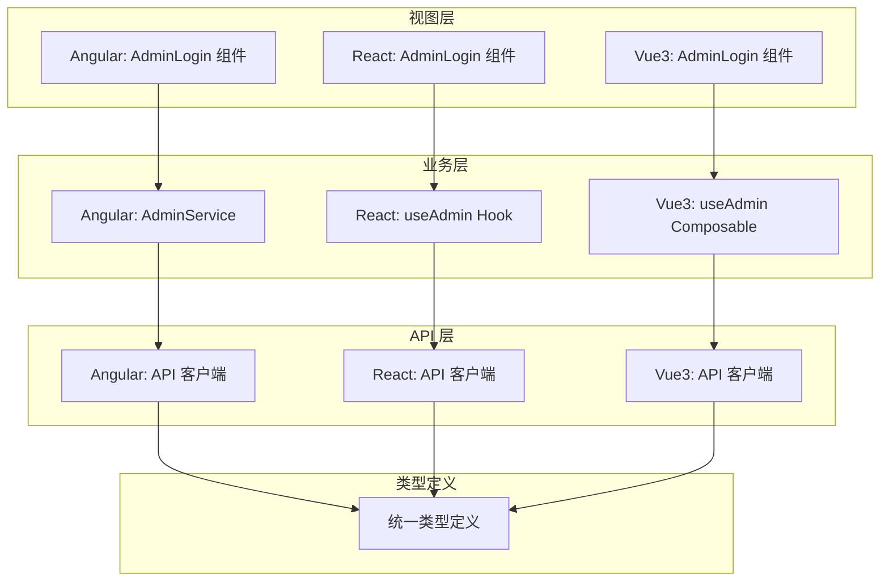
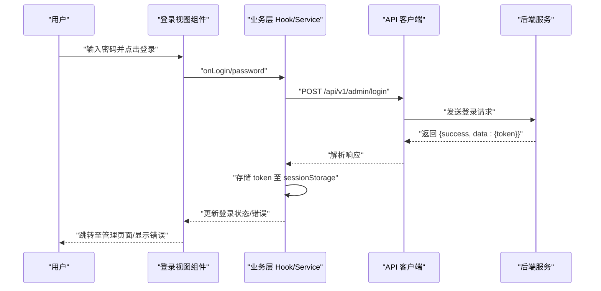
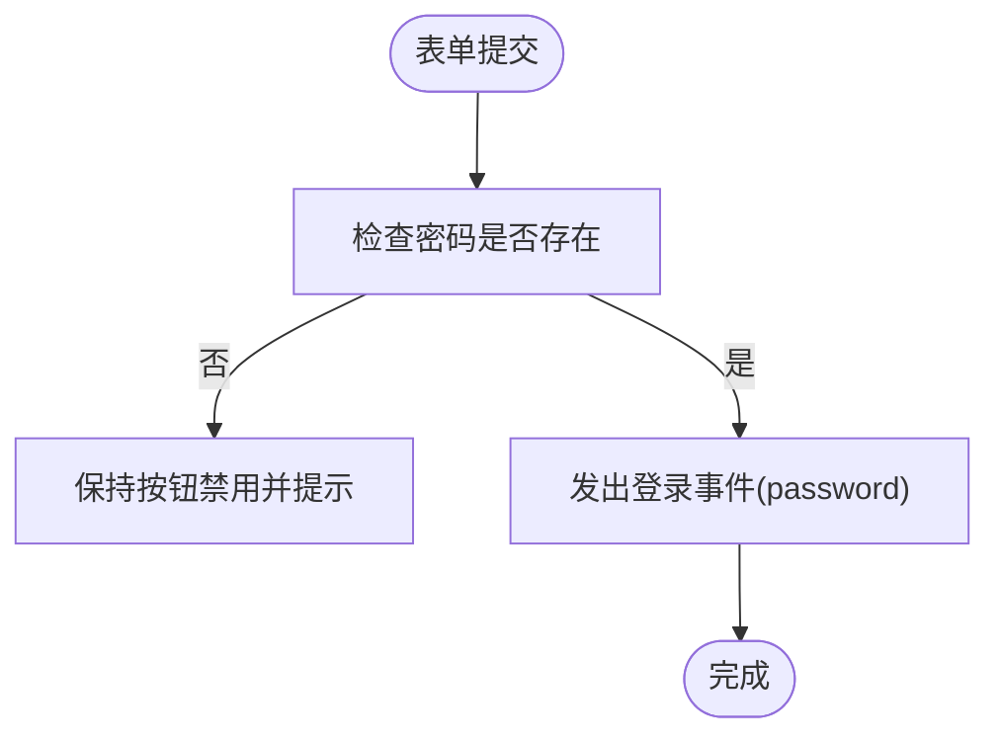
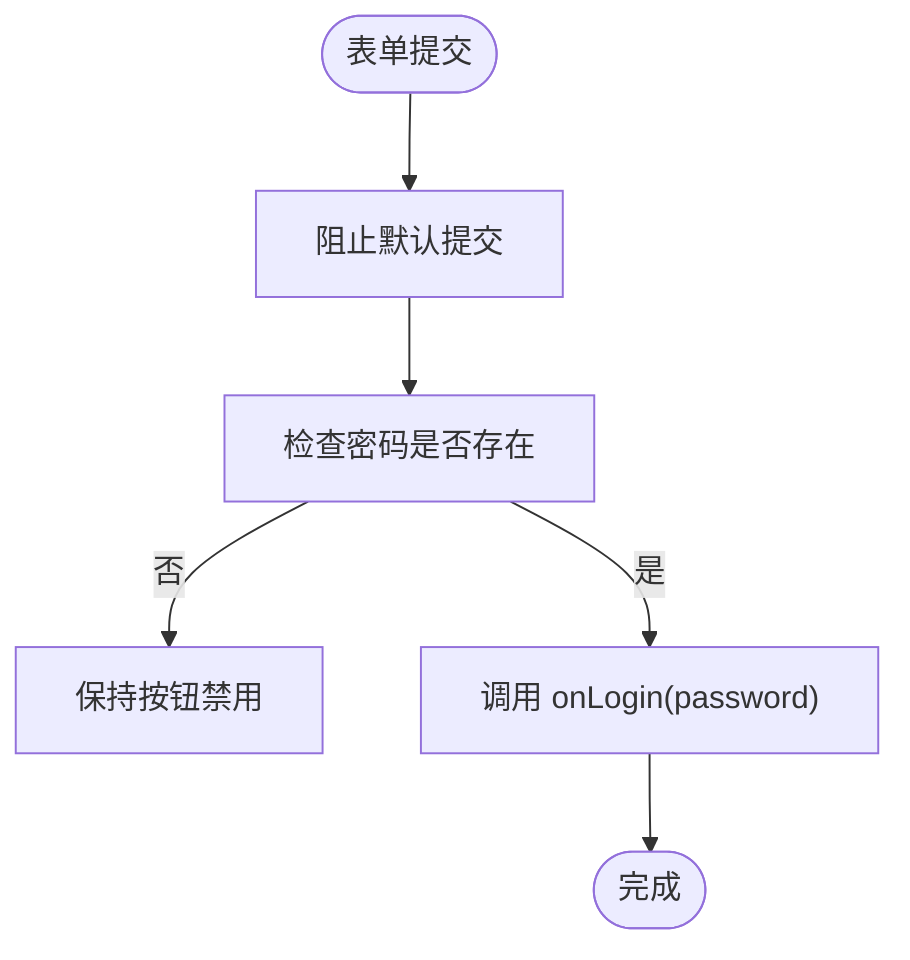
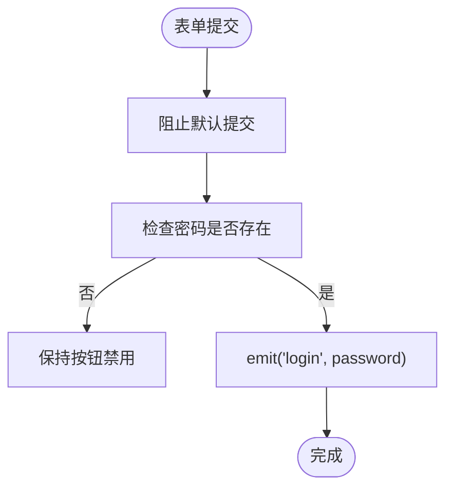
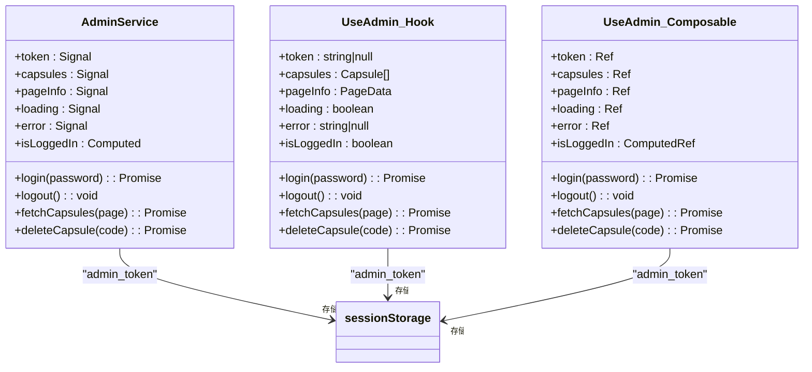
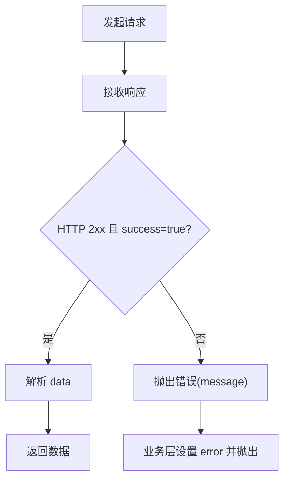
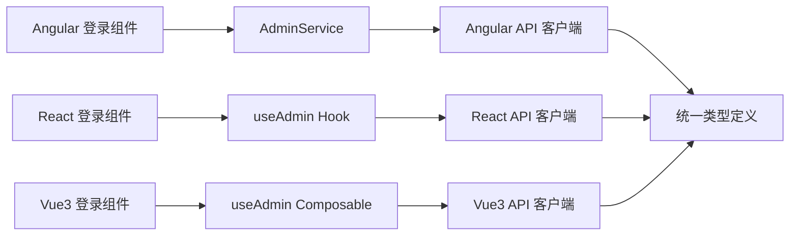

# AdminLogin 管理员登录组件

<cite>
**本文档引用的文件**
- [admin-login.component.ts](file://frontends/angular-ts/src/app/components/admin-login/admin-login.component.ts)
- [admin-login.component.html](file://frontends/angular-ts/src/app/components/admin-login/admin-login.component.html)
- [admin-login.component.css](file://frontends/angular-ts/src/app/components/admin-login/admin-login.component.css)
- [AdminLogin.tsx](file://frontends/react-ts/src/components/AdminLogin.tsx)
- [AdminLogin.vue](file://frontends/vue3-ts/src/components/AdminLogin.vue)
- [admin.service.ts](file://frontends/angular-ts/src/app/services/admin.service.ts)
- [useAdmin.ts（React）](file://frontends/react-ts/src/hooks/useAdmin.ts)
- [useAdmin.ts（Vue3）](file://frontends/vue3-ts/src/composables/useAdmin.ts)
- [index.ts（Angular API）](file://frontends/angular-ts/src/app/api/index.ts)
- [index.ts（React API）](file://frontends/react-ts/src/api/index.ts)
- [index.ts（Vue3 API）](file://frontends/vue3-ts/src/api/index.ts)
- [index.ts（Angular Types）](file://frontends/angular-ts/src/app/types/index.ts)
- [index.ts（React Types）](file://frontends/react-ts/src/types/index.ts)
- [app.routes.ts](file://frontends/angular-ts/src/app/app.routes.ts)
- [app.config.ts](file://frontends/angular-ts/src/app/app.config.ts)
</cite>

## 目录
1. [简介](#简介)
2. [项目结构](#项目结构)
3. [核心组件](#核心组件)
4. [架构总览](#架构总览)
5. [详细组件分析](#详细组件分析)
6. [依赖关系分析](#依赖关系分析)
7. [性能考量](#性能考量)
8. [故障排查指南](#故障排查指南)
9. [结论](#结论)
10. [附录](#附录)

## 简介
本设计文档围绕 AdminLogin 管理员登录组件展开，覆盖 Angular、React、Vue3 三种前端框架下的实现形态，系统性阐述登录表单的输入与校验、提交处理流程；认证状态管理（token 存储、用户信息缓存、会话生命周期）；错误处理机制（网络错误、认证失败、服务器响应处理）；登录后的路由跳转与权限验证流程；安全考虑（密码输入、token 安全存储、防重复提交）；以及登录状态的全局管理与跨组件共享机制。同时提供使用示例与安全最佳实践，帮助开发者快速集成并安全地使用登录组件。

## 项目结构
AdminLogin 在多框架下采用相似的职责划分：
- 视图层：各框架的登录组件负责渲染表单、绑定输入、触发登录事件。
- 业务层：各框架的 useAdmin 或 AdminService 提供登录、登出、数据访问等能力。
- API 层：统一封装 /api/v1 基础路径的请求与错误处理。
- 类型层：统一的 ApiResponse、AdminToken 等类型定义，确保前后端契约一致。

图表来源
- [admin-login.component.ts:1-24](file://frontends/angular-ts/src/app/components/admin-login/admin-login.component.ts#L1-L24)
- [AdminLogin.tsx:1-42](file://frontends/react-ts/src/components/AdminLogin.tsx#L1-L42)
- [AdminLogin.vue:1-57](file://frontends/vue3-ts/src/components/AdminLogin.vue#L1-L57)
- [admin.service.ts:1-84](file://frontends/angular-ts/src/app/services/admin.service.ts#L1-L84)
- [useAdmin.ts（React）:1-133](file://frontends/react-ts/src/hooks/useAdmin.ts#L1-L133)
- [useAdmin.ts（Vue3）:1-132](file://frontends/vue3-ts/src/composables/useAdmin.ts#L1-L132)
- [index.ts（Angular API）:1-71](file://frontends/angular-ts/src/app/api/index.ts#L1-L71)
- [index.ts（React API）:1-94](file://frontends/react-ts/src/api/index.ts#L1-L94)
- [index.ts（Vue3 API）:1-120](file://frontends/vue3-ts/src/api/index.ts#L1-L120)
- [index.ts（Angular Types）:1-53](file://frontends/angular-ts/src/app/types/index.ts#L1-L53)
- [index.ts（React Types）:1-80](file://frontends/react-ts/src/types/index.ts#L1-L80)

章节来源
- [admin-login.component.ts:1-24](file://frontends/angular-ts/src/app/components/admin-login/admin-login.component.ts#L1-L24)
- [AdminLogin.tsx:1-42](file://frontends/react-ts/src/components/AdminLogin.tsx#L1-L42)
- [AdminLogin.vue:1-57](file://frontends/vue3-ts/src/components/AdminLogin.vue#L1-L57)
- [admin.service.ts:1-84](file://frontends/angular-ts/src/app/services/admin.service.ts#L1-L84)
- [useAdmin.ts（React）:1-133](file://frontends/react-ts/src/hooks/useAdmin.ts#L1-L133)
- [useAdmin.ts（Vue3）:1-132](file://frontends/vue3-ts/src/composables/useAdmin.ts#L1-L132)
- [index.ts（Angular API）:1-71](file://frontends/angular-ts/src/app/api/index.ts#L1-L71)
- [index.ts（React API）:1-94](file://frontends/react-ts/src/api/index.ts#L1-L94)
- [index.ts（Vue3 API）:1-120](file://frontends/vue3-ts/src/api/index.ts#L1-L120)
- [index.ts（Angular Types）:1-53](file://frontends/angular-ts/src/app/types/index.ts#L1-L53)
- [index.ts（React Types）:1-80](file://frontends/react-ts/src/types/index.ts#L1-L80)

## 核心组件
- Angular 登录组件：通过模板驱动绑定密码输入，禁用无输入时的提交按钮，触发登录事件。
- React 登录组件：受控组件模式，使用 useState 管理密码，阻止默认提交并触发回调。
- Vue3 登录组件：v-model 双向绑定密码，禁用无输入时的提交按钮，触发登录事件。
- 共同点：均提供 loading 与 error 输入，以控制按钮状态与错误提示显示。

章节来源
- [admin-login.component.html:1-28](file://frontends/angular-ts/src/app/components/admin-login/admin-login.component.html#L1-L28)
- [admin-login.component.ts:1-24](file://frontends/angular-ts/src/app/components/admin-login/admin-login.component.ts#L1-L24)
- [admin-login.component.css:1-40](file://frontends/angular-ts/src/app/components/admin-login/admin-login.component.css#L1-L40)
- [AdminLogin.tsx:1-42](file://frontends/react-ts/src/components/AdminLogin.tsx#L1-L42)
- [AdminLogin.vue:1-57](file://frontends/vue3-ts/src/components/AdminLogin.vue#L1-L57)

## 架构总览
登录组件的调用链路在三个框架中高度一致：视图层接收用户输入 → 业务层发起登录请求 → API 层统一处理网络与业务错误 → 成功后持久化 token 并更新全局状态。

图表来源
- [AdminLogin.tsx:10-18](file://frontends/react-ts/src/components/AdminLogin.tsx#L10-L18)
- [useAdmin.ts（React）:49-62](file://frontends/react-ts/src/hooks/useAdmin.ts#L49-L62)
- [index.ts（React API）:55-64](file://frontends/react-ts/src/api/index.ts#L55-L64)
- [admin.service.ts:27-40](file://frontends/angular-ts/src/app/services/admin.service.ts#L27-L40)
- [index.ts（Angular API）:43-48](file://frontends/angular-ts/src/app/api/index.ts#L43-L48)
- [AdminLogin.vue:30-40](file://frontends/vue3-ts/src/components/AdminLogin.vue#L30-L40)
- [useAdmin.ts（Vue3）:43-56](file://frontends/vue3-ts/src/composables/useAdmin.ts#L43-L56)

## 详细组件分析

### Angular 登录组件
- 输入与校验：使用 ngModel 双向绑定密码，模板侧禁用无输入时的提交按钮，防止空输入提交。
- 提交处理：表单提交事件触发 handleLogin，仅当存在密码时发出登录事件。
- 错误展示：通过 error 输入显示错误信息，样式独立于组件。

图表来源
- [admin-login.component.html:2-25](file://frontends/angular-ts/src/app/components/admin-login/admin-login.component.html#L2-L25)
- [admin-login.component.ts:18-22](file://frontends/angular-ts/src/app/components/admin-login/admin-login.component.ts#L18-L22)

章节来源
- [admin-login.component.html:1-28](file://frontends/angular-ts/src/app/components/admin-login/admin-login.component.html#L1-L28)
- [admin-login.component.ts:1-24](file://frontends/angular-ts/src/app/components/admin-login/admin-login.component.ts#L1-L24)
- [admin-login.component.css:1-40](file://frontends/angular-ts/src/app/components/admin-login/admin-login.component.css#L1-L40)

### React 登录组件
- 输入与校验：受控组件，value 由状态驱动，onChange 更新状态，模板侧禁用无输入时的提交按钮。
- 提交处理：阻止默认提交行为，仅当存在密码时调用 onLogin 回调。
- 错误展示：根据 error prop 渲染错误文本。

图表来源
- [AdminLogin.tsx:13-18](file://frontends/react-ts/src/components/AdminLogin.tsx#L13-L18)

章节来源
- [AdminLogin.tsx:1-42](file://frontends/react-ts/src/components/AdminLogin.tsx#L1-L42)

### Vue3 登录组件
- 输入与校验：v-model 双向绑定密码，模板侧禁用无输入时的提交按钮。
- 提交处理：@submit.prevent 阻止默认提交，仅当存在密码时通过 emit('login', password) 发出事件。
- 错误展示：v-if 控制错误文本显示。

图表来源
- [AdminLogin.vue:2-18](file://frontends/vue3-ts/src/components/AdminLogin.vue#L2-L18)

章节来源
- [AdminLogin.vue:1-57](file://frontends/vue3-ts/src/components/AdminLogin.vue#L1-L57)

### 认证状态管理与会话管理
- Angular：使用 signal 管理 token、capsules、pageInfo、loading、error；isLoggedIn 基于 token 计算；登录成功后写入 sessionStorage 并更新信号；登出时清空 token 与缓存。
- React：使用 useSyncExternalStore + sessionStorage 实现跨组件共享 token；login/logout 更新模块级 token 并同步 listeners；fetchCapsules 在认证失败时自动登出。
- Vue3：使用 ref 管理 token、capsules、pageInfo、loading、error；isLoggedIn 基于 token 计算；登录成功后写入 sessionStorage；fetchCapsules 在认证失败时自动登出。

图表来源
- [admin.service.ts:1-84](file://frontends/angular-ts/src/app/services/admin.service.ts#L1-L84)
- [useAdmin.ts（React）:1-133](file://frontends/react-ts/src/hooks/useAdmin.ts#L1-L133)
- [useAdmin.ts（Vue3）:1-132](file://frontends/vue3-ts/src/composables/useAdmin.ts#L1-L132)

章节来源
- [admin.service.ts:1-84](file://frontends/angular-ts/src/app/services/admin.service.ts#L1-L84)
- [useAdmin.ts（React）:1-133](file://frontends/react-ts/src/hooks/useAdmin.ts#L1-L133)
- [useAdmin.ts（Vue3）:1-132](file://frontends/vue3-ts/src/composables/useAdmin.ts#L1-L132)

### 错误处理机制
- 网络错误：API 层统一拦截 response.ok 与 data.success，非 2xx 或业务失败抛出错误，由业务层捕获并设置 error 状态。
- 认证失败：React/Vue3 在查询胶囊等需要认证的接口中检测“认证”相关错误，自动登出并清空本地状态。
- 服务器响应处理：统一使用 ApiResponse 结构，message 作为错误提示来源。

图表来源
- [index.ts（Angular API）:10-27](file://frontends/angular-ts/src/app/api/index.ts#L10-L27)
- [index.ts（React API）:14-31](file://frontends/react-ts/src/api/index.ts#L14-L31)
- [index.ts（Vue3 API）:19-37](file://frontends/vue3-ts/src/api/index.ts#L19-L37)
- [useAdmin.ts（React）:84-87](file://frontends/react-ts/src/hooks/useAdmin.ts#L84-L87)
- [useAdmin.ts（Vue3）:88-92](file://frontends/vue3-ts/src/composables/useAdmin.ts#L88-L92)

章节来源
- [index.ts（Angular API）:1-71](file://frontends/angular-ts/src/app/api/index.ts#L1-L71)
- [index.ts（React API）:1-94](file://frontends/react-ts/src/api/index.ts#L1-L94)
- [index.ts（Vue3 API）:1-120](file://frontends/vue3-ts/src/api/index.ts#L1-L120)
- [useAdmin.ts（React）:1-133](file://frontends/react-ts/src/hooks/useAdmin.ts#L1-L133)
- [useAdmin.ts（Vue3）:1-132](file://frontends/vue3-ts/src/composables/useAdmin.ts#L1-L132)

### 登录后的路由跳转与权限验证流程
- Angular 路由：项目路由中包含 /admin 页面，登录成功后可结合路由守卫或导航逻辑跳转至管理页。
- 权限验证：后续请求携带 Bearer Token，未授权时由 API 层抛错，业务层检测并自动登出。
- 管理员功能：登录成功后可调用管理员专属接口（如分页查询、删除胶囊），并在失败时清理本地状态。

章节来源
- [app.routes.ts:1-35](file://frontends/angular-ts/src/app/app.routes.ts#L1-L35)
- [index.ts（Angular API）:50-67](file://frontends/angular-ts/src/app/api/index.ts#L50-L67)
- [index.ts（React API）:70-85](file://frontends/react-ts/src/api/index.ts#L70-L85)
- [index.ts（Vue3 API）:91-111](file://frontends/vue3-ts/src/api/index.ts#L91-L111)
- [useAdmin.ts（React）:69-93](file://frontends/react-ts/src/hooks/useAdmin.ts#L69-L93)
- [useAdmin.ts（Vue3）:74-96](file://frontends/vue3-ts/src/composables/useAdmin.ts#L74-L96)

### 安全考虑
- 密码输入：各框架均使用 password 类型输入框，支持 autocomplete="current-password"，避免浏览器自动填充干扰。
- Token 安全存储：统一存储于 sessionStorage，随会话结束自动失效；登出时立即移除。
- 防重复提交：模板侧禁用无输入时的按钮；业务层在 loading 期间禁止重复提交。
- 传输安全：建议在生产环境启用 HTTPS，避免 token 泄露。

章节来源
- [admin-login.component.html:6-14](file://frontends/angular-ts/src/app/components/admin-login/admin-login.component.html#L6-L14)
- [AdminLogin.tsx:25-33](file://frontends/react-ts/src/components/AdminLogin.tsx#L25-L33)
- [AdminLogin.vue:6-13](file://frontends/vue3-ts/src/components/AdminLogin.vue#L6-L13)
- [admin.service.ts:32-33](file://frontends/angular-ts/src/app/services/admin.service.ts#L32-L33)
- [useAdmin.ts（React）:25-33](file://frontends/react-ts/src/hooks/useAdmin.ts#L25-L33)
- [useAdmin.ts（Vue3）:48-49](file://frontends/vue3-ts/src/composables/useAdmin.ts#L48-L49)

### 登录状态的全局管理与跨组件共享
- Angular：signal + computed 提供响应式状态与计算属性，适合在组件树内共享。
- React：useSyncExternalStore + 模块级 token 与 listeners，实现跨组件共享与订阅更新。
- Vue3：ref + computed 提供响应式状态与计算属性，适合在组件树内共享。

章节来源
- [admin.service.ts:1-84](file://frontends/angular-ts/src/app/services/admin.service.ts#L1-L84)
- [useAdmin.ts（React）:1-6](file://frontends/react-ts/src/hooks/useAdmin.ts#L1-L6)
- [useAdmin.ts（Vue3）:1-5](file://frontends/vue3-ts/src/composables/useAdmin.ts#L1-L5)

### 使用示例与最佳实践
- 使用示例（React）：在父组件中接收 onLogin 回调，调用 useAdmin().login 并处理 loading/error。
- 使用示例（Angular）：在父组件中监听 login 事件，调用 AdminService.login 并处理 loading/error。
- 使用示例（Vue3）：在父组件中监听 @login 事件，调用 useAdmin().login 并处理 loading/error。
- 最佳实践：始终在提交前校验输入；在 loading 期间禁用按钮；统一错误处理与提示；严格区分登录态与业务态；对敏感操作进行二次确认。

章节来源
- [AdminLogin.tsx:10-18](file://frontends/react-ts/src/components/AdminLogin.tsx#L10-L18)
- [admin-login.component.ts:12-14](file://frontends/angular-ts/src/app/components/admin-login/admin-login.component.ts#L12-L14)
- [AdminLogin.vue:25-32](file://frontends/vue3-ts/src/components/AdminLogin.vue#L25-L32)
- [admin.service.ts:27-40](file://frontends/angular-ts/src/app/services/admin.service.ts#L27-L40)
- [useAdmin.ts（React）:49-62](file://frontends/react-ts/src/hooks/useAdmin.ts#L49-L62)
- [useAdmin.ts（Vue3）:43-56](file://frontends/vue3-ts/src/composables/useAdmin.ts#L43-L56)

## 依赖关系分析
- 视图组件依赖业务层：登录组件不直接处理网络请求，而是通过回调将密码传递给业务层。
- 业务层依赖 API 层：登录与管理接口均由 API 客户端封装，统一处理错误与响应。
- 类型定义贯穿三层：确保前后端契约一致，减少联调成本。

图表来源
- [admin-login.component.ts:1-24](file://frontends/angular-ts/src/app/components/admin-login/admin-login.component.ts#L1-L24)
- [AdminLogin.tsx:1-42](file://frontends/react-ts/src/components/AdminLogin.tsx#L1-L42)
- [AdminLogin.vue:1-57](file://frontends/vue3-ts/src/components/AdminLogin.vue#L1-L57)
- [admin.service.ts:1-84](file://frontends/angular-ts/src/app/services/admin.service.ts#L1-L84)
- [useAdmin.ts（React）:1-133](file://frontends/react-ts/src/hooks/useAdmin.ts#L1-L133)
- [useAdmin.ts（Vue3）:1-132](file://frontends/vue3-ts/src/composables/useAdmin.ts#L1-L132)
- [index.ts（Angular API）:1-71](file://frontends/angular-ts/src/app/api/index.ts#L1-L71)
- [index.ts（React API）:1-94](file://frontends/react-ts/src/api/index.ts#L1-L94)
- [index.ts（Vue3 API）:1-120](file://frontends/vue3-ts/src/api/index.ts#L1-L120)
- [index.ts（Angular Types）:1-53](file://frontends/angular-ts/src/app/types/index.ts#L1-L53)
- [index.ts（React Types）:1-80](file://frontends/react-ts/src/types/index.ts#L1-L80)

章节来源
- [app.config.ts:1-14](file://frontends/angular-ts/src/app/app.config.ts#L1-L14)
- [app.routes.ts:1-35](file://frontends/angular-ts/src/app/app.routes.ts#L1-L35)

## 性能考量
- 防抖与去抖：登录请求应避免频繁触发，可在视图层或业务层增加防抖策略。
- 状态最小化：仅在必要时更新 token 与错误状态，避免不必要的重渲染。
- 缓存策略：对于列表类数据，可引入内存缓存与分页缓存，减少重复请求。
- 错误快速反馈：在网络不佳时，尽早设置错误状态并提示，提升用户体验。

## 故障排查指南
- 登录失败但无错误提示：检查 API 层统一错误处理是否正确抛出 message；确认业务层是否捕获并设置 error。
- 认证失败自动登出：确认查询接口的错误检测逻辑是否命中“认证”关键字并执行登出。
- token 丢失：检查 sessionStorage 是否被意外清空或跨标签页共享策略；确认业务层在登录成功后正确写入。
- 按钮无法禁用：检查模板侧的禁用条件与 loading 状态是否正确传递。

章节来源
- [index.ts（Angular API）:22-24](file://frontends/angular-ts/src/app/api/index.ts#L22-L24)
- [index.ts（React API）:26-28](file://frontends/react-ts/src/api/index.ts#L26-L28)
- [index.ts（Vue3 API）:31-33](file://frontends/vue3-ts/src/api/index.ts#L31-L33)
- [useAdmin.ts（React）:84-87](file://frontends/react-ts/src/hooks/useAdmin.ts#L84-L87)
- [useAdmin.ts（Vue3）:88-92](file://frontends/vue3-ts/src/composables/useAdmin.ts#L88-L92)

## 结论
AdminLogin 登录组件在 Angular、React、Vue3 三框架下实现了统一的登录体验与一致的认证流程。通过清晰的职责分离与统一的 API 客户端，组件具备良好的可维护性与扩展性。配合完善的错误处理、会话管理与安全策略，能够满足生产环境对登录功能的高要求。建议在实际项目中结合路由守卫与权限控制，进一步完善登录后的访问控制与用户体验。

## 附录
- 类型定义概览：统一的 ApiResponse、AdminToken、PageData 等类型确保前后端契约一致。
- API 端点：/api/v1/admin/login、/api/v1/admin/capsules?page=&size= 与 /api/v1/admin/capsules/{code}。
- 存储策略：sessionStorage 用于保存 admin_token，随会话结束自动失效。

章节来源
- [index.ts（Angular Types）:23-40](file://frontends/angular-ts/src/app/types/index.ts#L23-L40)
- [index.ts（React Types）:35-60](file://frontends/react-ts/src/types/index.ts#L35-L60)
- [index.ts（Angular API）:43-48](file://frontends/angular-ts/src/app/api/index.ts#L43-L48)
- [index.ts（Angular API）:50-67](file://frontends/angular-ts/src/app/api/index.ts#L50-L67)
- [index.ts（Angular API）:62-67](file://frontends/angular-ts/src/app/api/index.ts#L62-L67)
- [index.ts（React API）:59-64](file://frontends/react-ts/src/api/index.ts#L59-L64)
- [index.ts（React API）:70-85](file://frontends/react-ts/src/api/index.ts#L70-L85)
- [index.ts（React API）:80-85](file://frontends/react-ts/src/api/index.ts#L80-L85)
- [index.ts（Vue3 API）:74-79](file://frontends/vue3-ts/src/api/index.ts#L74-L79)
- [index.ts（Vue3 API）:91-95](file://frontends/vue3-ts/src/api/index.ts#L91-L95)
- [index.ts（Vue3 API）:106-111](file://frontends/vue3-ts/src/api/index.ts#L106-L111)