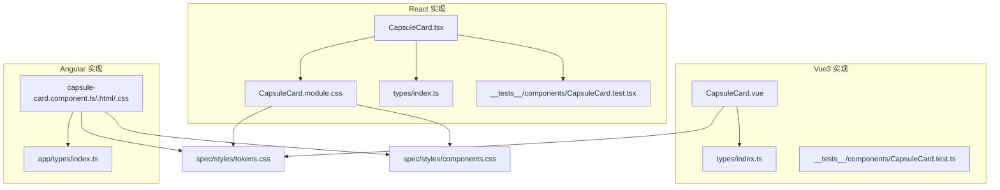
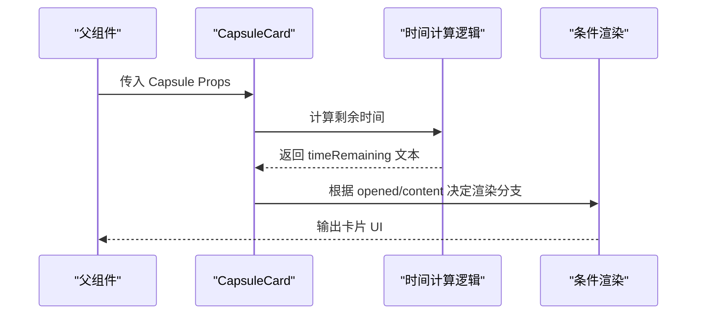
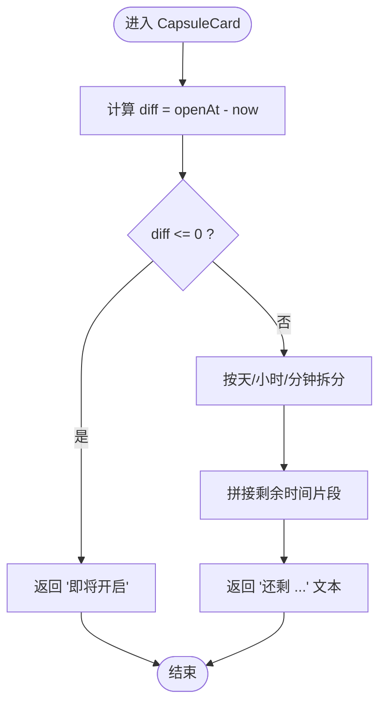
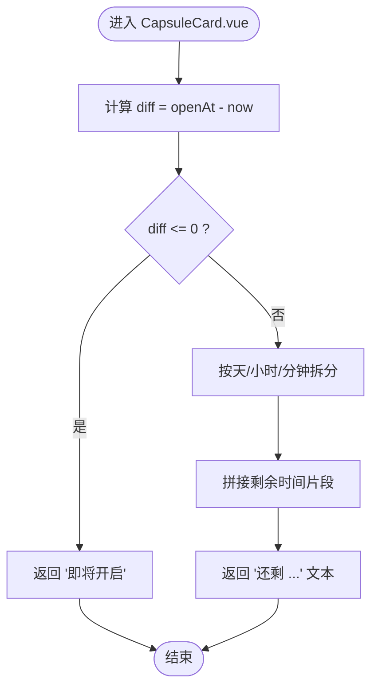
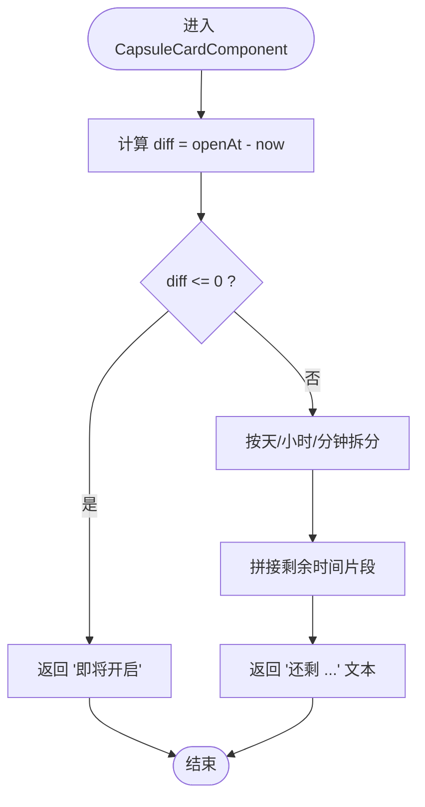
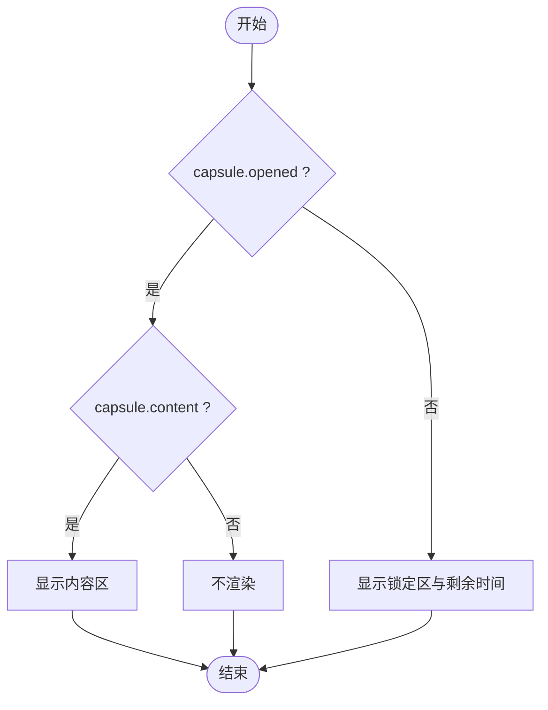
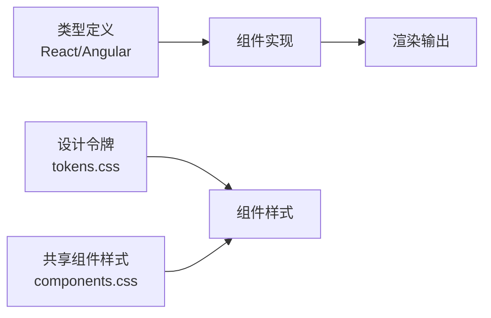

# CapsuleCard 组件设计

<cite>
**本文档引用的文件**
- [CapsuleCard.tsx](file://frontends/react-ts/src/components/CapsuleCard.tsx)
- [CapsuleCard.module.css](file://frontends/react-ts/src/components/CapsuleCard.module.css)
- [CapsuleCard.vue](file://frontends/vue3-ts/src/components/CapsuleCard.vue)
- [CapsuleCard.component.ts](file://frontends/angular-ts/src/app/components/capsule-card/capsule-card.component.ts)
- [CapsuleCard.component.html](file://frontends/angular-ts/src/app/components/capsule-card/capsule-card.component.html)
- [CapsuleCard.component.css](file://frontends/angular-ts/src/app/components/capsule-card/capsule-card.component.css)
- [CapsuleCard.test.tsx](file://frontends/react-ts/src/__tests__/components/CapsuleCard.test.tsx)
- [CapsuleCard.test.ts](file://frontends/vue3-ts/src/__tests__/components/CapsuleCard.test.ts)
- [index.ts（React 类型）](file://frontends/react-ts/src/types/index.ts)
- [index.ts（Angular 类型）](file://frontends/angular-ts/src/app/types/index.ts)
- [tokens.css](file://spec/styles/tokens.css)
- [components.css](file://spec/styles/components.css)
</cite>

## 目录
1. [简介](#简介)
2. [项目结构](#项目结构)
3. [核心组件](#核心组件)
4. [架构总览](#架构总览)
5. [详细组件分析](#详细组件分析)
6. [依赖关系分析](#依赖关系分析)
7. [性能考量](#性能考量)
8. [故障排查指南](#故障排查指南)
9. [结论](#结论)
10. [附录](#附录)

## 简介
本设计文档围绕 CapsuleCard 组件展开，系统阐述其在 React、Vue3、Angular 三种前端框架中的实现形态与共性设计。重点包括：
- 时间计算逻辑：基于开启时间与当前时间差的剩余时间计算，以及“即将开启”的边界处理
- 状态显示：通过徽章颜色与文本区分“已开启”和“未到时间”
- 条件渲染：根据 opened 与 content 的组合呈现不同 UI 状态
- 性能优化：React 中 useMemo 的使用场景与收益；Vue 中 computed 的等价优化；Angular 中 getter 的纯计算特性
- Props 接口设计与类型安全：统一的 Capsule 类型定义与可选字段处理
- CSS 模块化与样式组织：模块化样式与设计令牌的协同
- 可复用性与扩展性：跨框架一致性、可配置项与主题适配
- 使用示例与最佳实践：测试用例体现的典型使用场景

## 项目结构
CapsuleCard 在三个前端框架中均采用“组件 + 样式模块/内联样式 + 测试”的标准组织方式，并共享类型定义与设计令牌。

图表来源
- [CapsuleCard.tsx:1-66](file://frontends/react-ts/src/components/CapsuleCard.tsx#L1-L66)
- [CapsuleCard.module.css:1-33](file://frontends/react-ts/src/components/CapsuleCard.module.css#L1-L33)
- [CapsuleCard.vue:1-98](file://frontends/vue3-ts/src/components/CapsuleCard.vue#L1-L98)
- [CapsuleCard.component.ts:1-37](file://frontends/angular-ts/src/app/components/capsule-card/capsule-card.component.ts#L1-L37)
- [CapsuleCard.component.html:1-32](file://frontends/angular-ts/src/app/components/capsule-card/capsule-card.component.html#L1-L32)
- [CapsuleCard.component.css:1-76](file://frontends/angular-ts/src/app/components/capsule-card/capsule-card.component.css#L1-L76)
- [tokens.css:1-104](file://spec/styles/tokens.css#L1-L104)
- [components.css:111-162](file://spec/styles/components.css#L111-L162)

章节来源
- [CapsuleCard.tsx:1-66](file://frontends/react-ts/src/components/CapsuleCard.tsx#L1-L66)
- [CapsuleCard.vue:1-98](file://frontends/vue3-ts/src/components/CapsuleCard.vue#L1-L98)
- [CapsuleCard.component.ts:1-37](file://frontends/angular-ts/src/app/components/capsule-card/capsule-card.component.ts#L1-L37)
- [CapsuleCard.component.html:1-32](file://frontends/angular-ts/src/app/components/capsule-card/capsule-card.component.html#L1-L32)
- [CapsuleCard.component.css:1-76](file://frontends/angular-ts/src/app/components/capsule-card/capsule-card.component.css#L1-L76)
- [tokens.css:1-104](file://spec/styles/tokens.css#L1-L104)
- [components.css:111-162](file://spec/styles/components.css#L111-L162)

## 核心组件
- 组件职责：展示时间胶囊的基本信息、状态徽章、发布时间与开启时间，并根据开启状态与内容存在与否进行条件渲染
- 输入 Props：统一的 Capsule 类型，包含 code、title、content、creator、openAt、createdAt、opened 等字段
- 输出 UI：卡片式布局，包含头部徽章、元信息区、时间信息区、内容区或锁定提示区
- 关键行为：时间剩余计算、状态徽章切换、条件渲染分支

章节来源
- [CapsuleCard.tsx:5-7](file://frontends/react-ts/src/components/CapsuleCard.tsx#L5-L7)
- [CapsuleCard.vue:36-38](file://frontends/vue3-ts/src/components/CapsuleCard.vue#L36-L38)
- [CapsuleCard.component.ts:12-12](file://frontends/angular-ts/src/app/components/capsule-card/capsule-card.component.ts#L12-L12)
- [index.ts（React 类型）:10-18](file://frontends/react-ts/src/types/index.ts#L10-L18)
- [index.ts（Angular 类型）:6-14](file://frontends/angular-ts/src/app/types/index.ts#L6-L14)

## 架构总览
组件在三个框架中的交互流程一致：接收 Capsule 输入 → 计算时间剩余 → 渲染状态徽章与信息 → 条件渲染内容或锁定提示。

图表来源
- [CapsuleCard.tsx:19-31](file://frontends/react-ts/src/components/CapsuleCard.tsx#L19-L31)
- [CapsuleCard.vue:50-61](file://frontends/vue3-ts/src/components/CapsuleCard.vue#L50-L61)
- [CapsuleCard.component.ts:24-35](file://frontends/angular-ts/src/app/components/capsule-card/capsule-card.component.ts#L24-L35)

## 详细组件分析

### React 版本分析
- Props 接口：定义 capsule 为 Capsule 类型，确保类型安全
- 时间计算：使用 useMemo 缓存 timeRemaining，依赖 openAt，避免每次渲染重复计算
- 条件渲染：opened 且 content 存在时显示内容；未开启时显示锁定提示与剩余时间；否则不渲染
- 样式组织：模块化 CSS，类名通过 styles 引用，卡片宽度、间距、圆角等由设计令牌控制

图表来源
- [CapsuleCard.tsx:19-31](file://frontends/react-ts/src/components/CapsuleCard.tsx#L19-L31)

章节来源
- [CapsuleCard.tsx:1-66](file://frontends/react-ts/src/components/CapsuleCard.tsx#L1-L66)
- [CapsuleCard.module.css:1-33](file://frontends/react-ts/src/components/CapsuleCard.module.css#L1-L33)
- [CapsuleCard.test.tsx:1-46](file://frontends/react-ts/src/__tests__/components/CapsuleCard.test.tsx#L1-L46)

### Vue3 版本分析
- Props 定义：使用 defineProps 声明 capsule 类型，与 React 保持一致
- 时间计算：使用 computed 缓存 timeRemaining，依赖 props.capsule.openAt
- 条件渲染：v-if 与 v-else-if 控制内容区与锁定区的显示
- 样式组织：scoped 样式内联在组件中，遵循设计令牌命名规范

图表来源
- [CapsuleCard.vue:50-61](file://frontends/vue3-ts/src/components/CapsuleCard.vue#L50-L61)

章节来源
- [CapsuleCard.vue:1-98](file://frontends/vue3-ts/src/components/CapsuleCard.vue#L1-L98)
- [CapsuleCard.test.ts:1-41](file://frontends/vue3-ts/src/__tests__/components/CapsuleCard.test.ts#L1-L41)

### Angular 版本分析
- 输入属性：@Input({ required: true }) capsule，强制父组件传递 Capsule
- 时间计算：通过 getter timeRemaining 计算剩余时间，纯函数式逻辑
- 条件渲染：使用 Angular 结构指令 @if 与 @else if 控制分支
- 样式组织：组件样式文件独立，使用设计令牌变量，支持暗色主题

图表来源
- [CapsuleCard.component.ts:24-35](file://frontends/angular-ts/src/app/components/capsule-card/capsule-card.component.ts#L24-L35)

章节来源
- [CapsuleCard.component.ts:1-37](file://frontends/angular-ts/src/app/components/capsule-card/capsule-card.component.ts#L1-L37)
- [CapsuleCard.component.html:1-32](file://frontends/angular-ts/src/app/components/capsule-card/capsule-card.component.html#L1-L32)
- [CapsuleCard.component.css:1-76](file://frontends/angular-ts/src/app/components/capsule-card/capsule-card.component.css#L1-L76)

### Props 接口设计与类型安全
- Capsule 类型统一定义于各框架的 types 目录，字段包含 code、title、content（可选）、creator、openAt、createdAt、opened（可选）
- React 与 Angular 的类型定义保持一致，确保跨框架调用的一致性
- content 支持 null/undefined，用于表示未到开启时间的内容占位

章节来源
- [index.ts（React 类型）:10-18](file://frontends/react-ts/src/types/index.ts#L10-L18)
- [index.ts（Angular 类型）:6-14](file://frontends/angular-ts/src/app/types/index.ts#L6-L14)

### 条件渲染逻辑
- 已开启且有内容：显示内容区域
- 未到时间：显示锁定提示与剩余时间
- 其他情况：不渲染内容区

图表来源
- [CapsuleCard.tsx:52-62](file://frontends/react-ts/src/components/CapsuleCard.tsx#L52-L62)
- [CapsuleCard.vue:20-28](file://frontends/vue3-ts/src/components/CapsuleCard.vue#L20-L28)
- [CapsuleCard.component.html:19-30](file://frontends/angular-ts/src/app/components/capsule-card/capsule-card.component.html#L19-L30)

### CSS 模块化与类名管理
- React：模块化样式通过 styles 引用，卡片宽度、间距、圆角等使用设计令牌变量
- Vue：scoped 样式内联在组件中，语义化类名如 capsule-content、capsule-locked
- Angular：组件样式文件独立，使用 .card、.badge、.capsule-* 等类名，配合 tokens.css 的设计令牌

章节来源
- [CapsuleCard.module.css:1-33](file://frontends/react-ts/src/components/CapsuleCard.module.css#L1-L33)
- [CapsuleCard.vue:64-97](file://frontends/vue3-ts/src/components/CapsuleCard.vue#L64-L97)
- [CapsuleCard.component.css:1-76](file://frontends/angular-ts/src/app/components/capsule-card/capsule-card.component.css#L1-L76)
- [tokens.css:1-104](file://spec/styles/tokens.css#L1-L104)
- [components.css:111-162](file://spec/styles/components.css#L111-L162)

### 可复用性与扩展性
- 跨框架一致性：三端实现共享同一 Props 接口与时间计算逻辑，便于在多框架间迁移与复用
- 主题适配：设计令牌集中管理，支持浅色/深色主题切换
- 可扩展点：可通过新增 Props（如自定义徽章文案、样式主题）扩展组件能力；内容区可进一步抽象为插槽/作用域插槽

## 依赖关系分析
- 组件依赖：各框架的类型定义、设计令牌、共享组件样式
- 性能依赖：React 的 useMemo、Vue 的 computed、Angular 的 getter 都用于缓存纯计算结果
- 样式依赖：模块化样式与设计令牌耦合，保证视觉一致性

图表来源
- [index.ts（React 类型）:10-18](file://frontends/react-ts/src/types/index.ts#L10-L18)
- [index.ts（Angular 类型）:6-14](file://frontends/angular-ts/src/app/types/index.ts#L6-L14)
- [tokens.css:1-104](file://spec/styles/tokens.css#L1-L104)
- [components.css:111-162](file://spec/styles/components.css#L111-L162)

章节来源
- [index.ts（React 类型）:10-18](file://frontends/react-ts/src/types/index.ts#L10-L18)
- [index.ts（Angular 类型）:6-14](file://frontends/angular-ts/src/app/types/index.ts#L6-L14)
- [tokens.css:1-104](file://spec/styles/tokens.css#L1-L104)
- [components.css:111-162](file://spec/styles/components.css#L111-L162)

## 性能考量
- React：使用 useMemo 缓存 timeRemaining，依赖 openAt，避免每次渲染重新计算时间差与字符串拼接
- Vue：使用 computed 缓存 timeRemaining，依赖 props.capsule.openAt，具备自动失效与重算机制
- Angular：使用 getter 计算 timeRemaining，纯函数式逻辑，结合变更检测策略减少不必要的重算
- 优化收益：在大量列表渲染或频繁更新场景下，显著降低 CPU 占用与重排开销

章节来源
- [CapsuleCard.tsx:19-31](file://frontends/react-ts/src/components/CapsuleCard.tsx#L19-L31)
- [CapsuleCard.vue:50-61](file://frontends/vue3-ts/src/components/CapsuleCard.vue#L50-L61)
- [CapsuleCard.component.ts:24-35](file://frontends/angular-ts/src/app/components/capsule-card/capsule-card.component.ts#L24-L35)

## 故障排查指南
- 时间显示异常：检查 openAt 与 createdAt 的 ISO 8601 格式是否正确；确认本地时区设置对 formatTime 的影响
- 条件渲染不生效：核对 capsule.opened 与 capsule.content 的布尔值；确认条件判断分支
- 样式错乱：检查模块化样式类名是否正确引入；确认 tokens.css 与 components.css 的加载顺序
- 测试用例参考：通过单元测试验证“已开启含内容”和“未到时间无内容”的渲染行为

章节来源
- [CapsuleCard.test.tsx:6-44](file://frontends/react-ts/src/__tests__/components/CapsuleCard.test.tsx#L6-L44)
- [CapsuleCard.test.ts:25-39](file://frontends/vue3-ts/src/__tests__/components/CapsuleCard.test.ts#L25-L39)

## 结论
CapsuleCard 组件在 React、Vue3、Angular 三端实现了高度一致的功能与体验：统一的 Props 接口、稳定的条件渲染策略、高效的纯计算缓存与模块化样式组织。通过设计令牌与共享组件样式，组件具备良好的主题适配与可维护性。建议在实际业务中优先采用此模式，以提升跨框架一致性与开发效率。

## 附录
- 使用示例与最佳实践
  - 已开启且有内容：父组件传入 opened=true 且 content 非空，组件将显示完整内容区
  - 未到时间：传入 opened=false 且 content 为空，组件显示锁定提示与剩余时间
  - 最佳实践：确保 openAt 与 createdAt 为合法 ISO 8601 字符串；在列表场景中利用缓存避免重复计算；通过设计令牌统一视觉风格

章节来源
- [CapsuleCard.test.tsx:6-44](file://frontends/react-ts/src/__tests__/components/CapsuleCard.test.tsx#L6-L44)
- [CapsuleCard.test.ts:25-39](file://frontends/vue3-ts/src/__tests__/components/CapsuleCard.test.ts#L25-L39)
- [CapsuleCard.tsx:19-31](file://frontends/react-ts/src/components/CapsuleCard.tsx#L19-L31)
- [CapsuleCard.vue:50-61](file://frontends/vue3-ts/src/components/CapsuleCard.vue#L50-L61)
- [CapsuleCard.component.ts:24-35](file://frontends/angular-ts/src/app/components/capsule-card/capsule-card.component.ts#L24-L35)