# CapsuleForm 表单组件

<cite>
**本文档引用的文件**
- [CapsuleForm.tsx](file://frontends/react-ts/src/components/CapsuleForm.tsx)
- [CapsuleForm.vue](file://frontends/vue3-ts/src/components/CapsuleForm.vue)
- [capsule-form.component.ts](file://frontends/angular-ts/src/app/components/capsule-form/capsule-form.component.ts)
- [index.ts](file://frontends/react-ts/src/types/index.ts)
- [index.ts](file://frontends/vue3-ts/src/types/index.ts)
- [index.ts](file://frontends/angular-ts/src/app/types/index.ts)
- [CreateView.tsx](file://frontends/react-ts/src/views/CreateView.tsx)
- [CreateView.vue](file://frontends/vue3-ts/src/views/CreateView.vue)
- [create.component.ts](file://frontends/angular-ts/src/app/views/create/create.component.ts)
- [CapsuleForm.test.tsx](file://frontends/react-ts/src/__tests__/components/CapsuleForm.test.tsx)
- [CapsuleForm.test.ts](file://frontends/vue3-ts/src/__tests__/components/CapsuleForm.test.ts)
- [capsule-form.component.spec.ts](file://frontends/angular-ts/src/__tests__/components/capsule-form.component.spec.ts)
- [CapsuleForm.module.css](file://frontends/react-ts/src/components/CapsuleForm.module.css)
</cite>

## 目录
1. [简介](#简介)
2. [项目结构](#项目结构)
3. [核心组件](#核心组件)
4. [架构概览](#架构概览)
5. [详细组件分析](#详细组件分析)
6. [依赖关系分析](#依赖关系分析)
7. [性能考虑](#性能考虑)
8. [故障排除指南](#故障排除指南)
9. [结论](#结论)
10. [附录](#附录)

## 简介

CapsuleForm 是一个跨框架的表单组件，支持 React、Vue 3 和 Angular 三个主流前端框架。该组件用于创建时间胶囊，提供用户友好的界面来输入胶囊的基本信息，包括标题、内容、创建者和开启时间。

该组件实现了完整的表单数据绑定、验证逻辑和提交流程，具有以下特点：
- 支持三种主流前端框架的统一实现
- 实时数据绑定和双向数据流
- 完整的表单验证机制
- 异步提交和错误处理
- 响应式设计和主题适配

## 项目结构

CapsuleForm 组件采用跨框架架构设计，每个框架都有独立的实现版本：

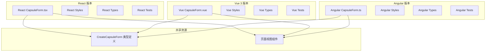

**图表来源**
- [CapsuleForm.tsx:1-130](file://frontends/react-ts/src/components/CapsuleForm.tsx#L1-L130)
- [CapsuleForm.vue:1-165](file://frontends/vue3-ts/src/components/CapsuleForm.vue#L1-L165)
- [capsule-form.component.ts:1-68](file://frontends/angular-ts/src/app/components/capsule-form/capsule-form.component.ts#L1-L68)

**章节来源**
- [CapsuleForm.tsx:1-130](file://frontends/react-ts/src/components/CapsuleForm.tsx#L1-L130)
- [CapsuleForm.vue:1-165](file://frontends/vue3-ts/src/components/CapsuleForm.vue#L1-L165)
- [capsule-form.component.ts:1-68](file://frontends/angular-ts/src/app/components/capsule-form/capsule-form.component.ts#L1-L68)

## 核心组件

### 数据模型定义

所有版本的 CapsuleForm 都使用相同的 CreateCapsuleForm 类型定义：

| 字段名 | 类型 | 必填 | 最大长度 | 描述 |
|--------|------|------|----------|------|
| title | string | 是 | 100字符 | 胶囊标题 |
| content | string | 是 | 无限制 | 胶囊内容 |
| creator | string | 是 | 30字符 | 创建者昵称 |
| openAt | string | 是 | ISO日期字符串 | 开启时间 |

### 表单字段配置

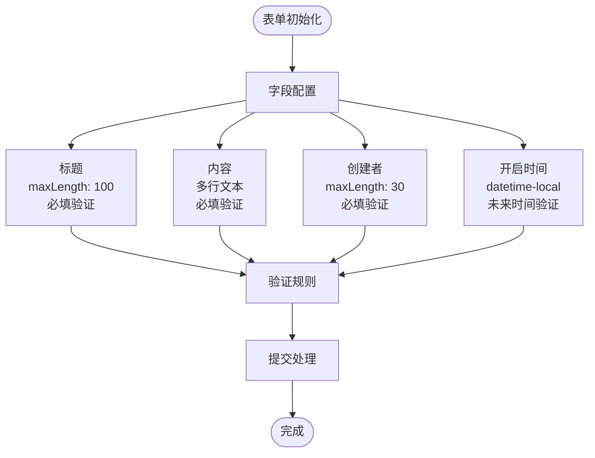

**图表来源**
- [CapsuleForm.tsx:10-129](file://frontends/react-ts/src/components/CapsuleForm.tsx#L10-L129)
- [CapsuleForm.vue:75-87](file://frontends/vue3-ts/src/components/CapsuleForm.vue#L75-L87)
- [capsule-form.component.ts:16-21](file://frontends/angular-ts/src/app/components/capsule-form/capsule-form.component.ts#L16-L21)

**章节来源**
- [index.ts:24-29](file://frontends/react-ts/src/types/index.ts#L24-L29)
- [index.ts:24-29](file://frontends/vue3-ts/src/types/index.ts#L24-L29)
- [index.ts:16-21](file://frontends/angular-ts/src/app/types/index.ts#L16-L21)

## 架构概览

CapsuleForm 采用组件化架构，每个框架版本都遵循相似的设计模式：

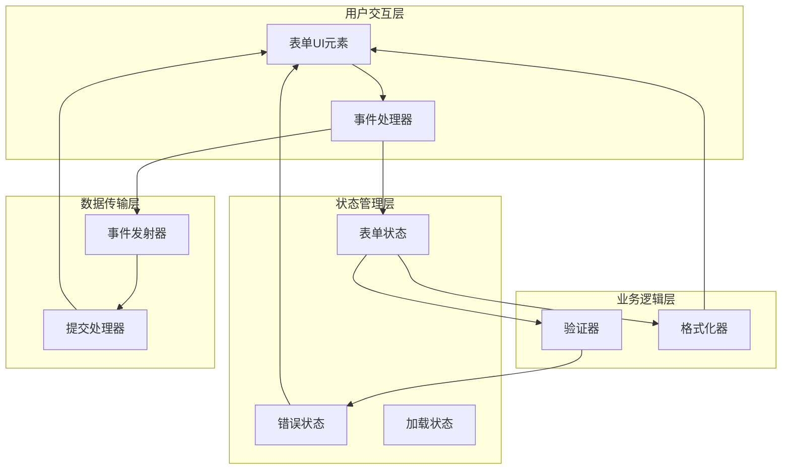

**图表来源**
- [CapsuleForm.tsx:10-62](file://frontends/react-ts/src/components/CapsuleForm.tsx#L10-L62)
- [CapsuleForm.vue:75-128](file://frontends/vue3-ts/src/components/CapsuleForm.vue#L75-L128)
- [capsule-form.component.ts:12-66](file://frontends/angular-ts/src/app/components/capsule-form/capsule-form.component.ts#L12-L66)

## 详细组件分析

### React 版本实现

React 版本使用函数组件和 Hooks 实现，提供了完整的状态管理和生命周期控制。

#### 状态管理策略

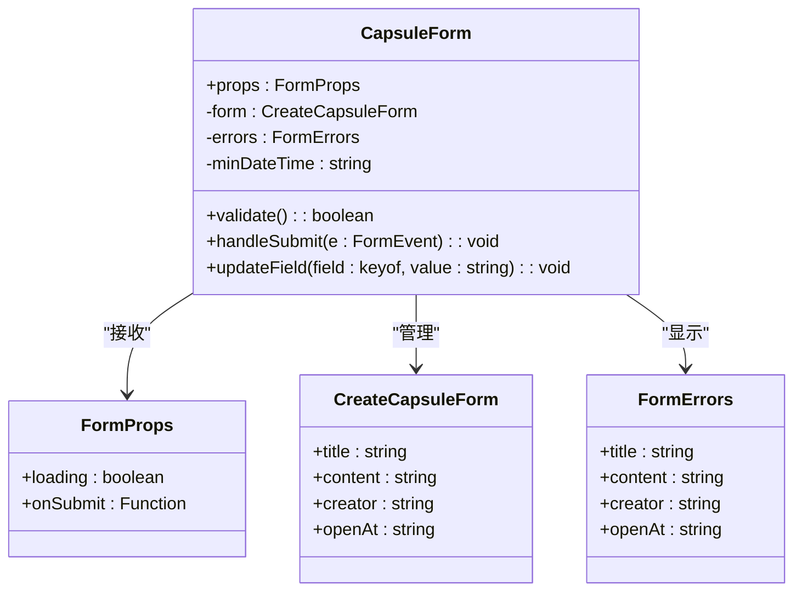

**图表来源**
- [CapsuleForm.tsx:5-8](file://frontends/react-ts/src/components/CapsuleForm.tsx#L5-L8)
- [CapsuleForm.tsx:10-22](file://frontends/react-ts/src/components/CapsuleForm.tsx#L10-L22)

#### 表单验证流程

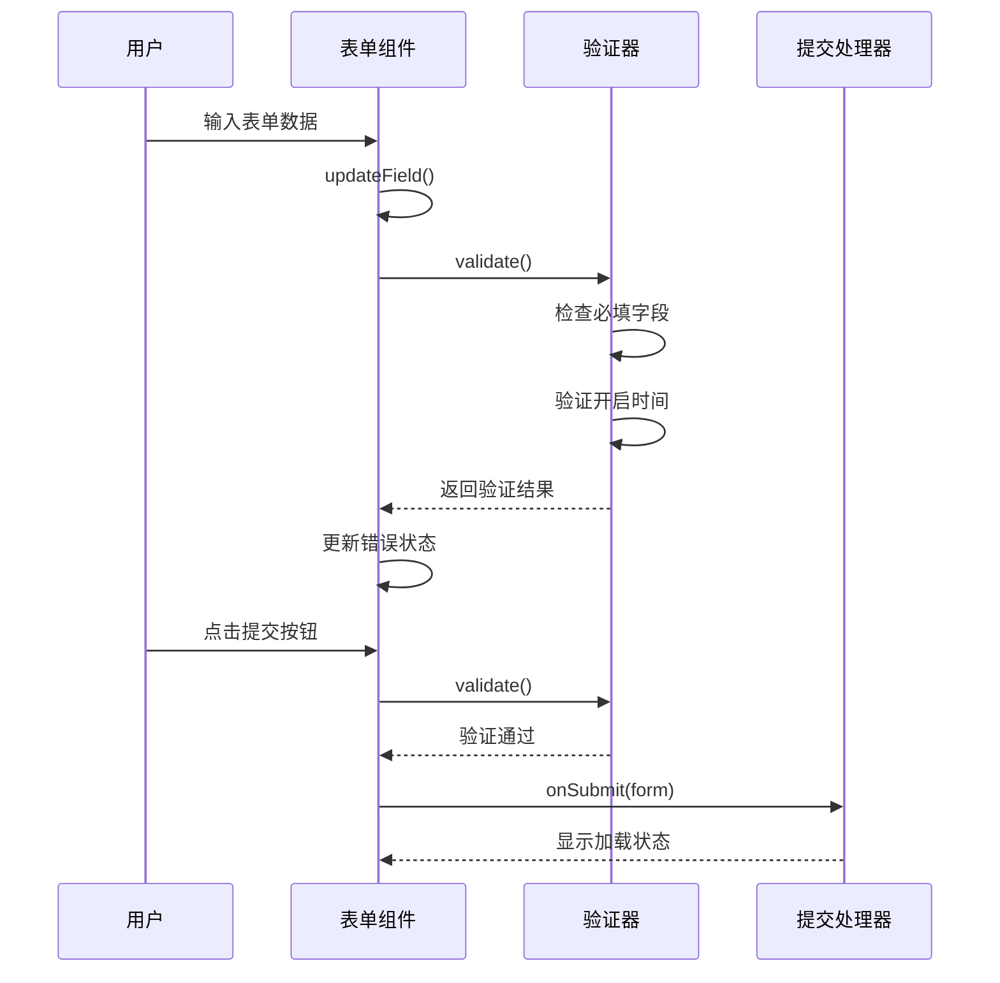

**图表来源**
- [CapsuleForm.tsx:30-62](file://frontends/react-ts/src/components/CapsuleForm.tsx#L30-L62)
- [CapsuleForm.tsx:64-66](file://frontends/react-ts/src/components/CapsuleForm.tsx#L64-L66)

**章节来源**
- [CapsuleForm.tsx:1-130](file://frontends/react-ts/src/components/CapsuleForm.tsx#L1-L130)

### Vue 3 版本实现

Vue 3 版本使用 Composition API 实现，提供了响应式的状态管理和计算属性。

#### 响应式数据绑定

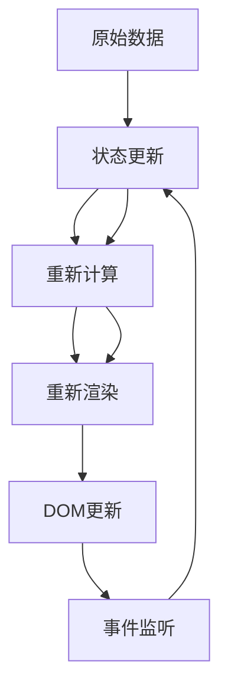

**图表来源**
- [CapsuleForm.vue:75-93](file://frontends/vue3-ts/src/components/CapsuleForm.vue#L75-L93)

#### 事件处理机制

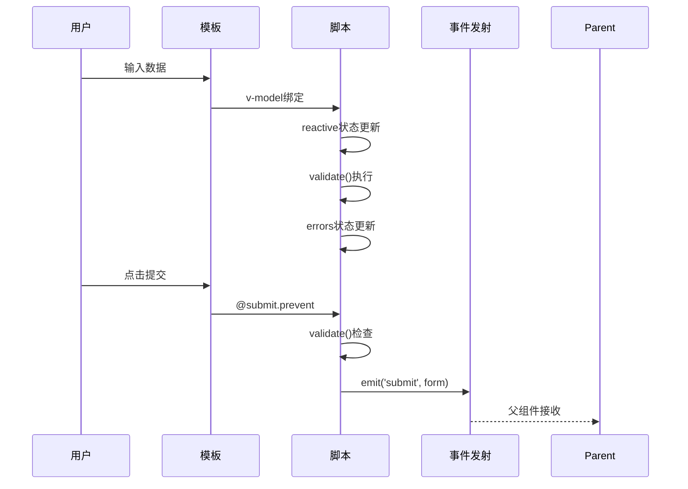

**图表来源**
- [CapsuleForm.vue:63-128](file://frontends/vue3-ts/src/components/CapsuleForm.vue#L63-L128)

**章节来源**
- [CapsuleForm.vue:1-165](file://frontends/vue3-ts/src/components/CapsuleForm.vue#L1-L165)

### Angular 版本实现

Angular 版本使用组件架构，结合了表单模块和响应式编程模式。

#### 组件架构设计

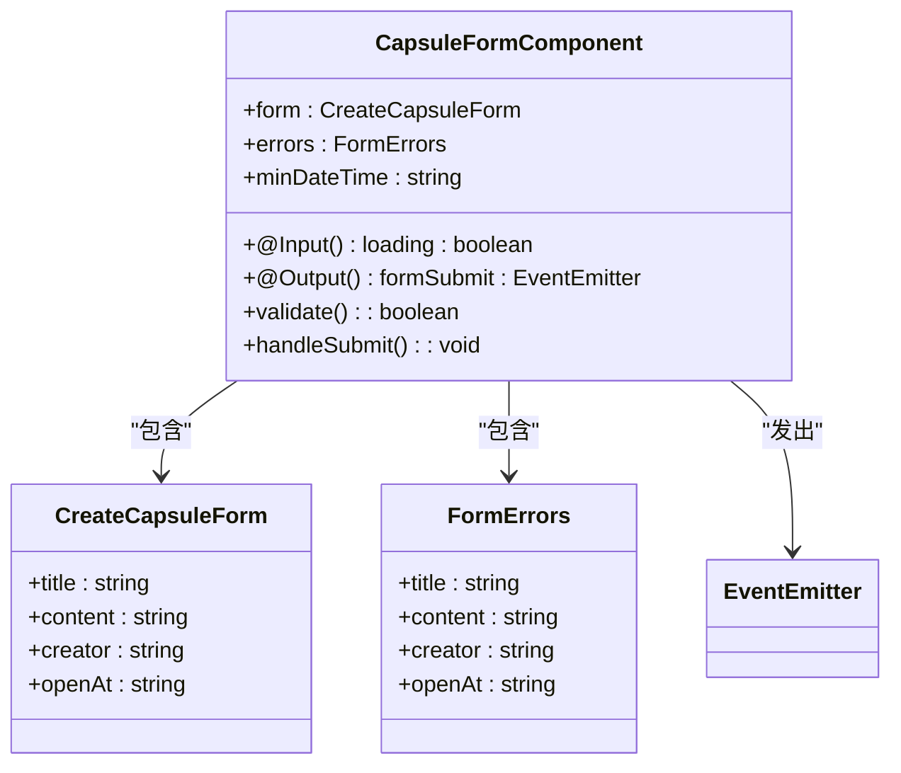

**图表来源**
- [capsule-form.component.ts:5-14](file://frontends/angular-ts/src/app/components/capsule-form/capsule-form.component.ts#L5-L14)

**章节来源**
- [capsule-form.component.ts:1-68](file://frontends/angular-ts/src/app/components/capsule-form/capsule-form.component.ts#L1-L68)

## 依赖关系分析

### 跨框架一致性

三个框架版本在功能上保持高度一致，但在实现细节上有显著差异：

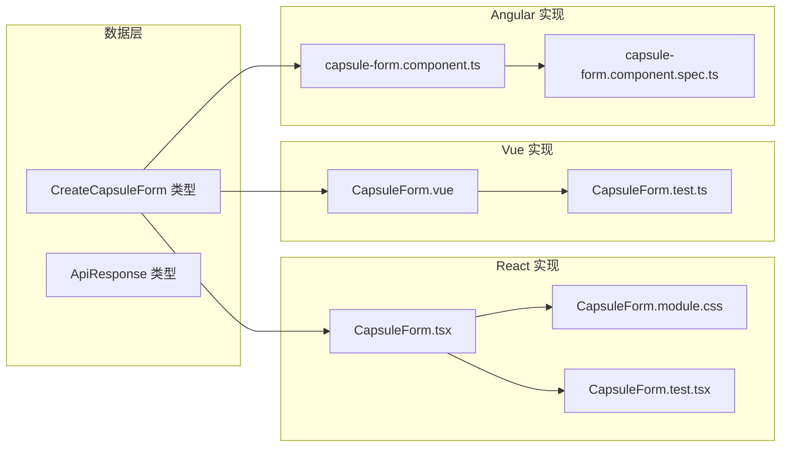

**图表来源**
- [index.ts:24-29](file://frontends/react-ts/src/types/index.ts#L24-L29)
- [index.ts:24-29](file://frontends/vue3-ts/src/types/index.ts#L24-L29)
- [index.ts:16-21](file://frontends/angular-ts/src/app/types/index.ts#L16-L21)

### 使用场景集成

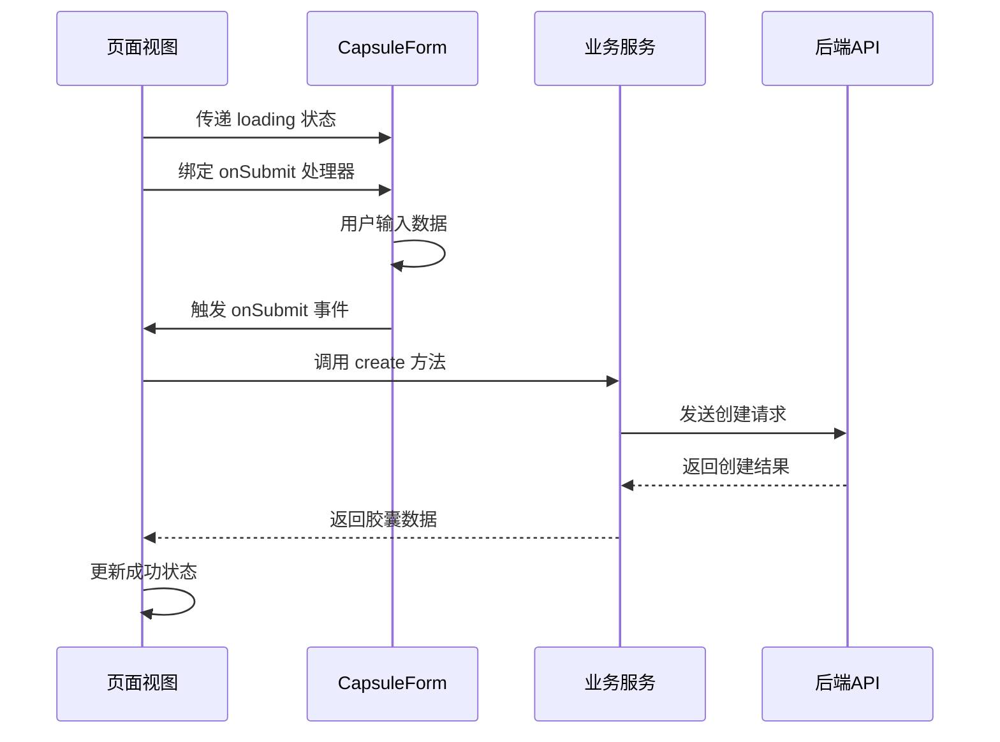

**图表来源**
- [CreateView.tsx:9-29](file://frontends/react-ts/src/views/CreateView.tsx#L9-L29)
- [CreateView.vue:36-62](file://frontends/vue3-ts/src/views/CreateView.vue#L36-L62)
- [create.component.ts:16-42](file://frontends/angular-ts/src/app/views/create/create.component.ts#L16-L42)

**章节来源**
- [CreateView.tsx:1-74](file://frontends/react-ts/src/views/CreateView.tsx#L1-L74)
- [CreateView.vue:1-106](file://frontends/vue3-ts/src/views/CreateView.vue#L1-L106)
- [create.component.ts:1-54](file://frontends/angular-ts/src/app/views/create/create.component.ts#L1-L54)

## 性能考虑

### 渲染优化策略

1. **最小化重渲染**
   - React: 使用 useMemo 优化 minDateTime 计算
   - Vue: 使用 computed 属性缓存计算值
   - Angular: 使用 getter 方法缓存计算值

2. **事件处理优化**
   - 避免在渲染过程中创建新函数
   - 使用稳定的事件处理器引用

3. **内存管理**
   - 及时清理事件监听器
   - 避免内存泄漏

### 验证性能优化

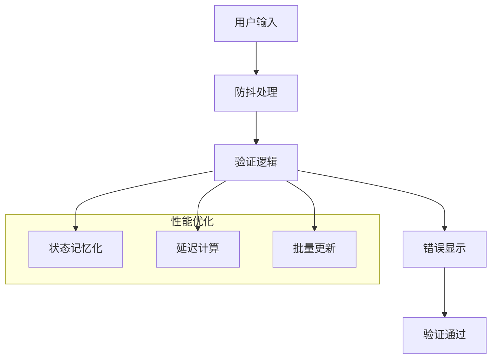

## 故障排除指南

### 常见问题诊断

#### 表单验证失败

**症状**: 提交按钮无法点击或出现错误提示
**解决方案**:
1. 检查必填字段是否为空
2. 验证开启时间是否在未来
3. 确认输入格式符合要求

#### 加载状态异常

**症状**: 提交按钮一直处于禁用状态
**解决方案**:
1. 确保父组件正确传递 loading 状态
2. 检查异步操作是否正确处理
3. 验证错误状态是否被正确清除

#### 数据绑定问题

**症状**: 输入框无法正常更新或显示错误数据
**解决方案**:
1. 检查 v-model 或 value 绑定
2. 确认事件处理器正确更新状态
3. 验证类型定义的一致性

**章节来源**
- [CapsuleForm.test.tsx:16-25](file://frontends/react-ts/src/__tests__/components/CapsuleForm.test.tsx#L16-L25)
- [CapsuleForm.test.ts:16-25](file://frontends/vue3-ts/src/__tests__/components/CapsuleForm.test.ts#L16-L25)
- [capsule-form.component.spec.ts:22-29](file://frontends/angular-ts/src/__tests__/components/capsule-form.component.spec.ts#L22-L29)

## 结论

CapsuleForm 表单组件是一个设计精良的跨框架组件，具有以下优势：

1. **一致性**: 三个框架版本在功能和用户体验上保持高度一致
2. **可维护性**: 清晰的架构设计和标准化的实现模式
3. **可扩展性**: 良好的抽象层次支持自定义验证规则
4. **可测试性**: 完整的单元测试覆盖关键功能

该组件为时间胶囊创建功能提供了可靠的前端基础，支持异步处理、错误处理和响应式设计等现代前端开发的最佳实践。

## 附录

### 自定义验证规则扩展

组件支持通过以下方式扩展验证规则：

1. **添加新的验证条件**
   - 在 validate 方法中添加新的检查逻辑
   - 更新错误状态对象以显示相应的错误信息

2. **修改现有验证规则**
   - 调整验证条件的严格程度
   - 修改错误消息的内容和格式

3. **添加国际化支持**
   - 将错误消息存储在配置文件中
   - 支持多语言环境下的本地化

### 最佳实践建议

1. **表单设计**
   - 提供清晰的错误提示和帮助信息
   - 实现适当的输入限制和格式化
   - 确保移动端的良好体验

2. **性能优化**
   - 使用适当的防抖和节流机制
   - 优化渲染性能和内存使用
   - 实现合理的缓存策略

3. **用户体验**
   - 提供实时反馈和加载指示
   - 实现优雅的错误处理和恢复
   - 支持键盘导航和无障碍访问