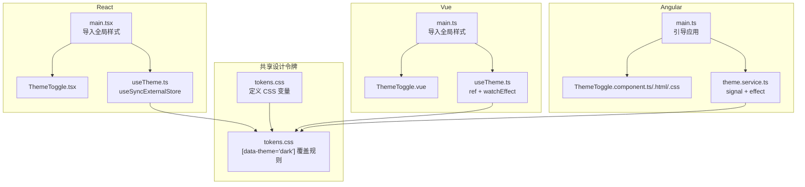
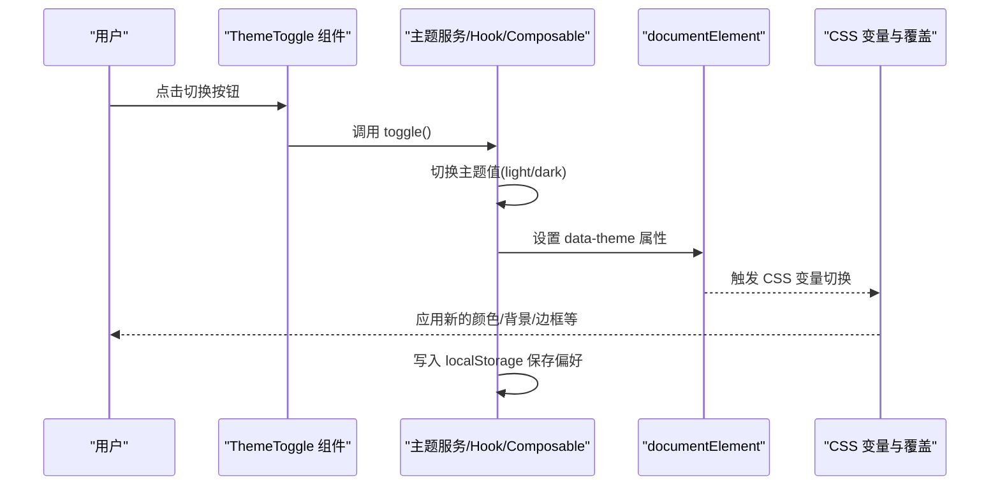
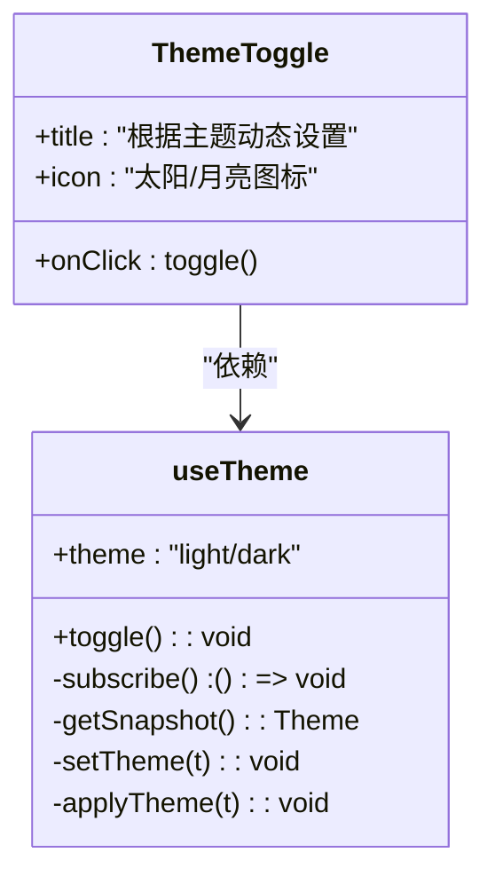
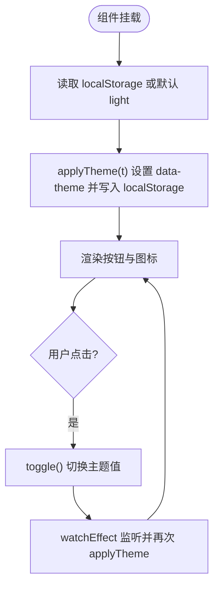
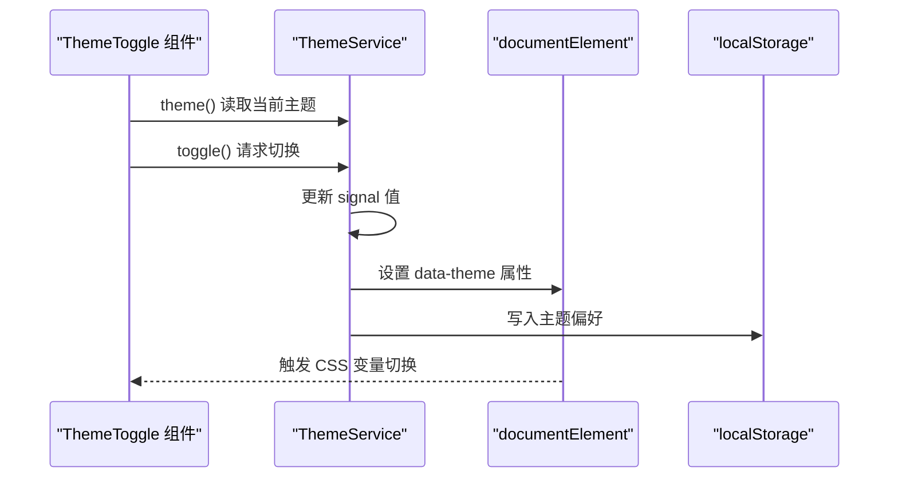
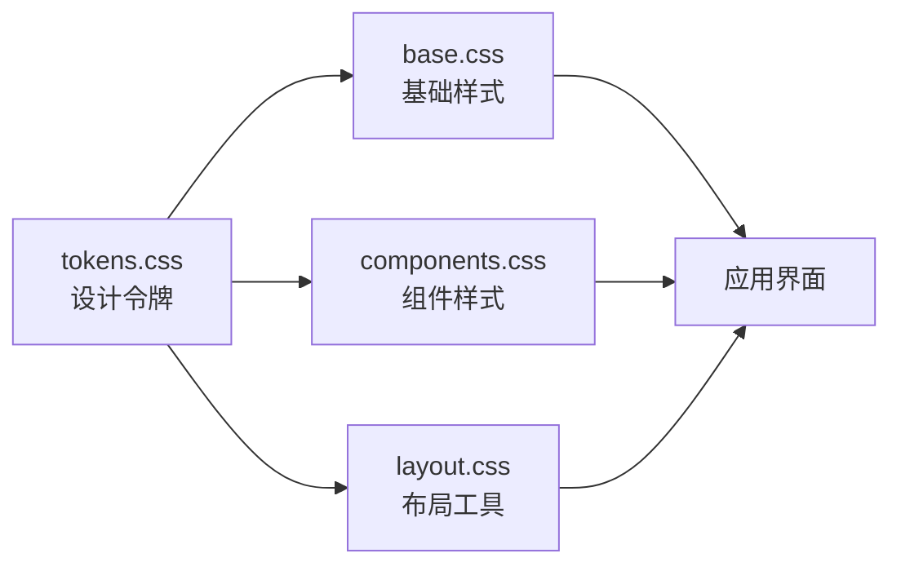
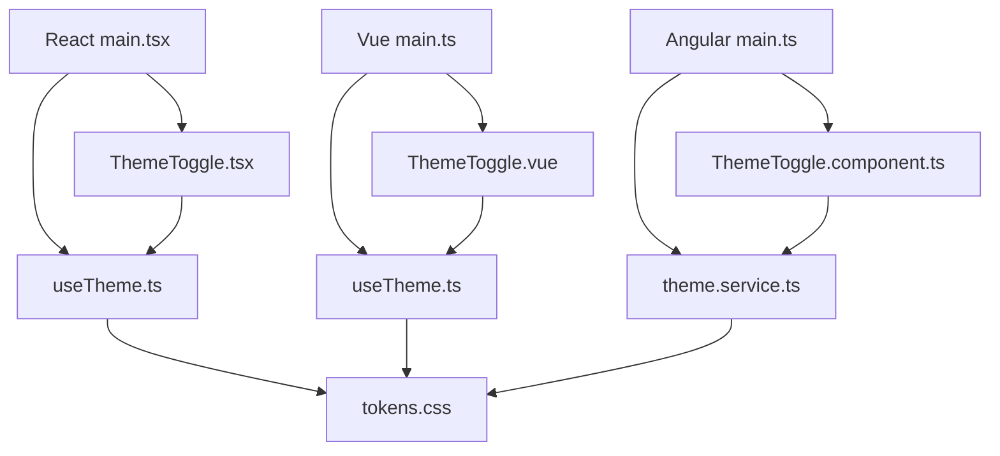

# ThemeToggle 主题切换组件

<cite>
**本文档引用的文件**
- [ThemeToggle.tsx](file://frontends/react-ts/src/components/ThemeToggle.tsx)
- [useTheme.ts](file://frontends/react-ts/src/hooks/useTheme.ts)
- [ThemeToggle.module.css](file://frontends/react-ts/src/components/ThemeToggle.module.css)
- [ThemeToggle.vue](file://frontends/vue3-ts/src/components/ThemeToggle.vue)
- [useTheme.ts](file://frontends/vue3-ts/src/composables/useTheme.ts)
- [ThemeToggle.component.ts](file://frontends/angular-ts/src/app/components/theme-toggle/theme-toggle.component.ts)
- [ThemeToggle.component.html](file://frontends/angular-ts/src/app/components/theme-toggle/theme-toggle.component.html)
- [ThemeToggle.component.css](file://frontends/angular-ts/src/app/components/theme-toggle/theme-toggle.component.css)
- [theme.service.ts](file://frontends/angular-ts/src/app/services/theme.service.ts)
- [tokens.css](file://spec/styles/tokens.css)
- [base.css](file://spec/styles/base.css)
- [components.css](file://spec/styles/components.css)
- [layout.css](file://spec/styles/layout.css)
- [main.tsx](file://frontends/react-ts/src/main.tsx)
- [main.ts](file://frontends/vue3-ts/src/main.ts)
- [main.ts](file://frontends/angular-ts/src/main.ts)
</cite>

## 目录
1. [简介](#简介)
2. [项目结构](#项目结构)
3. [核心组件](#核心组件)
4. [架构总览](#架构总览)
5. [详细组件分析](#详细组件分析)
6. [依赖关系分析](#依赖关系分析)
7. [性能考量](#性能考量)
8. [故障排除指南](#故障排除指南)
9. [结论](#结论)
10. [附录](#附录)

## 简介
本设计文档围绕 ThemeToggle 主题切换组件展开，系统性阐述主题状态的持久化存储机制（localStorage）、主题切换的实现逻辑（明暗主题切换动画、CSS 变量应用、全局样式更新）、组件状态管理策略与 useEffect/useSyncExternalStore 的使用场景、主题切换对应用的影响范围与样式覆盖机制、用户体验与无障碍访问支持、扩展性与自定义主题方案，以及完整的使用示例与最佳实践。

## 项目结构
主题系统采用“共享设计令牌 + 组件封装”的分层架构：
- 共享设计令牌：通过 CSS 变量集中定义颜色、排版、间距、圆角、阴影、过渡等设计令牌，并在暗色模式下通过[data-theme="dark"]进行覆盖。
- 组件层：React/Vue/Angular 分别提供 ThemeToggle 组件，内部调用各自的状态管理（Hook/Composable/Service）。
- 状态管理层：各框架的状态管理模块负责读取/写入 localStorage、设置 documentElement 的 data-theme 属性，并驱动全局 CSS 变量生效。
- 全局样式层：base.css、components.css、layout.css 通过 CSS 变量与[data-theme]选择器实现主题切换。

**图表来源**
- [main.tsx:9-13](file://frontends/react-ts/src/main.tsx#L9-L13)
- [main.ts:10-13](file://frontends/vue3-ts/src/main.ts#L10-L13)
- [ThemeToggle.tsx:1-17](file://frontends/react-ts/src/components/ThemeToggle.tsx#L1-L17)
- [useTheme.ts:1-48](file://frontends/react-ts/src/hooks/useTheme.ts#L1-L48)
- [ThemeToggle.vue:1-34](file://frontends/vue3-ts/src/components/ThemeToggle.vue#L1-L34)
- [useTheme.ts:1-57](file://frontends/vue3-ts/src/composables/useTheme.ts#L1-L57)
- [ThemeToggle.component.ts:1-14](file://frontends/angular-ts/src/app/components/theme-toggle/theme-toggle.component.ts#L1-L14)
- [theme.service.ts:1-28](file://frontends/angular-ts/src/app/services/theme.service.ts#L1-L28)
- [tokens.css:1-104](file://spec/styles/tokens.css#L1-L104)

**章节来源**
- [main.tsx:9-13](file://frontends/react-ts/src/main.tsx#L9-L13)
- [main.ts:10-13](file://frontends/vue3-ts/src/main.ts#L10-L13)
- [tokens.css:1-104](file://spec/styles/tokens.css#L1-L104)

## 核心组件
- React: ThemeToggle.tsx 作为展示组件，依赖 useTheme Hook 获取当前主题与切换函数；useTheme.ts 使用 useSyncExternalStore 实现跨组件共享与订阅。
- Vue: ThemeToggle.vue 作为展示组件，依赖 useTheme 组合式函数；useTheme.ts 使用 ref + watchEffect 实现响应式与副作用。
- Angular: ThemeToggle 组件通过 ThemeService 提供的主题信号与切换方法实现；ThemeService 使用 signal + effect 管理状态并持久化。

关键特性：
- 持久化：均通过 localStorage 存储用户偏好的主题值。
- DOM 同步：在 documentElement 上设置 data-theme 属性，驱动 CSS 变量切换。
- 全局样式：base.css、components.css、layout.css 通过 CSS 变量与[data-theme]选择器实现主题覆盖。

**章节来源**
- [ThemeToggle.tsx:1-17](file://frontends/react-ts/src/components/ThemeToggle.tsx#L1-L17)
- [useTheme.ts:1-48](file://frontends/react-ts/src/hooks/useTheme.ts#L1-L48)
- [ThemeToggle.vue:1-34](file://frontends/vue3-ts/src/components/ThemeToggle.vue#L1-L34)
- [useTheme.ts:1-57](file://frontends/vue3-ts/src/composables/useTheme.ts#L1-L57)
- [ThemeToggle.component.ts:1-14](file://frontends/angular-ts/src/app/components/theme-toggle/theme-toggle.component.ts#L1-L14)
- [theme.service.ts:1-28](file://frontends/angular-ts/src/app/services/theme.service.ts#L1-L28)

## 架构总览
主题切换的端到端流程如下：

**图表来源**
- [ThemeToggle.tsx:4-16](file://frontends/react-ts/src/components/ThemeToggle.tsx#L4-L16)
- [useTheme.ts:39-47](file://frontends/react-ts/src/hooks/useTheme.ts#L39-L47)
- [ThemeToggle.vue:1-12](file://frontends/vue3-ts/src/components/ThemeToggle.vue#L1-L12)
- [useTheme.ts:46-56](file://frontends/vue3-ts/src/composables/useTheme.ts#L46-L56)
- [ThemeToggle.component.ts:1-14](file://frontends/angular-ts/src/app/components/theme-toggle/theme-toggle.component.ts#L1-L14)
- [theme.service.ts:24-26](file://frontends/angular-ts/src/app/services/theme.service.ts#L24-L26)
- [tokens.css:82-103](file://spec/styles/tokens.css#L82-L103)

## 详细组件分析

### React: ThemeToggle 与 useTheme
- 组件职责：渲染按钮、绑定点击事件、根据当前主题显示不同图标、提供标题提示。
- 状态管理：useTheme 返回当前主题与 toggle 方法；toggle 基于 useSyncExternalStore 订阅外部状态并在切换时通知所有订阅者。
- 持久化与同步：applyTheme 将主题写入 localStorage 并设置 documentElement 的 data-theme 属性，确保全局 CSS 变量生效。
- 样式：使用模块化 CSS，基于 CSS 变量实现圆角、背景色、悬停效果与过渡动画。

**图表来源**
- [ThemeToggle.tsx:4-16](file://frontends/react-ts/src/components/ThemeToggle.tsx#L4-L16)
- [useTheme.ts:39-47](file://frontends/react-ts/src/hooks/useTheme.ts#L39-L47)

**章节来源**
- [ThemeToggle.tsx:1-17](file://frontends/react-ts/src/components/ThemeToggle.tsx#L1-L17)
- [useTheme.ts:1-48](file://frontends/react-ts/src/hooks/useTheme.ts#L1-L48)
- [ThemeToggle.module.css:1-19](file://frontends/react-ts/src/components/ThemeToggle.module.css#L1-L19)

### Vue: ThemeToggle 与 useTheme
- 组件职责：模板中根据主题条件渲染不同图标，绑定点击事件调用 useTheme.togg。
- 状态管理：useTheme 使用 ref 保存主题状态，watchEffect 监听变化后调用 applyTheme；初始化时同样设置 data-theme 并写入 localStorage。
- 样式：scoped CSS，使用 CSS 变量实现统一的尺寸、圆角、过渡与悬停效果。

**图表来源**
- [ThemeToggle.vue:1-12](file://frontends/vue3-ts/src/components/ThemeToggle.vue#L1-L12)
- [useTheme.ts:13-38](file://frontends/vue3-ts/src/composables/useTheme.ts#L13-L38)

**章节来源**
- [ThemeToggle.vue:1-34](file://frontends/vue3-ts/src/components/ThemeToggle.vue#L1-L34)
- [useTheme.ts:1-57](file://frontends/vue3-ts/src/composables/useTheme.ts#L1-L57)

### Angular: ThemeToggle 与 ThemeService
- 组件职责：模板中根据主题信号动态显示图标，点击时调用 ThemeService.toggle()。
- 状态管理：ThemeService 使用 signal 保存主题，effect 监听主题变化并设置 data-theme 与 localStorage。
- 样式：组件本地样式，使用 CSS 变量实现边框、圆角、过渡与悬停效果。

**图表来源**
- [ThemeToggle.component.html:1-12](file://frontends/angular-ts/src/app/components/theme-toggle/theme-toggle.component.html#L1-L12)
- [theme.service.ts:10-26](file://frontends/angular-ts/src/app/services/theme.service.ts#L10-L26)

**章节来源**
- [ThemeToggle.component.ts:1-14](file://frontends/angular-ts/src/app/components/theme-toggle/theme-toggle.component.ts#L1-L14)
- [ThemeToggle.component.html:1-12](file://frontends/angular-ts/src/app/components/theme-toggle/theme-toggle.component.html#L1-L12)
- [ThemeToggle.component.css:1-16](file://frontends/angular-ts/src/app/components/theme-toggle/theme-toggle.component.css#L1-L16)
- [theme.service.ts:1-28](file://frontends/angular-ts/src/app/services/theme.service.ts#L1-L28)

### 样式覆盖与全局影响范围
- 设计令牌：tokens.css 定义了基础变量与暗色模式覆盖规则，通过[data-theme="dark"]选择器在暗色模式下重写颜色、背景、边框与阴影等。
- 基础样式：base.css 使用 CSS 变量控制 body 字体、行高、颜色与背景，并为颜色切换提供过渡动画。
- 组件样式：components.css 中的按钮、输入框、卡片、表格等组件均依赖 CSS 变量，随主题自动适配。
- 布局工具：layout.css 提供容器、网格、间距、文本与响应式断点等通用布局能力，同样受益于 CSS 变量。

**图表来源**
- [tokens.css:1-104](file://spec/styles/tokens.css#L1-L104)
- [base.css:1-67](file://spec/styles/base.css#L1-L67)
- [components.css:1-207](file://spec/styles/components.css#L1-L207)
- [layout.css:1-103](file://spec/styles/layout.css#L1-L103)

**章节来源**
- [tokens.css:1-104](file://spec/styles/tokens.css#L1-L104)
- [base.css:1-67](file://spec/styles/base.css#L1-L67)
- [components.css:1-207](file://spec/styles/components.css#L1-L207)
- [layout.css:1-103](file://spec/styles/layout.css#L1-L103)

## 依赖关系分析
- React：ThemeToggle 依赖 useTheme Hook；useTheme 依赖 useSyncExternalStore 与 localStorage；全局样式由 main.tsx 引入。
- Vue：ThemeToggle 依赖 useTheme 组合式函数；useTheme 依赖 ref 与 watchEffect；全局样式由 main.ts 引入。
- Angular：ThemeToggle 依赖 ThemeService；ThemeService 依赖 signal 与 effect；全局样式由 main.ts 引导。
- 共享：所有框架均依赖 tokens.css 的 CSS 变量与[data-theme]覆盖规则。

**图表来源**
- [main.tsx:9-13](file://frontends/react-ts/src/main.tsx#L9-L13)
- [ThemeToggle.tsx:1-17](file://frontends/react-ts/src/components/ThemeToggle.tsx#L1-L17)
- [useTheme.ts:1-48](file://frontends/react-ts/src/hooks/useTheme.ts#L1-L48)
- [main.ts:10-13](file://frontends/vue3-ts/src/main.ts#L10-L13)
- [ThemeToggle.vue:1-34](file://frontends/vue3-ts/src/components/ThemeToggle.vue#L1-L34)
- [useTheme.ts:1-57](file://frontends/vue3-ts/src/composables/useTheme.ts#L1-L57)
- [main.ts:1-7](file://frontends/angular-ts/src/main.ts#L1-L7)
- [ThemeToggle.component.ts:1-14](file://frontends/angular-ts/src/app/components/theme-toggle/theme-toggle.component.ts#L1-L14)
- [theme.service.ts:1-28](file://frontends/angular-ts/src/app/services/theme.service.ts#L1-L28)
- [tokens.css:1-104](file://spec/styles/tokens.css#L1-L104)

**章节来源**
- [main.tsx:9-13](file://frontends/react-ts/src/main.tsx#L9-L13)
- [main.ts:10-13](file://frontends/vue3-ts/src/main.ts#L10-L13)
- [main.ts:1-7](file://frontends/angular-ts/src/main.ts#L1-L7)

## 性能考量
- 状态订阅：React 使用 useSyncExternalStore 减少不必要的重渲染；Vue 使用 watchEffect 自动追踪依赖；Angular 使用 signal + effect 高效响应变更。
- DOM 操作：仅设置 documentElement 的 data-theme 属性，避免全量样式重算。
- 样式切换：通过 CSS 变量与过渡属性实现平滑动画，减少 JS 动画开销。
- 持久化：localStorage 写入为 O(1)，对性能影响可忽略。

[本节为通用性能讨论，无需特定文件来源]

## 故障排除指南
- 切换无效：确认 documentElement 是否存在且可写；检查 data-theme 属性是否正确设置；验证 tokens.css 中的覆盖规则是否生效。
- 样式未更新：检查全局样式是否正确引入；确认 CSS 变量名与 tokens.css 中一致；排查 scoped/local 样式是否覆盖了主题变量。
- localStorage 异常：检查浏览器隐私模式或禁用存储的情况；可在开发工具中手动写入测试键值。
- 多实例冲突：React/Vue/Angular 的状态管理均通过单一外部源（localStorage）同步，避免多实例状态不一致。

**章节来源**
- [useTheme.ts:14-22](file://frontends/react-ts/src/hooks/useTheme.ts#L14-L22)
- [useTheme.ts:20-28](file://frontends/vue3-ts/src/composables/useTheme.ts#L20-L28)
- [theme.service.ts:16-22](file://frontends/angular-ts/src/app/services/theme.service.ts#L16-L22)
- [tokens.css:82-103](file://spec/styles/tokens.css#L82-L103)

## 结论
ThemeToggle 主题切换组件通过“共享设计令牌 + 组件封装 + 框架状态管理”的架构实现了跨框架的一致体验。localStorage 持久化确保用户偏好稳定保存，documentElement 的 data-theme 属性驱动 CSS 变量切换，从而实现全局样式的无缝转换。该方案具备良好的扩展性与可维护性，适合在多框架团队中推广使用。

[本节为总结性内容，无需特定文件来源]

## 附录

### 用户体验与无障碍访问
- 图标语义：按钮 title 根据当前主题动态提示，帮助用户理解当前状态与操作。
- 键盘可达：按钮原生可聚焦，支持键盘激活；建议在组件中添加适当的 ARIA 属性（如 aria-label）以增强可访问性。
- 对比度：暗色模式下颜色变量经过优化，确保文本与背景对比度满足可读性要求。
- 动画过渡：CSS 过渡属性提供平滑的视觉反馈，降低突变带来的不适感。

**章节来源**
- [ThemeToggle.tsx](file://frontends/react-ts/src/components/ThemeToggle.tsx#L11)
- [ThemeToggle.vue](file://frontends/vue3-ts/src/components/ThemeToggle.vue#L2)
- [ThemeToggle.component.html:3-4](file://frontends/angular-ts/src/app/components/theme-toggle/theme-toggle.component.html#L3-L4)
- [tokens.css:82-103](file://spec/styles/tokens.css#L82-L103)

### 扩展性与自定义主题
- 新增主题：在 tokens.css 中新增一组[data-theme="自定义主题名"]覆盖规则，保持变量命名一致性。
- 组件适配：确保所有组件样式依赖 CSS 变量而非硬编码颜色；必要时为特定组件添加[data-theme]选择器。
- 状态管理：React/Vue/Angular 的状态管理模块均可扩展为支持更多主题枚举值，只需在 applyTheme 与 CSS 覆盖层配合即可。

**章节来源**
- [tokens.css:82-103](file://spec/styles/tokens.css#L82-L103)
- [useTheme.ts:14-17](file://frontends/react-ts/src/hooks/useTheme.ts#L14-L17)
- [useTheme.ts:20-23](file://frontends/vue3-ts/src/composables/useTheme.ts#L20-L23)
- [theme.service.ts:18-21](file://frontends/angular-ts/src/app/services/theme.service.ts#L18-L21)

### 完整使用示例与最佳实践
- React 示例路径
  - 组件：[ThemeToggle.tsx:4-16](file://frontends/react-ts/src/components/ThemeToggle.tsx#L4-L16)
  - Hook：[useTheme.ts:39-47](file://frontends/react-ts/src/hooks/useTheme.ts#L39-L47)
  - 全局样式引入：[main.tsx:9-13](file://frontends/react-ts/src/main.tsx#L9-L13)
- Vue 示例路径
  - 组件：[ThemeToggle.vue:1-12](file://frontends/vue3-ts/src/components/ThemeToggle.vue#L1-L12)
  - 组合式函数：[useTheme.ts:46-56](file://frontends/vue3-ts/src/composables/useTheme.ts#L46-L56)
  - 全局样式引入：[main.ts:10-13](file://frontends/vue3-ts/src/main.ts#L10-L13)
- Angular 示例路径
  - 组件：[ThemeToggle.component.ts:1-14](file://frontends/angular-ts/src/app/components/theme-toggle/theme-toggle.component.ts#L1-L14)
  - 服务：[theme.service.ts:24-26](file://frontends/angular-ts/src/app/services/theme.service.ts#L24-L26)
  - 引导入口：[main.ts:1-7](file://frontends/angular-ts/src/main.ts#L1-L7)

最佳实践
- 优先使用 CSS 变量而非内联样式或内联主题逻辑。
- 在 documentElement 设置 data-theme，确保全局样式响应。
- 将主题偏好持久化到 localStorage，保证刷新后仍保持用户偏好。
- 为按钮提供清晰的 title 或 aria-label，提升可访问性。
- 控制过渡动画时长与缓动函数，平衡性能与体验。

**章节来源**
- [ThemeToggle.tsx:1-17](file://frontends/react-ts/src/components/ThemeToggle.tsx#L1-L17)
- [useTheme.ts:1-48](file://frontends/react-ts/src/hooks/useTheme.ts#L1-L48)
- [ThemeToggle.vue:1-34](file://frontends/vue3-ts/src/components/ThemeToggle.vue#L1-L34)
- [useTheme.ts:1-57](file://frontends/vue3-ts/src/composables/useTheme.ts#L1-L57)
- [ThemeToggle.component.ts:1-14](file://frontends/angular-ts/src/app/components/theme-toggle/theme-toggle.component.ts#L1-L14)
- [theme.service.ts:1-28](file://frontends/angular-ts/src/app/services/theme.service.ts#L1-L28)
- [main.tsx:9-13](file://frontends/react-ts/src/main.tsx#L9-L13)
- [main.ts:10-13](file://frontends/vue3-ts/src/main.ts#L10-L13)
- [main.ts:1-7](file://frontends/angular-ts/src/main.ts#L1-L7)