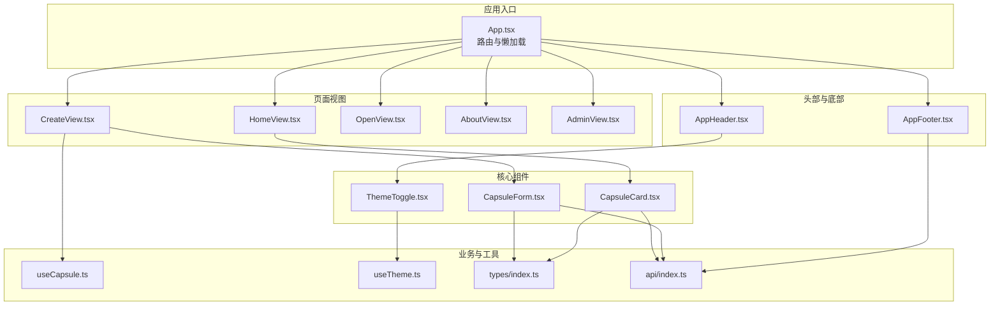
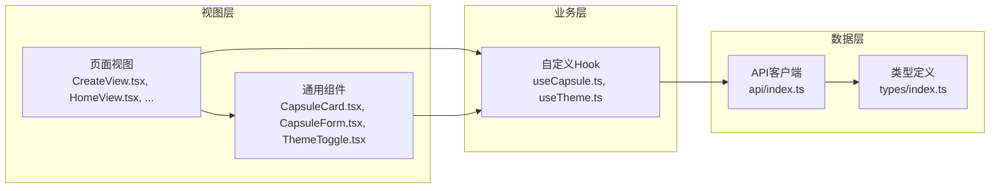
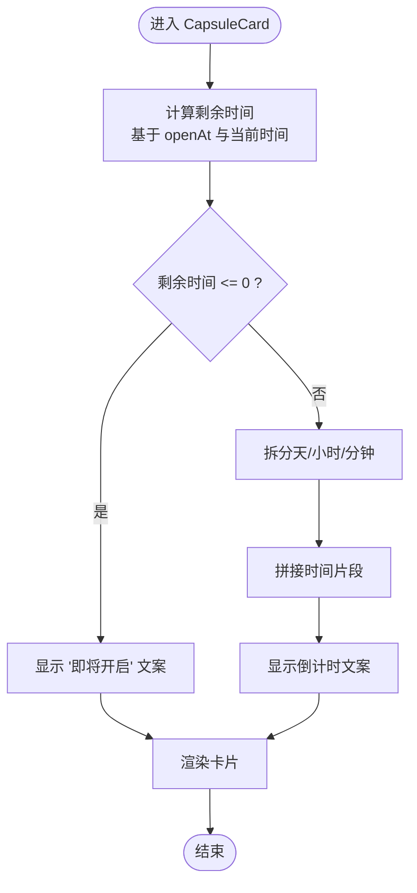
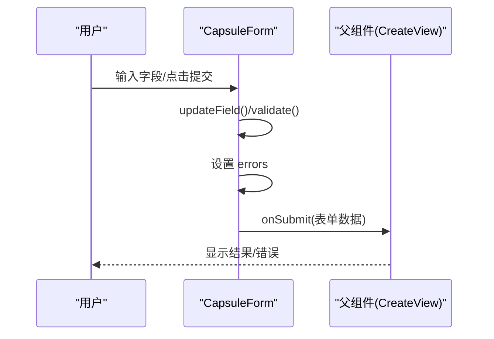
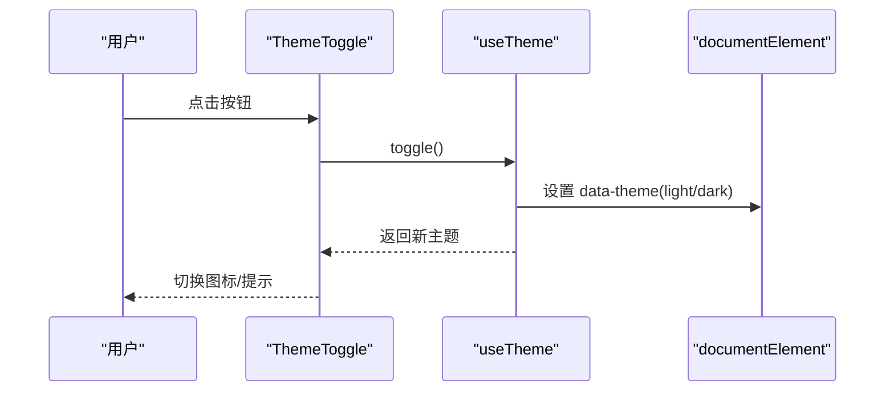
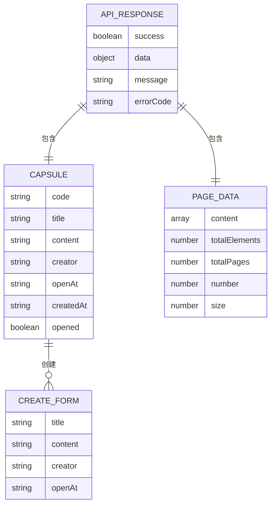
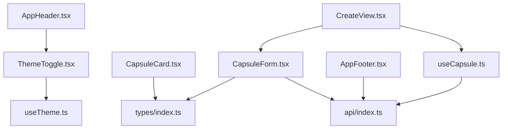

# 组件架构与设计

<cite>
**本文引用的文件**
- [CapsuleCard.tsx](file://frontends/react-ts/src/components/CapsuleCard.tsx)
- [CapsuleCard.module.css](file://frontends/react-ts/src/components/CapsuleCard.module.css)
- [CapsuleForm.tsx](file://frontends/react-ts/src/components/CapsuleForm.tsx)
- [CapsuleForm.module.css](file://frontends/react-ts/src/components/CapsuleForm.module.css)
- [ThemeToggle.tsx](file://frontends/react-ts/src/components/ThemeToggle.tsx)
- [ThemeToggle.module.css](file://frontends/react-ts/src/components/ThemeToggle.module.css)
- [useCapsule.ts](file://frontends/react-ts/src/hooks/useCapsule.ts)
- [useTheme.ts](file://frontends/react-ts/src/hooks/useTheme.ts)
- [index.ts](file://frontends/react-ts/src/types/index.ts)
- [index.ts](file://frontends/react-ts/src/api/index.ts)
- [CreateView.tsx](file://frontends/react-ts/src/views/CreateView.tsx)
- [HomeView.tsx](file://frontends/react-ts/src/views/HomeView.tsx)
- [App.tsx](file://frontends/react-ts/src/App.tsx)
- [AppHeader.tsx](file://frontends/react-ts/src/components/AppHeader.tsx)
- [AppFooter.tsx](file://frontends/react-ts/src/components/AppFooter.tsx)
</cite>

## 目录
1. [简介](#简介)
2. [项目结构](#项目结构)
3. [核心组件](#核心组件)
4. [架构总览](#架构总览)
5. [详细组件分析](#详细组件分析)
6. [依赖关系分析](#依赖关系分析)
7. [性能考量](#性能考量)
8. [故障排查指南](#故障排查指南)
9. [结论](#结论)
10. [附录](#附录)

## 简介
本文件系统性梳理 React 前端在本项目中的组件架构与设计，重点覆盖以下方面：
- 函数组件设计理念与实现要点：props 传递、事件处理、条件渲染
- 核心组件设计与交互：CapsuleCard 的展示逻辑与交互行为、CapsuleForm 的表单验证与状态管理、ThemeToggle 的主题切换机制
- 组件复用性与可扩展性：通过 Hook 抽象业务逻辑、通过类型系统约束数据契约
- 组件间通信模式：父子通信、兄弟通信、跨层级通信
- 性能优化策略：memo 化、懒加载、代码分割
- 最佳实践与常见反模式

## 项目结构
React 前端采用按功能域划分的组织方式，核心目录与职责如下：
- components：可复用 UI 组件（如 CapsuleCard、CapsuleForm、ThemeToggle、AppHeader、AppFooter）
- hooks：自定义 Hook（如 useCapsule、useTheme），封装业务逻辑与副作用
- views：页面级视图（如 HomeView、CreateView、OpenView、AboutView、AdminView）
- api：统一的 API 客户端，封装请求与响应格式
- types：前后端一致的数据类型定义
- App.tsx：路由入口，使用懒加载与 Suspense 进行代码分割

图表来源
- [App.tsx:12-30](file://frontends/react-ts/src/App.tsx#L12-L30)
- [HomeView.tsx:1-56](file://frontends/react-ts/src/views/HomeView.tsx#L1-L56)
- [CreateView.tsx:1-74](file://frontends/react-ts/src/views/CreateView.tsx#L1-L74)
- [CapsuleCard.tsx:1-66](file://frontends/react-ts/src/components/CapsuleCard.tsx#L1-L66)
- [CapsuleForm.tsx:1-130](file://frontends/react-ts/src/components/CapsuleForm.tsx#L1-L130)
- [ThemeToggle.tsx:1-17](file://frontends/react-ts/src/components/ThemeToggle.tsx#L1-L17)
- [useCapsule.ts:1-48](file://frontends/react-ts/src/hooks/useCapsule.ts#L1-L48)
- [useTheme.ts:1-48](file://frontends/react-ts/src/hooks/useTheme.ts#L1-L48)
- [index.ts:1-80](file://frontends/react-ts/src/types/index.ts#L1-L80)
- [index.ts:1-94](file://frontends/react-ts/src/api/index.ts#L1-L94)

章节来源
- [App.tsx:12-30](file://frontends/react-ts/src/App.tsx#L12-L30)
- [HomeView.tsx:1-56](file://frontends/react-ts/src/views/HomeView.tsx#L1-L56)
- [CreateView.tsx:1-74](file://frontends/react-ts/src/views/CreateView.tsx#L1-L74)

## 核心组件
本节聚焦三个核心组件：CapsuleCard、CapsuleForm、ThemeToggle，分别阐述其设计目标、数据流、交互行为与可扩展点。

- CapsuleCard：负责展示单个时间胶囊的信息，根据开启时间动态计算剩余时间；在未到开启时间时显示锁定态与倒计时文案；已开启且有内容时展示正文。
- CapsuleForm：负责创建时间胶囊的表单，包含标题、内容、发布者、开启时间字段；内置前端校验与错误提示；提交时通过回调交给父组件处理。
- ThemeToggle：提供主题切换按钮，基于 useTheme Hook 管理主题状态并在文档根节点上设置 data-theme 属性，支持本地持久化。

章节来源
- [CapsuleCard.tsx:19-66](file://frontends/react-ts/src/components/CapsuleCard.tsx#L19-L66)
- [CapsuleForm.tsx:10-130](file://frontends/react-ts/src/components/CapsuleForm.tsx#L10-L130)
- [ThemeToggle.tsx:4-16](file://frontends/react-ts/src/components/ThemeToggle.tsx#L4-L16)

## 架构总览
React 前端采用“视图层 + 自定义 Hook + API 客户端”的分层架构：
- 视图层：页面视图（views）与通用组件（components）负责 UI 渲染与用户交互
- 业务层：自定义 Hook（hooks）封装异步操作、状态管理与副作用
- 数据层：API 客户端（api）统一处理请求、响应与错误
- 类型层：types 提供前后端一致的数据契约

图表来源
- [CreateView.tsx:1-74](file://frontends/react-ts/src/views/CreateView.tsx#L1-L74)
- [HomeView.tsx:1-56](file://frontends/react-ts/src/views/HomeView.tsx#L1-L56)
- [CapsuleCard.tsx:1-66](file://frontends/react-ts/src/components/CapsuleCard.tsx#L1-L66)
- [CapsuleForm.tsx:1-130](file://frontends/react-ts/src/components/CapsuleForm.tsx#L1-L130)
- [ThemeToggle.tsx:1-17](file://frontends/react-ts/src/components/ThemeToggle.tsx#L1-L17)
- [useCapsule.ts:1-48](file://frontends/react-ts/src/hooks/useCapsule.ts#L1-L48)
- [useTheme.ts:1-48](file://frontends/react-ts/src/hooks/useTheme.ts#L1-L48)
- [index.ts:1-94](file://frontends/react-ts/src/api/index.ts#L1-L94)
- [index.ts:1-80](file://frontends/react-ts/src/types/index.ts#L1-L80)

## 详细组件分析

### CapsuleCard 组件分析
- 设计理念
  - 纯展示组件，接收 Capsule 对象作为 props，内部仅做格式化与条件渲染
  - 使用 useMemo 计算剩余时间，避免不必要重算
- 关键实现
  - 时间格式化：将 ISO 时间转换为本地化字符串
  - 剩余时间计算：基于 openAt 与当前时间差，按天/小时/分钟组合文案
  - 条件渲染：opened 为真且 content 存在时显示正文；未到时间时显示锁定态与倒计时；否则不渲染
- 可扩展性
  - 可通过传入更多元信息（如分享链接、复制胶囊码等）扩展展示能力
  - 可引入国际化与多时区支持

图表来源
- [CapsuleCard.tsx:19-31](file://frontends/react-ts/src/components/CapsuleCard.tsx#L19-L31)

章节来源
- [CapsuleCard.tsx:19-66](file://frontends/react-ts/src/components/CapsuleCard.tsx#L19-L66)
- [CapsuleCard.module.css:1-33](file://frontends/react-ts/src/components/CapsuleCard.module.css#L1-L33)

### CapsuleForm 组件分析
- 设计理念
  - 表单即状态：使用 useState 维护表单字段与错误信息
  - 验证即反馈：validate 在提交前执行，实时更新错误状态
  - 回调即集成：通过 onSubmit 将有效表单数据交由父组件处理
- 关键实现
  - 表单状态：title/content/creator/openAt
  - 错误状态：独立的 errors 对象，与输入框联动
  - 校验规则：必填、开启时间必须在未来、最小时间限制
  - 提交流程：阻止默认行为 -> 校验 -> 通过则调用 onSubmit
  - 字段更新：通用 updateField 方法，减少重复代码
- 可扩展性
  - 可增加更多字段（如隐私选项、到期时间等）
  - 可引入第三方校验库或更复杂的异步校验

图表来源
- [CapsuleForm.tsx:57-62](file://frontends/react-ts/src/components/CapsuleForm.tsx#L57-L62)
- [CreateView.tsx:15-29](file://frontends/react-ts/src/views/CreateView.tsx#L15-L29)

章节来源
- [CapsuleForm.tsx:10-130](file://frontends/react-ts/src/components/CapsuleForm.tsx#L10-L130)
- [CapsuleForm.module.css:1-32](file://frontends/react-ts/src/components/CapsuleForm.module.css#L1-L32)

### ThemeToggle 组件分析
- 设计理念
  - 轻量交互：仅一个按钮，点击切换主题
  - 状态共享：通过 useTheme Hook 暴露 theme 与 toggle
  - 全局生效：通过设置 documentElement 的 data-theme 属性影响全局样式
- 关键实现
  - useTheme：使用 useSyncExternalStore 订阅外部主题状态，实现跨组件共享
  - 本地持久化：切换时写入 localStorage，刷新后恢复
  - 样式适配：暗色模式下对日期选择器图标进行颜色反转
- 可扩展性
  - 可扩展为多主题（如系统跟随、深浅双色等）
  - 可加入过渡动画与无障碍属性

图表来源
- [ThemeToggle.tsx:4-16](file://frontends/react-ts/src/components/ThemeToggle.tsx#L4-L16)
- [useTheme.ts:39-47](file://frontends/react-ts/src/hooks/useTheme.ts#L39-L47)

章节来源
- [ThemeToggle.tsx:1-17](file://frontends/react-ts/src/components/ThemeToggle.tsx#L1-L17)
- [ThemeToggle.module.css:1-19](file://frontends/react-ts/src/components/ThemeToggle.module.css#L1-L19)
- [useTheme.ts:1-48](file://frontends/react-ts/src/hooks/useTheme.ts#L1-L48)

### 组件间通信模式
- 父子通信
  - CreateView 与 CapsuleForm：父向子传递 loading 状态与 onSubmit 回调，子向父提交表单数据
  - AppHeader 与 ThemeToggle：父向子注入 ThemeToggle，子向外暴露切换动作
- 兄弟组件通信
  - AppHeader 中的导航项与 ThemeToggle 并列，通过共同父组件进行布局与状态管理
- 跨层级通信
  - useTheme 通过 useSyncExternalStore 实现跨组件订阅与通知，无需层层 props 下传

章节来源
- [CreateView.tsx:1-74](file://frontends/react-ts/src/views/CreateView.tsx#L1-L74)
- [AppHeader.tsx:1-25](file://frontends/react-ts/src/components/AppHeader.tsx#L1-L25)
- [useTheme.ts:24-47](file://frontends/react-ts/src/hooks/useTheme.ts#L24-L47)

### 数据模型与类型约束
- Capsule：描述时间胶囊的完整信息，包含 code、title、content、creator、openAt、createdAt、opened 等字段
- CreateCapsuleForm：创建胶囊所需的表单数据，包含 title、content、creator、openAt
- ApiResponse：统一的后端响应结构，包含 success、data、message、errorCode
- PageData：分页数据结构，用于管理员视图
- TechStack/HealthInfo：健康检查相关类型

图表来源
- [index.ts:10-29](file://frontends/react-ts/src/types/index.ts#L10-L29)
- [index.ts:35-52](file://frontends/react-ts/src/types/index.ts#L35-L52)

章节来源
- [index.ts:1-80](file://frontends/react-ts/src/types/index.ts#L1-L80)

## 依赖关系分析
- 组件依赖
  - CapsuleCard 依赖 types 中的 Capsule 类型
  - CapsuleForm 依赖 types 中的 CreateCapsuleForm 与 ApiResponse
  - ThemeToggle 依赖 useTheme Hook
  - AppHeader 依赖 ThemeToggle
  - AppFooter 依赖 api 的健康检查接口
- Hook 依赖
  - useCapsule 依赖 api 的 create 与 get 方法
  - useTheme 依赖 localStorage 与 documentElement
- 视图依赖
  - CreateView 依赖 useCapsule 与 CapsuleForm
  - HomeView 依赖 CapsuleCard（间接通过视图渲染）

图表来源
- [CapsuleCard.tsx:1-66](file://frontends/react-ts/src/components/CapsuleCard.tsx#L1-L66)
- [CapsuleForm.tsx:1-130](file://frontends/react-ts/src/components/CapsuleForm.tsx#L1-L130)
- [ThemeToggle.tsx:1-17](file://frontends/react-ts/src/components/ThemeToggle.tsx#L1-L17)
- [useTheme.ts:1-48](file://frontends/react-ts/src/hooks/useTheme.ts#L1-L48)
- [AppHeader.tsx:1-25](file://frontends/react-ts/src/components/AppHeader.tsx#L1-L25)
- [AppFooter.tsx:1-30](file://frontends/react-ts/src/components/AppFooter.tsx#L1-L30)
- [CreateView.tsx:1-74](file://frontends/react-ts/src/views/CreateView.tsx#L1-L74)
- [useCapsule.ts:1-48](file://frontends/react-ts/src/hooks/useCapsule.ts#L1-L48)
- [index.ts:1-94](file://frontends/react-ts/src/api/index.ts#L1-L94)
- [index.ts:1-80](file://frontends/react-ts/src/types/index.ts#L1-L80)

章节来源
- [index.ts:1-94](file://frontends/react-ts/src/api/index.ts#L1-L94)
- [index.ts:1-80](file://frontends/react-ts/src/types/index.ts#L1-L80)

## 性能考量
- memo 化
  - CapsuleCard 使用 useMemo 计算剩余时间，避免每次渲染都重新计算
  - 建议：对复杂计算或昂贵的派生值使用 useMemo；对稳定 props 使用 React.memo 或类似手段
- 懒加载与代码分割
  - App.tsx 使用 React.lazy 与 Suspense 对页面视图进行懒加载，减少首屏体积
  - 建议：对非关键路径的组件继续采用懒加载，结合骨架屏提升感知性能
- 状态与副作用
  - useCapsule 与 useTheme 将状态与副作用集中管理，避免组件内重复逻辑
  - 建议：合理拆分状态，避免大对象频繁变更导致的重渲染
- 样式与主题
  - ThemeToggle 通过 data-theme 属性影响全局样式，避免逐个组件设置类名
  - 建议：CSS-in-JS 或 CSS 变量配合主题系统，减少重排与重绘

章节来源
- [CapsuleCard.tsx:19-31](file://frontends/react-ts/src/components/CapsuleCard.tsx#L19-L31)
- [App.tsx:6-10](file://frontends/react-ts/src/App.tsx#L6-L10)
- [useCapsule.ts:14-44](file://frontends/react-ts/src/hooks/useCapsule.ts#L14-L44)
- [useTheme.ts:39-47](file://frontends/react-ts/src/hooks/useTheme.ts#L39-L47)

## 故障排查指南
- 表单校验失败
  - 现象：提交后出现错误提示但无网络请求
  - 排查：确认 validate 返回值与错误状态是否正确更新；检查 onSubmit 是否被调用
  - 参考路径：[CapsuleForm.tsx:30-62](file://frontends/react-ts/src/components/CapsuleForm.tsx#L30-L62)
- 创建失败
  - 现象：创建后显示错误横幅
  - 排查：useCapsule 的 create 异常分支会设置 error；确认 API 返回的 success 与 message
  - 参考路径：[useCapsule.ts:14-28](file://frontends/react-ts/src/hooks/useCapsule.ts#L14-L28)，[CreateView.tsx:20-29](file://frontends/react-ts/src/views/CreateView.tsx#L20-L29)
- 主题切换无效
  - 现象：点击按钮无变化
  - 排查：确认 useTheme 的 setTheme 是否更新了 documentElement 的 data-theme；检查 localStorage 是否写入
  - 参考路径：[useTheme.ts:33-37](file://frontends/react-ts/src/hooks/useTheme.ts#L33-L37)，[ThemeToggle.tsx:4-16](file://frontends/react-ts/src/components/ThemeToggle.tsx#L4-L16)
- 健康检查异常
  - 现象：底部技术栈显示“加载中...”
  - 排查：AppFooter 的 useEffect 中的 getHealthInfo 是否抛错；确认后端 /api/v1/health 可访问
  - 参考路径：[AppFooter.tsx:9-13](file://frontends/react-ts/src/components/AppFooter.tsx#L9-L13)，[index.ts:91-93](file://frontends/react-ts/src/api/index.ts#L91-L93)

章节来源
- [CapsuleForm.tsx:30-62](file://frontends/react-ts/src/components/CapsuleForm.tsx#L30-L62)
- [useCapsule.ts:14-28](file://frontends/react-ts/src/hooks/useCapsule.ts#L14-L28)
- [CreateView.tsx:20-29](file://frontends/react-ts/src/views/CreateView.tsx#L20-L29)
- [useTheme.ts:33-37](file://frontends/react-ts/src/hooks/useTheme.ts#L33-L37)
- [ThemeToggle.tsx:4-16](file://frontends/react-ts/src/components/ThemeToggle.tsx#L4-L16)
- [AppFooter.tsx:9-13](file://frontends/react-ts/src/components/AppFooter.tsx#L9-L13)
- [index.ts:91-93](file://frontends/react-ts/src/api/index.ts#L91-L93)

## 结论
本项目在 React 前端中体现了清晰的分层与职责分离：视图层专注渲染与交互，业务层通过自定义 Hook 抽象状态与副作用，数据层以统一 API 客户端对接后端。核心组件 CapsuleCard、CapsuleForm、ThemeToggle 在设计上强调可读性、可维护性与可扩展性，并通过 useMemo、lazy/Suspense、useSyncExternalStore 等手段实现性能优化与跨层级通信。建议后续在复杂场景中引入更细粒度的 memo 化与状态切片，持续完善主题系统与国际化支持。

## 附录
- 最佳实践
  - 使用 TypeScript 严格类型约束，确保 props 与状态一致性
  - 将副作用与状态集中在 Hook 中，保持组件纯函数特性
  - 对昂贵计算使用 useMemo/memo，对非关键路径使用懒加载
  - 通过 data-theme 等全局属性实现主题统一管理
- 常见反模式
  - 在组件内直接操作 DOM 或全局状态，破坏可测试性与可维护性
  - 将大量业务逻辑散落在多个组件中，缺乏集中管理
  - 忽略错误边界与降级策略，导致用户体验下降