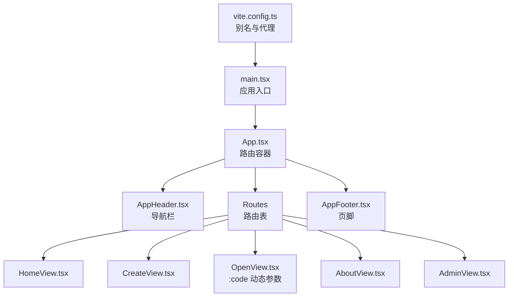
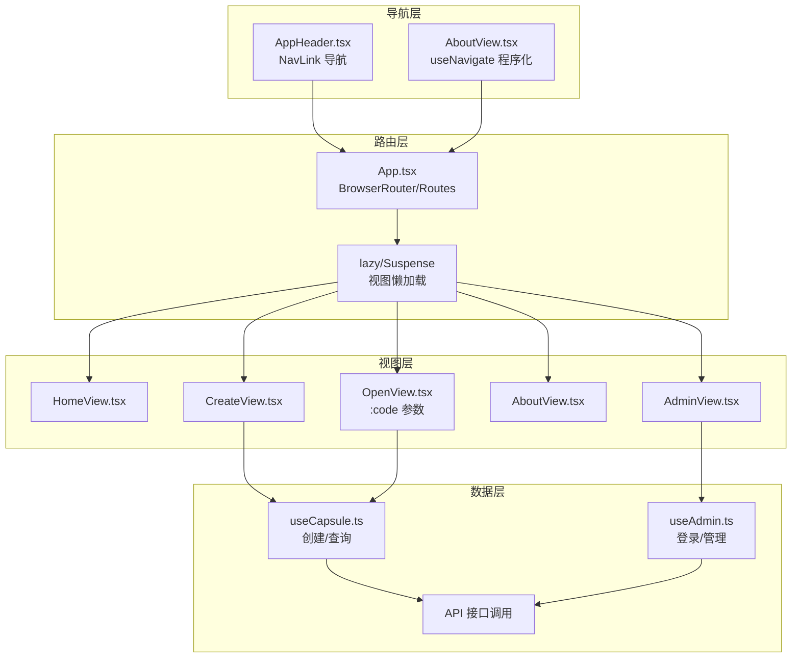
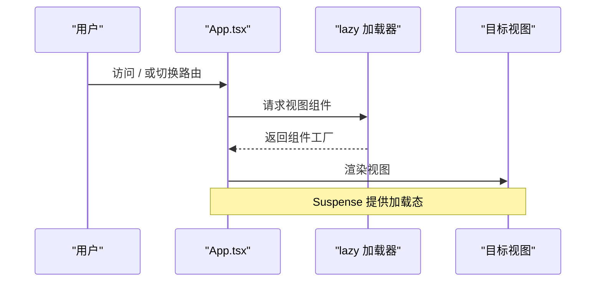
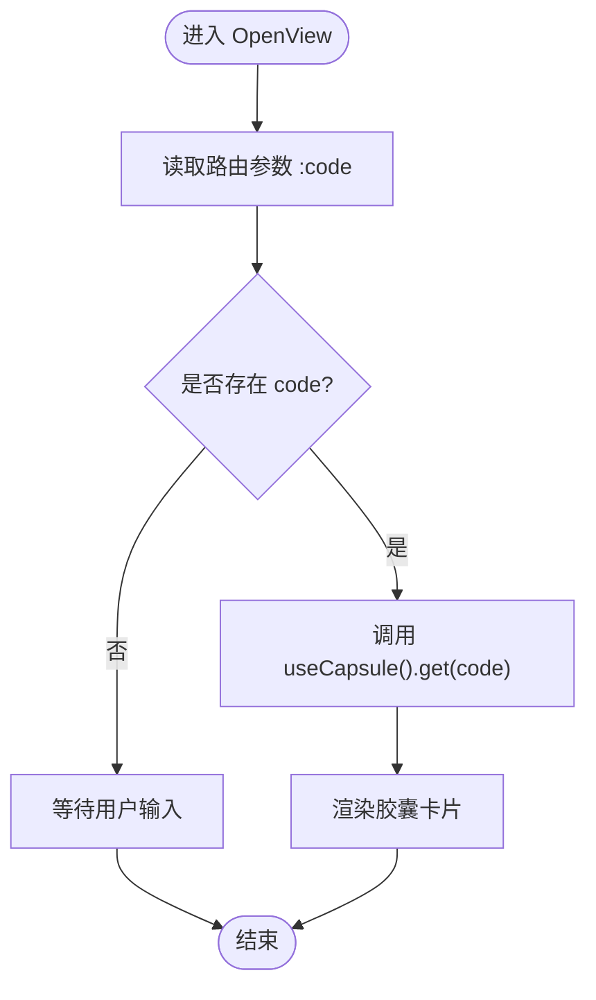
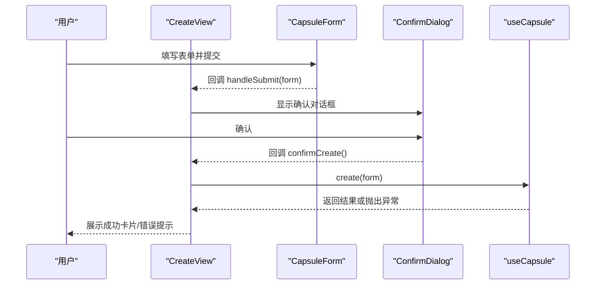
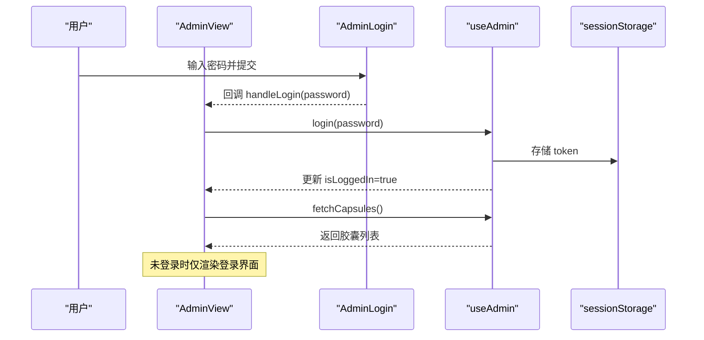
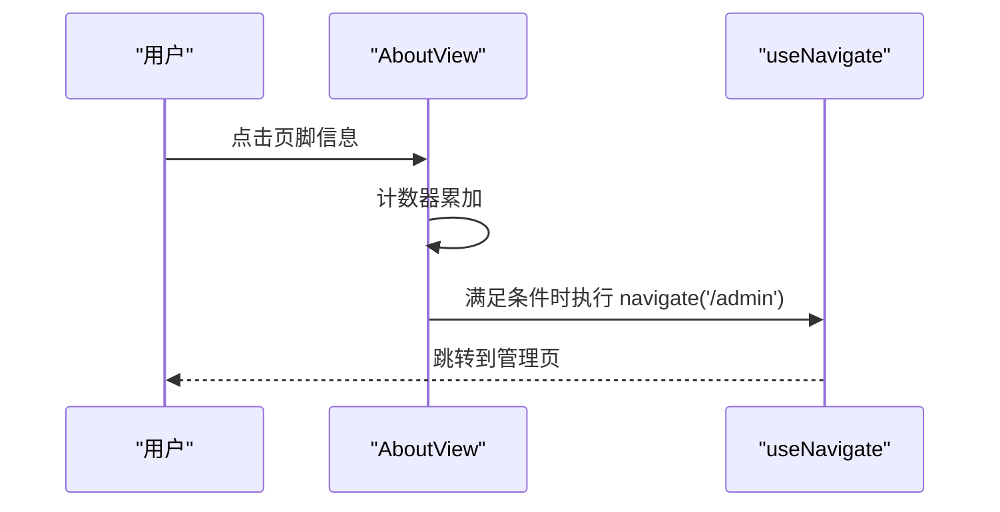
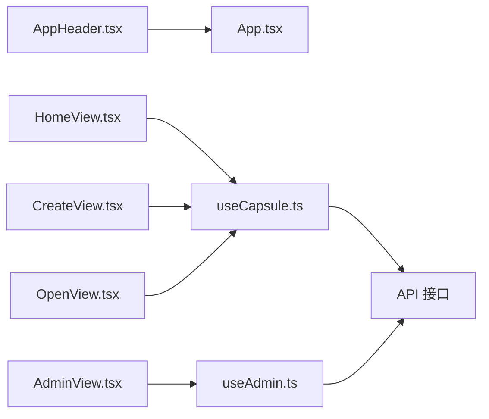

# 路由系统与导航

<cite>
**本文档引用的文件**
- [App.tsx](file://frontends/react-ts/src/App.tsx)
- [main.tsx](file://frontends/react-ts/src/main.tsx)
- [vite.config.ts](file://frontends/react-ts/vite.config.ts)
- [HomeView.tsx](file://frontends/react-ts/src/views/HomeView.tsx)
- [CreateView.tsx](file://frontends/react-ts/src/views/CreateView.tsx)
- [OpenView.tsx](file://frontends/react-ts/src/views/OpenView.tsx)
- [AboutView.tsx](file://frontends/react-ts/src/views/AboutView.tsx)
- [AdminView.tsx](file://frontends/react-ts/src/views/AdminView.tsx)
- [AppHeader.tsx](file://frontends/react-ts/src/components/AppHeader.tsx)
- [AppFooter.tsx](file://frontends/react-ts/src/components/AppFooter.tsx)
- [useCapsule.ts](file://frontends/react-ts/src/hooks/useCapsule.ts)
- [useAdmin.ts](file://frontends/react-ts/src/hooks/useAdmin.ts)
- [index.ts](file://frontends/react-ts/src/types/index.ts)
</cite>

## 目录
1. [引言](#引言)
2. [项目结构](#项目结构)
3. [核心组件](#核心组件)
4. [架构总览](#架构总览)
5. [详细组件分析](#详细组件分析)
6. [依赖关系分析](#依赖关系分析)
7. [性能考虑](#性能考虑)
8. [故障排除指南](#故障排除指南)
9. [结论](#结论)
10. [附录](#附录)

## 引言
本文件系统性梳理 HelloTime 项目中基于 React Router 的路由系统与导航实现，覆盖路由配置、嵌套路由、动态路由参数；页面视图设计（HomeView 展示逻辑、CreateView 表单处理、AdminView 权限控制）；导航组件（AppHeader 导航菜单、面包屑导航、路由守卫）；程序化导航与声明式导航的使用场景；以及路由懒加载、代码分割与预加载策略，并给出路由设计最佳实践与 SEO 优化建议。

## 项目结构
React 前端采用 Vite 构建，使用 React Router DOM 进行客户端路由管理。应用通过 BrowserRouter 包裹，顶层 App 组件集中定义路由规则并进行懒加载。全局样式通过别名导入，开发服务器配置了 API 代理。

**图表来源**
- [App.tsx:12-30](file://frontends/react-ts/src/App.tsx#L12-L30)
- [main.tsx:15-19](file://frontends/react-ts/src/main.tsx#L15-L19)
- [vite.config.ts:7-12](file://frontends/react-ts/vite.config.ts#L7-L12)

**章节来源**
- [App.tsx:12-30](file://frontends/react-ts/src/App.tsx#L12-L30)
- [main.tsx:15-19](file://frontends/react-ts/src/main.tsx#L15-L19)
- [vite.config.ts:7-12](file://frontends/react-ts/vite.config.ts#L7-L12)

## 核心组件
- 路由容器与懒加载：顶层 App 组件使用 React.lazy 与 Suspense 对视图组件进行按需加载，减少首屏体积。
- 路由定义：在 Routes 中声明各路径与对应组件，包含静态路径与带可选参数的动态路径。
- 导航组件：AppHeader 提供声明式导航（NavLink），AboutView 展示程序化导航（useNavigate）。
- 页面视图：HomeView 展示引导与功能入口；CreateView 处理表单提交与二次确认；OpenView 解析动态参数并查询胶囊；AdminView 实现管理员登录与权限控制。
- 钩子函数：useCapsule 封装胶囊创建与查询；useAdmin 封装管理员登录、登出与胶囊管理，并通过 useSyncExternalStore 在组件间共享 token。

**章节来源**
- [App.tsx:6-10](file://frontends/react-ts/src/App.tsx#L6-L10)
- [App.tsx:18-24](file://frontends/react-ts/src/App.tsx#L18-L24)
- [AppHeader.tsx:14-20](file://frontends/react-ts/src/components/AppHeader.tsx#L14-L20)
- [AboutView.tsx:8](file://frontends/react-ts/src/views/AboutView.tsx#L8)
- [OpenView.tsx:8](file://frontends/react-ts/src/views/OpenView.tsx#L8)
- [useCapsule.ts:9-46](file://frontends/react-ts/src/hooks/useCapsule.ts#L9-L46)
- [useAdmin.ts:35-132](file://frontends/react-ts/src/hooks/useAdmin.ts#L35-L132)

## 架构总览
下图展示了从用户交互到数据流的整体架构：导航组件触发路由变化或程序化跳转；路由根据路径匹配到对应视图；视图通过自定义 Hook 发起 API 请求；错误与加载状态在视图层渲染反馈。

**图表来源**
- [App.tsx:14-25](file://frontends/react-ts/src/App.tsx#L14-L25)
- [AppHeader.tsx:14-20](file://frontends/react-ts/src/components/AppHeader.tsx#L14-L20)
- [AboutView.tsx:8](file://frontends/react-ts/src/views/AboutView.tsx#L8)
- [CreateView.tsx:10](file://frontends/react-ts/src/views/CreateView.tsx#L10)
- [OpenView.tsx:9](file://frontends/react-ts/src/views/OpenView.tsx#L9)
- [AdminView.tsx:9-19](file://frontends/react-ts/src/views/AdminView.tsx#L9-L19)
- [useCapsule.ts:14-44](file://frontends/react-ts/src/hooks/useCapsule.ts#L14-L44)
- [useAdmin.ts:49-118](file://frontends/react-ts/src/hooks/useAdmin.ts#L49-L118)

## 详细组件分析

### 路由配置与懒加载
- 路由定义：根路径 "/"、"/create"、"/open/:code?"、"/about"、"/admin"。
- 懒加载策略：所有视图组件通过 React.lazy 按需加载，配合 Suspense 提供加载占位。
- 代码分割：Vite 默认支持按需打包，结合 React.lazy 达成自然的代码分割。
- 预加载策略：可在用户悬停或即将进入页面时预取资源（例如在 AppHeader 中对常用路径进行预加载）。

**图表来源**
- [App.tsx:6-10](file://frontends/react-ts/src/App.tsx#L6-L10)
- [App.tsx:17-25](file://frontends/react-ts/src/App.tsx#L17-L25)

**章节来源**
- [App.tsx:18-24](file://frontends/react-ts/src/App.tsx#L18-L24)
- [App.tsx:6-10](file://frontends/react-ts/src/App.tsx#L6-L10)

### 动态路由参数解析（OpenView）
- 参数定义：路径 "/open/:code?" 表示 code 为可选参数。
- 参数读取：通过 useParams 获取路由参数并在副作用中触发查询。
- 参数联动：当 URL 中包含 code 时，自动发起查询并渲染胶囊卡片。

**图表来源**
- [OpenView.tsx:8-17](file://frontends/react-ts/src/views/OpenView.tsx#L8-L17)
- [OpenView.tsx:39-43](file://frontends/react-ts/src/views/OpenView.tsx#L39-L43)

**章节来源**
- [OpenView.tsx:8-17](file://frontends/react-ts/src/views/OpenView.tsx#L8-L17)

### 页面视图设计

#### HomeView 展示逻辑
- 功能入口：提供“创建胶囊”和“开启胶囊”的主要导航链接。
- 结构组织：使用语义化布局与卡片组件展示特性说明。
- 导航方式：使用声明式 Link 进行页面跳转。

**章节来源**
- [HomeView.tsx:16-29](file://frontends/react-ts/src/views/HomeView.tsx#L16-L29)

#### CreateView 表单处理
- 表单流程：先收集表单数据，弹出二次确认对话框，确认后再调用创建接口。
- 成功反馈：创建成功后展示胶囊码并提供复制与查看详情的按钮。
- 错误处理：通过 Hook 暴露的 error 状态在视图层渲染提示。

**图表来源**
- [CreateView.tsx:15-29](file://frontends/react-ts/src/views/CreateView.tsx#L15-L29)
- [CreateView.tsx:61-67](file://frontends/react-ts/src/views/CreateView.tsx#L61-L67)
- [useCapsule.ts:14-28](file://frontends/react-ts/src/hooks/useCapsule.ts#L14-L28)

**章节来源**
- [CreateView.tsx:15-29](file://frontends/react-ts/src/views/CreateView.tsx#L15-L29)
- [useCapsule.ts:14-28](file://frontends/react-ts/src/hooks/useCapsule.ts#L14-L28)

#### AdminView 权限控制
- 登录流程：AdminLogin 组件触发登录，成功后通过 Hook 写入 sessionStorage 并更新 token。
- 权限守卫：Hook 内部通过 useSyncExternalStore 在组件间共享 token，未登录时仅显示登录界面。
- 管理功能：登录后拉取胶囊列表，支持删除与分页刷新；若接口返回认证失败则自动清空 token 并重置列表。

**图表来源**
- [AdminView.tsx:24-31](file://frontends/react-ts/src/views/AdminView.tsx#L24-L31)
- [useAdmin.ts:49-62](file://frontends/react-ts/src/hooks/useAdmin.ts#L49-L62)
- [useAdmin.ts:69-93](file://frontends/react-ts/src/hooks/useAdmin.ts#L69-L93)

**章节来源**
- [AdminView.tsx:24-31](file://frontends/react-ts/src/views/AdminView.tsx#L24-L31)
- [useAdmin.ts:49-62](file://frontends/react-ts/src/hooks/useAdmin.ts#L49-L62)
- [useAdmin.ts:69-93](file://frontends/react-ts/src/hooks/useAdmin.ts#L69-L93)

### 导航组件实现

#### AppHeader 导航菜单
- 声明式导航：使用 NavLink 匹配当前路径并动态切换激活样式。
- Logo 与主题切换：包含品牌 Logo 与主题切换组件。
- 路由项：首页、创建、开启、关于。

**章节来源**
- [AppHeader.tsx:14-20](file://frontends/react-ts/src/components/AppHeader.tsx#L14-L20)

#### 面包屑导航
- 当前实现：未在现有代码中发现专门的面包屑组件。
- 建议：可基于 location.pathname 与路由配置生成层级路径，或在视图内以简单文案展示当前位置。

[本节为概念性建议，不直接分析具体文件]

#### 路由守卫
- 已实现守卫：AdminView 通过 useAdmin 的 isLoggedIn 状态实现访问控制。
- 可扩展：可在路由层增加更高阶的守卫组件，拦截未授权访问并重定向。

**章节来源**
- [AdminView.tsx:43-47](file://frontends/react-ts/src/views/AdminView.tsx#L43-L47)
- [useAdmin.ts:47](file://frontends/react-ts/src/hooks/useAdmin.ts#L47)

### 程序化导航 vs 声明式导航

#### 声明式导航（AppHeader）
- 适用场景：固定导航菜单、静态链接。
- 优点：简洁直观，自动高亮当前页。

**章节来源**
- [AppHeader.tsx:14-20](file://frontends/react-ts/src/components/AppHeader.tsx#L14-L20)

#### 程序化导航（AboutView）
- 适用场景：条件跳转、交互触发、动态路由。
- 示例：点击特定区域多次后跳转至管理后台。

**图表来源**
- [AboutView.tsx:25-31](file://frontends/react-ts/src/views/AboutView.tsx#L25-L31)

**章节来源**
- [AboutView.tsx:25-31](file://frontends/react-ts/src/views/AboutView.tsx#L25-L31)

## 依赖关系分析
- 组件耦合：视图组件依赖自定义 Hook（useCapsule、useAdmin）与通用组件（ConfirmDialog、CapsuleForm 等）。
- 路由耦合：AppHeader 与路由路径强相关，修改路径需要同步更新导航项。
- 数据流：视图 -> Hook -> API -> 视图渲染，错误与加载状态贯穿始终。

**图表来源**
- [AppHeader.tsx:14-20](file://frontends/react-ts/src/components/AppHeader.tsx#L14-L20)
- [CreateView.tsx:10](file://frontends/react-ts/src/views/CreateView.tsx#L10)
- [OpenView.tsx:9](file://frontends/react-ts/src/views/OpenView.tsx#L9)
- [AdminView.tsx:9-19](file://frontends/react-ts/src/views/AdminView.tsx#L9-L19)
- [useCapsule.ts:14-44](file://frontends/react-ts/src/hooks/useCapsule.ts#L14-L44)
- [useAdmin.ts:49-118](file://frontends/react-ts/src/hooks/useAdmin.ts#L49-L118)

**章节来源**
- [useCapsule.ts:14-44](file://frontends/react-ts/src/hooks/useCapsule.ts#L14-L44)
- [useAdmin.ts:49-118](file://frontends/react-ts/src/hooks/useAdmin.ts#L49-L118)

## 性能考虑
- 路由懒加载：已通过 React.lazy 与 Suspense 实现，有效降低首屏 JS 体积。
- 代码分割：Vite 默认按需打包，结合懒加载形成自然分割。
- 预加载策略：可在 AppHeader 中对常用路径进行预加载（如 hover 预取），提升交互流畅度。
- 图片与资源：使用 @spec 别名引入共享资源，确保缓存与一致性。

**章节来源**
- [App.tsx:6-10](file://frontends/react-ts/src/App.tsx#L6-L10)
- [vite.config.ts:7-12](file://frontends/react-ts/vite.config.ts#L7-L12)

## 故障排除指南
- 路由不生效：检查 App.tsx 中 Routes 下的 Route 定义是否正确，路径与组件是否匹配。
- 动态参数无效：确认 OpenView 使用 useParams 读取参数并在副作用中触发查询。
- 管理员登录失败：检查 useAdmin 的 login 流程与 sessionStorage 写入，注意错误分支与 finally 清理。
- 程序化导航无反应：确认 AboutView 中 useNavigate 的调用时机与条件判断。
- API 代理问题：检查 vite.config.ts 中 /api 代理配置与后端服务端口。

**章节来源**
- [OpenView.tsx:8-17](file://frontends/react-ts/src/views/OpenView.tsx#L8-L17)
- [useAdmin.ts:49-62](file://frontends/react-ts/src/hooks/useAdmin.ts#L49-L62)
- [AboutView.tsx:25-31](file://frontends/react-ts/src/views/AboutView.tsx#L25-L31)
- [vite.config.ts:15-20](file://frontends/react-ts/vite.config.ts#L15-L20)

## 结论
本项目在 React Router 基础上实现了清晰的路由结构与懒加载策略，结合自定义 Hook 将业务逻辑与视图解耦。AdminView 的权限控制与 AboutView 的程序化导航体现了不同导航场景的最佳实践。后续可在面包屑、路由守卫与预加载方面进一步完善，以提升用户体验与可维护性。

## 附录

### 路由设计最佳实践
- 路由命名与层级：保持路径简洁且语义明确，避免过深嵌套。
- 参数设计：区分必需与可选参数，提供默认值与校验。
- 错误边界：在 Suspense 中提供加载与错误占位，改善用户体验。
- 权限守卫：在路由层与组件层双重守卫，确保安全与一致性。

[本节为通用指导，不直接分析具体文件]

### SEO 优化建议
- 静态页面：为每个视图设置合适的标题与描述（可在视图内动态设置）。
- 动态参数：为 /open/:code? 提供合理的结构化数据标记。
- 预渲染：在构建阶段生成静态 HTML（如使用 SSG），提升首屏速度与 SEO 表现。

[本节为通用指导，不直接分析具体文件]