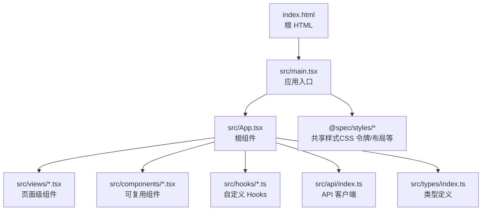
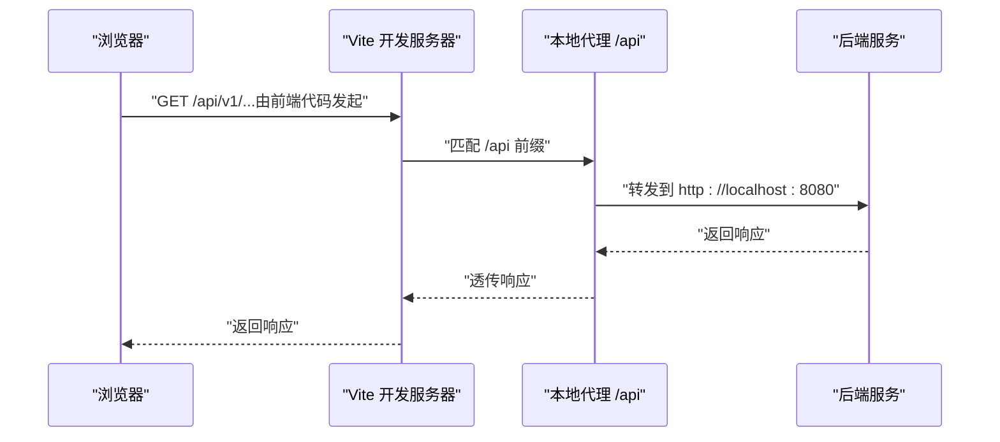
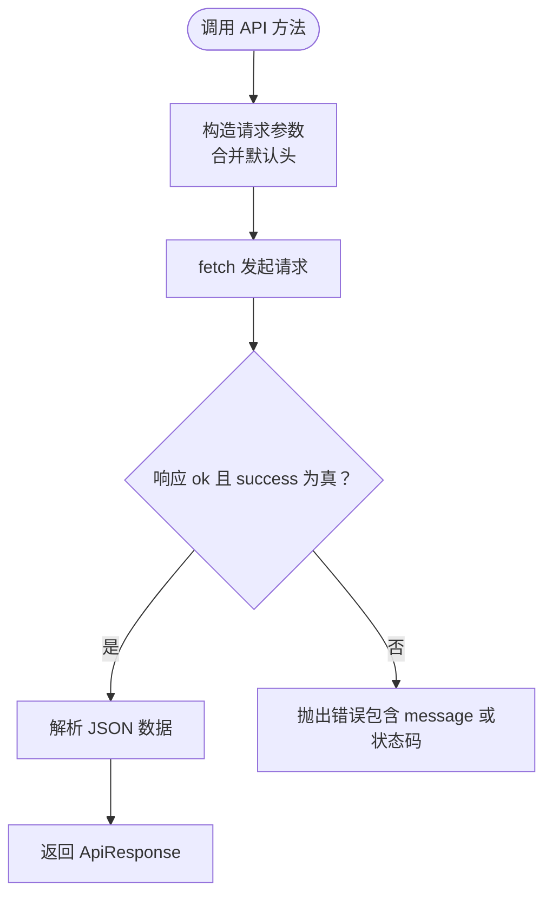
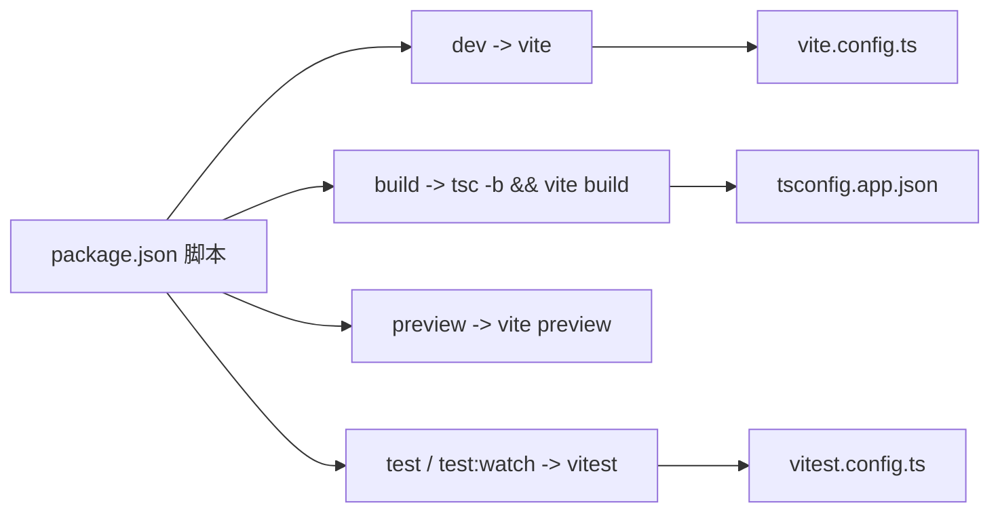

# 项目结构与配置

<cite>
**本文引用的文件**
- [vite.config.ts](file://frontends/react-ts/vite.config.ts)
- [tsconfig.json](file://frontends/react-ts/tsconfig.json)
- [tsconfig.app.json](file://frontends/react-ts/tsconfig.app.json)
- [tsconfig.node.json](file://frontends/react-ts/tsconfig.node.json)
- [package.json](file://frontends/react-ts/package.json)
- [vitest.config.ts](file://frontends/react-ts/vitest.config.ts)
- [index.html](file://frontends/react-ts/index.html)
- [main.tsx](file://frontends/react-ts/src/main.tsx)
- [App.tsx](file://frontends/react-ts/src/App.tsx)
- [README.md](file://frontends/react-ts/README.md)
- [api/index.ts](file://frontends/react-ts/src/api/index.ts)
- [hooks/useCapsule.ts](file://frontends/react-ts/src/hooks/useCapsule.ts)
- [types/index.ts](file://frontends/react-ts/src/types/index.ts)
- [views/HomeView.tsx](file://frontends/react-ts/src/views/HomeView.tsx)
- [components/CapsuleCard.tsx](file://frontends/react-ts/src/components/CapsuleCard.tsx)
</cite>

## 目录
1. [简介](#简介)
2. [项目结构](#项目结构)
3. [核心组件](#核心组件)
4. [架构总览](#架构总览)
5. [详细组件分析](#详细组件分析)
6. [依赖关系分析](#依赖关系分析)
7. [性能考虑](#性能考虑)
8. [故障排查指南](#故障排查指南)
9. [结论](#结论)
10. [附录](#附录)

## 简介
本文件面向 React 前端工程（基于 Vite 7 与 TypeScript），系统性梳理项目结构、配置要点与最佳实践，重点覆盖：
- Vite 7 构建工具的开发服务器、代理、插件与别名配置
- TypeScript 多配置文件的职责划分与关键编译选项
- src 目录组织、模块导入规则与路径别名
- package.json 中的依赖与脚本命令
- 开发与生产环境配置、热重载机制
- 常见问题与排错建议

## 项目结构
React 前端位于 frontends/react-ts，采用“按功能域”组织的目录布局，结合别名与共享样式资源，形成清晰的可维护结构。

图示来源
- [index.html:1-17](file://frontends/react-ts/index.html#L1-L17)
- [main.tsx:1-20](file://frontends/react-ts/src/main.tsx#L1-L20)
- [App.tsx:1-31](file://frontends/react-ts/src/App.tsx#L1-L31)

章节来源
- [README.md:51-81](file://frontends/react-ts/README.md#L51-L81)
- [main.tsx:1-20](file://frontends/react-ts/src/main.tsx#L1-L20)
- [App.tsx:1-31](file://frontends/react-ts/src/App.tsx#L1-L31)

## 核心组件
- Vite 配置（开发服务器、代理、别名）
- TypeScript 多配置文件（应用与 Node 工具链分离）
- 应用入口与路由
- API 客户端与类型系统
- 视图与组件层

章节来源
- [vite.config.ts:1-23](file://frontends/react-ts/vite.config.ts#L1-L23)
- [tsconfig.app.json:1-29](file://frontends/react-ts/tsconfig.app.json#L1-L29)
- [tsconfig.node.json:1-23](file://frontends/react-ts/tsconfig.node.json#L1-L23)
- [package.json:1-31](file://frontends/react-ts/package.json#L1-L31)
- [main.tsx:1-20](file://frontends/react-ts/src/main.tsx#L1-L20)
- [App.tsx:1-31](file://frontends/react-ts/src/App.tsx#L1-L31)
- [api/index.ts:1-94](file://frontends/react-ts/src/api/index.ts#L1-L94)
- [types/index.ts:1-80](file://frontends/react-ts/src/types/index.ts#L1-L80)

## 架构总览
下图展示了从浏览器到后端 API 的请求路径，以及 Vite 开发服务器如何通过代理转发请求。

图示来源
- [vite.config.ts:13-21](file://frontends/react-ts/vite.config.ts#L13-L21)
- [api/index.ts:8-31](file://frontends/react-ts/src/api/index.ts#L8-L31)

## 详细组件分析

### Vite 配置详解
- 插件与解析
  - 使用 React 插件以支持 JSX 与快速刷新
  - 路径别名：@ 指向 src；@spec 指向仓库根 spec 目录
- 开发服务器
  - 端口：5174
  - 代理：/api 前缀转发至 http://localhost:8080，并启用 changeOrigin
- 构建优化
  - 本项目未显式配置打包优化参数（如 rollupOptions、optimizeDeps 等），默认遵循 Vite 7 生态策略

章节来源
- [vite.config.ts:1-23](file://frontends/react-ts/vite.config.ts#L1-L23)

### TypeScript 配置详解
- 根配置 tsconfig.json
  - 通过 references 引入应用与 Node 两套配置，实现分层编译
- 应用配置 tsconfig.app.json
  - 目标与运行时：ES2020 + DOM
  - 模块解析：bundler（与 Vite 协同）
  - 路径映射：@/* → src/*，@spec/* → ../../spec/*
  - 编译选项：严格模式、未使用检查、无副作用导入检查、JSX 使用 react-jsx
- Node 工具链配置 tsconfig.node.json
  - 目标：ES2023
  - 仅包含 vite.config.ts，确保工具链类型安全

章节来源
- [tsconfig.json:1-8](file://frontends/react-ts/tsconfig.json#L1-L8)
- [tsconfig.app.json:1-29](file://frontends/react-ts/tsconfig.app.json#L1-L29)
- [tsconfig.node.json:1-23](file://frontends/react-ts/tsconfig.node.json#L1-L23)

### 应用入口与路由
- 入口文件 main.tsx
  - 注入全局样式（来自 @spec），渲染根组件 App
- 根组件 App.tsx
  - 使用 React Router 7 的 BrowserRouter
  - 路由懒加载：Home、Create、Open、About、Admin
  - Suspense 包裹路由，提升用户体验

章节来源
- [main.tsx:1-20](file://frontends/react-ts/src/main.tsx#L1-L20)
- [App.tsx:1-31](file://frontends/react-ts/src/App.tsx#L1-L31)

### API 客户端与类型系统
- API 客户端
  - 统一前缀 /api/v1
  - request 封装：序列化、统一错误处理
  - 提供 create、get、admin 登录、分页查询、删除、健康检查等方法
- 类型系统
  - Capsule、CreateCapsuleForm、ApiResponse、PageData、AdminToken、HealthInfo 等
  - 与后端响应格式保持一致，便于契约驱动开发

图示来源
- [api/index.ts:14-31](file://frontends/react-ts/src/api/index.ts#L14-L31)

章节来源
- [api/index.ts:1-94](file://frontends/react-ts/src/api/index.ts#L1-L94)
- [types/index.ts:1-80](file://frontends/react-ts/src/types/index.ts#L1-L80)

### 视图与组件层
- 视图组件
  - HomeView 展示首页内容与导航入口
- 组件
  - CapsuleCard 渲染胶囊元信息、剩余时间、锁定提示等
- 样式与资源
  - 组件样式采用 CSS Modules（.module.css）
  - 共享样式来自 @spec/styles 与 @spec/assets

章节来源
- [views/HomeView.tsx:1-44](file://frontends/react-ts/src/views/HomeView.tsx#L1-L44)
- [components/CapsuleCard.tsx:1-66](file://frontends/react-ts/src/components/CapsuleCard.tsx#L1-L66)

### 测试配置（Vitest）
- 别名与插件：与 Vite 一致的别名与 React 插件
- 环境：happy-dom，支持 DOM API
- 全局：启用全局测试 API

章节来源
- [vitest.config.ts:1-18](file://frontends/react-ts/vitest.config.ts#L1-L18)

## 依赖关系分析
- 依赖管理
  - 运行时：react、react-dom、react-router-dom
  - 开发时：Vite 7、@vitejs/plugin-react、TypeScript、Vitest、Testing Library 等
- 脚本命令
  - dev：启动 Vite 开发服务器
  - build：先执行 tsc -b 进行类型检查，再进行生产构建
  - preview：预览构建产物
  - test/test:watch：运行或监听测试

图示来源
- [package.json:6-12](file://frontends/react-ts/package.json#L6-L12)
- [vite.config.ts:1-23](file://frontends/react-ts/vite.config.ts#L1-L23)
- [tsconfig.app.json:1-29](file://frontends/react-ts/tsconfig.app.json#L1-L29)
- [vitest.config.ts:1-18](file://frontends/react-ts/vitest.config.ts#L1-L18)

章节来源
- [package.json:1-31](file://frontends/react-ts/package.json#L1-L31)

## 性能考虑
- 模块解析与打包
  - 使用 bundler 模式与 Vite 协同，减少重复打包与解析成本
  - 路径别名缩短导入路径，提升可读性与缓存命中
- 构建优化
  - 本项目未显式配置 rollupOptions 等高级优化项，建议在生产构建阶段根据需要启用压缩、拆包与资源内联策略
- 运行时性能
  - 路由懒加载与 Suspense 提升首屏体验
  - 组件内部使用 useMemo 优化计算密集型逻辑（如时间格式化）

章节来源
- [tsconfig.app.json:8-13](file://frontends/react-ts/tsconfig.app.json#L8-L13)
- [App.tsx:6-10](file://frontends/react-ts/src/App.tsx#L6-L10)
- [components/CapsuleCard.tsx:19-31](file://frontends/react-ts/src/components/CapsuleCard.tsx#L19-L31)

## 故障排查指南
- 代理 404 或跨域问题
  - 确认 /api 前缀与目标地址一致；changeOrigin 已启用
  - 检查后端服务是否在 http://localhost:8080 正常运行
- 端口冲突
  - Vite 默认端口为 5174；若冲突请在 vite.config.ts 中调整
- 别名导入报错
  - 确认 tsconfig.app.json 与 vite.config.ts 的别名配置一致
  - 确保 @spec 指向正确路径（../../spec）
- 环境变量
  - README 提示可通过 .env 设置 VITE_API_BASE_URL；如需动态基地址，可在 API 客户端中读取该变量
- 类型检查失败
  - 使用 npx tsc --noEmit 或 package.json 中的 build 命令进行全量类型检查
- 测试环境异常
  - 确认 vitest.config.ts 的环境为 happy-dom，避免 Node 环境缺失 DOM API

章节来源
- [vite.config.ts:13-21](file://frontends/react-ts/vite.config.ts#L13-L21)
- [README.md:43-49](file://frontends/react-ts/README.md#L43-L49)
- [tsconfig.app.json:16-19](file://frontends/react-ts/tsconfig.app.json#L16-L19)
- [vitest.config.ts:13-16](file://frontends/react-ts/vitest.config.ts#L13-L16)

## 结论
本项目以 Vite 7 与 TypeScript 为核心，配合清晰的目录结构与别名体系，实现了高可维护性的 React 前端工程。通过合理的开发服务器与代理配置、严格的类型约束与测试环境，兼顾了开发效率与运行质量。建议在生产构建阶段进一步细化打包与缓存策略，并持续完善 API 客户端与类型契约，以支撑更复杂的业务场景。

## 附录
- 开发与生产建议
  - 开发：使用 dev 脚本，利用 Vite 的快速刷新与热更新
  - 生产：使用 build 脚本产出静态资源；结合 CDN 与缓存策略提升加载速度
- 最佳实践
  - 统一使用 @ 与 @spec 别名，避免相对路径地狱
  - API 客户端集中化，统一错误处理与鉴权头注入
  - 组件样式模块化，共享样式集中管理
  - 路由懒加载与 Suspense，优化首屏性能