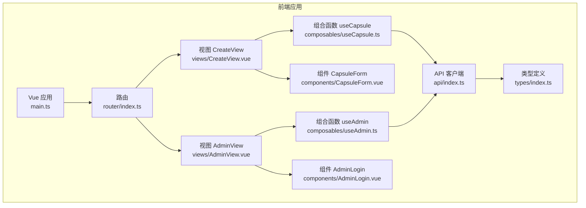
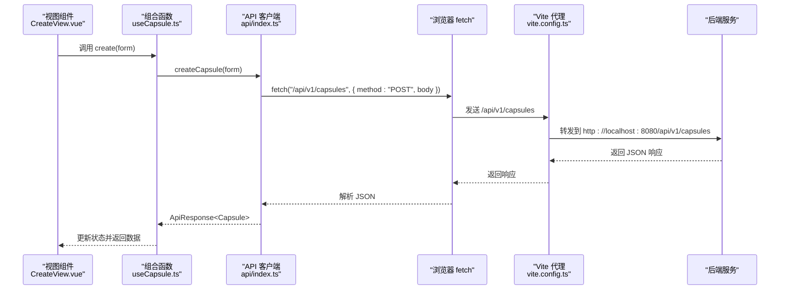
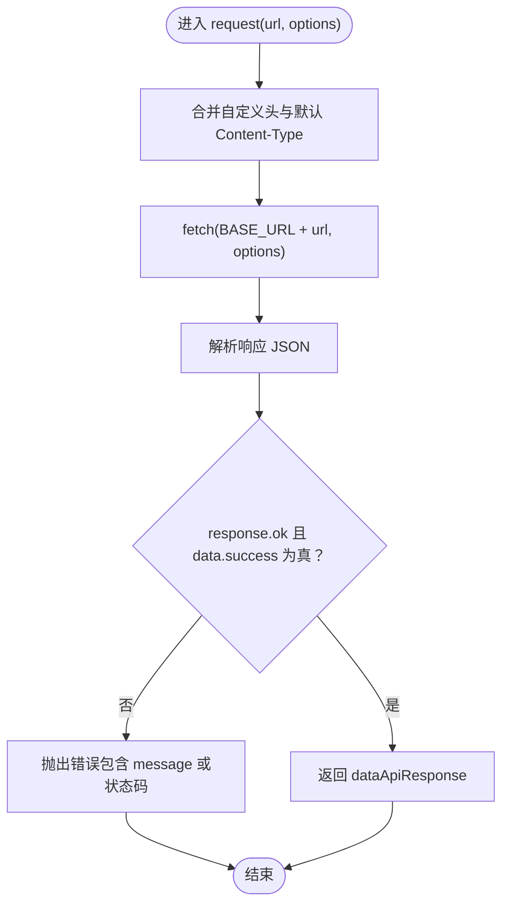
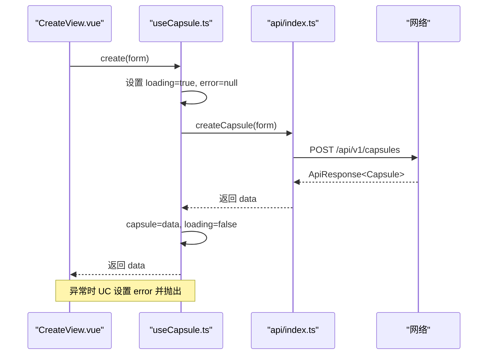
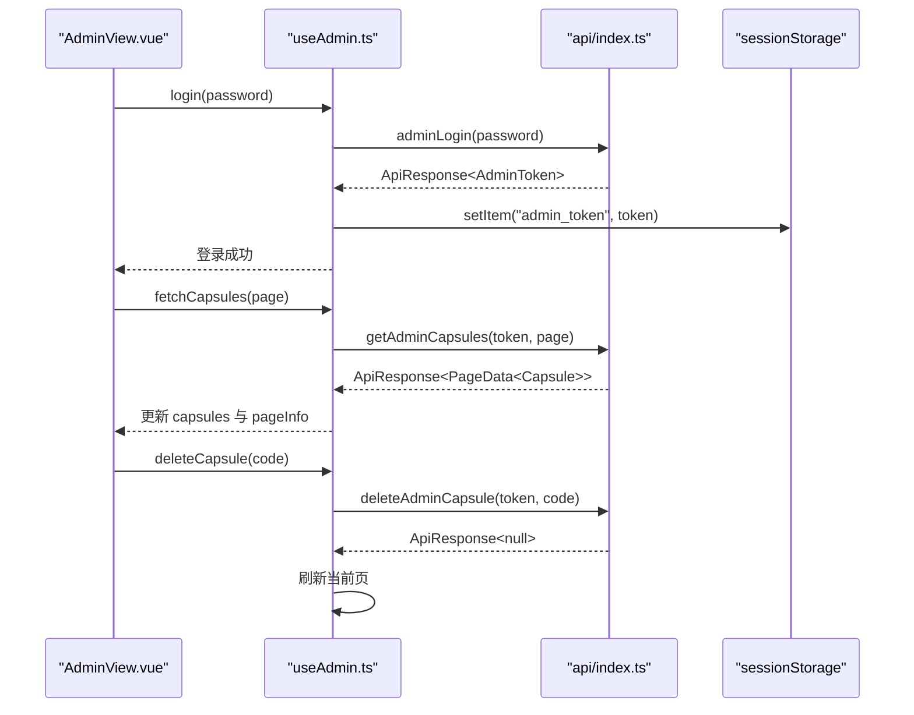
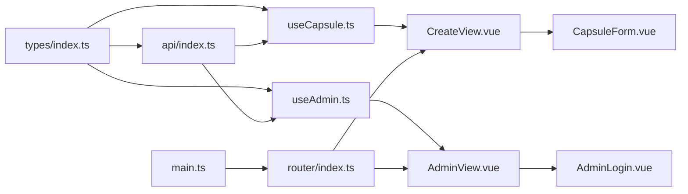

# API集成与数据交互

<cite>
**本文引用的文件**
- [frontends/vue3-ts/src/api/index.ts](file://frontends/vue3-ts/src/api/index.ts)
- [frontends/vue3-ts/src/composables/useCapsule.ts](file://frontends/vue3-ts/src/composables/useCapsule.ts)
- [frontends/vue3-ts/src/composables/useAdmin.ts](file://frontends/vue3-ts/src/composables/useAdmin.ts)
- [frontends/vue3-ts/src/types/index.ts](file://frontends/vue3-ts/src/types/index.ts)
- [frontends/vue3-ts/src/views/CreateView.vue](file://frontends/vue3-ts/src/views/CreateView.vue)
- [frontends/vue3-ts/src/views/AdminView.vue](file://frontends/vue3-ts/src/views/AdminView.vue)
- [frontends/vue3-ts/src/components/CapsuleForm.vue](file://frontends/vue3-ts/src/components/CapsuleForm.vue)
- [frontends/vue3-ts/src/components/AdminLogin.vue](file://frontends/vue3-ts/src/components/AdminLogin.vue)
- [frontends/vue3-ts/src/router/index.ts](file://frontends/vue3-ts/src/router/index.ts)
- [frontends/vue3-ts/src/main.ts](file://frontends/vue3-ts/src/main.ts)
- [frontends/vue3-ts/src/env.d.ts](file://frontends/vue3-ts/src/env.d.ts)
- [frontends/vue3-ts/vite.config.ts](file://frontends/vue3-ts/vite.config.ts)
- [frontends/vue3-ts/package.json](file://frontends/vue3-ts/package.json)
- [frontends/vue3-ts/src/__tests__/composables/useCapsule.test.ts](file://frontends/vue3-ts/src/__tests__/composables/useCapsule.test.ts)
</cite>

## 目录
1. [简介](#简介)
2. [项目结构](#项目结构)
3. [核心组件](#核心组件)
4. [架构总览](#架构总览)
5. [详细组件分析](#详细组件分析)
6. [依赖关系分析](#依赖关系分析)
7. [性能考量](#性能考量)
8. [故障排查指南](#故障排查指南)
9. [结论](#结论)
10. [附录](#附录)

## 简介
本文件面向Vue 3 + TypeScript前端，系统性梳理“API集成与数据交互”的设计与实现，重点覆盖：
- API客户端设计与实现：请求封装、统一错误处理
- HTTP请求策略：GET、POST、PUT、DELETE的使用方式
- 数据类型定义与验证：TypeScript接口、运行时校验、数据转换
- 错误处理与重试机制：网络错误、HTTP状态码、用户友好提示
- API缓存策略与性能优化：请求去重、缓存失效、预加载
- 最佳实践：环境变量配置、API版本管理、安全考虑
- 实际调用示例与调试技巧

## 项目结构
Vue 3前端采用按功能域组织的目录结构，API相关代码集中在以下位置：
- API封装：src/api/index.ts
- 业务组合函数：src/composables/useCapsule.ts、src/composables/useAdmin.ts
- 类型定义：src/types/index.ts
- 视图与组件：src/views/*.vue、src/components/*.vue
- 路由与入口：src/router/index.ts、src/main.ts
- 构建与代理：vite.config.ts、package.json

图表来源
- [frontends/vue3-ts/src/main.ts:1-23](file://frontends/vue3-ts/src/main.ts#L1-L23)
- [frontends/vue3-ts/src/router/index.ts:1-44](file://frontends/vue3-ts/src/router/index.ts#L1-L44)
- [frontends/vue3-ts/src/api/index.ts:1-120](file://frontends/vue3-ts/src/api/index.ts#L1-L120)
- [frontends/vue3-ts/src/types/index.ts:1-80](file://frontends/vue3-ts/src/types/index.ts#L1-L80)
- [frontends/vue3-ts/src/composables/useCapsule.ts:1-65](file://frontends/vue3-ts/src/composables/useCapsule.ts#L1-L65)
- [frontends/vue3-ts/src/composables/useAdmin.ts:1-132](file://frontends/vue3-ts/src/composables/useAdmin.ts#L1-L132)
- [frontends/vue3-ts/src/views/CreateView.vue:1-106](file://frontends/vue3-ts/src/views/CreateView.vue#L1-L106)
- [frontends/vue3-ts/src/views/AdminView.vue:1-89](file://frontends/vue3-ts/src/views/AdminView.vue#L1-L89)
- [frontends/vue3-ts/src/components/CapsuleForm.vue:1-165](file://frontends/vue3-ts/src/components/CapsuleForm.vue#L1-L165)
- [frontends/vue3-ts/src/components/AdminLogin.vue:1-57](file://frontends/vue3-ts/src/components/AdminLogin.vue#L1-L57)

章节来源
- [frontends/vue3-ts/src/main.ts:1-23](file://frontends/vue3-ts/src/main.ts#L1-L23)
- [frontends/vue3-ts/src/router/index.ts:1-44](file://frontends/vue3-ts/src/router/index.ts#L1-L44)

## 核心组件
- API客户端模块：封装通用请求、统一错误处理、暴露REST方法（创建胶囊、查询胶囊、管理员登录、分页查询、删除胶囊、健康检查）
- 组合函数useCapsule：封装创建与查询的响应式状态与错误处理
- 组合函数useAdmin：封装管理员登录、登出、分页列表加载、删除胶囊、Token持久化
- 类型系统：统一响应体、胶囊数据、分页、管理员Token、健康信息等

章节来源
- [frontends/vue3-ts/src/api/index.ts:1-120](file://frontends/vue3-ts/src/api/index.ts#L1-L120)
- [frontends/vue3-ts/src/composables/useCapsule.ts:1-65](file://frontends/vue3-ts/src/composables/useCapsule.ts#L1-L65)
- [frontends/vue3-ts/src/composables/useAdmin.ts:1-132](file://frontends/vue3-ts/src/composables/useAdmin.ts#L1-L132)
- [frontends/vue3-ts/src/types/index.ts:1-80](file://frontends/vue3-ts/src/types/index.ts#L1-L80)

## 架构总览
前端通过Vite开发服务器与后端FastAPI/Spring Boot进行交互，开发环境下通过代理将/api/v1前缀转发至后端服务。

图表来源
- [frontends/vue3-ts/src/views/CreateView.vue:1-106](file://frontends/vue3-ts/src/views/CreateView.vue#L1-L106)
- [frontends/vue3-ts/src/composables/useCapsule.ts:1-65](file://frontends/vue3-ts/src/composables/useCapsule.ts#L1-L65)
- [frontends/vue3-ts/src/api/index.ts:1-120](file://frontends/vue3-ts/src/api/index.ts#L1-L120)
- [frontends/vue3-ts/vite.config.ts:1-23](file://frontends/vue3-ts/vite.config.ts#L1-L23)

## 详细组件分析

### API客户端模块（request与各REST方法）
- 设计要点
  - 统一基础路径：/api/v1
  - 通用请求封装：request(url, options)负责JSON序列化、设置Content-Type、解析响应、统一错误处理
  - 统一错误处理：当response.ok为false或data.success为false时抛出错误
  - 方法覆盖：创建胶囊、查询胶囊、管理员登录、分页查询、删除胶囊、健康检查
  - 数据转换：创建胶囊时将openAt转换为ISO 8601字符串

图表来源
- [frontends/vue3-ts/src/api/index.ts:19-37](file://frontends/vue3-ts/src/api/index.ts#L19-L37)

章节来源
- [frontends/vue3-ts/src/api/index.ts:1-120](file://frontends/vue3-ts/src/api/index.ts#L1-L120)

### useCapsule组合函数（创建与查询）
- 设计要点
  - 响应式状态：capsule、loading、error
  - create：调用API，设置loading/error，成功写入capsule，finally关闭loading
  - get：调用API，设置loading/error，成功写入capsule，finally关闭loading
  - 错误处理：捕获未知错误，统一设置error并抛出

图表来源
- [frontends/vue3-ts/src/views/CreateView.vue:36-69](file://frontends/vue3-ts/src/views/CreateView.vue#L36-L69)
- [frontends/vue3-ts/src/composables/useCapsule.ts:24-37](file://frontends/vue3-ts/src/composables/useCapsule.ts#L24-L37)
- [frontends/vue3-ts/src/api/index.ts:46-54](file://frontends/vue3-ts/src/api/index.ts#L46-L54)

章节来源
- [frontends/vue3-ts/src/composables/useCapsule.ts:1-65](file://frontends/vue3-ts/src/composables/useCapsule.ts#L1-L65)
- [frontends/vue3-ts/src/views/CreateView.vue:1-106](file://frontends/vue3-ts/src/views/CreateView.vue#L1-L106)

### useAdmin组合函数（管理员登录、列表、删除）
- 设计要点
  - Token持久化：sessionStorage存储admin_token，初始化从sessionStorage读取
  - 登录：调用adminLogin，成功后写入token并持久化
  - 列表：getAdminCapsules(token, page)，更新capsules与pageInfo
  - 删除：deleteAdminCapsule(token, code)，删除成功后刷新当前页
  - 登出：清空token、列表、sessionStorage
  - 自动登出：当错误包含“认证”字样时触发logout

图表来源
- [frontends/vue3-ts/src/views/AdminView.vue:42-89](file://frontends/vue3-ts/src/views/AdminView.vue#L42-L89)
- [frontends/vue3-ts/src/composables/useAdmin.ts:43-116](file://frontends/vue3-ts/src/composables/useAdmin.ts#L43-L116)
- [frontends/vue3-ts/src/api/index.ts:74-111](file://frontends/vue3-ts/src/api/index.ts#L74-L111)

章节来源
- [frontends/vue3-ts/src/composables/useAdmin.ts:1-132](file://frontends/vue3-ts/src/composables/useAdmin.ts#L1-L132)
- [frontends/vue3-ts/src/views/AdminView.vue:1-89](file://frontends/vue3-ts/src/views/AdminView.vue#L1-L89)

### 类型系统与数据验证
- 统一响应体：ApiResponse<T>包含success、data、message、errorCode
- 胶囊数据：Capsule包含code、title、content（可能为空）、creator、openAt、createdAt、opened
- 创建表单：CreateCapsuleForm包含title、content、creator、openAt
- 分页数据：PageData<T>包含content[]、totalElements、totalPages、number、size
- 管理员Token：AdminToken包含token
- 健康信息：HealthInfo包含status、timestamp、techStack
- 表单验证：CapsuleForm在前端进行必填与时间有效性校验，避免无效请求

章节来源
- [frontends/vue3-ts/src/types/index.ts:1-80](file://frontends/vue3-ts/src/types/index.ts#L1-L80)
- [frontends/vue3-ts/src/components/CapsuleForm.vue:95-122](file://frontends/vue3-ts/src/components/CapsuleForm.vue#L95-L122)

### 错误处理与用户提示
- API层统一错误：request在response.ok为false或data.success为false时抛错
- 组合函数层错误：useCapsule与useAdmin捕获错误，设置error并抛出，便于上层组件显示
- 管理员场景：当错误包含“认证”字样时自动登出，防止无效状态
- 用户界面：CreateView与AdminView根据loading与error渲染提示与禁用态

章节来源
- [frontends/vue3-ts/src/api/index.ts:31-34](file://frontends/vue3-ts/src/api/index.ts#L31-L34)
- [frontends/vue3-ts/src/composables/useCapsule.ts:31-36](file://frontends/vue3-ts/src/composables/useCapsule.ts#L31-L36)
- [frontends/vue3-ts/src/composables/useAdmin.ts:88-92](file://frontends/vue3-ts/src/composables/useAdmin.ts#L88-L92)
- [frontends/vue3-ts/src/views/CreateView.vue:21-23](file://frontends/vue3-ts/src/views/CreateView.vue#L21-L23)
- [frontends/vue3-ts/src/views/AdminView.vue:8-13](file://frontends/vue3-ts/src/views/AdminView.vue#L8-L13)

### HTTP请求封装策略
- GET：getCapsule(code)、getHealthInfo()、getAdminCapsules(token, page, size)
- POST：createCapsule(form)、adminLogin(password)
- DELETE：deleteAdminCapsule(token, code)
- 请求头：统一设置Content-Type为application/json；管理员接口附加Authorization: Bearer token
- 数据转换：创建胶囊时将openAt转换为ISO 8601字符串

章节来源
- [frontends/vue3-ts/src/api/index.ts:46-119](file://frontends/vue3-ts/src/api/index.ts#L46-L119)

### 缓存策略与性能优化
- 请求去重：当前实现未内置请求去重逻辑，建议在组合函数层以key为code的Map缓存Promise，避免重复请求
- 缓存失效：管理员列表采用“删除后刷新当前页”的策略，确保UI与后端一致
- 预加载机制：可在路由守卫或组件挂载时预取必要数据，减少首屏等待
- 代理与跨域：Vite开发代理将/api转发至后端，避免CORS问题

章节来源
- [frontends/vue3-ts/vite.config.ts:13-21](file://frontends/vue3-ts/vite.config.ts#L13-L21)
- [frontends/vue3-ts/src/composables/useAdmin.ts:109-116](file://frontends/vue3-ts/src/composables/useAdmin.ts#L109-L116)

### 测试与调试
- 单元测试：useCapsule组合函数的测试覆盖了成功与失败场景，模拟API调用并断言状态变化
- 调试技巧：利用浏览器Network面板观察/api/v1请求；在控制台打印组合函数返回的状态；结合Vite代理确认转发正确

章节来源
- [frontends/vue3-ts/src/__tests__/composables/useCapsule.test.ts:1-68](file://frontends/vue3-ts/src/__tests__/composables/useCapsule.test.ts#L1-L68)

## 依赖关系分析
- 组件依赖：视图组件依赖组合函数；组合函数依赖API客户端；API客户端依赖类型定义
- 路由依赖：路由懒加载视图组件
- 构建依赖：Vite别名@指向src，@spec指向spec；代理/api转发后端

图表来源
- [frontends/vue3-ts/src/types/index.ts:1-80](file://frontends/vue3-ts/src/types/index.ts#L1-L80)
- [frontends/vue3-ts/src/api/index.ts:1-120](file://frontends/vue3-ts/src/api/index.ts#L1-L120)
- [frontends/vue3-ts/src/composables/useCapsule.ts:1-65](file://frontends/vue3-ts/src/composables/useCapsule.ts#L1-L65)
- [frontends/vue3-ts/src/composables/useAdmin.ts:1-132](file://frontends/vue3-ts/src/composables/useAdmin.ts#L1-L132)
- [frontends/vue3-ts/src/views/CreateView.vue:1-106](file://frontends/vue3-ts/src/views/CreateView.vue#L1-L106)
- [frontends/vue3-ts/src/views/AdminView.vue:1-89](file://frontends/vue3-ts/src/views/AdminView.vue#L1-L89)
- [frontends/vue3-ts/src/components/CapsuleForm.vue:1-165](file://frontends/vue3-ts/src/components/CapsuleForm.vue#L1-L165)
- [frontends/vue3-ts/src/components/AdminLogin.vue:1-57](file://frontends/vue3-ts/src/components/AdminLogin.vue#L1-L57)
- [frontends/vue3-ts/src/router/index.ts:1-44](file://frontends/vue3-ts/src/router/index.ts#L1-L44)
- [frontends/vue3-ts/src/main.ts:1-23](file://frontends/vue3-ts/src/main.ts#L1-L23)

## 性能考量
- 减少不必要的渲染：组合函数内部使用ref管理状态，仅在赋值时触发更新
- 请求去重：在组合函数层以请求参数为key缓存Promise，避免并发重复请求
- 列表刷新：删除后仅刷新当前页，降低网络与渲染压力
- 代理优化：开发环境通过Vite代理减少跨域与额外握手
- 资源懒加载：路由按需加载视图组件，提升首屏性能

## 故障排查指南
- 网络错误
  - 确认Vite代理配置是否正确转发/api到后端
  - 检查后端服务是否启动并监听8080端口
- HTTP状态码处理
  - API层统一抛错，组合函数捕获并显示error
  - 管理员接口若出现认证错误，自动登出并清空本地状态
- 用户友好提示
  - 在视图层根据loading与error渲染加载态与错误提示
  - 表单组件在前端完成基础校验，减少无效请求
- 调试技巧
  - 打开浏览器开发者工具，查看Network标签下的/api/v1请求
  - 在控制台输出组合函数的状态ref，观察loading与error变化

章节来源
- [frontends/vue3-ts/vite.config.ts:13-21](file://frontends/vue3-ts/vite.config.ts#L13-L21)
- [frontends/vue3-ts/src/composables/useAdmin.ts:88-92](file://frontends/vue3-ts/src/composables/useAdmin.ts#L88-L92)
- [frontends/vue3-ts/src/views/CreateView.vue:21-23](file://frontends/vue3-ts/src/views/CreateView.vue#L21-L23)
- [frontends/vue3-ts/src/components/CapsuleForm.vue:95-122](file://frontends/vue3-ts/src/components/CapsuleForm.vue#L95-L122)

## 结论
该Vue 3前端通过清晰的API客户端封装、组合函数抽象与严格的类型系统，实现了稳定的数据交互与良好的用户体验。建议在现有基础上引入请求去重、更细粒度的缓存策略与统一的重试机制，进一步提升性能与可靠性。

## 附录

### API集成最佳实践
- 环境变量配置
  - 基础URL与后端地址可通过环境变量注入，便于多环境切换
- API版本管理
  - 通过BASE_URL前缀区分版本，如/api/v1、/api/v2
- 安全考虑
  - 管理员Token存储在sessionStorage，避免localStorage带来的XSS风险
  - 所有管理员接口均携带Authorization头，严格区分权限
- 错误与重试
  - 统一错误处理与用户提示
  - 对临时性网络错误可引入指数退避重试，但需限制次数与避免风暴

### 实际调用示例与调试技巧
- 示例路径
  - 创建胶囊：[frontends/vue3-ts/src/views/CreateView.vue:53-62](file://frontends/vue3-ts/src/views/CreateView.vue#L53-L62)
  - 管理员登录与列表：[frontends/vue3-ts/src/views/AdminView.vue:64-81](file://frontends/vue3-ts/src/views/AdminView.vue#L64-L81)
  - API方法定义：[frontends/vue3-ts/src/api/index.ts:46-119](file://frontends/vue3-ts/src/api/index.ts#L46-L119)
- 调试技巧
  - 使用浏览器Network面板观察/api/v1请求与响应
  - 在组合函数中打印loading与error，快速定位问题
  - 通过Vite代理确认/api前缀被正确转发