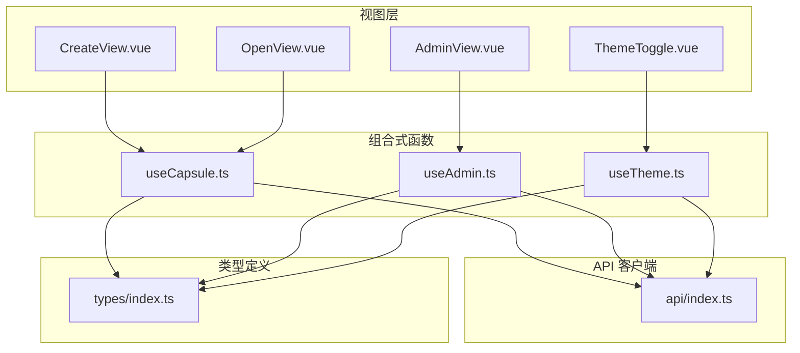
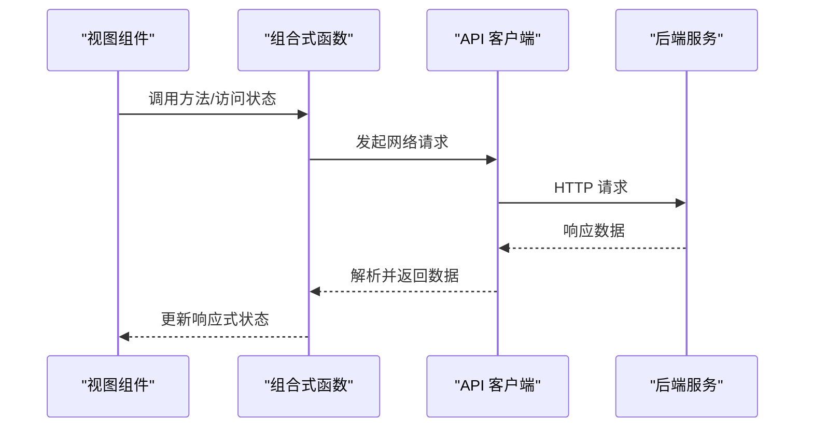
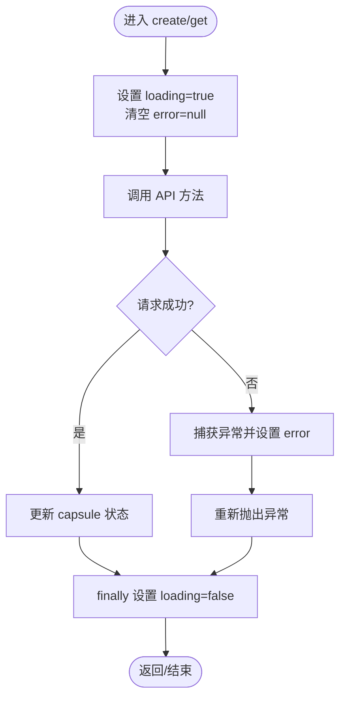
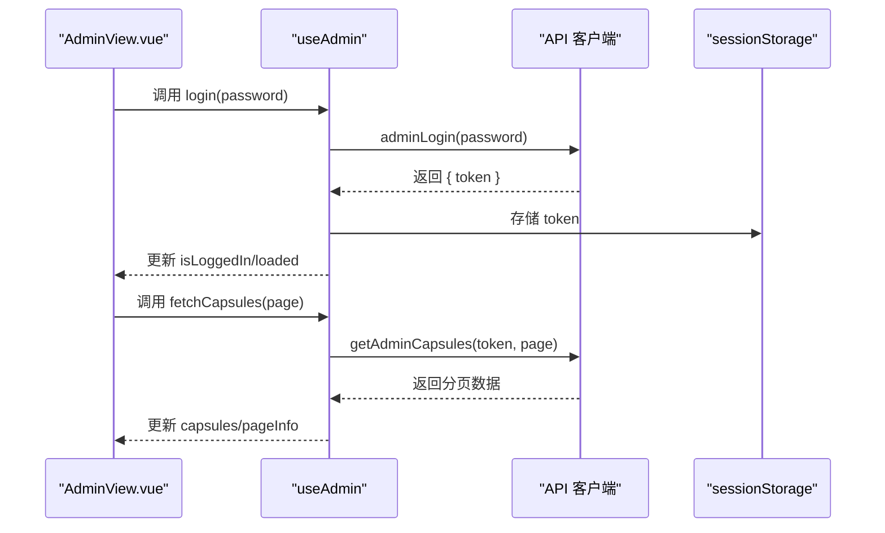
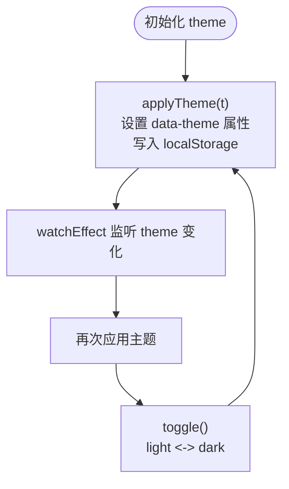
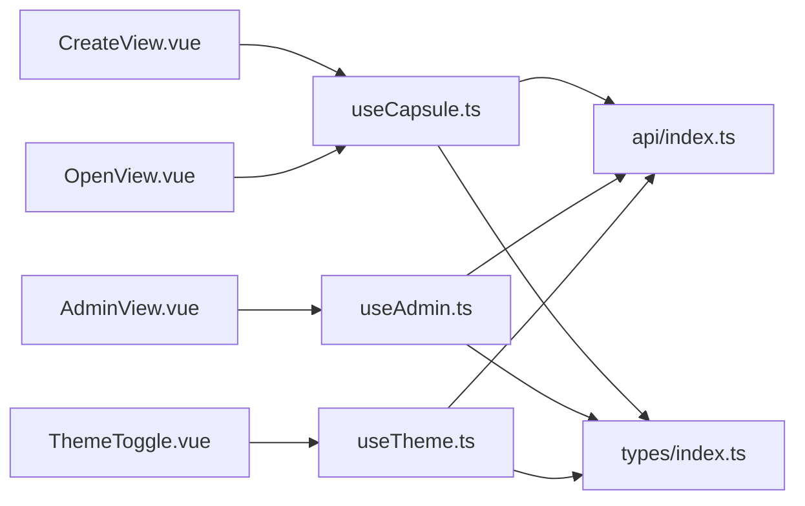

# Composition API 与可复用逻辑

<cite>
**本文档引用的文件**
- [useCapsule.ts](file://frontends/vue3-ts/src/composables/useCapsule.ts)
- [useAdmin.ts](file://frontends/vue3-ts/src/composables/useAdmin.ts)
- [useTheme.ts](file://frontends/vue3-ts/src/composables/useTheme.ts)
- [useCapsule.test.ts](file://frontends/vue3-ts/src/__tests__/composables/useCapsule.test.ts)
- [useTheme.test.ts](file://frontends/vue3-ts/src/__tests__/composables/useTheme.test.ts)
- [AdminView.vue](file://frontends/vue3-ts/src/views/AdminView.vue)
- [CreateView.vue](file://frontends/vue3-ts/src/views/CreateView.vue)
- [OpenView.vue](file://frontends/vue3-ts/src/views/OpenView.vue)
- [ThemeToggle.vue](file://frontends/vue3-ts/src/components/ThemeToggle.vue)
- [index.ts](file://frontends/vue3-ts/src/api/index.ts)
- [index.ts](file://frontends/vue3-ts/src/types/index.ts)
- [main.ts](file://frontends/vue3-ts/src/main.ts)
</cite>

## 目录
1. [简介](#简介)
2. [项目结构](#项目结构)
3. [核心组件](#核心组件)
4. [架构总览](#架构总览)
5. [详细组件分析](#详细组件分析)
6. [依赖关系分析](#依赖关系分析)
7. [性能考量](#性能考量)
8. [故障排查指南](#故障排查指南)
9. [结论](#结论)
10. [附录](#附录)

## 简介
本文件系统性阐述 Vue 3 Composition API 在本项目中的设计理念与实践模式，重点覆盖以下方面：
- setup 函数与组合式函数的职责划分
- 响应式引用、计算属性、侦听器的使用
- 可复用组合式函数的设计原则与最佳实践
- 业务逻辑抽离与测试隔离
- 生命周期钩子、依赖注入、异步数据获取
- 实际使用示例与常见问题解决

## 项目结构
Vue 3 前端采用“视图层 + 组合式函数 + API 客户端 + 类型定义”的分层组织方式：
- 视图层：各页面组件通过 script setup 使用组合式函数
- 组合式函数：封装可复用的业务逻辑与状态
- API 客户端：统一请求封装与错误处理
- 类型定义：前后端契约与数据模型

图表来源
- [CreateView.vue:36-69](file://frontends/vue3-ts/src/views/CreateView.vue#L36-L69)
- [OpenView.vue:23-44](file://frontends/vue3-ts/src/views/OpenView.vue#L23-L44)
- [AdminView.vue:42-88](file://frontends/vue3-ts/src/views/AdminView.vue#L42-L88)
- [ThemeToggle.vue:8-12](file://frontends/vue3-ts/src/components/ThemeToggle.vue#L8-L12)
- [useCapsule.ts:10-64](file://frontends/vue3-ts/src/composables/useCapsule.ts#L10-L64)
- [useAdmin.ts:18-131](file://frontends/vue3-ts/src/composables/useAdmin.ts#L18-L131)
- [useTheme.ts:46-57](file://frontends/vue3-ts/src/composables/useTheme.ts#L46-L57)
- [index.ts:19-37](file://frontends/vue3-ts/src/api/index.ts#L19-L37)
- [index.ts:10-80](file://frontends/vue3-ts/src/types/index.ts#L10-L80)

章节来源
- [main.ts:1-23](file://frontends/vue3-ts/src/main.ts#L1-L23)

## 核心组件
本项目围绕三个核心组合式函数构建：
- useCapsule：封装胶囊的创建与查询逻辑，暴露响应式状态与异步方法
- useAdmin：封装管理员登录、登出、分页查询与删除逻辑，并持久化 Token
- useTheme：封装主题状态与切换逻辑，持久化用户偏好

章节来源
- [useCapsule.ts:10-64](file://frontends/vue3-ts/src/composables/useCapsule.ts#L10-L64)
- [useAdmin.ts:18-131](file://frontends/vue3-ts/src/composables/useAdmin.ts#L18-L131)
- [useTheme.ts:46-57](file://frontends/vue3-ts/src/composables/useTheme.ts#L46-L57)

## 架构总览
下图展示了视图层、组合式函数与 API 客户端之间的交互关系。

图表来源
- [CreateView.vue:43-62](file://frontends/vue3-ts/src/views/CreateView.vue#L43-L62)
- [OpenView.vue:31-44](file://frontends/vue3-ts/src/views/OpenView.vue#L31-L44)
- [AdminView.vue:49-87](file://frontends/vue3-ts/src/views/AdminView.vue#L49-L87)
- [index.ts:19-37](file://frontends/vue3-ts/src/api/index.ts#L19-L37)

## 详细组件分析

### useCapsule 组合式函数
- 设计理念
  - 将“创建”和“查询”两个核心业务流程抽象为可复用的组合式函数
  - 通过响应式引用管理加载态、错误态与数据态
  - 将 API 调用封装在组合式函数内部，便于测试与复用
- 关键实现要点
  - 状态：胶囊数据、加载状态、错误信息
  - 方法：create(form)、get(code)，均包含统一的错误捕获与 finally 清理
  - 返回值：将状态与方法以只读形式暴露，避免外部直接修改
- 使用场景
  - 创建视图：收集表单数据，调用 create，展示成功态与胶囊码
  - 开启视图：接收用户输入的胶囊码，调用 get，渲染胶囊卡片
- 测试策略
  - 单元测试覆盖成功与失败分支，验证状态变更与错误信息

图表来源
- [useCapsule.ts:24-60](file://frontends/vue3-ts/src/composables/useCapsule.ts#L24-L60)

章节来源
- [useCapsule.ts:10-64](file://frontends/vue3-ts/src/composables/useCapsule.ts#L10-L64)
- [CreateView.vue:36-69](file://frontends/vue3-ts/src/views/CreateView.vue#L36-L69)
- [OpenView.vue:23-44](file://frontends/vue3-ts/src/views/OpenView.vue#L23-L44)
- [useCapsule.test.ts:14-67](file://frontends/vue3-ts/src/__tests__/composables/useCapsule.test.ts#L14-L67)

### useAdmin 组合式函数
- 设计理念
  - 将管理员认证与管理功能集中在一个组合式函数中
  - 使用 sessionStorage 持久化 Token，自动清理会话状态
  - 通过计算属性提供 isLoggedIn 等派生状态
- 关键实现要点
  - 状态：胶囊列表、分页信息、加载态、错误态、Token
  - 方法：login(password)、logout()、fetchCapsules(page)、deleteCapsule(code)
  - 自动处理认证失效：当检测到认证错误时自动登出
- 使用场景
  - 管理后台：登录后拉取分页数据，支持删除与刷新
- 测试策略
  - 通过模拟 API 返回与 DOM 操作验证主题初始化与切换

图表来源
- [AdminView.vue:49-87](file://frontends/vue3-ts/src/views/AdminView.vue#L49-L87)
- [useAdmin.ts:43-96](file://frontends/vue3-ts/src/composables/useAdmin.ts#L43-L96)
- [index.ts:74-95](file://frontends/vue3-ts/src/api/index.ts#L74-L95)

章节来源
- [useAdmin.ts:18-131](file://frontends/vue3-ts/src/composables/useAdmin.ts#L18-L131)
- [AdminView.vue:42-88](file://frontends/vue3-ts/src/views/AdminView.vue#L42-L88)
- [useTheme.test.ts:4-22](file://frontends/vue3-ts/src/__tests__/composables/useTheme.test.ts#L4-L22)

### useTheme 组合式函数
- 设计理念
  - 将主题偏好持久化到 localStorage，并在 DOM 上应用 data-theme 属性
  - 使用 watchEffect 自动同步主题状态到 DOM，确保即时生效
- 关键实现要点
  - 状态：当前主题（light/dark）
  - 方法：toggle() 切换主题
  - 初始化：SSR 环境下安全地应用初始主题
- 使用场景
  - 任何需要主题切换的 UI 组件，如 ThemeToggle
- 测试策略
  - 验证默认主题、切换行为与 DOM 属性更新

图表来源
- [useTheme.ts:13-38](file://frontends/vue3-ts/src/composables/useTheme.ts#L13-L38)
- [useTheme.ts:51-53](file://frontends/vue3-ts/src/composables/useTheme.ts#L51-L53)

章节来源
- [useTheme.ts:46-57](file://frontends/vue3-ts/src/composables/useTheme.ts#L46-L57)
- [ThemeToggle.vue:8-12](file://frontends/vue3-ts/src/components/ThemeToggle.vue#L8-L12)
- [useTheme.test.ts:4-22](file://frontends/vue3-ts/src/__tests__/composables/useTheme.test.ts#L4-L22)

### API 客户端与类型定义
- API 客户端
  - request(url, options)：统一处理 Content-Type、响应解析与错误抛出
  - 具体方法：createCapsule、getCapsule、adminLogin、getAdminCapsules、deleteAdminCapsule、getHealthInfo
- 类型定义
  - Capsule、CreateCapsuleForm、ApiResponse、PageData、AdminToken、HealthInfo 等
  - 保证前后端契约一致，提升开发效率与可维护性

章节来源
- [index.ts:19-37](file://frontends/vue3-ts/src/api/index.ts#L19-L37)
- [index.ts:46-119](file://frontends/vue3-ts/src/api/index.ts#L46-L119)
- [index.ts:10-80](file://frontends/vue3-ts/src/types/index.ts#L10-L80)

## 依赖关系分析
- 组合式函数依赖 API 客户端进行网络请求
- 视图组件通过组合式函数暴露的状态与方法进行数据绑定与事件处理
- 类型定义贯穿于 API 客户端与组合式函数之间，确保类型安全

图表来源
- [CreateView.vue:39-43](file://frontends/vue3-ts/src/views/CreateView.vue#L39-L43)
- [OpenView.vue:31-31](file://frontends/vue3-ts/src/views/OpenView.vue#L31-L31)
- [AdminView.vue:49-59](file://frontends/vue3-ts/src/views/AdminView.vue#L49-L59)
- [ThemeToggle.vue:11-11](file://frontends/vue3-ts/src/components/ThemeToggle.vue#L11-L11)
- [useCapsule.ts:10-14](file://frontends/vue3-ts/src/composables/useCapsule.ts#L10-L14)
- [useAdmin.ts:18-28](file://frontends/vue3-ts/src/composables/useAdmin.ts#L18-L28)
- [useTheme.ts:46-55](file://frontends/vue3-ts/src/composables/useTheme.ts#L46-L55)

章节来源
- [CreateView.vue:36-69](file://frontends/vue3-ts/src/views/CreateView.vue#L36-L69)
- [OpenView.vue:23-44](file://frontends/vue3-ts/src/views/OpenView.vue#L23-L44)
- [AdminView.vue:42-88](file://frontends/vue3-ts/src/views/AdminView.vue#L42-L88)
- [ThemeToggle.vue:8-12](file://frontends/vue3-ts/src/components/ThemeToggle.vue#L8-L12)

## 性能考量
- 响应式粒度控制：仅暴露必要的状态与方法，避免过度响应式导致的不必要重渲染
- 异步流程优化：在 finally 中统一清理 loading，减少 UI 卡顿
- 侦听器最小化：仅在必要时使用 watch/watchEffect，避免频繁 DOM 操作
- 缓存与去抖：对于高频查询可考虑引入缓存或节流策略（建议在具体场景中按需实现）

## 故障排查指南
- 创建/查询失败
  - 现象：error 状态非空，UI 显示错误提示
  - 排查：检查 API 返回与错误信息；确认网络连通性
  - 参考：[useCapsule.ts:31-36](file://frontends/vue3-ts/src/composables/useCapsule.ts#L31-L36)
- 管理员登录后无法拉取数据
  - 现象：fetchCapsules 无数据或报认证错误
  - 排查：确认 Token 是否正确存储；检查认证头；必要时触发 logout 清理
  - 参考：[useAdmin.ts:74-96](file://frontends/vue3-ts/src/composables/useAdmin.ts#L74-L96)
- 主题切换无效
  - 现象：点击切换按钮后样式未变化
  - 排查：确认 data-theme 属性是否正确设置；检查 localStorage 是否写入
  - 参考：[useTheme.ts:20-23](file://frontends/vue3-ts/src/composables/useTheme.ts#L20-L23)

章节来源
- [useCapsule.ts:31-36](file://frontends/vue3-ts/src/composables/useCapsule.ts#L31-L36)
- [useAdmin.ts:88-96](file://frontends/vue3-ts/src/composables/useAdmin.ts#L88-L96)
- [useTheme.ts:20-23](file://frontends/vue3-ts/src/composables/useTheme.ts#L20-L23)

## 结论
本项目通过组合式函数实现了业务逻辑的高内聚、低耦合与强可测性：
- 将状态与副作用封装在组合式函数中，组件仅负责渲染与事件转发
- 通过统一的 API 客户端与类型定义，保障了前后端契约的一致性
- 以测试驱动的方式验证关键流程，提升了代码质量与可维护性

## 附录

### 最佳实践清单
- 命名规范
  - 组合式函数以 use 前缀命名，语义清晰（如 useCapsule、useAdmin、useTheme）
- 参数与返回值
  - 输入参数尽量使用类型定义，输出返回值明确且不可变
- 副作用处理
  - 在 finally 中清理副作用（如 loading），确保 UI 状态一致性
- 生命周期与依赖注入
  - 在 onMounted 等生命周期钩子中触发数据拉取；通过组合式函数注入依赖
- 异步数据获取
  - 统一错误处理与重试策略，必要时引入缓存与分页优化
- 测试隔离
  - 通过 mock API 与独立测试环境验证组合式函数的行为

### 实际使用示例路径
- 创建胶囊：[CreateView.vue:36-69](file://frontends/vue3-ts/src/views/CreateView.vue#L36-L69) → [useCapsule.ts:24-37](file://frontends/vue3-ts/src/composables/useCapsule.ts#L24-L37)
- 开启胶囊：[OpenView.vue:23-44](file://frontends/vue3-ts/src/views/OpenView.vue#L23-L44) → [useCapsule.ts:47-60](file://frontends/vue3-ts/src/composables/useCapsule.ts#L47-L60)
- 管理后台：[AdminView.vue:42-88](file://frontends/vue3-ts/src/views/AdminView.vue#L42-L88) → [useAdmin.ts:43-116](file://frontends/vue3-ts/src/composables/useAdmin.ts#L43-L116)
- 主题切换：[ThemeToggle.vue:8-12](file://frontends/vue3-ts/src/components/ThemeToggle.vue#L8-L12) → [useTheme.ts:51-53](file://frontends/vue3-ts/src/composables/useTheme.ts#L51-L53)