# useAdmin 组合式函数

<cite>
**本文档引用的文件**
- [useAdmin.ts (Vue)](file://frontends/vue3-ts/src/composables/useAdmin.ts)
- [useAdmin.ts (React)](file://frontends/react-ts/src/hooks/useAdmin.ts)
- [admin.service.ts (Angular)](file://frontends/angular-ts/src/app/services/admin.service.ts)
- [index.ts (API 客户端 - Vue)](file://frontends/vue3-ts/src/api/index.ts)
- [index.ts (API 客户端 - React)](file://frontends/react-ts/src/api/index.ts)
- [index.ts (API 客户端 - Angular)](file://frontends/angular-ts/src/app/api/index.ts)
- [index.ts (类型定义)](file://frontends/vue3-ts/src/types/index.ts)
- [AdminView.vue (Vue)](file://frontends/vue3-ts/src/views/AdminView.vue)
- [AdminView.tsx (React)](file://frontends/react-ts/src/views/AdminView.tsx)
- [admin.component.ts (Angular)](file://frontends/angular-ts/src/app/views/admin/admin.component.ts)
- [index.ts (路由配置 - Vue)](file://frontends/vue3-ts/src/router/index.ts)
</cite>

## 目录
1. [简介](#简介)
2. [项目结构](#项目结构)
3. [核心组件](#核心组件)
4. [架构概览](#架构概览)
5. [详细组件分析](#详细组件分析)
6. [依赖关系分析](#依赖关系分析)
7. [性能考虑](#性能考虑)
8. [故障排除指南](#故障排除指南)
9. [结论](#结论)

## 简介

useAdmin 是一个跨框架的管理员状态管理组合式函数，负责封装管理员认证和管理功能的业务逻辑。该函数在 Vue、React 和 Angular 三个前端框架中都有对应的实现，提供了统一的管理员登录状态管理、认证令牌处理和权限验证功能。

该组合式函数的核心职责包括：
- 管理员登录状态的持久化存储
- JWT 令牌的获取、存储和验证
- 管理员权限的验证和控制
- 胶囊数据的分页查询和管理
- 错误处理和用户体验优化

## 项目结构

项目采用多框架架构，每个前端框架都有独立的实现：

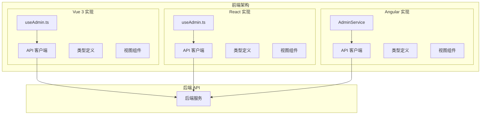

**图表来源**
- [useAdmin.ts (Vue):1-132](file://frontends/vue3-ts/src/composables/useAdmin.ts#L1-L132)
- [useAdmin.ts (React):1-133](file://frontends/react-ts/src/hooks/useAdmin.ts#L1-L133)
- [admin.service.ts (Angular):1-84](file://frontends/angular-ts/src/app/services/admin.service.ts#L1-L84)

**章节来源**
- [useAdmin.ts (Vue):1-132](file://frontends/vue3-ts/src/composables/useAdmin.ts#L1-L132)
- [useAdmin.ts (React):1-133](file://frontends/react-ts/src/hooks/useAdmin.ts#L1-L133)
- [admin.service.ts (Angular):1-84](file://frontends/angular-ts/src/app/services/admin.service.ts#L1-L84)

## 核心组件

### 状态管理架构

三个框架的实现都遵循相似的状态管理模式：

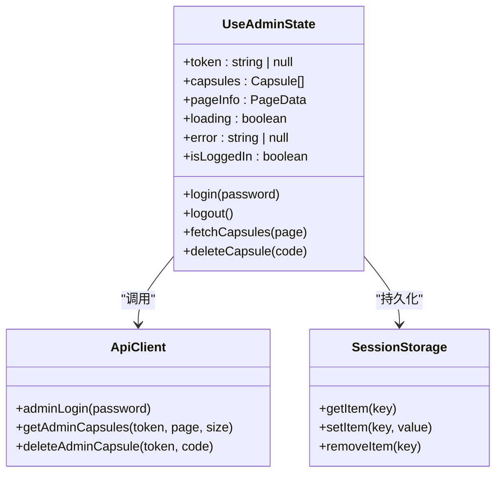

**图表来源**
- [useAdmin.ts (Vue):18-131](file://frontends/vue3-ts/src/composables/useAdmin.ts#L18-L131)
- [useAdmin.ts (React):35-131](file://frontends/react-ts/src/hooks/useAdmin.ts#L35-L131)
- [admin.service.ts (Angular):8-83](file://frontends/angular-ts/src/app/services/admin.service.ts#L8-L83)

### 响应式状态设计

每个实现都提供了完整的响应式状态管理：

| 状态属性 | Vue 实现 | React 实现 | Angular 实现 | 描述 |
|---------|----------|------------|--------------|------|
| token | ref(string \| null) | useSyncExternalStore | signal(string \| null) | JWT 认证令牌 |
| capsules | ref(Capsule[]) | useState(Capsule[]) | signal(Capsule[]) | 胶囊列表数据 |
| pageInfo | ref(PageData) | useState(PageData) | signal(PageData) | 分页信息 |
| loading | ref(boolean) | useState(false) | signal(false) | 加载状态 |
| error | ref(string \| null) | useState(string \| null) | signal(string \| null) | 错误信息 |
| isLoggedIn | computed | boolean | computed | 登录状态计算属性 |

**章节来源**
- [useAdmin.ts (Vue):14-34](file://frontends/vue3-ts/src/composables/useAdmin.ts#L14-L34)
- [useAdmin.ts (React):12-46](file://frontends/react-ts/src/hooks/useAdmin.ts#L12-L46)
- [admin.service.ts (Angular):9-25](file://frontends/angular-ts/src/app/services/admin.service.ts#L9-L25)

## 架构概览

### 认证流程架构

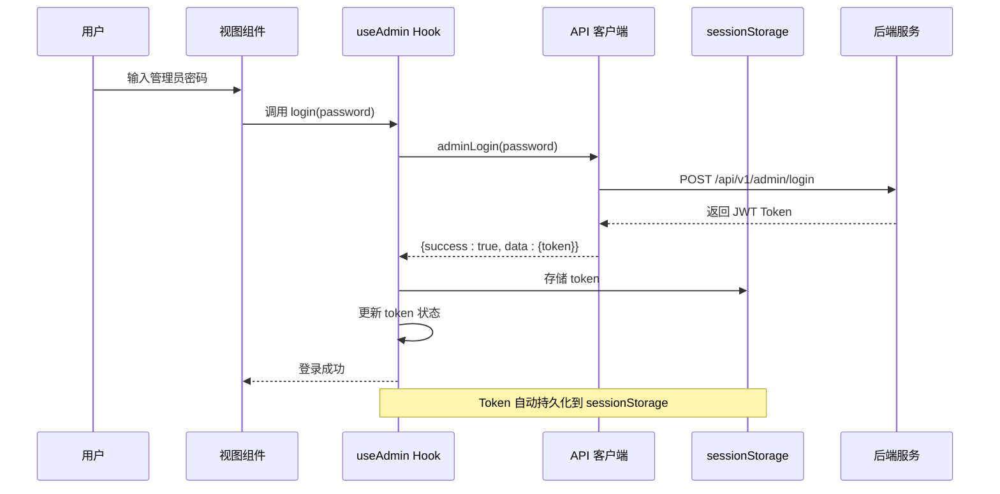

**图表来源**
- [useAdmin.ts (Vue):43-56](file://frontends/vue3-ts/src/composables/useAdmin.ts#L43-L56)
- [useAdmin.ts (React):49-62](file://frontends/react-ts/src/hooks/useAdmin.ts#L49-L62)
- [admin.service.ts (Angular):27-40](file://frontends/angular-ts/src/app/services/admin.service.ts#L27-L40)

### 数据流处理

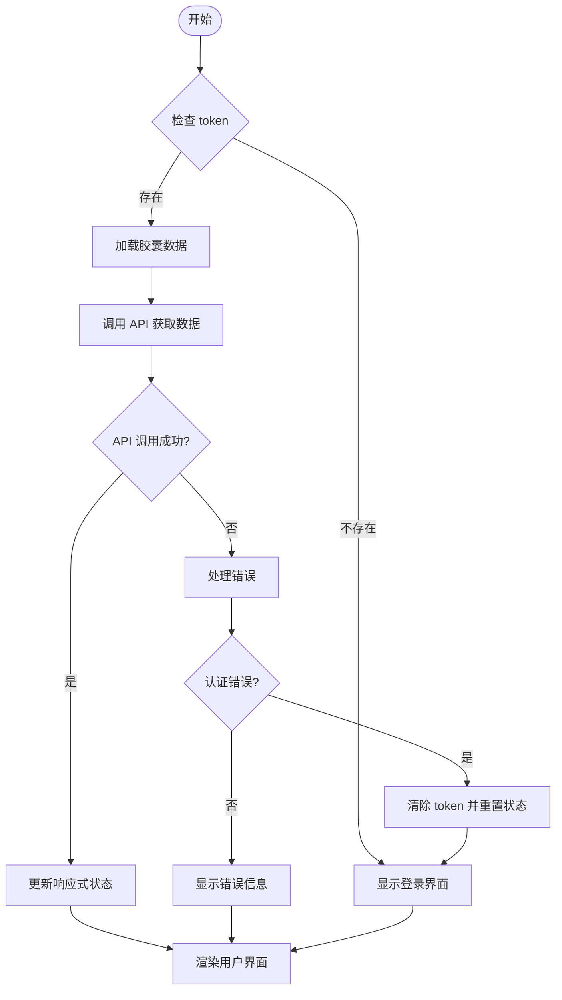

**图表来源**
- [useAdmin.ts (Vue):74-96](file://frontends/vue3-ts/src/composables/useAdmin.ts#L74-L96)
- [useAdmin.ts (React):69-93](file://frontends/react-ts/src/hooks/useAdmin.ts#L69-L93)
- [admin.service.ts (Angular):48-67](file://frontends/angular-ts/src/app/services/admin.service.ts#L48-L67)

## 详细组件分析

### Vue 实现分析

#### 状态初始化

Vue 版本使用 `ref` 和 `computed` 来管理响应式状态：

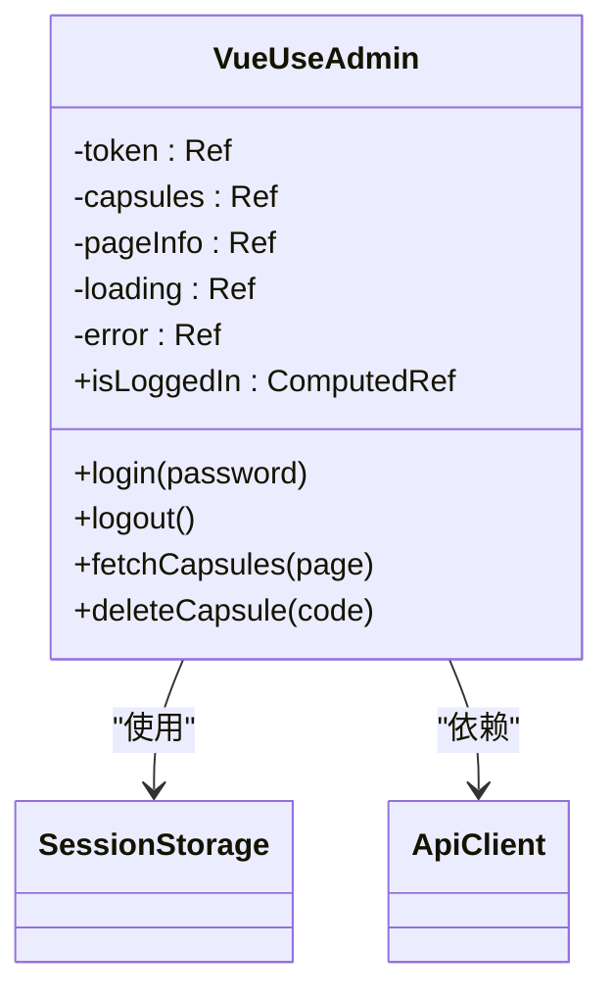

**图表来源**
- [useAdmin.ts (Vue):14-131](file://frontends/vue3-ts/src/composables/useAdmin.ts#L14-L131)

#### 登录流程实现

Vue 版本的登录流程具有以下特点：

1. **异步处理**: 使用 `async/await` 处理登录请求
2. **状态管理**: 在请求前后正确设置 `loading` 和 `error` 状态
3. **错误处理**: 捕获异常并设置错误信息
4. **持久化**: 成功登录后将 token 存储到 `sessionStorage`

**章节来源**
- [useAdmin.ts (Vue):43-56](file://frontends/vue3-ts/src/composables/useAdmin.ts#L43-L56)

### React 实现分析

#### Token 共享机制

React 版本采用了 `useSyncExternalStore` 实现跨组件的 token 共享：

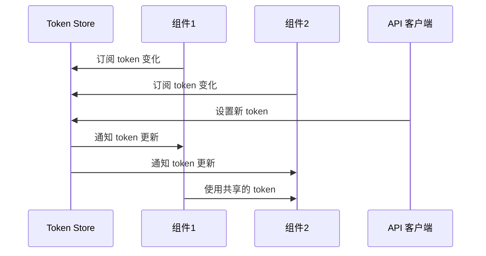

**图表来源**
- [useAdmin.ts (React):16-33](file://frontends/react-ts/src/hooks/useAdmin.ts#L16-L33)

#### 状态同步策略

React 实现的关键创新在于使用模块级变量存储 token 状态，并通过 `useSyncExternalStore` 实现：

1. **模块级状态**: 使用 `let token` 存储全局 token 状态
2. **订阅机制**: 通过 `subscribeToken` 函数管理组件订阅
3. **快照读取**: `getTokenSnapshot` 提供稳定的快照读取
4. **状态更新**: `setToken` 函数更新状态并通知所有订阅者

**章节来源**
- [useAdmin.ts (React):11-33](file://frontends/react-ts/src/hooks/useAdmin.ts#L11-L33)

### Angular 实现分析

#### 信号系统集成

Angular 版本使用了现代的信号系统 (`signal` 和 `computed`)：

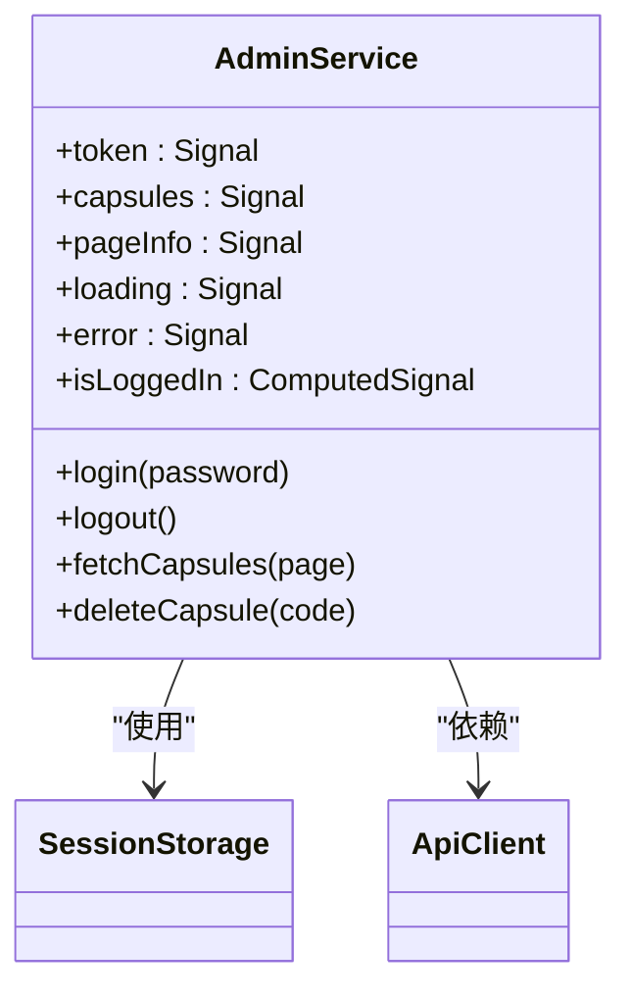

**图表来源**
- [admin.service.ts (Angular):8-83](file://frontends/angular-ts/src/app/services/admin.service.ts#L8-L83)

#### 依赖注入架构

Angular 实现充分利用了框架的依赖注入特性：

1. **根级提供**: `providedIn: 'root'` 确保服务在整个应用中可用
2. **信号状态**: 使用 `signal` 替代传统响应式数据
3. **计算属性**: `computed` 自动追踪依赖变化
4. **类型安全**: 完整的 TypeScript 类型定义

**章节来源**
- [admin.service.ts (Angular):7-25](file://frontends/angular-ts/src/app/services/admin.service.ts#L7-L25)

### API 层交互模式

#### 统一请求封装

所有框架的 API 客户端都实现了统一的请求封装：

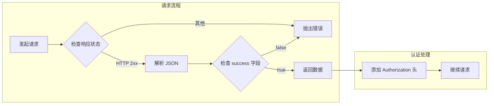

**图表来源**
- [index.ts (API 客户端 - Vue):19-37](file://frontends/vue3-ts/src/api/index.ts#L19-L37)
- [index.ts (API 客户端 - React):14-31](file://frontends/react-ts/src/api/index.ts#L14-L31)
- [index.ts (API 客户端 - Angular):10-27](file://frontends/angular-ts/src/app/api/index.ts#L10-L27)

#### 认证令牌处理

API 客户端对认证令牌的处理遵循标准的 Bearer Token 模式：

| 方法 | URL | 认证方式 | 功能描述 |
|------|-----|----------|----------|
| adminLogin | `/api/v1/admin/login` | 无 | 管理员登录获取 token |
| getAdminCapsules | `/api/v1/admin/capsules` | Bearer Token | 分页获取胶囊列表 |
| deleteAdminCapsule | `/api/v1/admin/capsules/{code}` | Bearer Token | 删除指定胶囊 |

**章节来源**
- [index.ts (API 客户端 - Vue):74-111](file://frontends/vue3-ts/src/api/index.ts#L74-L111)
- [index.ts (API 客户端 - React):59-85](file://frontends/react-ts/src/api/index.ts#L59-L85)
- [index.ts (API 客户端 - Angular):43-67](file://frontends/angular-ts/src/app/api/index.ts#L43-L67)

## 依赖关系分析

### 组件耦合度分析

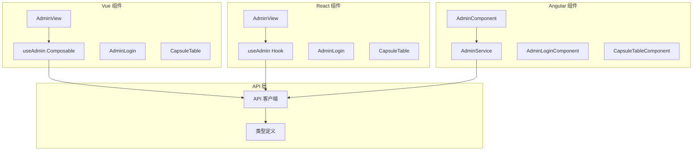

**图表来源**
- [useAdmin.ts (Vue)](file://frontends/vue3-ts/src/composables/useAdmin.ts#L8)
- [useAdmin.ts (React)](file://frontends/react-ts/src/hooks/useAdmin.ts#L9)
- [admin.service.ts (Angular)](file://frontends/angular-ts/src/app/services/admin.service.ts#L3)

### 数据模型关系

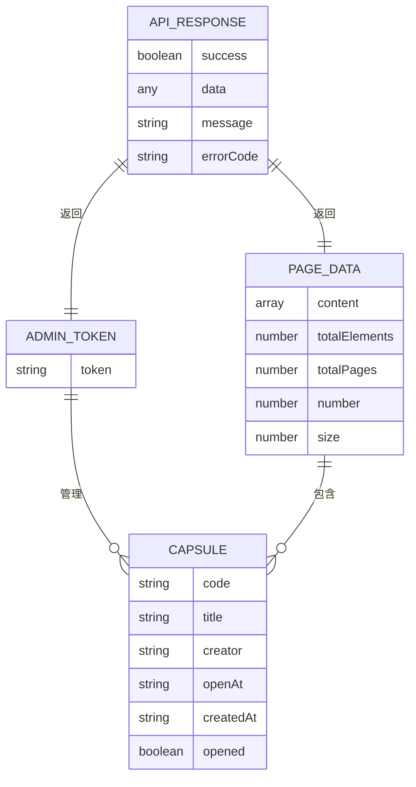

**图表来源**
- [index.ts (类型定义):10-80](file://frontends/vue3-ts/src/types/index.ts#L10-L80)

**章节来源**
- [index.ts (类型定义):35-80](file://frontends/vue3-ts/src/types/index.ts#L35-L80)

## 性能考虑

### 状态更新优化

1. **批量状态更新**: 在 Vue 实现中，使用 `ref` 的批量更新特性减少不必要的重新渲染
2. **记忆化函数**: React 实现使用 `useCallback` 避免函数重新创建
3. **信号系统**: Angular 实现利用信号的细粒度更新机制

### 缓存策略

1. **本地缓存**: 所有实现都使用 `sessionStorage` 进行本地持久化
2. **状态复用**: 在组件卸载后重新挂载时自动恢复状态
3. **防抖处理**: 在高频操作中合理使用防抖机制

### 网络请求优化

1. **并发控制**: 避免同时发起多个相同的 API 请求
2. **错误重试**: 对临时性错误实现智能重试机制
3. **请求取消**: 支持取消正在进行的网络请求

## 故障排除指南

### 常见问题诊断

#### 登录失败问题

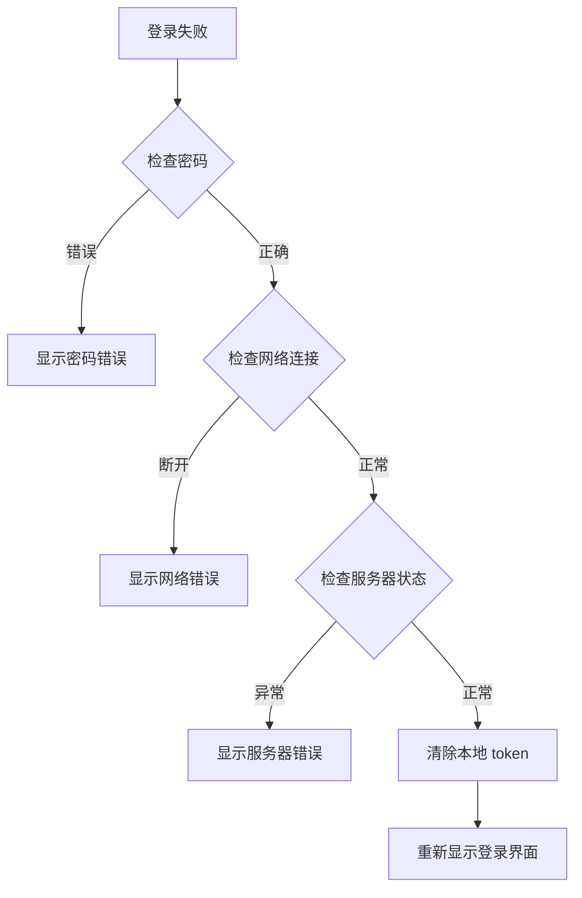

#### 认证过期处理

当检测到认证错误时，系统会自动执行以下流程：

1. **自动登出**: 清除本地存储的 token
2. **状态重置**: 重置所有管理员相关状态
3. **用户提示**: 显示认证过期的友好提示
4. **界面切换**: 自动跳转到登录界面

**章节来源**
- [useAdmin.ts (Vue):88-92](file://frontends/vue3-ts/src/composables/useAdmin.ts#L88-L92)
- [useAdmin.ts (React):84-87](file://frontends/react-ts/src/hooks/useAdmin.ts#L84-L87)

### 调试技巧

1. **浏览器开发者工具**: 检查 `sessionStorage` 中的 token 状态
2. **网络面板**: 监控 API 请求和响应
3. **控制台日志**: 查看详细的错误信息
4. **状态检查**: 验证响应式状态的正确性

## 结论

useAdmin 组合式函数是一个设计精良的状态管理解决方案，它在三个主流前端框架中提供了统一的管理员功能体验。该实现的主要优势包括：

### 技术优势

1. **跨框架一致性**: 三个框架的实现保持了相同的功能和 API 设计
2. **响应式状态管理**: 充分利用各框架的响应式特性提供流畅的用户体验
3. **类型安全**: 完整的 TypeScript 类型定义确保开发时的安全性
4. **错误处理**: 健壮的错误处理机制提升系统的稳定性

### 最佳实践

1. **状态持久化**: 使用 `sessionStorage` 实现会话级别的状态保持
2. **认证令牌管理**: 采用标准的 Bearer Token 模式处理认证
3. **异步处理**: 正确处理异步操作的状态管理和错误处理
4. **用户体验**: 提供清晰的加载状态和错误反馈

### 扩展建议

1. **权限细化**: 可以扩展更细粒度的权限控制机制
2. **缓存策略**: 实现更智能的数据缓存和同步机制
3. **监控集成**: 添加性能监控和错误追踪功能
4. **国际化支持**: 扩展多语言错误消息和用户界面

该组合式函数为管理员功能的开发提供了坚实的基础，开发者可以在此基础上快速构建完整的管理界面应用。