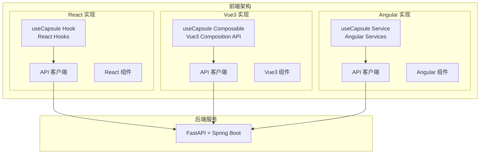
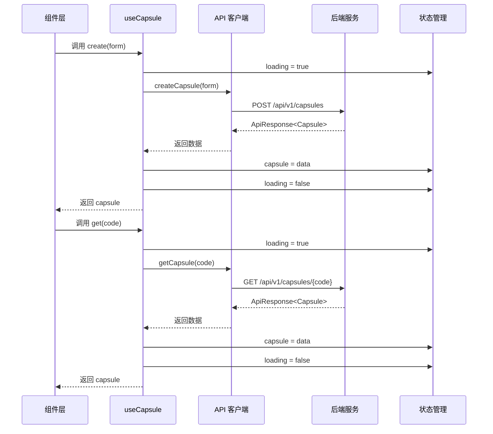
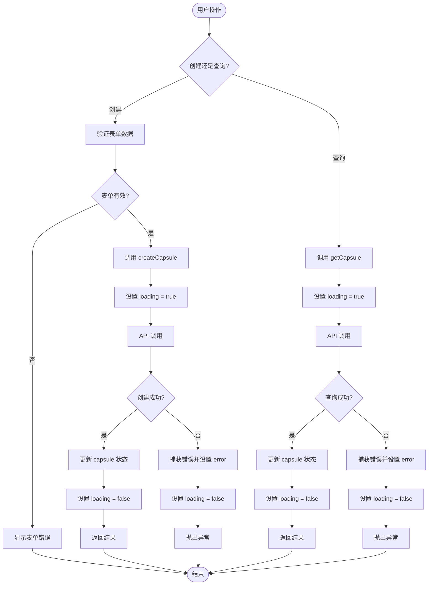
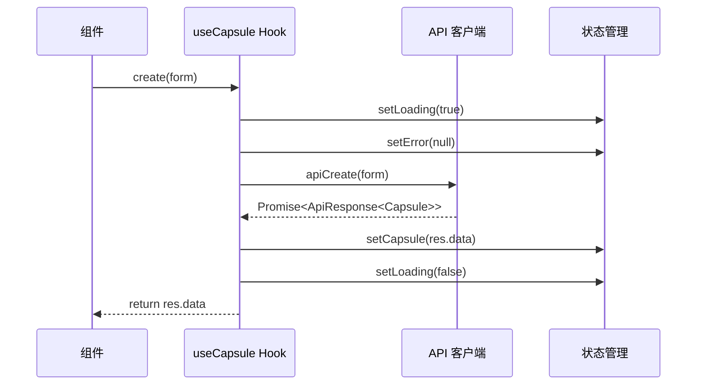
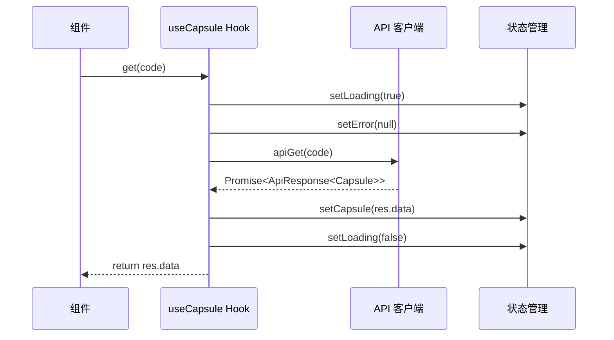
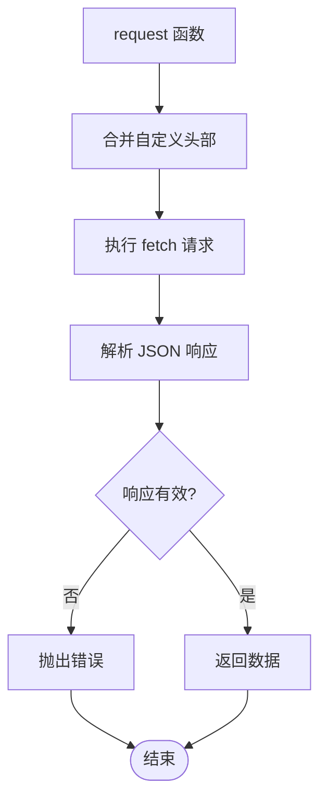
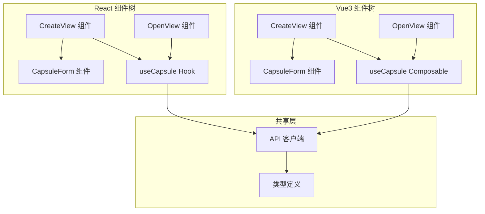

# useCapsule 组合式函数

<cite>
**本文档引用的文件**
- [useCapsule.ts（React）](file://frontends/react-ts/src/hooks/useCapsule.ts)
- [useCapsule.ts（Vue3）](file://frontends/vue3-ts/src/composables/useCapsule.ts)
- [API 客户端（React）](file://frontends/react-ts/src/api/index.ts)
- [API 客户端（Vue3）](file://frontends/vue3-ts/src/api/index.ts)
- [类型定义](file://frontends/react-ts/src/types/index.ts)
- [创建视图（Vue3）](file://frontends/vue3-ts/src/views/CreateView.vue)
- [开启视图（Vue3）](file://frontends/vue3-ts/src/views/OpenView.vue)
- [创建表单（React）](file://frontends/react-ts/src/components/CapsuleForm.tsx)
- [创建表单（Vue3）](file://frontends/vue3-ts/src/components/CapsuleForm.vue)
</cite>

## 目录
1. [简介](#简介)
2. [项目结构](#项目结构)
3. [核心组件](#核心组件)
4. [架构概览](#架构概览)
5. [详细组件分析](#详细组件分析)
6. [依赖关系分析](#依赖关系分析)
7. [性能考虑](#性能考虑)
8. [故障排除指南](#故障排除指南)
9. [结论](#结论)

## 简介

useCapsule 是一个跨前端框架的组合式函数，封装了时间胶囊应用的核心业务逻辑。它提供了两个主要功能：

- **创建胶囊（create 方法）**：处理时间胶囊的创建流程，包括表单验证、API 调用和状态管理
- **查询胶囊（get 方法）**：处理时间胶囊的查询和展示逻辑

该函数采用响应式状态管理模式，支持 React 和 Vue3 两种前端框架，确保开发者能够以一致的方式处理异步操作和错误处理。

## 项目结构

时间胶囊应用采用多框架架构，包含 React、Vue3 和 Angular 三个前端实现。每个框架都有独立的组合式函数实现：



**图表来源**
- [useCapsule.ts（React）:1-48](file://frontends/react-ts/src/hooks/useCapsule.ts#L1-L48)
- [useCapsule.ts（Vue3）:1-65](file://frontends/vue3-ts/src/composables/useCapsule.ts#L1-L65)

**章节来源**
- [useCapsule.ts（React）:1-48](file://frontends/react-ts/src/hooks/useCapsule.ts#L1-L48)
- [useCapsule.ts（Vue3）:1-65](file://frontends/vue3-ts/src/composables/useCapsule.ts#L1-L65)

## 核心组件

### 响应式状态管理

useCapsule 函数维护三类核心状态：

| 状态属性 | 类型 | 默认值 | 描述 |
|---------|------|--------|------|
| capsule | Capsule \| null | null | 当前激活的时间胶囊数据，包含 code、title、content 等字段 |
| loading | boolean | false | 异步操作进行中的加载状态指示器 |
| error | string \| null | null | 最近一次操作产生的错误信息 |

### API 调用封装

函数内部封装了两个核心 API 调用：

- **createCapsule(form)**：POST /api/v1/capsules - 创建新的时间胶囊
- **getCapsule(code)**：GET /api/v1/capsules/{code} - 根据胶囊码查询胶囊详情

**章节来源**
- [useCapsule.ts（React）:9-47](file://frontends/react-ts/src/hooks/useCapsule.ts#L9-L47)
- [useCapsule.ts（Vue3）:10-64](file://frontends/vue3-ts/src/composables/useCapsule.ts#L10-L64)

## 架构概览

### 系统架构图



**图表来源**
- [useCapsule.ts（React）:14-44](file://frontends/react-ts/src/hooks/useCapsule.ts#L14-L44)
- [useCapsule.ts（Vue3）:24-60](file://frontends/vue3-ts/src/composables/useCapsule.ts#L24-L60)

### 数据流图



**图表来源**
- [useCapsule.ts（React）:14-44](file://frontends/react-ts/src/hooks/useCapsule.ts#L14-L44)
- [useCapsule.ts（Vue3）:24-60](file://frontends/vue3-ts/src/composables/useCapsule.ts#L24-L60)

## 详细组件分析

### React 版本实现

#### 状态初始化

React 版本使用 `useState` Hook 来管理响应式状态：

```typescript
const [capsule, setCapsule] = useState<Capsule | null>(null)
const [loading, setLoading] = useState(false)
const [error, setError] = useState<string | null>(null)
```

#### 创建胶囊流程



**图表来源**
- [useCapsule.ts（React）:14-28](file://frontends/react-ts/src/hooks/useCapsule.ts#L14-L28)

#### 查询胶囊流程



**图表来源**
- [useCapsule.ts（React）:30-44](file://frontends/react-ts/src/hooks/useCapsule.ts#L30-L44)

### Vue3 版本实现

#### 状态初始化

Vue3 版本使用 `ref` 来创建响应式状态：

```typescript
const capsule = ref<Capsule | null>(null)
const loading = ref(false)
const error = ref<string | null>(null)
```

#### 创建胶囊方法

Vue3 版本提供了更详细的 JSDoc 注释和类型安全：

```typescript
/**
 * 创建时间胶囊
 * 调用 API 并更新响应式状态
 *
 * @param form 表单数据
 * @returns 创建成功的胶囊对象
 * @throws 创建失败时抛出异常
 */
async function create(form: CreateCapsuleForm) {
  // 实现逻辑...
}
```

**章节来源**
- [useCapsule.ts（React）:9-47](file://frontends/react-ts/src/hooks/useCapsule.ts#L9-L47)
- [useCapsule.ts（Vue3）:10-64](file://frontends/vue3-ts/src/composables/useCapsule.ts#L10-L64)

### API 客户端封装

#### 统一请求处理

API 客户端实现了统一的请求处理逻辑：



**图表来源**
- [API 客户端（React）:14-31](file://frontends/react-ts/src/api/index.ts#L14-L31)
- [API 客户端（Vue3）:19-37](file://frontends/vue3-ts/src/api/index.ts#L19-L37)

#### 错误处理机制

API 客户端实现了统一的错误处理：

- HTTP 状态码非 2xx 时抛出异常
- 业务逻辑失败（success = false）时抛出异常
- 支持自定义错误消息

**章节来源**
- [API 客户端（React）:14-31](file://frontends/react-ts/src/api/index.ts#L14-L31)
- [API 客户端（Vue3）:19-37](file://frontends/vue3-ts/src/api/index.ts#L19-L37)

## 依赖关系分析

### 组件依赖图



**图表来源**
- [CreateView.vue:36-69](file://frontends/vue3-ts/src/views/CreateView.vue#L36-L69)
- [OpenView.vue:23-45](file://frontends/vue3-ts/src/views/OpenView.vue#L23-L45)
- [CapsuleForm.tsx:1-130](file://frontends/react-ts/src/components/CapsuleForm.tsx#L1-L130)
- [CapsuleForm.vue:1-165](file://frontends/vue3-ts/src/components/CapsuleForm.vue#L1-L165)

### 状态管理对比

| 特性 | React 实现 | Vue3 实现 |
|------|------------|-----------|
| 状态类型 | useState | ref |
| 回调优化 | useCallback | 内置响应式 |
| 错误处理 | setError | error.value |
| 加载状态 | setLoading | loading.value |
| 数据状态 | setCapsule | capsule.value |

**章节来源**
- [useCapsule.ts（React）:9-47](file://frontends/react-ts/src/hooks/useCapsule.ts#L9-L47)
- [useCapsule.ts（Vue3）:10-64](file://frontends/vue3-ts/src/composables/useCapsule.ts#L10-L64)

## 性能考虑

### 异步操作优化

1. **防重复提交**：通过 loading 状态防止同一时间发起多个相同的 API 请求
2. **错误快速反馈**：错误状态立即更新，提供即时用户体验
3. **状态清理**：finally 块确保 loading 状态总是被正确重置

### 内存管理

- 使用 `useCallback` 优化 React 组件的重新渲染
- Vue3 的 ref 自动处理响应式更新
- 及时清理错误状态，避免内存泄漏

## 故障排除指南

### 常见问题及解决方案

#### 1. API 请求失败

**症状**：error 状态显示错误信息，但界面没有更新

**解决方案**：
- 检查 API 客户端的错误处理逻辑
- 确认网络连接和后端服务状态
- 验证请求参数格式

#### 2. 加载状态不更新

**症状**：按钮一直处于禁用状态

**解决方案**：
- 确认 finally 块是否被执行
- 检查异步操作是否正确处理异常
- 验证状态更新逻辑

#### 3. 数据不显示

**症状**：查询成功但 capsule 状态为空

**解决方案**：
- 检查 API 响应格式
- 验证类型定义是否匹配
- 确认状态更新逻辑

**章节来源**
- [useCapsule.ts（React）:14-44](file://frontends/react-ts/src/hooks/useCapsule.ts#L14-L44)
- [useCapsule.ts（Vue3）:24-60](file://frontends/vue3-ts/src/composables/useCapsule.ts#L24-L60)

## 结论

useCapsule 组合式函数成功地将时间胶囊的核心业务逻辑抽象化，提供了：

1. **一致的 API 设计**：无论在 React 还是 Vue3 中使用，接口完全相同
2. **完善的错误处理**：统一的错误捕获和状态管理机制
3. **响应式状态管理**：自动化的状态更新和组件重新渲染
4. **清晰的异步流程**：明确的加载状态管理和 finally 块使用

该实现为开发者提供了一个可复用、可测试、可维护的状态管理解决方案，适用于各种时间胶囊应用场景。通过标准化的 API 调用和错误处理，大大简化了前端开发工作，提高了代码质量。