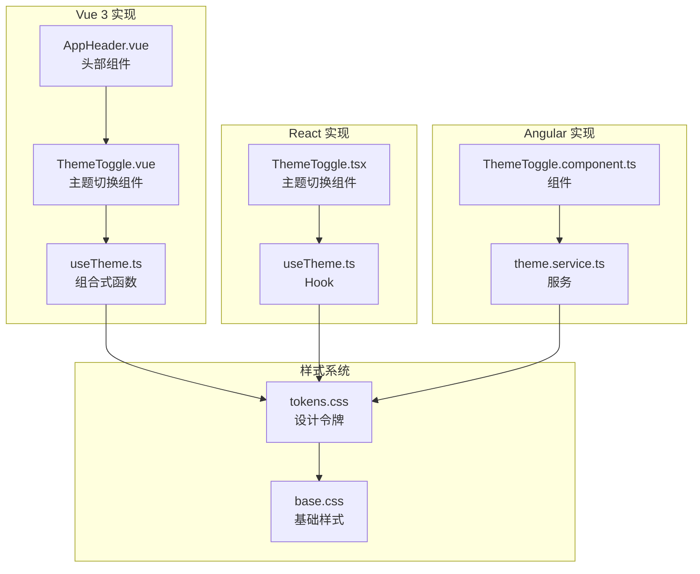
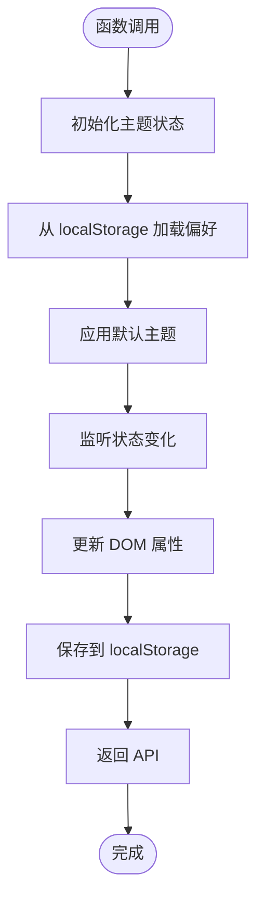
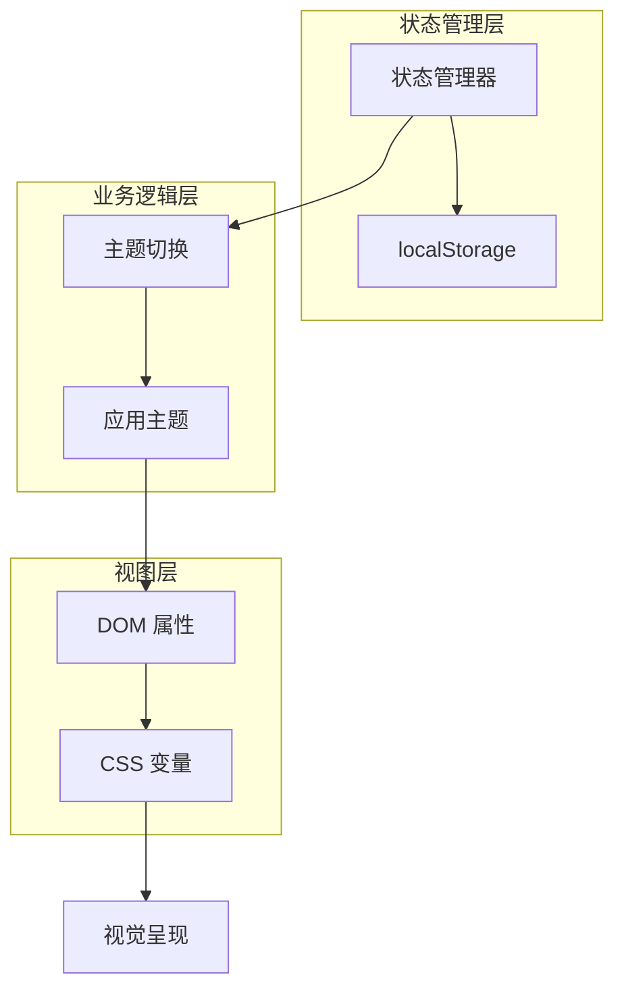
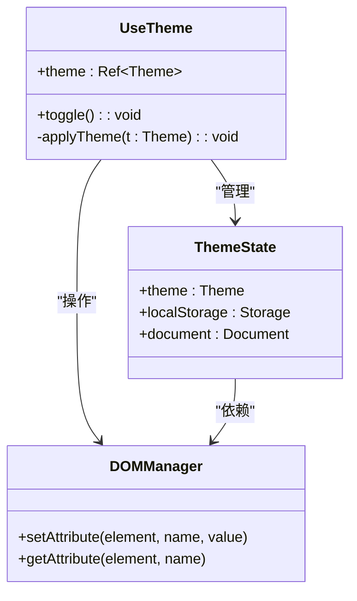
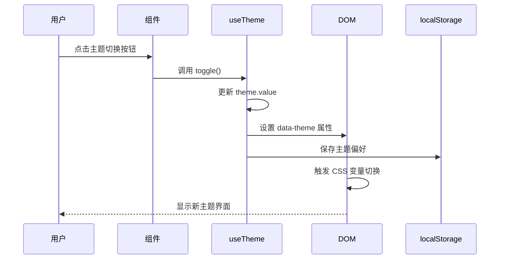
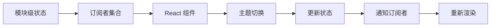
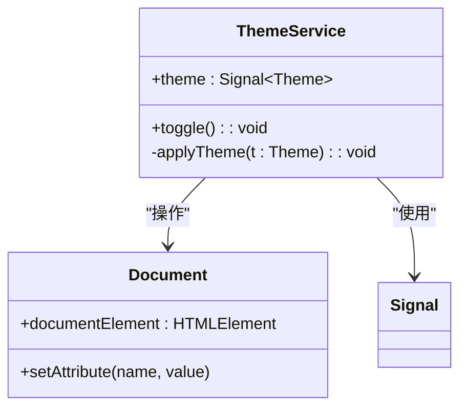
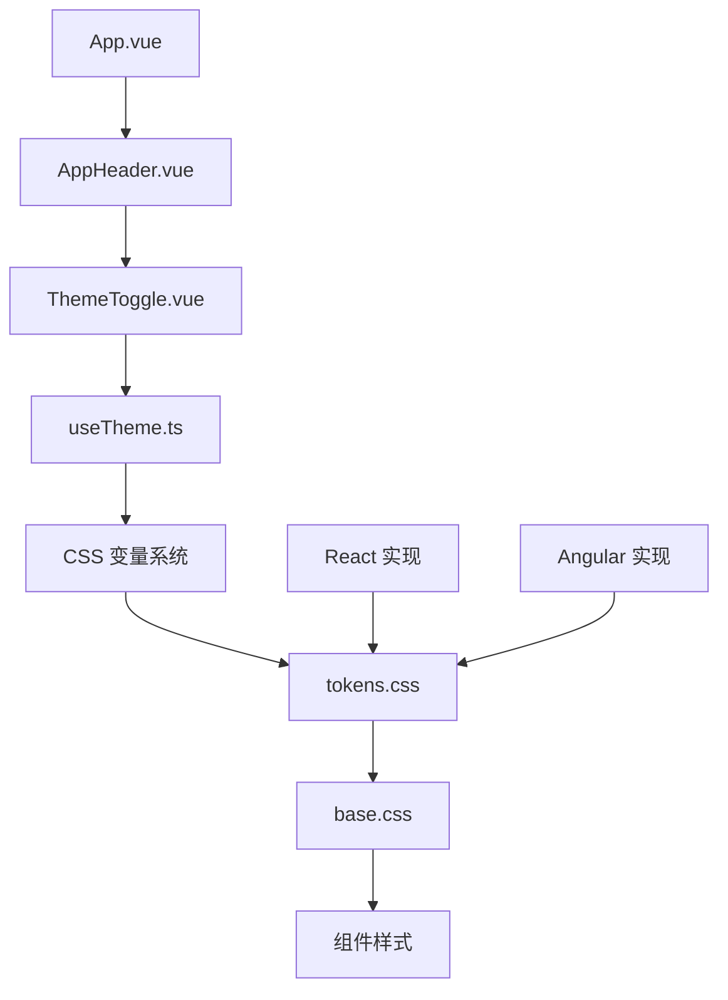
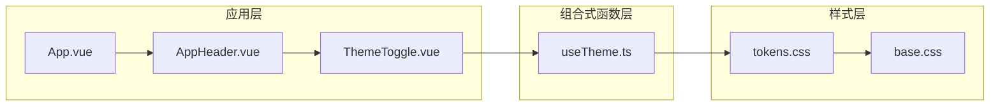

# useTheme 组合式函数

<cite>
**本文档引用的文件**
- [useTheme.ts](file://frontends/vue3-ts/src/composables/useTheme.ts)
- [tokens.css](file://spec/styles/tokens.css)
- [ThemeToggle.vue](file://frontends/vue3-ts/src/components/ThemeToggle.vue)
- [AppHeader.vue](file://frontends/vue3-ts/src/components/AppHeader.vue)
- [App.vue](file://frontends/vue3-ts/src/App.vue)
- [useTheme.test.ts](file://frontends/vue3-ts/src/__tests__/composables/useTheme.test.ts)
- [useTheme.ts (React)](file://frontends/react-ts/src/hooks/useTheme.ts)
- [ThemeToggle.tsx](file://frontends/react-ts/src/components/ThemeToggle.tsx)
- [theme.service.ts (Angular)](file://frontends/angular-ts/src/app/services/theme.service.ts)
- [ThemeToggle.component.ts (Angular)](file://frontends/angular-ts/src/app/components/theme-toggle/theme-toggle.component.ts)
- [ThemeToggle.html (Angular)](file://frontends/angular-ts/src/app/components/theme-toggle/theme-toggle.component.html)
- [base.css](file://spec/styles/base.css)
- [CapsuleCard.vue](file://frontends/vue3-ts/src/components/CapsuleCard.vue)
</cite>

## 目录
1. [简介](#简介)
2. [项目结构](#项目结构)
3. [核心组件](#核心组件)
4. [架构概览](#架构概览)
5. [详细组件分析](#详细组件分析)
6. [依赖关系分析](#依赖关系分析)
7. [性能考虑](#性能考虑)
8. [故障排除指南](#故障排除指南)
9. [结论](#结论)

## 简介

useTheme 是一个跨框架的主题管理系统，负责封装主题状态管理和切换逻辑。该系统支持明暗主题切换、主题偏好持久化、CSS 变量动态更新，并提供了完整的测试覆盖。

该组合式函数采用响应式设计模式，通过 Vue 3 的 ref 和 watchEffect 实现状态管理，同时兼容 React 和 Angular 生态系统。系统的核心机制是通过在 HTML 元素上设置 `data-theme` 属性来触发动画 CSS 变量切换。

## 项目结构

前端项目采用多框架架构，包含 Vue 3、React 和 Angular 三个主要实现：



**图表来源**
- [useTheme.ts:1-57](file://frontends/vue3-ts/src/composables/useTheme.ts#L1-L57)
- [tokens.css:1-104](file://spec/styles/tokens.css#L1-L104)
- [ThemeToggle.vue:1-34](file://frontends/vue3-ts/src/components/ThemeToggle.vue#L1-L34)

**章节来源**
- [useTheme.ts:1-57](file://frontends/vue3-ts/src/composables/useTheme.ts#L1-L57)
- [tokens.css:1-104](file://spec/styles/tokens.css#L1-L104)

## 核心组件

### useTheme 组合式函数

useTheme 函数是整个主题系统的核心，提供了简洁的 API 来管理主题状态：



**图表来源**
- [useTheme.ts:13-38](file://frontends/vue3-ts/src/composables/useTheme.ts#L13-L38)

### 主题状态管理

系统采用响应式状态管理，核心特性包括：

- **状态类型**: `Theme` 类型定义为 `'light' | 'dark'`
- **初始值**: 从 localStorage 读取，无则默认 'light'
- **持久化**: 自动保存到 localStorage
- **响应式更新**: 通过 watchEffect 监听状态变化

**章节来源**
- [useTheme.ts:7-13](file://frontends/vue3-ts/src/composables/useTheme.ts#L7-L13)
- [useTheme.ts:34-38](file://frontends/vue3-ts/src/composables/useTheme.ts#L34-L38)

## 架构概览

主题系统采用分层架构设计，确保了良好的可维护性和扩展性：



**图表来源**
- [useTheme.ts:20-23](file://frontends/vue3-ts/src/composables/useTheme.ts#L20-L23)
- [tokens.css:82-103](file://spec/styles/tokens.css#L82-L103)

### CSS 变量系统

系统使用 CSS 自定义属性实现主题切换，核心机制如下：

- **根变量**: 定义在 `:root` 中的基础设计令牌
- **主题覆盖**: 在 `[data-theme="dark"]` 中重定义变量值
- **动态切换**: 通过修改 `data-theme` 属性触发动画效果

**章节来源**
- [tokens.css:2-80](file://spec/styles/tokens.css#L2-L80)
- [tokens.css:82-103](file://spec/styles/tokens.css#L82-L103)

## 详细组件分析

### Vue 3 实现分析

#### 组合式函数实现



**图表来源**
- [useTheme.ts:5-56](file://frontends/vue3-ts/src/composables/useTheme.ts#L5-L56)

#### 主题切换流程



**图表来源**
- [ThemeToggle.vue:1-34](file://frontends/vue3-ts/src/components/ThemeToggle.vue#L1-L34)
- [useTheme.ts:46-56](file://frontends/vue3-ts/src/composables/useTheme.ts#L46-L56)

**章节来源**
- [useTheme.ts:1-57](file://frontends/vue3-ts/src/composables/useTheme.ts#L1-L57)
- [ThemeToggle.vue:1-34](file://frontends/vue3-ts/src/components/ThemeToggle.vue#L1-L34)

### React 实现分析

React 版本采用 `useSyncExternalStore` 实现跨组件共享状态：



**图表来源**
- [useTheme.ts (React):10-47](file://frontends/react-ts/src/hooks/useTheme.ts#L10-L47)

**章节来源**
- [useTheme.ts (React):1-48](file://frontends/react-ts/src/hooks/useTheme.ts#L1-L48)
- [ThemeToggle.tsx:1-17](file://frontends/react-ts/src/components/ThemeToggle.tsx#L1-L17)

### Angular 实现分析

Angular 版本使用信号（signal）和 effect 实现响应式主题管理：



**图表来源**
- [theme.service.ts (Angular):1-27](file://frontends/angular-ts/src/app/services/theme.service.ts#L1-L27)

**章节来源**
- [theme.service.ts (Angular):1-27](file://frontends/angular-ts/src/app/services/theme.service.ts#L1-L27)
- [ThemeToggle.component.ts (Angular):1-14](file://frontends/angular-ts/src/app/components/theme-toggle/theme-toggle.component.ts#L1-L14)

## 依赖关系分析

### 核心依赖链



**图表来源**
- [useTheme.ts:1-57](file://frontends/vue3-ts/src/composables/useTheme.ts#L1-L57)
- [tokens.css:1-104](file://spec/styles/tokens.css#L1-L104)
- [ThemeToggle.vue:1-34](file://frontends/vue3-ts/src/components/ThemeToggle.vue#L1-L34)

### 组件依赖关系



**图表来源**
- [App.vue:1-19](file://frontends/vue3-ts/src/App.vue#L1-L19)
- [AppHeader.vue:1-75](file://frontends/vue3-ts/src/components/AppHeader.vue#L1-L75)
- [ThemeToggle.vue:1-34](file://frontends/vue3-ts/src/components/ThemeToggle.vue#L1-L34)

**章节来源**
- [App.vue:1-19](file://frontends/vue3-ts/src/App.vue#L1-L19)
- [AppHeader.vue:1-75](file://frontends/vue3-ts/src/components/AppHeader.vue#L1-L75)

## 性能考虑

### 响应式更新优化

系统采用了多种性能优化策略：

1. **惰性初始化**: 仅在浏览器环境中执行 DOM 操作
2. **最小化重渲染**: 通过 watchEffect 避免不必要的组件重渲染
3. **本地存储缓存**: 减少重复的 DOM 查询操作
4. **CSS 变量切换**: 使用硬件加速的 CSS 属性动画

### 内存管理

- **垃圾回收友好**: 使用基本数据类型而非复杂对象
- **事件监听器清理**: 在组件卸载时自动清理监听器
- **模块级状态**: 避免全局变量污染

### 用户体验优化

- **即时反馈**: 主题切换几乎无延迟
- **平滑过渡**: CSS 过渡动画提供流畅的视觉体验
- **无障碍支持**: 通过 `title` 属性提供屏幕阅读器支持

## 故障排除指南

### 常见问题及解决方案

#### 主题偏好未保存

**症状**: 刷新页面后主题恢复默认值

**原因**: localStorage 不可用或被禁用

**解决方案**:
```typescript
// 检查 localStorage 可用性
if (typeof localStorage === 'undefined') {
  console.warn('localStorage 不可用，主题偏好无法持久化');
}
```

#### SSR 环境问题

**症状**: 服务器端渲染时出现 undefined 错误

**原因**: document 对象在服务器端不存在

**解决方案**:
```typescript
// 仅在客户端环境执行
if (typeof document !== 'undefined') {
  // DOM 操作代码
}
```

#### CSS 变量未生效

**症状**: 主题切换但样式未改变

**原因**: CSS 选择器优先级问题或样式加载顺序

**解决方案**:
```css
/* 确保主题选择器具有足够高的优先级 */
[data-theme="dark"] .component {
  /* 样式规则 */
}
```

**章节来源**
- [useTheme.ts:25-28](file://frontends/vue3-ts/src/composables/useTheme.ts#L25-L28)
- [useTheme.test.ts:1-23](file://frontends/vue3-ts/src/__tests__/composables/useTheme.test.ts#L1-L23)

## 结论

useTheme 组合式函数是一个设计精良的主题管理系统，具有以下优势：

1. **跨框架兼容**: 提供 Vue 3、React、Angular 三种实现
2. **响应式设计**: 采用现代前端框架的最佳实践
3. **性能优化**: 通过 CSS 变量和硬件加速实现高效切换
4. **可扩展性**: 支持自定义主题和扩展开发
5. **完整测试**: 提供全面的单元测试覆盖

该系统为开发者提供了一个开箱即用的主题管理解决方案，同时保持了足够的灵活性以适应不同的项目需求。通过合理的架构设计和性能优化，确保了良好的用户体验和开发体验。