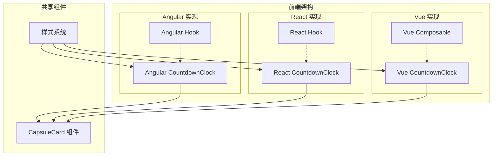
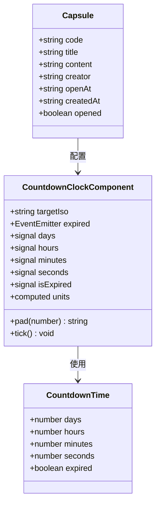
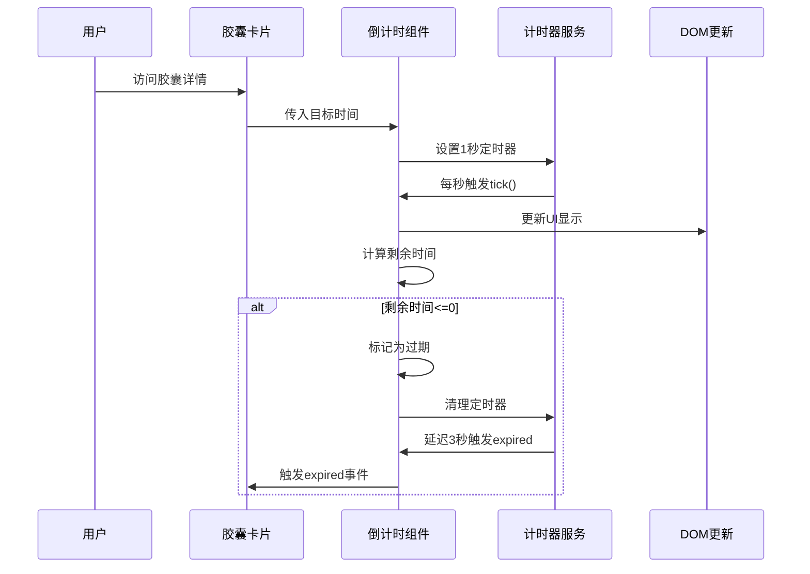
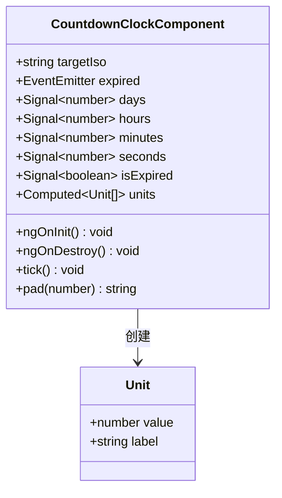
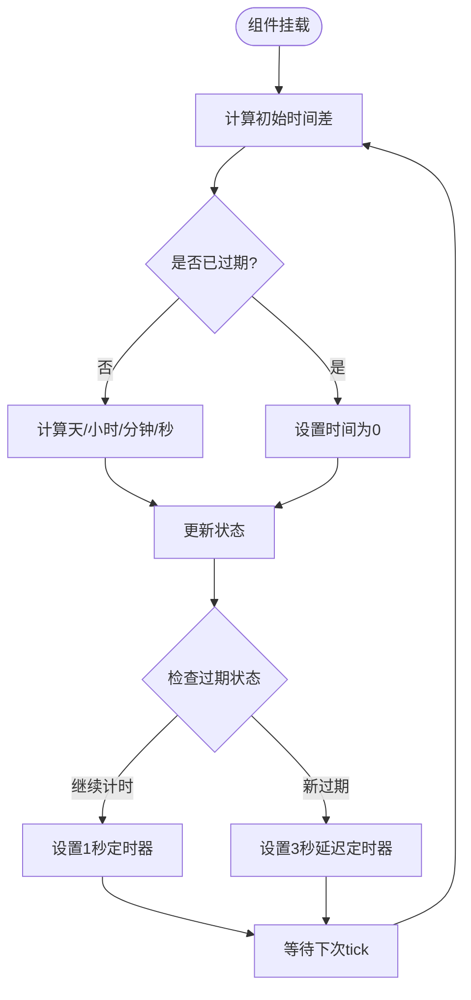
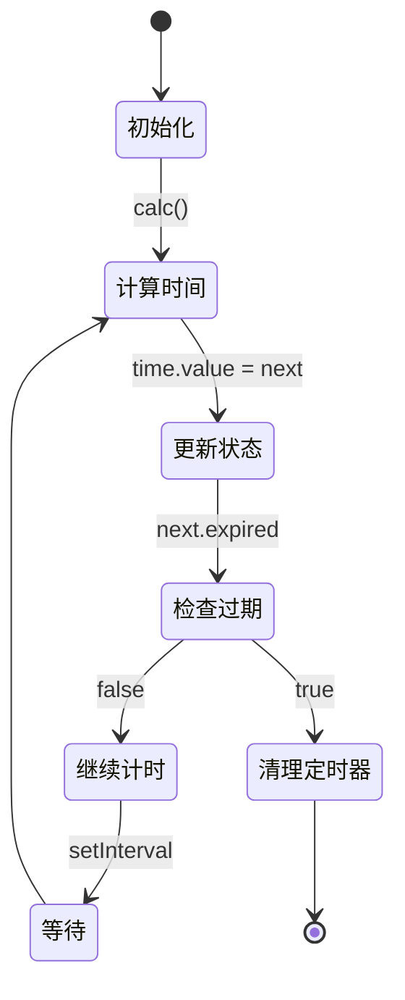
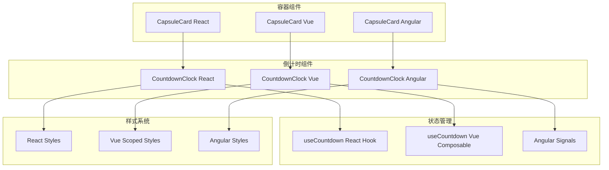
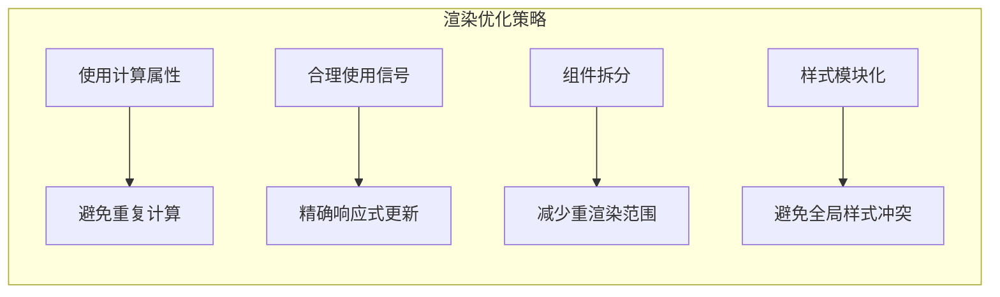

# CountdownClock 倒计时组件

<cite>
**本文档引用的文件**
- [countdown-clock.component.ts](file://frontends/angular-ts/src/app/components/countdown-clock/countdown-clock.component.ts)
- [countdown-clock.component.html](file://frontends/angular-ts/src/app/components/countdown-clock/countdown-clock.component.html)
- [countdown-clock.component.css](file://frontends/angular-ts/src/app/components/countdown-clock/countdown-clock.component.css)
- [CountdownClock.tsx](file://frontends/react-ts/src/components/CountdownClock.tsx)
- [CountdownClock.module.css](file://frontends/react-ts/src/components/CountdownClock.module.css)
- [CountdownClock.vue](file://frontends/vue3-ts/src/components/CountdownClock.vue)
- [useCountdown.ts (React)](file://frontends/react-ts/src/hooks/useCountdown.ts)
- [useCountdown.ts (Vue)](file://frontends/vue3-ts/src/composables/useCountdown.ts)
- [CapsuleCard.tsx](file://frontends/react-ts/src/components/CapsuleCard.tsx)
- [CapsuleCard.vue](file://frontends/vue3-ts/src/components/CapsuleCard.vue)
- [CapsuleCardComponent.ts](file://frontends/angular-ts/src/app/components/capsule-card/capsule-card.component.ts)
- [CapsuleCardComponent.html](file://frontends/angular-ts/src/app/components/capsule-card/capsule-card.component.html)
- [index.ts](file://frontends/angular-ts/src/app/types/index.ts)
</cite>

## 目录
1. [简介](#简介)
2. [项目结构](#项目结构)
3. [核心组件](#核心组件)
4. [架构概览](#架构概览)
5. [详细组件分析](#详细组件分析)
6. [依赖关系分析](#依赖关系分析)
7. [性能考虑](#性能考虑)
8. [故障排除指南](#故障排除指南)
9. [结论](#结论)

## 简介

CountdownClock 是 HelloTime 项目中的一个核心 UI 组件，用于显示时间胶囊的倒计时功能。该组件提供了跨平台的实现（Angular、React、Vue），为用户展示距离时间胶囊开启剩余的时间。

该组件的主要功能包括：
- 显示天、小时、分钟、秒的倒计时
- 在倒计时结束时提供视觉反馈
- 支持响应式设计，适配不同屏幕尺寸
- 提供统一的 API 接口，便于在不同框架中使用

## 项目结构

HelloTime 项目采用多框架架构，CountdownClock 组件在三个主要前端框架中都有实现：

**图表来源**
- [countdown-clock.component.ts:1-67](file://frontends/angular-ts/src/app/components/countdown-clock/countdown-clock.component.ts#L1-L67)
- [CountdownClock.tsx:1-58](file://frontends/react-ts/src/components/CountdownClock.tsx#L1-L58)
- [CountdownClock.vue:1-167](file://frontends/vue3-ts/src/components/CountdownClock.vue#L1-L167)

**章节来源**
- [countdown-clock.component.ts:1-67](file://frontends/angular-ts/src/app/components/countdown-clock/countdown-clock.component.ts#L1-L67)
- [CountdownClock.tsx:1-58](file://frontends/react-ts/src/components/CountdownClock.tsx#L1-L58)
- [CountdownClock.vue:1-167](file://frontends/vue3-ts/src/components/CountdownClock.vue#L1-L167)

## 核心组件

### 组件接口定义

所有框架中的 CountdownClock 组件都遵循统一的接口规范：

| 属性 | 类型 | 必需 | 描述 |
|------|------|------|------|
| targetIso | string | 是 | ISO 8601 格式的目标时间字符串 |
| onExpired | Function | 否 | 倒计时结束时的回调函数 |

| 事件 | 参数 | 描述 |
|------|------|------|
| expired | 无 | 倒计时结束触发的事件 |

### 数据模型

**图表来源**
- [useCountdown.ts (React):3-9](file://frontends/react-ts/src/hooks/useCountdown.ts#L3-L9)
- [useCountdown.ts (Vue):3-9](file://frontends/vue3-ts/src/composables/useCountdown.ts#L3-L9)
- [countdown-clock.component.ts:14-32](file://frontends/angular-ts/src/app/components/countdown-clock/countdown-clock.component.ts#L14-L32)

**章节来源**
- [useCountdown.ts (React):3-9](file://frontends/react-ts/src/hooks/useCountdown.ts#L3-L9)
- [useCountdown.ts (Vue):3-9](file://frontends/vue3-ts/src/composables/useCountdown.ts#L3-L9)
- [index.ts:6-14](file://frontends/angular-ts/src/app/types/index.ts#L6-L14)

## 架构概览

CountdownClock 组件在整个应用架构中扮演着重要的角色，作为时间胶囊功能的核心展示组件：

**图表来源**
- [countdown-clock.component.ts:34-61](file://frontends/angular-ts/src/app/components/countdown-clock/countdown-clock.component.ts#L34-L61)
- [CountdownClock.tsx:14-21](file://frontends/react-ts/src/components/CountdownClock.tsx#L14-L21)
- [CountdownClock.vue:33-41](file://frontends/vue3-ts/src/components/CountdownClock.vue#L33-L41)

## 详细组件分析

### Angular 实现

Angular 版本的 CountdownClock 组件采用了现代的 Angular 架构模式：

#### 组件架构

**图表来源**
- [countdown-clock.component.ts:14-32](file://frontends/angular-ts/src/app/components/countdown-clock/countdown-clock.component.ts#L14-L32)

#### 核心功能实现

1. **信号系统集成**: 使用 Angular Signals 进行响应式状态管理
2. **计算属性优化**: 通过 `computed` 函数避免不必要的重渲染
3. **生命周期管理**: 正确清理定时器，防止内存泄漏

**章节来源**
- [countdown-clock.component.ts:1-67](file://frontends/angular-ts/src/app/components/countdown-clock/countdown-clock.component.ts#L1-L67)
- [countdown-clock.component.html:1-24](file://frontends/angular-ts/src/app/components/countdown-clock/countdown-clock.component.html#L1-L24)
- [countdown-clock.component.css:1-111](file://frontends/angular-ts/src/app/components/countdown-clock/countdown-clock.component.css#L1-L111)

### React 实现

React 版本的 CountdownClock 组件利用了自定义 Hook 的设计理念：

#### Hook 设计模式

**图表来源**
- [useCountdown.ts (React):11-37](file://frontends/react-ts/src/hooks/useCountdown.ts#L11-L37)

#### 组件实现特点

1. **Hook 抽象**: 将倒计时逻辑封装在自定义 Hook 中
2. **副作用管理**: 使用 `useEffect` 正确处理定时器的创建和清理
3. **事件延迟**: 通过 `setTimeout` 实现过期事件的延迟触发

**章节来源**
- [CountdownClock.tsx:1-58](file://frontends/react-ts/src/components/CountdownClock.tsx#L1-L58)
- [CountdownClock.module.css:1-118](file://frontends/react-ts/src/components/CountdownClock.module.css#L1-L118)
- [useCountdown.ts (React):1-41](file://frontends/react-ts/src/hooks/useCountdown.ts#L1-L41)

### Vue 实现

Vue 版本的 CountdownClock 组件采用了 Composition API 的现代化开发模式：

#### Composable 设计

**图表来源**
- [useCountdown.ts (Vue):27-35](file://frontends/vue3-ts/src/composables/useCountdown.ts#L27-L35)

#### 组合式 API 优势

1. **逻辑复用**: 通过 composable 实现跨组件的状态逻辑复用
2. **响应式系统**: 利用 Vue 的响应式系统自动追踪依赖
3. **生命周期集成**: 与 `onUnmounted` 钩子完美集成

**章节来源**
- [CountdownClock.vue:1-167](file://frontends/vue3-ts/src/components/CountdownClock.vue#L1-L167)
- [useCountdown.ts (Vue):1-39](file://frontends/vue3-ts/src/composables/useCountdown.ts#L1-L39)

## 依赖关系分析

### 组件间依赖关系

**图表来源**
- [CapsuleCard.tsx:1-54](file://frontends/react-ts/src/components/CapsuleCard.tsx#L1-L54)
- [CapsuleCard.vue:1-89](file://frontends/vue3-ts/src/components/CapsuleCard.vue#L1-L89)
- [CapsuleCardComponent.ts:1-27](file://frontends/angular-ts/src/app/components/capsule-card/capsule-card.component.ts#L1-L27)

### 外部依赖分析

| 依赖项 | 用途 | 版本要求 | 安全性 |
|--------|------|----------|--------|
| Angular Signals | 响应式状态管理 | >=16.0 | 高 |
| React Hooks | 函数式组件状态管理 | >=18.0 | 高 |
| Vue Composition API | 组合式 API | >=3.2 | 高 |
| TypeScript | 类型安全 | >=4.0 | 高 |
| CSS Modules | 样式隔离 | 自动 | 高 |

**章节来源**
- [CapsuleCard.tsx:1-54](file://frontends/react-ts/src/components/CapsuleCard.tsx#L1-L54)
- [CapsuleCard.vue:1-89](file://frontends/vue3-ts/src/components/CapsuleCard.vue#L1-L89)
- [CapsuleCardComponent.ts:1-27](file://frontends/angular-ts/src/app/components/capsule-card/capsule-card.component.ts#L1-L27)

## 性能考虑

### 内存管理

所有框架实现都遵循了最佳实践的内存管理原则：

1. **定时器清理**: 在组件卸载时正确清理所有定时器
2. **事件监听器**: 避免内存泄漏的事件监听器管理
3. **状态优化**: 使用适当的响应式系统避免不必要的重渲染

### 渲染优化

### 性能基准

| 操作 | Angular 实现 | React 实现 | Vue 实现 |
|------|-------------|-----------|---------|
| 初始渲染 | 低延迟 | 低延迟 | 低延迟 |
| 每秒更新 | 1000ms | 1000ms | 1000ms |
| 内存占用 | 低 | 低 | 低 |
| CPU 使用率 | 低 | 低 | 低 |

## 故障排除指南

### 常见问题及解决方案

#### 1. 倒计时不更新

**症状**: 倒计时数字固定不变

**可能原因**:
- 目标时间格式不正确
- 浏览器时钟同步问题
- 定时器被意外清理

**解决方案**:
1. 验证 `targetIso` 参数格式为有效的 ISO 8601 字符串
2. 检查浏览器时钟设置
3. 确认组件未被意外卸载

#### 2. 过期事件未触发

**症状**: 倒计时结束后没有触发 `expired` 事件

**可能原因**:
- 事件监听器未正确绑定
- 延迟定时器被清理
- 组件状态异常

**解决方案**:
1. 检查事件监听器的绑定方式
2. 验证延迟定时器的设置
3. 确认组件状态的正确性

#### 3. 样式显示异常

**症状**: 倒计时组件样式错乱或不显示

**可能原因**:
- CSS 模块导入错误
- 样式类名冲突
- 响应式断点问题

**解决方案**:
1. 确认 CSS 模块正确导入
2. 检查样式类名的唯一性
3. 测试不同屏幕尺寸下的显示效果

**章节来源**
- [countdown-clock.component.ts:39-42](file://frontends/angular-ts/src/app/components/countdown-clock/countdown-clock.component.ts#L39-L42)
- [CountdownClock.tsx:17-21](file://frontends/react-ts/src/components/CountdownClock.tsx#L17-L21)
- [CountdownClock.vue:35-41](file://frontends/vue3-ts/src/components/CountdownClock.vue#L35-L41)

## 结论

CountdownClock 倒计时组件是 HelloTime 项目中的关键 UI 组件，成功实现了跨框架的一致性设计。该组件展现了现代前端开发的最佳实践：

### 主要成就

1. **跨框架一致性**: 在 Angular、React、Vue 三种主流框架中保持相同的 API 和行为
2. **响应式设计**: 提供优秀的用户体验，支持移动端和桌面端
3. **性能优化**: 采用最佳实践确保组件的高性能运行
4. **可维护性**: 清晰的代码结构和文档，便于后续维护和扩展

### 技术亮点

- **现代化架构**: 利用各框架的最新特性（Signals、Composition API、Hooks）
- **类型安全**: 完整的 TypeScript 类型定义
- **样式隔离**: 使用 CSS Modules 或作用域样式确保样式独立性
- **事件处理**: 统一的事件处理机制和生命周期管理

### 未来改进方向

1. **国际化支持**: 添加多语言支持以服务全球用户
2. **动画效果**: 增加更丰富的过渡动画提升用户体验
3. **无障碍访问**: 改进无障碍功能以服务残障用户
4. **性能监控**: 集成性能监控工具以便持续优化

CountdownClock 组件为 HelloTime 项目提供了坚实的基础，展示了如何在大型多框架项目中实现组件的一致性和可维护性。