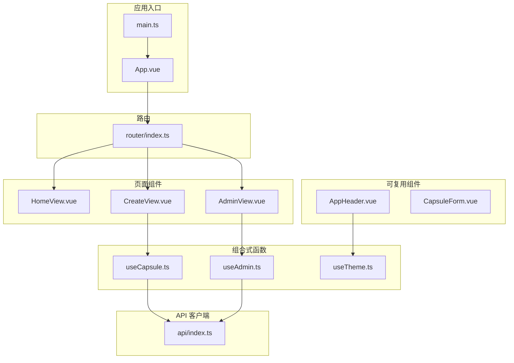
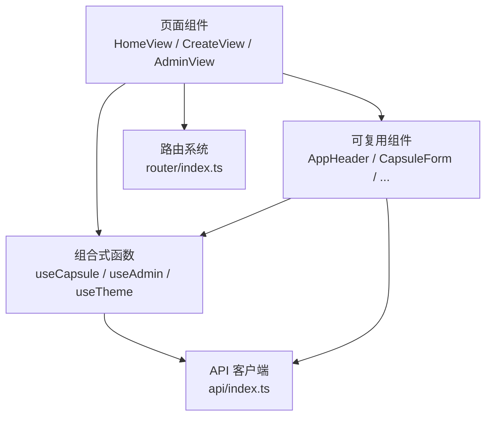
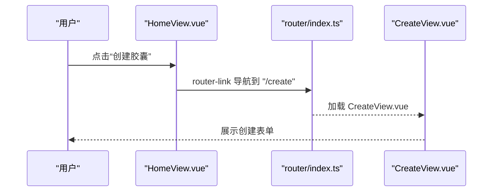
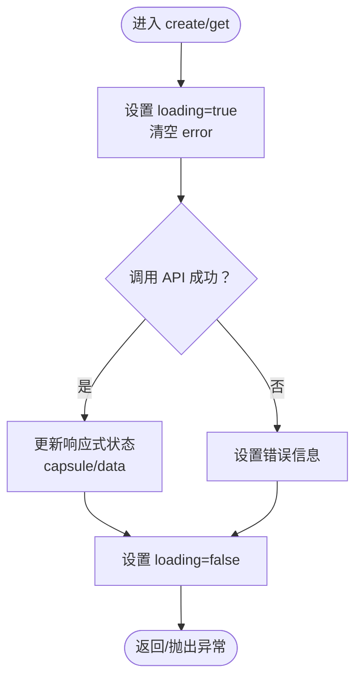
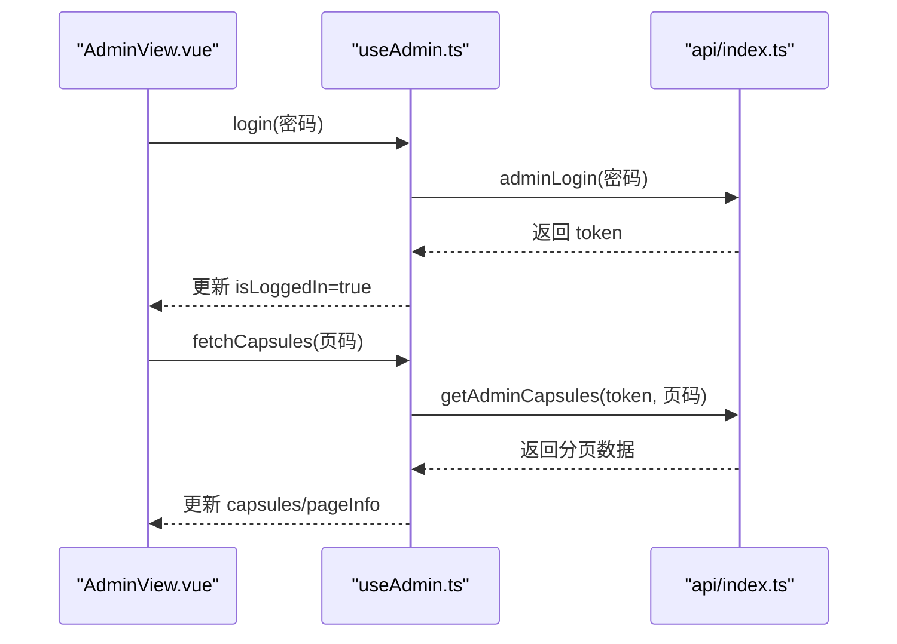
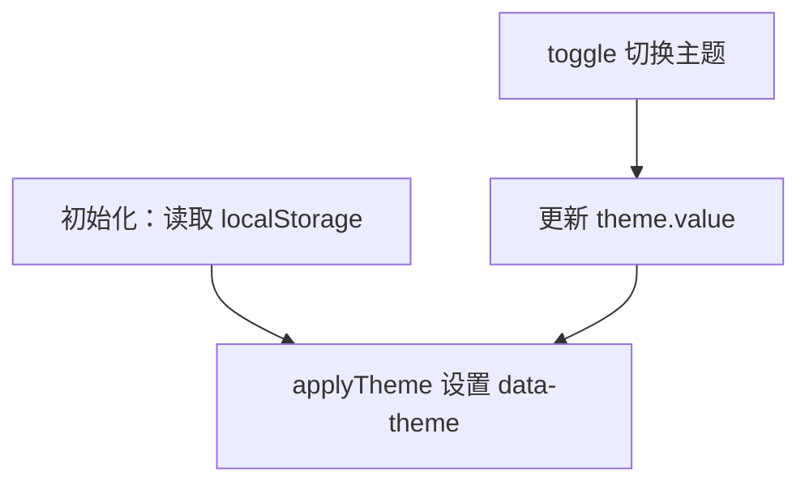
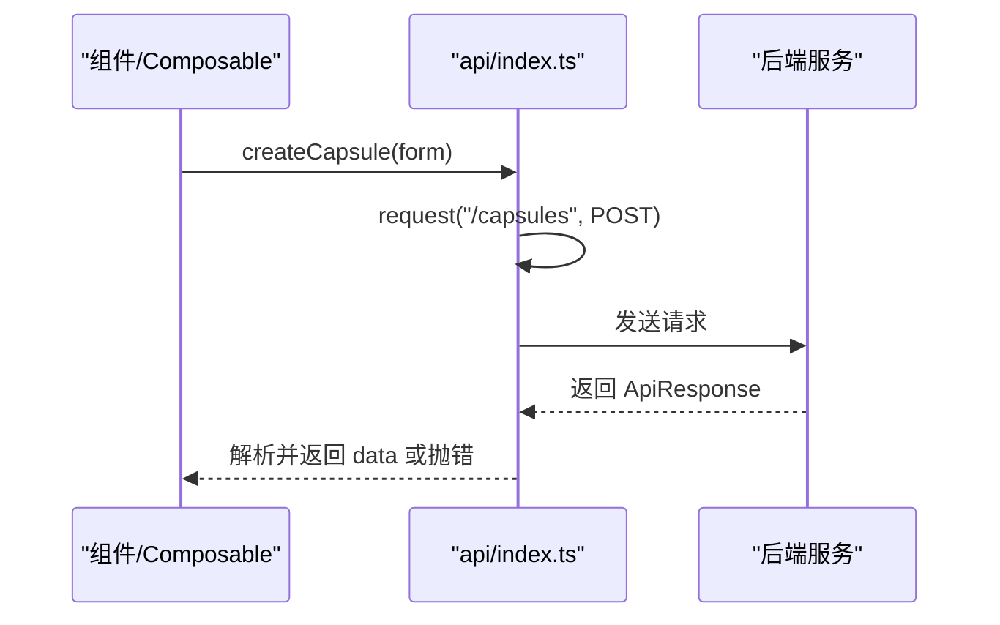
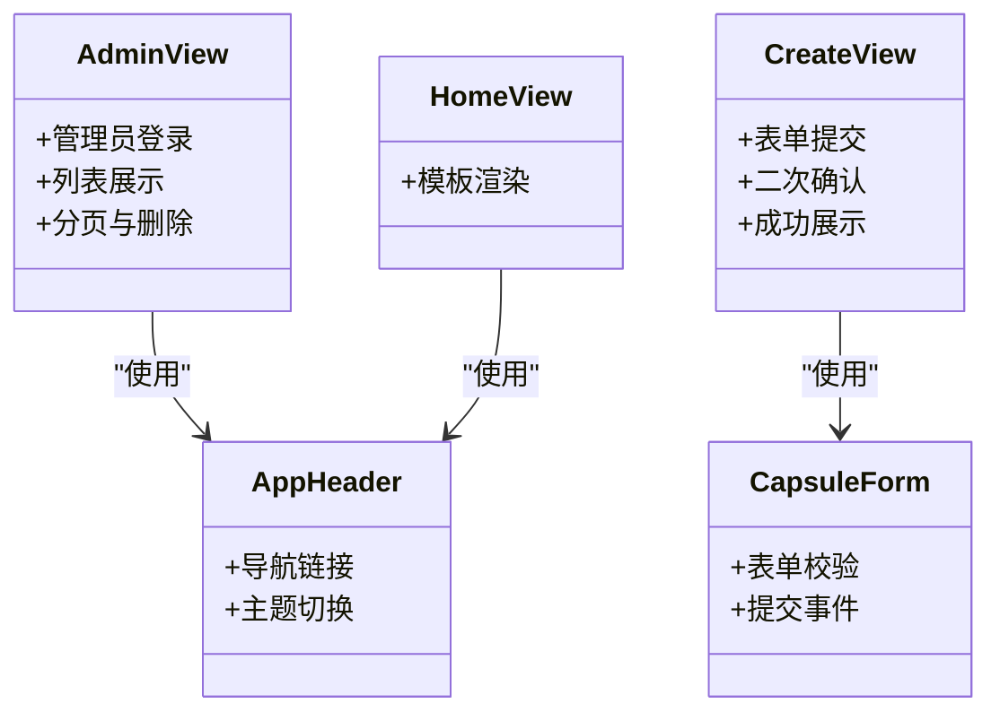
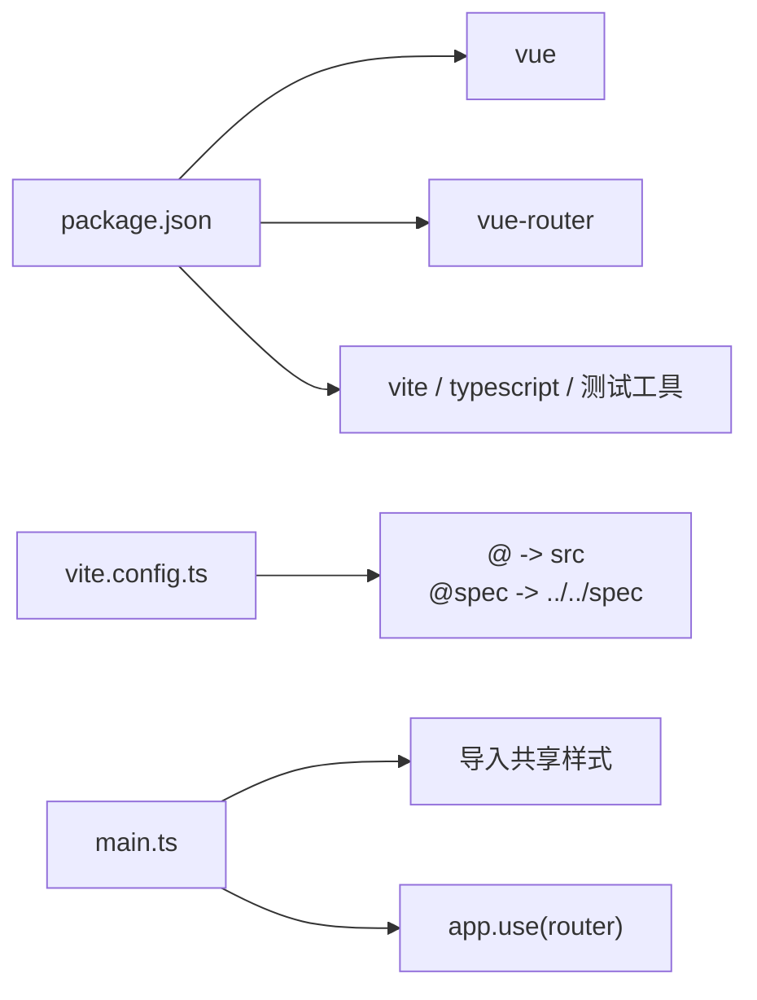

# Vue 3 实现

<cite>
**本文引用的文件**
- [README.md](file://frontends/vue3-ts/README.md)
- [package.json](file://frontends/vue3-ts/package.json)
- [vite.config.ts](file://frontends/vue3-ts/vite.config.ts)
- [src/main.ts](file://frontends/vue3-ts/src/main.ts)
- [src/App.vue](file://frontends/vue3-ts/src/App.vue)
- [src/router/index.ts](file://frontends/vue3-ts/src/router/index.ts)
- [src/api/index.ts](file://frontends/vue3-ts/src/api/index.ts)
- [src/composables/useCapsule.ts](file://frontends/vue3-ts/src/composables/useCapsule.ts)
- [src/composables/useAdmin.ts](file://frontends/vue3-ts/src/composables/useAdmin.ts)
- [src/composables/useTheme.ts](file://frontends/vue3-ts/src/composables/useTheme.ts)
- [src/views/HomeView.vue](file://frontends/vue3-ts/src/views/HomeView.vue)
- [src/views/CreateView.vue](file://frontends/vue3-ts/src/views/CreateView.vue)
- [src/views/AdminView.vue](file://frontends/vue3-ts/src/views/AdminView.vue)
- [src/components/CapsuleForm.vue](file://frontends/vue3-ts/src/components/CapsuleForm.vue)
- [src/components/AppHeader.vue](file://frontends/vue3-ts/src/components/AppHeader.vue)
</cite>

## 目录
1. [简介](#简介)
2. [项目结构](#项目结构)
3. [核心组件](#核心组件)
4. [架构总览](#架构总览)
5. [详细组件分析](#详细组件分析)
6. [依赖关系分析](#依赖关系分析)
7. [性能考虑](#性能考虑)
8. [故障排查指南](#故障排查指南)
9. [结论](#结论)
10. [附录](#附录)

## 简介
本项目是一个基于 Vue 3 + TypeScript + Vite 的前端应用，采用 Composition API 设计模式，围绕“时间胶囊”业务提供创建、查看、管理与管理员后台等功能。项目强调可复用性与类型安全，通过组合式函数（Composables）抽象跨组件的业务逻辑，结合 Vue Router 实现页面导航，使用统一的 API 客户端封装与错误处理机制，并通过共享设计令牌与 CSS 工具类实现一致的样式体系。

## 项目结构
- 应用入口与根组件：main.ts、App.vue
- 路由系统：router/index.ts
- API 客户端：api/index.ts
- 组合式函数：composables/useCapsule.ts、useAdmin.ts、useTheme.ts
- 页面组件：views/HomeView.vue、CreateView.vue、AdminView.vue 等
- 可复用组件：components/AppHeader.vue、CapsuleForm.vue 等
- 构建与别名：vite.config.ts
- 依赖与脚本：package.json
- 项目说明：README.md

图表来源
- [src/main.ts:1-23](file://frontends/vue3-ts/src/main.ts#L1-L23)
- [src/App.vue:1-19](file://frontends/vue3-ts/src/App.vue#L1-L19)
- [src/router/index.ts:1-44](file://frontends/vue3-ts/src/router/index.ts#L1-L44)
- [src/api/index.ts:1-120](file://frontends/vue3-ts/src/api/index.ts#L1-L120)
- [src/composables/useCapsule.ts:1-65](file://frontends/vue3-ts/src/composables/useCapsule.ts#L1-L65)
- [src/composables/useAdmin.ts:1-132](file://frontends/vue3-ts/src/composables/useAdmin.ts#L1-L132)
- [src/composables/useTheme.ts:1-57](file://frontends/vue3-ts/src/composables/useTheme.ts#L1-L57)
- [src/views/HomeView.vue:1-65](file://frontends/vue3-ts/src/views/HomeView.vue#L1-L65)
- [src/views/CreateView.vue:1-106](file://frontends/vue3-ts/src/views/CreateView.vue#L1-L106)
- [src/views/AdminView.vue:1-89](file://frontends/vue3-ts/src/views/AdminView.vue#L1-L89)
- [src/components/AppHeader.vue:1-75](file://frontends/vue3-ts/src/components/AppHeader.vue#L1-L75)
- [src/components/CapsuleForm.vue:1-164](file://frontends/vue3-ts/src/components/CapsuleForm.vue#L1-L164)

章节来源
- [README.md:51-115](file://frontends/vue3-ts/README.md#L51-L115)
- [package.json:1-30](file://frontends/vue3-ts/package.json#L1-L30)
- [vite.config.ts:1-23](file://frontends/vue3-ts/vite.config.ts#L1-L23)

## 核心组件
- 应用入口与挂载：main.ts 创建应用实例，注册路由并导入共享样式，最后挂载到 #app。
- 根组件：App.vue 作为页面容器，顶部渲染 AppHeader，中间区域通过 router-view 占位，底部渲染 AppFooter。
- 路由系统：router/index.ts 定义首页、创建、开启、关于、管理员后台等路由，均采用懒加载以优化首屏。
- API 客户端：api/index.ts 封装统一的请求方法与错误处理，提供胶囊创建、查询、管理员登录、分页查询与删除等接口。
- 组合式函数：
  - useCapsule：封装胶囊创建与查询的状态与流程。
  - useAdmin：封装管理员登录、登出、分页查询与删除胶囊的状态与流程，并持久化 token。
  - useTheme：封装主题切换与持久化。
- 页面组件：
  - HomeView：首页展示与导航。
  - CreateView：表单提交、二次确认与创建结果展示。
  - AdminView：管理员登录、列表展示与删除确认。
- 可复用组件：
  - AppHeader：导航与主题切换入口。
  - CapsuleForm：表单校验与提交事件。

章节来源
- [src/main.ts:1-23](file://frontends/vue3-ts/src/main.ts#L1-L23)
- [src/App.vue:1-19](file://frontends/vue3-ts/src/App.vue#L1-L19)
- [src/router/index.ts:1-44](file://frontends/vue3-ts/src/router/index.ts#L1-L44)
- [src/api/index.ts:1-120](file://frontends/vue3-ts/src/api/index.ts#L1-L120)
- [src/composables/useCapsule.ts:1-65](file://frontends/vue3-ts/src/composables/useCapsule.ts#L1-L65)
- [src/composables/useAdmin.ts:1-132](file://frontends/vue3-ts/src/composables/useAdmin.ts#L1-L132)
- [src/composables/useTheme.ts:1-57](file://frontends/vue3-ts/src/composables/useTheme.ts#L1-L57)
- [src/views/HomeView.vue:1-65](file://frontends/vue3-ts/src/views/HomeView.vue#L1-L65)
- [src/views/CreateView.vue:1-106](file://frontends/vue3-ts/src/views/CreateView.vue#L1-L106)
- [src/views/AdminView.vue:1-89](file://frontends/vue3-ts/src/views/AdminView.vue#L1-L89)
- [src/components/AppHeader.vue:1-75](file://frontends/vue3-ts/src/components/AppHeader.vue#L1-L75)
- [src/components/CapsuleForm.vue:1-164](file://frontends/vue3-ts/src/components/CapsuleForm.vue#L1-L164)

## 架构总览
该应用采用“页面组件 + 可复用组件 + 组合式函数 + API 客户端”的分层架构。页面组件负责展示与用户交互；可复用组件提供通用 UI；组合式函数抽象跨组件的业务状态与流程；API 客户端集中处理网络请求与错误。路由系统负责页面导航与懒加载。

图表来源
- [src/views/HomeView.vue:1-65](file://frontends/vue3-ts/src/views/HomeView.vue#L1-L65)
- [src/views/CreateView.vue:1-106](file://frontends/vue3-ts/src/views/CreateView.vue#L1-L106)
- [src/views/AdminView.vue:1-89](file://frontends/vue3-ts/src/views/AdminView.vue#L1-L89)
- [src/components/AppHeader.vue:1-75](file://frontends/vue3-ts/src/components/AppHeader.vue#L1-L75)
- [src/components/CapsuleForm.vue:1-164](file://frontends/vue3-ts/src/components/CapsuleForm.vue#L1-L164)
- [src/composables/useCapsule.ts:1-65](file://frontends/vue3-ts/src/composables/useCapsule.ts#L1-L65)
- [src/composables/useAdmin.ts:1-132](file://frontends/vue3-ts/src/composables/useAdmin.ts#L1-L132)
- [src/composables/useTheme.ts:1-57](file://frontends/vue3-ts/src/composables/useTheme.ts#L1-L57)
- [src/api/index.ts:1-120](file://frontends/vue3-ts/src/api/index.ts#L1-L120)
- [src/router/index.ts:1-44](file://frontends/vue3-ts/src/router/index.ts#L1-L44)

## 详细组件分析

### 路由系统与页面导航
- 路由定义：history 模式，包含首页、创建、开启、关于、管理员后台等路由，均采用动态导入实现懒加载。
- 导航方式：页面内使用 router-link 进行声明式导航；页面外通过编程式导航（如创建成功后跳转查看）。
- 参数传递：开启页面支持可选参数，兼容多种访问形式。

图表来源
- [src/router/index.ts:13-23](file://frontends/vue3-ts/src/router/index.ts#L13-L23)
- [src/views/HomeView.vue:10-13](file://frontends/vue3-ts/src/views/HomeView.vue#L10-L13)
- [src/views/CreateView.vue:1-34](file://frontends/vue3-ts/src/views/CreateView.vue#L1-L34)

章节来源
- [src/router/index.ts:1-44](file://frontends/vue3-ts/src/router/index.ts#L1-L44)
- [src/views/HomeView.vue:1-65](file://frontends/vue3-ts/src/views/HomeView.vue#L1-L65)
- [src/views/CreateView.vue:1-106](file://frontends/vue3-ts/src/views/CreateView.vue#L1-L106)

### 组合式函数：useCapsule（胶囊业务逻辑）
- 状态管理：封装当前胶囊、加载状态、错误信息。
- 核心方法：
  - create：调用 API 创建胶囊，更新状态并返回数据。
  - get：根据 code 查询胶囊详情。
- 错误处理：捕获异常并设置错误信息，finally 中关闭加载态。

图表来源
- [src/composables/useCapsule.ts:24-60](file://frontends/vue3-ts/src/composables/useCapsule.ts#L24-L60)

章节来源
- [src/composables/useCapsule.ts:1-65](file://frontends/vue3-ts/src/composables/useCapsule.ts#L1-L65)

### 组合式函数：useAdmin（管理员认证）
- 状态管理：封装胶囊列表、分页信息、加载状态、错误信息；token 从 sessionStorage 恢复。
- 核心方法：
  - login：调用管理员登录 API，成功后持久化 token。
  - logout：清理 token 与本地状态。
  - fetchCapsules：分页加载胶囊列表，支持页码参数；当出现认证错误时自动登出。
  - deleteCapsule：删除指定胶囊后刷新当前页。
- 认证守卫：未登录时直接返回，避免无意义请求。

图表来源
- [src/views/AdminView.vue:49-71](file://frontends/vue3-ts/src/views/AdminView.vue#L49-L71)
- [src/composables/useAdmin.ts:43-96](file://frontends/vue3-ts/src/composables/useAdmin.ts#L43-L96)
- [src/api/index.ts:74-95](file://frontends/vue3-ts/src/api/index.ts#L74-L95)

章节来源
- [src/composables/useAdmin.ts:1-132](file://frontends/vue3-ts/src/composables/useAdmin.ts#L1-L132)
- [src/views/AdminView.vue:1-89](file://frontends/vue3-ts/src/views/AdminView.vue#L1-L89)
- [src/api/index.ts:63-111](file://frontends/vue3-ts/src/api/index.ts#L63-L111)

### 组合式函数：useTheme（主题切换）
- 状态管理：当前主题（light/dark），从 localStorage 恢复默认值。
- 核心方法：
  - toggle：在 light 与 dark 之间切换。
  - 应用策略：通过在 html 上设置 data-theme 属性，配合 CSS 变量实现主题切换；同时持久化到 localStorage。
- 响应式：使用 watchEffect 监听主题变化并应用。

图表来源
- [src/composables/useTheme.ts:13-38](file://frontends/vue3-ts/src/composables/useTheme.ts#L13-L38)
- [src/composables/useTheme.ts:51-53](file://frontends/vue3-ts/src/composables/useTheme.ts#L51-L53)

章节来源
- [src/composables/useTheme.ts:1-57](file://frontends/vue3-ts/src/composables/useTheme.ts#L1-L57)
- [src/components/AppHeader.vue:1-75](file://frontends/vue3-ts/src/components/AppHeader.vue#L1-L75)

### API 客户端封装与错误处理
- 统一基地址：/api/v1
- 通用请求封装：request 函数负责序列化、头设置、JSON 解析与统一错误处理（HTTP 非 2xx 或业务失败均抛错）。
- 具体接口：
  - createCapsule：创建胶囊，自动将 openAt 转换为 ISO 字符串。
  - getCapsule：按 code 查询胶囊详情。
  - adminLogin：管理员登录获取 token。
  - getAdminCapsules：管理员分页查询胶囊列表。
  - deleteAdminCapsule：管理员删除胶囊。
  - getHealthInfo：获取后端健康信息。
- 错误处理：在组合式函数中捕获并设置 error，页面组件负责展示。

图表来源
- [src/api/index.ts:19-54](file://frontends/vue3-ts/src/api/index.ts#L19-L54)
- [src/composables/useCapsule.ts:24-37](file://frontends/vue3-ts/src/composables/useCapsule.ts#L24-L37)

章节来源
- [src/api/index.ts:1-120](file://frontends/vue3-ts/src/api/index.ts#L1-L120)
- [src/composables/useCapsule.ts:1-65](file://frontends/vue3-ts/src/composables/useCapsule.ts#L1-L65)

### 页面组件与组件架构
- HomeView：首页展示、功能引导与导航。
- CreateView：表单提交、二次确认对话框、创建成功展示与复制胶囊码。
- AdminView：管理员登录、列表展示、分页与删除确认。
- 可复用组件：AppHeader（导航与主题切换）、CapsuleForm（表单校验与提交事件）。

图表来源
- [src/views/HomeView.vue:1-65](file://frontends/vue3-ts/src/views/HomeView.vue#L1-L65)
- [src/views/CreateView.vue:1-106](file://frontends/vue3-ts/src/views/CreateView.vue#L1-L106)
- [src/views/AdminView.vue:1-89](file://frontends/vue3-ts/src/views/AdminView.vue#L1-L89)
- [src/components/AppHeader.vue:1-75](file://frontends/vue3-ts/src/components/AppHeader.vue#L1-L75)
- [src/components/CapsuleForm.vue:1-164](file://frontends/vue3-ts/src/components/CapsuleForm.vue#L1-L164)

章节来源
- [src/views/HomeView.vue:1-65](file://frontends/vue3-ts/src/views/HomeView.vue#L1-L65)
- [src/views/CreateView.vue:1-106](file://frontends/vue3-ts/src/views/CreateView.vue#L1-L106)
- [src/views/AdminView.vue:1-89](file://frontends/vue3-ts/src/views/AdminView.vue#L1-L89)
- [src/components/AppHeader.vue:1-75](file://frontends/vue3-ts/src/components/AppHeader.vue#L1-L75)
- [src/components/CapsuleForm.vue:1-164](file://frontends/vue3-ts/src/components/CapsuleForm.vue#L1-L164)

### 样式系统与设计令牌
- 全局样式：在 main.ts 中导入共享样式（tokens.css、base.css、components.css、layout.css），确保设计令牌与通用样式一致。
- 组件样式：使用 scoped CSS，配合 CSS 变量与工具类（如 flex、justify、gap、grid 等）实现响应式布局。
- 主题适配：通过 useTheme 在 html 上设置 data-theme，组件内使用 :global 与 :deep 选择器适配暗色模式下的特定元素（如日期选择器图标）。

章节来源
- [src/main.ts:9-13](file://frontends/vue3-ts/src/main.ts#L9-L13)
- [src/components/CapsuleForm.vue:159-162](file://frontends/vue3-ts/src/components/CapsuleForm.vue#L159-L162)
- [src/views/CreateView.vue:101-104](file://frontends/vue3-ts/src/views/CreateView.vue#L101-L104)

## 依赖关系分析
- 构建与别名：vite.config.ts 配置了 @ 与 @spec 的路径别名，便于引用 src 与 spec 目录。
- 依赖管理：package.json 指定 Vue 3 与 Vue Router 作为运行时依赖，Vite、TypeScript、测试工具为开发依赖。
- 运行时注入：main.ts 注入全局样式并在应用实例上注册路由。

图表来源
- [package.json:13-28](file://frontends/vue3-ts/package.json#L13-L28)
- [vite.config.ts:7-12](file://frontends/vue3-ts/vite.config.ts#L7-L12)
- [src/main.ts:9-19](file://frontends/vue3-ts/src/main.ts#L9-L19)

章节来源
- [package.json:1-30](file://frontends/vue3-ts/package.json#L1-L30)
- [vite.config.ts:1-23](file://frontends/vue3-ts/vite.config.ts#L1-L23)
- [src/main.ts:1-23](file://frontends/vue3-ts/src/main.ts#L1-L23)

## 性能考虑
- 路由懒加载：通过动态导入减少首屏包体积，提升加载速度。
- 组合式函数状态局部化：仅在需要的组件中使用，避免全局状态污染。
- API 错误早返回：在未登录场景提前返回，减少无效请求。
- 样式作用域：scoped CSS 降低样式冲突风险，同时保持组件边界清晰。

## 故障排查指南
- 路由无法匹配：检查路由定义与路径参数是否正确，确认路由懒加载组件路径有效。
- API 请求失败：查看统一错误处理逻辑，确认后端服务可达与响应格式符合预期。
- 主题不生效：确认 useTheme 已在应用启动阶段初始化，且 html 上存在 data-theme 属性。
- 管理员登录失效：检查 token 是否存储在 sessionStorage，以及在认证错误时是否触发了自动登出。

章节来源
- [src/router/index.ts:13-40](file://frontends/vue3-ts/src/router/index.ts#L13-L40)
- [src/api/index.ts:19-37](file://frontends/vue3-ts/src/api/index.ts#L19-L37)
- [src/composables/useTheme.ts:20-28](file://frontends/vue3-ts/src/composables/useTheme.ts#L20-L28)
- [src/composables/useAdmin.ts:88-92](file://frontends/vue3-ts/src/composables/useAdmin.ts#L88-L92)

## 结论
本项目以 Vue 3 + TypeScript + Vite 为基础，通过 Composition API 将业务逻辑抽象为可复用的组合式函数，结合统一的 API 客户端与路由系统，实现了清晰的页面导航与状态管理。共享样式与设计令牌确保了视觉一致性与主题适配能力。整体架构具备良好的扩展性与可维护性，适合进一步引入状态管理库或进行更细粒度的模块拆分。

## 附录
- 快速开始与命令参考见项目说明文档。
- 环境变量配置与代理设置见构建配置文件。

章节来源
- [README.md:22-115](file://frontends/vue3-ts/README.md#L22-L115)
- [vite.config.ts:13-21](file://frontends/vue3-ts/vite.config.ts#L13-L21)