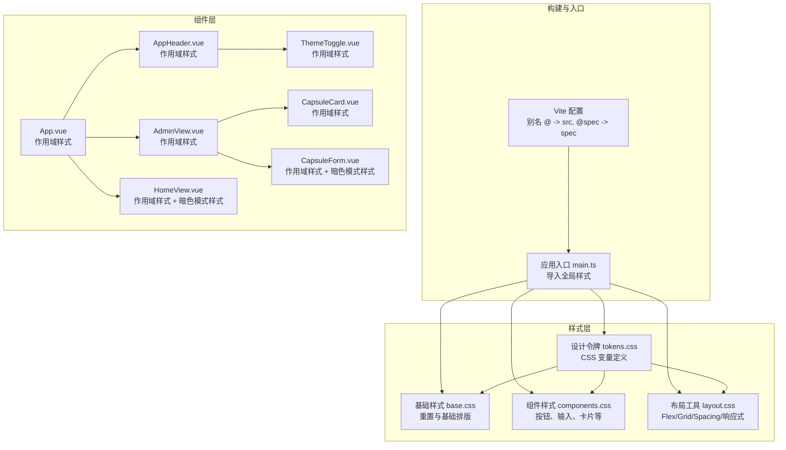
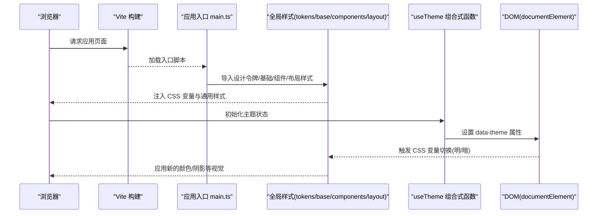
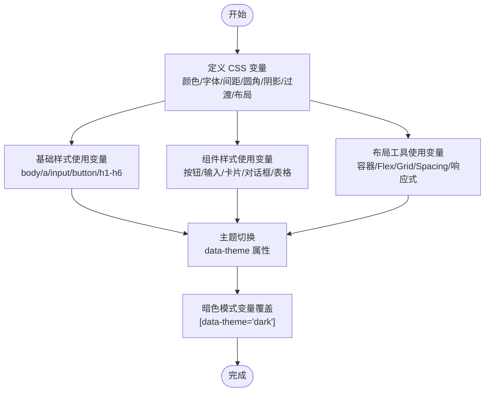
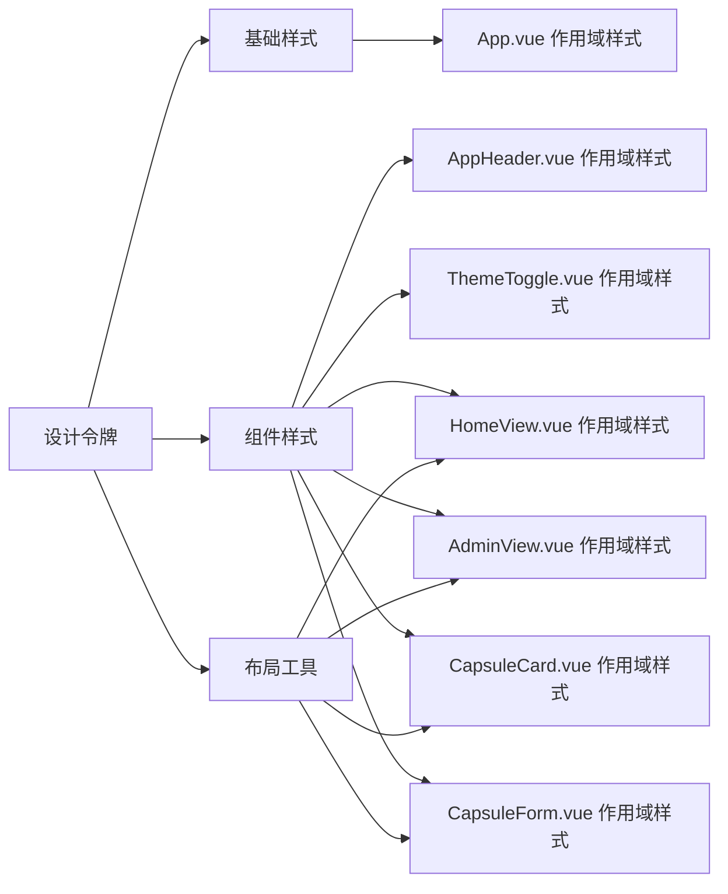
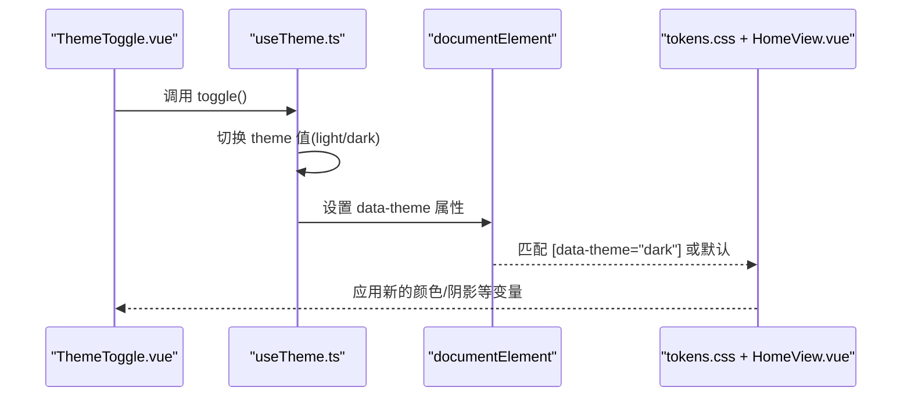
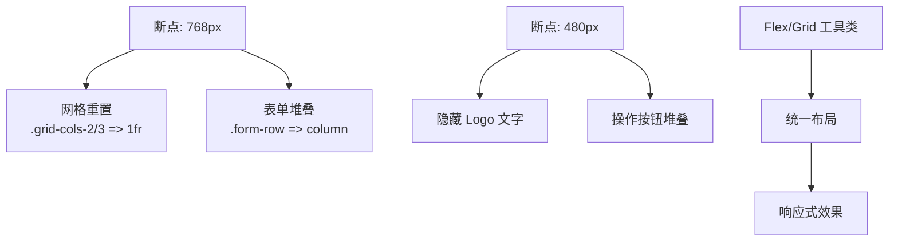
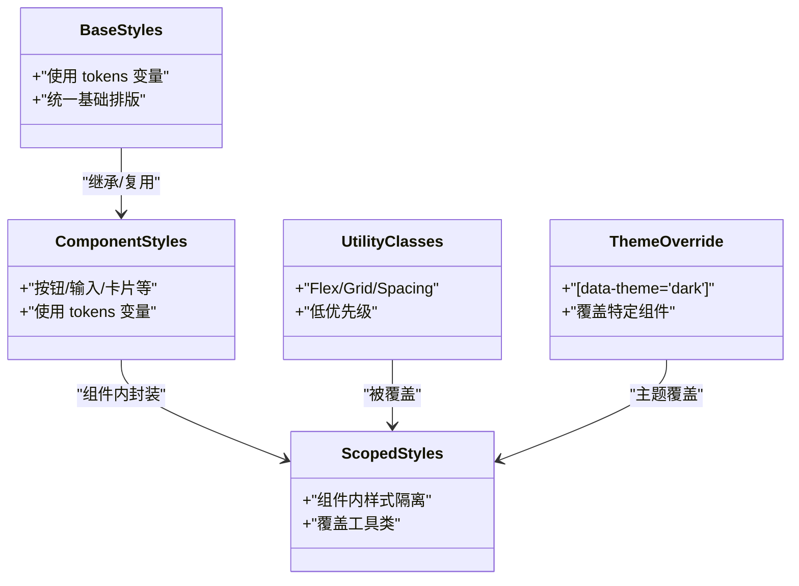
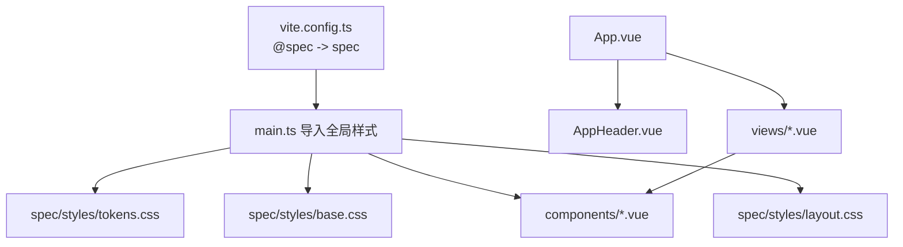

# 样式系统与设计实现

<cite>
**本文档引用的文件**
- [tokens.css](file://spec/styles/tokens.css)
- [base.css](file://spec/styles/base.css)
- [components.css](file://spec/styles/components.css)
- [layout.css](file://spec/styles/layout.css)
- [main.ts](file://frontends/vue3-ts/src/main.ts)
- [App.vue](file://frontends/vue3-ts/src/App.vue)
- [HomeView.vue](file://frontends/vue3-ts/src/views/HomeView.vue)
- [AdminView.vue](file://frontends/vue3-ts/src/views/AdminView.vue)
- [ThemeToggle.vue](file://frontends/vue3-ts/src/components/ThemeToggle.vue)
- [useTheme.ts](file://frontends/vue3-ts/src/composables/useTheme.ts)
- [AppHeader.vue](file://frontends/vue3-ts/src/components/AppHeader.vue)
- [CapsuleCard.vue](file://frontends/vue3-ts/src/components/CapsuleCard.vue)
- [CapsuleForm.vue](file://frontends/vue3-ts/src/components/CapsuleForm.vue)
- [index.ts](file://frontends/vue3-ts/src/router/index.ts)
- [vite.config.ts](file://frontends/vue3-ts/vite.config.ts)
</cite>

## 目录
1. [简介](#简介)
2. [项目结构](#项目结构)
3. [核心组件](#核心组件)
4. [架构总览](#架构总览)
5. [详细组件分析](#详细组件分析)
6. [依赖关系分析](#依赖关系分析)
7. [性能考虑](#性能考虑)
8. [故障排除指南](#故障排除指南)
9. [结论](#结论)
10. [附录](#附录)

## 简介
本文件系统性梳理 HelloTimeByClaude 项目中 Vue 3 样式系统与设计实现，重点覆盖以下方面：
- 设计令牌系统：CSS 自定义属性的定义与应用、颜色系统、字体系统、间距系统、圆角与阴影、过渡动画、布局约束
- 样式模块化：全局样式导入、组件作用域样式、动态类名绑定
- 响应式设计：媒体查询、弹性布局、网格系统、移动端适配
- 主题切换：CSS 变量动态修改、主题文件组织、用户偏好持久化
- 组件样式封装：样式继承、样式隔离、样式优先级管理
- 样式优化：CSS 压缩、关键 CSS 提取、性能监控
- 最佳实践与可维护性建议

## 项目结构
Vue 3 前端通过 Vite 构建，采用模块化样式组织与组合式函数实现主题切换。样式资源集中于 spec/styles 目录，按“设计令牌 → 基础 → 组件 → 布局”分层；Vue 组件内部使用作用域样式，并通过全局样式实现统一设计语言。

**图表来源**
- [vite.config.ts:1-23](file://frontends/vue3-ts/vite.config.ts#L1-L23)
- [main.ts:1-23](file://frontends/vue3-ts/src/main.ts#L1-L23)
- [tokens.css:1-104](file://spec/styles/tokens.css#L1-L104)
- [base.css:1-67](file://spec/styles/base.css#L1-L67)
- [components.css:1-207](file://spec/styles/components.css#L1-L207)
- [layout.css:1-103](file://spec/styles/layout.css#L1-L103)
- [App.vue:1-19](file://frontends/vue3-ts/src/App.vue#L1-L19)
- [AppHeader.vue:1-75](file://frontends/vue3-ts/src/components/AppHeader.vue#L1-L75)
- [ThemeToggle.vue:1-34](file://frontends/vue3-ts/src/components/ThemeToggle.vue#L1-L34)
- [HomeView.vue:1-173](file://frontends/vue3-ts/src/views/HomeView.vue#L1-L173)
- [AdminView.vue:1-89](file://frontends/vue3-ts/src/views/AdminView.vue#L1-L89)
- [CapsuleCard.vue:1-98](file://frontends/vue3-ts/src/components/CapsuleCard.vue#L1-L98)
- [CapsuleForm.vue:1-165](file://frontends/vue3-ts/src/components/CapsuleForm.vue#L1-L165)

**章节来源**
- [vite.config.ts:1-23](file://frontends/vue3-ts/vite.config.ts#L1-L23)
- [main.ts:1-23](file://frontends/vue3-ts/src/main.ts#L1-L23)

## 核心组件
- 设计令牌系统：以 CSS 自定义属性为核心，统一颜色、字体、间距、圆角、阴影、过渡、布局约束，支持明/暗两套变量集
- 全局样式层：基础重置与排版、共享组件样式、布局工具类，确保跨组件一致性
- 组合式主题：useTheme 提供主题状态与切换逻辑，持久化至 localStorage，通过 data-theme 属性驱动 CSS 变量切换
- 组件作用域样式：每个组件独立作用域样式，避免样式泄漏；同时可使用全局工具类提升开发效率
- 响应式体系：基于媒体查询与 Flex/Grid 工具类，实现移动端优先的自适应布局

**章节来源**
- [tokens.css:1-104](file://spec/styles/tokens.css#L1-L104)
- [base.css:1-67](file://spec/styles/base.css#L1-L67)
- [components.css:1-207](file://spec/styles/components.css#L1-L207)
- [layout.css:1-103](file://spec/styles/layout.css#L1-L103)
- [useTheme.ts:1-57](file://frontends/vue3-ts/src/composables/useTheme.ts#L1-L57)

## 架构总览
Vue 3 应用启动时一次性导入全局样式，随后通过组件作用域样式与工具类实现一致的设计语言。主题切换通过 data-theme 属性影响 CSS 变量，从而实现明/暗模式无缝切换。

**图表来源**
- [main.ts:1-23](file://frontends/vue3-ts/src/main.ts#L1-L23)
- [useTheme.ts:1-57](file://frontends/vue3-ts/src/composables/useTheme.ts#L1-L57)
- [tokens.css:1-104](file://spec/styles/tokens.css#L1-L104)

## 详细组件分析

### 设计令牌系统（CSS 变量）
- 颜色系统：主色、背景、文本、边框、成功/警告/错误/信息等语义色，明/暗两套变量
- 字体系统：无衬线与等宽字体族、字号、行高、字重
- 间距系统：细粒度空间单位，配合工具类实现一致的留白
- 圆角与阴影：统一的圆角半径与多层级阴影
- 过渡动画：统一的过渡时长与缓动
- 布局约束：最大宽度、头部高度等布局常量

**图表来源**
- [tokens.css:1-104](file://spec/styles/tokens.css#L1-L104)
- [base.css:1-67](file://spec/styles/base.css#L1-L67)
- [components.css:1-207](file://spec/styles/components.css#L1-L207)
- [layout.css:1-103](file://spec/styles/layout.css#L1-L103)

**章节来源**
- [tokens.css:1-104](file://spec/styles/tokens.css#L1-L104)

### 全局样式层（基础/组件/布局）
- 基础样式：重置盒模型、字体继承、链接与选择器过渡、图片自适应、表单控件继承
- 组件样式：按钮、输入、卡片、徽章、对话框遮罩、表格等通用组件样式
- 布局工具：容器、Flex/Grid、间距、文本、显示控制、页面布局、响应式断点

**图表来源**
- [base.css:1-67](file://spec/styles/base.css#L1-L67)
- [components.css:1-207](file://spec/styles/components.css#L1-L207)
- [layout.css:1-103](file://spec/styles/layout.css#L1-L103)
- [App.vue:1-19](file://frontends/vue3-ts/src/App.vue#L1-L19)
- [AppHeader.vue:1-75](file://frontends/vue3-ts/src/components/AppHeader.vue#L1-L75)
- [ThemeToggle.vue:1-34](file://frontends/vue3-ts/src/components/ThemeToggle.vue#L1-L34)
- [HomeView.vue:1-173](file://frontends/vue3-ts/src/views/HomeView.vue#L1-L173)
- [AdminView.vue:1-89](file://frontends/vue3-ts/src/views/AdminView.vue#L1-L89)
- [CapsuleCard.vue:1-98](file://frontends/vue3-ts/src/components/CapsuleCard.vue#L1-L98)
- [CapsuleForm.vue:1-165](file://frontends/vue3-ts/src/components/CapsuleForm.vue#L1-L165)

**章节来源**
- [base.css:1-67](file://spec/styles/base.css#L1-L67)
- [components.css:1-207](file://spec/styles/components.css#L1-L207)
- [layout.css:1-103](file://spec/styles/layout.css#L1-L103)

### 主题切换机制（CSS 变量 + 组合式函数）
- 数据流：useTheme 管理主题状态，watchEffect 监听变更并写入 localStorage 与 documentElement 的 data-theme 属性
- 触发机制：CSS 中通过 [data-theme="dark"] 选择器覆盖颜色与阴影等变量，实现明/暗模式切换
- 用户偏好：localStorage 持久化，应用启动时读取并初始化

**图表来源**
- [ThemeToggle.vue:1-34](file://frontends/vue3-ts/src/components/ThemeToggle.vue#L1-L34)
- [useTheme.ts:1-57](file://frontends/vue3-ts/src/composables/useTheme.ts#L1-L57)
- [tokens.css:82-104](file://spec/styles/tokens.css#L82-L104)
- [HomeView.vue:156-172](file://frontends/vue3-ts/src/views/HomeView.vue#L156-L172)

**章节来源**
- [ThemeToggle.vue:1-34](file://frontends/vue3-ts/src/components/ThemeToggle.vue#L1-L34)
- [useTheme.ts:1-57](file://frontends/vue3-ts/src/composables/useTheme.ts#L1-L57)
- [tokens.css:82-104](file://spec/styles/tokens.css#L82-L104)

### 响应式设计（媒体查询 + 工具类）
- 媒体查询：在布局工具与组件中使用 max-width 断点，实现网格列数与表单布局的自适应
- 弹性布局：Flex 工具类（flex、items-center、justify-between、gap 等）统一布局
- 网格系统：Grid 工具类（grid、grid-cols-2/3、repeat 等）快速构建栅格
- 移动端适配：针对窄屏隐藏 Logo 文字、调整按钮排列方向、限制最大宽度

**图表来源**
- [layout.css:96-103](file://spec/styles/layout.css#L96-L103)
- [HomeView.vue:143-153](file://frontends/vue3-ts/src/views/HomeView.vue#L143-L153)
- [AppHeader.vue:68-73](file://frontends/vue3-ts/src/components/AppHeader.vue#L68-L73)
- [CapsuleForm.vue:153-157](file://frontends/vue3-ts/src/components/CapsuleForm.vue#L153-L157)

**章节来源**
- [layout.css:96-103](file://spec/styles/layout.css#L96-L103)
- [HomeView.vue:143-153](file://frontends/vue3-ts/src/views/HomeView.vue#L143-L153)
- [AppHeader.vue:68-73](file://frontends/vue3-ts/src/components/AppHeader.vue#L68-L73)
- [CapsuleForm.vue:153-157](file://frontends/vue3-ts/src/components/CapsuleForm.vue#L153-L157)

### 组件样式封装策略
- 样式继承：基础样式层统一字体、颜色、过渡；组件样式层复用变量，减少重复定义
- 样式隔离：组件内使用 scoped 样式，避免全局污染；必要时使用深度选择器或非作用域样式处理特定场景（如暗色模式）
- 样式优先级：工具类优先级较低，组件 scoped 样式覆盖工具类；特殊场景使用非作用域样式进行主题覆盖

**图表来源**
- [base.css:1-67](file://spec/styles/base.css#L1-L67)
- [components.css:1-207](file://spec/styles/components.css#L1-L207)
- [AppHeader.vue:23-75](file://frontends/vue3-ts/src/components/AppHeader.vue#L23-L75)
- [HomeView.vue:156-172](file://frontends/vue3-ts/src/views/HomeView.vue#L156-L172)

**章节来源**
- [base.css:1-67](file://spec/styles/base.css#L1-L67)
- [components.css:1-207](file://spec/styles/components.css#L1-L207)
- [AppHeader.vue:23-75](file://frontends/vue3-ts/src/components/AppHeader.vue#L23-L75)
- [HomeView.vue:156-172](file://frontends/vue3-ts/src/views/HomeView.vue#L156-L172)

### 动态类名绑定与交互
- 类名绑定：组件通过动态类名绑定实现禁用态、错误态、激活态等状态切换
- 交互反馈：hover、focus 等伪类使用 tokens 变量，保证交互一致性
- 表单验证：错误态通过类名绑定与对应样式联动

**章节来源**
- [components.css:19-22](file://spec/styles/components.css#L19-L22)
- [components.css:101-109](file://spec/styles/components.css#L101-L109)
- [CapsuleForm.vue:1-165](file://frontends/vue3-ts/src/components/CapsuleForm.vue#L1-L165)

## 依赖关系分析
- 构建别名：@spec 指向 spec 目录，便于在组件中直接导入设计令牌与样式资源
- 入口导入：main.ts 一次性导入全局样式，确保应用启动即具备统一设计语言
- 组件依赖：各组件通过工具类与作用域样式组合使用，形成稳定的样式依赖链

**图表来源**
- [vite.config.ts:7-12](file://frontends/vue3-ts/vite.config.ts#L7-L12)
- [main.ts:9-13](file://frontends/vue3-ts/src/main.ts#L9-L13)

**章节来源**
- [vite.config.ts:7-12](file://frontends/vue3-ts/vite.config.ts#L7-L12)
- [main.ts:9-13](file://frontends/vue3-ts/src/main.ts#L9-L13)

## 性能考虑
- CSS 压缩：生产构建自动压缩 CSS，减少传输体积
- 关键 CSS 提取：建议将首屏关键样式内联，其余样式异步加载
- 样式拆分：保持 tokens/base/components/layout 的分层，避免重复变量与冗余样式
- 主题切换成本：data-theme 方式切换仅影响变量，无需重绘大量元素，性能开销小
- 媒体查询优化：合理使用断点，避免过度嵌套复杂选择器

## 故障排除指南
- 主题不生效：检查 data-theme 属性是否正确设置，确认 tokens.css 中暗色模式选择器语法
- 样式冲突：检查组件 scoped 样式与工具类优先级，必要时使用深度选择器或非作用域样式
- 响应式异常：确认媒体查询断点与工具类使用是否匹配，检查容器与网格类的组合
- 构建别名失效：确认 vite.config.ts 中 @spec 别名指向正确目录

**章节来源**
- [useTheme.ts:20-28](file://frontends/vue3-ts/src/composables/useTheme.ts#L20-L28)
- [tokens.css:82-104](file://spec/styles/tokens.css#L82-L104)
- [vite.config.ts:7-12](file://frontends/vue3-ts/vite.config.ts#L7-L12)

## 结论
该 Vue 3 样式系统以设计令牌为核心，结合全局样式层与组件作用域样式，实现了高内聚、低耦合的样式架构。通过 data-theme 主题切换与媒体查询响应式体系，满足了现代 Web 应用的设计一致性与可访问性需求。建议在后续迭代中进一步完善关键 CSS 提取与性能监控，持续优化主题覆盖与样式优先级策略。

## 附录
- 设计令牌清单：颜色、字体、间距、圆角、阴影、过渡、布局约束
- 工具类清单：容器、Flex、Grid、Spacing、Text、Display、Page、Responsive
- 组件样式清单：按钮、输入、卡片、徽章、对话框、表格、表单