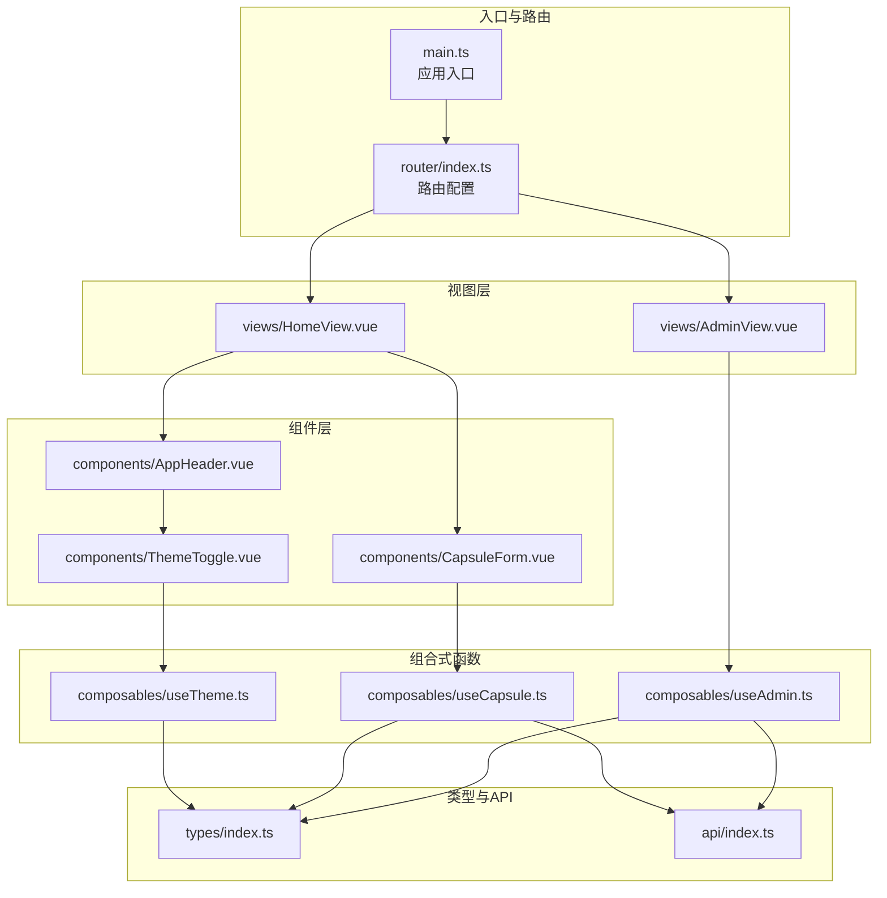
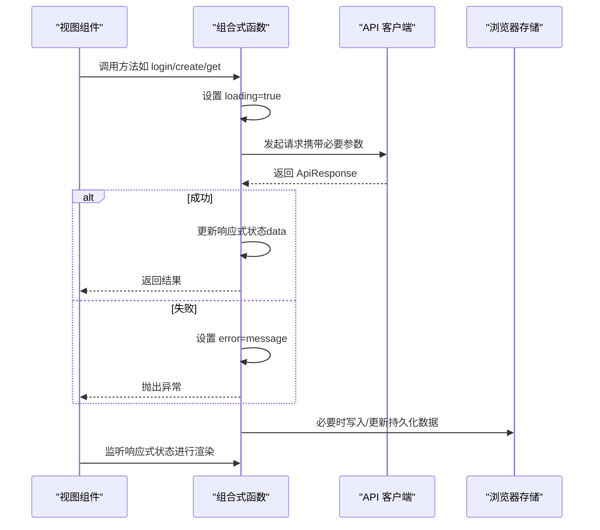
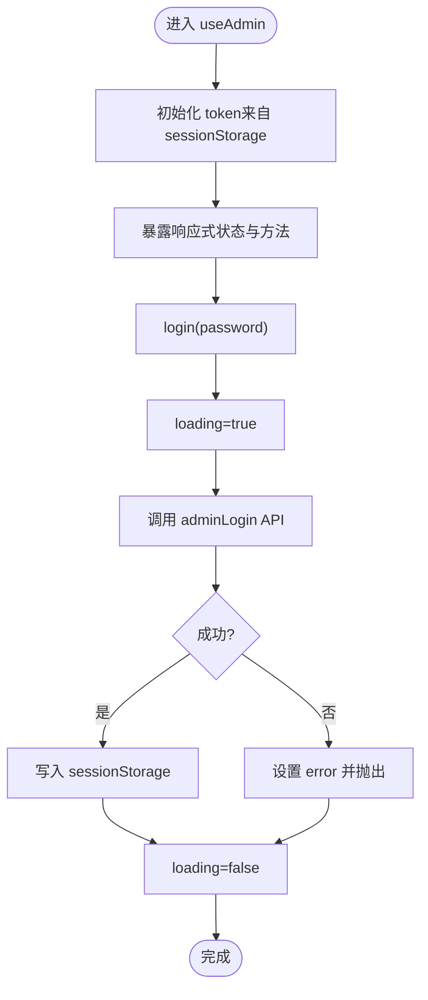
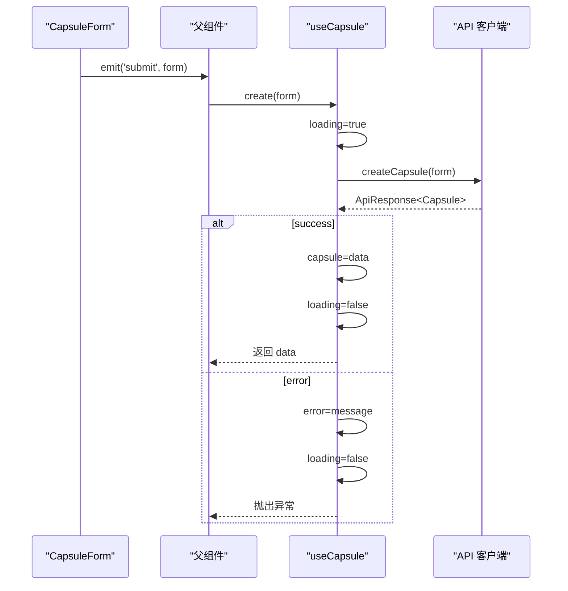
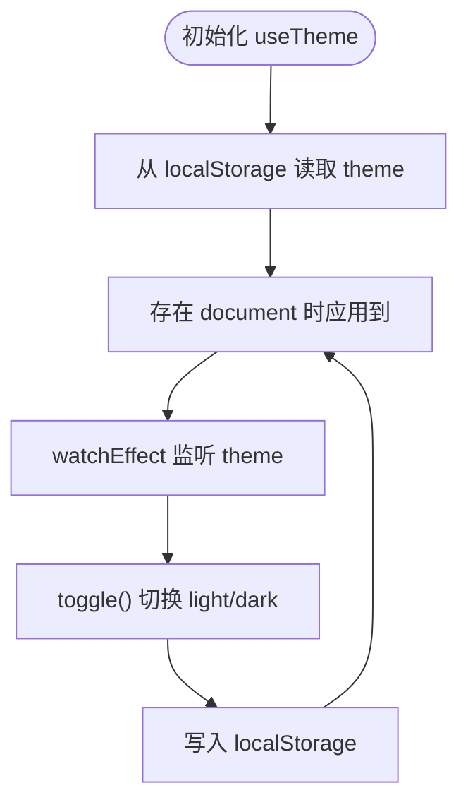
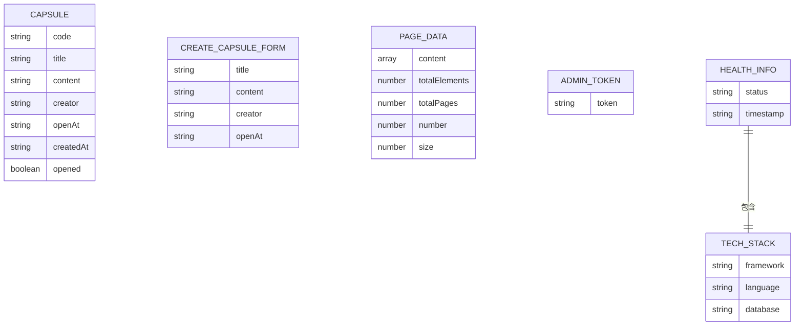
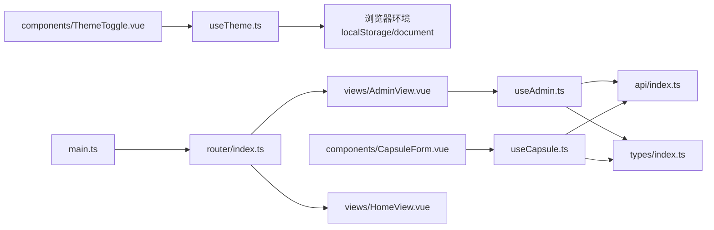

# 状态管理与数据流

<cite>
**本文引用的文件**
- [useAdmin.ts](file://frontends/vue3-ts/src/composables/useAdmin.ts)
- [useCapsule.ts](file://frontends/vue3-ts/src/composables/useCapsule.ts)
- [useTheme.ts](file://frontends/vue3-ts/src/composables/useTheme.ts)
- [index.ts（类型定义）](file://frontends/vue3-ts/src/types/index.ts)
- [index.ts（API 客户端）](file://frontends/vue3-ts/src/api/index.ts)
- [main.ts](file://frontends/vue3-ts/src/main.ts)
- [AdminView.vue](file://frontends/vue3-ts/src/views/AdminView.vue)
- [HomeView.vue](file://frontends/vue3-ts/src/views/HomeView.vue)
- [CapsuleForm.vue](file://frontends/vue3-ts/src/components/CapsuleForm.vue)
- [AppHeader.vue](file://frontends/vue3-ts/src/components/AppHeader.vue)
- [ThemeToggle.vue](file://frontends/vue3-ts/src/components/ThemeToggle.vue)
- [index.ts（路由）](file://frontends/vue3-ts/src/router/index.ts)
- [package.json](file://frontends/vue3-ts/package.json)
- [useCapsule.test.ts](file://frontends/vue3-ts/src/__tests__/composables/useCapsule.test.ts)
- [useTheme.test.ts](file://frontends/vue3-ts/src/__tests__/composables/useTheme.test.ts)
</cite>

## 目录
1. [简介](#简介)
2. [项目结构](#项目结构)
3. [核心组件](#核心组件)
4. [架构总览](#架构总览)
5. [详细组件分析](#详细组件分析)
6. [依赖分析](#依赖分析)
7. [性能考虑](#性能考虑)
8. [故障排查指南](#故障排查指南)
9. [结论](#结论)
10. [附录](#附录)

## 简介
本文件系统性梳理 Vue 3 前端在本仓库中的状态管理模式与数据流设计，重点覆盖以下方面：
- 响应式数据、计算属性、侦听器的使用
- 应用状态的组织：用户状态（管理员）、胶囊状态、主题状态
- 数据流设计原则：单向数据流、状态提升、局部状态 vs 全局状态的权衡
- 组合式函数中异步状态管理：加载、错误、成功三态
- 类型安全：TypeScript 接口定义、类型推断、编译时检查
- 状态持久化：localStorage、sessionStorage 的使用
- 最佳实践与性能优化建议

## 项目结构
Vue 3 前端采用“组合式函数 + 组件”的分层组织方式：
- 组合式函数（Composables）：封装跨组件复用的业务逻辑与状态，如 useAdmin、useCapsule、useTheme
- 视图组件（Views）：页面级组件，负责渲染与事件调度
- 基础组件（Components）：可复用 UI 组件，如表单、按钮、主题切换
- 类型定义（Types）：统一的数据模型与 API 响应结构
- API 客户端：封装网络请求与统一错误处理
- 路由与入口：路由配置与应用挂载

图表来源
- [main.ts:1-23](file://frontends/vue3-ts/src/main.ts#L1-L23)
- [index.ts（路由）:1-44](file://frontends/vue3-ts/src/router/index.ts#L1-L44)
- [AdminView.vue:1-89](file://frontends/vue3-ts/src/views/AdminView.vue#L1-L89)
- [HomeView.vue:1-65](file://frontends/vue3-ts/src/views/HomeView.vue#L1-L65)
- [AppHeader.vue:1-75](file://frontends/vue3-ts/src/components/AppHeader.vue#L1-L75)
- [ThemeToggle.vue:1-34](file://frontends/vue3-ts/src/components/ThemeToggle.vue#L1-L34)
- [CapsuleForm.vue:1-165](file://frontends/vue3-ts/src/components/CapsuleForm.vue#L1-L165)
- [useAdmin.ts:1-132](file://frontends/vue3-ts/src/composables/useAdmin.ts#L1-L132)
- [useCapsule.ts:1-65](file://frontends/vue3-ts/src/composables/useCapsule.ts#L1-L65)
- [useTheme.ts:1-57](file://frontends/vue3-ts/src/composables/useTheme.ts#L1-L57)
- [index.ts（类型定义）:1-80](file://frontends/vue3-ts/src/types/index.ts#L1-L80)
- [index.ts（API 客户端）:1-120](file://frontends/vue3-ts/src/api/index.ts#L1-L120)

章节来源
- [main.ts:1-23](file://frontends/vue3-ts/src/main.ts#L1-L23)
- [index.ts（路由）:1-44](file://frontends/vue3-ts/src/router/index.ts#L1-L44)

## 核心组件
本项目通过三个核心组合式函数实现三大状态域：
- 用户状态（管理员）：useAdmin，负责登录、登出、分页查询、删除胶囊、Token 持久化
- 胶囊状态：useCapsule，负责创建、查询胶囊、加载与错误状态
- 主题状态：useTheme，负责亮/暗主题切换与持久化

章节来源
- [useAdmin.ts:1-132](file://frontends/vue3-ts/src/composables/useAdmin.ts#L1-L132)
- [useCapsule.ts:1-65](file://frontends/vue3-ts/src/composables/useCapsule.ts#L1-L65)
- [useTheme.ts:1-57](file://frontends/vue3-ts/src/composables/useTheme.ts#L1-L57)

## 架构总览
Vue 3 状态管理遵循“组合式函数 + 单向数据流”：
- 组合式函数内部维护响应式状态（ref、computed、watchEffect），对外暴露只读计算属性与方法
- 组件通过 props 与 emits 接收状态与回调，实现自上而下的数据流与自下而上的事件回传
- API 客户端统一处理请求与错误，组合式函数负责状态三态（加载/错误/成功）与副作用
- 类型系统确保前后端数据结构一致，减少运行时风险

图表来源
- [useAdmin.ts:43-96](file://frontends/vue3-ts/src/composables/useAdmin.ts#L43-L96)
- [useCapsule.ts:24-60](file://frontends/vue3-ts/src/composables/useCapsule.ts#L24-L60)
- [index.ts（API 客户端）:19-37](file://frontends/vue3-ts/src/api/index.ts#L19-L37)
- [useTheme.ts:20-38](file://frontends/vue3-ts/src/composables/useTheme.ts#L20-L38)

## 详细组件分析

### 管理员状态管理（useAdmin）
- 响应式状态
  - token：管理员身份标识，初始化自 sessionStorage，支持登录后写入
  - capsules/pageInfo：分页列表数据与分页元信息
  - loading/error：异步操作的三态
- 计算属性
  - isLoggedIn：基于 token 的登录态判断
- 异步流程
  - login：调用 API 登录，成功后写入 sessionStorage；失败捕获并抛出
  - fetchCapsules：分页查询，失败时若检测到认证错误则自动登出
  - deleteCapsule：删除后刷新当前页
- 持久化
  - 登录态使用 sessionStorage，会话结束自动失效
  - 通过 computed 与 watchEffect 实现与 DOM 的联动

图表来源
- [useAdmin.ts:14-56](file://frontends/vue3-ts/src/composables/useAdmin.ts#L14-L56)

章节来源
- [useAdmin.ts:1-132](file://frontends/vue3-ts/src/composables/useAdmin.ts#L1-L132)

### 胶囊状态管理（useCapsule）
- 响应式状态
  - capsule：当前胶囊数据（可能为空）
  - loading/error：异步操作三态
- 异步流程
  - create：提交表单，成功后更新 capsule
  - get：按 code 查询，成功后更新 capsule
- 与组件协作
  - CapsuleForm 通过 emits 将表单数据传递给父组件，父组件再调用 useCapsule.create
  - 视图组件根据 loading 与 error 控制 UI 与提示

图表来源
- [CapsuleForm.vue:124-128](file://frontends/vue3-ts/src/components/CapsuleForm.vue#L124-L128)
- [useCapsule.ts:24-37](file://frontends/vue3-ts/src/composables/useCapsule.ts#L24-L37)
- [index.ts（API 客户端）:46-54](file://frontends/vue3-ts/src/api/index.ts#L46-L54)

章节来源
- [useCapsule.ts:1-65](file://frontends/vue3-ts/src/composables/useCapsule.ts#L1-L65)
- [CapsuleForm.vue:1-165](file://frontends/vue3-ts/src/components/CapsuleForm.vue#L1-L165)

### 主题状态管理（useTheme）
- 响应式状态
  - theme：'light' | 'dark'，初始化自 localStorage
- 侦听与副作用
  - watchEffect：监听 theme 变化并应用到 <html> 的 data-theme 属性
  - 初始化阶段在存在 document 时应用默认主题
- 持久化
  - 切换主题后同步写入 localStorage，实现跨会话持久化

图表来源
- [useTheme.ts:13-38](file://frontends/vue3-ts/src/composables/useTheme.ts#L13-L38)

章节来源
- [useTheme.ts:1-57](file://frontends/vue3-ts/src/composables/useTheme.ts#L1-L57)
- [ThemeToggle.vue:1-34](file://frontends/vue3-ts/src/components/ThemeToggle.vue#L1-L34)

### 类型安全与数据模型
- 统一响应结构：ApiResponse<T>，包含 success、data、message、errorCode
- 数据模型：Capsule、CreateCapsuleForm、PageData<T>、AdminToken、HealthInfo
- API 客户端：request 函数统一处理 Content-Type、JSON 解析与错误抛出
- 作用：通过 TypeScript 在编译期约束数据结构，避免运行时字段缺失或类型不匹配

图表来源
- [index.ts（类型定义）:10-79](file://frontends/vue3-ts/src/types/index.ts#L10-L79)
- [index.ts（API 客户端）:19-37](file://frontends/vue3-ts/src/api/index.ts#L19-L37)

章节来源
- [index.ts（类型定义）:1-80](file://frontends/vue3-ts/src/types/index.ts#L1-L80)
- [index.ts（API 客户端）:1-120](file://frontends/vue3-ts/src/api/index.ts#L1-L120)

### 数据流设计原则
- 单向数据流：组合式函数内部维护状态，组件通过 props 与 emits 与之交互
- 状态提升：登录态与主题偏好在根组件附近（AppHeader/ThemeToggle）消费，形成跨页面共享
- 局部状态 vs 全局状态：仅在多处共享且需要跨组件通信的状态才放入组合式函数；否则保留在组件内部
- 异步状态三态：loading/error/capsule（或 token）明确区分不同 UI 状态

章节来源
- [AdminView.vue:49-87](file://frontends/vue3-ts/src/views/AdminView.vue#L49-L87)
- [AppHeader.vue:1-75](file://frontends/vue3-ts/src/components/AppHeader.vue#L1-L75)
- [ThemeToggle.vue:1-34](file://frontends/vue3-ts/src/components/ThemeToggle.vue#L1-L34)

### 组合式函数中的异步状态管理
- 典型模式：进入时 loading=true，finally 中统一 loading=false；错误时设置 error 并抛出
- 成功时更新响应式状态（如 capsule、token、pageInfo）
- 与 UI 的配合：组件监听 loading 与 error，渲染加载指示与错误提示

章节来源
- [useAdmin.ts:43-96](file://frontends/vue3-ts/src/composables/useAdmin.ts#L43-L96)
- [useCapsule.ts:24-60](file://frontends/vue3-ts/src/composables/useCapsule.ts#L24-L60)

### 类型安全与编译时检查
- 通过接口定义数据模型，API 客户端统一返回 ApiResponse<T>
- 组件与组合式函数之间以强类型参数传递，减少运行时错误
- 测试中使用 mock API，验证状态流转与错误处理

章节来源
- [index.ts（类型定义）:1-80](file://frontends/vue3-ts/src/types/index.ts#L1-L80)
- [index.ts（API 客户端）:19-37](file://frontends/vue3-ts/src/api/index.ts#L19-L37)
- [useCapsule.test.ts:1-68](file://frontends/vue3-ts/src/__tests__/composables/useCapsule.test.ts#L1-L68)
- [useTheme.test.ts:1-23](file://frontends/vue3-ts/src/__tests__/composables/useTheme.test.ts#L1-L23)

### 状态持久化方案
- 管理员 Token：sessionStorage，会话结束后自动清除，避免长期占用
- 主题偏好：localStorage，跨会话持久化，初始化时读取
- 与 DOM 的联动：通过 watchEffect 将主题应用到 <html> 的 data-theme 属性，驱动 CSS 变量切换

章节来源
- [useAdmin.ts:14-16](file://frontends/vue3-ts/src/composables/useAdmin.ts#L14-L16)
- [useTheme.ts:13-23](file://frontends/vue3-ts/src/composables/useTheme.ts#L13-L23)
- [useTheme.ts:34-38](file://frontends/vue3-ts/src/composables/useTheme.ts#L34-L38)

## 依赖分析
- 组合式函数依赖关系
  - useAdmin 依赖 API 客户端与类型定义
  - useCapsule 依赖 API 客户端与类型定义
  - useTheme 依赖浏览器环境（localStorage、document）
- 组件依赖关系
  - AdminView 依赖 useAdmin
  - CapsuleForm 依赖 useCapsule（通过父组件协调）
  - ThemeToggle 依赖 useTheme
- 路由与入口
  - main.ts 注册路由并挂载应用
  - router/index.ts 定义页面级视图组件

图表来源
- [useAdmin.ts:1-132](file://frontends/vue3-ts/src/composables/useAdmin.ts#L1-L132)
- [useCapsule.ts:1-65](file://frontends/vue3-ts/src/composables/useCapsule.ts#L1-L65)
- [useTheme.ts:1-57](file://frontends/vue3-ts/src/composables/useTheme.ts#L1-L57)
- [index.ts（API 客户端）:1-120](file://frontends/vue3-ts/src/api/index.ts#L1-L120)
- [index.ts（类型定义）:1-80](file://frontends/vue3-ts/src/types/index.ts#L1-L80)
- [AdminView.vue:1-89](file://frontends/vue3-ts/src/views/AdminView.vue#L1-L89)
- [CapsuleForm.vue:1-165](file://frontends/vue3-ts/src/components/CapsuleForm.vue#L1-L165)
- [ThemeToggle.vue:1-34](file://frontends/vue3-ts/src/components/ThemeToggle.vue#L1-L34)
- [main.ts:1-23](file://frontends/vue3-ts/src/main.ts#L1-L23)
- [index.ts（路由）:1-44](file://frontends/vue3-ts/src/router/index.ts#L1-L44)

章节来源
- [package.json:1-30](file://frontends/vue3-ts/package.json#L1-L30)

## 性能考虑
- 组合式函数内统一处理 loading/error，避免重复逻辑与闪烁
- 通过 computed 生成最小渲染集（如 isLoggedIn），减少不必要的重渲染
- API 客户端集中处理错误，避免在多个组件中分散处理导致的重复代码
- 主题切换使用 watchEffect，仅在 theme 变化时更新 DOM 属性，降低开销
- 路由懒加载：页面组件按需加载，减小首屏体积

## 故障排查指南
- 登录失败
  - 现象：error 显示错误信息，loading 结束
  - 排查：检查 API 返回 message，确认密码正确与网络连通
- Token 过期
  - 现象：查询/删除接口报认证错误，自动执行 logout
  - 排查：确认 sessionStorage 中 token 是否存在，后端 JWT 是否有效
- 创建/查询失败
  - 现象：error 显示具体错误，loading 结束
  - 排查：检查表单校验、网络状态与后端响应结构
- 主题不生效
  - 现象：切换主题后 UI 无变化
  - 排查：确认 <html> 上 data-theme 是否更新，localStorage 中主题键是否存在

章节来源
- [useAdmin.ts:88-92](file://frontends/vue3-ts/src/composables/useAdmin.ts#L88-L92)
- [useCapsule.ts:31-33](file://frontends/vue3-ts/src/composables/useCapsule.ts#L31-L33)
- [useTheme.ts:20-23](file://frontends/vue3-ts/src/composables/useTheme.ts#L20-L23)

## 结论
本项目在 Vue 3 中实现了清晰的状态管理与数据流：
- 通过组合式函数封装跨组件状态与业务逻辑，实现高内聚低耦合
- 采用单向数据流与类型安全，结合统一 API 客户端，提升可维护性
- 使用 sessionStorage 与 localStorage 实现会话级与持久化状态管理
- 通过计算属性与侦听器优化渲染与副作用，兼顾性能与体验

## 附录
- 相关文件清单
  - 组合式函数：useAdmin.ts、useCapsule.ts、useTheme.ts
  - 类型定义：types/index.ts
  - API 客户端：api/index.ts
  - 视图与组件：AdminView.vue、HomeView.vue、CapsuleForm.vue、AppHeader.vue、ThemeToggle.vue
  - 路由与入口：router/index.ts、main.ts
  - 测试：__tests__/composables/useCapsule.test.ts、__tests__/composables/useTheme.test.ts
  - 依赖：package.json