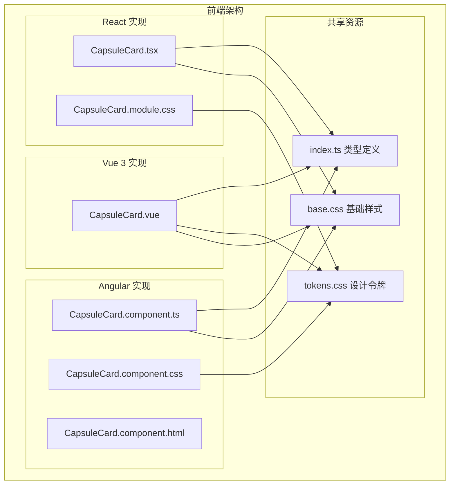
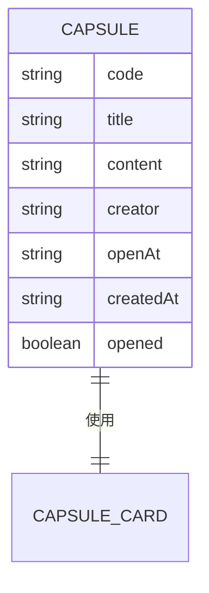
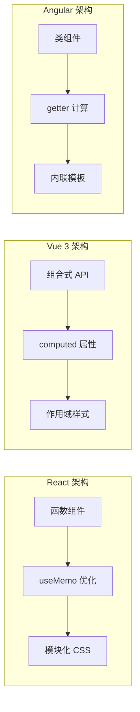
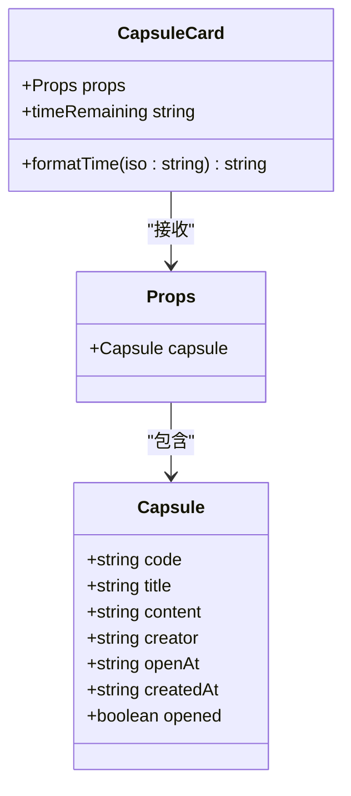
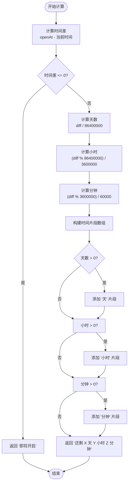
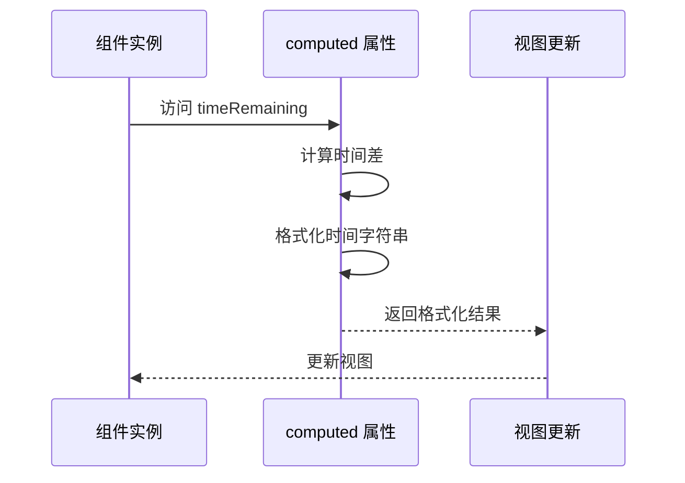
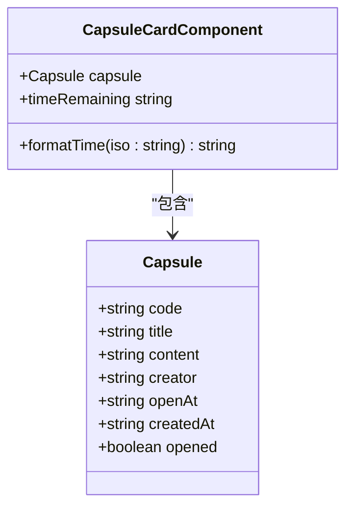
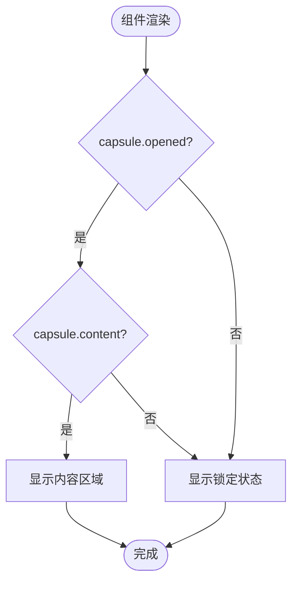
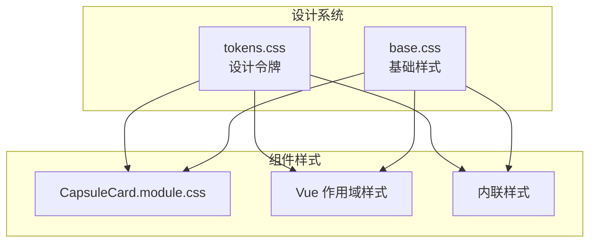
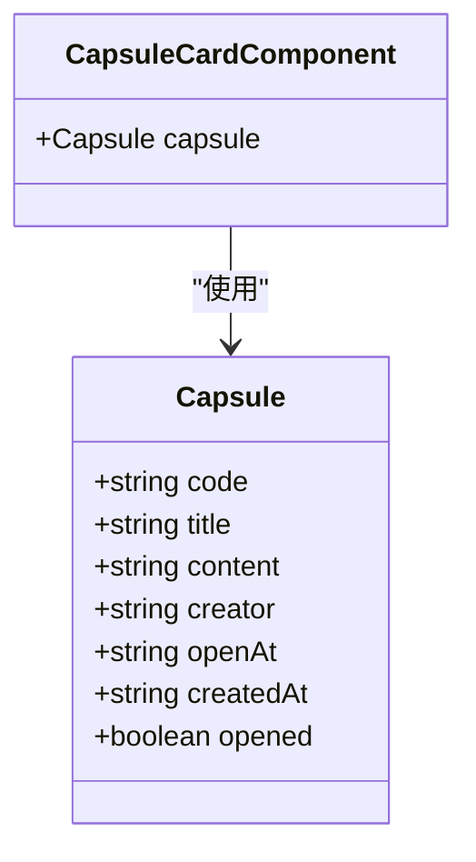

# CapsuleCard 胶囊卡片组件

<cite>
**本文档引用的文件**
- [CapsuleCard.tsx](file://frontends/react-ts/src/components/CapsuleCard.tsx)
- [CapsuleCard.module.css](file://frontends/react-ts/src/components/CapsuleCard.module.css)
- [CapsuleCard.vue](file://frontends/vue3-ts/src/components/CapsuleCard.vue)
- [CapsuleCard.component.ts](file://frontends/angular-ts/src/app/components/capsule-card/capsule-card.component.ts)
- [CapsuleCard.component.html](file://frontends/angular-ts/src/app/components/capsule-card/capsule-card.component.html)
- [CapsuleCard.component.css](file://frontends/angular-ts/src/app/components/capsule-card/capsule-card.component.css)
- [index.ts](file://frontends/react-ts/src/types/index.ts)
- [tokens.css](file://spec/styles/tokens.css)
- [base.css](file://spec/styles/base.css)
- [capsule-card.component.spec.ts](file://frontends/angular-ts/src/__tests__/components/capsule-card.component.spec.ts)
- [CapsuleCard.test.ts](file://frontends/vue3-ts/src/__tests__/components/CapsuleCard.test.ts)
</cite>

## 目录
1. [简介](#简介)
2. [项目结构](#项目结构)
3. [核心组件](#核心组件)
4. [架构概览](#架构概览)
5. [详细组件分析](#详细组件分析)
6. [依赖关系分析](#依赖关系分析)
7. [性能考虑](#性能考虑)
8. [故障排除指南](#故障排除指南)
9. [结论](#结论)
10. [附录](#附录)

## 简介

CapsuleCard 是 HelloTime 项目中的核心展示组件，用于呈现时间胶囊的信息和状态。该组件在三个前端框架中都有实现：React、Vue 3 和 Angular，确保了跨平台的一致性体验。

该组件的主要功能包括：
- 展示胶囊的基本信息（标题、创建者、胶囊码）
- 显示胶囊的状态（已开启/未到时间）
- 计算并显示剩余开启时间
- 条件渲染内容展示和锁定状态
- 提供美观的视觉反馈和响应式布局

## 项目结构

HelloTime 项目采用多框架架构，CapsuleCard 组件在不同框架中有相应的实现：



**图表来源**
- [CapsuleCard.tsx:1-66](file://frontends/react-ts/src/components/CapsuleCard.tsx#L1-L66)
- [CapsuleCard.vue:1-98](file://frontends/vue3-ts/src/components/CapsuleCard.vue#L1-L98)
- [CapsuleCard.component.ts:1-37](file://frontends/angular-ts/src/app/components/capsule-card/capsule-card.component.ts#L1-L37)

**章节来源**
- [CapsuleCard.tsx:1-66](file://frontends/react-ts/src/components/CapsuleCard.tsx#L1-L66)
- [CapsuleCard.vue:1-98](file://frontends/vue3-ts/src/components/CapsuleCard.vue#L1-L98)
- [CapsuleCard.component.ts:1-37](file://frontends/angular-ts/src/app/components/capsule-card/capsule-card.component.ts#L1-L37)

## 核心组件

### Capsule 类型定义

CapsuleCard 组件的核心数据结构是 Capsule 接口，定义如下：



**图表来源**
- [index.ts:10-18](file://frontends/react-ts/src/types/index.ts#L10-L18)

### 组件 Props 接口

每个框架的 CapsuleCard 组件都遵循相同的 Props 接口设计：

| 属性名 | 类型 | 必需 | 描述 |
|--------|------|------|------|
| capsule | Capsule | 是 | 胶囊数据对象，包含所有胶囊相关信息 |

**章节来源**
- [index.ts:10-18](file://frontends/react-ts/src/types/index.ts#L10-L18)
- [CapsuleCard.tsx:5-7](file://frontends/react-ts/src/components/CapsuleCard.tsx#L5-L7)
- [CapsuleCard.vue:36-38](file://frontends/vue3-ts/src/components/CapsuleCard.vue#L36-L38)
- [CapsuleCard.component.ts:12](file://frontends/angular-ts/src/app/components/capsule-card/capsule-card.component.ts#L12)

## 架构概览

### 组件架构模式

三个框架实现了相似的组件架构模式，但采用了各自框架的最佳实践：



**图表来源**
- [CapsuleCard.tsx:19-31](file://frontends/react-ts/src/components/CapsuleCard.tsx#L19-L31)
- [CapsuleCard.vue:50-61](file://frontends/vue3-ts/src/components/CapsuleCard.vue#L50-L61)
- [CapsuleCard.component.ts:24-35](file://frontends/angular-ts/src/app/components/capsule-card/capsule-card.component.ts#L24-L35)

## 详细组件分析

### React 实现分析

#### 组件结构
React 版本使用函数组件配合 useMemo 进行性能优化：



**图表来源**
- [CapsuleCard.tsx:19-31](file://frontends/react-ts/src/components/CapsuleCard.tsx#L19-L31)
- [index.ts:10-18](file://frontends/react-ts/src/types/index.ts#L10-L18)

#### 时间计算逻辑
React 实现使用 useMemo 进行缓存优化：



**图表来源**
- [CapsuleCard.tsx:20-31](file://frontends/react-ts/src/components/CapsuleCard.tsx#L20-L31)

**章节来源**
- [CapsuleCard.tsx:19-66](file://frontends/react-ts/src/components/CapsuleCard.tsx#L19-L66)

### Vue 3 实现分析

#### 组合式 API 使用
Vue 3 版本采用组合式 API 的现代开发方式：



**图表来源**
- [CapsuleCard.vue:50-61](file://frontends/vue3-ts/src/components/CapsuleCard.vue#L50-L61)

**章节来源**
- [CapsuleCard.vue:1-98](file://frontends/vue3-ts/src/components/CapsuleCard.vue#L1-L98)

### Angular 实现分析

#### 类组件模式
Angular 版本使用传统的类组件模式：



**图表来源**
- [CapsuleCard.component.ts:11-36](file://frontends/angular-ts/src/app/components/capsule-card/capsule-card.component.ts#L11-L36)

**章节来源**
- [CapsuleCard.component.ts:1-37](file://frontends/angular-ts/src/app/components/capsule-card/capsule-card.component.ts#L1-L37)

### 条件渲染机制

组件实现了智能的条件渲染逻辑，根据胶囊状态动态显示内容：



**图表来源**
- [CapsuleCard.tsx:52-62](file://frontends/react-ts/src/components/CapsuleCard.tsx#L52-L62)
- [CapsuleCard.vue:20-28](file://frontends/vue3-ts/src/components/CapsuleCard.vue#L20-L28)
- [CapsuleCard.component.html:19-30](file://frontends/angular-ts/src/app/components/capsule-card/capsule-card.component.html#19-L30)

**章节来源**
- [CapsuleCard.tsx:52-62](file://frontends/react-ts/src/components/CapsuleCard.tsx#L52-L62)
- [CapsuleCard.vue:20-28](file://frontends/vue3-ts/src/components/CapsuleCard.vue#L20-L28)
- [CapsuleCard.component.html:19-30](file://frontends/angular-ts/src/app/components/capsule-card/capsule-card.component.html#L19-L30)

## 依赖关系分析

### 样式系统依赖

组件样式系统基于 CSS 变量和设计令牌：



**图表来源**
- [tokens.css:1-104](file://spec/styles/tokens.css#L1-L104)
- [base.css:1-67](file://spec/styles/base.css#L1-L67)
- [CapsuleCard.module.css:1-33](file://frontends/react-ts/src/components/CapsuleCard.module.css#L1-L33)

### 类型系统依赖

所有实现都严格依赖共享的 TypeScript 类型定义：



**图表来源**
- [index.ts:10-18](file://frontends/react-ts/src/types/index.ts#L10-L18)

**章节来源**
- [index.ts:10-18](file://frontends/react-ts/src/types/index.ts#L10-L18)
- [CapsuleCard.module.css:1-33](file://frontends/react-ts/src/components/CapsuleCard.module.css#L1-L33)
- [tokens.css:1-104](file://spec/styles/tokens.css#L1-L104)

## 性能考虑

### React 优化策略

React 实现使用 useMemo 进行计算属性缓存：

- **memoization**: 使用 useMemo 避免重复的时间计算
- **依赖数组**: 仅在 openAt 改变时重新计算
- **函数组件**: 无状态组件减少内存开销

### Vue 3 优化策略

Vue 3 实现使用 computed 属性进行响应式缓存：

- **响应式缓存**: computed 自动追踪依赖变化
- **懒执行**: 仅在访问时计算
- **自动失效**: 依赖变化时自动重新计算

### Angular 优化策略

Angular 实现使用 getter 进行计算：

- **简单缓存**: getter 在同一帧内缓存结果
- **依赖追踪**: Angular 变更检测系统管理更新时机

## 故障排除指南

### 常见问题诊断

#### 时间显示异常
- **症状**: 时间显示不正确或显示负值
- **原因**: openAt 格式不正确或时区设置问题
- **解决方案**: 确保 openAt 使用 ISO 8601 格式

#### 内容不显示
- **症状**: 已开启的胶囊不显示内容
- **原因**: capsule.content 为空或未正确设置 opened 状态
- **解决方案**: 检查后端数据和 opened 状态同步

#### 样式问题
- **症状**: 组件样式错乱或不显示
- **原因**: CSS 变量未正确加载或样式类名错误
- **解决方案**: 确认 tokens.css 正常加载和类名匹配

**章节来源**
- [capsule-card.component.spec.ts:1-69](file://frontends/angular-ts/src/__tests__/components/capsule-card.component.spec.ts#L1-L69)
- [CapsuleCard.test.ts:1-41](file://frontends/vue3-ts/src/__tests__/components/CapsuleCard.test.ts#L1-L41)

## 结论

CapsuleCard 组件展现了现代前端开发的最佳实践，通过以下特点实现了高质量的用户体验：

1. **跨框架一致性**: 在 React、Vue 3 和 Angular 中提供相同的功能和外观
2. **性能优化**: 采用适当的缓存策略避免不必要的计算
3. **类型安全**: 完整的 TypeScript 类型定义确保开发时的类型安全
4. **样式系统**: 基于设计令牌的样式系统支持主题切换和响应式设计
5. **测试覆盖**: 完善的单元测试确保组件行为的可靠性

该组件为 HelloTime 项目提供了坚实的基础，展示了如何在多框架环境中维护一致的用户体验。

## 附录

### 组件使用示例

#### React 使用方式
```typescript
// 基本用法
<CapsuleCard capsule={capsuleData} />

// 在列表中使用
{capsules.map(capsule => (
  <CapsuleCard key={capsule.code} capsule={capsule} />
))}
```

#### Vue 3 使用方式
```vue
<!-- 基本用法 -->
<CapsuleCard :capsule="capsuleData" />

<!-- 在列表中使用 -->
<template>
  <CapsuleCard 
    v-for="capsule in capsules" 
    :key="capsule.code" 
    :capsule="capsule" 
  />
</template>
```

#### Angular 使用方式
```html
<!-- 基本用法 -->
<app-capsule-card [capsule]="capsuleData"></app-capsule-card>

<!-- 在列表中使用 -->
<app-capsule-card 
  *ngFor="let capsule of capsules" 
  [capsule]="capsule" 
  [key]="capsule.code">
</app-capsule-card>
```

### 最佳实践建议

1. **数据验证**: 在传递给组件之前验证 Capsule 数据的完整性
2. **错误处理**: 为网络请求失败的情况提供降级方案
3. **性能监控**: 监控组件的渲染性能，必要时添加更多的缓存层
4. **可访问性**: 确保组件对屏幕阅读器友好
5. **国际化**: 考虑支持多语言的时间格式化