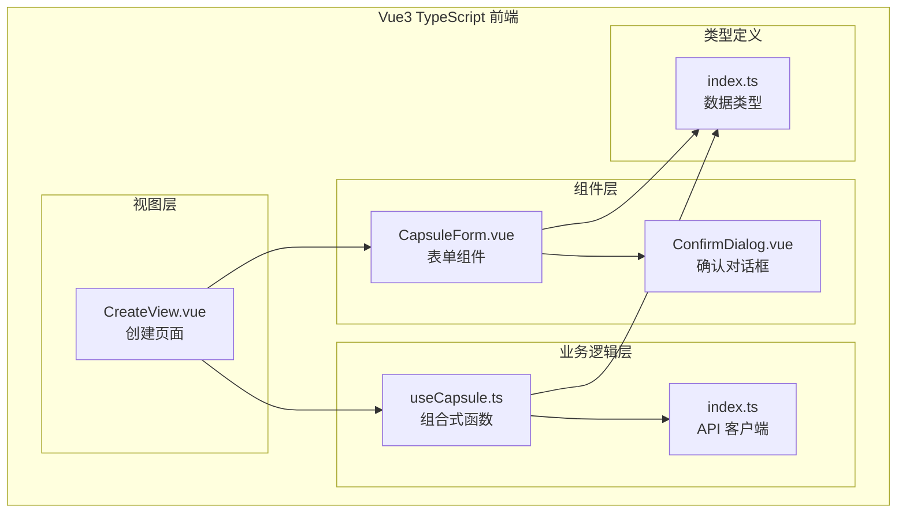
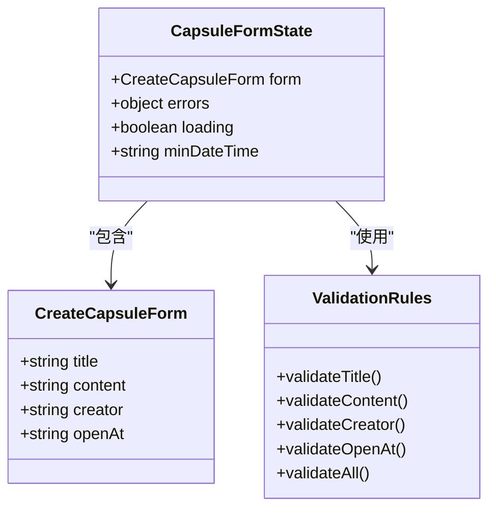
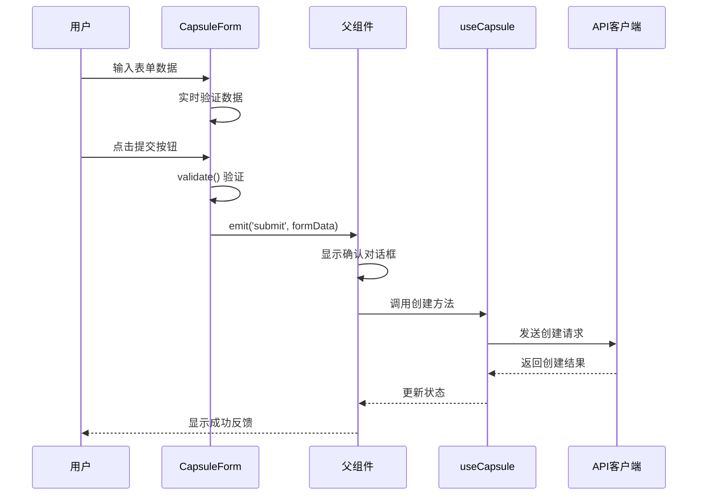
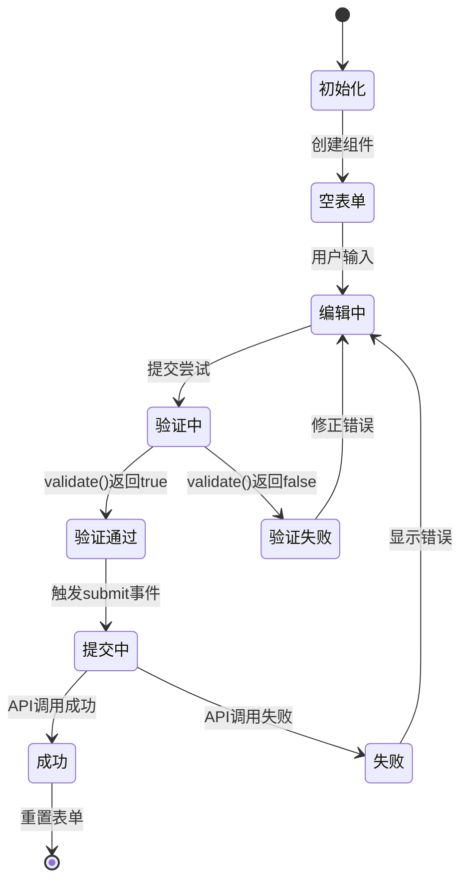
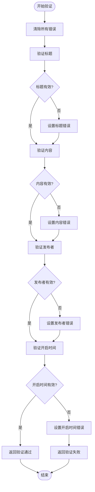
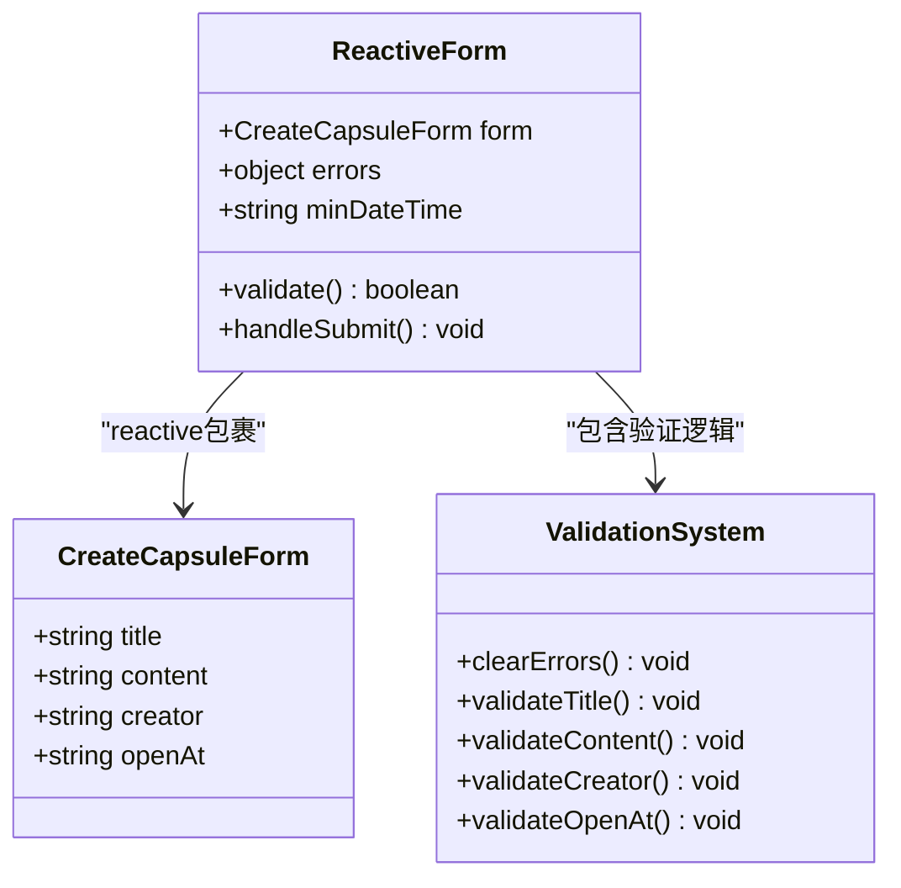

# CapsuleForm 胶囊表单组件

<cite>
**本文档引用的文件**
- [CapsuleForm.vue](file://frontends/vue3-ts/src/components/CapsuleForm.vue)
- [index.ts](file://frontends/vue3-ts/src/types/index.ts)
- [CreateView.vue](file://frontends/vue3-ts/src/views/CreateView.vue)
- [useCapsule.ts](file://frontends/vue3-ts/src/composables/useCapsule.ts)
- [index.ts](file://frontends/vue3-ts/src/api/index.ts)
- [ConfirmDialog.vue](file://frontends/vue3-ts/src/components/ConfirmDialog.vue)
- [CapsuleForm.test.ts](file://frontends/vue3-ts/src/__tests__/components/CapsuleForm.test.ts)
</cite>

## 目录
1. [简介](#简介)
2. [项目结构](#项目结构)
3. [核心组件](#核心组件)
4. [架构概览](#架构概览)
5. [详细组件分析](#详细组件分析)
6. [依赖关系分析](#依赖关系分析)
7. [性能考虑](#性能考虑)
8. [故障排除指南](#故障排除指南)
9. [结论](#结论)
10. [附录](#附录)

## 简介

CapsuleForm 是一个 Vue3 TypeScript 实现的响应式表单组件，专门用于创建时间胶囊。该组件提供了完整的表单验证、错误处理和用户交互功能，支持移动端自适应布局。组件采用组合式 API 设计，实现了清晰的父子组件通信模式。

## 项目结构

该组件位于 Vue3 TypeScript 前端项目的组件目录中，与类型定义、视图组件和 API 客户端紧密集成：



**图表来源**
- [CapsuleForm.vue:1-165](file://frontends/vue3-ts/src/components/CapsuleForm.vue#L1-L165)
- [CreateView.vue:1-106](file://frontends/vue3-ts/src/views/CreateView.vue#L1-L106)
- [useCapsule.ts:1-65](file://frontends/vue3-ts/src/composables/useCapsule.ts#L1-L65)
- [index.ts:1-120](file://frontends/vue3-ts/src/api/index.ts#L1-L120)

**章节来源**
- [CapsuleForm.vue:1-165](file://frontends/vue3-ts/src/components/CapsuleForm.vue#L1-L165)
- [index.ts:1-80](file://frontends/vue3-ts/src/types/index.ts#L1-L80)

## 核心组件

### 表单字段定义

CapsuleForm 组件包含四个核心表单字段，每个字段都有明确的验证规则和用户提示：

| 字段名 | 类型 | 验证规则 | 用户提示 |
|--------|------|----------|----------|
| title | string | 必填，最大100字符 | "给时间胶囊取个名字" |
| content | string | 必填 | "写下你想对未来说的话..." |
| creator | string | 必填，最大30字符 | "你的昵称" |
| openAt | string | 必填，未来时间 | datetime-local 输入 |

### 数据模型

组件使用 CreateCapsuleForm 类型定义确保数据结构的一致性和类型安全：



**图表来源**
- [index.ts:24-29](file://frontends/vue3-ts/src/types/index.ts#L24-L29)
- [CapsuleForm.vue:75-93](file://frontends/vue3-ts/src/components/CapsuleForm.vue#L75-L93)

**章节来源**
- [index.ts:24-29](file://frontends/vue3-ts/src/types/index.ts#L24-L29)
- [CapsuleForm.vue:75-93](file://frontends/vue3-ts/src/components/CapsuleForm.vue#L75-L93)

## 架构概览

### 组件通信架构

CapsuleForm 采用事件驱动的通信模式，通过自定义事件与父组件进行数据交换：



**图表来源**
- [CapsuleForm.vue:124-128](file://frontends/vue3-ts/src/components/CapsuleForm.vue#L124-L128)
- [CreateView.vue:48-62](file://frontends/vue3-ts/src/views/CreateView.vue#L48-L62)
- [useCapsule.ts:24-37](file://frontends/vue3-ts/src/composables/useCapsule.ts#L24-L37)

### 状态管理模式

组件采用响应式状态管理，结合本地状态和全局状态：



**图表来源**
- [CapsuleForm.vue:95-122](file://frontends/vue3-ts/src/components/CapsuleForm.vue#L95-L122)
- [useCapsule.ts:24-37](file://frontends/vue3-ts/src/composables/useCapsule.ts#L24-L37)

**章节来源**
- [CapsuleForm.vue:63-128](file://frontends/vue3-ts/src/components/CapsuleForm.vue#L63-L128)
- [CreateView.vue:36-68](file://frontends/vue3-ts/src/views/CreateView.vue#L36-L68)

## 详细组件分析

### 表单验证机制

组件实现了完整的前端验证系统，包括实时验证和提交时验证：

#### 验证规则实现



**图表来源**
- [CapsuleForm.vue:95-122](file://frontends/vue3-ts/src/components/CapsuleForm.vue#L95-L122)

#### 错误处理策略

组件采用即时错误反馈机制，用户输入时即可获得验证结果：

- **视觉反馈**：错误字段添加 `input-error` 类，显示红色边框
- **文本提示**：下方显示对应的错误信息
- **禁用提交**：验证失败时提交按钮保持禁用状态

**章节来源**
- [CapsuleForm.vue:95-122](file://frontends/vue3-ts/src/components/CapsuleForm.vue#L95-L122)
- [CapsuleForm.vue:131-165](file://frontends/vue3-ts/src/components/CapsuleForm.vue#L131-L165)

### 响应式表单实现

#### v-model 绑定机制

组件使用 Vue3 的响应式系统实现双向数据绑定：



**图表来源**
- [CapsuleForm.vue:75-87](file://frontends/vue3-ts/src/components/CapsuleForm.vue#L75-L87)
- [CapsuleForm.vue:95-122](file://frontends/vue3-ts/src/components/CapsuleForm.vue#L95-L122)

#### 表单状态管理

组件内部维护三个关键状态：

1. **表单数据状态** (`form`)：存储用户输入的所有表单数据
2. **错误状态** (`errors`)：存储每个字段的验证错误信息
3. **计算状态** (`minDateTime`)：动态计算最小允许的日期时间值

**章节来源**
- [CapsuleForm.vue:75-93](file://frontends/vue3-ts/src/components/CapsuleForm.vue#L75-L93)

### 用户体验设计

#### 加载状态处理

组件支持加载状态指示，通过 `loading` 属性控制：

- **按钮禁用**：加载期间禁用提交按钮
- **文案更新**：显示 "创建中..." 文本
- **视觉反馈**：保持界面一致性

#### 成功反馈机制

父组件负责处理创建成功后的反馈：

- **成功卡片**：显示创建成功的提示信息
- **胶囊码展示**：显示唯一的胶囊识别码
- **操作引导**：提供复制和查看详情的操作按钮

#### 错误处理策略

组件采用渐进式错误处理：

1. **前端验证**：立即反馈格式错误
2. **后端验证**：处理业务逻辑错误
3. **统一错误显示**：通过父组件的状态管理显示错误信息

**章节来源**
- [CreateView.vue:9-68](file://frontends/vue3-ts/src/views/CreateView.vue#L9-L68)
- [useCapsule.ts:24-37](file://frontends/vue3-ts/src/composables/useCapsule.ts#L24-L37)

## 依赖关系分析

### 组件间依赖关系

```mermaid
graph TD
CF[CapsuleForm.vue) --> TYPES[index.ts<br/>CreateCapsuleForm]
CF --> CD[ConfirmDialog.vue]
CV[CreateView.vue] --> CF
CV --> UC[useCapsule.ts]
UC --> API[index.ts<br/>API客户端]
UC --> TYPES
CF --> TEST[CapsuleForm.test.ts]
CV --> TEST
```

**图表来源**
- [CapsuleForm.vue:65-73](file://frontends/vue3-ts/src/components/CapsuleForm.vue#L65-L73)
- [CreateView.vue:39-41](file://frontends/vue3-ts/src/views/CreateView.vue#L39-L41)
- [useCapsule.ts](file://frontends/vue3-ts/src/composables/useCapsule.ts#L8)

### 外部依赖

组件依赖以下外部资源：

- **Vue3 Composition API**：响应式系统和生命周期管理
- **TypeScript 类型系统**：编译时类型检查
- **CSS 变量系统**：主题和间距的一致性管理
- **浏览器原生 API**：日期时间处理和剪贴板操作

**章节来源**
- [CapsuleForm.vue:63-73](file://frontends/vue3-ts/src/components/CapsuleForm.vue#L63-L73)
- [index.ts:24-29](file://frontends/vue3-ts/src/types/index.ts#L24-L29)

## 性能考虑

### 渲染优化

1. **响应式更新**：仅在相关状态变化时重新渲染
2. **计算属性缓存**：`minDateTime` 使用 `computed` 进行缓存
3. **条件渲染**：错误信息按需显示，避免不必要的 DOM 元素

### 内存管理

1. **事件清理**：组件销毁时自动清理事件监听器
2. **状态释放**：组件卸载时释放响应式状态
3. **样式隔离**：使用 scoped CSS 避免样式泄漏

### 移动端优化

1. **弹性布局**：使用 Flexbox 实现自适应布局
2. **触摸友好的控件**：按钮和输入框具有合适的尺寸
3. **视口配置**：支持不同屏幕尺寸的适配

## 故障排除指南

### 常见问题及解决方案

#### 表单验证不工作

**症状**：输入任何内容都不会触发验证

**可能原因**：
- v-model 绑定错误
- 验证函数未正确调用
- 事件处理器配置问题

**解决方法**：
1. 检查 v-model 指令的绑定目标
2. 确认验证函数在适当的时机被调用
3. 验证事件处理器的参数传递

#### 错误信息不显示

**症状**：验证失败但没有错误提示

**可能原因**：
- 错误状态未正确更新
- 条件渲染逻辑错误
- CSS 样式覆盖问题

**解决方法**：
1. 检查错误状态的设置逻辑
2. 验证 v-if 指令的条件表达式
3. 确认 CSS 类的正确应用

#### 提交按钮无法点击

**症状**：提交按钮始终处于禁用状态

**可能原因**：
- 验证逻辑始终返回 false
- 状态更新时机问题
- 事件冒泡阻止

**解决方法**：
1. 检查验证规则的逻辑正确性
2. 确认状态更新的异步处理
3. 验证事件处理函数的执行

**章节来源**
- [CapsuleForm.test.ts:1-51](file://frontends/vue3-ts/src/__tests__/components/CapsuleForm.test.ts#L1-L51)
- [CapsuleForm.vue:95-128](file://frontends/vue3-ts/src/components/CapsuleForm.vue#L95-L128)

## 结论

CapsuleForm 胶囊表单组件是一个设计精良的 Vue3 TypeScript 组件，具有以下特点：

1. **类型安全**：完整的 TypeScript 类型定义确保数据结构的一致性
2. **响应式设计**：基于 Vue3 Composition API 实现高效的响应式状态管理
3. **用户友好**：提供即时的错误反馈和清晰的用户指导
4. **可维护性**：模块化的代码结构便于测试和维护
5. **可扩展性**：清晰的组件边界和事件机制支持功能扩展

该组件为时间胶囊创建功能提供了完整的技术解决方案，体现了现代前端开发的最佳实践。

## 附录

### 最佳实践建议

#### 可访问性支持
- 为所有表单控件提供语义化的标签
- 确保键盘导航的完整性
- 提供足够的对比度和可读性

#### 移动端适配
- 使用相对单位而非固定像素值
- 考虑触摸目标的最小尺寸要求
- 测试不同屏幕方向的表现

#### 性能优化策略
- 避免不必要的响应式依赖
- 使用计算属性缓存昂贵的计算
- 优化事件处理程序的性能

#### 测试策略
- 为每个验证规则编写单元测试
- 测试边界条件和异常情况
- 验证组件在不同环境下的表现