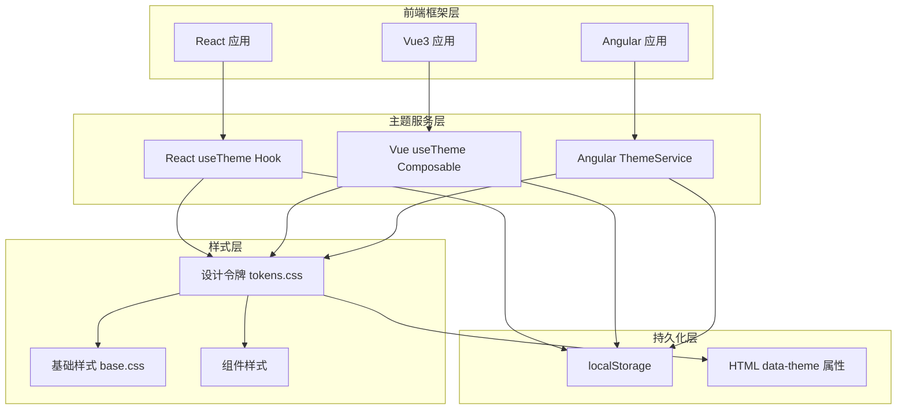
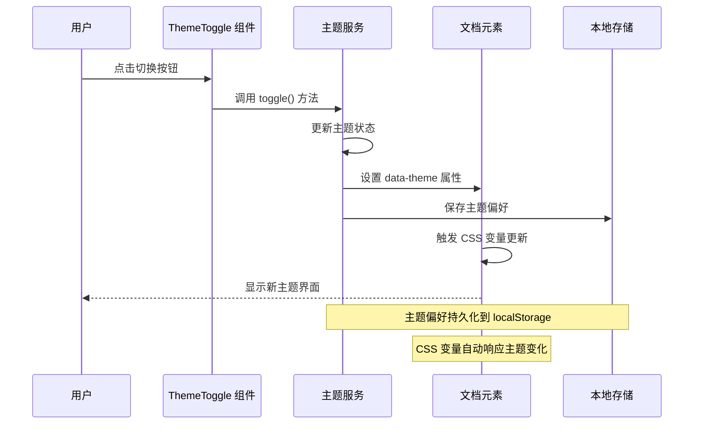
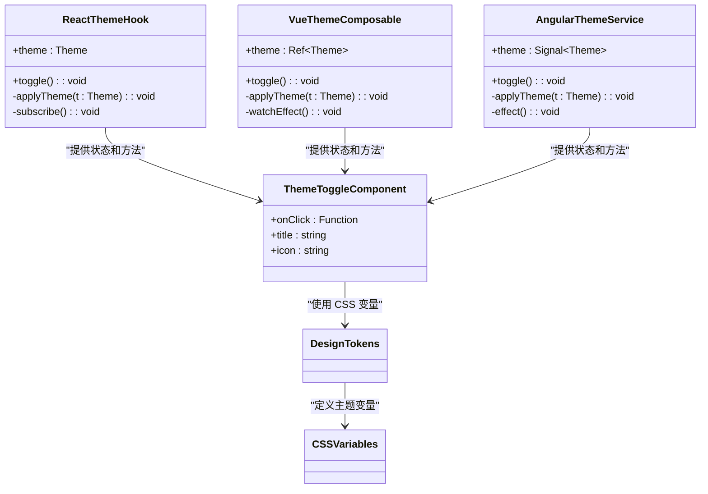
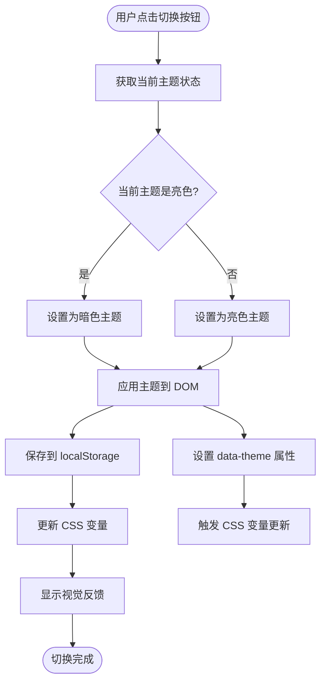
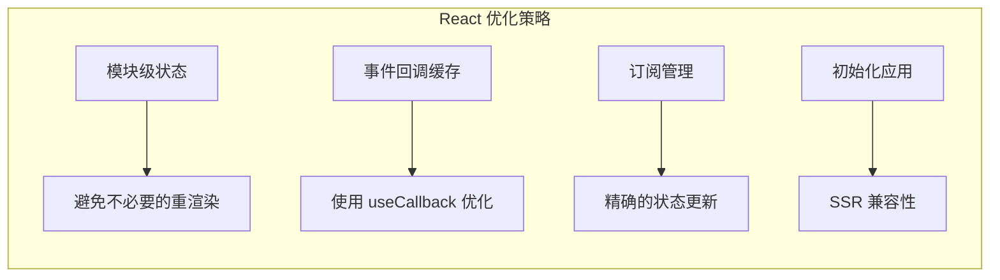
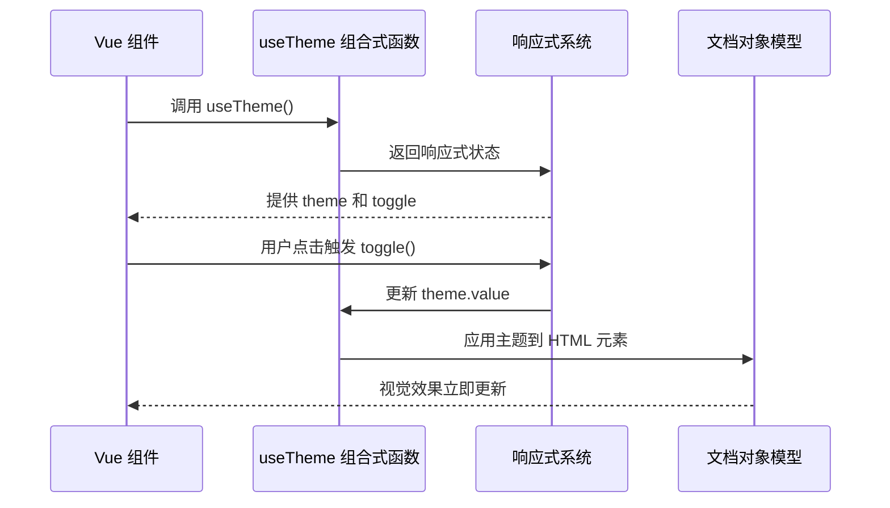
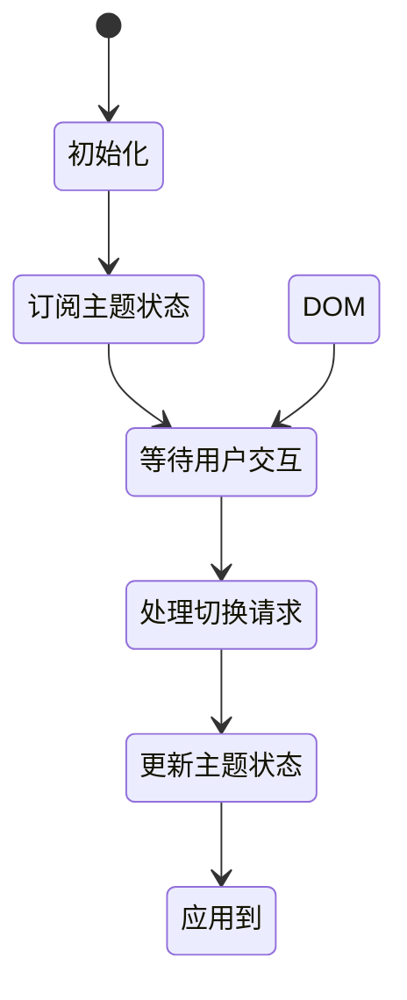
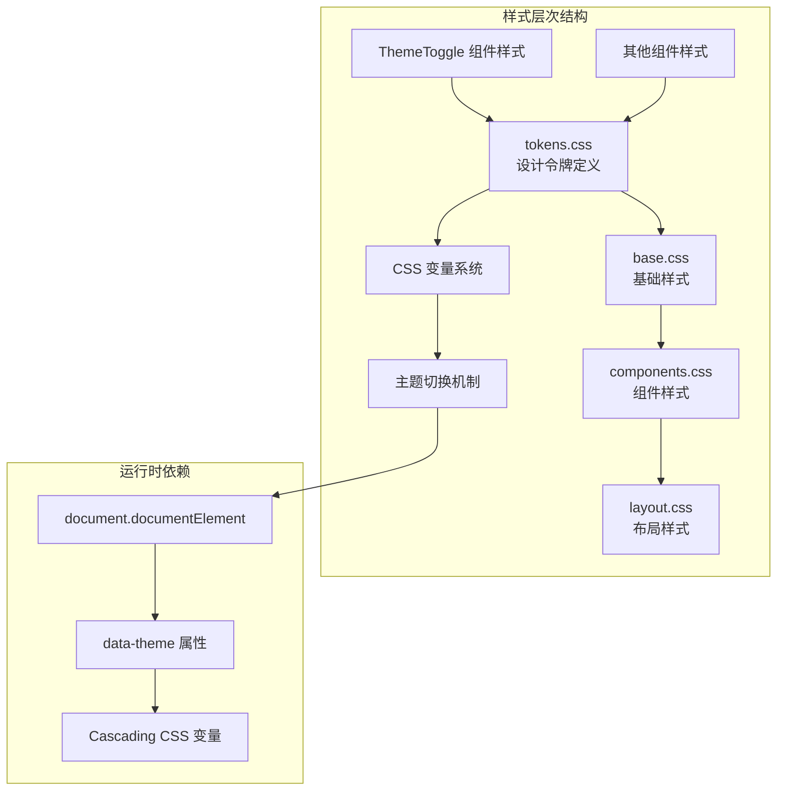
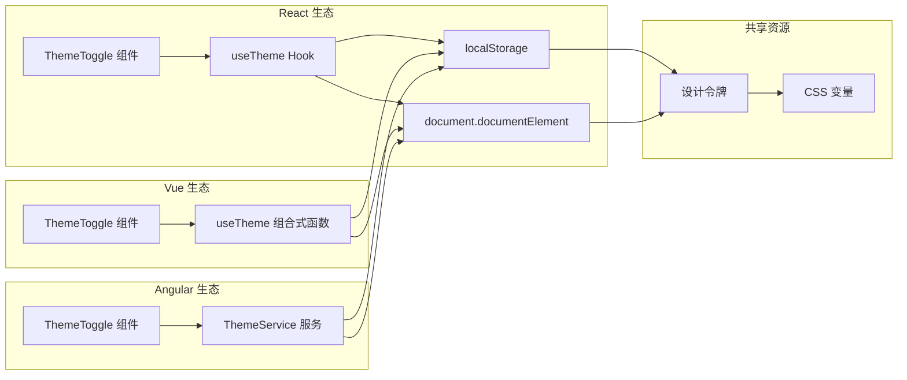

# ThemeToggle 主题切换组件

<cite>
**本文档引用的文件**
- [ThemeToggle.tsx](file://frontends/react-ts/src/components/ThemeToggle.tsx)
- [useTheme.ts](file://frontends/react-ts/src/hooks/useTheme.ts)
- [ThemeToggle.module.css](file://frontends/react-ts/src/components/ThemeToggle.module.css)
- [ThemeToggle.vue](file://frontends/vue3-ts/src/components/ThemeToggle.vue)
- [useTheme.ts](file://frontends/vue3-ts/src/composables/useTheme.ts)
- [theme-toggle.component.ts](file://frontends/angular-ts/src/app/components/theme-toggle/theme-toggle.component.ts)
- [theme-toggle.component.html](file://frontends/angular-ts/src/app/components/theme-toggle/theme-toggle.component.html)
- [theme-toggle.component.css](file://frontends/angular-ts/src/app/components/theme-toggle/theme-toggle.component.css)
- [theme.service.ts](file://frontends/angular-ts/src/app/services/theme.service.ts)
- [tokens.css](file://spec/styles/tokens.css)
- [base.css](file://spec/styles/base.css)
- [main.tsx](file://frontends/react-ts/src/main.tsx)
- [main.ts](file://frontends/vue3-ts/src/main.ts)
- [main.ts](file://frontends/angular-ts/src/main.ts)
</cite>

## 目录
1. [简介](#简介)
2. [项目结构](#项目结构)
3. [核心组件](#核心组件)
4. [架构概览](#架构概览)
5. [详细组件分析](#详细组件分析)
6. [依赖关系分析](#依赖关系分析)
7. [性能考量](#性能考量)
8. [故障排除指南](#故障排除指南)
9. [结论](#结论)
10. [附录](#附录)

## 简介

ThemeToggle 是一个跨框架的主题切换组件，支持亮色和暗色模式之间的无缝切换。该组件通过统一的主题系统实现了以下核心功能：

- **深浅主题切换逻辑**：基于 CSS 变量的动态更新机制
- **用户偏好持久化**：使用 localStorage 存储用户选择的主题偏好
- **跨框架一致性**：React、Vue 3 和 Angular 三种框架的统一实现
- **平滑过渡动画**：通过 CSS 过渡效果提供流畅的用户体验
- **无障碍支持**：完整的标题提示和键盘导航支持

## 项目结构

主题系统采用分层架构设计，确保各框架间的一致性和可维护性：

**图表来源**
- [ThemeToggle.tsx:1-17](file://frontends/react-ts/src/components/ThemeToggle.tsx#L1-L17)
- [useTheme.ts:1-48](file://frontends/react-ts/src/hooks/useTheme.ts#L1-L48)
- [ThemeToggle.vue:1-34](file://frontends/vue3-ts/src/components/ThemeToggle.vue#L1-L34)
- [useTheme.ts:1-57](file://frontends/vue3-ts/src/composables/useTheme.ts#L1-L57)
- [theme.service.ts:1-28](file://frontends/angular-ts/src/app/services/theme.service.ts#L1-L28)

**章节来源**
- [main.tsx:9-14](file://frontends/react-ts/src/main.tsx#L9-L14)
- [main.ts:9-14](file://frontends/vue3-ts/src/main.ts#L9-L14)
- [main.ts:1-7](file://frontends/angular-ts/src/main.ts#L1-L7)

## 核心组件

### 主题系统架构

主题系统的核心是基于 CSS 自定义属性的设计令牌系统。该系统通过以下机制实现主题切换：

**图表来源**
- [useTheme.ts:39-47](file://frontends/react-ts/src/hooks/useTheme.ts#L39-L47)
- [useTheme.ts:46-56](file://frontends/vue3-ts/src/composables/useTheme.ts#L46-L56)
- [theme.service.ts:24-26](file://frontends/angular-ts/src/app/services/theme.service.ts#L24-L26)

### 设计令牌系统

设计令牌系统定义了完整的主题变量集，支持亮色和暗色两种模式：

| 分类 | 变量名称 | 亮色模式默认值 | 暗色模式值 |
|------|----------|----------------|------------|
| 颜色 | --color-primary | #6366f1 | #818cf8 |
| 颜色 | --color-bg | #ffffff | #0f172a |
| 颜色 | --color-text | #0f172a | #f1f5f9 |
| 字体 | --font-family | 'Inter', sans-serif | 'Inter', sans-serif |
| 间距 | --space-1 | 0.25rem | 0.25rem |
| 圆角 | --radius-full | 9999px | 9999px |
| 过渡 | --transition-fast | 150ms ease | 150ms ease |

**章节来源**
- [tokens.css:1-104](file://spec/styles/tokens.css#L1-L104)

## 架构概览

### 跨框架一致性设计

三个框架实现了相同的功能语义，但采用了各自框架的最佳实践：

**图表来源**
- [useTheme.ts:39-47](file://frontends/react-ts/src/hooks/useTheme.ts#L39-L47)
- [useTheme.ts:46-56](file://frontends/vue3-ts/src/composables/useTheme.ts#L46-L56)
- [theme.service.ts:6-27](file://frontends/angular-ts/src/app/services/theme.service.ts#L6-L27)

### 主题切换流程

**图表来源**
- [useTheme.ts:33-37](file://frontends/react-ts/src/hooks/useTheme.ts#L33-L37)
- [useTheme.ts:20-23](file://frontends/vue3-ts/src/composables/useTheme.ts#L20-L23)
- [theme.service.ts:17-21](file://frontends/angular-ts/src/app/services/theme.service.ts#L17-L21)

**章节来源**
- [ThemeToggle.tsx:4-16](file://frontends/react-ts/src/components/ThemeToggle.tsx#L4-L16)
- [ThemeToggle.vue:1-12](file://frontends/vue3-ts/src/components/ThemeToggle.vue#L1-L12)
- [theme-toggle.component.ts:1-14](file://frontends/angular-ts/src/app/components/theme-toggle/theme-toggle.component.ts#L1-L14)

## 详细组件分析

### React 实现分析

React 版本使用自定义 Hook 和 `useSyncExternalStore` 实现主题状态管理：

#### 组件实现特点

- **状态管理**：使用模块级变量存储主题状态，避免组件重新渲染
- **订阅机制**：通过 `Set` 存储监听器，在主题变化时通知所有订阅者
- **持久化存储**：自动将主题偏好保存到 `localStorage`
- **DOM 操作**：直接操作 `document.documentElement` 设置 `data-theme` 属性

#### 性能优化策略

**图表来源**
- [useTheme.ts:10-17](file://frontends/react-ts/src/hooks/useTheme.ts#L10-L17)
- [useTheme.ts:42-44](file://frontends/react-ts/src/hooks/useTheme.ts#L42-L44)

**章节来源**
- [ThemeToggle.tsx:1-17](file://frontends/react-ts/src/components/ThemeToggle.tsx#L1-L17)
- [useTheme.ts:1-48](file://frontends/react-ts/src/hooks/useTheme.ts#L1-L48)
- [ThemeToggle.module.css:1-19](file://frontends/react-ts/src/components/ThemeToggle.module.css#L1-L19)

### Vue 3 实现分析

Vue 3 版本使用组合式 API 和响应式系统实现主题管理：

#### 组合式函数设计

- **响应式状态**：使用 `ref` 创建主题状态，自动响应变化
- **副作用处理**：通过 `watchEffect` 监听状态变化并应用到 DOM
- **生命周期管理**：在 SSR 环境下安全地访问 `document` 对象
- **类型安全**：完整的 TypeScript 类型定义确保类型安全

#### 组件集成方式

**图表来源**
- [useTheme.ts:46-56](file://frontends/vue3-ts/src/composables/useTheme.ts#L46-L56)
- [useTheme.ts:34-38](file://frontends/vue3-ts/src/composables/useTheme.ts#L34-L38)

**章节来源**
- [ThemeToggle.vue:1-34](file://frontends/vue3-ts/src/components/ThemeToggle.vue#L1-L34)
- [useTheme.ts:1-57](file://frontends/vue3-ts/src/composables/useTheme.ts#L1-L57)

### Angular 实现分析

Angular 版本使用服务和信号系统实现主题管理：

#### 服务架构设计

- **依赖注入**：作为根服务提供全局主题状态
- **信号系统**：使用 `signal` 和 `effect` 实现响应式更新
- **平台抽象**：通过 `DOCUMENT` 令牌访问浏览器 API
- **类型推断**：利用 TypeScript 的类型推断确保类型安全

#### 组件集成模式

**图表来源**
- [theme.service.ts:10-26](file://frontends/angular-ts/src/app/services/theme.service.ts#L10-L26)

**章节来源**
- [theme-toggle.component.ts:1-14](file://frontends/angular-ts/src/app/components/theme-toggle/theme-toggle.component.ts#L1-L14)
- [theme-toggle.component.html:1-13](file://frontends/angular-ts/src/app/components/theme-toggle/theme-toggle.component.html#L1-L13)
- [theme.service.ts:1-28](file://frontends/angular-ts/src/app/services/theme.service.ts#L1-L28)

## 依赖关系分析

### 样式依赖关系

主题系统的核心依赖于设计令牌和基础样式：

**图表来源**
- [tokens.css:1-104](file://spec/styles/tokens.css#L1-L104)
- [base.css:1-67](file://spec/styles/base.css#L1-L67)
- [main.tsx:9-14](file://frontends/react-ts/src/main.tsx#L9-L14)

### 组件间依赖关系

**图表来源**
- [ThemeToggle.tsx:1-2](file://frontends/react-ts/src/components/ThemeToggle.tsx#L1-L2)
- [ThemeToggle.vue](file://frontends/vue3-ts/src/components/ThemeToggle.vue#L9)
- [theme-toggle.component.ts](file://frontends/angular-ts/src/app/components/theme-toggle/theme-toggle.component.ts#L2)

**章节来源**
- [main.tsx:9-14](file://frontends/react-ts/src/main.tsx#L9-L14)
- [main.ts:9-14](file://frontends/vue3-ts/src/main.ts#L9-L14)
- [main.ts:1-7](file://frontends/angular-ts/src/main.ts#L1-L7)

## 性能考量

### 内存管理优化

- **模块级状态**：React 实现使用模块级变量避免重复创建
- **监听器管理**：及时清理不再使用的订阅者防止内存泄漏
- **事件回调缓存**：使用 `useCallback` 避免不必要的函数重建

### 渲染性能优化

- **最小化重渲染**：React Hook 通过 `useSyncExternalStore` 实现精确更新
- **响应式更新**：Vue 3 的 `watchEffect` 自动追踪依赖变化
- **信号系统**：Angular 的 `signal` 提供高效的变更检测

### 用户体验优化

- **即时反馈**：主题切换几乎无延迟的视觉反馈
- **平滑过渡**：CSS 过渡动画提供流畅的用户体验
- **无障碍支持**：完整的标题提示和键盘导航支持

## 故障排除指南

### 常见问题诊断

#### 主题不持久化问题

**症状**：刷新页面后主题恢复默认值

**排查步骤**：
1. 检查浏览器是否禁用 localStorage
2. 验证 `localStorage` 中是否存在 `theme` 键
3. 确认 `applyTheme` 函数正确执行

**解决方案**：
- 添加 localStorage 功能检测
- 实现降级方案（无 localStorage 时使用默认主题）

#### SSR 环境问题

**症状**：服务端渲染时出现 undefined 错误

**排查步骤**：
1. 检查 `typeof document !== 'undefined'` 条件判断
2. 验证 SSR 环境下的初始化逻辑
3. 确认客户端水合后的状态同步

**解决方案**：
- 在所有可能访问 DOM 的代码前添加环境检查
- 实现服务端默认主题设置

#### 样式不生效问题

**症状**：主题切换后样式未更新

**排查步骤**：
1. 检查 `data-theme` 属性是否正确设置
2. 验证 CSS 变量是否正确继承
3. 确认样式优先级和作用域

**解决方案**：
- 确保 `document.documentElement` 正确设置
- 检查 CSS 变量的级联规则
- 验证样式文件的加载顺序

**章节来源**
- [useTheme.ts:10-22](file://frontends/react-ts/src/hooks/useTheme.ts#L10-L22)
- [useTheme.ts:13-28](file://frontends/vue3-ts/src/composables/useTheme.ts#L13-L28)
- [theme.service.ts:10-26](file://frontends/angular-ts/src/app/services/theme.service.ts#L10-L26)

## 结论

ThemeToggle 主题切换组件成功实现了跨框架的一致性主题系统，具有以下优势：

1. **架构一致性**：三种框架实现遵循相同的架构模式
2. **性能优化**：采用各自框架的最佳实践进行性能优化
3. **用户体验**：提供流畅的切换动画和即时反馈
4. **可维护性**：清晰的代码结构和完善的错误处理
5. **可扩展性**：易于添加新主题和自定义选项

该组件为构建现代化的多主题 Web 应用提供了坚实的基础，支持企业级应用的复杂需求。

## 附录

### 主题开发最佳实践

#### 新主题添加指南

1. **扩展设计令牌**：在 `tokens.css` 中添加新的颜色变量
2. **定义主题映射**：在 `:root` 和 `[data-theme="dark"]` 中定义变量值
3. **更新组件样式**：确保组件样式正确使用新的变量
4. **测试兼容性**：验证新主题在不同组件中的表现

#### 主题定制选项

- **颜色方案**：支持品牌色彩的自定义
- **字体配置**：支持中英文字体的灵活配置
- **间距系统**：支持移动端和桌面端的适配
- **动画参数**：支持自定义过渡时间和缓动函数

#### 兼容性考虑

- **浏览器支持**：确保对现代浏览器的完全支持
- **无障碍标准**：符合 WCAG 2.1 AA 标准
- **性能基准**：保持低内存占用和快速响应时间
- **SEO 友好**：支持搜索引擎的正确索引