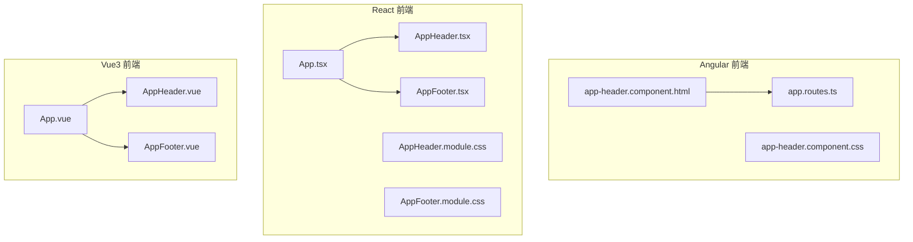
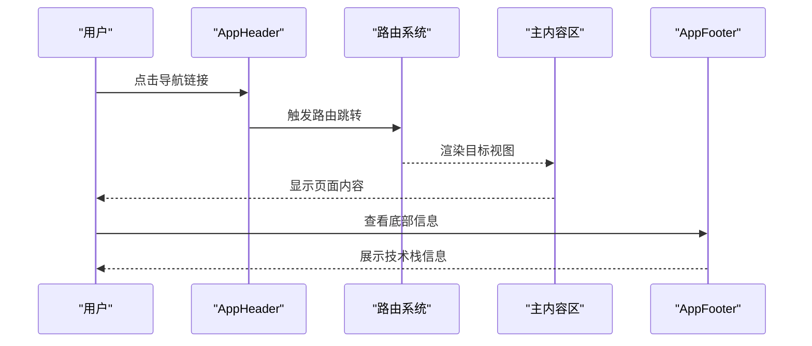
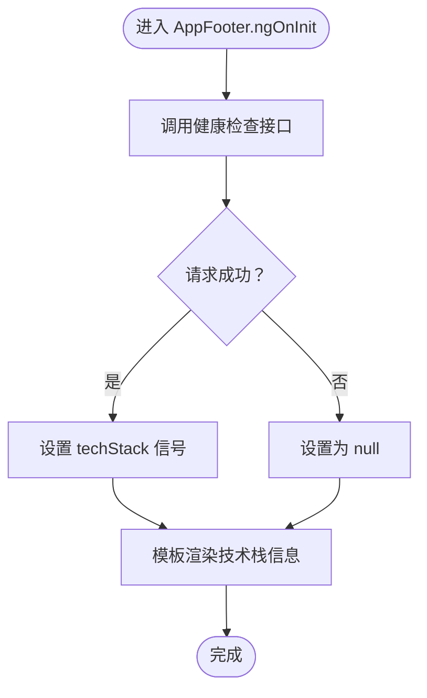
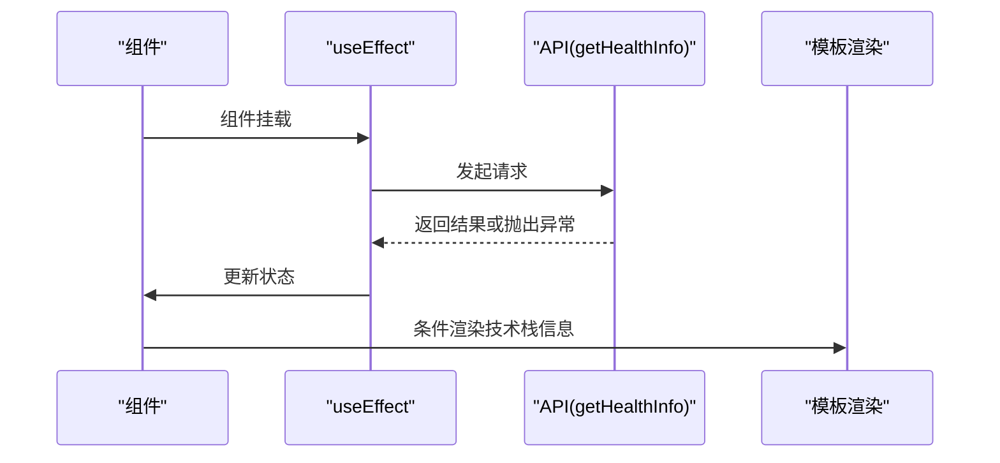
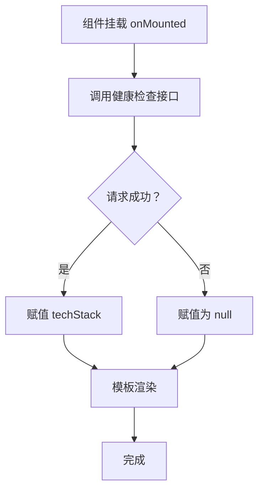
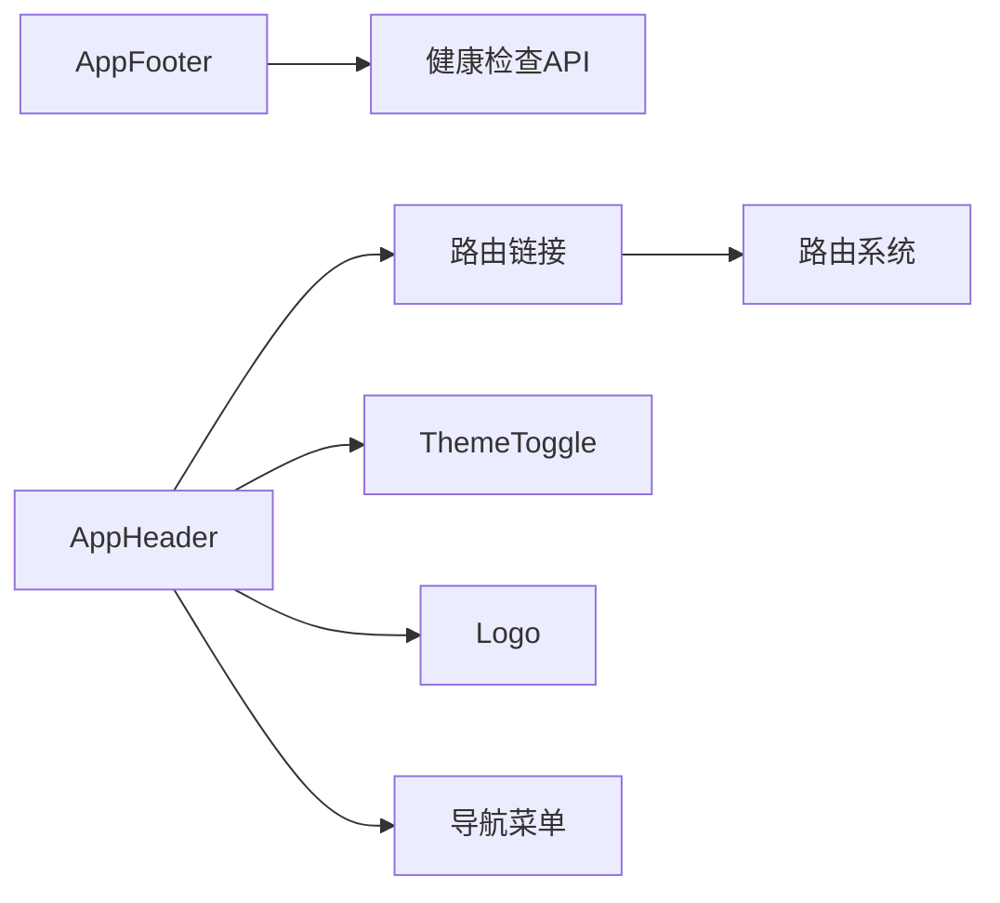

# 导航组件系统

<cite>
**本文引用的文件**
- [frontends/angular-ts/src/app/components/app-header/app-header.component.ts](file://frontends/angular-ts/src/app/components/app-header/app-header.component.ts)
- [frontends/angular-ts/src/app/components/app-header/app-header.component.html](file://frontends/angular-ts/src/app/components/app-header/app-header.component.html)
- [frontends/angular-ts/src/app/components/app-header/app-header.component.css](file://frontends/angular-ts/src/app/components/app-header/app-header.component.css)
- [frontends/angular-ts/src/app/components/app-footer/app-footer.component.ts](file://frontends/angular-ts/src/app/components/app-footer/app-footer.component.ts)
- [frontends/angular-ts/src/app/components/app-footer/app-footer.component.html](file://frontends/angular-ts/src/app/components/app-footer/app-footer.component.html)
- [frontends/angular-ts/src/app/components/app-footer/app-footer.component.css](file://frontends/angular-ts/src/app/components/app-footer/app-footer.component.css)
- [frontends/angular-ts/src/app/app.routes.ts](file://frontends/angular-ts/src/app/app.routes.ts)
- [frontends/react-ts/src/components/AppHeader.tsx](file://frontends/react-ts/src/components/AppHeader.tsx)
- [frontends/react-ts/src/components/AppFooter.tsx](file://frontends/react-ts/src/components/AppFooter.tsx)
- [frontends/react-ts/src/components/AppHeader.module.css](file://frontends/react-ts/src/components/AppHeader.module.css)
- [frontends/react-ts/src/components/AppFooter.module.css](file://frontends/react-ts/src/components/AppFooter.module.css)
- [frontends/react-ts/src/App.tsx](file://frontends/react-ts/src/App.tsx)
- [frontends/vue3-ts/src/components/AppHeader.vue](file://frontends/vue3-ts/src/components/AppHeader.vue)
- [frontends/vue3-ts/src/components/AppFooter.vue](file://frontends/vue3-ts/src/components/AppFooter.vue)
- [frontends/vue3-ts/src/App.vue](file://frontends/vue3-ts/src/App.vue)
</cite>

## 目录
1. [简介](#简介)
2. [项目结构](#项目结构)
3. [核心组件](#核心组件)
4. [架构总览](#架构总览)
5. [详细组件分析](#详细组件分析)
6. [依赖关系分析](#依赖关系分析)
7. [性能考量](#性能考量)
8. [故障排查指南](#故障排查指南)
9. [结论](#结论)
10. [附录](#附录)

## 简介
本文件系统性梳理 HelloTime 项目的导航组件体系，覆盖应用头部与底部组件的设计理念、导航结构、品牌展示与用户交互元素。文档重点解析三套前端框架（Angular、React、Vue3）中的 AppHeader 与 AppFooter 组件，阐明其功能实现、与路由系统的集成方式、响应式布局策略、可访问性设计以及定制与维护建议。

## 项目结构
导航组件位于各前端框架的组件目录中，分别在 Angular 的 app/components、React 的 components、Vue3 的 components 下提供统一的头部与底部组件。路由系统在各框架入口处集中定义，头部组件通过路由链接与路由激活状态联动，底部组件负责版权与技术栈信息展示。

**图表来源**
- [frontends/angular-ts/src/app/components/app-header/app-header.component.html:1-16](file://frontends/angular-ts/src/app/components/app-header/app-header.component.html#L1-L16)
- [frontends/angular-ts/src/app/app.routes.ts:1-35](file://frontends/angular-ts/src/app/app.routes.ts#L1-L35)
- [frontends/react-ts/src/App.tsx:1-31](file://frontends/react-ts/src/App.tsx#L1-L31)
- [frontends/react-ts/src/components/AppHeader.tsx:1-25](file://frontends/react-ts/src/components/AppHeader.tsx#L1-L25)
- [frontends/react-ts/src/components/AppFooter.tsx:1-30](file://frontends/react-ts/src/components/AppFooter.tsx#L1-L30)
- [frontends/vue3-ts/src/App.vue:1-19](file://frontends/vue3-ts/src/App.vue#L1-L19)
- [frontends/vue3-ts/src/components/AppHeader.vue:1-75](file://frontends/vue3-ts/src/components/AppHeader.vue#L1-L75)
- [frontends/vue3-ts/src/components/AppFooter.vue:1-46](file://frontends/vue3-ts/src/components/AppFooter.vue#L1-L46)

**章节来源**
- [frontends/angular-ts/src/app/components/app-header/app-header.component.html:1-16](file://frontends/angular-ts/src/app/components/app-header/app-header.component.html#L1-L16)
- [frontends/angular-ts/src/app/app.routes.ts:1-35](file://frontends/angular-ts/src/app/app.routes.ts#L1-L35)
- [frontends/react-ts/src/App.tsx:1-31](file://frontends/react-ts/src/App.tsx#L1-L31)
- [frontends/vue3-ts/src/App.vue:1-19](file://frontends/vue3-ts/src/App.vue#L1-L19)

## 核心组件
- 应用头部（AppHeader）
  - 负责品牌标识（Logo）、主导航菜单（首页、创建、开启、关于）、主题切换控件与响应式布局。
  - 在 Angular 中使用 RouterLink 与 RouterLinkActive 实现路由激活状态；在 React/Vue 中使用 NavLink/router-link 与激活类名联动。
- 应用底部（AppFooter）
  - 展示版权信息与“Powered By”技术栈信息，通过健康检查接口动态加载技术栈数据。

**章节来源**
- [frontends/angular-ts/src/app/components/app-header/app-header.component.ts:1-13](file://frontends/angular-ts/src/app/components/app-header/app-header.component.ts#L1-L13)
- [frontends/angular-ts/src/app/components/app-header/app-header.component.html:1-16](file://frontends/angular-ts/src/app/components/app-header/app-header.component.html#L1-L16)
- [frontends/angular-ts/src/app/components/app-footer/app-footer.component.ts:1-21](file://frontends/angular-ts/src/app/components/app-footer/app-footer.component.ts#L1-L21)
- [frontends/angular-ts/src/app/components/app-footer/app-footer.component.html:1-11](file://frontends/angular-ts/src/app/components/app-footer/app-footer.component.html#L1-L11)
- [frontends/react-ts/src/components/AppHeader.tsx:1-25](file://frontends/react-ts/src/components/AppHeader.tsx#L1-L25)
- [frontends/react-ts/src/components/AppFooter.tsx:1-30](file://frontends/react-ts/src/components/AppFooter.tsx#L1-L30)
- [frontends/vue3-ts/src/components/AppHeader.vue:1-75](file://frontends/vue3-ts/src/components/AppHeader.vue#L1-L75)
- [frontends/vue3-ts/src/components/AppFooter.vue:1-46](file://frontends/vue3-ts/src/components/AppFooter.vue#L1-L46)

## 架构总览
导航组件与路由系统通过以下方式集成：
- 头部导航项绑定到具体路由路径，激活状态由路由库自动管理。
- 路由配置包含首页、创建、开启（含参数占位）、关于与管理员页面等。
- 主体内容区域由路由渲染器承载，头部与底部作为全局容器包裹。

**图表来源**
- [frontends/angular-ts/src/app/app.routes.ts:1-35](file://frontends/angular-ts/src/app/app.routes.ts#L1-L35)
- [frontends/react-ts/src/App.tsx:12-30](file://frontends/react-ts/src/App.tsx#L12-L30)
- [frontends/vue3-ts/src/App.vue:1-19](file://frontends/vue3-ts/src/App.vue#L1-L19)

## 详细组件分析

### Angular 版本
- AppHeader
  - 结构：Logo 区域 + 导航区（首页、创建、开启、关于）+ 主题切换。
  - 激活状态：使用 RouterLinkActive 与 [routerLinkActiveOptions]="{exact:true}" 控制首页精确匹配。
  - 响应式：媒体查询在窄屏下隐藏 Logo 文字，仅保留图标。
- AppFooter
  - 数据：在 ngOnInit 生命周期内调用健康检查接口，动态设置技术栈信号。
  - 展示：若数据可用则拼接“框架/语言/数据库”，否则显示“加载中...”。

**图表来源**
- [frontends/angular-ts/src/app/components/app-footer/app-footer.component.ts:12-20](file://frontends/angular-ts/src/app/components/app-footer/app-footer.component.ts#L12-L20)
- [frontends/angular-ts/src/app/components/app-footer/app-footer.component.html:1-11](file://frontends/angular-ts/src/app/components/app-footer/app-footer.component.html#L1-L11)

**章节来源**
- [frontends/angular-ts/src/app/components/app-header/app-header.component.html:1-16](file://frontends/angular-ts/src/app/components/app-header/app-header.component.html#L1-L16)
- [frontends/angular-ts/src/app/components/app-header/app-header.component.css:1-66](file://frontends/angular-ts/src/app/components/app-header/app-header.component.css#L1-L66)
- [frontends/angular-ts/src/app/components/app-footer/app-footer.component.ts:1-21](file://frontends/angular-ts/src/app/components/app-footer/app-footer.component.ts#L1-L21)
- [frontends/angular-ts/src/app/components/app-footer/app-footer.component.html:1-11](file://frontends/angular-ts/src/app/components/app-footer/app-footer.component.html#L1-L11)
- [frontends/angular-ts/src/app/components/app-footer/app-footer.component.css:1-22](file://frontends/angular-ts/src/app/components/app-footer/app-footer.component.css#L1-L22)

### React 版本
- AppHeader
  - 使用 NavLink 的 isActive 回调动态拼接激活类名，实现与当前路由的联动。
  - Logo 使用本地 SVG 资源，导航项与路由路径一一对应。
- AppFooter
  - 使用 useEffect 在挂载时拉取健康检查数据，失败时回退为 null。
  - 模板中根据 techStack 是否存在进行条件渲染。

**图表来源**
- [frontends/react-ts/src/components/AppFooter.tsx:1-30](file://frontends/react-ts/src/components/AppFooter.tsx#L1-L30)

**章节来源**
- [frontends/react-ts/src/components/AppHeader.tsx:1-25](file://frontends/react-ts/src/components/AppHeader.tsx#L1-L25)
- [frontends/react-ts/src/components/AppHeader.module.css:1-51](file://frontends/react-ts/src/components/AppHeader.module.css#L1-L51)
- [frontends/react-ts/src/components/AppFooter.tsx:1-30](file://frontends/react-ts/src/components/AppFooter.tsx#L1-L30)
- [frontends/react-ts/src/components/AppFooter.module.css:1-17](file://frontends/react-ts/src/components/AppFooter.module.css#L1-L17)

### Vue3 版本
- AppHeader
  - 使用 router-link 进行导航，激活态通过 .router-link-active 类名控制。
  - 同样具备移动端隐藏 Logo 文字的响应式逻辑。
- AppFooter
  - 使用 onMounted 钩子在挂载后拉取健康检查数据。
  - 模板中对 techStack 存在性进行判断，不存在时显示“加载中...”。

**图表来源**
- [frontends/vue3-ts/src/components/AppFooter.vue:14-26](file://frontends/vue3-ts/src/components/AppFooter.vue#L14-L26)

**章节来源**
- [frontends/vue3-ts/src/components/AppHeader.vue:1-75](file://frontends/vue3-ts/src/components/AppHeader.vue#L1-L75)
- [frontends/vue3-ts/src/components/AppFooter.vue:1-46](file://frontends/vue3-ts/src/components/AppFooter.vue#L1-L46)

### 路由系统集成与面包屑
- 路由配置
  - Angular：采用惰性加载组件的方式定义首页、创建、开启（带参数）、关于与管理员页面。
  - React：BrowserRouter + Routes + Route 定义相同路径集合，配合 Suspense 实现懒加载。
  - Vue3：通过 router-view 渲染当前路由视图。
- 面包屑导航
  - 当前代码未实现专用面包屑组件；可在路由元信息中扩展面包屑层级，或在视图内按需生成。
- 页面标题管理
  - 当前代码未实现统一的页面标题管理；可在路由层或视图层通过生命周期钩子设置 document.title 或使用第三方库。

**章节来源**
- [frontends/angular-ts/src/app/app.routes.ts:1-35](file://frontends/angular-ts/src/app/app.routes.ts#L1-L35)
- [frontends/react-ts/src/App.tsx:12-30](file://frontends/react-ts/src/App.tsx#L12-L30)
- [frontends/vue3-ts/src/App.vue:1-19](file://frontends/vue3-ts/src/App.vue#L1-L19)

### 可访问性设计
- 键盘导航
  - 导航链接均为原生可聚焦元素，确保 Tab 键顺序合理；建议为导航容器添加 role="navigation" 以提升语义化。
- 屏幕阅读器支持
  - Logo 图标已提供 alt="logo"；建议在导航容器上增加 aria-label 描述导航用途。
- 语义化标记
  - 头部使用语义化 <header>，底部使用 <footer>；导航使用 <nav> 包裹，链接使用 <a> 或等价组件。
- 激活状态
  - 各框架均提供激活态样式，建议同时提供视觉与听觉反馈（如 aria-current="page"）。

**章节来源**
- [frontends/angular-ts/src/app/components/app-header/app-header.component.html:1-16](file://frontends/angular-ts/src/app/components/app-header/app-header.component.html#L1-L16)
- [frontends/react-ts/src/components/AppHeader.tsx:10-20](file://frontends/react-ts/src/components/AppHeader.tsx#L10-L20)
- [frontends/vue3-ts/src/components/AppHeader.vue:1-17](file://frontends/vue3-ts/src/components/AppHeader.vue#L1-L17)

## 依赖关系分析
- 组件依赖
  - AppHeader 依赖路由模块（Angular 使用 RouterLink/RouterLinkActive；React 使用 NavLink；Vue 使用 router-link）。
  - AppFooter 依赖健康检查 API 与类型定义。
- 入口与布局
  - Angular：在 app.routes.ts 中集中声明路由；AppHeader/AppFooter 作为全局布局的一部分。
  - React：在 App.tsx 中组合 Header/Footer 与路由；main 区域高度通过 CSS 变量与固定头部高度计算。
  - Vue3：在 App.vue 中组合 Header/Footer 与 router-view。

**图表来源**
- [frontends/angular-ts/src/app/components/app-header/app-header.component.ts:1-13](file://frontends/angular-ts/src/app/components/app-header/app-header.component.ts#L1-L13)
- [frontends/react-ts/src/components/AppHeader.tsx:1-25](file://frontends/react-ts/src/components/AppHeader.tsx#L1-L25)
- [frontends/vue3-ts/src/components/AppHeader.vue:1-21](file://frontends/vue3-ts/src/components/AppHeader.vue#L1-L21)
- [frontends/angular-ts/src/app/components/app-footer/app-footer.component.ts:1-21](file://frontends/angular-ts/src/app/components/app-footer/app-footer.component.ts#L1-L21)
- [frontends/react-ts/src/components/AppFooter.tsx:1-30](file://frontends/react-ts/src/components/AppFooter.tsx#L1-L30)
- [frontends/vue3-ts/src/components/AppFooter.vue:14-26](file://frontends/vue3-ts/src/components/AppFooter.vue#L14-L26)

**章节来源**
- [frontends/angular-ts/src/app/app.routes.ts:1-35](file://frontends/angular-ts/src/app/app.routes.ts#L1-L35)
- [frontends/react-ts/src/App.tsx:12-30](file://frontends/react-ts/src/App.tsx#L12-L30)
- [frontends/vue3-ts/src/App.vue:1-19](file://frontends/vue3-ts/src/App.vue#L1-L19)

## 性能考量
- 路由懒加载
  - Angular 与 React 均采用惰性加载组件，减少首屏体积与初次渲染时间。
- 主体高度计算
  - React/Vue 通过 CSS 变量与固定头部高度计算 main 最小高度，避免布局抖动。
- 底部数据异步
  - Footer 的技术栈信息异步加载，不影响首屏渲染；建议在接口层设置合理的超时与重试策略。

**章节来源**
- [frontends/angular-ts/src/app/app.routes.ts:3-34](file://frontends/angular-ts/src/app/app.routes.ts#L3-L34)
- [frontends/react-ts/src/App.tsx:14-18](file://frontends/react-ts/src/App.tsx#L14-L18)
- [frontends/vue3-ts/src/App.vue:14-18](file://frontends/vue3-ts/src/App.vue#L14-L18)
- [frontends/angular-ts/src/app/components/app-footer/app-footer.component.ts:15-19](file://frontends/angular-ts/src/app/components/app-footer/app-footer.component.ts#L15-L19)
- [frontends/react-ts/src/components/AppFooter.tsx:9-13](file://frontends/react-ts/src/components/AppFooter.tsx#L9-L13)
- [frontends/vue3-ts/src/components/AppFooter.vue:21-25](file://frontends/vue3-ts/src/components/AppFooter.vue#L21-L25)

## 故障排查指南
- 导航激活状态不正确
  - Angular：确认 routerLinkActive 与 routerLinkActiveOptions 的 exact 设置是否符合预期。
  - React：检查 NavLink 的 end 参数与 isActive 回调拼接逻辑。
  - Vue：确认 router-link-active 类名与样式是否生效。
- 技术栈信息不显示
  - 检查健康检查接口返回格式与类型定义是否一致。
  - 确认 Footer 组件在挂载后执行了数据拉取逻辑。
- 响应式布局异常
  - 检查媒体查询断点与容器类名是否正确应用。
- 路由跳转无效
  - 确认路由配置中路径与导航链接一致，且路由懒加载模块可正常导入。

**章节来源**
- [frontends/angular-ts/src/app/components/app-header/app-header.component.html:7-12](file://frontends/angular-ts/src/app/components/app-header/app-header.component.html#L7-L12)
- [frontends/react-ts/src/components/AppHeader.tsx:14-19](file://frontends/react-ts/src/components/AppHeader.tsx#L14-L19)
- [frontends/vue3-ts/src/components/AppHeader.vue:8-14](file://frontends/vue3-ts/src/components/AppHeader.vue#L8-L14)
- [frontends/angular-ts/src/app/components/app-footer/app-footer.component.ts:15-19](file://frontends/angular-ts/src/app/components/app-footer/app-footer.component.ts#L15-L19)
- [frontends/react-ts/src/components/AppFooter.tsx:9-13](file://frontends/react-ts/src/components/AppFooter.tsx#L9-L13)
- [frontends/vue3-ts/src/components/AppFooter.vue:21-25](file://frontends/vue3-ts/src/components/AppFooter.vue#L21-L25)

## 结论
导航组件系统在三套前端框架中保持一致的品牌与导航体验：清晰的 Logo 展示、稳定的主导航菜单、灵活的主题切换与完善的响应式布局。通过路由系统的深度集成，实现了导航激活状态与页面内容的无缝联动。建议后续增强面包屑导航与页面标题管理，并完善可访问性细节，以进一步提升用户体验与无障碍能力。

## 附录
- 定制指南
  - 新增导航项：在各框架的头部组件中添加新的导航链接，并在路由配置中补充对应路径。
  - 自定义激活样式：根据设计系统调整激活态颜色与过渡效果。
  - 扩展 Footer 内容：在 Footer 模板中新增区块，并在类型定义中扩展 TechStack 字段。
- 维护建议
  - 统一导航文案与图标资源，确保跨框架一致性。
  - 对路由懒加载模块进行监控，避免单个模块过大影响加载性能。
  - 在 CI 中加入可访问性扫描，确保新增导航元素满足 WCAG 要求。