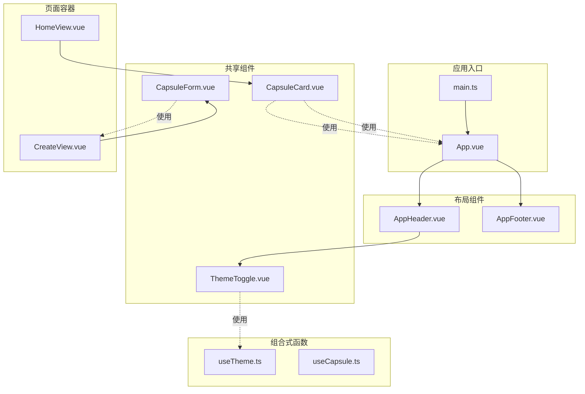
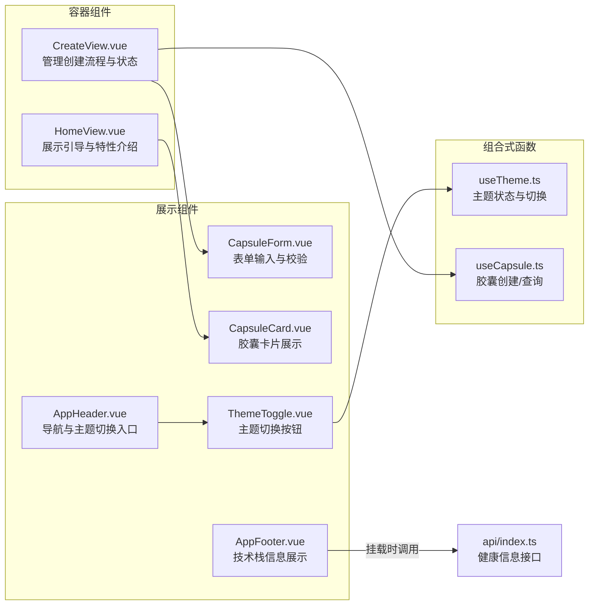
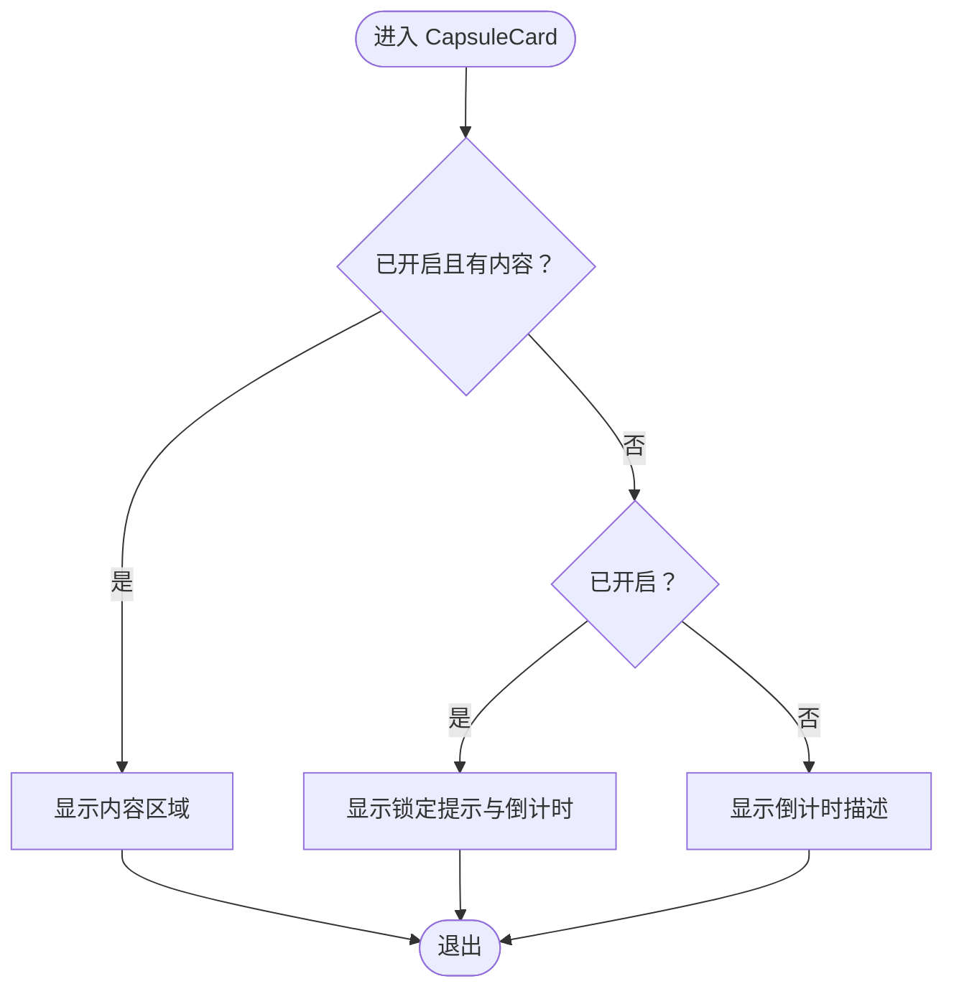
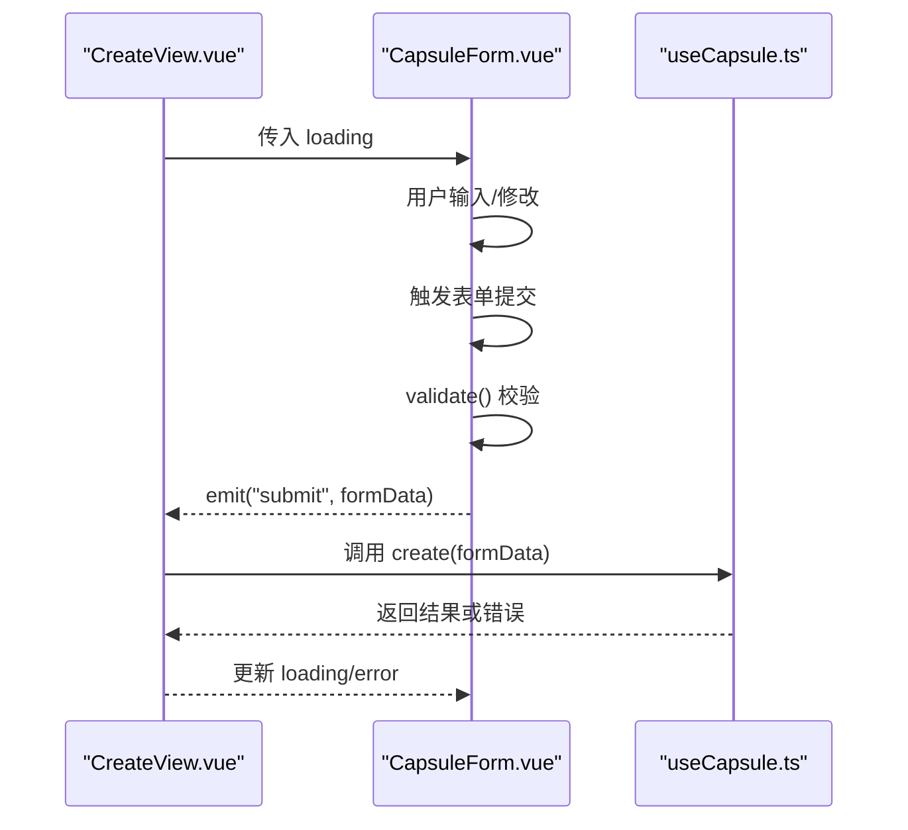
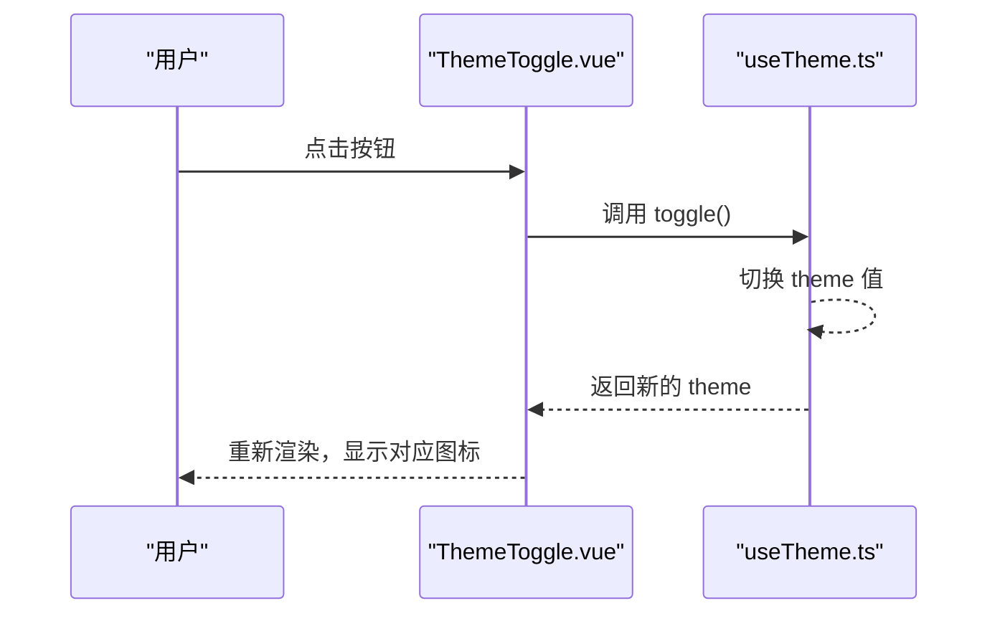
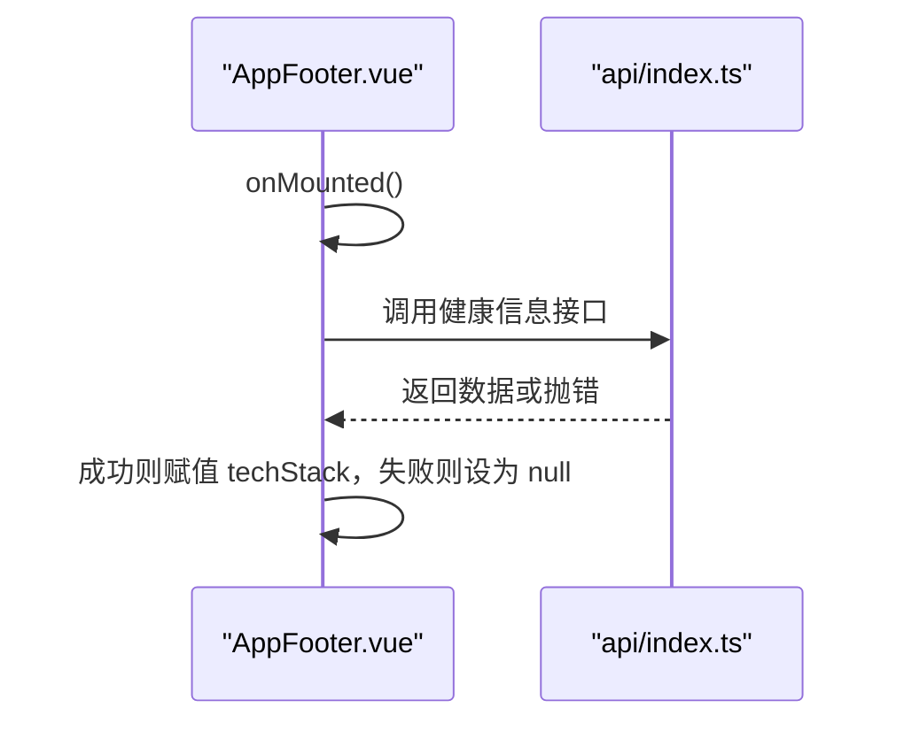
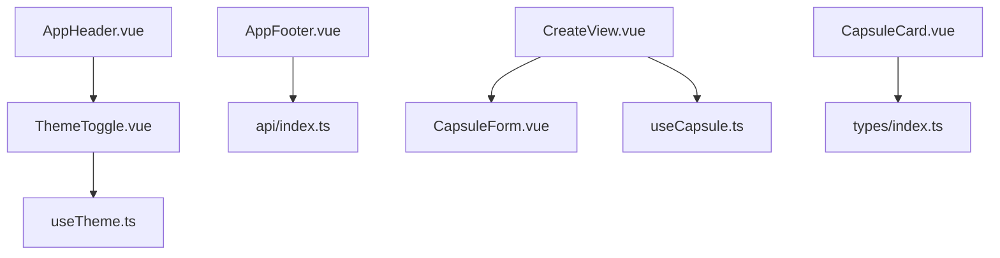

# 组件系统设计

<cite>
**本文引用的文件**
- [CapsuleCard.vue](file://frontends/vue3-ts/src/components/CapsuleCard.vue)
- [CapsuleForm.vue](file://frontends/vue3-ts/src/components/CapsuleForm.vue)
- [ThemeToggle.vue](file://frontends/vue3-ts/src/components/ThemeToggle.vue)
- [AppHeader.vue](file://frontends/vue3-ts/src/components/AppHeader.vue)
- [AppFooter.vue](file://frontends/vue3-ts/src/components/AppFooter.vue)
- [useTheme.ts](file://frontends/vue3-ts/src/composables/useTheme.ts)
- [useCapsule.ts](file://frontends/vue3-ts/src/composables/useCapsule.ts)
- [index.ts](file://frontends/vue3-ts/src/types/index.ts)
- [App.vue](file://frontends/vue3-ts/src/App.vue)
- [main.ts](file://frontends/vue3-ts/src/main.ts)
- [HomeView.vue](file://frontends/vue3-ts/src/views/HomeView.vue)
- [CreateView.vue](file://frontends/vue3-ts/src/views/CreateView.vue)
- [CapsuleCard.test.ts](file://frontends/vue3-ts/src/__tests__/components/CapsuleCard.test.ts)
- [CapsuleForm.test.ts](file://frontends/vue3-ts/src/__tests__/components/CapsuleForm.test.ts)
- [ThemeToggle.test.ts](file://frontends/vue3-ts/src/__tests__/components/ThemeToggle.test.ts)
</cite>

## 目录
1. [简介](#简介)
2. [项目结构](#项目结构)
3. [核心组件](#核心组件)
4. [架构总览](#架构总览)
5. [详细组件分析](#详细组件分析)
6. [依赖关系分析](#依赖关系分析)
7. [性能考量](#性能考量)
8. [故障排查指南](#故障排查指南)
9. [结论](#结论)
10. [附录](#附录)

## 简介
本文件系统性梳理 Vue 3 组件系统的设计与实现，聚焦以下目标：
- 组件分类与职责划分：展示组件、容器组件、复合组件的边界与协作方式
- 共享组件设计模式：CapsuleCard（胶囊卡片展示）、CapsuleForm（胶囊表单）、ThemeToggle（主题切换）、AppHeader/AppFooter（应用头部与底部）
- 组件间通信机制：props 传递、事件发射、provide/inject 的使用现状与建议
- 生命周期与状态管理策略：组合式 API 的响应式状态、副作用与错误处理
- 可复用性设计：接口标准化、默认值与错误处理、可访问性支持
- 最佳实践：性能优化、内存泄漏预防、可访问性支持
- 实际示例与使用指南：通过源码路径定位关键实现，避免直接粘贴代码

## 项目结构
前端采用 Vue 3 + TypeScript 架构，按功能域组织目录：
- components：可复用展示/交互组件
- composables：跨组件的状态与逻辑组合式封装
- views：页面级容器组件，负责编排业务流程
- types：共享类型定义
- api：后端接口调用封装
- main.ts：应用入口，注册全局样式与路由

图表来源
- [main.ts:1-23](file://frontends/vue3-ts/src/main.ts#L1-L23)
- [App.vue:1-19](file://frontends/vue3-ts/src/App.vue#L1-L19)
- [AppHeader.vue:1-75](file://frontends/vue3-ts/src/components/AppHeader.vue#L1-L75)
- [AppFooter.vue:1-46](file://frontends/vue3-ts/src/components/AppFooter.vue#L1-L46)
- [CapsuleCard.vue:1-98](file://frontends/vue3-ts/src/components/CapsuleCard.vue#L1-L98)
- [CapsuleForm.vue:1-165](file://frontends/vue3-ts/src/components/CapsuleForm.vue#L1-L165)
- [ThemeToggle.vue:1-34](file://frontends/vue3-ts/src/components/ThemeToggle.vue#L1-L34)
- [HomeView.vue:1-65](file://frontends/vue3-ts/src/views/HomeView.vue#L1-L65)
- [CreateView.vue:1-106](file://frontends/vue3-ts/src/views/CreateView.vue#L1-L106)
- [useTheme.ts:1-57](file://frontends/vue3-ts/src/composables/useTheme.ts#L1-L57)
- [useCapsule.ts:1-65](file://frontends/vue3-ts/src/composables/useCapsule.ts#L1-L65)

章节来源
- [main.ts:1-23](file://frontends/vue3-ts/src/main.ts#L1-L23)
- [App.vue:1-19](file://frontends/vue3-ts/src/App.vue#L1-L19)

## 核心组件
本节概述四个共享组件的职责与交互：
- CapsuleCard：展示单个胶囊的元信息、开启状态与内容；根据开启时间决定内容可见性与倒计时提示
- CapsuleForm：封装创建胶囊的表单输入、本地校验与提交事件发射；限制开启时间最小值
- ThemeToggle：基于 useTheme 组合式函数提供主题切换能力
- AppHeader/AppFooter：应用级导航与页脚信息展示；Footer 在挂载时拉取健康信息并显示技术栈

章节来源
- [CapsuleCard.vue:1-98](file://frontends/vue3-ts/src/components/CapsuleCard.vue#L1-L98)
- [CapsuleForm.vue:1-165](file://frontends/vue3-ts/src/components/CapsuleForm.vue#L1-L165)
- [ThemeToggle.vue:1-34](file://frontends/vue3-ts/src/components/ThemeToggle.vue#L1-L34)
- [AppHeader.vue:1-75](file://frontends/vue3-ts/src/components/AppHeader.vue#L1-L75)
- [AppFooter.vue:1-46](file://frontends/vue3-ts/src/components/AppFooter.vue#L1-L46)

## 架构总览
组件系统遵循“展示组件 + 容器组件 + 组合式函数”的分层设计：
- 展示组件：纯 UI，接收 props，发出事件
- 容器组件：编排业务流程，持有响应式状态，协调多个展示组件
- 组合式函数：跨组件复用的状态与副作用逻辑

图表来源
- [CreateView.vue:1-106](file://frontends/vue3-ts/src/views/CreateView.vue#L1-L106)
- [HomeView.vue:1-65](file://frontends/vue3-ts/src/views/HomeView.vue#L1-L65)
- [CapsuleForm.vue:1-165](file://frontends/vue3-ts/src/components/CapsuleForm.vue#L1-L165)
- [CapsuleCard.vue:1-98](file://frontends/vue3-ts/src/components/CapsuleCard.vue#L1-L98)
- [AppHeader.vue:1-75](file://frontends/vue3-ts/src/components/AppHeader.vue#L1-L75)
- [AppFooter.vue:1-46](file://frontends/vue3-ts/src/components/AppFooter.vue#L1-L46)
- [ThemeToggle.vue:1-34](file://frontends/vue3-ts/src/components/ThemeToggle.vue#L1-L34)
- [useTheme.ts:1-57](file://frontends/vue3-ts/src/composables/useTheme.ts#L1-L57)
- [useCapsule.ts:1-65](file://frontends/vue3-ts/src/composables/useCapsule.ts#L1-L65)

## 详细组件分析

### 展示组件：CapsuleCard
- 职责：渲染单个胶囊的标题、发布者、胶囊码、创建/开启时间；根据开启状态显示内容或锁定提示与倒计时
- 关键点：
  - props 输入：Capsule 类型，包含开启时间、内容、是否已开启等字段
  - 计算属性：timeRemaining 基于开启时间与当前时间计算剩余时间描述
  - 条件渲染：内容仅在已开启且存在时显示；否则显示锁定态与倒计时文本
  - 本地化：时间格式化使用本地化选项
- 可复用性：无副作用、纯展示，适合在多处复用

图表来源
- [CapsuleCard.vue:20-30](file://frontends/vue3-ts/src/components/CapsuleCard.vue#L20-L30)
- [CapsuleCard.vue:50-61](file://frontends/vue3-ts/src/components/CapsuleCard.vue#L50-L61)

章节来源
- [CapsuleCard.vue:1-98](file://frontends/vue3-ts/src/components/CapsuleCard.vue#L1-L98)
- [index.ts:10-18](file://frontends/vue3-ts/src/types/index.ts#L10-L18)

### 展示组件：CapsuleForm
- 职责：封装创建胶囊的表单，包含标题、内容、发布者、开启时间字段；进行本地校验并在有效时发射 submit 事件
- 关键点：
  - props：loading（可选），用于禁用提交按钮
  - emits：submit 事件，携带 CreateCapsuleForm 数据
  - 响应式表单：使用 reactive 维护表单字段与错误信息
  - 校验规则：非空校验、开启时间必须在未来；最小时间由 minDateTime 计算并绑定到输入控件
  - 事件流：表单提交触发验证，通过后发射 submit 事件
- 可复用性：独立的表单 UI 与校验逻辑，可嵌入不同容器组件

图表来源
- [CapsuleForm.vue:67-128](file://frontends/vue3-ts/src/components/CapsuleForm.vue#L67-L128)
- [CreateView.vue:48-68](file://frontends/vue3-ts/src/views/CreateView.vue#L48-L68)
- [useCapsule.ts:24-37](file://frontends/vue3-ts/src/composables/useCapsule.ts#L24-L37)

章节来源
- [CapsuleForm.vue:1-165](file://frontends/vue3-ts/src/components/CapsuleForm.vue#L1-L165)
- [index.ts:24-29](file://frontends/vue3-ts/src/types/index.ts#L24-L29)
- [CreateView.vue:1-106](file://frontends/vue3-ts/src/views/CreateView.vue#L1-L106)
- [useCapsule.ts:1-65](file://frontends/vue3-ts/src/composables/useCapsule.ts#L1-L65)

### 展示组件：ThemeToggle
- 职责：提供主题切换按钮，点击后在亮/暗主题之间切换
- 关键点：
  - 依赖 useTheme 组合式函数，暴露 theme 与 toggle
  - 根据当前主题动态显示图标与 title
- 可复用性：轻量展示组件，适合在任何需要主题切换的地方复用

图表来源
- [ThemeToggle.vue:1-34](file://frontends/vue3-ts/src/components/ThemeToggle.vue#L1-L34)
- [useTheme.ts:46-56](file://frontends/vue3-ts/src/composables/useTheme.ts#L46-L56)

章节来源
- [ThemeToggle.vue:1-34](file://frontends/vue3-ts/src/components/ThemeToggle.vue#L1-L34)
- [useTheme.ts:1-57](file://frontends/vue3-ts/src/composables/useTheme.ts#L1-L57)

### 应用级组件：AppHeader 与 AppFooter
- AppHeader：应用导航栏，包含 Logo、主导航链接与 ThemeToggle
- AppFooter：页脚，挂载时调用健康接口获取技术栈信息并展示
- 关键点：
  - Header 作为布局容器，组合 ThemeToggle
  - Footer 在 onMounted 钩子中发起请求，使用 ref 存储响应数据，异常时回退为 null

图表来源
- [AppFooter.vue:21-25](file://frontends/vue3-ts/src/components/AppFooter.vue#L21-L25)

章节来源
- [AppHeader.vue:1-75](file://frontends/vue3-ts/src/components/AppHeader.vue#L1-L75)
- [AppFooter.vue:1-46](file://frontends/vue3-ts/src/components/AppFooter.vue#L1-L46)

### 容器组件：CreateView 与 HomeView
- CreateView：负责创建流程的容器，使用 useCapsule 管理 loading/error/capsule 状态，处理表单提交与二次确认
- HomeView：页面级展示组件，包含引导文案与特性介绍卡片
- 关键点：
  - CreateView 通过 emits 与 CapsuleForm 通信，内部使用 confirm 弹窗进行二次确认
  - HomeView 作为静态页面，不涉及复杂状态管理

章节来源
- [CreateView.vue:1-106](file://frontends/vue3-ts/src/views/CreateView.vue#L1-L106)
- [HomeView.vue:1-65](file://frontends/vue3-ts/src/views/HomeView.vue#L1-L65)

## 依赖关系分析
- 组件依赖：
  - AppHeader 依赖 ThemeToggle
  - AppFooter 依赖健康接口（在组件内调用）
  - CapsuleForm 依赖 useCapsule 进行创建
  - CapsuleCard 依赖类型定义
- 组合式函数依赖：
  - useTheme 依赖浏览器环境（localStorage、document）
  - useCapsule 依赖 api 封装（创建/查询）

图表来源
- [AppHeader.vue:20](file://frontends/vue3-ts/src/components/AppHeader.vue#L20)
- [AppFooter.vue:16](file://frontends/vue3-ts/src/components/AppFooter.vue#L16)
- [CreateView.vue:39](file://frontends/vue3-ts/src/views/CreateView.vue#L39)
- [CapsuleForm.vue:67](file://frontends/vue3-ts/src/components/CapsuleForm.vue#L67)
- [CapsuleCard.vue:34](file://frontends/vue3-ts/src/components/CapsuleCard.vue#L34)
- [useTheme.ts:9](file://frontends/vue3-ts/src/composables/useTheme.ts#L9)
- [useCapsule.ts:8](file://frontends/vue3-ts/src/composables/useCapsule.ts#L8)

章节来源
- [AppHeader.vue:1-75](file://frontends/vue3-ts/src/components/AppHeader.vue#L1-L75)
- [AppFooter.vue:1-46](file://frontends/vue3-ts/src/components/AppFooter.vue#L1-L46)
- [CapsuleForm.vue:1-165](file://frontends/vue3-ts/src/components/CapsuleForm.vue#L1-L165)
- [CapsuleCard.vue:1-98](file://frontends/vue3-ts/src/components/CapsuleCard.vue#L1-L98)
- [useTheme.ts:1-57](file://frontends/vue3-ts/src/composables/useTheme.ts#L1-L57)
- [useCapsule.ts:1-65](file://frontends/vue3-ts/src/composables/useCapsule.ts#L1-L65)

## 性能考量
- 渲染优化
  - 使用 computed 缓存派生数据（如 CapsuleCard 的 timeRemaining），避免重复计算
  - 表单提交前进行本地校验，减少无效网络请求
- 状态管理
  - useCapsule 使用 ref 管理 loading/error/capsule，避免在模板中做复杂计算
- 资源加载
  - App.vue 通过 main.ts 注入全局样式，确保样式一次性加载，减少重复渲染
- 可访问性
  - 表单字段具备 label 关联与占位符；按钮具备 title 提示
  - 建议：为日期选择器添加 aria-label；为按钮添加 aria-expanded 等状态属性

[本节为通用指导，无需列出具体文件来源]

## 故障排查指南
- CapsuleCard 无法显示内容
  - 检查 capsule.opened 与 capsule.content 是否正确传入
  - 确认开启时间是否已到达
  - 参考测试用例断言内容可见性
- CapsuleForm 校验失败
  - 确认必填字段均已填写
  - 确认开启时间在未来；检查 minDateTime 的生成逻辑
  - 查看错误信息是否被正确渲染
- ThemeToggle 切换无效
  - 确认 useTheme 中的 theme 值是否被 watchEffect 触发
  - 检查 data-theme 属性是否正确写入到 html 元素
- AppFooter 技术栈信息为空
  - 确认健康接口返回结构与类型定义一致
  - 检查 onMounted 中的错误处理分支

章节来源
- [CapsuleCard.test.ts:25-39](file://frontends/vue3-ts/src/__tests__/components/CapsuleCard.test.ts#L25-L39)
- [CapsuleForm.test.ts:16-49](file://frontends/vue3-ts/src/__tests__/components/CapsuleForm.test.ts#L16-L49)
- [ThemeToggle.test.ts:6-18](file://frontends/vue3-ts/src/__tests__/components/ThemeToggle.test.ts#L6-L18)
- [AppFooter.vue:21-25](file://frontends/vue3-ts/src/components/AppFooter.vue#L21-L25)

## 结论
该 Vue 3 组件系统以清晰的职责分层实现了高内聚、低耦合的可复用组件体系：
- 展示组件专注于 UI 呈现与用户交互
- 容器组件编排业务流程与状态
- 组合式函数封装跨组件共享的逻辑与状态
- 通过 props、事件与组合式函数实现松耦合通信
- 类型定义保证接口一致性，测试覆盖关键行为
建议在后续迭代中进一步完善 provide/inject 的使用场景、引入更细粒度的懒加载与缓存策略，并持续增强可访问性与国际化支持。

[本节为总结性内容，无需列出具体文件来源]

## 附录

### 组件分类与职责划分
- 展示组件（纯 UI）
  - CapsuleCard、CapsuleForm、ThemeToggle、AppHeader、AppFooter
- 容器组件（业务编排）
  - CreateView、HomeView
- 复合组件（组合多个展示组件）
  - AppHeader（组合 ThemeToggle）

章节来源
- [CapsuleCard.vue:1-98](file://frontends/vue3-ts/src/components/CapsuleCard.vue#L1-L98)
- [CapsuleForm.vue:1-165](file://frontends/vue3-ts/src/components/CapsuleForm.vue#L1-L165)
- [ThemeToggle.vue:1-34](file://frontends/vue3-ts/src/components/ThemeToggle.vue#L1-L34)
- [AppHeader.vue:1-75](file://frontends/vue3-ts/src/components/AppHeader.vue#L1-L75)
- [AppFooter.vue:1-46](file://frontends/vue3-ts/src/components/AppFooter.vue#L1-L46)
- [CreateView.vue:1-106](file://frontends/vue3-ts/src/views/CreateView.vue#L1-L106)
- [HomeView.vue:1-65](file://frontends/vue3-ts/src/views/HomeView.vue#L1-L65)

### 组件间通信机制
- Props 传递
  - CapsuleCard 接收 Capsule；CapsuleForm 接收 loading；AppHeader 组合 ThemeToggle
- 事件发射
  - CapsuleForm 发射 submit；CreateView 监听并调用 useCapsule.create
- Provide/Inject
  - 当前代码未使用 provide/inject；可在跨层级共享主题或配置时引入

章节来源
- [CapsuleCard.vue:36-38](file://frontends/vue3-ts/src/components/CapsuleCard.vue#L36-L38)
- [CapsuleForm.vue:67-73](file://frontends/vue3-ts/src/components/CapsuleForm.vue#L67-L73)
- [CapsuleForm.vue:67](file://frontends/vue3-ts/src/components/CapsuleForm.vue#L67)
- [CreateView.vue:48-68](file://frontends/vue3-ts/src/views/CreateView.vue#L48-L68)

### 生命周期与状态管理策略
- 生命周期
  - AppFooter 在 onMounted 中发起异步请求
- 状态管理
  - useTheme：响应式主题状态，持久化到 localStorage
  - useCapsule：封装创建/查询的 loading/error/capsule 状态
- 错误处理
  - 组合式函数捕获异常并设置 error，容器组件据此渲染错误提示

章节来源
- [AppFooter.vue:21-25](file://frontends/vue3-ts/src/components/AppFooter.vue#L21-L25)
- [useTheme.ts:13-28](file://frontends/vue3-ts/src/composables/useTheme.ts#L13-L28)
- [useCapsule.ts:24-37](file://frontends/vue3-ts/src/composables/useCapsule.ts#L24-L37)

### 可复用性设计要点
- 接口标准化：类型定义统一（Capsule、CreateCapsuleForm、ApiResponse）
- 默认值与健壮性：表单字段默认空字符串；开启时间最小值约束
- 错误处理：容器组件与组合式函数分别承担 UI 与业务错误处理

章节来源
- [index.ts:10-29](file://frontends/vue3-ts/src/types/index.ts#L10-L29)
- [CapsuleForm.vue:75-87](file://frontends/vue3-ts/src/components/CapsuleForm.vue#L75-L87)
- [useCapsule.ts:24-37](file://frontends/vue3-ts/src/composables/useCapsule.ts#L24-L37)

### 组件开发最佳实践
- 性能优化
  - 使用 computed 缓存派生数据；避免在模板中执行复杂逻辑
  - 合理拆分组件，降低单组件体积
- 内存泄漏预防
  - 避免在组件外持有对组件实例的强引用；清理定时器与订阅
- 可访问性支持
  - 为交互元素提供语义化标签与提示；确保键盘可达与屏幕阅读器友好

[本节为通用指导，无需列出具体文件来源]

### 实际代码示例与使用指南
- 在 CreateView 中使用 CapsuleForm
  - 通过 emits 监听 submit 事件并调用 useCapsule.create
  - 参考路径：[CreateView.vue:48-68](file://frontends/vue3-ts/src/views/CreateView.vue#L48-L68)
- 在 AppHeader 中使用 ThemeToggle
  - 直接引入并渲染 ThemeToggle
  - 参考路径：[AppHeader.vue:20](file://frontends/vue3-ts/src/components/AppHeader.vue#L20)
- 在 CapsuleCard 中渲染胶囊内容
  - 根据开启状态条件渲染内容区域
  - 参考路径：[CapsuleCard.vue:20-28](file://frontends/vue3-ts/src/components/CapsuleCard.vue#L20-L28)
- 在 AppFooter 中获取健康信息
  - 在 onMounted 中调用健康接口并渲染技术栈
  - 参考路径：[AppFooter.vue:21-25](file://frontends/vue3-ts/src/components/AppFooter.vue#L21-L25)

章节来源
- [CreateView.vue:1-106](file://frontends/vue3-ts/src/views/CreateView.vue#L1-L106)
- [AppHeader.vue:1-75](file://frontends/vue3-ts/src/components/AppHeader.vue#L1-L75)
- [CapsuleCard.vue:1-98](file://frontends/vue3-ts/src/components/CapsuleCard.vue#L1-L98)
- [AppFooter.vue:1-46](file://frontends/vue3-ts/src/components/AppFooter.vue#L1-L46)