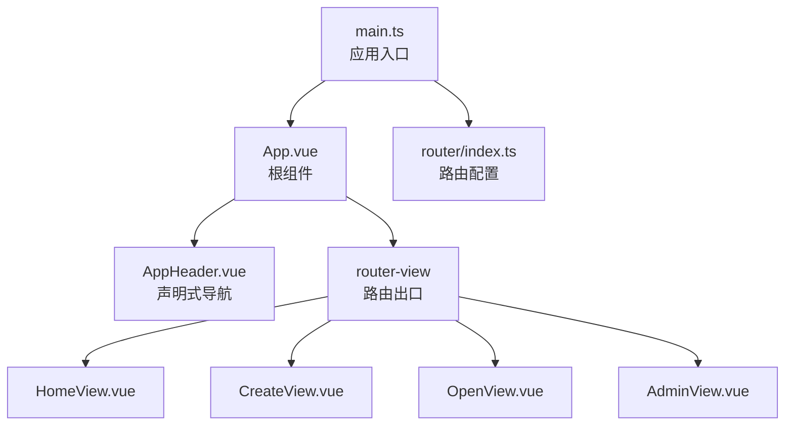
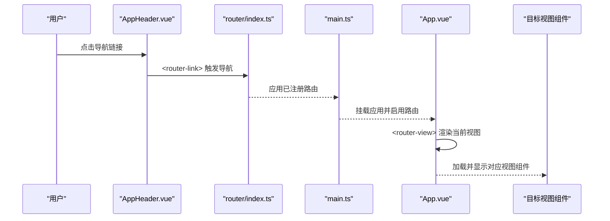
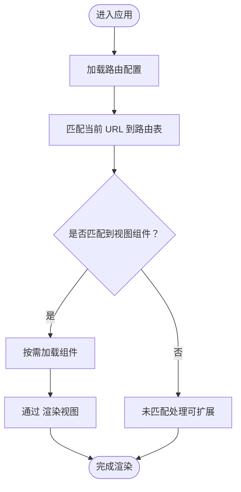
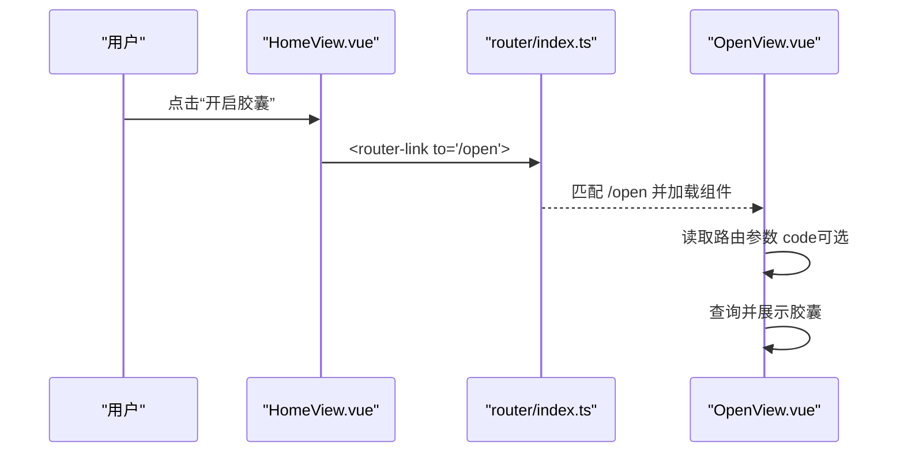
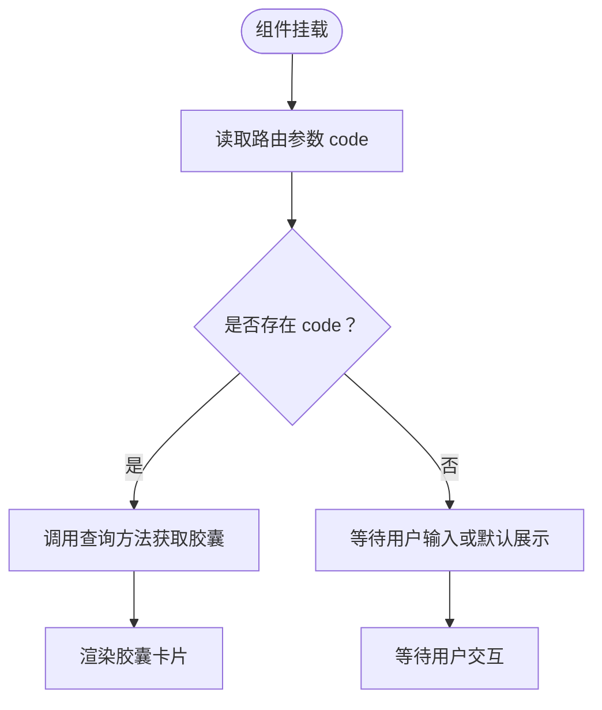
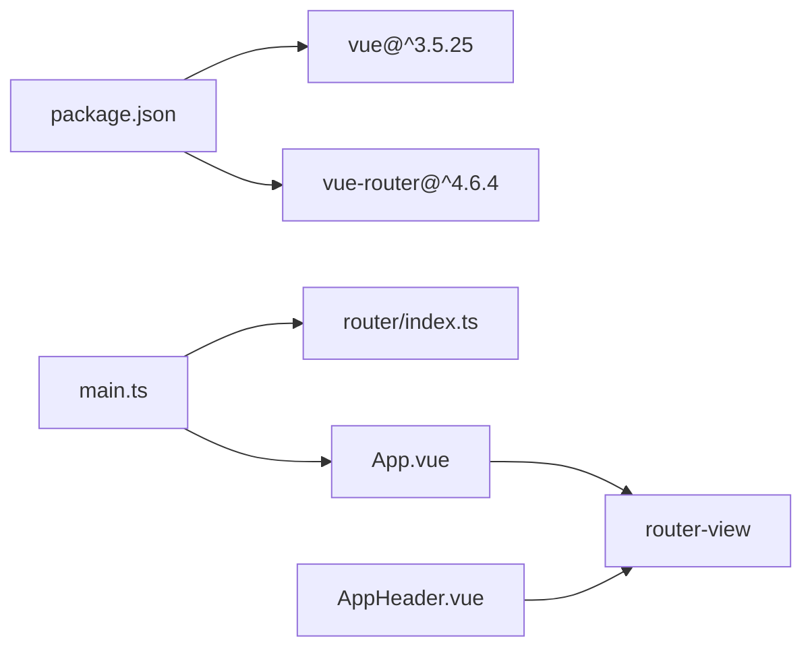

# 路由系统与导航

<cite>
**本文引用的文件**
- [router/index.ts](file://frontends/vue3-ts/src/router/index.ts)
- [main.ts](file://frontends/vue3-ts/src/main.ts)
- [App.vue](file://frontends/vue3-ts/src/App.vue)
- [AppHeader.vue](file://frontends/vue3-ts/src/components/AppHeader.vue)
- [HomeView.vue](file://frontends/vue3-ts/src/views/HomeView.vue)
- [CreateView.vue](file://frontends/vue3-ts/src/views/CreateView.vue)
- [OpenView.vue](file://frontends/vue3-ts/src/views/OpenView.vue)
- [AdminView.vue](file://frontends/vue3-ts/src/views/AdminView.vue)
- [package.json](file://frontends/vue3-ts/package.json)
</cite>

## 目录
1. [简介](#简介)
2. [项目结构](#项目结构)
3. [核心组件](#核心组件)
4. [架构总览](#架构总览)
5. [详细组件分析](#详细组件分析)
6. [依赖分析](#依赖分析)
7. [性能考虑](#性能考虑)
8. [故障排查指南](#故障排查指南)
9. [结论](#结论)
10. [附录](#附录)

## 简介
本文件面向 Vue 3 项目中的路由系统与导航，围绕以下目标展开：  
- 深入解析 Vue Router 的配置与使用，包括路由定义、动态路由参数、懒加载与代码分割。  
- 详解页面组件组织方式：HomeView（首页展示）、CreateView（创建页面）、AdminView（管理员界面）、OpenView（开启页面）。  
- 解释路由守卫（当前实现未使用，但提供扩展建议）、权限控制、页面元信息管理。  
- 对比程序化导航与声明式导航的差异与适用场景。  
- 提供路由配置最佳实践（命名规范、路径设计、SEO 优化）。  
- 给出路由调试技巧与常见问题解决方案。  
- 展示如何实现平滑的页面过渡动画与用户体验优化。

## 项目结构
该前端采用 Vue 3 + TypeScript + Vite 构建，路由位于 src/router/index.ts，页面视图位于 src/views，公共头部导航位于 src/components/AppHeader.vue，应用根组件为 src/App.vue，入口文件为 src/main.ts。

图表来源
- [main.ts:1-23](file://frontends/vue3-ts/src/main.ts#L1-L23)
- [App.vue:1-19](file://frontends/vue3-ts/src/App.vue#L1-L19)
- [AppHeader.vue:1-75](file://frontends/vue3-ts/src/components/AppHeader.vue#L1-L75)
- [router/index.ts:1-44](file://frontends/vue3-ts/src/router/index.ts#L1-L44)

章节来源
- [main.ts:1-23](file://frontends/vue3-ts/src/main.ts#L1-L23)
- [router/index.ts:1-44](file://frontends/vue3-ts/src/router/index.ts#L1-L44)
- [App.vue:1-19](file://frontends/vue3-ts/src/App.vue#L1-L19)

## 核心组件
- 路由配置：在 router/index.ts 中集中定义所有路由，使用 History 模式与按需加载组件，提升首屏性能。
- 应用根组件：App.vue 通过 <router-view> 渲染当前匹配的视图组件。
- 声明式导航：AppHeader.vue 使用 <router-link> 实现导航，自动高亮当前激活链接。
- 视图组件：
  - HomeView.vue：首页入口，提供“创建”“开启”两个主要入口。
  - CreateView.vue：创建胶囊流程，提交后展示结果并跳转至 OpenView。
  - OpenView.vue：根据路由参数读取胶囊码并查询展示。
  - AdminView.vue：管理员登录与管理功能入口。

章节来源
- [router/index.ts:11-41](file://frontends/vue3-ts/src/router/index.ts#L11-L41)
- [App.vue:3-5](file://frontends/vue3-ts/src/App.vue#L3-L5)
- [AppHeader.vue:4-14](file://frontends/vue3-ts/src/components/AppHeader.vue#L4-L14)
- [HomeView.vue:10-13](file://frontends/vue3-ts/src/views/HomeView.vue#L10-L13)
- [CreateView.vue:17](file://frontends/vue3-ts/src/views/CreateView.vue#L17)
- [OpenView.vue:34-44](file://frontends/vue3-ts/src/views/OpenView.vue#L34-L44)
- [AdminView.vue:8-38](file://frontends/vue3-ts/src/views/AdminView.vue#L8-L38)

## 架构总览
下图展示了从入口到视图渲染的完整链路，以及声明式导航与路由出口的关系。

图表来源
- [AppHeader.vue:4-14](file://frontends/vue3-ts/src/components/AppHeader.vue#L4-L14)
- [router/index.ts:11-41](file://frontends/vue3-ts/src/router/index.ts#L11-L41)
- [main.ts:16-19](file://frontends/vue3-ts/src/main.ts#L16-L19)
- [App.vue:3-5](file://frontends/vue3-ts/src/App.vue#L3-L5)

## 详细组件分析

### 路由配置与导航
- 路由模式：History 模式，URL 不带 #，需服务端配置支持。
- 路由表：包含首页、创建、开启（含可选参数）、关于、管理员后台。
- 动态路由参数：/open/:code? 支持无参与带参两种访问形式。
- 懒加载：各视图组件均以函数形式按需导入，实现代码分割与首屏优化。

图表来源
- [router/index.ts:13-41](file://frontends/vue3-ts/src/router/index.ts#L13-L41)
- [App.vue:3-5](file://frontends/vue3-ts/src/App.vue#L3-L5)

章节来源
- [router/index.ts:11-41](file://frontends/vue3-ts/src/router/index.ts#L11-L41)
- [package.json:13-28](file://frontends/vue3-ts/package.json#L13-L28)

### 声明式导航与页面组织
- 声明式导航：AppHeader.vue 使用 <router-link> 连接首页、创建、开启、关于等页面，自动高亮当前页。
- 页面组织：
  - HomeView.vue：提供“创建胶囊”“开启胶囊”两大入口，引导用户流转。
  - CreateView.vue：提交后生成胶囊码，提供“查看胶囊”跳转至 OpenView。
  - OpenView.vue：接收路由参数 code，自动查询并展示胶囊详情。
  - AdminView.vue：管理员登录与管理入口，内部组合 AdminLogin 与 CapsuleTable。

图表来源
- [HomeView.vue:10-13](file://frontends/vue3-ts/src/views/HomeView.vue#L10-L13)
- [router/index.ts:24-29](file://frontends/vue3-ts/src/router/index.ts#L24-L29)
- [OpenView.vue:34-44](file://frontends/vue3-ts/src/views/OpenView.vue#L34-L44)

章节来源
- [AppHeader.vue:4-14](file://frontends/vue3-ts/src/components/AppHeader.vue#L4-L14)
- [HomeView.vue:10-13](file://frontends/vue3-ts/src/views/HomeView.vue#L10-L13)
- [CreateView.vue:17](file://frontends/vue3-ts/src/views/CreateView.vue#L17)
- [OpenView.vue:34-44](file://frontends/vue3-ts/src/views/OpenView.vue#L34-L44)
- [AdminView.vue:8-38](file://frontends/vue3-ts/src/views/AdminView.vue#L8-L38)

### 动态路由参数与程序化导航
- 动态参数：/open/:code? 支持可选参数，便于直接分享链接或预填参数。
- 程序化导航：可在组件内通过 useRouter 获取路由实例，调用 push/replace 等方法进行跳转；当前 OpenView 在挂载时读取路由参数并触发查询，属于“基于参数的程序化行为”。

图表来源
- [OpenView.vue:34-44](file://frontends/vue3-ts/src/views/OpenView.vue#L34-L44)

章节来源
- [router/index.ts:24-29](file://frontends/vue3-ts/src/router/index.ts#L24-L29)
- [OpenView.vue:34-44](file://frontends/vue3-ts/src/views/OpenView.vue#L34-L44)

### 路由守卫与权限控制（扩展建议）
当前路由未使用导航守卫。若需实现权限控制与页面元信息管理，可在路由配置中扩展：
- 前置守卫：在进入路由前校验用户状态与权限。
- 权限控制：结合用户角色与路由元信息，决定是否放行。
- 页面元信息：在路由记录上添加 title、meta 等字段，配合插件实现 SEO 与标题更新。

（本节为概念性扩展，不直接分析具体文件）

### 页面过渡动画与用户体验优化
- 页面切换动画：可通过 <router-view> 结合过渡组件实现页面级过渡效果，提升视觉连贯性。
- 用户体验优化：保持导航高亮状态一致、避免长列表闪烁、合理使用骨架屏与错误提示。

（本节为通用指导，不直接分析具体文件）

## 依赖分析
- 依赖关系：main.ts 引入并注册 router，App.vue 通过 <router-view> 渲染视图；AppHeader.vue 使用 <router-link> 发起导航。
- 外部依赖：vue 与 vue-router 由 package.json 管理。

图表来源
- [package.json:13-28](file://frontends/vue3-ts/package.json#L13-L28)
- [main.ts:7](file://frontends/vue3-ts/src/main.ts#L7)
- [router/index.ts:11-41](file://frontends/vue3-ts/src/router/index.ts#L11-L41)
- [App.vue:3-5](file://frontends/vue3-ts/src/App.vue#L3-L5)
- [AppHeader.vue:4-14](file://frontends/vue3-ts/src/components/AppHeader.vue#L4-L14)

章节来源
- [package.json:13-28](file://frontends/vue3-ts/package.json#L13-L28)
- [main.ts:7](file://frontends/vue3-ts/src/main.ts#L7)

## 性能考虑
- 懒加载与代码分割：路由层按需加载组件，减少首屏体积。
- 路由模式：History 模式利于 SEO 与分享，需服务端正确配置回退。
- 组件缓存：对频繁切换的页面可考虑 keep-alive 缓存，降低重复渲染成本。
- 资源优化：结合构建工具的分包策略，进一步拆分第三方库与业务代码。

（本节为通用指导，不直接分析具体文件）

## 故障排查指南
- 路由无法匹配：
  - 检查路由路径大小写与参数命名是否一致。
  - 确认 History 模式下服务端已正确配置回退到 index.html。
- 导航不生效：
  - 确保 <router-link> 的 to 属性值与路由 name 或 path 匹配。
  - 若使用编程式导航，确保在组件生命周期内调用（如 onMounted 后）。
- 参数读取异常：
  - 在组件中使用 useRoute 获取 params，注意可选参数的默认值处理。
- 样式与主题：
  - AppHeader.vue 使用了 router-link-active 类名，确保导航高亮样式正常。

章节来源
- [router/index.ts:11-41](file://frontends/vue3-ts/src/router/index.ts#L11-L41)
- [AppHeader.vue:63-66](file://frontends/vue3-ts/src/components/AppHeader.vue#L63-L66)
- [OpenView.vue:34-44](file://frontends/vue3-ts/src/views/OpenView.vue#L34-L44)

## 结论
本项目采用简洁清晰的路由配置与声明式导航，结合懒加载实现良好的首屏性能。通过在现有基础上引入路由守卫、页面元信息与过渡动画，可进一步完善权限控制与用户体验。建议在后续迭代中补充路由测试与服务端回退配置验证，确保生产环境稳定可用。

## 附录

### 路由配置最佳实践
- 命名规范：路由 name 使用语义化英文小写，如 home、create、open、admin、about。
- 路径设计：采用层级化路径，如 /open/:code? 表达“打开胶囊”的可选参数语义。
- SEO 优化：结合 meta 字段与插件设置页面标题与描述；History 模式需服务端回退配置。
- 错误处理：为未匹配路由预留兜底页面，避免白屏。

（本节为通用指导，不直接分析具体文件）