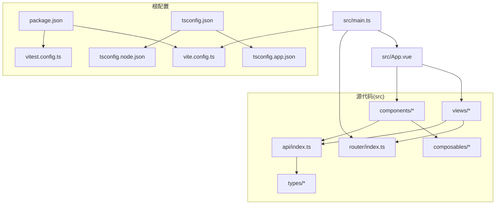
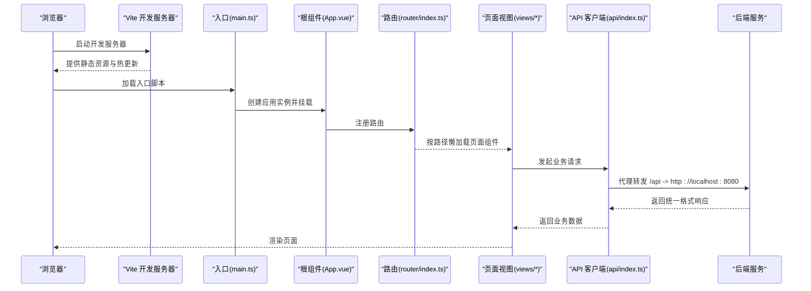
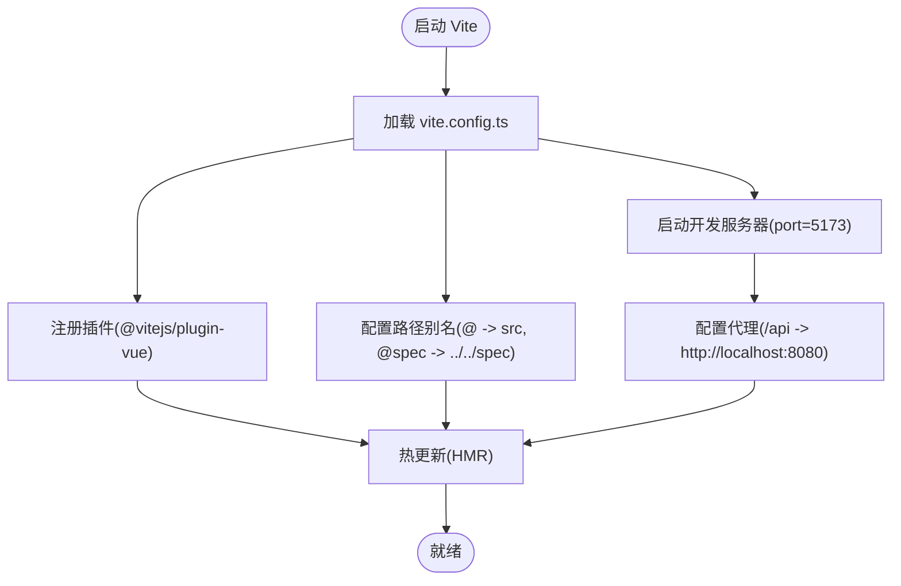
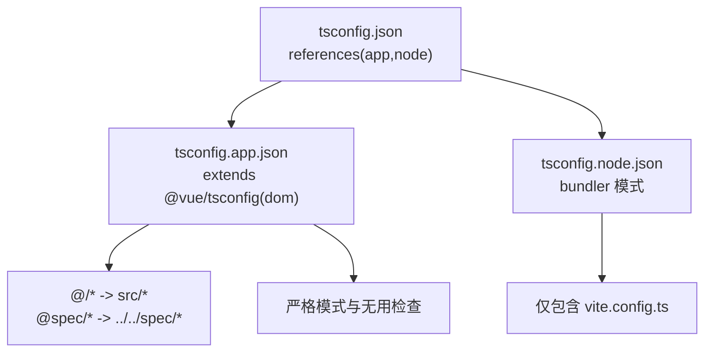
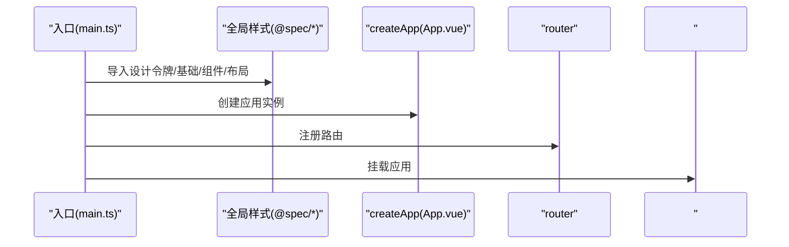
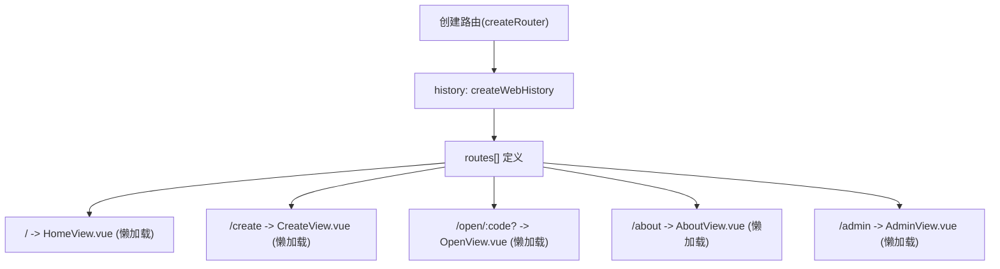
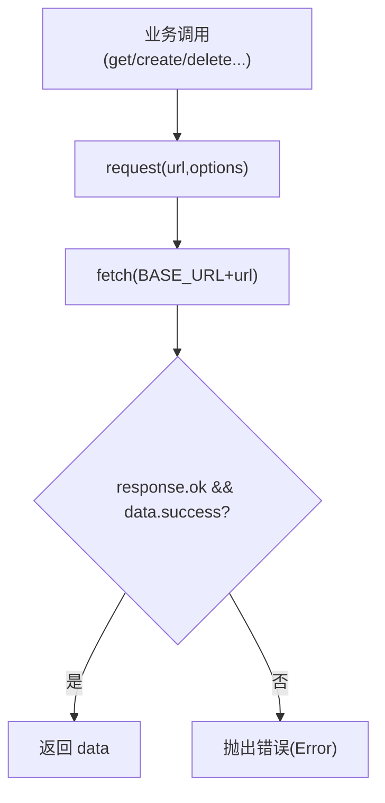
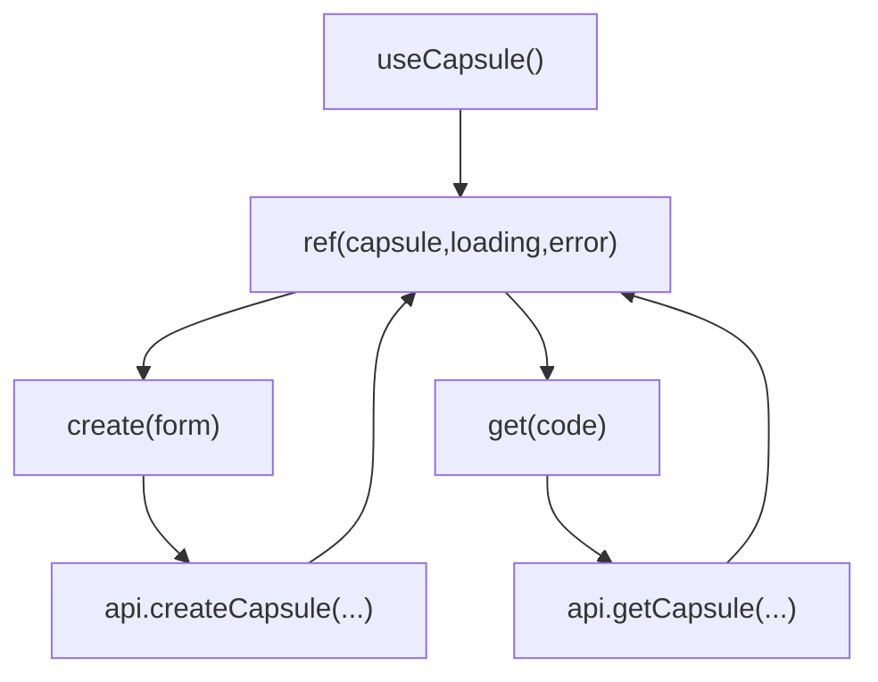
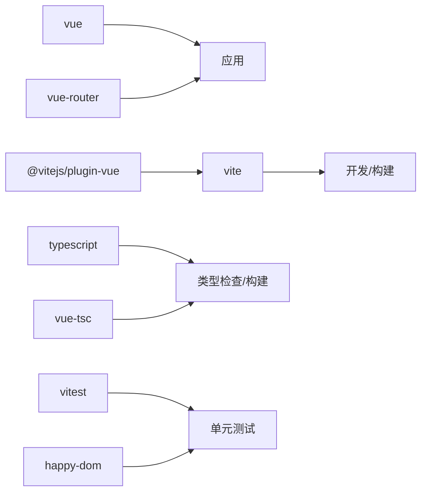

# 项目架构与配置

<cite>
**本文引用的文件**
- [package.json](file://frontends/vue3-ts/package.json)
- [vite.config.ts](file://frontends/vue3-ts/vite.config.ts)
- [tsconfig.json](file://frontends/vue3-ts/tsconfig.json)
- [tsconfig.app.json](file://frontends/vue3-ts/tsconfig.app.json)
- [tsconfig.node.json](file://frontends/vue3-ts/tsconfig.node.json)
- [vitest.config.ts](file://frontends/vue3-ts/vitest.config.ts)
- [main.ts](file://frontends/vue3-ts/src/main.ts)
- [App.vue](file://frontends/vue3-ts/src/App.vue)
- [HomeView.vue](file://frontends/vue3-ts/src/views/HomeView.vue)
- [AppHeader.vue](file://frontends/vue3-ts/src/components/AppHeader.vue)
- [AppFooter.vue](file://frontends/vue3-ts/src/components/AppFooter.vue)
- [useCapsule.ts](file://frontends/vue3-ts/src/composables/useCapsule.ts)
- [index.ts](file://frontends/vue3-ts/src/api/index.ts)
- [index.ts](file://frontends/vue3-ts/src/router/index.ts)
</cite>

## 目录
1. [引言](#引言)
2. [项目结构](#项目结构)
3. [核心组件](#核心组件)
4. [架构总览](#架构总览)
5. [详细组件分析](#详细组件分析)
6. [依赖分析](#依赖分析)
7. [性能考虑](#性能考虑)
8. [故障排查指南](#故障排查指南)
9. [结论](#结论)
10. [附录](#附录)

## 引言
本文件面向 Vue 3 + TypeScript 前端工程，系统性梳理项目架构与配置，重点覆盖以下方面：
- Vite 构建工具的配置与优化策略
- TypeScript 编译配置、模块解析与路径别名
- 目录结构设计理念与模块化导入导出规范
- 应用入口 main.ts 的初始化流程与全局样式注入
- 开发服务器、代理与热更新机制
- 构建优化（代码分割、Tree Shaking、压缩策略）
- 性能优化建议与调试技巧

## 项目结构
该前端工程位于 frontends/vue3-ts，采用“功能域+类型约束”的组织方式：
- src 目录按功能域划分：views（页面）、components（通用组件）、composables（组合式逻辑）、router（路由）、api（接口封装）、types（类型定义）
- 根级配置文件集中管理：package.json（脚本与依赖）、vite.config.ts（开发/构建配置）、tsconfig.*（编译配置）、vitest.config.ts（测试配置）
- 规范化的模块导入通过路径别名实现，提升可读性与可维护性

图表来源
- [main.ts:1-23](file://frontends/vue3-ts/src/main.ts#L1-L23)
- [App.vue:1-19](file://frontends/vue3-ts/src/App.vue#L1-L19)
- [index.ts:1-44](file://frontends/vue3-ts/src/router/index.ts#L1-L44)
- [index.ts:1-120](file://frontends/vue3-ts/src/api/index.ts#L1-L120)
- [package.json:1-30](file://frontends/vue3-ts/package.json#L1-L30)
- [vite.config.ts:1-23](file://frontends/vue3-ts/vite.config.ts#L1-L23)
- [tsconfig.json:1-8](file://frontends/vue3-ts/tsconfig.json#L1-L8)
- [tsconfig.app.json:1-22](file://frontends/vue3-ts/tsconfig.app.json#L1-L22)
- [tsconfig.node.json:1-27](file://frontends/vue3-ts/tsconfig.node.json#L1-L27)
- [vitest.config.ts:1-18](file://frontends/vue3-ts/vitest.config.ts#L1-L18)

章节来源
- [package.json:1-30](file://frontends/vue3-ts/package.json#L1-L30)
- [vite.config.ts:1-23](file://frontends/vue3-ts/vite.config.ts#L1-L23)
- [tsconfig.json:1-8](file://frontends/vue3-ts/tsconfig.json#L1-L8)
- [tsconfig.app.json:1-22](file://frontends/vue3-ts/tsconfig.app.json#L1-L22)
- [tsconfig.node.json:1-27](file://frontends/vue3-ts/tsconfig.node.json#L1-L27)
- [vitest.config.ts:1-18](file://frontends/vue3-ts/vitest.config.ts#L1-L18)

## 核心组件
- 应用入口与初始化：在入口文件中创建应用实例、注册路由、导入全局样式，随后挂载到 DOM 容器
- 路由系统：基于 History 模式的懒加载路由表，支持首页、创建、打开、关于、管理后台等页面
- 接口层：统一封装 fetch 请求、错误处理与业务路径，统一响应结构
- 组合式逻辑：如 useCapsule 提供创建/查询胶囊的响应式状态与方法
- 全局样式：通过 spec 目录引入设计令牌、基础样式、组件样式与布局工具类

章节来源
- [main.ts:1-23](file://frontends/vue3-ts/src/main.ts#L1-L23)
- [index.ts:1-44](file://frontends/vue3-ts/src/router/index.ts#L1-L44)
- [index.ts:1-120](file://frontends/vue3-ts/src/api/index.ts#L1-L120)
- [useCapsule.ts:1-65](file://frontends/vue3-ts/src/composables/useCapsule.ts#L1-L65)
- [App.vue:1-19](file://frontends/vue3-ts/src/App.vue#L1-L19)

## 架构总览
下图展示从入口到页面渲染、接口调用与样式注入的整体流程。

图表来源
- [main.ts:1-23](file://frontends/vue3-ts/src/main.ts#L1-L23)
- [App.vue:1-19](file://frontends/vue3-ts/src/App.vue#L1-L19)
- [index.ts:1-44](file://frontends/vue3-ts/src/router/index.ts#L1-L44)
- [index.ts:1-120](file://frontends/vue3-ts/src/api/index.ts#L1-L120)
- [vite.config.ts:13-22](file://frontends/vue3-ts/vite.config.ts#L13-L22)

## 详细组件分析

### Vite 配置与开发服务器
- 插件与解析：启用 @vitejs/plugin-vue，配置路径别名 @ 指向 src，@spec 指向 spec
- 开发服务器：端口 5173，默认代理 /api 到本地后端 8080，支持跨域
- 热更新：Vite 默认提供模块热替换，无需额外配置

图表来源
- [vite.config.ts:1-23](file://frontends/vue3-ts/vite.config.ts#L1-L23)

章节来源
- [vite.config.ts:1-23](file://frontends/vue3-ts/vite.config.ts#L1-L23)

### TypeScript 配置与模块解析
- 根配置：通过 references 引入 app 与 node 两套配置，实现分层编译
- 应用配置（tsconfig.app.json）：
  - 继承 @vue/tsconfig 的 DOM 目标
  - 设置 baseUrl 与 paths，确保路径别名与运行时一致
  - 启用严格模式与无用检查，减少潜在问题
- Node 配置（tsconfig.node.json）：
  - 面向 Vite 配置文件的 bundler 模式，使用 ESNext 模块解析
  - 仅包含 vite.config.ts，避免类型污染

图表来源
- [tsconfig.json:1-8](file://frontends/vue3-ts/tsconfig.json#L1-L8)
- [tsconfig.app.json:1-22](file://frontends/vue3-ts/tsconfig.app.json#L1-L22)
- [tsconfig.node.json:1-27](file://frontends/vue3-ts/tsconfig.node.json#L1-L27)

章节来源
- [tsconfig.json:1-8](file://frontends/vue3-ts/tsconfig.json#L1-L8)
- [tsconfig.app.json:1-22](file://frontends/vue3-ts/tsconfig.app.json#L1-L22)
- [tsconfig.node.json:1-27](file://frontends/vue3-ts/tsconfig.node.json#L1-L27)

### 应用入口与初始化流程
- 全局样式：入口导入 @spec 下的设计令牌、基础、组件与布局样式，保证主题一致性
- 应用实例：创建 Vue 应用，注册路由，最后挂载到 #app
- 初始化顺序：样式 → 应用 → 路由 → 挂载

图表来源
- [main.ts:1-23](file://frontends/vue3-ts/src/main.ts#L1-L23)

章节来源
- [main.ts:1-23](file://frontends/vue3-ts/src/main.ts#L1-L23)

### 路由系统与页面懒加载
- 历史模式：使用 createWebHistory，URL 不带 #，需后端配合
- 懒加载：各页面组件通过动态 import 实现按需加载
- 路由表：包含首页、创建、打开、关于、管理后台等路径

图表来源
- [index.ts:1-44](file://frontends/vue3-ts/src/router/index.ts#L1-L44)

章节来源
- [index.ts:1-44](file://frontends/vue3-ts/src/router/index.ts#L1-L44)

### API 客户端与统一错误处理
- 基础路径：/api/v1
- 通用请求封装：统一 Content-Type、序列化与反序列化、错误分支（HTTP 非 2xx 或业务 success=false）
- 业务接口：创建胶囊、查询胶囊、管理员登录、分页查询、删除胶囊、健康信息

图表来源
- [index.ts:1-120](file://frontends/vue3-ts/src/api/index.ts#L1-L120)

章节来源
- [index.ts:1-120](file://frontends/vue3-ts/src/api/index.ts#L1-L120)

### 组合式逻辑 useCapsule
- 状态：胶囊数据、加载状态、错误信息
- 方法：创建胶囊、查询胶囊
- 返回值：将状态与方法暴露给组件使用，便于复用

图表来源
- [useCapsule.ts:1-65](file://frontends/vue3-ts/src/composables/useCapsule.ts#L1-L65)
- [index.ts:1-120](file://frontends/vue3-ts/src/api/index.ts#L1-L120)

章节来源
- [useCapsule.ts:1-65](file://frontends/vue3-ts/src/composables/useCapsule.ts#L1-L65)

### 页面与组件示例
- App.vue：承载头部、主内容区与底部，主内容区由 <router-view> 渲染当前路由
- HomeView.vue：首页展示、特性卡片与操作按钮
- AppHeader.vue：导航与主题切换
- AppFooter.vue：动态展示后端健康信息中的技术栈

章节来源
- [App.vue:1-19](file://frontends/vue3-ts/src/App.vue#L1-L19)
- [HomeView.vue:1-65](file://frontends/vue3-ts/src/views/HomeView.vue#L1-L65)
- [AppHeader.vue:1-75](file://frontends/vue3-ts/src/components/AppHeader.vue#L1-L75)
- [AppFooter.vue:1-46](file://frontends/vue3-ts/src/components/AppFooter.vue#L1-L46)

## 依赖分析
- 运行时依赖：vue、vue-router
- 开发依赖：@vitejs/plugin-vue、vite、typescript、vue-tsc、vitest、@vue/test-utils、@testing-library/vue、happy-dom、@vue/tsconfig
- 脚本命令：dev、build、preview、test、test:watch

图表来源
- [package.json:1-30](file://frontends/vue3-ts/package.json#L1-L30)

章节来源
- [package.json:1-30](file://frontends/vue3-ts/package.json#L1-L30)

## 性能考虑
- 代码分割：路由懒加载与动态 import 已默认启用，减少首屏体积
- Tree Shaking：保持 ES 模块语法、启用严格模式与无用检查，利于打包器剔除未使用代码
- 压缩策略：生产构建由 Vite 默认启用，可结合插件进一步优化
- 资源优化：图片与静态资源建议通过 @spec 引入统一设计系统，避免重复与冗余
- 代理与网络：开发阶段通过 /api 代理至后端，减少跨域与 CORS 复杂度

## 故障排查指南
- 代理无效：确认 vite.config.ts 中 /api 代理目标与后端端口一致；检查 changeOrigin 是否启用
- 路由 404：History 模式需后端支持，确保服务器正确回退到 index.html
- 类型错误：检查 tsconfig.app.json 与 tsconfig.node.json 的 paths 与 moduleResolution 是否匹配实际运行环境
- 测试环境：vitest.config.ts 使用 happy-dom，若出现 DOM API 缺失，需补充相应 polyfill 或调整测试策略
- 样式不生效：确认 main.ts 中 @spec 样式导入顺序与作用域样式冲突

章节来源
- [vite.config.ts:13-22](file://frontends/vue3-ts/vite.config.ts#L13-L22)
- [tsconfig.app.json:1-22](file://frontends/vue3-ts/tsconfig.app.json#L1-L22)
- [tsconfig.node.json:1-27](file://frontends/vue3-ts/tsconfig.node.json#L1-L27)
- [vitest.config.ts:1-18](file://frontends/vue3-ts/vitest.config.ts#L1-L18)
- [main.ts:1-23](file://frontends/vue3-ts/src/main.ts#L1-L23)

## 结论
本项目以 Vite 为核心，结合 Vue 3 + TypeScript，形成清晰的模块化架构与严格的类型约束。通过路径别名、路由懒加载、统一 API 封装与组合式逻辑，提升了可维护性与可扩展性。建议在后续迭代中持续关注打包体积、路由历史模式的后端支持与测试覆盖率，以保障开发体验与运行性能。

## 附录
- 开发命令：npm run dev（启动开发服务器）
- 构建命令：npm run build（先类型检查再构建）
- 预览命令：npm run preview（本地预览生产包）
- 测试命令：npm run test / npm run test:watch

章节来源
- [package.json:6-12](file://frontends/vue3-ts/package.json#L6-L12)