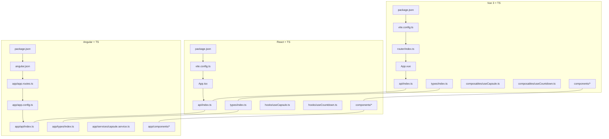
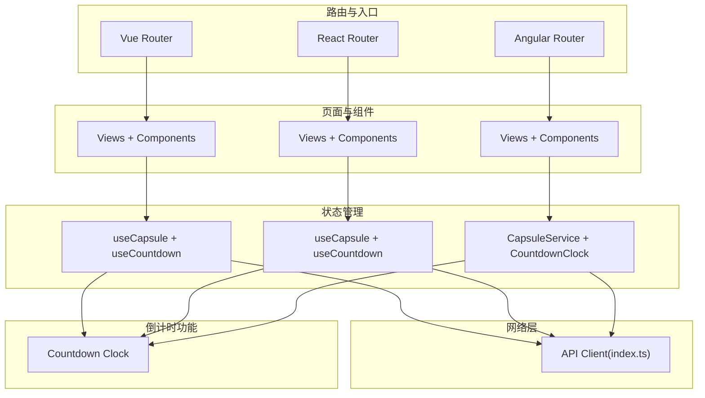
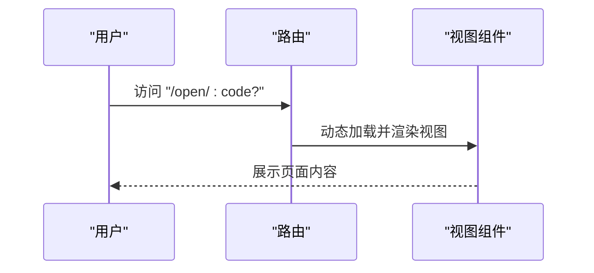
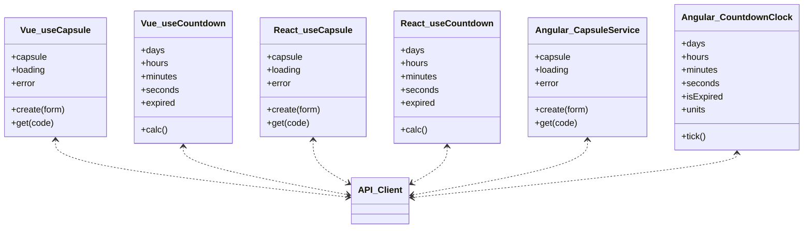
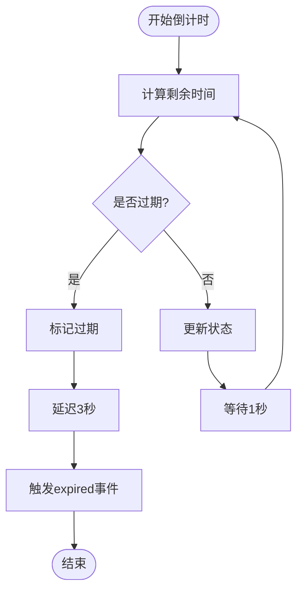
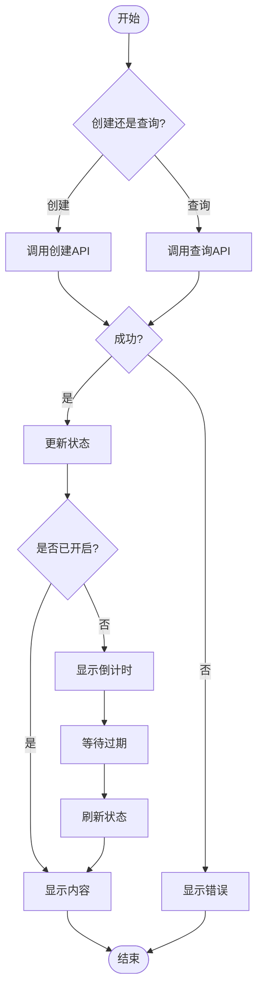
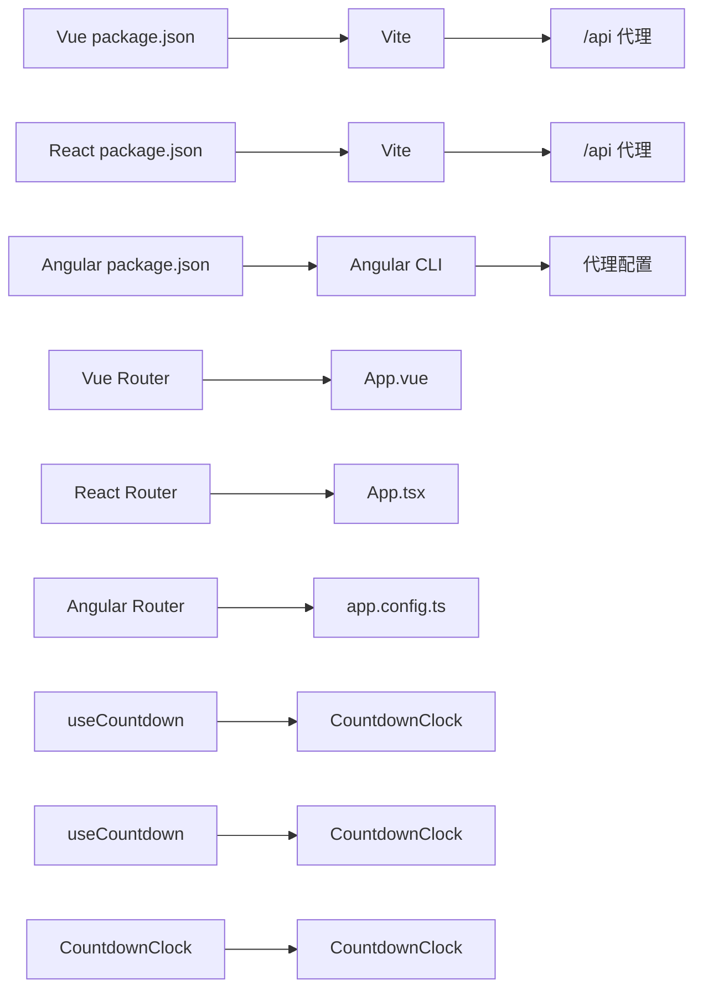

# 前端实现详解

<cite>
**本文引用的文件**
- [frontends/vue3-ts/package.json](file://frontends/vue3-ts/package.json)
- [frontends/vue3-ts/vite.config.ts](file://frontends/vue3-ts/vite.config.ts)
- [frontends/vue3-ts/src/router/index.ts](file://frontends/vue3-ts/src/router/index.ts)
- [frontends/vue3-ts/src/App.vue](file://frontends/vue3-ts/src/App.vue)
- [frontends/vue3-ts/src/composables/useCapsule.ts](file://frontends/vue3-ts/src/composables/useCapsule.ts)
- [frontends/vue3-ts/src/composables/useCountdown.ts](file://frontends/vue3-ts/src/composables/useCountdown.ts)
- [frontends/vue3-ts/src/api/index.ts](file://frontends/vue3-ts/src/api/index.ts)
- [frontends/vue3-ts/src/components/CountdownClock.vue](file://frontends/vue3-ts/src/components/CountdownClock.vue)
- [frontends/vue3-ts/src/components/CapsuleCard.vue](file://frontends/vue3-ts/src/components/CapsuleCard.vue)
- [frontends/vue3-ts/src/views/OpenView.vue](file://frontends/vue3-ts/src/views/OpenView.vue)
- [frontends/react-ts/package.json](file://frontends/react-ts/package.json)
- [frontends/react-ts/vite.config.ts](file://frontends/react-ts/vite.config.ts)
- [frontends/react-ts/src/App.tsx](file://frontends/react-ts/src/App.tsx)
- [frontends/react-ts/src/hooks/useCapsule.ts](file://frontends/react-ts/src/hooks/useCapsule.ts)
- [frontends/react-ts/src/hooks/useCountdown.ts](file://frontends/react-ts/src/hooks/useCountdown.ts)
- [frontends/react-ts/src/api/index.ts](file://frontends/react-ts/src/api/index.ts)
- [frontends/react-ts/src/components/CountdownClock.tsx](file://frontends/react-ts/src/components/CountdownClock.tsx)
- [frontends/react-ts/src/components/CapsuleCard.tsx](file://frontends/react-ts/src/components/CapsuleCard.tsx)
- [frontends/react-ts/src/views/OpenView.tsx](file://frontends/react-ts/src/views/OpenView.tsx)
- [frontends/angular-ts/package.json](file://frontends/angular-ts/package.json)
- [frontends/angular-ts/angular.json](file://frontends/angular-ts/angular.json)
- [frontends/angular-ts/src/app/app.routes.ts](file://frontends/angular-ts/src/app/app.routes.ts)
- [frontends/angular-ts/src/app/app.config.ts](file://frontends/angular-ts/src/app/app.config.ts)
- [frontends/angular-ts/src/app/services/capsule.service.ts](file://frontends/angular-ts/src/app/services/capsule.service.ts)
- [frontends/angular-ts/src/app/api/index.ts](file://frontends/angular-ts/src/app/api/index.ts)
- [frontends/angular-ts/src/app/components/countdown-clock/countdown-clock.component.ts](file://frontends/angular-ts/src/app/components/countdown-clock/countdown-clock.component.ts)
- [frontends/angular-ts/src/app/components/capsule-card/capsule-card.component.ts](file://frontends/angular-ts/src/app/components/capsule-card/capsule-card.component.ts)
- [frontends/angular-ts/src/app/views/open/open.component.ts](file://frontends/angular-ts/src/app/views/open/open.component.ts)
- [docs/design-tokens.md](file://docs/design-tokens.md)
- [spec/styles/tokens.css](file://spec/styles/tokens.css)
- [spec/styles/base.css](file://spec/styles/base.css)
- [spec/styles/components.css](file://spec/styles/components.css)
- [spec/styles/layout.css](file://spec/styles/layout.css)
</cite>

## 目录
1. [简介](#简介)
2. [项目结构](#项目结构)
3. [核心组件](#核心组件)
4. [架构总览](#架构总览)
5. [详细组件分析](#详细组件分析)
6. [依赖关系分析](#依赖关系分析)
7. [性能考量](#性能考量)
8. [故障排查指南](#故障排查指南)
9. [结论](#结论)
10. [附录](#附录)

## 简介
本文件面向HelloTime项目的前端实现，系统性对比三套前端框架的实现方案：Vue 3 + TypeScript、React + TypeScript、Angular 18 + TypeScript。重点覆盖以下方面：
- 项目结构与构建工具配置（Vite、Angular CLI）
- 路由系统设计与页面组织
- 统一功能实现：时间胶囊创建、查询、管理员管理、主题切换、倒计时功能
- 状态管理模式对比：Vue 3 Composition API、React Hooks、Angular Signals
- 组件架构设计：共享组件、页面组件、服务层
- 共享API客户端与类型定义的使用
- 样式系统：设计令牌、主题切换、响应式布局
- 各框架最佳实践与性能优化建议

## 项目结构
三个前端子项目均采用"按功能域"组织方式，核心目录划分如下：
- api：共享API客户端，封装REST调用与统一错误处理
- types：共享类型定义，确保前后端一致的数据契约
- components：可复用UI组件（如头部、底部、表单、卡片、倒计时等）
- views：页面级视图组件（Home、Create、Open、Admin、About）
- router（Vue）或路由配置（React/Angular）：页面路由与懒加载
- services（Angular）：可注入的服务层，承载业务状态与逻辑
- hooks（React）：自定义Hook，封装业务逻辑与状态
- composables（Vue）：组合式函数，封装业务逻辑与响应式状态
- styles：样式系统，基于设计令牌与CSS变量

**图表来源**
- [frontends/vue3-ts/package.json:1-30](file://frontends/vue3-ts/package.json#L1-L30)
- [frontends/vue3-ts/vite.config.ts:1-23](file://frontends/vue3-ts/vite.config.ts#L1-L23)
- [frontends/vue3-ts/src/router/index.ts:1-44](file://frontends/vue3-ts/src/router/index.ts#L1-L44)
- [frontends/vue3-ts/src/App.vue:1-19](file://frontends/vue3-ts/src/App.vue#L1-L19)
- [frontends/vue3-ts/src/api/index.ts:1-120](file://frontends/vue3-ts/src/api/index.ts#L1-L120)
- [frontends/vue3-ts/src/composables/useCountdown.ts:1-39](file://frontends/vue3-ts/src/composables/useCountdown.ts#L1-L39)
- [frontends/react-ts/package.json:1-31](file://frontends/react-ts/package.json#L1-L31)
- [frontends/react-ts/vite.config.ts:1-23](file://frontends/react-ts/vite.config.ts#L1-L23)
- [frontends/react-ts/src/App.tsx:1-31](file://frontends/react-ts/src/App.tsx#L1-L31)
- [frontends/react-ts/src/api/index.ts:1-94](file://frontends/react-ts/src/api/index.ts#L1-L94)
- [frontends/react-ts/src/hooks/useCountdown.ts:1-41](file://frontends/react-ts/src/hooks/useCountdown.ts#L1-L41)
- [frontends/angular-ts/package.json:1-38](file://frontends/angular-ts/package.json#L1-L38)
- [frontends/angular-ts/angular.json:1-108](file://frontends/angular-ts/angular.json#L1-L108)
- [frontends/angular-ts/src/app/app.routes.ts:1-35](file://frontends/angular-ts/src/app/app.routes.ts#L1-L35)
- [frontends/angular-ts/src/app/app.config.ts:1-14](file://frontends/angular-ts/src/app/app.config.ts#L1-L14)
- [frontends/angular-ts/src/app/api/index.ts:1-71](file://frontends/angular-ts/src/app/api/index.ts#L1-L71)

**章节来源**
- [frontends/vue3-ts/package.json:1-30](file://frontends/vue3-ts/package.json#L1-L30)
- [frontends/react-ts/package.json:1-31](file://frontends/react-ts/package.json#L1-L31)
- [frontends/angular-ts/package.json:1-38](file://frontends/angular-ts/package.json#L1-L38)

## 核心组件
- API客户端：统一封装fetch请求、序列化、错误处理与基础路径，保证三框架一致的网络层体验
- 类型定义：共享的响应体、胶囊模型、分页数据、管理员令牌等类型，确保跨框架一致性
- 页面视图：Home、Create、Open、Admin、About五大页面，覆盖核心用户旅程
- 共享组件：头部、底部、胶囊卡片、表单、确认对话框、主题切换、倒计时组件等
- 状态管理：
  - Vue：useCapsule组合式函数，基于ref与响应式数据；useCountdown倒计时组合式函数
  - React：useCapsule Hook，基于useState与useCallback；useCountdown倒计时Hook
  - Angular：CapsuleService，基于signal的可观察状态；CountdownClockComponent倒计时组件
- 主题切换：通过CSS变量与设计令牌驱动，支持明暗主题无缝切换
- 倒计时功能：统一的倒计时组件，支持天、时、分、秒显示与过期处理

**章节来源**
- [frontends/vue3-ts/src/api/index.ts:1-120](file://frontends/vue3-ts/src/api/index.ts#L1-L120)
- [frontends/react-ts/src/api/index.ts:1-94](file://frontends/react-ts/src/api/index.ts#L1-L94)
- [frontends/angular-ts/src/app/api/index.ts:1-71](file://frontends/angular-ts/src/app/api/index.ts#L1-L71)
- [frontends/vue3-ts/src/composables/useCapsule.ts:1-65](file://frontends/vue3-ts/src/composables/useCapsule.ts#L1-L65)
- [frontends/vue3-ts/src/composables/useCountdown.ts:1-39](file://frontends/vue3-ts/src/composables/useCountdown.ts#L1-L39)
- [frontends/react-ts/src/hooks/useCapsule.ts:1-48](file://frontends/react-ts/src/hooks/useCapsule.ts#L1-L48)
- [frontends/react-ts/src/hooks/useCountdown.ts:1-41](file://frontends/react-ts/src/hooks/useCountdown.ts#L1-L41)
- [frontends/angular-ts/src/app/services/capsule.service.ts:1-41](file://frontends/angular-ts/src/app/services/capsule.service.ts#L1-L41)
- [frontends/angular-ts/src/app/components/countdown-clock/countdown-clock.component.ts:1-67](file://frontends/angular-ts/src/app/components/countdown-clock/countdown-clock.component.ts#L1-L67)

## 架构总览
三框架在架构上保持一致的分层思想：UI层（组件/视图）、业务层（Hooks/Composables/Services）、网络层（API客户端）。路由负责页面导航与懒加载，构建工具负责开发服务器、代理与打包。新增的倒计时功能通过统一的组合式函数/Hook/组件实现，确保各框架间的一致性体验。

**图表来源**
- [frontends/vue3-ts/src/router/index.ts:1-44](file://frontends/vue3-ts/src/router/index.ts#L1-L44)
- [frontends/react-ts/src/App.tsx:1-31](file://frontends/react-ts/src/App.tsx#L1-L31)
- [frontends/angular-ts/src/app/app.routes.ts:1-35](file://frontends/angular-ts/src/app/app.routes.ts#L1-L35)
- [frontends/vue3-ts/src/composables/useCapsule.ts:1-65](file://frontends/vue3-ts/src/composables/useCapsule.ts#L1-L65)
- [frontends/vue3-ts/src/composables/useCountdown.ts:1-39](file://frontends/vue3-ts/src/composables/useCountdown.ts#L1-L39)
- [frontends/react-ts/src/hooks/useCapsule.ts:1-48](file://frontends/react-ts/src/hooks/useCapsule.ts#L1-L48)
- [frontends/react-ts/src/hooks/useCountdown.ts:1-41](file://frontends/react-ts/src/hooks/useCountdown.ts#L1-L41)
- [frontends/angular-ts/src/app/services/capsule.service.ts:1-41](file://frontends/angular-ts/src/app/services/capsule.service.ts#L1-L41)
- [frontends/angular-ts/src/app/components/countdown-clock/countdown-clock.component.ts:1-67](file://frontends/angular-ts/src/app/components/countdown-clock/countdown-clock.component.ts#L1-L67)
- [frontends/vue3-ts/src/api/index.ts:1-120](file://frontends/vue3-ts/src/api/index.ts#L1-L120)

## 详细组件分析

### 路由系统设计
- Vue 3：使用History模式的路由器，定义首页、创建、打开、关于、管理员五个路由，均采用动态导入实现懒加载
- React：BrowserRouter包裹Routes，使用React.lazy与Suspense实现视图懒加载
- Angular：基于路由配置routes，支持可选参数与组件输入绑定，结合withComponentInputBinding启用

**图表来源**
- [frontends/vue3-ts/src/router/index.ts:14-29](file://frontends/vue3-ts/src/router/index.ts#L14-L29)
- [frontends/react-ts/src/App.tsx:18-24](file://frontends/react-ts/src/App.tsx#L18-L24)
- [frontends/angular-ts/src/app/app.routes.ts:14-23](file://frontends/angular-ts/src/app/app.routes.ts#L14-L23)

**章节来源**
- [frontends/vue3-ts/src/router/index.ts:1-44](file://frontends/vue3-ts/src/router/index.ts#L1-L44)
- [frontends/react-ts/src/App.tsx:1-31](file://frontends/react-ts/src/App.tsx#L1-L31)
- [frontends/angular-ts/src/app/app.routes.ts:1-35](file://frontends/angular-ts/src/app/app.routes.ts#L1-L35)

### 状态管理模式对比
- Vue 3 Composition API：useCapsule基于ref声明响应式状态，useCountdown基于ref和定时器实现倒计时逻辑，集中封装创建与查询、倒计时逻辑，便于在模板与逻辑间共享
- React Hooks：useCapsule基于useState与useCallback，useCountdown基于useState与useEffect，将状态与异步逻辑封装在Hook内，组件通过Hook消费
- Angular Signals：CapsuleService使用signal暴露只读状态，CountdownClockComponent使用signals管理倒计时状态，异步方法在服务/组件内部更新信号，组件通过依赖注入使用

**图表来源**
- [frontends/vue3-ts/src/composables/useCapsule.ts:10-64](file://frontends/vue3-ts/src/composables/useCapsule.ts#L10-L64)
- [frontends/vue3-ts/src/composables/useCountdown.ts:11-38](file://frontends/vue3-ts/src/composables/useCountdown.ts#L11-L38)
- [frontends/react-ts/src/hooks/useCapsule.ts:9-47](file://frontends/react-ts/src/hooks/useCapsule.ts#L9-L47)
- [frontends/react-ts/src/hooks/useCountdown.ts:11-40](file://frontends/react-ts/src/hooks/useCountdown.ts#L11-L40)
- [frontends/angular-ts/src/app/services/capsule.service.ts:6-40](file://frontends/angular-ts/src/app/services/capsule.service.ts#L6-L40)
- [frontends/angular-ts/src/app/components/countdown-clock/countdown-clock.component.ts:14-66](file://frontends/angular-ts/src/app/components/countdown-clock/countdown-clock.component.ts#L14-L66)

**章节来源**
- [frontends/vue3-ts/src/composables/useCapsule.ts:1-65](file://frontends/vue3-ts/src/composables/useCapsule.ts#L1-L65)
- [frontends/vue3-ts/src/composables/useCountdown.ts:1-39](file://frontends/vue3-ts/src/composables/useCountdown.ts#L1-L39)
- [frontends/react-ts/src/hooks/useCapsule.ts:1-48](file://frontends/react-ts/src/hooks/useCapsule.ts#L1-L48)
- [frontends/react-ts/src/hooks/useCountdown.ts:1-41](file://frontends/react-ts/src/hooks/useCountdown.ts#L1-L41)
- [frontends/angular-ts/src/app/services/capsule.service.ts:1-41](file://frontends/angular-ts/src/app/services/capsule.service.ts#L1-L41)
- [frontends/angular-ts/src/app/components/countdown-clock/countdown-clock.component.ts:1-67](file://frontends/angular-ts/src/app/components/countdown-clock/countdown-clock.component.ts#L1-L67)

### 倒计时功能实现
新增的倒计时功能在三个框架中实现了高度一致的用户体验：

#### Vue 3实现
- 使用useCountdown组合式函数管理倒计时状态
- 通过computed属性生成天、时、分、秒的单位数组
- 使用watch监听expired状态变化，在过期后延迟3秒触发expired事件
- CountdownClock组件接收targetIso属性，显示倒计时界面

#### React实现
- useCountdown Hook基于useState和useEffect实现定时更新
- 每秒计算剩余时间，自动清理过期定时器
- CountdownClock组件支持onExpired回调，处理过期后的业务逻辑

#### Angular实现
- CountdownClockComponent使用signals管理倒计时状态
- 在ngOnInit中启动定时器，ngOnDestroy中清理定时器
- 支持@Input和@Output装饰器，实现父子组件通信

**图表来源**
- [frontends/vue3-ts/src/composables/useCountdown.ts:11-38](file://frontends/vue3-ts/src/composables/useCountdown.ts#L11-L38)
- [frontends/vue3-ts/src/components/CountdownClock.vue:33-41](file://frontends/vue3-ts/src/components/CountdownClock.vue#L33-L41)
- [frontends/react-ts/src/hooks/useCountdown.ts:11-40](file://frontends/react-ts/src/hooks/useCountdown.ts#L11-L40)
- [frontends/react-ts/src/components/CountdownClock.tsx:14-21](file://frontends/react-ts/src/components/CountdownClock.tsx#L14-L21)
- [frontends/angular-ts/src/app/components/countdown-clock/countdown-clock.component.ts:34-61](file://frontends/angular-ts/src/app/components/countdown-clock/countdown-clock.component.ts#L34-L61)

**章节来源**
- [frontends/vue3-ts/src/composables/useCountdown.ts:1-39](file://frontends/vue3-ts/src/composables/useCountdown.ts#L1-L39)
- [frontends/vue3-ts/src/components/CountdownClock.vue:1-167](file://frontends/vue3-ts/src/components/CountdownClock.vue#L1-L167)
- [frontends/react-ts/src/hooks/useCountdown.ts:1-41](file://frontends/react-ts/src/hooks/useCountdown.ts#L1-L41)
- [frontends/react-ts/src/components/CountdownClock.tsx:1-58](file://frontends/react-ts/src/components/CountdownClock.tsx#L1-L58)
- [frontends/angular-ts/src/app/components/countdown-clock/countdown-clock.component.ts:1-67](file://frontends/angular-ts/src/app/components/countdown-clock/countdown-clock.component.ts#L1-L67)

### 组件架构设计
- 共享组件：头部、底部、胶囊卡片、表单、确认对话框、主题切换、倒计时等，三框架均以相同命名与职责组织
- 页面组件：Home、Create、Open、Admin、About，分别承载不同业务场景
- 服务层（Angular）：将业务状态与逻辑下沉至服务，组件通过依赖注入使用
- 构建与开发：Vite提供热更新与代理；Angular CLI提供完整的开发与测试工具链
- 倒计时集成：在CapsuleCard组件中集成倒计时组件，实现未到开启时间的视觉反馈

**章节来源**
- [frontends/vue3-ts/src/App.vue:1-19](file://frontends/vue3-ts/src/App.vue#L1-L19)
- [frontends/react-ts/src/App.tsx:12-30](file://frontends/react-ts/src/App.tsx#L12-L30)
- [frontends/angular-ts/src/app/app.config.ts:7-13](file://frontends/angular-ts/src/app/app.config.ts#L7-L13)
- [frontends/vue3-ts/src/components/CapsuleCard.vue:24-28](file://frontends/vue3-ts/src/components/CapsuleCard.vue#L24-L28)
- [frontends/react-ts/src/components/CapsuleCard.tsx:44-50](file://frontends/react-ts/src/components/CapsuleCard.tsx#L44-L50)
- [frontends/angular-ts/src/app/components/capsule-card/capsule-card.component.ts:1-27](file://frontends/angular-ts/src/app/components/capsule-card/capsule-card.component.ts#L1-L27)

### 统一功能实现
- 时间胶囊创建：调用API创建接口，返回胶囊数据并更新状态
- 时间胶囊查询：根据8位编码查询，时间未到时content为null，显示倒计时
- 管理员管理：登录获取令牌，分页查询与删除胶囊
- 主题切换：通过设计令牌与CSS变量实现明暗主题切换
- 倒计时功能：统一的倒计时组件，支持天、时、分、秒显示，过期后触发业务逻辑

**图表来源**
- [frontends/vue3-ts/src/composables/useCapsule.ts:24-60](file://frontends/vue3-ts/src/composables/useCapsule.ts#L24-L60)
- [frontends/react-ts/src/hooks/useCapsule.ts:14-44](file://frontends/react-ts/src/hooks/useCapsule.ts#L14-L44)
- [frontends/angular-ts/src/app/services/capsule.service.ts:11-39](file://frontends/angular-ts/src/app/services/capsule.service.ts#L11-L39)
- [frontends/vue3-ts/src/composables/useCountdown.ts:11-38](file://frontends/vue3-ts/src/composables/useCountdown.ts#L11-L38)

**章节来源**
- [frontends/vue3-ts/src/api/index.ts:46-65](file://frontends/vue3-ts/src/api/index.ts#L46-L65)
- [frontends/vue3-ts/src/api/index.ts:74-119](file://frontends/vue3-ts/src/api/index.ts#L74-L119)
- [frontends/react-ts/src/api/index.ts:37-53](file://frontends/react-ts/src/api/index.ts#L37-L53)
- [frontends/react-ts/src/api/index.ts:59-93](file://frontends/react-ts/src/api/index.ts#L59-L93)
- [frontends/angular-ts/src/app/api/index.ts:29-41](file://frontends/angular-ts/src/app/api/index.ts#L29-L41)
- [frontends/angular-ts/src/app/api/index.ts:43-71](file://frontends/angular-ts/src/app/api/index.ts#L43-L71)

### 样式系统与主题切换
- 设计令牌：通过tokens.css定义全局CSS变量，作为颜色、间距、字体、阴影等设计基元
- 样式分层：base.css、components.css、layout.css分别覆盖基础样式、组件样式、布局样式
- 主题切换：通过切换根节点CSS类名或变量值，实现明/暗主题切换
- 响应式布局：结合CSS Grid/Flex与媒体查询，适配多端设备
- 倒计时样式：使用CSS变量实现主题适配，支持移动端优化

**章节来源**
- [spec/styles/tokens.css:1-200](file://spec/styles/tokens.css)
- [spec/styles/base.css:1-200](file://spec/styles/base.css)
- [spec/styles/components.css:1-200](file://spec/styles/components.css)
- [spec/styles/layout.css:1-200](file://spec/styles/layout.css)
- [docs/design-tokens.md:1-200](file://docs/design-tokens.md)

## 依赖关系分析
- 构建工具：Vue与React使用Vite，Angular使用Angular CLI；三者均配置了本地代理到后端8080端口
- 路由生态：Vue Router、React Router DOM、Angular Router
- 状态生态：Vue 3 Composition API、React Hooks、Angular Signals
- 测试生态：Vue Test Utils、React Testing Library、Angular Karma/Jasmine
- 倒计时依赖：各框架均依赖原生Date对象和定时器API，确保跨平台兼容性

**图表来源**
- [frontends/vue3-ts/package.json:6-12](file://frontends/vue3-ts/package.json#L6-L12)
- [frontends/vue3-ts/vite.config.ts:15-20](file://frontends/vue3-ts/vite.config.ts#L15-L20)
- [frontends/react-ts/package.json:6-12](file://frontends/react-ts/package.json#L6-L12)
- [frontends/react-ts/vite.config.ts:15-20](file://frontends/react-ts/vite.config.ts#L15-L20)
- [frontends/angular-ts/package.json:5-10](file://frontends/angular-ts/package.json#L5-L10)
- [frontends/angular-ts/angular.json:67-78](file://frontends/angular-ts/angular.json#L67-L78)

**章节来源**
- [frontends/vue3-ts/package.json:1-30](file://frontends/vue3-ts/package.json#L1-L30)
- [frontends/react-ts/package.json:1-31](file://frontends/react-ts/package.json#L1-L31)
- [frontends/angular-ts/package.json:1-38](file://frontends/angular-ts/package.json#L1-L38)

## 性能考量
- 懒加载与代码分割：路由与视图均采用动态导入，减少首屏体积
- 状态最小化：仅在必要范围内维护响应式状态，避免不必要重渲染
- 请求去抖与缓存：在Hook/Composable/Service中合并重复请求，合理利用浏览器缓存
- 倒计时优化：使用setInterval进行高效的时间计算，过期后自动清理定时器
- 样式按需加载：通过样式分层与构建工具优化，避免全量样式引入
- 图标与资源：使用SVG与CDN策略，减少体积与提升加载速度
- 开发与生产差异：Vite与Angular CLI分别提供开发与生产优化配置

## 故障排查指南
- 跨域与代理：确认本地代理已正确指向后端8080端口
- 环境变量：检查BASE_URL与API路径是否匹配后端实际部署路径
- 类型不一致：当后端变更时，同步更新types中的类型定义
- 状态未更新：确认在异步流程中正确设置loading/error/capsule状态
- 主题不生效：检查CSS变量与根节点类名切换逻辑
- 倒计时不更新：检查定时器是否正确清理，确保过期后停止更新
- 倒计时显示异常：验证targetIso格式是否为有效的ISO字符串

**章节来源**
- [frontends/vue3-ts/vite.config.ts:13-21](file://frontends/vue3-ts/vite.config.ts#L13-L21)
- [frontends/react-ts/vite.config.ts:13-21](file://frontends/react-ts/vite.config.ts#L13-L21)
- [frontends/angular-ts/angular.json:67-78](file://frontends/angular-ts/angular.json#L67-L78)

## 结论
HelloTime的三框架实现遵循统一的设计理念：清晰的分层、共享的API与类型、一致的路由与页面组织、以及可复用的组件库。通过Composition API、Hooks与Signals三种状态管理模式，分别体现了各自生态的最佳实践。新增的倒计时功能进一步增强了用户体验的一致性，通过统一的组合式函数/Hook/组件实现，确保各框架间的行为统一。配合设计令牌与主题系统，实现了良好的可访问性与可维护性。建议在后续迭代中持续完善测试覆盖率、性能监控与用户体验优化。

## 附录
- 构建脚本与端口
  - Vue：开发端口5173，代理/api至8080
  - React：开发端口5174，代理/api至8080
  - Angular：开发端口5175，代理配置见proxy.conf.json
- 路由与页面
  - 首页、创建、打开、关于、管理员后台五类页面，均支持懒加载
- 管理员功能
  - 登录、分页查询、删除胶囊，均需携带JWT令牌
- 倒计时功能
  - 支持天、时、分、秒显示，过期后延迟3秒触发业务逻辑
  - 统一的样式系统，支持主题切换与响应式布局

**章节来源**
- [frontends/vue3-ts/vite.config.ts:13-21](file://frontends/vue3-ts/vite.config.ts#L13-L21)
- [frontends/react-ts/vite.config.ts:13-21](file://frontends/react-ts/vite.config.ts#L13-L21)
- [frontends/angular-ts/package.json:5-10](file://frontends/angular-ts/package.json#L5-L10)