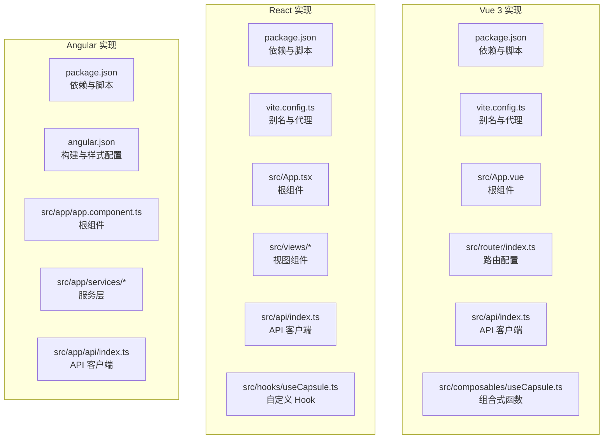
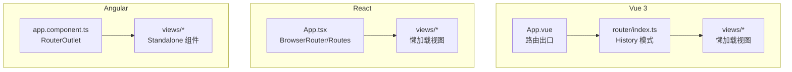
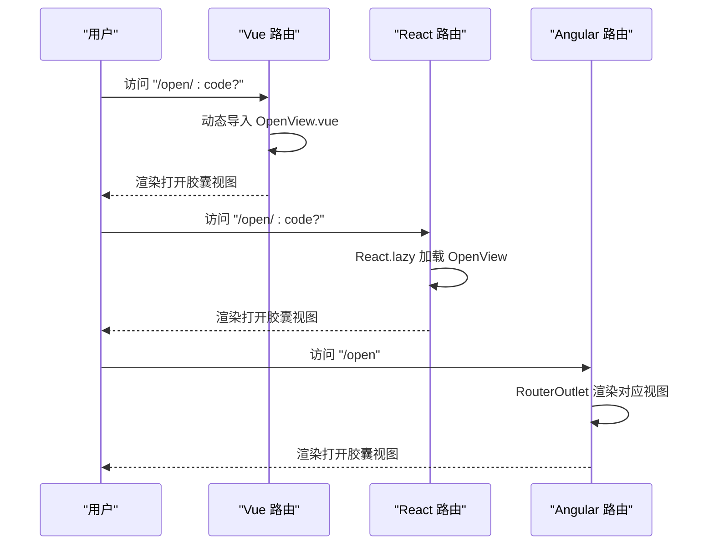
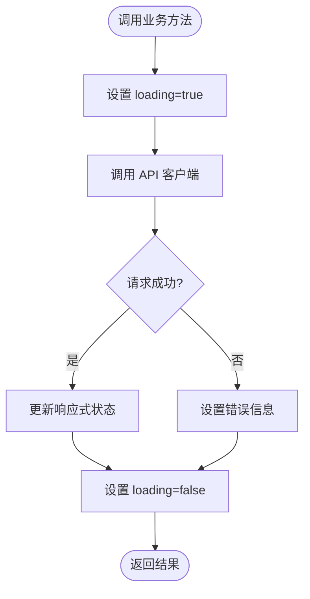
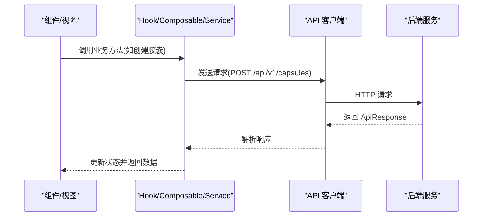
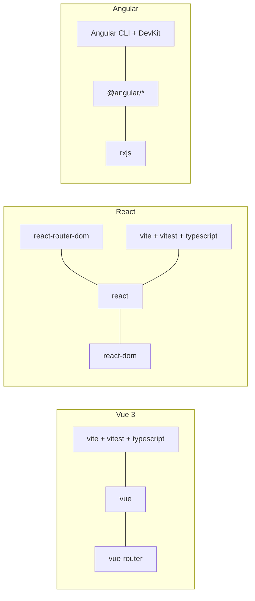

# 跨框架对比分析

<cite>
**本文档引用的文件**
- [frontends/vue3-ts/package.json](file://frontends/vue3-ts/package.json)
- [frontends/react-ts/package.json](file://frontends/react-ts/package.json)
- [frontends/angular-ts/package.json](file://frontends/angular-ts/package.json)
- [frontends/vue3-ts/vite.config.ts](file://frontends/vue3-ts/vite.config.ts)
- [frontends/react-ts/vite.config.ts](file://frontends/react-ts/vite.config.ts)
- [frontends/angular-ts/angular.json](file://frontends/angular-ts/angular.json)
- [frontends/vue3-ts/src/App.vue](file://frontends/vue3-ts/src/App.vue)
- [frontends/react-ts/src/App.tsx](file://frontends/react-ts/src/App.tsx)
- [frontends/angular-ts/src/app/app.component.ts](file://frontends/angular-ts/src/app/app.component.ts)
- [frontends/vue3-ts/src/router/index.ts](file://frontends/vue3-ts/src/router/index.ts)
- [frontends/react-ts/src/views/HomeView.tsx](file://frontends/react-ts/src/views/HomeView.tsx)
- [frontends/angular-ts/src/app/views/home/home.component.ts](file://frontends/angular-ts/src/app/views/home/home.component.ts)
- [frontends/vue3-ts/src/api/index.ts](file://frontends/vue3-ts/src/api/index.ts)
- [frontends/react-ts/src/api/index.ts](file://frontends/react-ts/src/api/index.ts)
- [frontends/angular-ts/src/app/api/index.ts](file://frontends/angular-ts/src/app/api/index.ts)
- [frontends/vue3-ts/src/composables/useCapsule.ts](file://frontends/vue3-ts/src/composables/useCapsule.ts)
- [frontends/react-ts/src/hooks/useCapsule.ts](file://frontends/react-ts/src/hooks/useCapsule.ts)
- [frontends/angular-ts/src/app/services/capsule.service.ts](file://frontends/angular-ts/src/app/services/capsule.service.ts)
</cite>

## 目录
1. [引言](#引言)
2. [项目结构](#项目结构)
3. [核心组件](#核心组件)
4. [架构总览](#架构总览)
5. [详细组件分析](#详细组件分析)
6. [依赖分析](#依赖分析)
7. [性能考量](#性能考量)
8. [故障排查指南](#故障排查指南)
9. [结论](#结论)
10. [附录](#附录)

## 引言
本文件针对 HelloTime 项目中的三个前端实现（Vue 3、React、Angular）进行系统性的跨框架对比分析。重点围绕技术架构（组件系统、状态管理、路由、依赖注入）、开发体验（学习曲线、效率、调试、生态）、性能表现（打包体积、运行时、内存、渲染效率）以及维护性（可读性、协作、长期成本）展开。同时给出 API 客户端实现方式、共享资源使用、构建工具配置差异的对比，并提供选择建议与迁移指南。

## 项目结构
三个前端实现均采用 Vite 作为开发服务器与构建工具，使用 TypeScript 进行类型安全控制；Angular 采用 Angular CLI 构建。项目目录组织遵循“按框架分层”的结构，便于对比各框架的约定与最佳实践。

图表来源
- [frontends/vue3-ts/package.json:1-30](file://frontends/vue3-ts/package.json#L1-L30)
- [frontends/react-ts/package.json:1-31](file://frontends/react-ts/package.json#L1-L31)
- [frontends/angular-ts/package.json:1-38](file://frontends/angular-ts/package.json#L1-L38)
- [frontends/vue3-ts/vite.config.ts:1-23](file://frontends/vue3-ts/vite.config.ts#L1-L23)
- [frontends/react-ts/vite.config.ts:1-23](file://frontends/react-ts/vite.config.ts#L1-L23)
- [frontends/angular-ts/angular.json:1-108](file://frontends/angular-ts/angular.json#L1-L108)
- [frontends/vue3-ts/src/App.vue:1-19](file://frontends/vue3-ts/src/App.vue#L1-L19)
- [frontends/react-ts/src/App.tsx:1-31](file://frontends/react-ts/src/App.tsx#L1-L31)
- [frontends/angular-ts/src/app/app.component.ts:1-14](file://frontends/angular-ts/src/app/app.component.ts#L1-L14)

章节来源
- [frontends/vue3-ts/package.json:1-30](file://frontends/vue3-ts/package.json#L1-L30)
- [frontends/react-ts/package.json:1-31](file://frontends/react-ts/package.json#L1-L31)
- [frontends/angular-ts/package.json:1-38](file://frontends/angular-ts/package.json#L1-L38)
- [frontends/vue3-ts/vite.config.ts:1-23](file://frontends/vue3-ts/vite.config.ts#L1-L23)
- [frontends/react-ts/vite.config.ts:1-23](file://frontends/react-ts/vite.config.ts#L1-L23)
- [frontends/angular-ts/angular.json:1-108](file://frontends/angular-ts/angular.json#L1-L108)

## 核心组件
- 组件系统设计
  - Vue 3：采用单文件组件（SFC），根组件通过路由出口渲染视图，组件间通过 props/event/composition API 通信。
  - React：函数组件 + Hooks，根组件使用 React Router 进行路由渲染，视图以懒加载组件形式按需加载。
  - Angular：基于组件的声明式模板，根组件导入 RouterOutlet 与子组件，采用 Standalone 组件风格。
- 状态管理模式
  - Vue 3：使用响应式组合式 API（ref、reactive）在 Composable 中集中管理业务状态。
  - React：使用 useState 与 useCallback 在自定义 Hook 中管理状态与副作用。
  - Angular：使用 Injectable 服务与 signal 提供响应式状态，集中于服务层。
- 路由实现方式
  - Vue 3：使用 Vue Router 的 History 模式，路由懒加载配合动态 import。
  - React：使用 React Router DOM 的 Routes/Route，结合 React.lazy/Suspense 实现视图懒加载。
  - Angular：使用 @angular/router 的 RouterOutlet 与路由配置，Standalone 组件按需导入。
- 依赖注入机制
  - Vue 3：通过组合式函数或全局状态库实现依赖注入（本项目未使用第三方 DI 容器）。
  - React：通过 Context 或第三方状态库实现依赖注入（本项目未使用第三方 DI 容器）。
  - Angular：使用 @Injectable({ providedIn: 'root' }) 提供根级服务，天然具备依赖注入能力。

章节来源
- [frontends/vue3-ts/src/App.vue:1-19](file://frontends/vue3-ts/src/App.vue#L1-L19)
- [frontends/vue3-ts/src/router/index.ts:1-44](file://frontends/vue3-ts/src/router/index.ts#L1-L44)
- [frontends/vue3-ts/src/composables/useCapsule.ts:1-65](file://frontends/vue3-ts/src/composables/useCapsule.ts#L1-L65)
- [frontends/react-ts/src/App.tsx:1-31](file://frontends/react-ts/src/App.tsx#L1-L31)
- [frontends/react-ts/src/views/HomeView.tsx:1-44](file://frontends/react-ts/src/views/HomeView.tsx#L1-L44)
- [frontends/react-ts/src/hooks/useCapsule.ts:1-48](file://frontends/react-ts/src/hooks/useCapsule.ts#L1-L48)
- [frontends/angular-ts/src/app/app.component.ts:1-14](file://frontends/angular-ts/src/app/app.component.ts#L1-L14)
- [frontends/angular-ts/src/app/services/capsule.service.ts:1-41](file://frontends/angular-ts/src/app/services/capsule.service.ts#L1-L41)

## 架构总览
三套实现均采用“组件 + API 客户端 + 状态管理”的分层架构，共享资源通过别名路径统一引入，构建工具统一使用 Vite（Angular 通过 CLI 构建）。下图展示各框架在路由与视图层的交互关系：

图表来源
- [frontends/vue3-ts/src/App.vue:1-19](file://frontends/vue3-ts/src/App.vue#L1-L19)
- [frontends/vue3-ts/src/router/index.ts:1-44](file://frontends/vue3-ts/src/router/index.ts#L1-L44)
- [frontends/react-ts/src/App.tsx:1-31](file://frontends/react-ts/src/App.tsx#L1-L31)
- [frontends/angular-ts/src/app/app.component.ts:1-14](file://frontends/angular-ts/src/app/app.component.ts#L1-L14)

## 详细组件分析

### 组件系统与路由
- Vue 3
  - 根组件包含头部与底部，主区域通过路由出口渲染视图。
  - 路由采用 History 模式，支持可选参数路径，使用动态 import 实现懒加载。
- React
  - 根组件使用 BrowserRouter 包裹，Routes/Route 映射路径与视图，视图组件通过 React.lazy 按需加载。
- Angular
  - 根组件导入 RouterOutlet 与子组件，视图组件采用 Standalone 风格，通过 RouterLink 导航。

图表来源
- [frontends/vue3-ts/src/router/index.ts:1-44](file://frontends/vue3-ts/src/router/index.ts#L1-L44)
- [frontends/react-ts/src/App.tsx:1-31](file://frontends/react-ts/src/App.tsx#L1-L31)
- [frontends/angular-ts/src/app/app.component.ts:1-14](file://frontends/angular-ts/src/app/app.component.ts#L1-L14)

章节来源
- [frontends/vue3-ts/src/App.vue:1-19](file://frontends/vue3-ts/src/App.vue#L1-L19)
- [frontends/vue3-ts/src/router/index.ts:1-44](file://frontends/vue3-ts/src/router/index.ts#L1-L44)
- [frontends/react-ts/src/App.tsx:1-31](file://frontends/react-ts/src/App.tsx#L1-L31)
- [frontends/react-ts/src/views/HomeView.tsx:1-44](file://frontends/react-ts/src/views/HomeView.tsx#L1-L44)
- [frontends/angular-ts/src/app/app.component.ts:1-14](file://frontends/angular-ts/src/app/app.component.ts#L1-L14)
- [frontends/angular-ts/src/app/views/home/home.component.ts:1-12](file://frontends/angular-ts/src/app/views/home/home.component.ts#L1-L12)

### 状态管理与业务逻辑
- Vue 3
  - 使用组合式函数 useCapsule，集中封装创建与查询胶囊的异步逻辑，返回响应式状态与方法。
- React
  - 使用自定义 Hook useCapsule，内部维护状态并通过回调函数暴露给组件使用。
- Angular
  - 使用 Injectable 服务 CapsuleService，以 signal 提供响应式状态，适合跨组件共享。

图表来源
- [frontends/vue3-ts/src/composables/useCapsule.ts:1-65](file://frontends/vue3-ts/src/composables/useCapsule.ts#L1-L65)
- [frontends/react-ts/src/hooks/useCapsule.ts:1-48](file://frontends/react-ts/src/hooks/useCapsule.ts#L1-L48)
- [frontends/angular-ts/src/app/services/capsule.service.ts:1-41](file://frontends/angular-ts/src/app/services/capsule.service.ts#L1-L41)

章节来源
- [frontends/vue3-ts/src/composables/useCapsule.ts:1-65](file://frontends/vue3-ts/src/composables/useCapsule.ts#L1-L65)
- [frontends/react-ts/src/hooks/useCapsule.ts:1-48](file://frontends/react-ts/src/hooks/useCapsule.ts#L1-L48)
- [frontends/angular-ts/src/app/services/capsule.service.ts:1-41](file://frontends/angular-ts/src/app/services/capsule.service.ts#L1-L41)

### API 客户端实现
- 共同点
  - 三套实现均以统一的 BASE_URL 前缀拼接 API 路径，封装通用请求函数，统一处理响应与错误。
  - 对后端健康检查、胶囊创建/查询、管理员登录/删除等接口进行模块化封装。
- 差异点
  - Vue 3 与 React 的 API 文件位于 src/api，Angular 的 API 文件位于 src/app/api，体现不同框架的目录约定。
  - Angular 的 API 函数与服务在同一文件内，更贴近 Angular 的“服务即 API”模式。

图表来源
- [frontends/vue3-ts/src/api/index.ts:1-120](file://frontends/vue3-ts/src/api/index.ts#L1-L120)
- [frontends/react-ts/src/api/index.ts:1-94](file://frontends/react-ts/src/api/index.ts#L1-L94)
- [frontends/angular-ts/src/app/api/index.ts:1-71](file://frontends/angular-ts/src/app/api/index.ts#L1-L71)

章节来源
- [frontends/vue3-ts/src/api/index.ts:1-120](file://frontends/vue3-ts/src/api/index.ts#L1-L120)
- [frontends/react-ts/src/api/index.ts:1-94](file://frontends/react-ts/src/api/index.ts#L1-L94)
- [frontends/angular-ts/src/app/api/index.ts:1-71](file://frontends/angular-ts/src/app/api/index.ts#L1-L71)

### 依赖注入与共享资源
- Vue 3
  - 通过组合式函数与全局 API 客户端实现依赖注入，未引入第三方 DI 容器。
- React
  - 通过上下文或第三方状态库实现依赖注入，未引入第三方 DI 容器。
- Angular
  - 使用 @Injectable({ providedIn: 'root' }) 提供根级服务，天然具备依赖注入能力，适合复杂状态与跨组件共享。

章节来源
- [frontends/vue3-ts/src/composables/useCapsule.ts:1-65](file://frontends/vue3-ts/src/composables/useCapsule.ts#L1-L65)
- [frontends/react-ts/src/hooks/useCapsule.ts:1-48](file://frontends/react-ts/src/hooks/useCapsule.ts#L1-L48)
- [frontends/angular-ts/src/app/services/capsule.service.ts:1-41](file://frontends/angular-ts/src/app/services/capsule.service.ts#L1-L41)

## 依赖分析
- 依赖关系
  - Vue 3：依赖 vue 与 vue-router，开发依赖包括 @vitejs/plugin-vue、typescript、vite、vitest 等。
  - React：依赖 react、react-dom、react-router-dom，开发依赖包括 @vitejs/plugin-react、@types/react 等。
  - Angular：依赖 @angular/* 核心包与 rxjs、zone.js，开发依赖包括 @angular-devkit/build-angular、@angular/cli 等。
- 构建与测试
  - Vue 3 与 React：使用 Vite 构建，脚本包含 dev/build/test/preview。
  - Angular：使用 Angular CLI 构建，脚本包含 dev/build/test，样式通过 angular.json 配置多层样式链路。

图表来源
- [frontends/vue3-ts/package.json:1-30](file://frontends/vue3-ts/package.json#L1-L30)
- [frontends/react-ts/package.json:1-31](file://frontends/react-ts/package.json#L1-L31)
- [frontends/angular-ts/package.json:1-38](file://frontends/angular-ts/package.json#L1-L38)

章节来源
- [frontends/vue3-ts/package.json:1-30](file://frontends/vue3-ts/package.json#L1-L30)
- [frontends/react-ts/package.json:1-31](file://frontends/react-ts/package.json#L1-L31)
- [frontends/angular-ts/package.json:1-38](file://frontends/angular-ts/package.json#L1-L38)
- [frontends/angular-ts/angular.json:1-108](file://frontends/angular-ts/angular.json#L1-L108)

## 性能考量
- 打包体积
  - Vue 3 与 React 均使用 Vite 构建，依赖精简，适合中小型项目；Angular 由于包含 Angular 核心库与 RxJS，初始包体相对更大。
- 运行时性能
  - Vue 3 与 React 的组件模型轻量，渲染效率高；Angular 在大型应用中通过 Tree Shaking 与惰性加载可优化体积与启动时间。
- 内存占用
  - 三者均采用懒加载策略，内存占用与应用规模和路由深度相关。
- 渲染效率
  - Vue 3 的组合式 API 与 React 的 Hooks 在细粒度状态更新上表现良好；Angular 的变更检测与 signal 在响应式场景中具备优势。

## 故障排查指南
- 路由问题
  - Vue 3：确认 History 模式与服务器配置一致，避免刷新后 404。
  - React：确保 Routes/Route 路径与组件懒加载路径一致。
  - Angular：确认 RouterOutlet 正确导入且路由配置无误。
- API 请求失败
  - 检查 BASE_URL 与代理配置，确认 /api 前缀转发至后端服务。
  - 统一错误处理会抛出异常，捕获并记录错误信息以便定位。
- 构建与测试
  - Vue 3 与 React：使用 vitest 运行单元测试，注意快照与异步断言。
  - Angular：使用 ng test 运行 Karma 测试，确保 polyfills 与样式链路正确。

章节来源
- [frontends/vue3-ts/vite.config.ts:1-23](file://frontends/vue3-ts/vite.config.ts#L1-L23)
- [frontends/react-ts/vite.config.ts:1-23](file://frontends/react-ts/vite.config.ts#L1-L23)
- [frontends/angular-ts/angular.json:1-108](file://frontends/angular-ts/angular.json#L1-L108)
- [frontends/vue3-ts/src/api/index.ts:1-120](file://frontends/vue3-ts/src/api/index.ts#L1-L120)
- [frontends/react-ts/src/api/index.ts:1-94](file://frontends/react-ts/src/api/index.ts#L1-L94)
- [frontends/angular-ts/src/app/api/index.ts:1-71](file://frontends/angular-ts/src/app/api/index.ts#L1-L71)

## 结论
- 技术架构
  - Vue 3 与 React 更贴近“轻量组件 + Hooks/组合式”的现代前端范式；Angular 提供更强的工程化能力与依赖注入。
- 开发体验
  - Vue 3 学习曲线平缓，开发效率较高；React 生态活跃，调试工具完善；Angular 适合大型企业级项目，但学习成本更高。
- 性能表现
  - 三者在小型应用中性能差异不显著，Angular 在大型应用中可通过构建优化获得更好收益。
- 维护性
  - Angular 的强约束与类型系统有利于长期维护；Vue 3 与 React 则更灵活，需团队规范保障一致性。

## 附录
- 选择建议
  - 新团队或快速原型：优先 Vue 3。
  - 中大型团队与复杂状态：优先 Angular。
  - 高度模块化与生态驱动：优先 React。
- 迁移指南
  - 组件层：将模板/JSX/TS 文件迁移至目标框架的组件模型，保持相同功能边界。
  - 状态层：Vue 3 的组合式函数 → React 的自定义 Hook 或 Context；Angular 的 Injectable 服务保持不变。
  - 路由层：将路由配置与懒加载策略迁移至目标框架的路由体系。
  - 构建层：保留 Vite 配置（Vue/React），Angular 使用 CLI 构建；统一代理与别名路径。
  - 测试层：迁移测试文件至目标框架的测试工具链，保持断言与覆盖率。