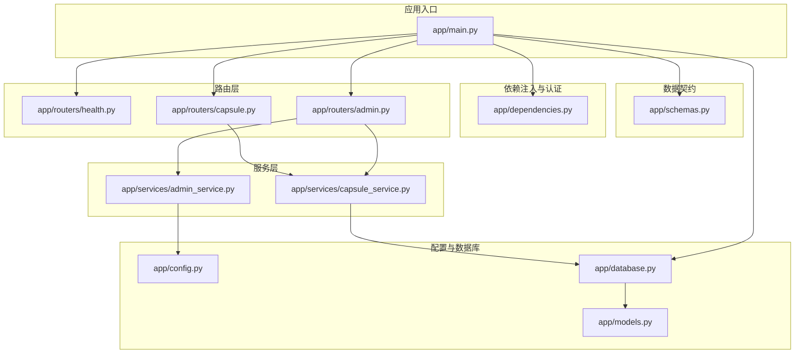
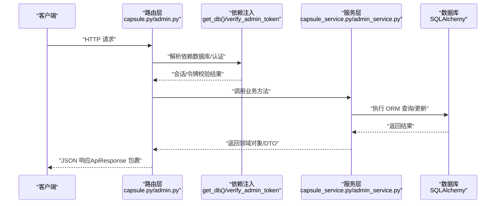
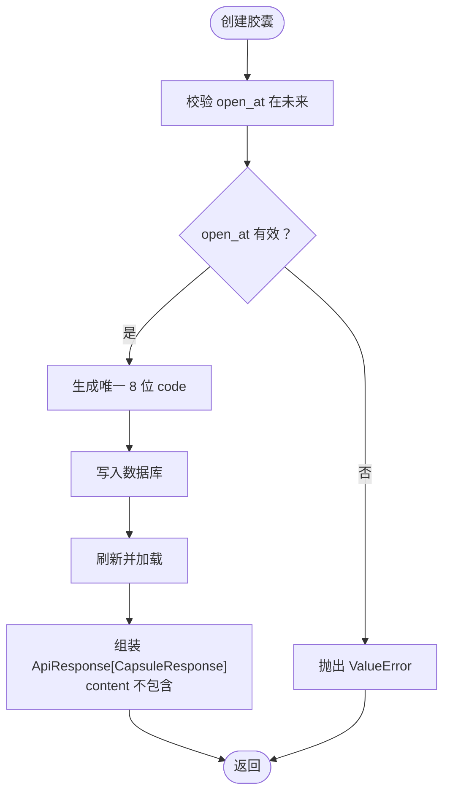
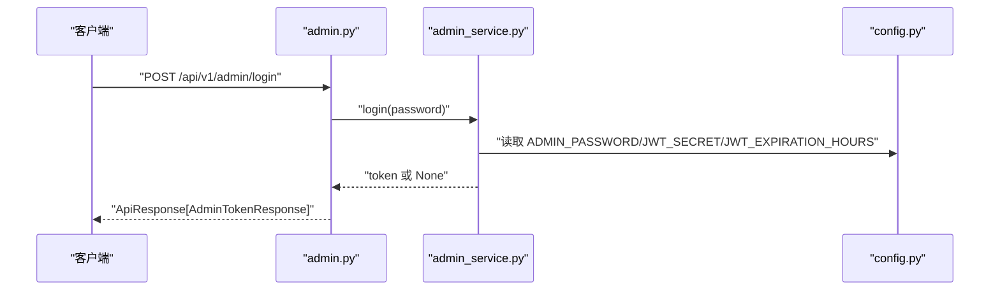
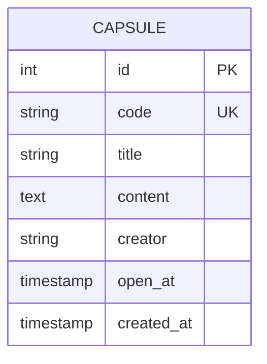
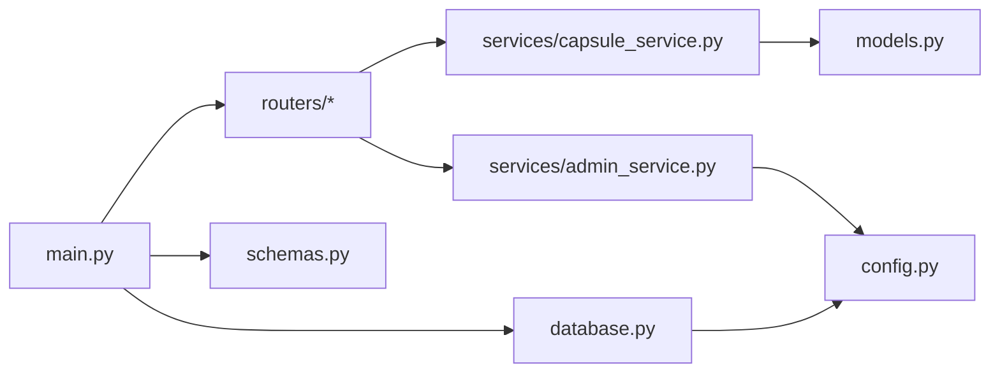

# FastAPI 实现

<cite>
**本文引用的文件**
- [README.md](file://backends/fastapi/README.md)
- [requirements.txt](file://backends/fastapi/requirements.txt)
- [main.py](file://backends/fastapi/app/main.py)
- [config.py](file://backends/fastapi/app/config.py)
- [database.py](file://backends/fastapi/app/database.py)
- [models.py](file://backends/fastapi/app/models.py)
- [schemas.py](file://backends/fastapi/app/schemas.py)
- [dependencies.py](file://backends/fastapi/app/dependencies.py)
- [health.py](file://backends/fastapi/app/routers/health.py)
- [capsule.py](file://backends/fastapi/app/routers/capsule.py)
- [admin.py](file://backends/fastapi/app/routers/admin.py)
- [capsule_service.py](file://backends/fastapi/app/services/capsule_service.py)
- [admin_service.py](file://backends/fastapi/app/services/admin_service.py)
- [conftest.py](file://backends/fastapi/tests/conftest.py)
- [test_capsule_api.py](file://backends/fastapi/tests/test_capsule_api.py)
- [test_admin_api.py](file://backends/fastapi/tests/test_admin_api.py)
- [test_capsule_service.py](file://backends/fastapi/tests/test_capsule_service.py)
- [test_admin_service.py](file://backends/fastapi/tests/test_admin_service.py)
</cite>

## 目录
1. [简介](#简介)
2. [项目结构](#项目结构)
3. [核心组件](#核心组件)
4. [架构总览](#架构总览)
5. [详细组件分析](#详细组件分析)
6. [依赖分析](#依赖分析)
7. [性能考虑](#性能考虑)
8. [故障排查指南](#故障排查指南)
9. [结论](#结论)
10. [附录](#附录)

## 简介
本项目为 HelloTime 时间胶囊应用的 FastAPI 后端实现，采用 Python 3.12+ 与 FastAPI 构建，提供异步 RESTful API、自动生成的 OpenAPI 文档、基于 Pydantic 的数据验证、JWT 管理员认证、全局异常处理与统一响应格式。项目包含路由层、服务层、数据库层（SQLAlchemy）、依赖注入、中间件配置、错误处理机制、JWT 认证、测试框架与 Docker 部署准备。

## 项目结构
后端代码位于 backends/fastapi/app 目录，主要分为以下层次：
- 应用入口与中间件：main.py
- 配置管理：config.py
- 数据库引擎与会话：database.py
- ORM 模型：models.py
- Pydantic 数据契约：schemas.py
- 依赖注入与认证中间件：dependencies.py
- 路由模块：routers 下的 health.py、capsule.py、admin.py
- 业务服务：services 下的 capsule_service.py、admin_service.py
- 测试：tests 下的 conftest.py、test_*.py

图表来源
- [main.py:1-89](file://backends/fastapi/app/main.py#L1-L89)
- [database.py:1-30](file://backends/fastapi/app/database.py#L1-L30)
- [models.py:1-26](file://backends/fastapi/app/models.py#L1-L26)
- [schemas.py:1-96](file://backends/fastapi/app/schemas.py#L1-L96)
- [dependencies.py:1-23](file://backends/fastapi/app/dependencies.py#L1-L23)
- [health.py:1-25](file://backends/fastapi/app/routers/health.py#L1-L25)
- [capsule.py:1-31](file://backends/fastapi/app/routers/capsule.py#L1-L31)
- [admin.py:1-55](file://backends/fastapi/app/routers/admin.py#L1-L55)
- [capsule_service.py:1-144](file://backends/fastapi/app/services/capsule_service.py#L1-L144)
- [admin_service.py:1-42](file://backends/fastapi/app/services/admin_service.py#L1-L42)

章节来源
- [README.md:99-116](file://backends/fastapi/README.md#L99-L116)
- [main.py:16-34](file://backends/fastapi/app/main.py#L16-L34)

## 核心组件
- 应用入口与中间件：创建数据库表、注册路由、配置 CORS、注册全局异常处理器。
- 配置管理：从环境变量读取数据库连接、管理员密码、JWT 密钥与过期时间。
- 数据库层：SQLAlchemy 2.x 引擎、会话工厂与依赖注入函数；ORM 基类与 Capsule 模型。
- 数据契约：Pydantic 模型定义请求/响应结构，统一 camelCase 序列化，ISO 8601 时间格式。
- 依赖注入与认证：数据库会话依赖；管理员 JWT 校验依赖 verify_admin_token。
- 路由层：健康检查、胶囊 CRUD、管理员登录与管理端胶囊列表/删除。
- 服务层：胶囊业务逻辑（创建、查询、分页、删除）；管理员认证（登录、令牌校验）。
- 测试：内存 SQLite + TestClient；覆盖 API 与服务层关键行为。

章节来源
- [main.py:19-89](file://backends/fastapi/app/main.py#L19-L89)
- [config.py:8-17](file://backends/fastapi/app/config.py#L8-L17)
- [database.py:11-29](file://backends/fastapi/app/database.py#L11-L29)
- [models.py:14-26](file://backends/fastapi/app/models.py#L14-L26)
- [schemas.py:26-96](file://backends/fastapi/app/schemas.py#L26-L96)
- [dependencies.py:10-23](file://backends/fastapi/app/dependencies.py#L10-L23)
- [health.py:14-24](file://backends/fastapi/app/routers/health.py#L14-L24)
- [capsule.py:17-30](file://backends/fastapi/app/routers/capsule.py#L17-L30)
- [admin.py:25-54](file://backends/fastapi/app/routers/admin.py#L25-L54)
- [capsule_service.py:79-144](file://backends/fastapi/app/services/capsule_service.py#L79-L144)
- [admin_service.py:18-42](file://backends/fastapi/app/services/admin_service.py#L18-L42)

## 架构总览
下图展示从客户端到数据库的典型请求流程，涵盖路由、依赖注入、服务层与数据库交互。

图表来源
- [capsule.py:17-30](file://backends/fastapi/app/routers/capsule.py#L17-L30)
- [admin.py:33-54](file://backends/fastapi/app/routers/admin.py#L33-L54)
- [database.py:23-29](file://backends/fastapi/app/database.py#L23-L29)
- [dependencies.py:10-23](file://backends/fastapi/app/dependencies.py#L10-L23)
- [capsule_service.py:79-144](file://backends/fastapi/app/services/capsule_service.py#L79-L144)
- [admin_service.py:18-42](file://backends/fastapi/app/services/admin_service.py#L18-L42)

## 详细组件分析

### 应用入口与中间件（main.py）
- 初始化数据库表：启动时自动创建所有表。
- 注册路由：include_router 注入健康检查、胶囊、管理员路由。
- CORS 配置：允许本地开发源、带凭据、指定方法与头。
- 全局异常处理：针对业务异常（胶囊不存在、未授权）、请求校验错误、值错误、通用异常统一返回 ApiResponse 格式。

章节来源
- [main.py:16-17](file://backends/fastapi/app/main.py#L16-L17)
- [main.py:31-34](file://backends/fastapi/app/main.py#L31-L34)
- [main.py:21-29](file://backends/fastapi/app/main.py#L21-L29)
- [main.py:37-89](file://backends/fastapi/app/main.py#L37-L89)

### 配置管理（config.py）
- 读取环境变量 DATABASE_URL、ADMIN_PASSWORD、JWT_SECRET、JWT_EXPIRATION_HOURS，并提供合理默认值。
- 用于数据库引擎创建与 JWT 令牌签发/校验。

章节来源
- [config.py:8-17](file://backends/fastapi/app/config.py#L8-L17)

### 数据库层（database.py）
- 引擎创建：根据 DATABASE_URL 设置连接参数（SQLite 关闭线程检查）。
- 会话工厂：sessionmaker 绑定 engine。
- ORM 基类：DeclarativeBase 子类。
- 依赖注入：get_db 提供 Generator 会话，确保关闭。

章节来源
- [database.py:11-14](file://backends/fastapi/app/database.py#L11-L14)
- [database.py:16](file://backends/fastapi/app/database.py#L16)
- [database.py:19-20](file://backends/fastapi/app/database.py#L19-L20)
- [database.py:23-29](file://backends/fastapi/app/database.py#L23-L29)

### ORM 模型（models.py）
- Capsule 实体：包含自增主键、唯一 8 位随机码、标题、内容、创建者、UTC 时间的 open_at 与可空 created_at。
- 与 SQLAlchemy 2.x 兼容的声明式映射。

章节来源
- [models.py:14-26](file://backends/fastapi/app/models.py#L14-L26)

### 数据契约（schemas.py）
- 请求模型：CreateCapsuleRequest、AdminLoginRequest。
- 响应模型：CapsuleResponse、AdminTokenResponse、PageResponse[T]、ApiResponse[T]。
- 通用序列化：alias_generator 将 snake_case 转 camelCase；ISO 8601 时间字段在响应中序列化为字符串。
- 统一响应：ApiResponse 提供 ok/error 静态方法，便于控制器返回一致格式。

章节来源
- [schemas.py:26-45](file://backends/fastapi/app/schemas.py#L26-L45)
- [schemas.py:54-64](file://backends/fastapi/app/schemas.py#L54-L64)
- [schemas.py:67-79](file://backends/fastapi/app/schemas.py#L67-L79)
- [schemas.py:81-96](file://backends/fastapi/app/schemas.py#L81-L96)

### 依赖注入与认证（dependencies.py）
- verify_admin_token：从 Authorization 头提取 Bearer 令牌，调用 admin_service.validate_token 校验，失败抛出 UnauthorizedException 交由全局处理器处理。
- 与路由中的 dependencies=[Depends(verify_admin_token)] 协作，保护需要认证的端点。

章节来源
- [dependencies.py:10-23](file://backends/fastapi/app/dependencies.py#L10-L23)
- [admin.py:36](file://backends/fastapi/app/routers/admin.py#L36)
- [admin.py:50](file://backends/fastapi/app/routers/admin.py#L50)

### 路由层（routers）

#### 健康检查（health.py）
- GET /api/v1/health：返回技术栈信息与时间戳，统一 ApiResponse 包裹。

章节来源
- [health.py:14-24](file://backends/fastapi/app/routers/health.py#L14-L24)

#### 胶囊路由（capsule.py）
- POST /api/v1/capsules：创建胶囊，返回 201 与 ApiResponse 包裹的 CapsuleResponse。
- GET /api/v1/capsules/{code}：查询胶囊详情，按是否已开启决定是否返回 content。

章节来源
- [capsule.py:17-24](file://backends/fastapi/app/routers/capsule.py#L17-L24)
- [capsule.py:27-30](file://backends/fastapi/app/routers/capsule.py#L27-L30)

#### 管理员路由（admin.py）
- POST /api/v1/admin/login：管理员登录，返回含 token 的 ApiResponse。
- GET /api/v1/admin/capsules：分页查询胶囊列表（需认证）。
- DELETE /api/v1/admin/capsules/{code}：删除胶囊（需认证）。

章节来源
- [admin.py:25-30](file://backends/fastapi/app/routers/admin.py#L25-L30)
- [admin.py:33-44](file://backends/fastapi/app/routers/admin.py#L33-L44)
- [admin.py:47-54](file://backends/fastapi/app/routers/admin.py#L47-L54)

### 服务层（services）

#### 胶囊服务（capsule_service.py）
- 业务异常：CapsuleNotFoundException。
- 工具：生成 8 位随机码（BASE62），确保唯一性并限制重试次数。
- 核心方法：
  - create_capsule：校验 open_at 在未来，生成唯一 code，持久化并返回 ApiResponse 包裹的 CapsuleResponse（不包含 content）。
  - get_capsule：查询单个胶囊，若未开启则 content 为空；不存在抛异常。
  - list_capsules：分页查询管理员端列表，返回 PageResponse[CapsuleResponse]。
  - delete_capsule：删除指定 code 的胶囊，不存在抛异常。
- 响应转换：_to_response_dict 将实体转为字典，处理时间字段与 opened 标志。

图表来源
- [capsule_service.py:79-102](file://backends/fastapi/app/services/capsule_service.py#L79-L102)

章节来源
- [capsule_service.py:25-30](file://backends/fastapi/app/services/capsule_service.py#L25-L30)
- [capsule_service.py:32-43](file://backends/fastapi/app/services/capsule_service.py#L32-L43)
- [capsule_service.py:79-102](file://backends/fastapi/app/services/capsule_service.py#L79-L102)
- [capsule_service.py:105-111](file://backends/fastapi/app/services/capsule_service.py#L105-L111)
- [capsule_service.py:114-134](file://backends/fastapi/app/services/capsule_service.py#L114-L134)
- [capsule_service.py:137-144](file://backends/fastapi/app/services/capsule_service.py#L137-L144)

#### 管理员服务（admin_service.py）
- 登录：比对 ADMIN_PASSWORD，成功则签发 HS256 JWT，设置 iat/exp。
- 校验：使用 JWT_SECRET 解码校验，捕获异常返回无效。

图表来源
- [admin.py:25-30](file://backends/fastapi/app/routers/admin.py#L25-L30)
- [admin_service.py:18-32](file://backends/fastapi/app/services/admin_service.py#L18-L32)
- [config.py:11-17](file://backends/fastapi/app/config.py#L11-L17)

章节来源
- [admin_service.py:12-16](file://backends/fastapi/app/services/admin_service.py#L12-L16)
- [admin_service.py:18-32](file://backends/fastapi/app/services/admin_service.py#L18-L32)
- [admin_service.py:35-42](file://backends/fastapi/app/services/admin_service.py#L35-L42)

### 数据模型（ER 图）

图表来源
- [models.py:14-26](file://backends/fastapi/app/models.py#L14-L26)

## 依赖分析
- 外部依赖：FastAPI、Uvicorn、SQLAlchemy、PyJWT、HTTPX、pytest。
- 内部耦合：
  - main.py 依赖 routers、services、database、schemas。
  - routers 依赖 schemas、database.get_db、dependencies.verify_admin_token。
  - services 依赖 models、schemas、database.Session、config。
  - database 依赖 config。
  - schemas 依赖 pydantic。

图表来源
- [main.py:12-14](file://backends/fastapi/app/main.py#L12-L14)
- [capsule.py:10-12](file://backends/fastapi/app/routers/capsule.py#L10-L12)
- [admin.py:19](file://backends/fastapi/app/routers/admin.py#L19)
- [database.py:9](file://backends/fastapi/app/database.py#L9)
- [config.py:9](file://backends/fastapi/app/config.py#L9)

章节来源
- [requirements.txt:1-7](file://backends/fastapi/requirements.txt#L1-L7)
- [main.py:12-14](file://backends/fastapi/app/main.py#L12-L14)

## 性能考虑
- 异步模式：当前实现为同步 FastAPI 应用，如需高并发 I/O，建议迁移到异步路由与依赖（例如 async def 路由、AsyncSession）。本项目未引入异步依赖，保持同步实现以简化复杂度。
- 数据库连接：SQLite 适合开发与小规模场景；生产建议使用 PostgreSQL/MySQL 并启用连接池与只读副本。
- 查询优化：分页查询已实现 offset/limit；建议为 code 与 open_at 添加索引以提升查询效率。
- 序列化：Pydantic 自动序列化开销较小；避免在响应中传递大对象，必要时延迟加载。
- 中间件：CORS 已最小化配置，避免不必要的头与方法暴露。
- 缓存：未实现缓存层；对高频读取的胶囊详情可考虑 Redis 缓存（需额外依赖）。

## 故障排查指南
- 参数校验失败：RequestValidationError 统一返回 VALIDATION_ERROR，检查请求体字段类型与长度。
- 胶囊不存在：CapsuleNotFoundException 返回 404 与 CAPSULE_NOT_FOUND。
- 未授权访问：UnauthorizedException 返回 401 与 UNAUTHORIZED，确认 Authorization 头格式与令牌有效性。
- 服务器内部错误：Exception 统一返回 INTERNAL_ERROR。
- 测试定位：使用内存 SQLite 与 TestClient，断言状态码与 ApiResponse 结构；参考测试用例覆盖登录、列表、删除、创建等关键路径。

章节来源
- [main.py:58-89](file://backends/fastapi/app/main.py#L58-L89)
- [test_capsule_api.py:33-42](file://backends/fastapi/tests/test_capsule_api.py#L33-L42)
- [test_admin_api.py:31-35](file://backends/fastapi/tests/test_admin_api.py#L31-L35)
- [test_capsule_service.py:36-46](file://backends/fastapi/tests/test_capsule_service.py#L36-L46)

## 结论
本项目以清晰的分层架构实现了时间胶囊的核心功能：异步风格的 FastAPI 应用、Pydantic 数据契约、SQLAlchemy ORM、JWT 管理员认证与统一异常处理。路由简洁、服务职责单一、测试覆盖完整。后续可在异步化、数据库选型与缓存策略上进一步优化以满足更高性能需求。

## 附录

### API 端点一览
- 健康检查：GET /api/v1/health
- 胶囊相关：
  - POST /api/v1/capsules
  - GET /api/v1/capsules/{code}
- 管理员相关：
  - POST /api/v1/admin/login
  - GET /api/v1/admin/capsules
  - DELETE /api/v1/admin/capsules/{code}

章节来源
- [README.md:76-98](file://backends/fastapi/README.md#L76-L98)

### 统一响应格式
- 成功：ApiResponse.success=true，data 为具体数据，message 为操作提示。
- 失败：ApiResponse.success=false，message 为错误描述，errorCode 为错误码。

章节来源
- [schemas.py:81-96](file://backends/fastapi/app/schemas.py#L81-L96)

### 环境变量配置
- DATABASE_URL：数据库连接 URL，默认 SQLite 文件路径。
- ADMIN_PASSWORD：管理员登录密码。
- JWT_SECRET：JWT 签名密钥。
- JWT_EXPIRATION_HOURS：JWT 过期小时数。

章节来源
- [README.md:60-74](file://backends/fastapi/README.md#L60-L74)
- [config.py:9-17](file://backends/fastapi/app/config.py#L9-L17)

### 测试运行
- 运行全部测试：pytest
- 显示覆盖率：pytest --cov=app
- 运行特定测试文件：pytest tests/test_capsule_api.py

章节来源
- [README.md:118-129](file://backends/fastapi/README.md#L118-L129)