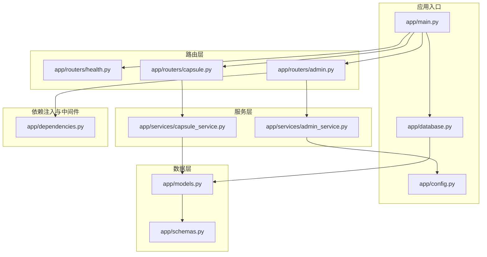
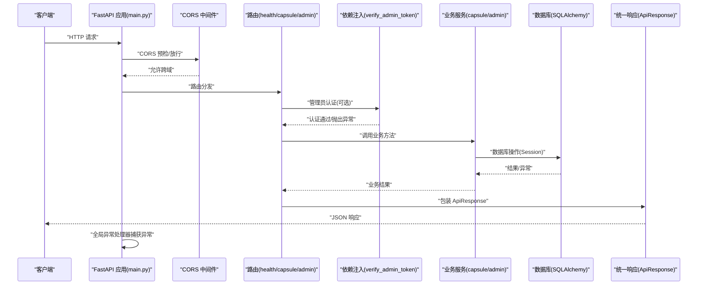
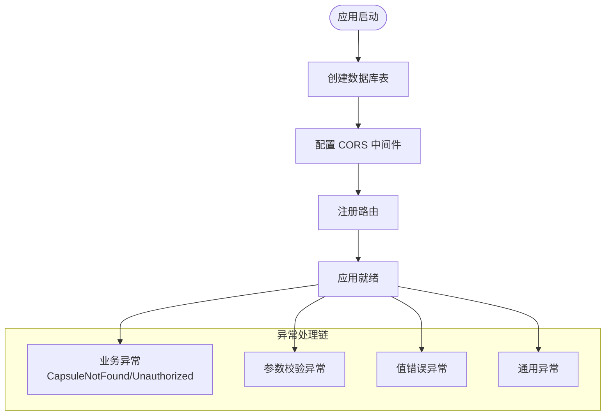
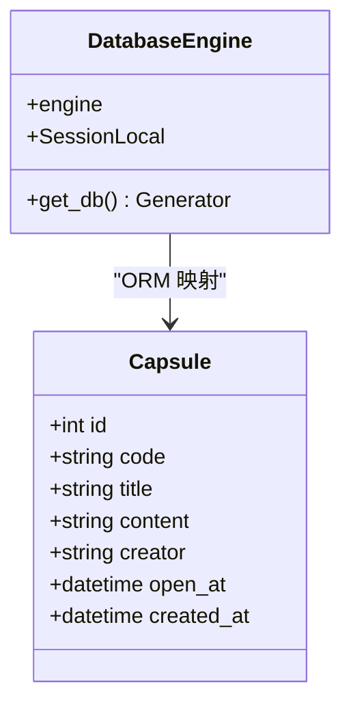
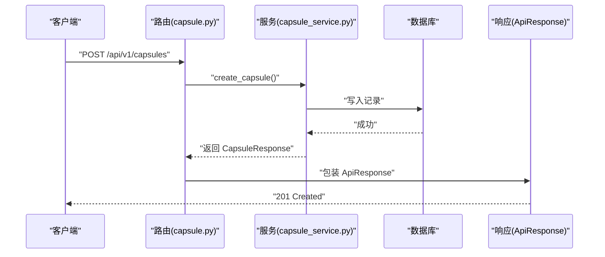
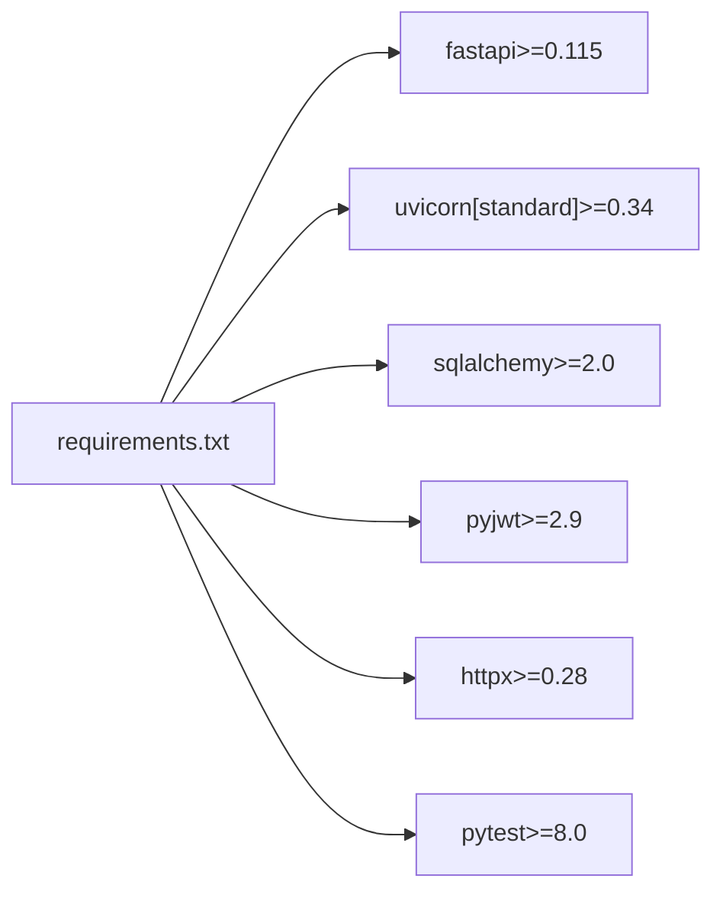

# 项目初始化与配置

<cite>
**本文档引用的文件**
- [requirements.txt](file://backends/fastapi/requirements.txt)
- [main.py](file://backends/fastapi/app/main.py)
- [config.py](file://backends/fastapi/app/config.py)
- [database.py](file://backends/fastapi/app/database.py)
- [schemas.py](file://backends/fastapi/app/schemas.py)
- [models.py](file://backends/fastapi/app/models.py)
- [health.py](file://backends/fastapi/app/routers/health.py)
- [capsule.py](file://backends/fastapi/app/routers/capsule.py)
- [admin.py](file://backends/fastapi/app/routers/admin.py)
- [dependencies.py](file://backends/fastapi/app/dependencies.py)
- [admin_service.py](file://backends/fastapi/app/services/admin_service.py)
- [capsule_service.py](file://backends/fastapi/app/services/capsule_service.py)
- [conftest.py](file://backends/fastapi/tests/conftest.py)
- [README.md](file://backends/fastapi/README.md)
- [dev.sh](file://scripts/dev.sh)
</cite>

## 目录
1. [简介](#简介)
2. [项目结构](#项目结构)
3. [核心组件](#核心组件)
4. [架构总览](#架构总览)
5. [详细组件分析](#详细组件分析)
6. [依赖关系分析](#依赖关系分析)
7. [性能考虑](#性能考虑)
8. [故障排除指南](#故障排除指南)
9. [结论](#结论)
10. [附录](#附录)

## 简介
本文件面向需要快速搭建与理解 FastAPI 后端项目的开发者，系统性阐述项目的初始化流程、依赖安装、环境配置、CORS 中间件与全局异常处理机制、数据库初始化过程，并对关键依赖项进行说明。同时提供应用配置参数清单、开发环境搭建步骤与启动命令示例，帮助读者在最短时间内完成本地开发环境部署并掌握项目整体架构。

## 项目结构
FastAPI 后端采用按功能模块组织的目录结构，核心模块包括应用入口、配置、数据库、数据模型与 Pydantic 模式、依赖注入、路由与业务服务、以及测试配置。项目还提供了统一的响应模型与异常类型，确保接口契约清晰、错误处理一致。

**图表来源**
- [main.py:1-89](file://backends/fastapi/app/main.py#L1-L89)
- [config.py:1-18](file://backends/fastapi/app/config.py#L1-L18)
- [database.py:1-30](file://backends/fastapi/app/database.py#L1-L30)
- [models.py:1-26](file://backends/fastapi/app/models.py#L1-L26)
- [schemas.py:1-96](file://backends/fastapi/app/schemas.py#L1-L96)
- [health.py:1-25](file://backends/fastapi/app/routers/health.py#L1-L25)
- [capsule.py:1-31](file://backends/fastapi/app/routers/capsule.py#L1-L31)
- [admin.py:1-55](file://backends/fastapi/app/routers/admin.py#L1-L55)
- [dependencies.py:1-23](file://backends/fastapi/app/dependencies.py#L1-L23)
- [capsule_service.py:1-144](file://backends/fastapi/app/services/capsule_service.py#L1-L144)
- [admin_service.py:1-42](file://backends/fastapi/app/services/admin_service.py#L1-L42)

**章节来源**
- [README.md:99-116](file://backends/fastapi/README.md#L99-L116)

## 核心组件
- 应用入口与启动流程：应用在启动时创建数据库表、注册路由、配置 CORS 中间件，并设置多级全局异常处理器，覆盖业务异常、参数校验异常、值错误与通用异常。
- 配置管理：从环境变量读取数据库连接地址、管理员密码、JWT 密钥与过期时间，提供合理的默认值。
- 数据库与 ORM：使用 SQLAlchemy 2.x 创建引擎与会话，通过依赖注入提供数据库会话；模型定义时间胶囊实体。
- 统一响应与数据契约：通过 Pydantic 模型定义请求与响应结构，统一响应格式，支持驼峰命名序列化。
- 路由与服务：健康检查、胶囊 CRUD、管理员登录与管理端操作，均通过服务层实现业务逻辑。
- 依赖注入与认证：管理员端接口通过依赖注入验证 JWT 令牌，未通过时抛出自定义异常交由全局处理器处理。

**章节来源**
- [main.py:16-89](file://backends/fastapi/app/main.py#L16-L89)
- [config.py:8-18](file://backends/fastapi/app/config.py#L8-L18)
- [database.py:11-30](file://backends/fastapi/app/database.py#L11-L30)
- [schemas.py:81-96](file://backends/fastapi/app/schemas.py#L81-L96)
- [models.py:14-26](file://backends/fastapi/app/models.py#L14-L26)
- [health.py:14-25](file://backends/fastapi/app/routers/health.py#L14-L25)
- [capsule.py:17-31](file://backends/fastapi/app/routers/capsule.py#L17-L31)
- [admin.py:25-55](file://backends/fastapi/app/routers/admin.py#L25-L55)
- [dependencies.py:10-23](file://backends/fastapi/app/dependencies.py#L10-L23)

## 架构总览
下图展示了从客户端请求到响应返回的关键交互路径，包括 CORS 预检、路由分发、依赖注入、业务服务调用与异常处理。

**图表来源**
- [main.py:21-89](file://backends/fastapi/app/main.py#L21-L89)
- [health.py:14-25](file://backends/fastapi/app/routers/health.py#L14-L25)
- [capsule.py:17-31](file://backends/fastapi/app/routers/capsule.py#L17-L31)
- [admin.py:25-55](file://backends/fastapi/app/routers/admin.py#L25-L55)
- [dependencies.py:10-23](file://backends/fastapi/app/dependencies.py#L10-L23)
- [capsule_service.py:79-144](file://backends/fastapi/app/services/capsule_service.py#L79-L144)
- [admin_service.py:18-42](file://backends/fastapi/app/services/admin_service.py#L18-L42)
- [database.py:23-30](file://backends/fastapi/app/database.py#L23-L30)
- [schemas.py:81-96](file://backends/fastapi/app/schemas.py#L81-L96)

## 详细组件分析

### 应用入口与启动流程
- 表初始化：应用启动时调用 ORM 元数据创建所有表，确保数据库结构就绪。
- CORS 配置：允许本地开发域名的跨域访问，支持常见方法与头，允许凭据，设置最大缓存时间。
- 路由注册：集中注册健康检查、胶囊与管理员相关路由。
- 全局异常处理：针对业务异常（胶囊不存在、未授权）、请求参数校验异常、值错误与通用异常分别处理，统一返回 ApiResponse 格式。

**图表来源**
- [main.py:16-89](file://backends/fastapi/app/main.py#L16-L89)

**章节来源**
- [main.py:16-89](file://backends/fastapi/app/main.py#L16-L89)

### 配置管理
- 数据库连接：支持 SQLite 与其它数据库，默认使用相对路径存储数据库文件。
- 管理员密码：用于管理员登录认证。
- JWT 密钥与过期时间：用于签发与验证管理员令牌。

**章节来源**
- [config.py:8-18](file://backends/fastapi/app/config.py#L8-L18)

### 数据库与 ORM
- 引擎与会话：根据数据库 URL 创建引擎，SQLite 场景设置线程检查关闭参数；通过会话工厂提供线程安全的会话。
- 依赖注入：提供 get_db 生成器，确保每个请求获取独立会话并在结束后关闭。
- 模型定义：时间胶囊实体包含唯一编码、标题、内容、创建者、开启时间与创建时间等字段。

**图表来源**
- [database.py:11-30](file://backends/fastapi/app/database.py#L11-L30)
- [models.py:14-26](file://backends/fastapi/app/models.py#L14-L26)

**章节来源**
- [database.py:11-30](file://backends/fastapi/app/database.py#L11-L30)
- [models.py:14-26](file://backends/fastapi/app/models.py#L14-L26)

### 统一响应与数据契约
- 响应模型：ApiResponse 支持成功/失败标记、数据、消息与错误码，提供 ok/error 静态方法。
- 请求模型：CreateCapsuleRequest、AdminLoginRequest 等，使用驼峰命名序列化，字段具备长度与格式约束。
- 响应模型：CapsuleResponse、AdminTokenResponse、PageResponse 等，统一字段命名与时间格式。

**章节来源**
- [schemas.py:81-96](file://backends/fastapi/app/schemas.py#L81-L96)
- [schemas.py:26-45](file://backends/fastapi/app/schemas.py#L26-L45)
- [schemas.py:54-79](file://backends/fastapi/app/schemas.py#L54-L79)

### 路由与服务
- 健康检查：返回运行状态、时间戳与技术栈信息。
- 胶囊路由：创建胶囊（201）、查询胶囊详情；服务层负责生成唯一编码、未来时间校验、内容可见性控制与分页查询。
- 管理员路由：登录生成 JWT、分页查询胶囊列表、删除胶囊；依赖注入验证令牌，未通过则抛出未授权异常。

**图表来源**
- [capsule.py:17-24](file://backends/fastapi/app/routers/capsule.py#L17-L24)
- [capsule_service.py:79-102](file://backends/fastapi/app/services/capsule_service.py#L79-L102)
- [schemas.py:81-96](file://backends/fastapi/app/schemas.py#L81-L96)

**章节来源**
- [health.py:14-25](file://backends/fastapi/app/routers/health.py#L14-L25)
- [capsule.py:17-31](file://backends/fastapi/app/routers/capsule.py#L17-L31)
- [admin.py:25-55](file://backends/fastapi/app/routers/admin.py#L25-L55)
- [capsule_service.py:79-144](file://backends/fastapi/app/services/capsule_service.py#L79-L144)

### 依赖注入与认证
- 管理员令牌验证：从 Authorization 头提取 Bearer 令牌，调用服务层验证，失败时抛出未授权异常，交由全局异常处理器统一处理。
- 依赖覆盖：测试中通过依赖覆盖将 get_db 指向内存数据库会话，确保测试隔离与可重复性。

**章节来源**
- [dependencies.py:10-23](file://backends/fastapi/app/dependencies.py#L10-L23)
- [admin_service.py:18-42](file://backends/fastapi/app/services/admin_service.py#L18-L42)
- [conftest.py:34-47](file://backends/fastapi/tests/conftest.py#L34-L47)

## 依赖关系分析
- 关键依赖项：FastAPI、Uvicorn、SQLAlchemy、PyJWT、HTTPX、Pytest。
- 版本要求：FastAPI 与 Uvicorn 标准版本、SQLAlchemy 2.x、PyJWT 2.9+、HTTPX 0.28+、Pytest 8.0+。
- 作用说明：FastAPI 提供高性能异步框架与自动生成的 API 文档；Uvicorn 作为 ASGI 服务器；SQLAlchemy 2.x 提供 ORM 能力；PyJWT 用于管理员认证；HTTPX 用于测试与外部 HTTP 调用；Pytest 用于单元与集成测试。

**图表来源**
- [requirements.txt:1-7](file://backends/fastapi/requirements.txt#L1-L7)

**章节来源**
- [requirements.txt:1-7](file://backends/fastapi/requirements.txt#L1-L7)

## 性能考虑
- 数据库连接：SQLite 在单线程场景下表现良好，生产环境建议使用支持并发的数据库并配置连接池。
- 会话管理：依赖注入确保每个请求独立会话，避免共享状态引发的竞态条件。
- 异常处理：全局异常处理器减少重复代码，提升一致性与可维护性。
- CORS 配置：合理设置允许的方法与头，避免过度宽松导致安全风险。

## 故障排除指南
- 启动失败（数据库连接错误）：检查 DATABASE_URL 环境变量是否正确指向数据库文件或连接字符串。
- 认证失败（管理员接口 401）：确认 Authorization 头格式为 Bearer {token}，且令牌未过期或被篡改。
- 参数校验失败（400）：核对请求体字段类型与长度，参考 Pydantic 模型约束。
- 通用异常（500）：查看服务层日志，定位具体异常位置并修复。

**章节来源**
- [main.py:37-89](file://backends/fastapi/app/main.py#L37-L89)
- [dependencies.py:10-23](file://backends/fastapi/app/dependencies.py#L10-L23)
- [admin_service.py:18-42](file://backends/fastapi/app/services/admin_service.py#L18-L42)

## 结论
本 FastAPI 项目通过清晰的模块划分与统一的响应格式，实现了简洁而健壮的后端服务。借助 SQLAlchemy 的 ORM 能力与 PyJWT 的认证机制，项目在开发阶段即可获得良好的开发体验与一致的接口契约。按照本文档提供的初始化与配置步骤，开发者可以快速搭建本地开发环境并理解项目整体架构。

## 附录

### 开发环境搭建步骤
- 前置要求：Python 3.12+，pip 或 uv。
- 创建虚拟环境并激活。
- 安装依赖：使用 requirements.txt 安装所需包。
- 设置环境变量：可选地配置 DATABASE_URL、ADMIN_PASSWORD、JWT_SECRET、JWT_EXPIRATION_HOURS。
- 启动应用：开发模式启用自动重载，生产模式可指定工作进程数。
- 访问文档：Swagger UI、ReDoc 与 OpenAPI JSON。

**章节来源**
- [README.md:21-75](file://backends/fastapi/README.md#L21-L75)

### 启动命令示例
- 开发模式（自动重载）：uvicorn app.main:app --reload --host 0.0.0.0 --port 8080
- 生产模式：uvicorn app.main:app --host 0.0.0.0 --port 8080 --workers 4

**章节来源**
- [README.md:41-49](file://backends/fastapi/README.md#L41-L49)

### 关键依赖项说明
- fastapi>=0.115：提供高性能异步框架与自动生成的 API 文档。
- uvicorn[standard]>=0.34：标准 ASGI 服务器，支持异步与自动重载。
- sqlalchemy>=2.0：提供 ORM 能力与数据库抽象。
- pyjwt>=2.9：用于 JWT 令牌的签发与验证。
- httpx>=0.28：用于测试与外部 HTTP 调用。
- pytest>=8.0：用于单元与集成测试。

**章节来源**
- [requirements.txt:1-7](file://backends/fastapi/requirements.txt#L1-L7)

### 应用配置参数
- DATABASE_URL：数据库连接 URL，默认使用相对路径的 SQLite 文件。
- ADMIN_PASSWORD：管理员登录密码，默认值见配置文件。
- JWT_SECRET：JWT 签名密钥，默认值见配置文件。
- JWT_EXPIRATION_HOURS：JWT 过期时间（小时），默认值见配置文件。

**章节来源**
- [config.py:8-18](file://backends/fastapi/app/config.py#L8-L18)

### 项目结构说明
- app/main.py：应用入口，负责 CORS、路由注册与异常处理。
- app/config.py：配置管理，从环境变量读取参数。
- app/database.py：数据库引擎与会话管理，依赖注入函数。
- app/models.py：ORM 模型定义。
- app/schemas.py：Pydantic 数据模型与统一响应格式。
- app/routers/*：路由模块，按功能划分。
- app/services/*：业务服务层，封装核心逻辑。
- app/dependencies.py：依赖注入与管理员令牌验证。
- tests/conftest.py：测试夹具，使用内存数据库与 TestClient。

**章节来源**
- [README.md:99-116](file://backends/fastapi/README.md#L99-L116)