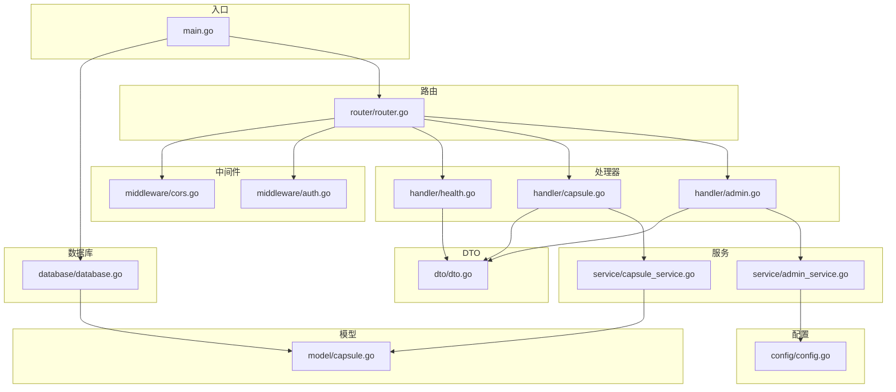
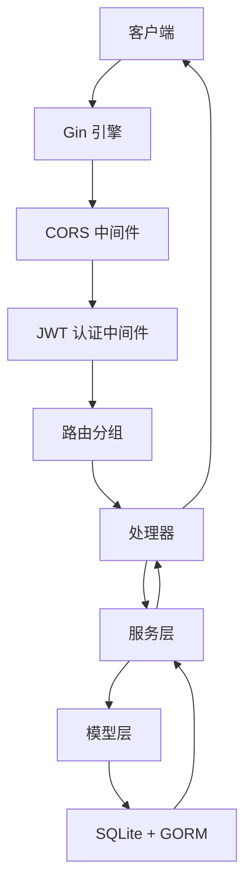
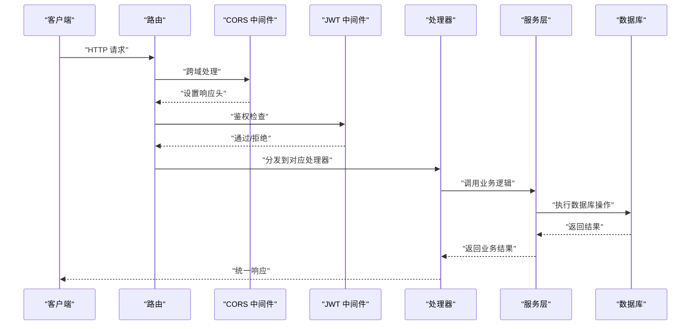
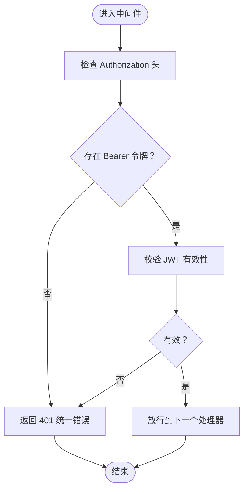
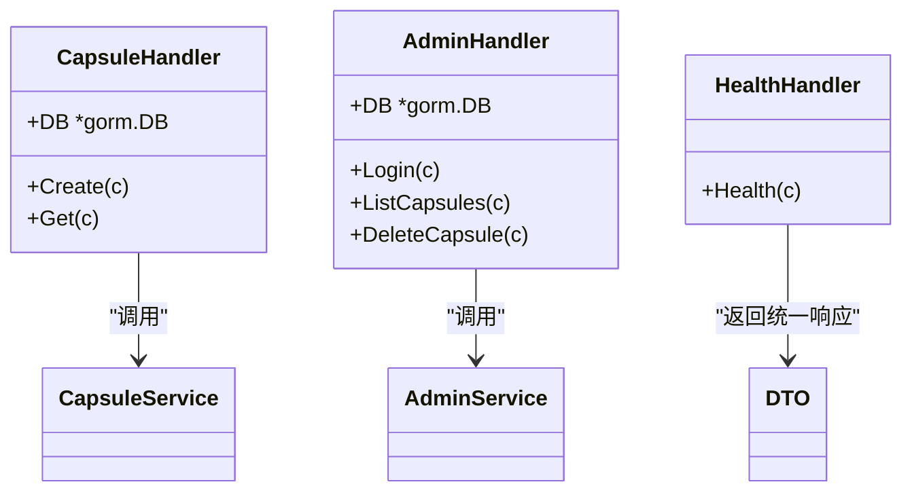
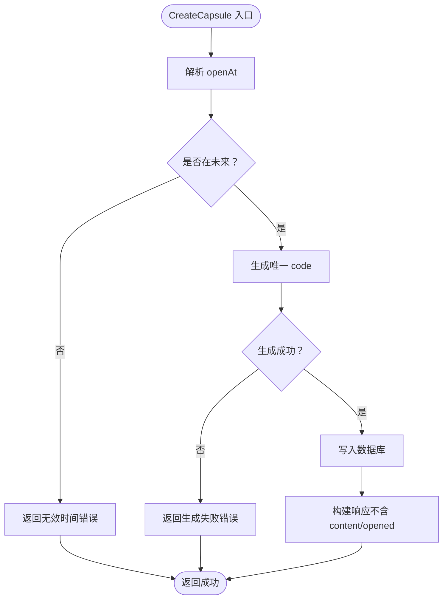
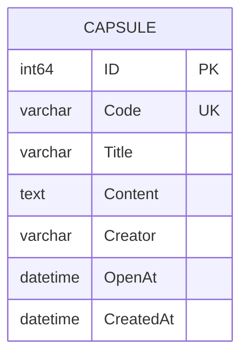
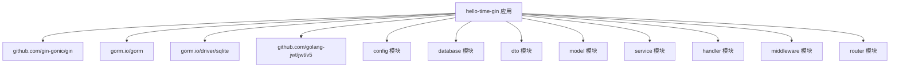

# Gin 实现

<cite>
**本文引用的文件**
- [main.go](file://backends/gin/main.go)
- [go.mod](file://backends/gin/go.mod)
- [config.go](file://backends/gin/config/config.go)
- [router.go](file://backends/gin/router/router.go)
- [database.go](file://backends/gin/database/database.go)
- [auth.go](file://backends/gin/middleware/auth.go)
- [cors.go](file://backends/gin/middleware/cors.go)
- [capsule.go](file://backends/gin/model/capsule.go)
- [admin.go](file://backends/gin/handler/admin.go)
- [capsule.go](file://backends/gin/handler/capsule.go)
- [health.go](file://backends/gin/handler/health.go)
- [admin_service.go](file://backends/gin/service/admin_service.go)
- [capsule_service.go](file://backends/gin/service/capsule_service.go)
- [dto.go](file://backends/gin/dto/dto.go)
- [admin_test.go](file://backends/gin/tests/admin_test.go)
- [capsule_test.go](file://backends/gin/tests/capsule_test.go)
- [README.md](file://backends/gin/README.md)
</cite>

## 目录
1. [简介](#简介)
2. [项目结构](#项目结构)
3. [核心组件](#核心组件)
4. [架构总览](#架构总览)
5. [详细组件分析](#详细组件分析)
6. [依赖分析](#依赖分析)
7. [性能考虑](#性能考虑)
8. [故障排查指南](#故障排查指南)
9. [结论](#结论)
10. [附录](#附录)

## 简介
本项目是基于 Go 1.25+ 与 Gin 框架实现的高性能后端服务，采用分层架构（路由层、处理器层、服务层、模型层），结合 GORM + SQLite 的数据持久化方案，提供统一的 RESTful API 接口。系统内置 JWT 管理员认证、CORS 跨域处理、全局异常与统一响应格式，并通过完备的单元测试覆盖关键业务流程。

## 项目结构
后端 Gin 项目采用按职责分层的目录组织方式：
- config：应用配置加载与环境变量解析
- database：数据库连接初始化与自动迁移
- model：GORM 数据模型定义
- dto：请求/响应数据传输对象
- service：业务逻辑封装
- handler：HTTP 请求处理与参数绑定
- middleware：中间件（CORS、JWT 认证）
- router：路由注册与分组
- tests：端到端与单元测试

**图表来源**
- [main.go:15-31](file://backends/gin/main.go#L15-L31)
- [router.go:11-45](file://backends/gin/router/router.go#L11-L45)
- [database.go:18-37](file://backends/gin/database/database.go#L18-L37)
- [config.go:31-43](file://backends/gin/config/config.go#L31-L43)

**章节来源**
- [README.md:84-111](file://backends/gin/README.md#L84-L111)
- [main.go:15-31](file://backends/gin/main.go#L15-L31)
- [router.go:11-45](file://backends/gin/router/router.go#L11-L45)

## 核心组件
- 应用入口与生命周期：初始化数据库、创建 Gin 引擎、注册路由、启动服务
- 配置模块：从环境变量加载数据库路径、管理员密码、JWT 密钥、过期时间、端口等
- 路由模块：注册健康检查、胶囊 CRUD、管理员登录与受保护的管理接口
- 中间件：CORS 跨域与 JWT 认证
- 处理器层：负责参数绑定、校验、调用服务层并返回统一响应
- 服务层：封装业务规则（唯一编码生成、时间校验、分页查询、JWT 生成与校验）
- 模型层：GORM 实体定义与表名映射
- DTO 层：统一响应结构与请求/响应数据结构
- 数据库：SQLite + GORM 自动迁移

**章节来源**
- [main.go:15-31](file://backends/gin/main.go#L15-L31)
- [config.go:31-43](file://backends/gin/config/config.go#L31-L43)
- [router.go:11-45](file://backends/gin/router/router.go#L11-L45)
- [dto.go:5-34](file://backends/gin/dto/dto.go#L5-L34)
- [capsule.go:6-20](file://backends/gin/model/capsule.go#L6-L20)

## 架构总览
系统采用经典的分层架构，请求自上而下进入，经由中间件、处理器、服务层，最终访问数据库；响应沿相反方向返回。JWT 认证中间件在管理员受保护路由生效，CORS 中间件对跨域请求进行放行与预检处理。

**图表来源**
- [router.go:11-45](file://backends/gin/router/router.go#L11-L45)
- [cors.go:13-35](file://backends/gin/middleware/cors.go#L13-L35)
- [auth.go:13-36](file://backends/gin/middleware/auth.go#L13-L36)

## 详细组件分析

### 路由设计与控制流
- 路由分组：/api/v1 下划分 /capsules 与 /admin 子路由
- 公开接口：GET /api/v1/health、POST /api/v1/capsules、GET /api/v1/capsules/:code
- 管理员接口：POST /api/v1/admin/login、GET /api/v1/admin/capsules、DELETE /api/v1/admin/capsules/:code
- 认证控制：管理员受保护路由启用 JWT 认证中间件

**图表来源**
- [router.go:19-44](file://backends/gin/router/router.go#L19-L44)
- [auth.go:15-36](file://backends/gin/middleware/auth.go#L15-L36)
- [capsule.go:19-38](file://backends/gin/handler/capsule.go#L19-L38)
- [admin.go:20-35](file://backends/gin/handler/admin.go#L20-L35)

**章节来源**
- [router.go:11-45](file://backends/gin/router/router.go#L11-L45)
- [health.go:12-23](file://backends/gin/handler/health.go#L12-L23)
- [capsule.go:19-55](file://backends/gin/handler/capsule.go#L19-L55)
- [admin.go:20-76](file://backends/gin/handler/admin.go#L20-L76)

### 中间件系统
- CORS 中间件：根据来源匹配本地开发域名，设置允许方法、头、凭证与缓存时间；OPTIONS 预检直接返回
- JWT 认证中间件：从 Authorization 头提取 Bearer Token，校验签名与有效期，失败则返回统一错误

**图表来源**
- [auth.go:15-36](file://backends/gin/middleware/auth.go#L15-L36)

**章节来源**
- [cors.go:13-35](file://backends/gin/middleware/cors.go#L13-L35)
- [auth.go:13-36](file://backends/gin/middleware/auth.go#L13-L36)

### 处理器层（Handlers）
- 健康检查：返回服务状态与技术栈信息
- 胶囊处理器：创建胶囊（参数绑定与校验）、查询胶囊（按 code）
- 管理员处理器：登录（密码校验并签发 JWT）、分页列出胶囊、删除胶囊

**图表来源**
- [capsule.go:14-17](file://backends/gin/handler/capsule.go#L14-L17)
- [admin.go:15-18](file://backends/gin/handler/admin.go#L15-L18)
- [health.go:12-23](file://backends/gin/handler/health.go#L12-L23)

**章节来源**
- [health.go:12-23](file://backends/gin/handler/health.go#L12-L23)
- [capsule.go:19-55](file://backends/gin/handler/capsule.go#L19-L55)
- [admin.go:20-76](file://backends/gin/handler/admin.go#L20-L76)

### 服务层（Services）
- 胶囊服务：生成唯一 8 位随机码、校验开启时间在未来、创建/查询/分页/删除胶囊、响应格式化
- 管理员认证服务：基于配置的管理员密码校验，签发 HS256 JWT 并验证

**图表来源**
- [capsule_service.go:94-129](file://backends/gin/service/capsule_service.go#L94-L129)

**章节来源**
- [capsule_service.go:19-59](file://backends/gin/service/capsule_service.go#L19-L59)
- [capsule_service.go:94-177](file://backends/gin/service/capsule_service.go#L94-L177)
- [admin_service.go:12-46](file://backends/gin/service/admin_service.go#L12-L46)

### 模型层（Models）
- Capsule 实体：主键自增、唯一 code、标题、内容、创建者、开启时间、创建时间
- 表名映射：显式指定表名为 capsules

**图表来源**
- [capsule.go:6-20](file://backends/gin/model/capsule.go#L6-L20)

**章节来源**
- [capsule.go:6-20](file://backends/gin/model/capsule.go#L6-L20)

### DTO 与统一响应
- 统一响应结构：success、data、message、errorCode
- 请求 DTO：创建胶囊、管理员登录
- 响应 DTO：胶囊详情、分页、管理员 token

**章节来源**
- [dto.go:5-34](file://backends/gin/dto/dto.go#L5-L34)
- [dto.go:36-77](file://backends/gin/dto/dto.go#L36-L77)

### JWT 认证与 CORS
- JWT：HS256 签名，包含 sub、iat、exp；中间件从 Authorization 提取 Bearer Token 并验证
- CORS：允许本地开发域名、常用方法与头、凭证与预检缓存

**章节来源**
- [admin_service.go:12-46](file://backends/gin/service/admin_service.go#L12-L46)
- [auth.go:13-36](file://backends/gin/middleware/auth.go#L13-L36)
- [cors.go:13-35](file://backends/gin/middleware/cors.go#L13-L35)

### 数据库集成（GORM + SQLite）
- 初始化：打开数据库连接，设置日志级别，自动迁移模型
- 迁移：自动创建 capsules 表

**章节来源**
- [database.go:18-37](file://backends/gin/database/database.go#L18-L37)

## 依赖分析
- 框架与库：Gin、GORM、SQLite 驱动、golang-jwt
- 版本：Go 1.25.0，Gin 1.12.0，GORM 1.31.1，JWT 5.3.1
- 内部模块：config、database、dto、model、service、handler、middleware、router

**图表来源**
- [go.mod:5-10](file://backends/gin/go.mod#L5-L10)

**章节来源**
- [go.mod:1-46](file://backends/gin/go.mod#L1-L46)

## 性能考虑
- 并发处理：Gin 默认并发安全，建议在生产中配合反向代理与连接池优化
- 内存管理：避免在热路径上分配过多临时对象，复用缓冲区与结构体
- 数据库：SQLite 适合小规模并发；如需更高吞吐，可评估 MySQL/PostgreSQL 与连接池配置
- 序列化：使用高效的 JSON 编解码库（项目已引入相关间接依赖）
- 中间件链：减少不必要的中间件调用，按需启用 CORS 与认证
- 日志：生产环境降低日志级别，避免高频写盘

## 故障排查指南
- 健康检查失败：确认端口与环境变量，检查路由注册与中间件链
- JWT 401：确认 Authorization 头格式为 Bearer Token，密钥与过期时间配置正确
- CORS 问题：确认来源匹配本地开发域名，预检请求已正确处理
- 数据库连接失败：检查 DATABASE_URL 路径与权限，确认迁移成功
- 参数校验错误：检查请求体字段与绑定标签，确保符合 DTO 规范

**章节来源**
- [health.go:12-23](file://backends/gin/handler/health.go#L12-L23)
- [auth.go:15-36](file://backends/gin/middleware/auth.go#L15-L36)
- [cors.go:13-35](file://backends/gin/middleware/cors.go#L13-L35)
- [database.go:18-37](file://backends/gin/database/database.go#L18-L37)
- [dto.go:36-77](file://backends/gin/dto/dto.go#L36-L77)

## 结论
该 Gin 后端实现遵循清晰的分层架构，具备良好的可维护性与扩展性。通过统一的响应格式、完善的中间件与服务层封装，满足 RESTful API 的核心需求。建议在生产环境中进一步完善监控、限流与数据库选型，并持续优化测试覆盖率与部署自动化。

## 附录
- 快速开始与环境变量参考见 README
- API 端点与响应格式详见 README

**章节来源**
- [README.md:20-60](file://backends/gin/README.md#L20-L60)
- [README.md:61-83](file://backends/gin/README.md#L61-L83)
- [README.md:145-166](file://backends/gin/README.md#L145-L166)