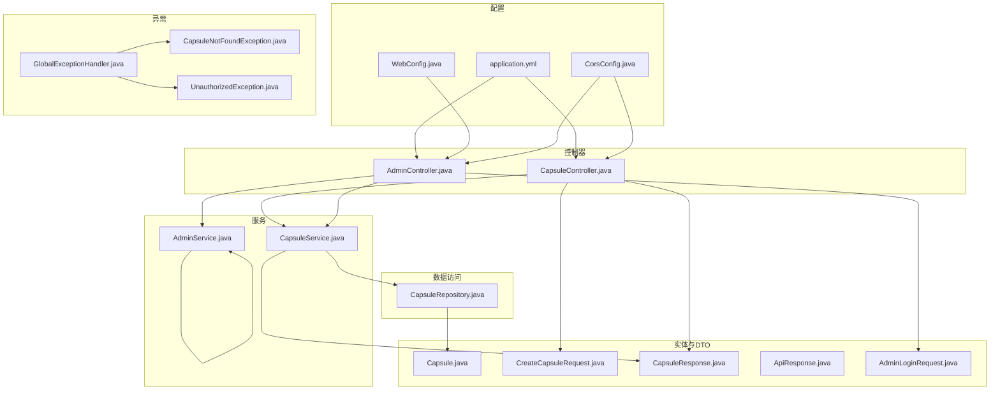
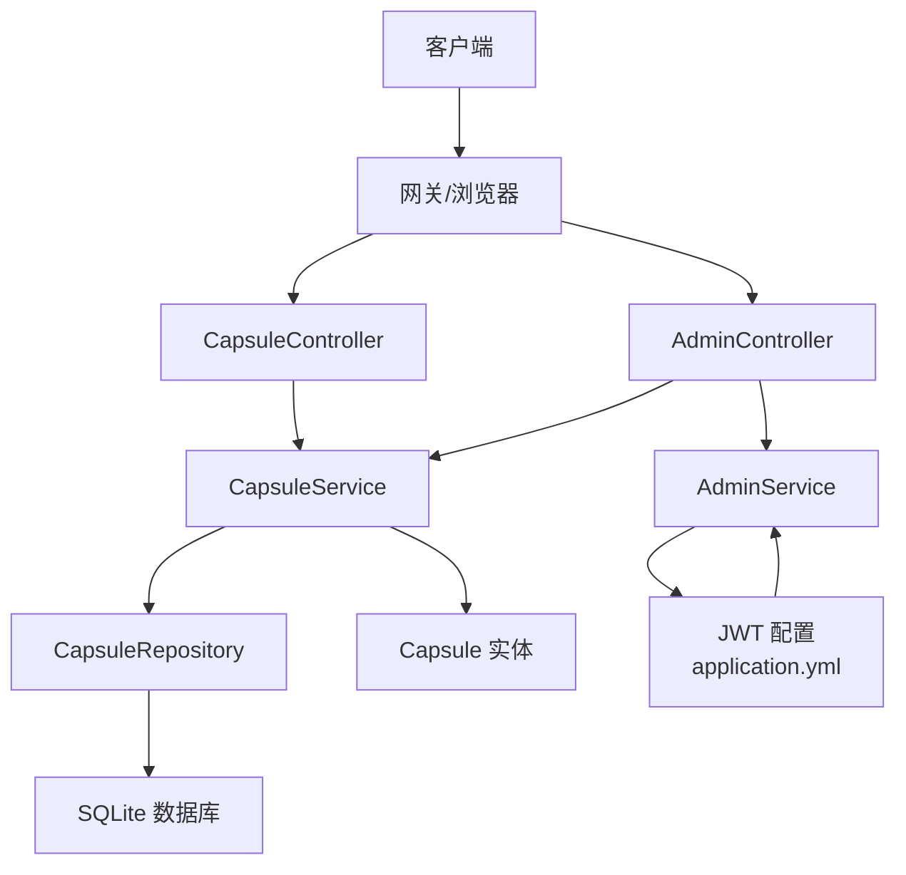
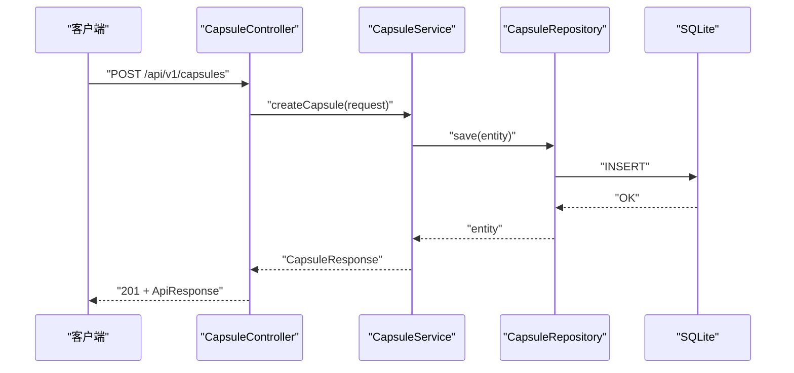
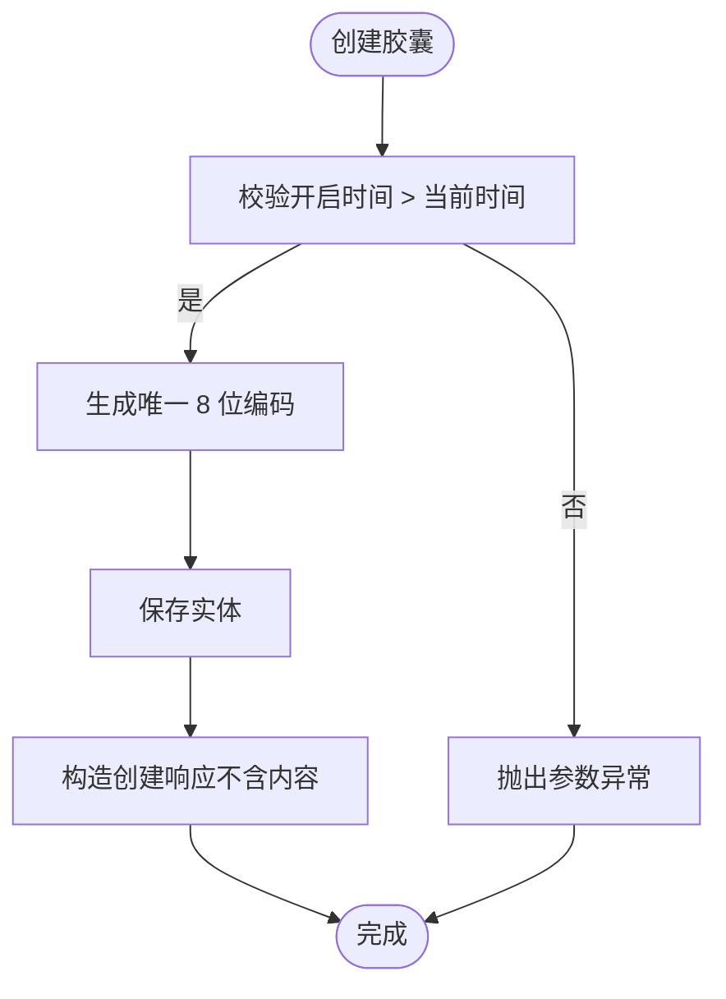
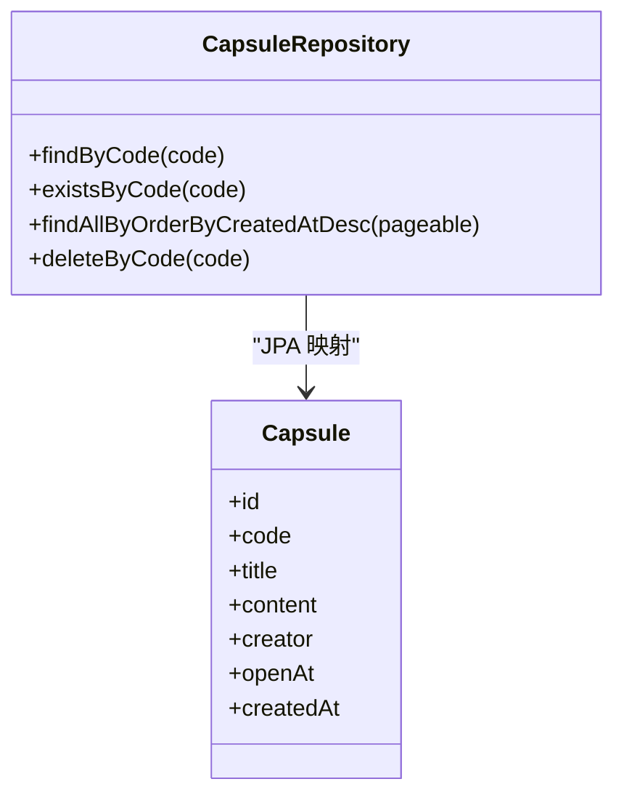
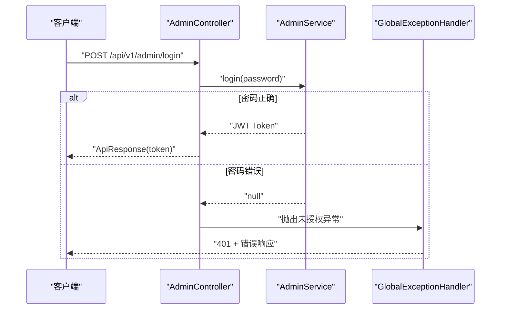
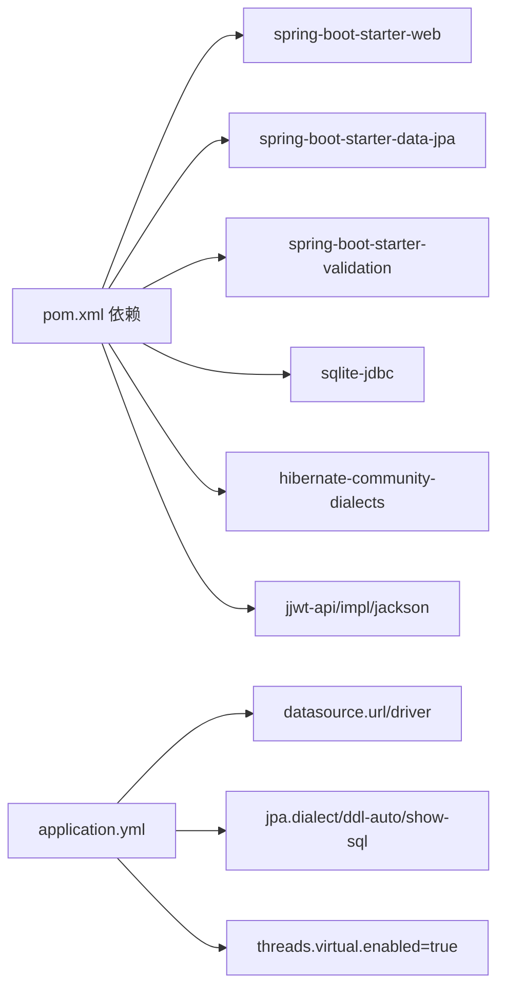

# Spring Boot 实现

<cite>
**本文引用的文件**
- [pom.xml](file://backends/spring-boot/pom.xml)
- [application.yml](file://backends/spring-boot/src/main/resources/application.yml)
- [HelloTimeApplication.java](file://backends/spring-boot/src/main/java/com/hellotime/HelloTimeApplication.java)
- [README.md](file://backends/spring-boot/README.md)
- [CapsuleController.java](file://backends/spring-boot/src/main/java/com/hellotime/controller/CapsuleController.java)
- [AdminController.java](file://backends/spring-boot/src/main/java/com/hellotime/controller/AdminController.java)
- [CapsuleService.java](file://backends/spring-boot/src/main/java/com/hellotime/service/CapsuleService.java)
- [AdminService.java](file://backends/spring-boot/src/main/java/com/hellotime/service/AdminService.java)
- [CapsuleRepository.java](file://backends/spring-boot/src/main/java/com/hellotime/repository/CapsuleRepository.java)
- [Capsule.java](file://backends/spring-boot/src/main/java/com/hellotime/entity/Capsule.java)
- [CreateCapsuleRequest.java](file://backends/spring-boot/src/main/java/com/hellotime/dto/CreateCapsuleRequest.java)
- [CapsuleResponse.java](file://backends/spring-boot/src/main/java/com/hellotime/dto/CapsuleResponse.java)
- [ApiResponse.java](file://backends/spring-boot/src/main/java/com/hellotime/dto/ApiResponse.java)
- [AdminLoginRequest.java](file://backends/spring-boot/src/main/java/com/hellotime/dto/AdminLoginRequest.java)
- [GlobalExceptionHandler.java](file://backends/spring-boot/src/main/java/com/hellotime/exception/GlobalExceptionHandler.java)
- [CapsuleNotFoundException.java](file://backends/spring-boot/src/main/java/com/hellotime/exception/CapsuleNotFoundException.java)
- [UnauthorizedException.java](file://backends/spring-boot/src/main/java/com/hellotime/exception/UnauthorizedException.java)
- [WebConfig.java](file://backends/spring-boot/src/main/java/com/hellotime/config/WebConfig.java)
- [CorsConfig.java](file://backends/spring-boot/src/main/java/com/hellotime/config/CorsConfig.java)
</cite>

## 目录
1. [简介](#简介)
2. [项目结构](#项目结构)
3. [核心组件](#核心组件)
4. [架构总览](#架构总览)
5. [详细组件分析](#详细组件分析)
6. [依赖关系分析](#依赖关系分析)
7. [性能考虑](#性能考虑)
8. [故障排查指南](#故障排查指南)
9. [结论](#结论)
10. [附录](#附录)

## 简介
本项目为基于 Spring Boot 3 与 Java 21 的时间胶囊后端实现，采用 SQLite + Spring Data JPA 进行数据持久化，提供 RESTful API 并通过 JWT 实现管理员认证。系统遵循 OpenAPI 规范，统一响应格式，具备全局异常处理与 CORS 跨域支持，并启用 Java 21 虚拟线程以提升并发性能。

## 项目结构
后端代码位于 backends/spring-boot，采用标准 Maven 结构，按职责分层组织：
- config：Web 配置与 CORS
- controller：REST 控制器（管理员与胶囊）
- service：业务逻辑层（管理员与胶囊）
- repository：数据访问层（JPA）
- entity：JPA 实体
- dto：数据传输对象（统一响应与请求体）
- exception：异常定义与全局异常处理
- resources：应用配置与测试资源

图表来源
- [application.yml:1-26](file://backends/spring-boot/src/main/resources/application.yml#L1-L26)
- [WebConfig.java:1-32](file://backends/spring-boot/src/main/java/com/hellotime/config/WebConfig.java#L1-L32)
- [CorsConfig.java:1-28](file://backends/spring-boot/src/main/java/com/hellotime/config/CorsConfig.java#L1-L28)
- [CapsuleController.java:1-57](file://backends/spring-boot/src/main/java/com/hellotime/controller/CapsuleController.java#L1-L57)
- [AdminController.java:1-79](file://backends/spring-boot/src/main/java/com/hellotime/controller/AdminController.java#L1-L79)
- [CapsuleService.java:1-196](file://backends/spring-boot/src/main/java/com/hellotime/service/CapsuleService.java#L1-L196)
- [AdminService.java:1-89](file://backends/spring-boot/src/main/java/com/hellotime/service/AdminService.java#L1-L89)
- [CapsuleRepository.java:1-48](file://backends/spring-boot/src/main/java/com/hellotime/repository/CapsuleRepository.java#L1-L48)
- [Capsule.java:1-90](file://backends/spring-boot/src/main/java/com/hellotime/entity/Capsule.java#L1-L90)
- [CreateCapsuleRequest.java:1-32](file://backends/spring-boot/src/main/java/com/hellotime/dto/CreateCapsuleRequest.java#L1-L32)
- [CapsuleResponse.java:1-27](file://backends/spring-boot/src/main/java/com/hellotime/dto/CapsuleResponse.java#L1-L27)
- [ApiResponse.java:1-48](file://backends/spring-boot/src/main/java/com/hellotime/dto/ApiResponse.java#L1-L48)
- [AdminLoginRequest.java:1-14](file://backends/spring-boot/src/main/java/com/hellotime/dto/AdminLoginRequest.java#L1-L14)
- [GlobalExceptionHandler.java:1-66](file://backends/spring-boot/src/main/java/com/hellotime/exception/GlobalExceptionHandler.java#L1-L66)
- [CapsuleNotFoundException.java:1-19](file://backends/spring-boot/src/main/java/com/hellotime/exception/CapsuleNotFoundException.java#L1-L19)
- [UnauthorizedException.java:1-19](file://backends/spring-boot/src/main/java/com/hellotime/exception/UnauthorizedException.java#L1-L19)

章节来源
- [HelloTimeApplication.java:1-12](file://backends/spring-boot/src/main/java/com/hellotime/HelloTimeApplication.java#L1-L12)
- [README.md:77-87](file://backends/spring-boot/README.md#L77-L87)

## 核心组件
- 项目启动类：负责应用引导与自动扫描
- 配置模块：数据库连接、JPA 方言、虚拟线程、JWT 密钥与过期时间、CORS 策略
- 控制器层：提供胶囊 CRUD 与管理员认证、列表、删除等接口
- 服务层：封装业务规则（唯一码生成、开启时间控制、管理员鉴权）
- 数据访问层：基于 JPA 的胶囊数据存取
- DTO 层：统一请求/响应模型与分页包装
- 异常处理：集中捕获并返回统一错误格式

章节来源
- [pom.xml:20-80](file://backends/spring-boot/pom.xml#L20-L80)
- [application.yml:1-26](file://backends/spring-boot/src/main/resources/application.yml#L1-L26)
- [CapsuleController.java:17-57](file://backends/spring-boot/src/main/java/com/hellotime/controller/CapsuleController.java#L17-L57)
- [AdminController.java:18-79](file://backends/spring-boot/src/main/java/com/hellotime/controller/AdminController.java#L18-L79)
- [CapsuleService.java:26-196](file://backends/spring-boot/src/main/java/com/hellotime/service/CapsuleService.java#L26-L196)
- [AdminService.java:18-89](file://backends/spring-boot/src/main/java/com/hellotime/service/AdminService.java#L18-L89)
- [CapsuleRepository.java:15-48](file://backends/spring-boot/src/main/java/com/hellotime/repository/CapsuleRepository.java#L15-L48)
- [Capsule.java:10-90](file://backends/spring-boot/src/main/java/com/hellotime/entity/Capsule.java#L10-L90)
- [ApiResponse.java:21-48](file://backends/spring-boot/src/main/java/com/hellotime/dto/ApiResponse.java#L21-L48)
- [GlobalExceptionHandler.java:17-66](file://backends/spring-boot/src/main/java/com/hellotime/exception/GlobalExceptionHandler.java#L17-L66)

## 架构总览
系统采用经典的三层架构（控制器-服务-数据访问），结合 Spring Boot 自动装配与 JPA/Hibernate，实现快速开发与可维护性。JWT 用于管理员认证，拦截器对受保护路径进行鉴权；CORS 在配置层统一开放本地开发域。

图表来源
- [CapsuleController.java:17-57](file://backends/spring-boot/src/main/java/com/hellotime/controller/CapsuleController.java#L17-L57)
- [AdminController.java:18-79](file://backends/spring-boot/src/main/java/com/hellotime/controller/AdminController.java#L18-L79)
- [CapsuleService.java:26-196](file://backends/spring-boot/src/main/java/com/hellotime/service/CapsuleService.java#L26-L196)
- [AdminService.java:18-89](file://backends/spring-boot/src/main/java/com/hellotime/service/AdminService.java#L18-L89)
- [CapsuleRepository.java:15-48](file://backends/spring-boot/src/main/java/com/hellotime/repository/CapsuleRepository.java#L15-L48)
- [Capsule.java:10-90](file://backends/spring-boot/src/main/java/com/hellotime/entity/Capsule.java#L10-L90)
- [application.yml:20-26](file://backends/spring-boot/src/main/resources/application.yml#L20-L26)

## 详细组件分析

### 控制器层
- CapsuleController
  - 提供创建胶囊与详情查询接口，使用统一响应包装与状态码控制
  - 参数校验由 @Valid 与 DTO 注解驱动
- AdminController
  - 提供管理员登录、分页列表与删除胶囊接口
  - 除登录外均需认证，拦截器自动生效

图表来源
- [CapsuleController.java:37-42](file://backends/spring-boot/src/main/java/com/hellotime/controller/CapsuleController.java#L37-L42)
- [CapsuleService.java:52-73](file://backends/spring-boot/src/main/java/com/hellotime/service/CapsuleService.java#L52-L73)
- [CapsuleRepository.java:15-48](file://backends/spring-boot/src/main/java/com/hellotime/repository/CapsuleRepository.java#L15-L48)

章节来源
- [CapsuleController.java:17-57](file://backends/spring-boot/src/main/java/com/hellotime/controller/CapsuleController.java#L17-L57)
- [AdminController.java:18-79](file://backends/spring-boot/src/main/java/com/hellotime/controller/AdminController.java#L18-L79)

### 服务层
- CapsuleService
  - 事务性创建胶囊，校验开启时间为未来时间
  - 生成唯一 8 位 Base62 编码胶囊码，冲突时重试
  - 查询详情时根据当前时间决定是否返回内容字段
  - 管理员视角始终返回完整内容
- AdminService
  - 基于 HMAC-SHA256 的 JWT 签发与校验
  - 支持从配置读取管理员密码与密钥、过期时间

图表来源
- [CapsuleService.java:52-73](file://backends/spring-boot/src/main/java/com/hellotime/service/CapsuleService.java#L52-L73)

章节来源
- [CapsuleService.java:26-196](file://backends/spring-boot/src/main/java/com/hellotime/service/CapsuleService.java#L26-L196)
- [AdminService.java:18-89](file://backends/spring-boot/src/main/java/com/hellotime/service/AdminService.java#L18-L89)

### 数据访问层
- CapsuleRepository
  - 继承 JpaRepository，提供按编码查询、存在性检查、分页排序与删除
  - 自动根据方法名生成 SQL，减少样板代码

图表来源
- [CapsuleRepository.java:15-48](file://backends/spring-boot/src/main/java/com/hellotime/repository/CapsuleRepository.java#L15-L48)
- [Capsule.java:10-90](file://backends/spring-boot/src/main/java/com/hellotime/entity/Capsule.java#L10-L90)

章节来源
- [CapsuleRepository.java:15-48](file://backends/spring-boot/src/main/java/com/hellotime/repository/CapsuleRepository.java#L15-L48)
- [Capsule.java:10-90](file://backends/spring-boot/src/main/java/com/hellotime/entity/Capsule.java#L10-L90)

### 安全机制与认证流程
- JWT 认证
  - 登录成功签发带过期时间的 JWT
  - 校验签名与过期时间，异常统一由全局处理器返回
- 拦截器
  - WebConfig 对 /api/v1/admin/** 路径启用拦截，排除登录接口
- CORS
  - CorsConfig 对 /api/** 设置允许本地开发域、方法与头

图表来源
- [AdminController.java:41-48](file://backends/spring-boot/src/main/java/com/hellotime/controller/AdminController.java#L41-L48)
- [AdminService.java:53-66](file://backends/spring-boot/src/main/java/com/hellotime/service/AdminService.java#L53-L66)
- [GlobalExceptionHandler.java:35-41](file://backends/spring-boot/src/main/java/com/hellotime/exception/GlobalExceptionHandler.java#L35-L41)

章节来源
- [WebConfig.java:25-30](file://backends/spring-boot/src/main/java/com/hellotime/config/WebConfig.java#L25-L30)
- [CorsConfig.java:14-26](file://backends/spring-boot/src/main/java/com/hellotime/config/CorsConfig.java#L14-L26)
- [GlobalExceptionHandler.java:17-66](file://backends/spring-boot/src/main/java/com/hellotime/exception/GlobalExceptionHandler.java#L17-L66)

### 统一响应与异常处理
- ApiResponse
  - 统一 success/data/message/errorCode 字段，支持静态工厂方法
- GlobalExceptionHandler
  - 捕获业务与参数校验异常，映射为标准 HTTP 状态码与错误码

章节来源
- [ApiResponse.java:21-48](file://backends/spring-boot/src/main/java/com/hellotime/dto/ApiResponse.java#L21-L48)
- [GlobalExceptionHandler.java:17-66](file://backends/spring-boot/src/main/java/com/hellotime/exception/GlobalExceptionHandler.java#L17-L66)
- [CapsuleNotFoundException.java:8-19](file://backends/spring-boot/src/main/java/com/hellotime/exception/CapsuleNotFoundException.java#L8-L19)
- [UnauthorizedException.java:8-19](file://backends/spring-boot/src/main/java/com/hellotime/exception/UnauthorizedException.java#L8-L19)

## 依赖关系分析
- 构建与运行
  - Spring Boot Starter Web/JPA/Validation
  - SQLite JDBC 与 Hibernate SQLite 方言
  - jjwt API/Impl/Jackson
  - Maven 插件打包
- 运行时配置
  - 数据源指向 SQLite 文件
  - JPA 方言为 SQLiteDialect
  - 启用虚拟线程（Java 21+）

图表来源
- [pom.xml:25-80](file://backends/spring-boot/pom.xml#L25-L80)
- [application.yml:4-15](file://backends/spring-boot/src/main/resources/application.yml#L4-L15)

章节来源
- [pom.xml:20-91](file://backends/spring-boot/pom.xml#L20-L91)
- [application.yml:1-26](file://backends/spring-boot/src/main/resources/application.yml#L1-L26)

## 性能考虑
- 虚拟线程
  - 通过配置启用，适合高并发 I/O 密集场景，降低线程切换开销
- 数据库与索引
  - 建议为 code 字段建立唯一索引（JPA 已声明唯一，DDL 自动更新）
  - 对 open_at 与 created_at 建立索引可优化查询与排序
- 查询优化
  - 分页查询使用 PageRequest，避免一次性加载大量数据
  - 管理员列表按创建时间倒序，合理使用索引
- 缓存策略
  - 对热点查询（如详情）可引入 Redis 缓存，注意未开启内容的缓存隔离
- 日志与监控
  - 生产关闭 show-sql，开启必要的慢查询日志与指标采集

## 故障排查指南
- 401 未授权
  - 检查请求头 Authorization 是否携带 Bearer Token
  - 核对 JWT 密钥与过期时间配置
- 404 胶囊不存在
  - 确认 code 是否正确且未被删除
- 400 参数校验失败
  - 关注字段长度与非空约束提示
- 500 服务器内部错误
  - 查看服务端日志定位异常堆栈
- CORS 跨域问题
  - 确认前端访问地址在允许模式中，或调整允许来源

章节来源
- [GlobalExceptionHandler.java:34-51](file://backends/spring-boot/src/main/java/com/hellotime/exception/GlobalExceptionHandler.java#L34-L51)
- [CorsConfig.java:14-26](file://backends/spring-boot/src/main/java/com/hellotime/config/CorsConfig.java#L14-L26)
- [application.yml:20-26](file://backends/spring-boot/src/main/resources/application.yml#L20-L26)

## 结论
该实现以清晰的分层架构、统一的响应与异常处理、完善的认证与跨域配置，提供了稳定可靠的时间胶囊后端能力。通过 SQLite 与 JPA 的组合满足轻量级需求，同时保留扩展至生产数据库与引入缓存/监控的灵活性。

## 附录

### API 端点概览
- 胶囊相关
  - POST /api/v1/capsules：创建胶囊
  - GET /api/v1/capsules/{code}：获取胶囊详情（未开启隐藏内容）
- 管理员相关
  - POST /api/v1/admin/login：管理员登录，返回 JWT
  - GET /api/v1/admin/capsules?page=&size=：分页列表（管理员）
  - DELETE /api/v1/admin/capsules/{code}：删除胶囊（管理员）
- 健康检查
  - GET /health：返回技术栈信息

章节来源
- [README.md:54-76](file://backends/spring-boot/README.md#L54-L76)

### 数据库 Schema 设计
- 表名：capsules
- 字段
  - code：VARCHAR(8)，唯一，主键
  - title：VARCHAR(100)
  - content：TEXT
  - creator：VARCHAR(30)
  - open_at：DATETIME（UTC）
  - created_at：DATETIME（UTC，持久化时自动填充）

章节来源
- [Capsule.java:10-90](file://backends/spring-boot/src/main/java/com/hellotime/entity/Capsule.java#L10-L90)

### 配置与环境变量
- 数据库
  - datasource.url：jdbc:sqlite:../../data/hellotime.db
  - driver-class-name：org.sqlite.JDBC
  - jpa.database-platform：SQLiteDialect
  - jpa.hibernate.ddl-auto：update
  - jpa.show-sql：false
- 线程
  - threads.virtual.enabled：true
- 服务端口
  - server.port：8080
- 应用配置
  - app.admin.password：管理员密码（默认值）
  - app.jwt.secret：JWT 密钥（默认值）
  - app.jwt.expiration-hours：2

章节来源
- [application.yml:1-26](file://backends/spring-boot/src/main/resources/application.yml#L1-L26)

### 测试策略
- 单元测试
  - 控制器层：验证响应码、统一响应结构、异常分支
  - 服务层：业务规则（唯一码生成、开启时间判定、分页）
- 集成测试
  - 数据访问层：JPA 与 SQLite 的端到端验证
- 建议
  - 使用 @DataJpaTest 与 @WebMvcTest 分层测试
  - Mock 外部依赖（如 JWT 解析）以聚焦单元边界

### 部署指南
- 构建
  - 使用 Maven Wrapper 打包：./mvnw clean package
  - 运行：java -jar target/hellotime-backend-1.0.0.jar
- 环境准备
  - 准备 data 目录用于存放 SQLite 数据库文件
  - 设置环境变量 ADMIN_PASSWORD 与 JWT_SECRET
- 运维
  - 生产关闭 show-sql，开启日志级别与慢查询监控
  - 如需高可用，替换为 MySQL/PostgreSQL 并配置连接池

章节来源
- [README.md:99-107](file://backends/spring-boot/README.md#L99-L107)
- [application.yml:17-26](file://backends/spring-boot/src/main/resources/application.yml#L17-L26)