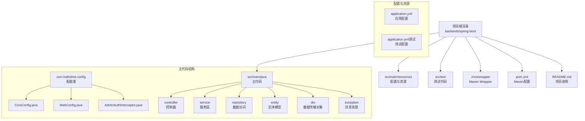
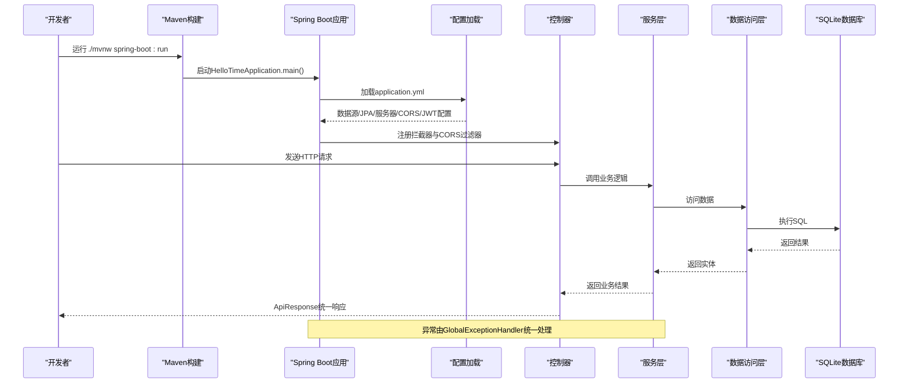
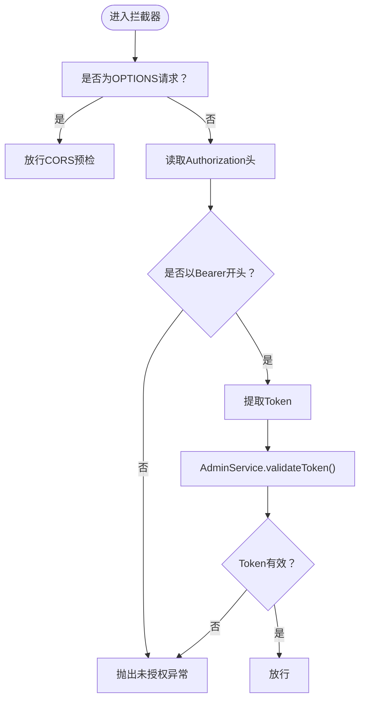
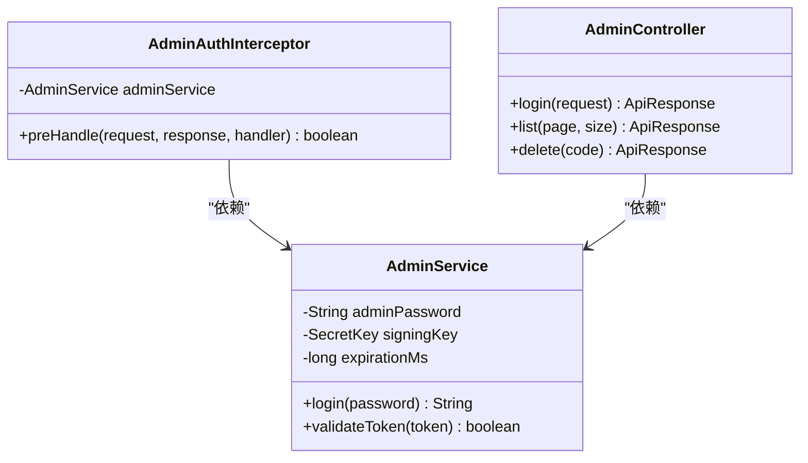
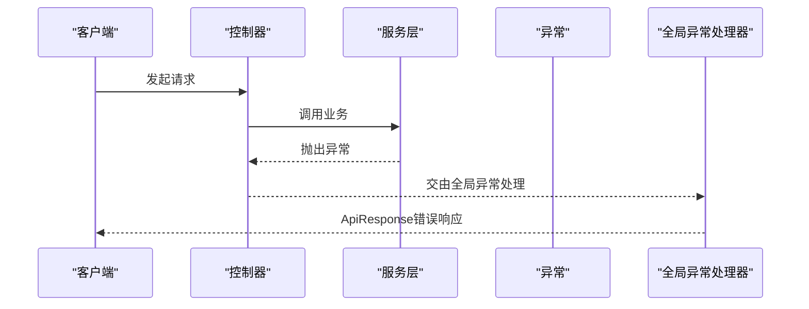
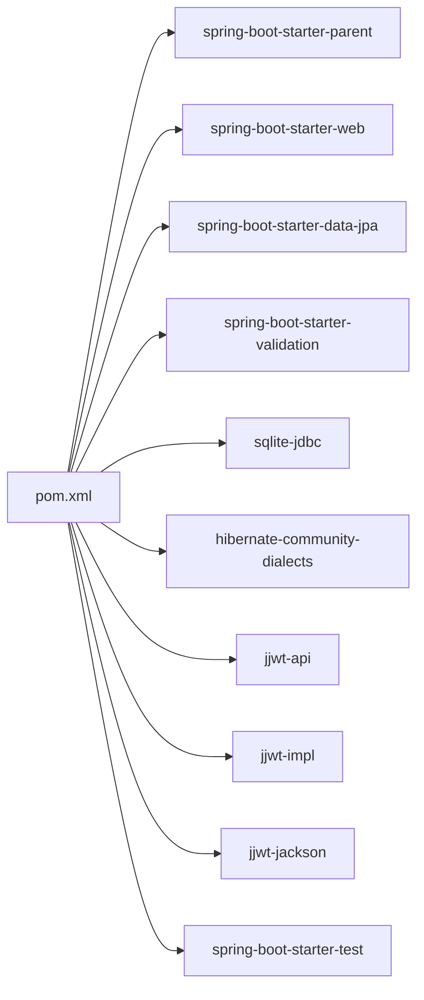

# 项目初始化与配置

<cite>
**本文引用的文件**
- [pom.xml](file://backends/spring-boot/pom.xml)
- [application.yml](file://backends/spring-boot/src/main/resources/application.yml)
- [HelloTimeApplication.java](file://backends/spring-boot/src/main/java/com/hellotime/HelloTimeApplication.java)
- [README.md](file://backends/spring-boot/README.md)
- [CorsConfig.java](file://backends/spring-boot/src/main/java/com/hellotime/config/CorsConfig.java)
- [WebConfig.java](file://backends/spring-boot/src/main/java/com/hellotime/config/WebConfig.java)
- [AdminAuthInterceptor.java](file://backends/spring-boot/src/main/java/com/hellotime/config/AdminAuthInterceptor.java)
- [AdminController.java](file://backends/spring-boot/src/main/java/com/hellotime/controller/AdminController.java)
- [AdminService.java](file://backends/spring-boot/src/main/java/com/hellotime/service/AdminService.java)
- [GlobalExceptionHandler.java](file://backends/spring-boot/src/main/java/com/hellotime/exception/GlobalExceptionHandler.java)
- [ApiResponse.java](file://backends/spring-boot/src/main/java/com/hellotime/dto/ApiResponse.java)
- [maven-wrapper.properties](file://backends/spring-boot/.mvn/wrapper/maven-wrapper.properties)
- [mvnw.cmd](file://backends/spring-boot/mvnw.cmd)
- [application.yml（测试）](file://backends/spring-boot/src/test/resources/application.yml)
</cite>

## 目录
1. [简介](#简介)
2. [项目结构](#项目结构)
3. [核心组件](#核心组件)
4. [架构总览](#架构总览)
5. [详细组件分析](#详细组件分析)
6. [依赖关系分析](#依赖关系分析)
7. [性能考虑](#性能考虑)
8. [故障排查指南](#故障排查指南)
9. [结论](#结论)
10. [附录](#附录)

## 简介
本文件面向Spring Boot项目的初始化与配置，围绕HelloTime后端服务，系统性阐述以下主题：
- Maven配置（pom.xml）：Spring Boot依赖、Java版本、插件配置
- 应用配置（application.yml）：数据库连接、服务器端口、CORS、JWT密钥等
- 启动注解与自动配置机制（@SpringBootApplication）
- 项目启动流程、环境变量配置、开发环境搭建步骤
- 常见配置问题排查与解决方案

## 项目结构
Spring Boot模块位于backends/spring-boot目录，采用标准的Maven多模块布局，主要源代码位于src/main/java与src/main/resources，测试代码位于src/test。

图表来源
- [pom.xml:1-91](file://backends/spring-boot/pom.xml#L1-L91)
- [application.yml:1-26](file://backends/spring-boot/src/main/resources/application.yml#L1-L26)
- [application.yml（测试）:1-16](file://backends/spring-boot/src/test/resources/application.yml#L1-L16)

章节来源
- [pom.xml:1-91](file://backends/spring-boot/pom.xml#L1-L91)
- [application.yml:1-26](file://backends/spring-boot/src/main/resources/application.yml#L1-L26)
- [README.md:1-136](file://backends/spring-boot/README.md#L1-L136)

## 核心组件
- Maven配置（pom.xml）：定义Spring Boot父工程版本、Java版本、核心依赖（Web、JPA、Validation、SQLite、JWT）、测试依赖与构建插件。
- 应用配置（application.yml）：定义数据源（SQLite）、JPA方言与DDL策略、服务器端口、虚拟线程开关、管理员密码与JWT密钥等。
- 启动类（HelloTimeApplication.java）：通过@SpringBootApplication启用自动配置与组件扫描。
- 安全与CORS：WebConfig注册拦截器，AdminAuthInterceptor校验JWT；CorsConfig配置跨域策略。
- 统一响应与异常处理：ApiResponse统一响应格式；GlobalExceptionHandler统一异常处理。
- 环境变量：通过${VAR:default}语法支持外部化配置。

章节来源
- [pom.xml:1-91](file://backends/spring-boot/pom.xml#L1-L91)
- [application.yml:1-26](file://backends/spring-boot/src/main/resources/application.yml#L1-L26)
- [HelloTimeApplication.java:1-12](file://backends/spring-boot/src/main/java/com/hellotime/HelloTimeApplication.java#L1-L12)
- [WebConfig.java:1-32](file://backends/spring-boot/src/main/java/com/hellotime/config/WebConfig.java#L1-L32)
- [AdminAuthInterceptor.java:1-59](file://backends/spring-boot/src/main/java/com/hellotime/config/AdminAuthInterceptor.java#L1-L59)
- [CorsConfig.java:1-28](file://backends/spring-boot/src/main/java/com/hellotime/config/CorsConfig.java#L1-L28)
- [GlobalExceptionHandler.java:1-66](file://backends/spring-boot/src/main/java/com/hellotime/exception/GlobalExceptionHandler.java#L1-L66)
- [ApiResponse.java:1-48](file://backends/spring-boot/src/main/java/com/hellotime/dto/ApiResponse.java#L1-L48)

## 架构总览
下图展示Spring Boot启动与请求处理的关键流程，涵盖Maven依赖、配置加载、拦截器链与异常处理。

图表来源
- [HelloTimeApplication.java:1-12](file://backends/spring-boot/src/main/java/com/hellotime/HelloTimeApplication.java#L1-L12)
- [application.yml:1-26](file://backends/spring-boot/src/main/resources/application.yml#L1-L26)
- [WebConfig.java:1-32](file://backends/spring-boot/src/main/java/com/hellotime/config/WebConfig.java#L1-L32)
- [AdminAuthInterceptor.java:1-59](file://backends/spring-boot/src/main/java/com/hellotime/config/AdminAuthInterceptor.java#L1-L59)
- [GlobalExceptionHandler.java:1-66](file://backends/spring-boot/src/main/java/com/hellotime/exception/GlobalExceptionHandler.java#L1-L66)

## 详细组件分析

### Maven配置（pom.xml）
- 父工程与版本：继承spring-boot-starter-parent，版本号为3.2.5，确保依赖管理与插件版本一致。
- 项目坐标：groupId、artifactId、version、name、description。
- 属性配置：java.version设为21；jjwt.version统一管理JWT版本。
- 依赖说明：
  - spring-boot-starter-web：Web层依赖
  - spring-boot-starter-data-jpa：JPA数据访问
  - spring-boot-starter-validation：参数校验
  - sqlite-jdbc与Hibernate社区方言：SQLite驱动与方言
  - jjwt-api/impl/jackson：JWT实现与序列化
  - spring-boot-starter-test：测试依赖
- 插件：spring-boot-maven-plugin用于打包与运行。

章节来源
- [pom.xml:1-91](file://backends/spring-boot/pom.xml#L1-L91)

### 应用配置（application.yml）
- spring.application.name：应用名称
- spring.datasource：SQLite数据源，JDBC URL指向相对路径数据库文件，驱动类为SQLite JDBC
- spring.jpa：数据库平台为SQLite方言，DDL策略为update，关闭show-sql
- spring.threads.virtual.enabled：启用虚拟线程（Java 21+特性）
- server.port：HTTP服务器端口为8080
- app.admin.password：管理员密码，默认值通过环境变量覆盖
- app.jwt.secret：JWT签名密钥，默认值通过环境变量覆盖
- app.jwt.expiration-hours：Token过期时间（小时）

章节来源
- [application.yml:1-26](file://backends/spring-boot/src/main/resources/application.yml#L1-L26)

### 启动类与自动配置（@SpringBootApplication）
- HelloTimeApplication作为入口类，使用@SpringBootApplication注解，组合了@ComponentScan、@EnableAutoConfiguration与@Configuration。
- 自动配置机制会根据classpath中的依赖（如Web Starter、JPA Starter、SQLite驱动）自动装配相应的Bean与配置，例如：
  - Web MVC自动配置：DispatcherServlet、视图解析器、拦截器注册
  - JPA自动配置：EntityManagerFactory、TransactionManager、Repository扫描
  - DataSource与JPA属性绑定：从application.yml读取数据源与JPA配置
- 开发者可通过自定义配置类（如WebConfig、CorsConfig）扩展或覆盖默认行为。

章节来源
- [HelloTimeApplication.java:1-12](file://backends/spring-boot/src/main/java/com/hellotime/HelloTimeApplication.java#L1-L12)
- [application.yml:1-26](file://backends/spring-boot/src/main/resources/application.yml#L1-L26)

### CORS与拦截器配置
- CorsConfig：定义CORS策略，允许本地开发域名、所有常用方法、通配头、凭证与预检缓存时间，并仅对/api/**路径生效。
- WebConfig：注册AdminAuthInterceptor拦截器，拦截/api/v1/admin/**路径，排除/login接口。
- AdminAuthInterceptor：在preHandle中校验Authorization头格式与Bearer前缀，提取Token并调用AdminService.validateToken进行签名与过期时间验证，不满足条件则抛出UnauthorizedException。

图表来源
- [AdminAuthInterceptor.java:1-59](file://backends/spring-boot/src/main/java/com/hellotime/config/AdminAuthInterceptor.java#L1-L59)
- [AdminService.java:1-89](file://backends/spring-boot/src/main/java/com/hellotime/service/AdminService.java#L1-L89)

章节来源
- [CorsConfig.java:1-28](file://backends/spring-boot/src/main/java/com/hellotime/config/CorsConfig.java#L1-L28)
- [WebConfig.java:1-32](file://backends/spring-boot/src/main/java/com/hellotime/config/WebConfig.java#L1-L32)
- [AdminAuthInterceptor.java:1-59](file://backends/spring-boot/src/main/java/com/hellotime/config/AdminAuthInterceptor.java#L1-L59)

### JWT认证与管理员服务
- AdminService：构造函数注入管理员密码、JWT密钥与过期时间；提供login生成JWT与validateToken验证JWT。
- JWT密钥：使用HMAC-SHA256算法，从配置的secret派生SecretKey；过期时间从小时转换为毫秒。
- Token结构：包含sub（admin）、iat（签发时间）、exp（过期时间）与签名。

图表来源
- [AdminService.java:1-89](file://backends/spring-boot/src/main/java/com/hellotime/service/AdminService.java#L1-L89)
- [AdminAuthInterceptor.java:1-59](file://backends/spring-boot/src/main/java/com/hellotime/config/AdminAuthInterceptor.java#L1-L59)
- [AdminController.java:1-79](file://backends/spring-boot/src/main/java/com/hellotime/controller/AdminController.java#L1-L79)

章节来源
- [AdminService.java:1-89](file://backends/spring-boot/src/main/java/com/hellotime/service/AdminService.java#L1-L89)
- [AdminController.java:1-79](file://backends/spring-boot/src/main/java/com/hellotime/controller/AdminController.java#L1-L79)

### 统一响应与异常处理
- ApiResponse：使用Java 21 Record实现，提供ok/error静态工厂方法，统一成功/失败响应结构；通过@JsonInclude(NON_NULL)避免空字段。
- GlobalExceptionHandler：使用@RestControllerAdvice全局捕获异常，按异常类型映射HTTP状态码与错误码，支持参数校验错误格式化。

图表来源
- [GlobalExceptionHandler.java:1-66](file://backends/spring-boot/src/main/java/com/hellotime/exception/GlobalExceptionHandler.java#L1-L66)
- [ApiResponse.java:1-48](file://backends/spring-boot/src/main/java/com/hellotime/dto/ApiResponse.java#L1-L48)

章节来源
- [GlobalExceptionHandler.java:1-66](file://backends/spring-boot/src/main/java/com/hellotime/exception/GlobalExceptionHandler.java#L1-L66)
- [ApiResponse.java:1-48](file://backends/spring-boot/src/main/java/com/hellotime/dto/ApiResponse.java#L1-L48)

### 项目启动流程与环境变量
- 启动方式：使用Maven Wrapper ./mvnw spring-boot:run，或系统Maven mvn spring-boot:run。
- 环境变量：通过${ENV_VAR:default}语法从环境变量读取配置，支持ADMIN_PASSWORD与JWT_SECRET。
- 测试配置：测试环境使用内存数据库（jdbc:sqlite::memory:），DDL策略为create-drop，便于快速清理。

章节来源
- [README.md:21-52](file://backends/spring-boot/README.md#L21-L52)
- [application.yml（测试）:1-16](file://backends/spring-boot/src/test/resources/application.yml#L1-L16)

## 依赖关系分析
- Maven层级：父工程spring-boot-starter-parent统一管理版本与插件；子模块引入Web、JPA、Validation、SQLite与JWT依赖。
- 运行时依赖：Web MVC、JPA/Hibernate、SQLite JDBC、JWT库；测试阶段使用内存数据库与测试Starter。
- 配置依赖：application.yml中的数据源与JPA配置影响DataSource与EntityManagerFactory的自动装配。

图表来源
- [pom.xml:25-80](file://backends/spring-boot/pom.xml#L25-L80)

章节来源
- [pom.xml:1-91](file://backends/spring-boot/pom.xml#L1-L91)

## 性能考虑
- 虚拟线程：spring.threads.virtual.enabled启用虚拟线程（Java 21+），有助于提升高并发下的吞吐与资源利用率。
- DDL策略：生产环境建议谨慎使用update，必要时改为validate或手动迁移；测试环境使用create-drop便于隔离。
- SQL输出：生产环境建议关闭show-sql，减少日志开销。
- CORS缓存：合理设置Max-Age可减少预检请求次数，提升前端交互性能。

## 故障排查指南
- 数据库连接失败
  - 检查数据源URL与驱动类是否正确；确认SQLite JDBC与方言依赖已添加。
  - 确认数据库文件路径存在且可写；首次运行会自动创建数据库文件。
- JWT认证失败
  - 确认请求头Authorization格式为Bearer Token；检查JWT密钥与过期时间配置。
  - 若使用不同客户端，请确保携带正确的Authorization头。
- CORS跨域问题
  - 检查CORS配置是否仅对/api/**路径生效；确认允许的方法、头与凭证设置。
- 端口占用
  - 修改server.port为其他可用端口；或释放被占用端口。
- 环境变量未生效
  - 确认环境变量名与application.yml中的占位符一致；检查默认值是否被覆盖。
- Maven Wrapper下载失败
  - 检查网络与代理设置；可调整.mvn/wrapper/maven-wrapper.properties中的distributionUrl。
- 测试数据库问题
  - 测试环境使用内存数据库，确保测试用例独立运行且无副作用。

章节来源
- [application.yml:1-26](file://backends/spring-boot/src/main/resources/application.yml#L1-L26)
- [application.yml（测试）:1-16](file://backends/spring-boot/src/test/resources/application.yml#L1-L16)
- [maven-wrapper.properties:1-4](file://backends/spring-boot/.mvn/wrapper/maven-wrapper.properties#L1-L4)
- [mvnw.cmd:1-190](file://backends/spring-boot/mvnw.cmd#L1-L190)

## 结论
本项目通过清晰的Maven配置与集中化的application.yml实现了Spring Boot的快速启动与稳定运行。结合CORS与拦截器链路，提供了完善的跨域与认证控制；统一响应与异常处理保证了API的一致性与可观测性。建议在生产环境中进一步完善数据库迁移策略、日志与监控配置，并严格管理敏感配置项（如JWT密钥）。

## 附录
- 开发环境搭建步骤
  - 安装Java 21与Maven 3.6+
  - 克隆仓库并进入backends/spring-boot目录
  - 设置环境变量ADMIN_PASSWORD与JWT_SECRET（可选）
  - 运行./mvnw spring-boot:run启动应用
  - 访问http://localhost:8080查看健康检查端点
- 常用命令
  - 运行应用：./mvnw spring-boot:run
  - 运行测试：./mvnw test
  - 构建JAR：./mvnw clean package
  - 运行JAR：java -jar target/hellotime-backend-1.0.0.jar

章节来源
- [README.md:21-107](file://backends/spring-boot/README.md#L21-L107)