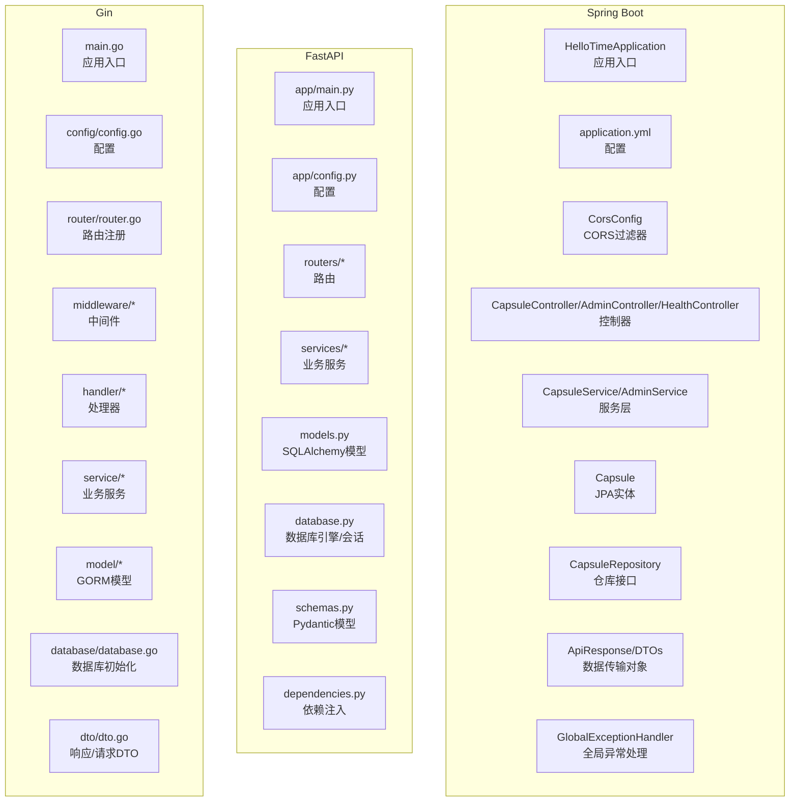
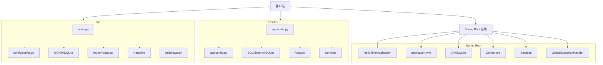
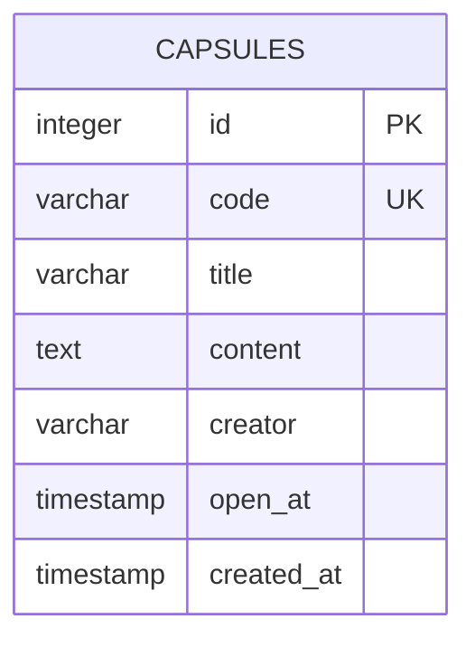
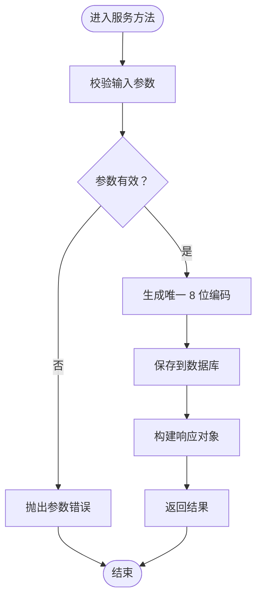
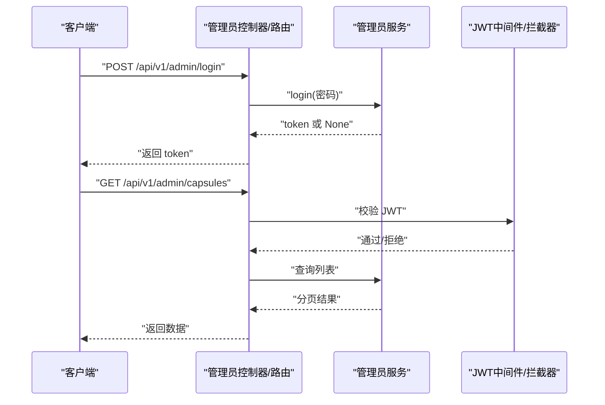
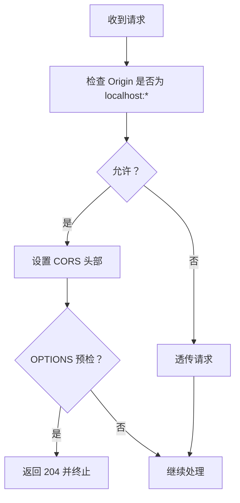
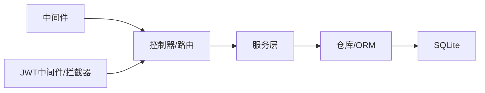

# 后端实现

<cite>
**本文引用的文件**
- [backends/spring-boot/src/main/java/com/hellotime/HelloTimeApplication.java](file://backends/spring-boot/src/main/java/com/hellotime/HelloTimeApplication.java)
- [backends/spring-boot/src/main/resources/application.yml](file://backends/spring-boot/src/main/resources/application.yml)
- [backends/spring-boot/src/main/java/com/hellotime/config/CorsConfig.java](file://backends/spring-boot/src/main/java/com/hellotime/config/CorsConfig.java)
- [backends/spring-boot/src/main/java/com/hellotime/controller/CapsuleController.java](file://backends/spring-boot/src/main/java/com/hellotime/controller/CapsuleController.java)
- [backends/spring-boot/src/main/java/com/hellotime/service/CapsuleService.java](file://backends/spring-boot/src/main/java/com/hellotime/service/CapsuleService.java)
- [backends/spring-boot/src/main/java/com/hellotime/entity/Capsule.java](file://backends/spring-boot/src/main/java/com/hellotime/entity/Capsule.java)
- [backends/spring-boot/src/main/java/com/hellotime/repository/CapsuleRepository.java](file://backends/spring-boot/src/main/java/com/hellotime/repository/CapsuleRepository.java)
- [backends/spring-boot/src/main/java/com/hellotime/dto/ApiResponse.java](file://backends/spring-boot/src/main/java/com/hellotime/dto/ApiResponse.java)
- [backends/spring-boot/src/main/java/com/hellotime/dto/CreateCapsuleRequest.java](file://backends/spring-boot/src/main/java/com/hellotime/dto/CreateCapsuleRequest.java)
- [backends/spring-boot/src/main/java/com/hellotime/dto/CapsuleResponse.java](file://backends/spring-boot/src/main/java/com/hellotime/dto/CapsuleResponse.java)
- [backends/spring-boot/src/main/java/com/hellotime/exception/GlobalExceptionHandler.java](file://backends/spring-boot/src/main/java/com/hellotime/exception/GlobalExceptionHandler.java)
- [backends/spring-boot/src/main/java/com/hellotime/exception/CapsuleNotFoundException.java](file://backends/spring-boot/src/main/java/com/hellotime/exception/CapsuleNotFoundException.java)
- [backends/spring-boot/src/main/java/com/hellotime/exception/UnauthorizedException.java](file://backends/spring-boot/src/main/java/com/hellotime/exception/UnauthorizedException.java)
- [backends/spring-boot/src/main/java/com/hellotime/config/AdminAuthInterceptor.java](file://backends/spring-boot/src/main/java/com/hellotime/config/AdminAuthInterceptor.java)
- [backends/spring-boot/src/main/java/com/hellotime/config/WebConfig.java](file://backends/spring-boot/src/main/java/com/hellotime/config/WebConfig.java)
- [backends/spring-boot/src/main/java/com/hellotime/controller/AdminController.java](file://backends/spring-boot/src/main/java/com/hellotime/controller/AdminController.java)
- [backends/spring-boot/src/main/java/com/hellotime/service/AdminService.java](file://backends/spring-boot/src/main/java/com/hellotime/service/AdminService.java)
- [backends/spring-boot/src/main/java/com/hellotime/dto/AdminLoginRequest.java](file://backends/spring-boot/src/main/java/com/hellotime/dto/AdminLoginRequest.java)
- [backends/spring-boot/src/main/java/com/hellotime/dto/AdminTokenResponse.java](file://backends/spring-boot/src/main/java/com/hellotime/dto/AdminTokenResponse.java)
- [backends/spring-boot/src/main/java/com/hellotime/controller/HealthController.java](file://backends/spring-boot/src/main/java/com/hellotime/controller/HealthController.java)
- [backends/fastapi/app/main.py](file://backends/fastapi/app/main.py)
- [backends/fastapi/app/config.py](file://backends/fastapi/app/config.py)
- [backends/fastapi/app/routers/capsule.py](file://backends/fastapi/app/routers/capsule.py)
- [backends/fastapi/app/routers/admin.py](file://backends/fastapi/app/routers/admin.py)
- [backends/fastapi/app/routers/health.py](file://backends/fastapi/app/routers/health.py)
- [backends/fastapi/app/services/capsule_service.py](file://backends/fastapi/app/services/capsule_service.py)
- [backends/fastapi/app/services/admin_service.py](file://backends/fastapi/app/services/admin_service.py)
- [backends/fastapi/app/models.py](file://backends/fastapi/app/models.py)
- [backends/fastapi/app/schemas.py](file://backends/fastapi/app/schemas.py)
- [backends/fastapi/app/database.py](file://backends/fastapi/app/database.py)
- [backends/fastapi/app/dependencies.py](file://backends/fastapi/app/dependencies.py)
- [backends/gin/main.go](file://backends/gin/main.go)
- [backends/gin/config/config.go](file://backends/gin/config/config.go)
- [backends/gin/router/router.go](file://backends/gin/router/router.go)
- [backends/gin/middleware/cors.go](file://backends/gin/middleware/cors.go)
- [backends/gin/middleware/auth.go](file://backends/gin/middleware/auth.go)
- [backends/gin/handler/capsule.go](file://backends/gin/handler/capsule.go)
- [backends/gin/handler/admin.go](file://backends/gin/handler/admin.go)
- [backends/gin/handler/health.go](file://backends/gin/handler/health.go)
- [backends/gin/service/capsule_service.go](file://backends/gin/service/capsule_service.go)
- [backends/gin/service/admin_service.go](file://backends/gin/service/admin_service.go)
- [backends/gin/model/capsule.go](file://backends/gin/model/capsule.go)
- [backends/gin/dto/dto.go](file://backends/gin/dto/dto.go)
- [backends/gin/database/database.go](file://backends/gin/database/database.go)
- [docs/backend-comparison.md](file://docs/backend-comparison.md)
- [docs/database-schema.md](file://docs/database-schema.md)
- [docs/deployment.md](file://docs/deployment.md)
</cite>

## 目录
1. [引言](#引言)
2. [项目结构](#项目结构)
3. [核心组件](#核心组件)
4. [架构总览](#架构总览)
5. [详细组件分析](#详细组件分析)
6. [依赖分析](#依赖分析)
7. [性能考虑](#性能考虑)
8. [故障排查指南](#故障排查指南)
9. [结论](#结论)
10. [附录](#附录)

## 引言
本文件为 HelloTime 项目的后端实现综合文档，覆盖三种技术栈的完整实现：Spring Boot（Java）、FastAPI（Python）、Gin（Go）。文档从系统架构、组件关系、数据流、处理逻辑、集成点、错误处理、性能特征等方面进行深入分析，并对比三者的差异与适用场景。同时，提供 JWT 认证、CORS 配置、健康检查、部署与性能优化建议，帮助开发者在不同团队背景与业务需求下做出合适的技术选型。

## 项目结构
后端代码按框架划分，每个框架独立成子项目，包含配置、数据库、模型、服务、路由/处理器、中间件、DTO/Schemas、测试等模块。整体采用“按职责分层”的组织方式：入口程序负责初始化与启动；配置模块负责环境变量与默认值；数据库模块负责连接与模型；服务层封装业务逻辑；路由/处理器负责请求映射与响应；中间件负责跨域、鉴权等横切关注点；异常处理统一返回标准响应格式。

图表来源
- [backends/spring-boot/src/main/java/com/hellotime/HelloTimeApplication.java:1-12](file://backends/spring-boot/src/main/java/com/hellotime/HelloTimeApplication.java#L1-L12)
- [backends/fastapi/app/main.py:1-89](file://backends/fastapi/app/main.py#L1-L89)
- [backends/gin/main.go:1-32](file://backends/gin/main.go#L1-L32)

章节来源
- [backends/spring-boot/src/main/java/com/hellotime/HelloTimeApplication.java:1-12](file://backends/spring-boot/src/main/java/com/hellotime/HelloTimeApplication.java#L1-L12)
- [backends/fastapi/app/main.py:1-89](file://backends/fastapi/app/main.py#L1-L89)
- [backends/gin/main.go:1-32](file://backends/gin/main.go#L1-L32)

## 核心组件
- 应用入口与启动
  - Spring Boot：通过注解扫描与启动类运行。
  - FastAPI：创建应用实例、注册中间件与路由、初始化数据库表。
  - Gin：初始化数据库、创建引擎、注册路由并启动服务。
- 配置管理
  - Spring Boot：application.yml 统一配置数据库、JPA、线程池与应用参数。
  - FastAPI：从环境变量读取数据库、管理员密码、JWT 密钥与过期时间。
  - Gin：从环境变量读取数据库路径、管理员密码、JWT 密钥、过期时间与端口。
- 数据库与模型
  - Spring Boot：JPA 实体映射 SQLite 表，自动 DDL 更新。
  - FastAPI：SQLAlchemy 模型映射 capsules 表，UTC 时间字段。
  - Gin：GORM 模型映射 capsules 表，UTC 时间字段。
- 服务层
  - 核心业务：创建胶囊（唯一码生成、时间校验）、查询详情（未到时间隐藏内容）、分页列表（管理员）、删除胶囊。
  - 管理员服务：登录生成 JWT，校验 JWT 的拦截器或中间件。
- 路由与控制器/处理器
  - 胶囊：创建、查询详情。
  - 管理员：登录、分页列表、删除。
  - 健康检查：各框架均提供健康端点。
- 中间件
  - CORS：允许本地开发域名、预检缓存、凭证。
  - JWT：Spring Boot 使用拦截器，FastAPI 使用依赖注入，Gin 使用中间件。
- 异常处理
  - Spring Boot：全局异常处理统一返回 ApiResponse。
  - FastAPI：针对业务异常与通用异常分别处理。
  - Gin：在处理器中对错误进行分类并返回统一 DTO。

章节来源
- [backends/spring-boot/src/main/resources/application.yml:1-26](file://backends/spring-boot/src/main/resources/application.yml#L1-L26)
- [backends/fastapi/app/config.py:1-18](file://backends/fastapi/app/config.py#L1-L18)
- [backends/gin/config/config.go:1-51](file://backends/gin/config/config.go#L1-L51)
- [backends/spring-boot/src/main/java/com/hellotime/service/CapsuleService.java:1-196](file://backends/spring-boot/src/main/java/com/hellotime/service/CapsuleService.java#L1-L196)
- [backends/fastapi/app/services/capsule_service.py:1-144](file://backends/fastapi/app/services/capsule_service.py#L1-L144)
- [backends/gin/service/capsule_service.go:1-177](file://backends/gin/service/capsule_service.go#L1-L177)
- [backends/spring-boot/src/main/java/com/hellotime/controller/CapsuleController.java:1-57](file://backends/spring-boot/src/main/java/com/hellotime/controller/CapsuleController.java#L1-L57)
- [backends/fastapi/app/routers/capsule.py:1-31](file://backends/fastapi/app/routers/capsule.py#L1-L31)
- [backends/gin/handler/capsule.go:1-56](file://backends/gin/handler/capsule.go#L1-L56)
- [backends/spring-boot/src/main/java/com/hellotime/config/CorsConfig.java:1-28](file://backends/spring-boot/src/main/java/com/hellotime/config/CorsConfig.java#L1-L28)
- [backends/fastapi/app/main.py:21-29](file://backends/fastapi/app/main.py#L21-L29)
- [backends/gin/middleware/cors.go:1-36](file://backends/gin/middleware/cors.go#L1-L36)
- [backends/spring-boot/src/main/java/com/hellotime/exception/GlobalExceptionHandler.java](file://backends/spring-boot/src/main/java/com/hellotime/exception/GlobalExceptionHandler.java)
- [backends/fastapi/app/main.py:37-89](file://backends/fastapi/app/main.py#L37-L89)
- [backends/gin/handler/capsule.go:20-38](file://backends/gin/handler/capsule.go#L20-L38)

## 架构总览
三种实现均遵循“入口程序 → 配置 → 数据库 → 路由/处理器 → 服务 → 模型”的分层架构，差异主要体现在框架特性与生态工具上：

图表来源
- [backends/spring-boot/src/main/java/com/hellotime/HelloTimeApplication.java:1-12](file://backends/spring-boot/src/main/java/com/hellotime/HelloTimeApplication.java#L1-L12)
- [backends/fastapi/app/main.py:1-89](file://backends/fastapi/app/main.py#L1-L89)
- [backends/gin/main.go:1-32](file://backends/gin/main.go#L1-L32)

## 详细组件分析

### 数据库设计与模型
- 设计要点
  - 单表 capsules：唯一 8 位胶囊码（62 进制），标题、内容、创建者、开启时间、创建时间。
  - 开启时间字段：UTC 时间戳，用于控制内容可见性。
  - 唯一键：code 唯一，便于安全检索。
- Spring Boot（JPA）
  - 实体类映射表结构，持久化前自动填充创建时间。
- FastAPI（SQLAlchemy）
  - 模型定义字段类型与索引，使用带时区的 DateTime 存储 UTC。
- Gin（GORM）
  - 结构体映射表，指定列类型与索引，含表名声明。

图表来源
- [backends/spring-boot/src/main/java/com/hellotime/entity/Capsule.java:10-58](file://backends/spring-boot/src/main/java/com/hellotime/entity/Capsule.java#L10-L58)
- [backends/fastapi/app/models.py:14-26](file://backends/fastapi/app/models.py#L14-L26)
- [backends/gin/model/capsule.go:6-21](file://backends/gin/model/capsule.go#L6-L21)

章节来源
- [backends/spring-boot/src/main/java/com/hellotime/entity/Capsule.java:1-90](file://backends/spring-boot/src/main/java/com/hellotime/entity/Capsule.java#L1-L90)
- [backends/fastapi/app/models.py:1-26](file://backends/fastapi/app/models.py#L1-L26)
- [backends/gin/model/capsule.go:1-21](file://backends/gin/model/capsule.go#L1-L21)

### 服务层实现（核心业务）
- 创建胶囊
  - 参数校验：开启时间必须在未来。
  - 唯一码生成：循环尝试生成唯一 8 位编码，超限抛错。
  - 保存入库：返回不含内容的创建响应。
- 查询详情
  - 未到开启时间：content 为空；已到时间：返回内容。
  - 不存在：抛出“胶囊不存在”异常。
- 分页列表（管理员）
  - 按创建时间倒序，管理员可查看全部内容。
- 删除胶囊（管理员）
  - 不存在：抛出“胶囊不存在”异常。

图表来源
- [backends/spring-boot/src/main/java/com/hellotime/service/CapsuleService.java:52-73](file://backends/spring-boot/src/main/java/com/hellotime/service/CapsuleService.java#L52-L73)
- [backends/fastapi/app/services/capsule_service.py:79-103](file://backends/fastapi/app/services/capsule_service.py#L79-L103)
- [backends/gin/service/capsule_service.go:94-129](file://backends/gin/service/capsule_service.go#L94-L129)

章节来源
- [backends/spring-boot/src/main/java/com/hellotime/service/CapsuleService.java:1-196](file://backends/spring-boot/src/main/java/com/hellotime/service/CapsuleService.java#L1-L196)
- [backends/fastapi/app/services/capsule_service.py:1-144](file://backends/fastapi/app/services/capsule_service.py#L1-L144)
- [backends/gin/service/capsule_service.go:1-177](file://backends/gin/service/capsule_service.go#L1-L177)

### JWT 认证与管理员权限
- Spring Boot
  - 登录：校验管理员密码，生成 JWT 并设置过期时间。
  - 校验：拦截器拦截 /api/v1/admin/*，验证 JWT 有效性。
- FastAPI
  - 登录：校验管理员密码，生成 JWT。
  - 校验：依赖 verify_admin_token 在路由层校验。
- Gin
  - 登录：校验管理员密码，生成 JWT。
  - 校验：中间件解析 Authorization 头，校验签名与过期时间。

图表来源
- [backends/spring-boot/src/main/java/com/hellotime/controller/AdminController.java](file://backends/spring-boot/src/main/java/com/hellotime/controller/AdminController.java)
- [backends/spring-boot/src/main/java/com/hellotime/service/AdminService.java](file://backends/spring-boot/src/main/java/com/hellotime/service/AdminService.java)
- [backends/spring-boot/src/main/java/com/hellotime/config/AdminAuthInterceptor.java](file://backends/spring-boot/src/main/java/com/hellotime/config/AdminAuthInterceptor.java)
- [backends/fastapi/app/routers/admin.py:25-31](file://backends/fastapi/app/routers/admin.py#L25-L31)
- [backends/fastapi/app/dependencies.py](file://backends/fastapi/app/dependencies.py)
- [backends/gin/handler/admin.go](file://backends/gin/handler/admin.go)
- [backends/gin/middleware/auth.go](file://backends/gin/middleware/auth.go)

章节来源
- [backends/spring-boot/src/main/java/com/hellotime/controller/AdminController.java](file://backends/spring-boot/src/main/java/com/hellotime/controller/AdminController.java)
- [backends/spring-boot/src/main/java/com/hellotime/service/AdminService.java](file://backends/spring-boot/src/main/java/com/hellotime/service/AdminService.java)
- [backends/spring-boot/src/main/java/com/hellotime/config/AdminAuthInterceptor.java](file://backends/spring-boot/src/main/java/com/hellotime/config/AdminAuthInterceptor.java)
- [backends/fastapi/app/routers/admin.py:1-55](file://backends/fastapi/app/routers/admin.py#L1-L55)
- [backends/fastapi/app/dependencies.py](file://backends/fastapi/app/dependencies.py)
- [backends/gin/handler/admin.go](file://backends/gin/handler/admin.go)
- [backends/gin/middleware/auth.go](file://backends/gin/middleware/auth.go)

### CORS 配置
- Spring Boot：基于 CorsFilter，允许 http://localhost:*，支持凭证与预检缓存。
- FastAPI：基于 CORSMiddleware，正则匹配本地开发域名。
- Gin：自定义中间件，按 Origin 动态设置允许源与头部。

图表来源
- [backends/spring-boot/src/main/java/com/hellotime/config/CorsConfig.java:14-26](file://backends/spring-boot/src/main/java/com/hellotime/config/CorsConfig.java#L14-L26)
- [backends/fastapi/app/main.py:21-29](file://backends/fastapi/app/main.py#L21-L29)
- [backends/gin/middleware/cors.go:14-35](file://backends/gin/middleware/cors.go#L14-L35)

章节来源
- [backends/spring-boot/src/main/java/com/hellotime/config/CorsConfig.java:1-28](file://backends/spring-boot/src/main/java/com/hellotime/config/CorsConfig.java#L1-L28)
- [backends/fastapi/app/main.py:21-29](file://backends/fastapi/app/main.py#L21-L29)
- [backends/gin/middleware/cors.go:1-36](file://backends/gin/middleware/cors.go#L1-L36)

### 健康检查服务
- Spring Boot：提供健康端点，返回应用状态。
- FastAPI：提供健康端点，返回应用状态。
- Gin：提供健康端点，返回应用状态。

章节来源
- [backends/spring-boot/src/main/java/com/hellotime/controller/HealthController.java](file://backends/spring-boot/src/main/java/com/hellotime/controller/HealthController.java)
- [backends/fastapi/app/routers/health.py](file://backends/fastapi/app/routers/health.py)
- [backends/gin/handler/health.go](file://backends/gin/handler/health.go)

### 错误处理机制
- Spring Boot：全局异常处理，将业务异常与通用异常统一包装为 ApiResponse。
- FastAPI：针对业务异常与通用异常分别处理，返回标准化响应。
- Gin：在处理器中对错误进行分类并返回统一 DTO。

章节来源
- [backends/spring-boot/src/main/java/com/hellotime/exception/GlobalExceptionHandler.java](file://backends/spring-boot/src/main/java/com/hellotime/exception/GlobalExceptionHandler.java)
- [backends/fastapi/app/main.py:37-89](file://backends/fastapi/app/main.py#L37-L89)
- [backends/gin/handler/capsule.go:20-38](file://backends/gin/handler/capsule.go#L20-L38)

### 控制器/处理器与路由
- Spring Boot：REST 控制器，使用 ResponseEntity/ApiResponse 返回。
- FastAPI：APIRouter，依赖注入数据库会话与校验中间件。
- Gin：处理器结构体，绑定 JSON 请求并返回统一 DTO。

章节来源
- [backends/spring-boot/src/main/java/com/hellotime/controller/CapsuleController.java:1-57](file://backends/spring-boot/src/main/java/com/hellotime/controller/CapsuleController.java#L1-L57)
- [backends/fastapi/app/routers/capsule.py:1-31](file://backends/fastapi/app/routers/capsule.py#L1-L31)
- [backends/gin/handler/capsule.go:1-56](file://backends/gin/handler/capsule.go#L1-L56)

## 依赖分析
- 框架特性与耦合
  - Spring Boot：高度约定优于配置，依赖注入、AOP、全局异常处理完善，与 JPA/SQLite 集成紧密。
  - FastAPI：基于 Pydantic 的类型校验与自动 OpenAPI 文档，依赖注入与中间件生态成熟。
  - Gin：轻量级路由与中间件，手动依赖注入，性能与灵活性兼顾。
- 外部依赖
  - 数据库：SQLite（内存/文件），ORM 工具有 JPA、SQLAlchemy、GORM。
  - JWT：三方库负责签名与校验。
  - CORS：框架内置或自定义中间件。
- 循环依赖与风险
  - 三层结构清晰，控制器依赖服务，服务依赖仓库/ORM，避免循环依赖。
  - JWT 校验在路由层或中间件层，避免在服务层重复校验。

图表来源
- [backends/spring-boot/src/main/java/com/hellotime/controller/CapsuleController.java:26-28](file://backends/spring-boot/src/main/java/com/hellotime/controller/CapsuleController.java#L26-L28)
- [backends/fastapi/app/routers/capsule.py:10-12](file://backends/fastapi/app/routers/capsule.py#L10-L12)
- [backends/gin/handler/capsule.go:14-17](file://backends/gin/handler/capsule.go#L14-L17)

章节来源
- [backends/spring-boot/src/main/java/com/hellotime/controller/CapsuleController.java:1-57](file://backends/spring-boot/src/main/java/com/hellotime/controller/CapsuleController.java#L1-L57)
- [backends/fastapi/app/routers/capsule.py:1-31](file://backends/fastapi/app/routers/capsule.py#L1-L31)
- [backends/gin/handler/capsule.go:1-56](file://backends/gin/handler/capsule.go#L1-L56)

## 性能考虑
- 数据库与索引
  - code 唯一索引，提升查询与去重效率。
  - open_at 与 created_at 建议添加索引以优化排序与筛选。
- 事务与锁
  - 创建与删除使用事务，保证一致性；高并发下注意唯一码冲突重试次数上限。
- 虚拟线程（Spring Boot）
  - 配置启用虚拟线程，适合 I/O 密集型场景，降低线程切换开销。
- 缓存与预热
  - 未到开启时间的内容不缓存，开启后可考虑短期缓存热点胶囊。
- 日志与监控
  - 生产环境开启访问日志与错误日志，结合指标监控关键端点延迟与错误率。
- 部署优化
  - 使用进程池与连接池，限制并发与连接数，避免资源耗尽。

## 故障排查指南
- 常见问题
  - 开启时间早于当前时间：创建失败，提示时间无效。
  - 胶囊不存在：查询返回 404，消息包含具体编号。
  - JWT 校验失败：管理员端访问被拒绝。
  - CORS 跨域失败：确认本地 Origin 是否匹配。
- 排查步骤
  - 查看全局异常处理输出与日志级别。
  - 核对环境变量与配置文件，确认数据库路径与 JWT 密钥。
  - 使用健康检查端点确认服务可用性。
  - 在路由层打印请求参数与响应状态，定位参数绑定与序列化问题。

章节来源
- [backends/spring-boot/src/main/java/com/hellotime/exception/GlobalExceptionHandler.java](file://backends/spring-boot/src/main/java/com/hellotime/exception/GlobalExceptionHandler.java)
- [backends/fastapi/app/main.py:37-89](file://backends/fastapi/app/main.py#L37-L89)
- [backends/gin/handler/capsule.go:20-38](file://backends/gin/handler/capsule.go#L20-L38)

## 结论
三种后端实现均满足 HelloTime 的核心需求：胶囊创建与查询、管理员权限控制、健康检查与跨域支持。选型建议：
- Spring Boot：适合需要快速迭代、类型安全与企业级生态的团队，虚拟线程与 JPA 提升开发效率。
- FastAPI：适合 Python 团队与需要自动生成 API 文档的场景，类型校验与依赖注入体验优秀。
- Gin：适合追求性能与轻量的 Go 团队，中间件与路由灵活，适合微服务与高并发场景。

## 附录
- 部署与运行
  - Spring Boot：打包为可执行 JAR，设置环境变量后运行。
  - FastAPI：安装依赖后运行主程序，或使用 ASGI 服务器部署。
  - Gin：编译后运行，设置环境变量后启动。
- 性能优化
  - 合理设置数据库连接池与线程池大小。
  - 对高频端点增加缓存与限流策略。
  - 使用容器化与水平扩展提升吞吐能力。

章节来源
- [docs/deployment.md](file://docs/deployment.md)
- [backends/spring-boot/src/main/resources/application.yml:1-26](file://backends/spring-boot/src/main/resources/application.yml#L1-L26)
- [backends/fastapi/app/config.py:1-18](file://backends/fastapi/app/config.py#L1-L18)
- [backends/gin/config/config.go:1-51](file://backends/gin/config/config.go#L1-L51)