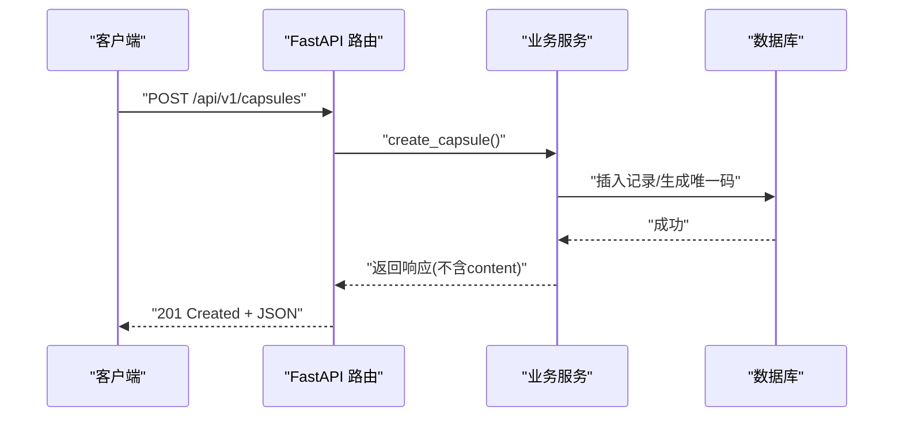
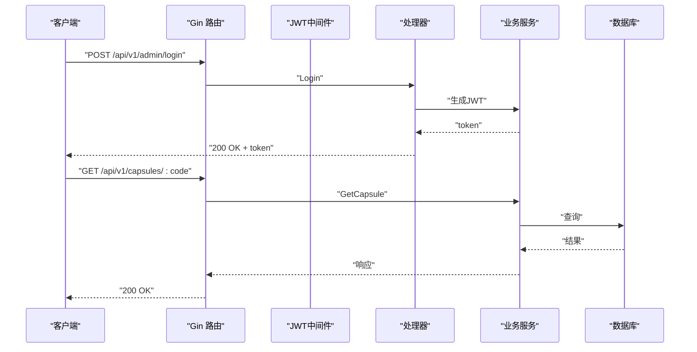
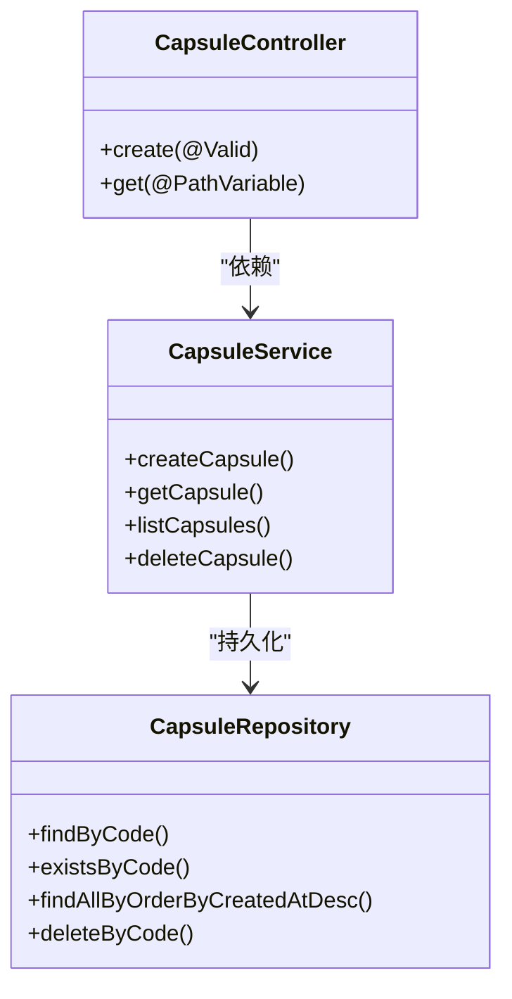
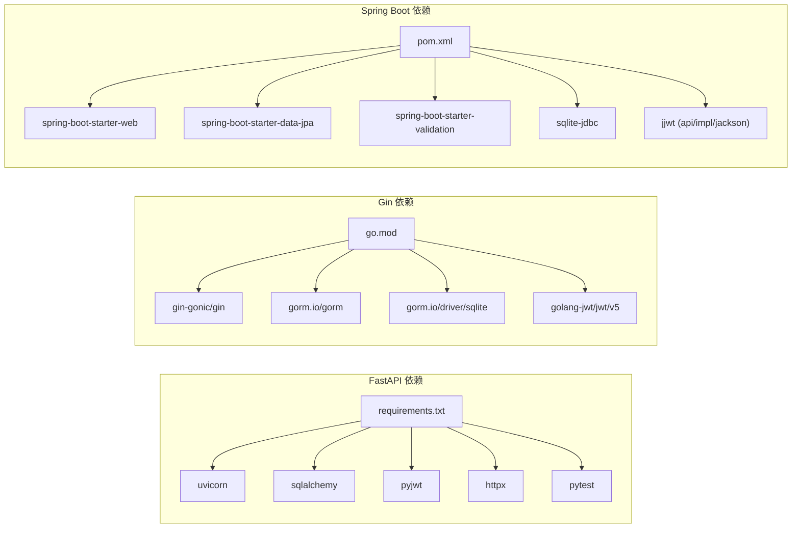
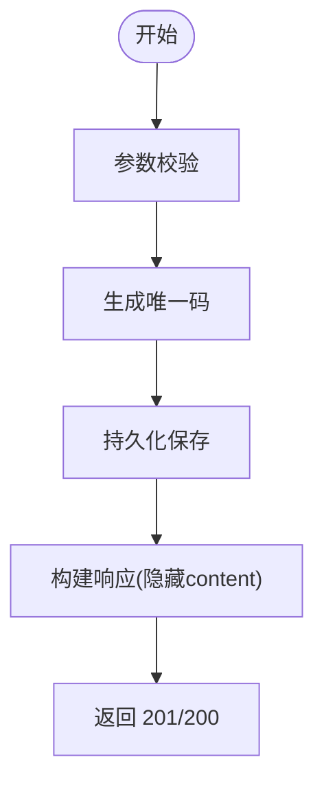

# 后端技术栈对比

<cite>
**本文引用的文件**
- [backends/fastapi/app/main.py](file://backends/fastapi/app/main.py)
- [backends/fastapi/app/routers/capsule.py](file://backends/fastapi/app/routers/capsule.py)
- [backends/fastapi/app/services/capsule_service.py](file://backends/fastapi/app/services/capsule_service.py)
- [backends/fastapi/app/database.py](file://backends/fastapi/app/database.py)
- [backends/fastapi/app/config.py](file://backends/fastapi/app/config.py)
- [backends/fastapi/requirements.txt](file://backends/fastapi/requirements.txt)
- [backends/gin/main.go](file://backends/gin/main.go)
- [backends/gin/router/router.go](file://backends/gin/router/router.go)
- [backends/gin/service/capsule_service.go](file://backends/gin/service/capsule_service.go)
- [backends/gin/database/database.go](file://backends/gin/database/database.go)
- [backends/gin/middleware/auth.go](file://backends/gin/middleware/auth.go)
- [backends/gin/go.mod](file://backends/gin/go.mod)
- [backends/spring-boot/src/main/java/com/hellotime/HelloTimeApplication.java](file://backends/spring-boot/src/main/java/com/hellotime/HelloTimeApplication.java)
- [backends/spring-boot/src/main/java/com/hellotime/controller/CapsuleController.java](file://backends/spring-boot/src/main/java/com/hellotime/controller/CapsuleController.java)
- [backends/spring-boot/src/main/java/com/hellotime/service/CapsuleService.java](file://backends/spring-boot/src/main/java/com/hellotime/service/CapsuleService.java)
- [backends/spring-boot/src/main/java/com/hellotime/repository/CapsuleRepository.java](file://backends/spring-boot/src/main/java/com/hellotime/repository/CapsuleRepository.java)
- [backends/spring-boot/src/main/resources/application.yml](file://backends/spring-boot/src/main/resources/application.yml)
- [backends/spring-boot/pom.xml](file://backends/spring-boot/pom.xml)
</cite>

## 目录
1. [引言](#引言)
2. [项目结构](#项目结构)
3. [核心组件](#核心组件)
4. [架构总览](#架构总览)
5. [详细组件分析](#详细组件分析)
6. [依赖分析](#依赖分析)
7. [性能考量](#性能考量)
8. [故障排查指南](#故障排查指南)
9. [结论](#结论)
10. [附录](#附录)

## 引言
本文件对 HelloTime 项目的三套后端实现进行系统性对比分析：Spring Boot（Java）、FastAPI（Python）、Gin（Go）。我们将从架构设计、性能表现、开发效率、部署复杂度、异步处理能力、内存占用、启动速度、并发性能、生态系统支持等方面进行横向比较，并给出技术选型建议与实践参考。

## 项目结构
三套后端均采用清晰的分层结构：
- 入口程序负责初始化与启动
- 路由/控制器层定义 API 接口
- 服务层封装业务逻辑
- 数据访问层对接数据库
- 配置与中间件分别处理运行时参数与横切关注点

```mermaid
graph TB
subgraph "FastAPI"
FMain["app/main.py<br/>应用入口/异常处理/路由注册"]
FRt["routers/capsule.py<br/>路由定义"]
FSvc["services/capsule_service.py<br/>业务逻辑"]
FDb["database.py<br/>SQLAlchemy 引擎/会话"]
FCfg["config.py<br/>环境变量配置"]
end
subgraph "Gin"
GMain["main.go<br/>应用入口/启动"]
GRt["router/router.go<br/>路由注册/中间件"]
GSvc["service/capsule_service.go<br/>业务逻辑"]
GDb["database/database.go<br/>GORM/SQLite"]
GMid["middleware/auth.go<br/>JWT 中间件"]
end
subgraph "Spring Boot"
SApp["HelloTimeApplication.java<br/>Spring Boot 启动"]
SCtrl["controller/CapsuleController.java<br/>REST 控制器"]
SSvc["service/CapsuleService.java<br/>业务逻辑"]
SRepo["repository/CapsuleRepository.java<br/>JPA 数据访问"]
SYml["application.yml<br/>配置/线程/数据源"]
end
FMain --> FRt --> FSvc --> FDb
GMain --> GRt --> GSvc --> GDb
SApp --> SCtrl --> SSvc --> SRepo
FMain -.-> FCfg
GRt -.-> GMid
SApp -.-> SYml
```



图表来源
- [backends/fastapi/app/main.py:1-89](file://backends/fastapi/app/main.py#L1-L89)
- [backends/fastapi/app/routers/capsule.py:1-31](file://backends/fastapi/app/routers/capsule.py#L1-L31)
- [backends/fastapi/app/services/capsule_service.py:1-144](file://backends/fastapi/app/services/capsule_service.py#L1-L144)
- [backends/fastapi/app/database.py:1-30](file://backends/fastapi/app/database.py#L1-L30)
- [backends/fastapi/app/config.py:1-18](file://backends/fastapi/app/config.py#L1-L18)
- [backends/gin/main.go:1-32](file://backends/gin/main.go#L1-L32)
- [backends/gin/router/router.go:1-46](file://backends/gin/router/router.go#L1-L46)
- [backends/gin/service/capsule_service.go:1-177](file://backends/gin/service/capsule_service.go#L1-L177)
- [backends/gin/database/database.go:1-38](file://backends/gin/database/database.go#L1-L38)
- [backends/gin/middleware/auth.go:1-37](file://backends/gin/middleware/auth.go#L1-L37)
- [backends/spring-boot/src/main/java/com/hellotime/HelloTimeApplication.java:1-12](file://backends/spring-boot/src/main/java/com/hellotime/HelloTimeApplication.java#L1-L12)
- [backends/spring-boot/src/main/java/com/hellotime/controller/CapsuleController.java:1-57](file://backends/spring-boot/src/main/java/com/hellotime/controller/CapsuleController.java#L1-L57)
- [backends/spring-boot/src/main/java/com/hellotime/service/CapsuleService.java:1-196](file://backends/spring-boot/src/main/java/com/hellotime/service/CapsuleService.java#L1-L196)
- [backends/spring-boot/src/main/java/com/hellotime/repository/CapsuleRepository.java:1-48](file://backends/spring-boot/src/main/java/com/hellotime/repository/CapsuleRepository.java#L1-L48)
- [backends/spring-boot/src/main/resources/application.yml:1-26](file://backends/spring-boot/src/main/resources/application.yml#L1-L26)

章节来源
- [backends/fastapi/app/main.py:1-89](file://backends/fastapi/app/main.py#L1-L89)
- [backends/gin/main.go:1-32](file://backends/gin/main.go#L1-L32)
- [backends/spring-boot/src/main/java/com/hellotime/HelloTimeApplication.java:1-12](file://backends/spring-boot/src/main/java/com/hellotime/HelloTimeApplication.java#L1-L12)

## 核心组件
- FastAPI：基于装饰器的路由定义、Pydantic 模型驱动的序列化、SQLAlchemy ORM、全局异常处理器。
- Gin：基于路由组的版本化路由、GORM + SQLite、JWT 中间件、统一响应模型。
- Spring Boot：基于注解的 REST 控制器、Spring Data JPA、事务管理、虚拟线程支持。

章节来源
- [backends/fastapi/app/routers/capsule.py:1-31](file://backends/fastapi/app/routers/capsule.py#L1-L31)
- [backends/gin/router/router.go:1-46](file://backends/gin/router/router.go#L1-L46)
- [backends/spring-boot/src/main/java/com/hellotime/controller/CapsuleController.java:1-57](file://backends/spring-boot/src/main/java/com/hellotime/controller/CapsuleController.java#L1-L57)

## 架构总览
三套实现均遵循“控制器-服务-数据访问-存储”的分层，但具体框架与工具链不同：
- FastAPI：ASGI 服务器 + SQLAlchemy，强调类型安全与自动生成 OpenAPI 文档。
- Gin：HTTP 路由 + GORM，强调简洁与高性能。
- Spring Boot：Web MVC + JPA，强调声明式与约定优于配置。



图表来源
- [backends/fastapi/app/routers/capsule.py:17-24](file://backends/fastapi/app/routers/capsule.py#L17-L24)
- [backends/fastapi/app/services/capsule_service.py:79-102](file://backends/fastapi/app/services/capsule_service.py#L79-L102)

章节来源
- [backends/fastapi/app/routers/capsule.py:1-31](file://backends/fastapi/app/routers/capsule.py#L1-L31)
- [backends/fastapi/app/services/capsule_service.py:1-144](file://backends/fastapi/app/services/capsule_service.py#L1-L144)

## 详细组件分析

### FastAPI 组件分析
- 应用入口与异常处理：集中注册路由与全局异常处理器，返回统一 ApiResponse 结构。
- 路由层：使用 APIRouter 定义版本前缀与标签，依赖注入数据库会话。
- 服务层：封装创建、查询、分页、删除等核心逻辑；生成唯一码、时间格式化、内容可见性控制。
- 数据层：SQLAlchemy 引擎与会话工厂，依赖注入 get_db。
- 配置层：从环境变量读取数据库、管理员密码、JWT 密钥与过期时间。

```mermaid
classDiagram
class FastAPIApp {
+异常处理
+CORS配置
+路由注册
}
class CapsuleRouter {
+POST /api/v1/capsules
+GET /api/v1/capsules/{code}
}
class CapsuleService {
+create_capsule()
+get_capsule()
+list_capsules()
+delete_capsule()
}
class DatabaseLayer {
+engine
+SessionLocal
+get_db()
}
FastAPIApp --> CapsuleRouter : "include_router"
CapsuleRouter --> CapsuleService : "调用"
CapsuleService --> DatabaseLayer : "使用 Session"
```

图表来源
- [backends/fastapi/app/main.py:19-34](file://backends/fastapi/app/main.py#L19-L34)
- [backends/fastapi/app/routers/capsule.py:14-30](file://backends/fastapi/app/routers/capsule.py#L14-L30)
- [backends/fastapi/app/services/capsule_service.py:79-143](file://backends/fastapi/app/services/capsule_service.py#L79-L143)
- [backends/fastapi/app/database.py:11-29](file://backends/fastapi/app/database.py#L11-L29)

章节来源
- [backends/fastapi/app/main.py:1-89](file://backends/fastapi/app/main.py#L1-L89)
- [backends/fastapi/app/routers/capsule.py:1-31](file://backends/fastapi/app/routers/capsule.py#L1-L31)
- [backends/fastapi/app/services/capsule_service.py:1-144](file://backends/fastapi/app/services/capsule_service.py#L1-L144)
- [backends/fastapi/app/database.py:1-30](file://backends/fastapi/app/database.py#L1-L30)
- [backends/fastapi/app/config.py:1-18](file://backends/fastapi/app/config.py#L1-L18)

### Gin 组件分析
- 应用入口：初始化数据库、创建引擎、注册路由、启动服务。
- 路由层：版本化路由组，暴露健康检查、胶囊 CRUD、管理员登录与受保护接口。
- 服务层：与 FastAPI 类似的核心逻辑，含唯一码生成、时间格式化、内容可见性。
- 数据层：GORM + SQLite，自动迁移。
- 中间件：CORS 与 JWT 认证中间件，统一鉴权流程。



图表来源
- [backends/gin/router/router.go:11-44](file://backends/gin/router/router.go#L11-L44)
- [backends/gin/middleware/auth.go:13-36](file://backends/gin/middleware/auth.go#L13-L36)
- [backends/gin/service/capsule_service.go:131-143](file://backends/gin/service/capsule_service.go#L131-L143)

章节来源
- [backends/gin/main.go:1-32](file://backends/gin/main.go#L1-L32)
- [backends/gin/router/router.go:1-46](file://backends/gin/router/router.go#L1-L46)
- [backends/gin/middleware/auth.go:1-37](file://backends/gin/middleware/auth.go#L1-L37)
- [backends/gin/service/capsule_service.go:1-177](file://backends/gin/service/capsule_service.go#L1-L177)
- [backends/gin/database/database.go:1-38](file://backends/gin/database/database.go#L1-L38)

### Spring Boot 组件分析
- 应用入口：Spring Boot 启动类。
- 控制器层：REST 控制器，使用 @Valid 参数校验，返回统一封装的 ApiResponse。
- 服务层：事务方法保证原子性；使用 SecureRandom 生成唯一码；根据开启时间决定内容可见性。
- 数据访问层：JPA Repository，自动生成查询 SQL；分页查询按创建时间倒序。
- 配置层：application.yml 设置数据源、JPA 方言、DDL 自动更新、虚拟线程开关。



图表来源
- [backends/spring-boot/src/main/java/com/hellotime/controller/CapsuleController.java:17-56](file://backends/spring-boot/src/main/java/com/hellotime/controller/CapsuleController.java#L17-L56)
- [backends/spring-boot/src/main/java/com/hellotime/service/CapsuleService.java:26-196](file://backends/spring-boot/src/main/java/com/hellotime/service/CapsuleService.java#L26-L196)
- [backends/spring-boot/src/main/java/com/hellotime/repository/CapsuleRepository.java:15-47](file://backends/spring-boot/src/main/java/com/hellotime/repository/CapsuleRepository.java#L15-L47)

章节来源
- [backends/spring-boot/src/main/java/com/hellotime/HelloTimeApplication.java:1-12](file://backends/spring-boot/src/main/java/com/hellotime/HelloTimeApplication.java#L1-L12)
- [backends/spring-boot/src/main/java/com/hellotime/controller/CapsuleController.java:1-57](file://backends/spring-boot/src/main/java/com/hellotime/controller/CapsuleController.java#L1-L57)
- [backends/spring-boot/src/main/java/com/hellotime/service/CapsuleService.java:1-196](file://backends/spring-boot/src/main/java/com/hellotime/service/CapsuleService.java#L1-L196)
- [backends/spring-boot/src/main/java/com/hellotime/repository/CapsuleRepository.java:1-48](file://backends/spring-boot/src/main/java/com/hellotime/repository/CapsuleRepository.java#L1-L48)
- [backends/spring-boot/src/main/resources/application.yml:1-26](file://backends/spring-boot/src/main/resources/application.yml#L1-L26)

## 依赖分析
- FastAPI：依赖 uvicorn（ASGI 服务器）、SQLAlchemy、PyJWT、httpx、pytest。
- Gin：依赖 Gin Web 框架、GORM、SQLite 驱动、JWT 工具库。
- Spring Boot：依赖 Spring Web、Spring Data JPA、Hibernate SQLite 方言、jjwt、SQLite JDBC。



图表来源
- [backends/fastapi/requirements.txt:1-7](file://backends/fastapi/requirements.txt#L1-L7)
- [backends/gin/go.mod:5-10](file://backends/gin/go.mod#L5-L10)
- [backends/spring-boot/pom.xml:25-79](file://backends/spring-boot/pom.xml#L25-L79)

章节来源
- [backends/fastapi/requirements.txt:1-7](file://backends/fastapi/requirements.txt#L1-L7)
- [backends/gin/go.mod:1-46](file://backends/gin/go.mod#L1-L46)
- [backends/spring-boot/pom.xml:1-91](file://backends/spring-boot/pom.xml#L1-L91)

## 性能考量
- 启动速度
  - Gin：以 Go 的编译型特性与轻量级框架著称，通常具备更快的冷启动与热启动表现。
  - FastAPI：基于 ASGI 的 uvicorn，启动较快，但 Python 解释执行仍慢于 Go。
  - Spring Boot：Java 应用启动时间较长，但可通过优化 JVM 与镜像策略改善。
- 并发性能
  - Gin：原生 goroutine 并发模型，适合高并发短请求场景。
  - FastAPI：事件循环 + 异步 I/O，适合 I/O 密集型任务；可结合异步视图进一步提升吞吐。
  - Spring Boot：虚拟线程（Java 21+）显著降低上下文切换开销，适合 CPU 与 I/O 并重型负载。
- 内存占用
  - Gin：常驻内存小，适合容器化与边缘部署。
  - FastAPI：Python 进程内存占用中等，依赖第三方库体积可控。
  - Spring Boot：JVM 默认内存占用较高，可通过参数与 GC 调优降低。
- 异步处理能力
  - Gin：天然并发，异步处理需自行组织 goroutine 或使用通道。
  - FastAPI：内置 async/await 支持，易于扩展异步任务队列。
  - Spring Boot：虚拟线程与 Reactor 生态可实现高效异步。
- 资源消耗与基准测试
  - 仓库未提供基准测试数据。建议在目标硬件上使用 wrk/ab/JMeter 等工具进行压测，对比 QPS、P95 延迟、CPU/内存占用。
- 部署复杂度
  - Gin：二进制可直接部署，依赖少，容器镜像最小。
  - FastAPI：需要 Python 运行时与依赖安装，uvicorn 运行，容器镜像稍大。
  - Spring Boot：JAR/WAR 部署，JVM 启动参数与 GC 需要调优。

章节来源
- [backends/spring-boot/src/main/resources/application.yml:12-15](file://backends/spring-boot/src/main/resources/application.yml#L12-L15)
- [backends/gin/go.mod:5-10](file://backends/gin/go.mod#L5-L10)
- [backends/fastapi/requirements.txt:1-7](file://backends/fastapi/requirements.txt#L1-L7)
- [backends/spring-boot/pom.xml:25-79](file://backends/spring-boot/pom.xml#L25-L79)

## 故障排查指南
- FastAPI
  - 全局异常处理：针对业务异常（如胶囊不存在、未授权）、参数校验错误、通用异常进行统一响应。
  - 数据库连接：确认 DATABASE_URL 与 SQLite 文件权限。
  - CORS：确保前端地址匹配 allow_origin_regex。
- Gin
  - JWT 中间件：检查 Authorization 头格式与签名有效性。
  - 数据库迁移：确认 AutoMigrate 成功执行。
- Spring Boot
  - 数据源与方言：确认 SQLite JDBC 与方言配置正确。
  - 虚拟线程：确保运行环境为 Java 21+，并启用虚拟线程。

章节来源
- [backends/fastapi/app/main.py:37-89](file://backends/fastapi/app/main.py#L37-L89)
- [backends/gin/middleware/auth.go:13-36](file://backends/gin/middleware/auth.go#L13-L36)
- [backends/gin/database/database.go:18-37](file://backends/gin/database/database.go#L18-L37)
- [backends/spring-boot/src/main/resources/application.yml:4-11](file://backends/spring-boot/src/main/resources/application.yml#L4-L11)

## 结论
- 技术选型建议
  - 优先选择 Gin：当追求极致启动速度、低内存占用与高并发短请求场景。
  - 优先选择 FastAPI：当需要快速迭代、强类型与自动生成 API 文档、I/O 密集型任务。
  - 优先选择 Spring Boot：当团队熟悉 Java/Spring、需要声明式配置、事务与分页生态完善、计划使用虚拟线程。
- 维护成本
  - Gin：学习曲线平缓，依赖少，维护成本低。
  - FastAPI：类型与模型驱动，减少运行时错误，文档即测试。
  - Spring Boot：生态成熟，但依赖较多，升级需谨慎。
- 团队技能匹配度
  - Java 团队优先 Spring Boot；Python 团队优先 FastAPI；追求极致性能与并发的团队优先 Gin。

## 附录
- 关键流程：创建胶囊
  - FastAPI：路由 -> 服务 -> ORM -> 响应
  - Gin：路由 -> 中间件 -> 服务 -> GORM -> 响应
  - Spring Boot：控制器 -> 服务（事务）-> JPA -> 响应



图表来源
- [backends/fastapi/app/services/capsule_service.py:79-102](file://backends/fastapi/app/services/capsule_service.py#L79-L102)
- [backends/gin/service/capsule_service.go:94-129](file://backends/gin/service/capsule_service.go#L94-L129)
- [backends/spring-boot/src/main/java/com/hellotime/service/CapsuleService.java:52-73](file://backends/spring-boot/src/main/java/com/hellotime/service/CapsuleService.java#L52-L73)