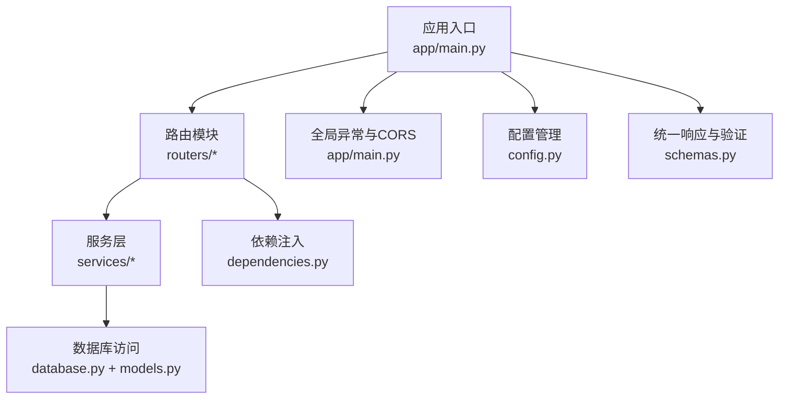
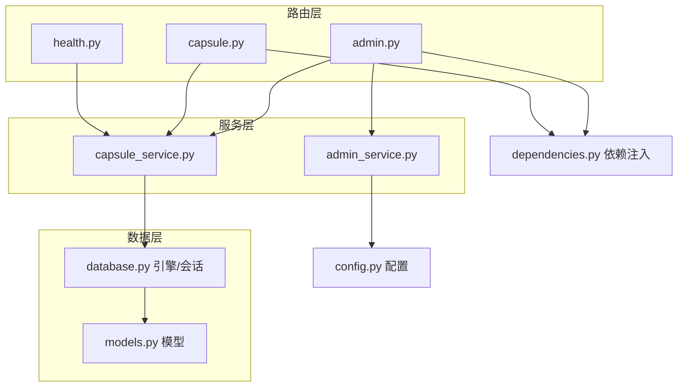
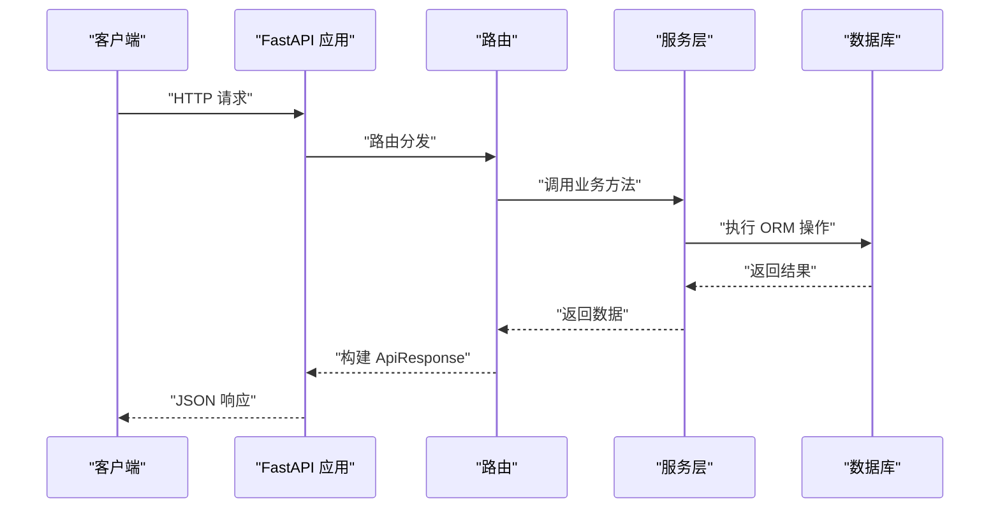
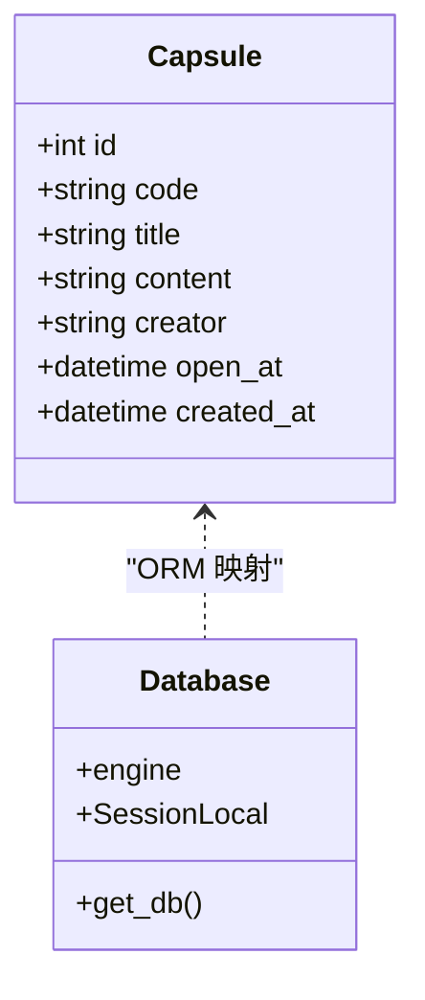
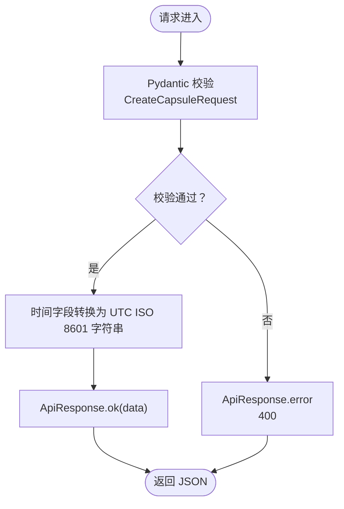
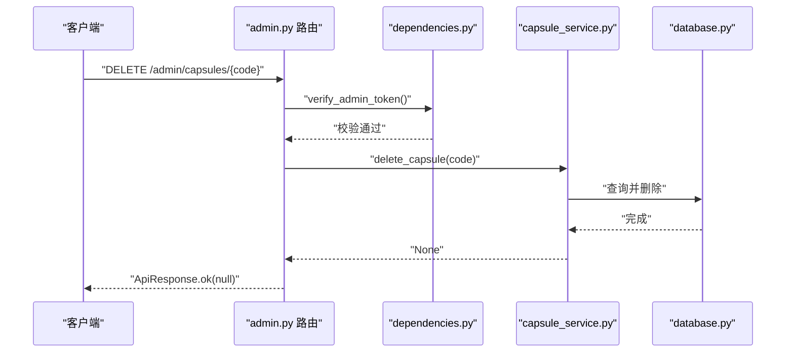
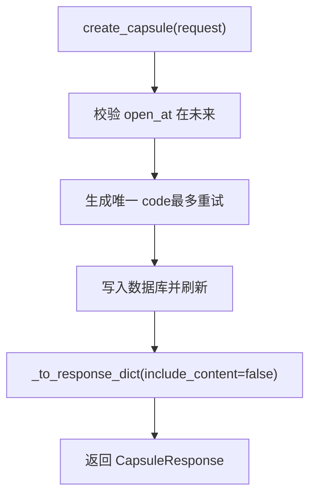
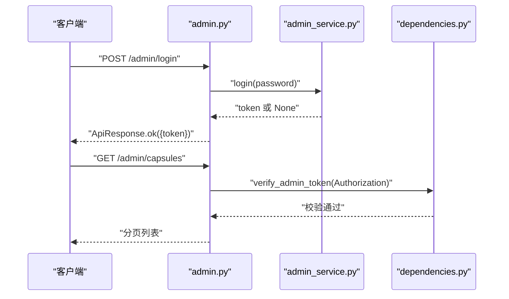
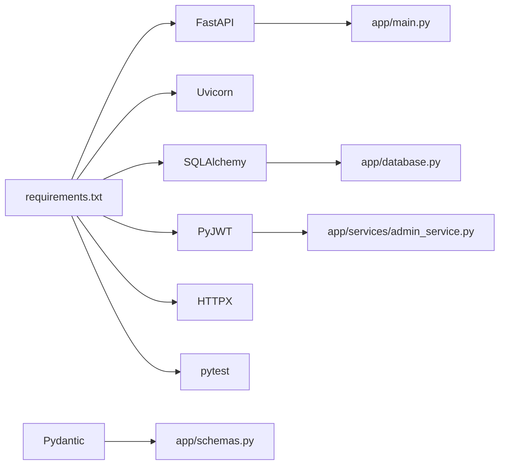

# FastAPI 实现

<cite>
**本文引用的文件**
- [main.py](file://backends/fastapi/app/main.py)
- [config.py](file://backends/fastapi/app/config.py)
- [database.py](file://backends/fastapi/app/database.py)
- [models.py](file://backends/fastapi/app/models.py)
- [schemas.py](file://backends/fastapi/app/schemas.py)
- [dependencies.py](file://backends/fastapi/app/dependencies.py)
- [health.py](file://backends/fastapi/app/routers/health.py)
- [capsule.py](file://backends/fastapi/app/routers/capsule.py)
- [admin.py](file://backends/fastapi/app/routers/admin.py)
- [capsule_service.py](file://backends/fastapi/app/services/capsule_service.py)
- [admin_service.py](file://backends/fastapi/app/services/admin_service.py)
- [test_capsule_service.py](file://backends/fastapi/tests/test_capsule_service.py)
- [test_admin_service.py](file://backends/fastapi/tests/test_admin_service.py)
- [conftest.py](file://backends/fastapi/tests/conftest.py)
- [openapi.yaml](file://spec/api/openapi.yaml)
- [requirements.txt](file://backends/fastapi/requirements.txt)
- [README.md](file://backends/fastapi/README.md)
</cite>

## 目录
1. [简介](#简介)
2. [项目结构](#项目结构)
3. [核心组件](#核心组件)
4. [架构总览](#架构总览)
5. [详细组件分析](#详细组件分析)
6. [依赖分析](#依赖分析)
7. [性能考虑](#性能考虑)
8. [故障排查指南](#故障排查指南)
9. [结论](#结论)
10. [附录](#附录)

## 简介
本项目是基于 FastAPI 的时间胶囊后端实现，采用异步编程模型、Pydantic 数据验证、SQLAlchemy ORM、JWT 管理员认证与统一响应格式。系统通过模块化的路由、服务层与依赖注入实现清晰的职责分离，并提供 OpenAPI/Swagger 文档与完善的测试覆盖。

## 项目结构
后端位于 backends/fastapi/app 下，采用按功能域划分的目录组织方式：
- 应用入口与全局配置：main.py、config.py
- 数据层：database.py（引擎、会话）、models.py（ORM 模型）
- 数据契约：schemas.py（Pydantic 模型）
- 路由层：routers/health.py、routers/capsule.py、routers/admin.py
- 服务层：services/capsule_service.py、services/admin_service.py
- 依赖注入：dependencies.py
- 测试：tests/ 下的单元与集成测试

图表来源
- [main.py:1-89](file://backends/fastapi/app/main.py#L1-L89)
- [database.py:1-30](file://backends/fastapi/app/database.py#L1-L30)
- [models.py:1-26](file://backends/fastapi/app/models.py#L1-L26)
- [schemas.py:1-96](file://backends/fastapi/app/schemas.py#L1-L96)
- [dependencies.py:1-23](file://backends/fastapi/app/dependencies.py#L1-L23)
- [health.py:1-25](file://backends/fastapi/app/routers/health.py#L1-L25)
- [capsule.py:1-31](file://backends/fastapi/app/routers/capsule.py#L1-L31)
- [admin.py:1-55](file://backends/fastapi/app/routers/admin.py#L1-L55)
- [capsule_service.py:1-144](file://backends/fastapi/app/services/capsule_service.py#L1-L144)
- [admin_service.py:1-42](file://backends/fastapi/app/services/admin_service.py#L1-L42)

章节来源
- [README.md:99-116](file://backends/fastapi/README.md#L99-L116)

## 核心组件
- 异步与高性能：基于 FastAPI 与 Uvicorn，支持异步路由与高并发 I/O。
- 数据验证：Pydantic 模型负责请求/响应校验与序列化，camelCase 字段别名与 ISO 8601 时间格式。
- ORM 与数据库：SQLAlchemy 2.x + SQLite，默认在应用启动时创建表。
- 依赖注入：FastAPI 依赖注入机制，数据库会话与管理员令牌验证通过依赖函数注入。
- 统一响应：ApiResponse 泛型封装 success/data/message/errorCode，所有接口统一输出。
- 全局异常处理：针对业务异常与通用异常进行标准化响应。
- OpenAPI 文档：自动生成 Swagger UI 与 ReDoc。

章节来源
- [main.py:1-89](file://backends/fastapi/app/main.py#L1-L89)
- [schemas.py:1-96](file://backends/fastapi/app/schemas.py#L1-L96)
- [database.py:1-30](file://backends/fastapi/app/database.py#L1-L30)
- [README.md:13-20](file://backends/fastapi/README.md#L13-L20)

## 架构总览
系统采用“路由层-服务层-数据层”的分层架构，配合依赖注入与全局异常处理，形成清晰的控制流与数据流。

图表来源
- [health.py:1-25](file://backends/fastapi/app/routers/health.py#L1-L25)
- [capsule.py:1-31](file://backends/fastapi/app/routers/capsule.py#L1-L31)
- [admin.py:1-55](file://backends/fastapi/app/routers/admin.py#L1-L55)
- [capsule_service.py:1-144](file://backends/fastapi/app/services/capsule_service.py#L1-L144)
- [admin_service.py:1-42](file://backends/fastapi/app/services/admin_service.py#L1-L42)
- [database.py:1-30](file://backends/fastapi/app/database.py#L1-L30)
- [models.py:1-26](file://backends/fastapi/app/models.py#L1-L26)
- [config.py:1-18](file://backends/fastapi/app/config.py#L1-L18)
- [dependencies.py:1-23](file://backends/fastapi/app/dependencies.py#L1-L23)

## 详细组件分析

### 应用入口与全局配置
- 应用初始化：创建数据库表、注册路由、配置 CORS。
- 全局异常处理：对业务异常（胶囊不存在、未授权）与通用异常（参数校验、值错误、未知异常）进行统一响应包装。
- 统一响应：使用 ApiResponse 封装 success/data/message/errorCode。

图表来源
- [main.py:1-89](file://backends/fastapi/app/main.py#L1-L89)
- [capsule.py:1-31](file://backends/fastapi/app/routers/capsule.py#L1-L31)
- [admin.py:1-55](file://backends/fastapi/app/routers/admin.py#L1-L55)
- [capsule_service.py:1-144](file://backends/fastapi/app/services/capsule_service.py#L1-L144)
- [schemas.py:81-96](file://backends/fastapi/app/schemas.py#L81-L96)

章节来源
- [main.py:16-89](file://backends/fastapi/app/main.py#L16-L89)

### 配置管理
- 数据库连接：支持 SQLite/其他数据库，相对路径便于本地开发。
- 管理员密码：用于 JWT 登录校验。
- JWT 密钥与过期时间：用于签发与验证管理员令牌。

章节来源
- [config.py:1-18](file://backends/fastapi/app/config.py#L1-L18)

### 数据库与模型
- 引擎与会话：根据 DATABASE_URL 创建引擎；SessionLocal 提供线程安全的会话工厂；get_db 作为 FastAPI 依赖注入提供会话生命周期管理。
- 模型定义：Capsule 表含 code、title、content、creator、open_at、created_at 等字段，open_at 与 created_at 支持时区。

图表来源
- [models.py:14-26](file://backends/fastapi/app/models.py#L14-L26)
- [database.py:11-30](file://backends/fastapi/app/database.py#L11-L30)

章节来源
- [database.py:1-30](file://backends/fastapi/app/database.py#L1-L30)
- [models.py:1-26](file://backends/fastapi/app/models.py#L1-L26)

### Pydantic 数据验证与统一响应
- 字段命名：snake_case → camelCase 序列化，确保与前端契约一致。
- 时间格式：open_at 支持 ISO 8601 字符串或 datetime 对象，内部统一为 UTC。
- 统一响应：ApiResponse 泛型封装 success/data/message/errorCode，提供 ok/error 静态方法。

图表来源
- [schemas.py:26-45](file://backends/fastapi/app/schemas.py#L26-L45)
- [schemas.py:81-96](file://backends/fastapi/app/schemas.py#L81-L96)

章节来源
- [schemas.py:1-96](file://backends/fastapi/app/schemas.py#L1-L96)

### 路由模块设计
- 健康检查：/api/v1/health，返回技术栈与时间戳。
- 胶囊路由：/api/v1/capsules（POST 创建、GET 查询），使用依赖注入获取数据库会话。
- 管理员路由：/api/v1/admin（POST 登录、GET 列表、DELETE 删除），登录无需认证，其余接口依赖管理员令牌验证。

图表来源
- [admin.py:47-55](file://backends/fastapi/app/routers/admin.py#L47-L55)
- [dependencies.py:10-23](file://backends/fastapi/app/dependencies.py#L10-L23)
- [capsule_service.py:137-144](file://backends/fastapi/app/services/capsule_service.py#L137-L144)
- [database.py:23-30](file://backends/fastapi/app/database.py#L23-L30)

章节来源
- [health.py:1-25](file://backends/fastapi/app/routers/health.py#L1-L25)
- [capsule.py:1-31](file://backends/fastapi/app/routers/capsule.py#L1-L31)
- [admin.py:1-55](file://backends/fastapi/app/routers/admin.py#L1-L55)

### 服务层架构
- 胶囊服务：生成唯一 code（BASE62 8 位）、创建胶囊、查询详情（未开启隐藏 content）、分页列表（管理员）、删除胶囊。
- 管理员服务：登录校验密码并签发 JWT，验证令牌有效性。

图表来源
- [capsule_service.py:79-103](file://backends/fastapi/app/services/capsule_service.py#L79-L103)
- [capsule_service.py:32-44](file://backends/fastapi/app/services/capsule_service.py#L32-L44)
- [capsule_service.py:46-77](file://backends/fastapi/app/services/capsule_service.py#L46-L77)

章节来源
- [capsule_service.py:1-144](file://backends/fastapi/app/services/capsule_service.py#L1-L144)
- [admin_service.py:1-42](file://backends/fastapi/app/services/admin_service.py#L1-L42)

### JWT 认证机制
- 登录：校验 ADMIN_PASSWORD，签发 HS256 JWT，包含 sub、iat、exp。
- 验证：从 Authorization 头提取 Bearer Token，使用 JWT_SECRET 解码验证。
- 依赖注入：verify_admin_token 在路由中以依赖方式强制校验。

图表来源
- [admin.py:25-31](file://backends/fastapi/app/routers/admin.py#L25-L31)
- [admin_service.py:18-32](file://backends/fastapi/app/services/admin_service.py#L18-L32)
- [dependencies.py:10-23](file://backends/fastapi/app/dependencies.py#L10-L23)

章节来源
- [admin_service.py:1-42](file://backends/fastapi/app/services/admin_service.py#L1-L42)
- [dependencies.py:1-23](file://backends/fastapi/app/dependencies.py#L1-L23)

### 异常处理与统一响应
- 业务异常：胶囊不存在、未授权，映射为 404/401 并携带错误码。
- 参数校验：RequestValidationError 聚合错误位置与消息，返回 400。
- 通用异常：ValueError 映射为 400，其他异常映射为 500。
- 统一响应：ApiResponse.success/data/message/errorCode。

章节来源
- [main.py:37-89](file://backends/fastapi/app/main.py#L37-L89)
- [schemas.py:81-96](file://backends/fastapi/app/schemas.py#L81-L96)

## 依赖分析
- 外部依赖：FastAPI、Uvicorn、SQLAlchemy、PyJWT、HTTPX、pytest。
- 内部耦合：路由依赖服务层；服务层依赖数据库层；依赖注入贯穿路由与服务层。
- 配置集中：数据库 URL、管理员密码、JWT 密钥与过期时间集中于 config.py。

图表来源
- [requirements.txt:1-7](file://backends/fastapi/requirements.txt#L1-L7)
- [main.py:1-89](file://backends/fastapi/app/main.py#L1-L89)
- [database.py:1-30](file://backends/fastapi/app/database.py#L1-L30)
- [admin_service.py:1-42](file://backends/fastapi/app/services/admin_service.py#L1-L42)
- [schemas.py:1-96](file://backends/fastapi/app/schemas.py#L1-L96)

章节来源
- [requirements.txt:1-7](file://backends/fastapi/requirements.txt#L1-L7)

## 性能考虑
- 数据库连接：SQLite 适合开发与小规模场景；生产可切换为 PostgreSQL/MySQL，并启用连接池与只读副本。
- ORM 查询：分页查询使用 offset/limit，注意大偏移场景的索引与排序优化。
- 依赖注入：get_db 会话按请求生命周期管理，避免跨请求共享会话。
- 异步扩展：当前路由为同步实现；可评估将 I/O 密集操作（如外部 API 调用）改为异步协程。
- 缓存策略：对热点查询（如公开胶囊详情）引入缓存层（Redis），减少数据库压力。
- 日志与监控：接入结构化日志与指标采集，定位慢查询与异常。

## 故障排查指南
- 健康检查失败：确认应用已启动并监听端口，检查 CORS 配置是否允许前端源。
- 参数校验错误：核对请求体字段命名（camelCase）与时间格式（ISO 8601 Z/时区）。
- 未授权访问：确认 Authorization 头格式为 Bearer {token}，且令牌未过期。
- 胶囊不存在：确认 code 是否为 8 位字母数字组合，且大小写敏感。
- 数据库问题：确认 DATABASE_URL 与数据文件权限，SQLite 文件路径是否正确。

章节来源
- [main.py:21-29](file://backends/fastapi/app/main.py#L21-L29)
- [schemas.py:14-18](file://backends/fastapi/app/schemas.py#L14-L18)
- [dependencies.py:16-22](file://backends/fastapi/app/dependencies.py#L16-L22)
- [capsule_service.py:107-111](file://backends/fastapi/app/services/capsule_service.py#L107-L111)

## 结论
本项目以 FastAPI 为核心，结合 Pydantic、SQLAlchemy 与 JWT，实现了清晰的分层架构与统一的响应格式。通过依赖注入与全局异常处理，提升了代码可维护性与一致性。建议在生产环境中完善数据库选型、引入缓存与监控，并持续完善测试覆盖。

## 附录

### API 规范与契约
- OpenAPI 规范定义了健康检查、胶囊 CRUD、管理员登录与管理接口的请求/响应契约，包含安全方案（Bearer JWT）与错误响应格式。

章节来源
- [openapi.yaml:1-349](file://spec/api/openapi.yaml#L1-L349)

### 测试策略与示例
- 单元测试：覆盖胶囊服务与管理员服务的关键行为（创建、查询、删除、登录、令牌验证）。
- 集成测试：使用内存 SQLite 与 TestClient，通过依赖覆盖注入测试数据库会话。

章节来源
- [test_capsule_service.py:1-89](file://backends/fastapi/tests/test_capsule_service.py#L1-L89)
- [test_admin_service.py:1-30](file://backends/fastapi/tests/test_admin_service.py#L1-L30)
- [conftest.py:1-47](file://backends/fastapi/tests/conftest.py#L1-L47)