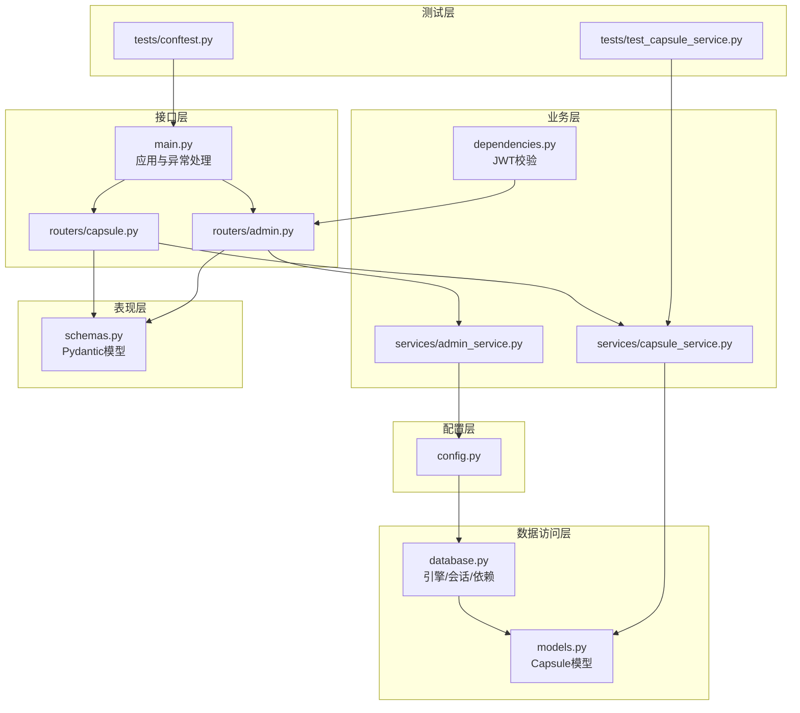
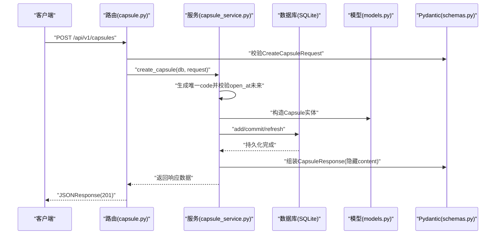
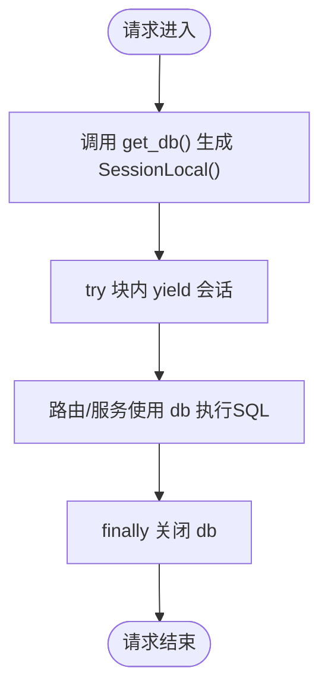
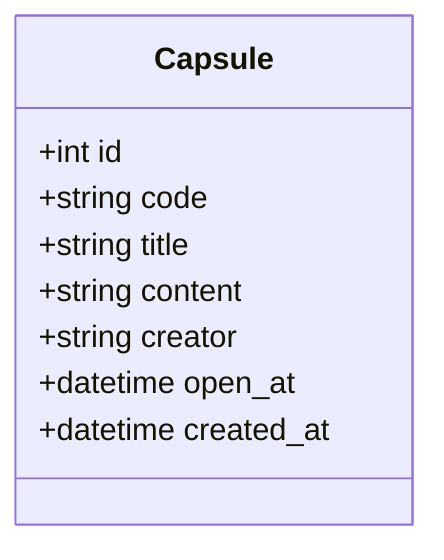
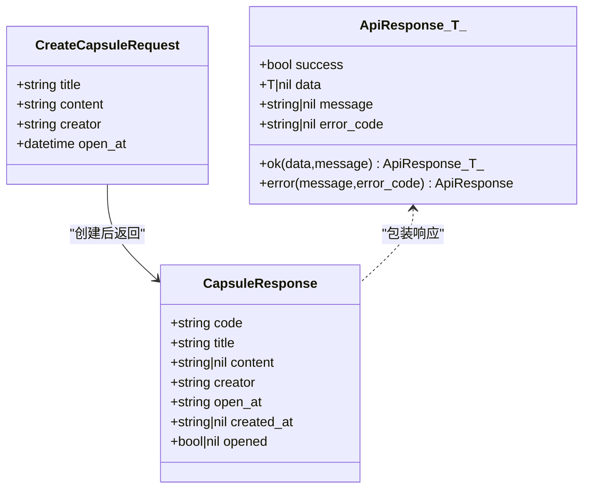
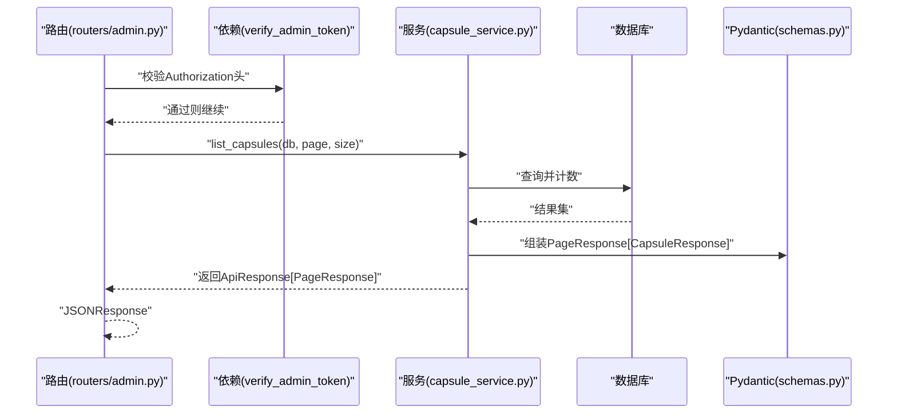
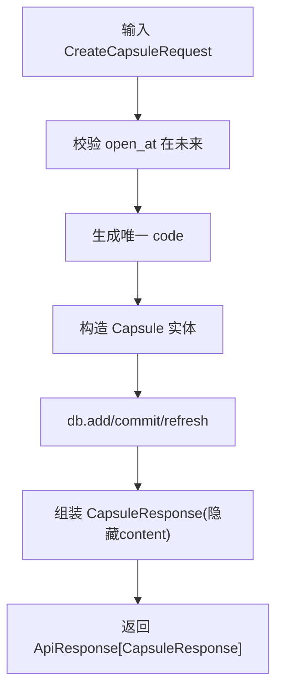
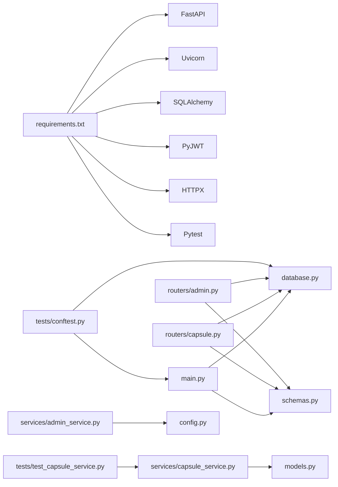

# 数据库集成与ORM

<cite>
**本文引用的文件**
- [backends/fastapi/app/database.py](file://backends/fastapi/app/database.py)
- [backends/fastapi/app/models.py](file://backends/fastapi/app/models.py)
- [backends/fastapi/app/schemas.py](file://backends/fastapi/app/schemas.py)
- [backends/fastapi/app/main.py](file://backends/fastapi/app/main.py)
- [backends/fastapi/app/config.py](file://backends/fastapi/app/config.py)
- [backends/fastapi/app/routers/capsule.py](file://backends/fastapi/app/routers/capsule.py)
- [backends/fastapi/app/routers/admin.py](file://backends/fastapi/app/routers/admin.py)
- [backends/fastapi/app/services/capsule_service.py](file://backends/fastapi/app/services/capsule_service.py)
- [backends/fastapi/app/services/admin_service.py](file://backends/fastapi/app/services/admin_service.py)
- [backends/fastapi/app/dependencies.py](file://backends/fastapi/app/dependencies.py)
- [backends/fastapi/tests/conftest.py](file://backends/fastapi/tests/conftest.py)
- [backends/fastapi/tests/test_capsule_service.py](file://backends/fastapi/tests/test_capsule_service.py)
- [spec/api/openapi.yaml](file://spec/api/openapi.yaml)
- [backends/fastapi/requirements.txt](file://backends/fastapi/requirements.txt)
</cite>

## 目录
1. [简介](#简介)
2. [项目结构](#项目结构)
3. [核心组件](#核心组件)
4. [架构总览](#架构总览)
5. [详细组件分析](#详细组件分析)
6. [依赖分析](#依赖分析)
7. [性能考虑](#性能考虑)
8. [故障排查指南](#故障排查指南)
9. [结论](#结论)
10. [附录](#附录)

## 简介
本文件聚焦于后端FastAPI工程中的数据库集成与ORM实现，系统性梳理以下方面：
- database.py中的数据库连接配置、引擎与会话管理
- models.py中的SQLAlchemy模型设计与字段约束
- schemas.py中的Pydantic模型与数据验证、序列化策略
- 异步数据库操作最佳实践（基于现有同步实现的建议与迁移路径）
- 数据模型与API接口映射关系（请求参数验证、响应格式化）
- 数据库迁移、性能优化与错误处理的实用指南

## 项目结构
后端采用FastAPI + SQLAlchemy 2.x + Pydantic的典型分层架构：
- 配置层：读取环境变量，提供数据库URL、JWT密钥等
- 数据访问层：SQLAlchemy引擎、会话工厂、基础模型基类、依赖注入
- 业务层：服务模块封装核心业务逻辑
- 接口层：路由模块组织REST API，依赖注入获取会话
- 表现层：Pydantic模型负责请求/响应的数据契约与序列化
- 测试层：内存SQLite + TestClient + 依赖覆盖，确保隔离与可重复

图表来源
- [backends/fastapi/app/config.py:1-18](file://backends/fastapi/app/config.py#L1-L18)
- [backends/fastapi/app/database.py:1-30](file://backends/fastapi/app/database.py#L1-L30)
- [backends/fastapi/app/models.py:1-26](file://backends/fastapi/app/models.py#L1-L26)
- [backends/fastapi/app/schemas.py:1-96](file://backends/fastapi/app/schemas.py#L1-L96)
- [backends/fastapi/app/main.py:1-89](file://backends/fastapi/app/main.py#L1-L89)
- [backends/fastapi/app/routers/capsule.py:1-31](file://backends/fastapi/app/routers/capsule.py#L1-L31)
- [backends/fastapi/app/routers/admin.py:1-55](file://backends/fastapi/app/routers/admin.py#L1-L55)
- [backends/fastapi/app/services/capsule_service.py:1-144](file://backends/fastapi/app/services/capsule_service.py#L1-L144)
- [backends/fastapi/app/services/admin_service.py:1-42](file://backends/fastapi/app/services/admin_service.py#L1-L42)
- [backends/fastapi/app/dependencies.py:1-23](file://backends/fastapi/app/dependencies.py#L1-L23)
- [backends/fastapi/tests/conftest.py:1-47](file://backends/fastapi/tests/conftest.py#L1-L47)
- [backends/fastapi/tests/test_capsule_service.py:1-89](file://backends/fastapi/tests/test_capsule_service.py#L1-L89)

章节来源
- [backends/fastapi/app/main.py:16-17](file://backends/fastapi/app/main.py#L16-L17)
- [backends/fastapi/app/database.py:11-29](file://backends/fastapi/app/database.py#L11-L29)
- [backends/fastapi/app/models.py:14-26](file://backends/fastapi/app/models.py#L14-L26)
- [backends/fastapi/app/schemas.py:14-96](file://backends/fastapi/app/schemas.py#L14-L96)
- [backends/fastapi/app/routers/capsule.py:17-31](file://backends/fastapi/app/routers/capsule.py#L17-L31)
- [backends/fastapi/app/routers/admin.py:25-55](file://backends/fastapi/app/routers/admin.py#L25-L55)
- [backends/fastapi/app/services/capsule_service.py:79-144](file://backends/fastapi/app/services/capsule_service.py#L79-L144)
- [backends/fastapi/app/services/admin_service.py:18-42](file://backends/fastapi/app/services/admin_service.py#L18-L42)
- [backends/fastapi/app/dependencies.py:10-23](file://backends/fastapi/app/dependencies.py#L10-L23)
- [backends/fastapi/tests/conftest.py:16-47](file://backends/fastapi/tests/conftest.py#L16-L47)
- [backends/fastapi/tests/test_capsule_service.py:17-89](file://backends/fastapi/tests/test_capsule_service.py#L17-L89)
- [spec/api/openapi.yaml:10-164](file://spec/api/openapi.yaml#L10-L164)

## 核心组件
- 数据库配置与会话管理：在database.py中创建SQLAlchemy引擎、会话工厂与依赖注入函数，支持SQLite并兼容多线程场景
- SQLAlchemy模型：在models.py中定义Capsule实体，包含主键、唯一索引、长度约束、索引优化与UTC时间存储
- Pydantic模型：在schemas.py中定义请求/响应模型，统一camelCase序列化、ISO 8601时间格式、字段长度与必填约束
- 业务服务：在services中封装创建、查询、分页、删除等核心逻辑，含唯一编码生成、内容可见性控制与时间格式化
- 路由与依赖：在routers中组织API，通过依赖注入获取会话；管理员路由引入JWT校验中间件
- 应用入口与异常处理：在main.py中初始化数据库、注册路由与全局异常处理器

章节来源
- [backends/fastapi/app/database.py:11-29](file://backends/fastapi/app/database.py#L11-L29)
- [backends/fastapi/app/models.py:14-26](file://backends/fastapi/app/models.py#L14-L26)
- [backends/fastapi/app/schemas.py:26-96](file://backends/fastapi/app/schemas.py#L26-L96)
- [backends/fastapi/app/services/capsule_service.py:32-144](file://backends/fastapi/app/services/capsule_service.py#L32-L144)
- [backends/fastapi/app/routers/capsule.py:17-31](file://backends/fastapi/app/routers/capsule.py#L17-L31)
- [backends/fastapi/app/routers/admin.py:25-55](file://backends/fastapi/app/routers/admin.py#L25-L55)
- [backends/fastapi/app/main.py:16-89](file://backends/fastapi/app/main.py#L16-L89)

## 架构总览
下图展示从HTTP请求到数据库写入与响应返回的完整流程，涵盖依赖注入、业务逻辑、数据模型与异常处理。

图表来源
- [backends/fastapi/app/routers/capsule.py:17-24](file://backends/fastapi/app/routers/capsule.py#L17-L24)
- [backends/fastapi/app/services/capsule_service.py:79-102](file://backends/fastapi/app/services/capsule_service.py#L79-L102)
- [backends/fastapi/app/models.py:14-26](file://backends/fastapi/app/models.py#L14-L26)
- [backends/fastapi/app/schemas.py:26-64](file://backends/fastapi/app/schemas.py#L26-L64)

## 详细组件分析

### 数据库连接与会话管理（database.py）
- 引擎创建：根据配置的DATABASE_URL创建SQLAlchemy引擎；对SQLite使用特定连接参数以允许多线程
- 会话工厂：sessionmaker绑定engine，禁用自动提交与自动刷新，确保显式事务控制
- 基类：DeclarativeBase子类作为ORM模型基类
- 依赖注入：get_db()生成器在每次请求中创建会话并在finally中关闭，避免泄漏

图表来源
- [backends/fastapi/app/database.py:23-29](file://backends/fastapi/app/database.py#L23-L29)

章节来源
- [backends/fastapi/app/database.py:11-29](file://backends/fastapi/app/database.py#L11-L29)
- [backends/fastapi/app/config.py](file://backends/fastapi/app/config.py#L9)

### SQLAlchemy模型设计（models.py）
- 实体命名与表名：Capsule实体对应“capsules”表
- 主键与自增：id为主键并启用自增
- 唯一性与索引：code字段唯一且建立索引，提升查询效率
- 长度与非空：title、content、creator、open_at均设为非空；title最大100字符，creator最大30字符
- 时间字段：open_at与created_at均为带时区的DateTime，统一存储UTC，便于跨语言一致性
- 索引优化：对code建立索引，满足高频按code查询场景

图表来源
- [backends/fastapi/app/models.py:14-26](file://backends/fastapi/app/models.py#L14-L26)

章节来源
- [backends/fastapi/app/models.py:14-26](file://backends/fastapi/app/models.py#L14-L26)

### Pydantic模型与数据契约（schemas.py）
- 序列化风格：统一使用camelCase别名生成器，便于前后端契约一致
- 请求模型：
  - CreateCapsuleRequest：标题、内容、创建者长度限制；open_at支持ISO 8601字符串或datetime对象，内部强制UTC
- 响应模型：
  - CapsuleResponse：code、title、creator、open_at（ISO 8601字符串）、created_at（ISO 8601字符串，可空）、opened布尔标记
  - PageResponse与ApiResponse：通用分页与统一响应包装，支持泛型
- 错误模型：ApiErrorResponse用于标准化错误响应

图表来源
- [backends/fastapi/app/schemas.py:26-96](file://backends/fastapi/app/schemas.py#L26-L96)

章节来源
- [backends/fastapi/app/schemas.py:14-96](file://backends/fastapi/app/schemas.py#L14-L96)

### 异步数据库操作最佳实践（现状与建议）
- 现状：当前使用同步SQLAlchemy 2.x与FastAPI同步依赖注入；会话在每次请求中创建与关闭
- 异步迁移建议：
  - 使用SQLAlchemy 2.x异步引擎与异步会话工厂
  - 将依赖注入函数改为异步生成器，使用异步上下文管理
  - 业务服务方法改为async def，使用异步查询与事务
  - 连接池配置：合理设置pool_size、max_overflow、pool_recycle等参数
  - 事务处理：使用异步事务上下文，确保异常回滚
- 优势：提升高并发下的吞吐量，降低阻塞等待

章节来源
- [backends/fastapi/requirements.txt:1-7](file://backends/fastapi/requirements.txt#L1-L7)
- [backends/fastapi/app/database.py:11-16](file://backends/fastapi/app/database.py#L11-L16)

### 数据模型与API接口映射
- 请求参数验证：路由层接收Pydantic模型，自动进行字段长度、必填与类型校验；open_at在模型层进一步解析为UTC时间
- 响应数据格式化：服务层将模型实例转换为字典并格式化时间字段为ISO 8601字符串，控制content可见性
- 统一响应包装：使用ApiResponse泛型包装业务结果，便于前端统一处理
- OpenAPI契约：通过openapi.yaml明确请求体schema、响应schema与安全方案（Bearer JWT）

图表来源
- [backends/fastapi/app/routers/admin.py:33-44](file://backends/fastapi/app/routers/admin.py#L33-L44)
- [backends/fastapi/app/dependencies.py:10-23](file://backends/fastapi/app/dependencies.py#L10-L23)
- [backends/fastapi/app/services/capsule_service.py:114-134](file://backends/fastapi/app/services/capsule_service.py#L114-L134)
- [backends/fastapi/app/schemas.py:54-88](file://backends/fastapi/app/schemas.py#L54-L88)

章节来源
- [backends/fastapi/app/routers/capsule.py:17-31](file://backends/fastapi/app/routers/capsule.py#L17-L31)
- [backends/fastapi/app/routers/admin.py:25-55](file://backends/fastapi/app/routers/admin.py#L25-L55)
- [backends/fastapi/app/dependencies.py:10-23](file://backends/fastapi/app/dependencies.py#L10-L23)
- [backends/fastapi/app/services/capsule_service.py:46-102](file://backends/fastapi/app/services/capsule_service.py#L46-L102)
- [spec/api/openapi.yaml:24-164](file://spec/api/openapi.yaml#L24-L164)

### 业务逻辑与数据流（服务层）
- 唯一编码生成：随机生成8位字母数字组合，最多重试若干次确保唯一性
- 创建胶囊：校验open_at在未来，生成唯一code，持久化后返回不包含content的响应
- 查询胶囊：按code查询，未开启时content为null，opened标记为False
- 分页查询：计算总数与页数，按创建时间倒序分页返回
- 删除胶囊：按code查找并删除，不存在则抛出业务异常

图表来源
- [backends/fastapi/app/services/capsule_service.py:79-102](file://backends/fastapi/app/services/capsule_service.py#L79-L102)

章节来源
- [backends/fastapi/app/services/capsule_service.py:32-144](file://backends/fastapi/app/services/capsule_service.py#L32-L144)

## 依赖分析
- 外部依赖：FastAPI、Uvicorn、SQLAlchemy 2.x、PyJWT、HTTPX、Pytest
- 内部依赖：
  - main.py依赖database与schemas，注册路由并初始化表
  - routers依赖database的get_db与schemas模型
  - services依赖models与schemas，并通过Session与数据库交互
  - tests通过conftest覆盖get_db，使用内存SQLite进行隔离测试

图表来源
- [backends/fastapi/requirements.txt:1-7](file://backends/fastapi/requirements.txt#L1-L7)
- [backends/fastapi/app/main.py:10-14](file://backends/fastapi/app/main.py#L10-L14)
- [backends/fastapi/app/routers/capsule.py:10-12](file://backends/fastapi/app/routers/capsule.py#L10-L12)
- [backends/fastapi/app/routers/admin.py:10-19](file://backends/fastapi/app/routers/admin.py#L10-L19)
- [backends/fastapi/app/services/capsule_service.py:13-18](file://backends/fastapi/app/services/capsule_service.py#L13-L18)
- [backends/fastapi/app/services/admin_service.py](file://backends/fastapi/app/services/admin_service.py#L9)
- [backends/fastapi/tests/conftest.py:16-47](file://backends/fastapi/tests/conftest.py#L16-L47)
- [backends/fastapi/tests/test_capsule_service.py:8-14](file://backends/fastapi/tests/test_capsule_service.py#L8-L14)

章节来源
- [backends/fastapi/requirements.txt:1-7](file://backends/fastapi/requirements.txt#L1-L7)
- [backends/fastapi/app/main.py:10-14](file://backends/fastapi/app/main.py#L10-L14)
- [backends/fastapi/tests/conftest.py:16-47](file://backends/fastapi/tests/conftest.py#L16-L47)

## 性能考虑
- 连接池与会话生命周期：当前使用同步会话，建议在高并发场景下评估连接池参数；如迁移到异步，结合异步引擎与连接池配置
- 索引优化：对高频查询字段（如code）建立索引；避免SELECT *，仅查询必要字段
- 时间字段：统一存储UTC，减少时区转换开销；序列化时输出ISO 8601字符串，便于前端解析
- 分页与排序：按创建时间倒序分页，避免全表扫描；合理设置每页大小上限
- 唯一性冲突：生成唯一code时的重试次数有限，确保数据库唯一约束与业务逻辑一致

## 故障排查指南
- 参数校验失败：全局异常处理器将RequestValidationError转为统一错误响应，定位错误字段与消息
- 业务异常：CapsuleNotFoundException与UnauthorizedException分别映射为404与401，携带错误码
- 值错误：ValueError统一转为400与错误码
- 通用异常：其他异常映射为500与错误码
- 单元测试：通过内存SQLite与依赖覆盖，快速验证创建、查询、删除等关键路径

章节来源
- [backends/fastapi/app/main.py:37-89](file://backends/fastapi/app/main.py#L37-L89)
- [backends/fastapi/tests/conftest.py:16-47](file://backends/fastapi/tests/conftest.py#L16-L47)
- [backends/fastapi/tests/test_capsule_service.py:17-89](file://backends/fastapi/tests/test_capsule_service.py#L17-L89)

## 结论
该FastAPI工程以清晰的分层实现了数据库集成与ORM：SQLAlchemy负责数据持久化，Pydantic确保数据契约与序列化一致性，服务层封装业务逻辑，路由层通过依赖注入与异常处理保障接口稳定性。建议在高并发场景下评估异步迁移与连接池配置，并持续完善数据库迁移与性能监控体系。

## 附录
- 数据库迁移建议：使用Alembic管理迁移脚本，遵循“先建表、再加索引”的顺序；对大表变更采用在线DDL策略
- 安全加固：生产环境固定JWT密钥与过期时间，严格校验Authorization头格式
- 监控与日志：记录慢查询、异常堆栈与请求耗时，结合APM工具定位瓶颈