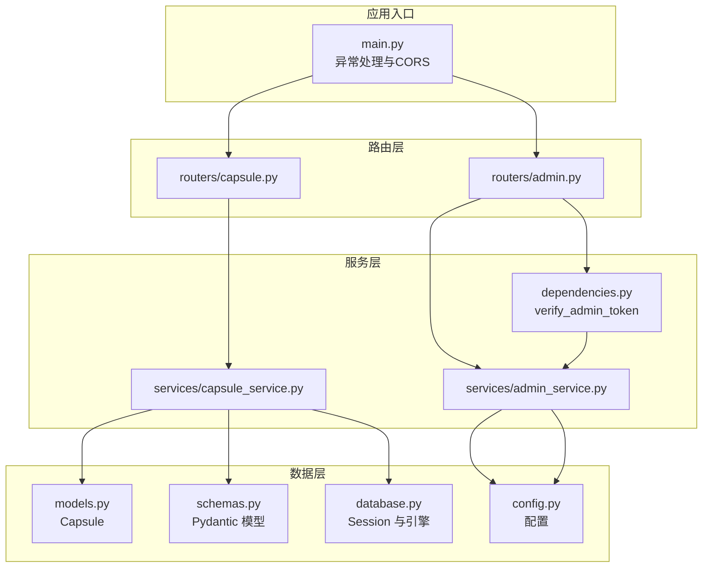
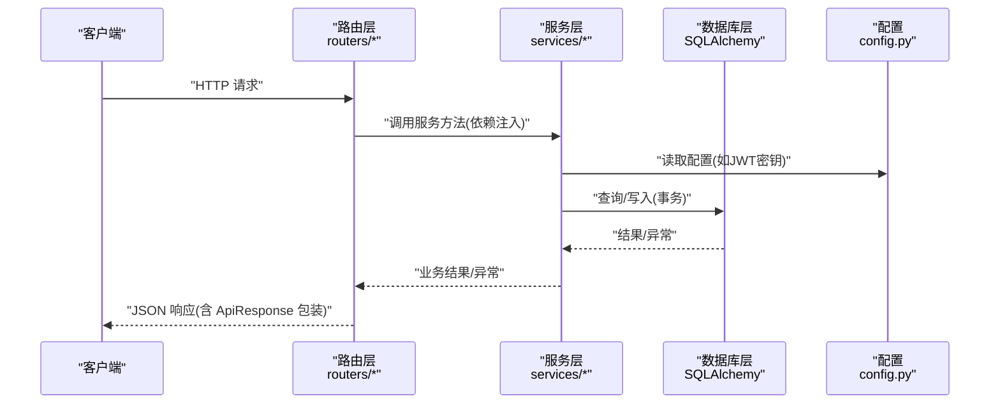
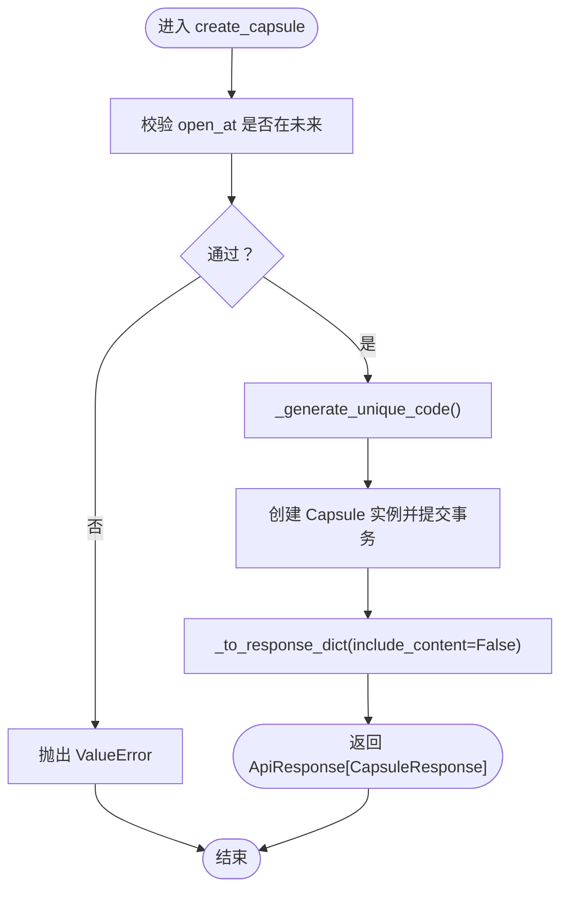
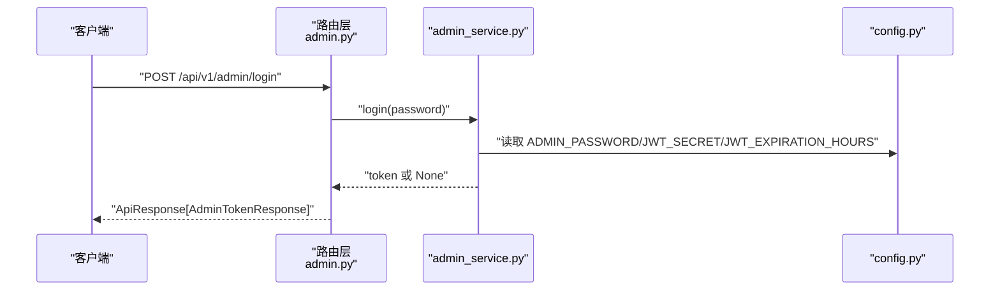
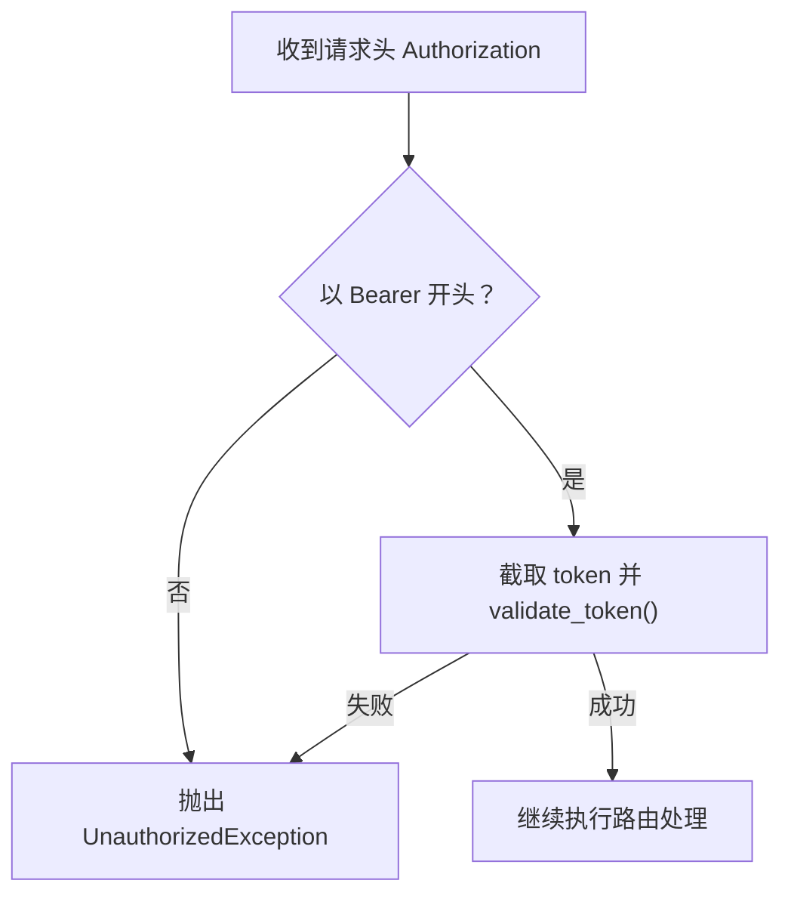
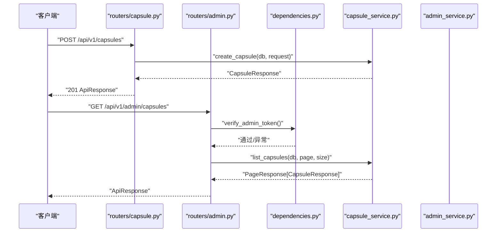
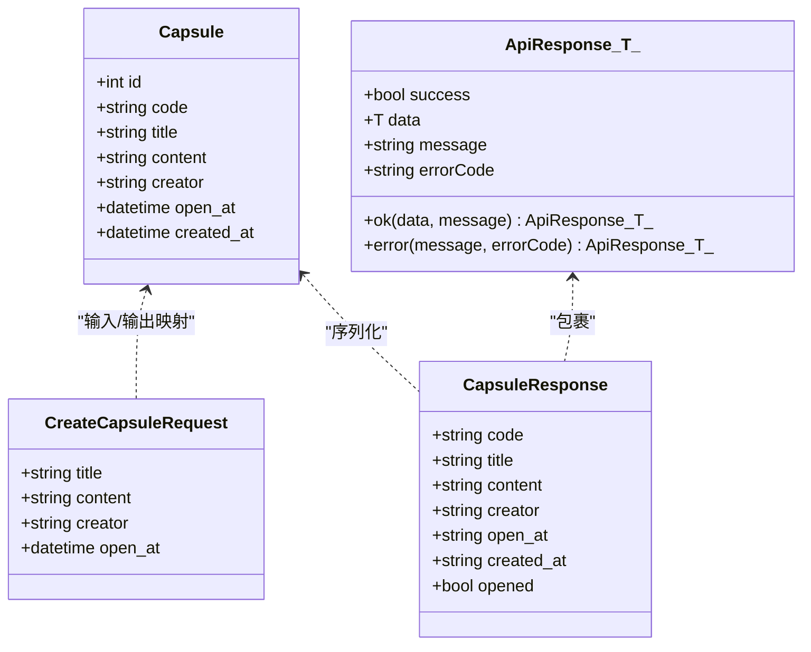
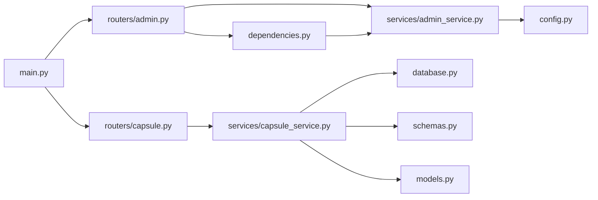

# 服务层架构

<cite>
**本文引用的文件**
- [capsule_service.py](file://backends/fastapi/app/services/capsule_service.py)
- [admin_service.py](file://backends/fastapi/app/services/admin_service.py)
- [capsule.py](file://backends/fastapi/app/routers/capsule.py)
- [admin.py](file://backends/fastapi/app/routers/admin.py)
- [dependencies.py](file://backends/fastapi/app/dependencies.py)
- [models.py](file://backends/fastapi/app/models.py)
- [schemas.py](file://backends/fastapi/app/schemas.py)
- [database.py](file://backends/fastapi/app/database.py)
- [main.py](file://backends/fastapi/app/main.py)
- [config.py](file://backends/fastapi/app/config.py)
- [test_capsule_service.py](file://backends/fastapi/tests/test_capsule_service.py)
- [test_admin_service.py](file://backends/fastapi/tests/test_admin_service.py)
- [test_capsule_api.py](file://backends/fastapi/tests/test_capsule_api.py)
- [test_admin_api.py](file://backends/fastapi/tests/test_admin_api.py)
- [conftest.py](file://backends/fastapi/tests/conftest.py)
</cite>

## 目录
1. [引言](#引言)
2. [项目结构](#项目结构)
3. [核心组件](#核心组件)
4. [架构总览](#架构总览)
5. [详细组件分析](#详细组件分析)
6. [依赖关系分析](#依赖关系分析)
7. [性能考虑](#性能考虑)
8. [故障排查指南](#故障排查指南)
9. [结论](#结论)
10. [附录](#附录)

## 引言
本文件系统性梳理后端 FastAPI 服务层的架构设计与实现细节，重点覆盖以下方面：
- 服务层设计模式：业务逻辑封装、数据访问抽象、服务间协作
- 胶囊服务（capsule_service.py）：创建、查询、分页、删除等核心流程与数据安全控制
- 管理员服务（admin_service.py）：登录认证、JWT 令牌签发与验证、权限控制
- 服务层与路由层交互：依赖注入、参数传递、异常处理
- 单元测试策略与最佳实践
- 扩展、性能优化与错误处理指南

## 项目结构
后端采用 FastAPI + SQLAlchemy 的分层架构，服务层位于路由层与数据层之间，负责：
- 路由层接收请求并进行参数校验
- 服务层执行业务规则与数据访问
- 数据层通过 SQLAlchemy ORM 进行持久化

图表来源
- [capsule.py:1-31](file://backends/fastapi/app/routers/capsule.py#L1-L31)
- [admin.py:1-55](file://backends/fastapi/app/routers/admin.py#L1-L55)
- [capsule_service.py:1-144](file://backends/fastapi/app/services/capsule_service.py#L1-L144)
- [admin_service.py:1-42](file://backends/fastapi/app/services/admin_service.py#L1-L42)
- [dependencies.py:1-23](file://backends/fastapi/app/dependencies.py#L1-L23)
- [models.py:1-26](file://backends/fastapi/app/models.py#L1-L26)
- [schemas.py:1-96](file://backends/fastapi/app/schemas.py#L1-L96)
- [database.py:1-30](file://backends/fastapi/app/database.py#L1-L30)
- [config.py:1-18](file://backends/fastapi/app/config.py#L1-L18)
- [main.py:1-89](file://backends/fastapi/app/main.py#L1-L89)

章节来源
- [capsule.py:1-31](file://backends/fastapi/app/routers/capsule.py#L1-L31)
- [admin.py:1-55](file://backends/fastapi/app/routers/admin.py#L1-L55)
- [capsule_service.py:1-144](file://backends/fastapi/app/services/capsule_service.py#L1-L144)
- [admin_service.py:1-42](file://backends/fastapi/app/services/admin_service.py#L1-L42)
- [dependencies.py:1-23](file://backends/fastapi/app/dependencies.py#L1-L23)
- [models.py:1-26](file://backends/fastapi/app/models.py#L1-L26)
- [schemas.py:1-96](file://backends/fastapi/app/schemas.py#L1-L96)
- [database.py:1-30](file://backends/fastapi/app/database.py#L1-L30)
- [config.py:1-18](file://backends/fastapi/app/config.py#L1-L18)
- [main.py:1-89](file://backends/fastapi/app/main.py#L1-L89)

## 核心组件
- 胶囊服务（capsule_service.py）
  - 职责：封装创建、查询、分页、删除等业务逻辑；控制内容可见性（未开启前隐藏 content）
  - 关键点：唯一编码生成、未来时间校验、ISO 8601 时间格式化、分页统计
- 管理员服务（admin_service.py）
  - 职责：登录认证、JWT 签发、令牌验证
  - 关键点：基于配置的密钥与过期时长、HS256 算法
- 依赖注入与权限控制（dependencies.py）
  - 职责：从请求头提取并验证 Bearer 令牌，统一抛出自定义异常
- 数据模型与契约（models.py、schemas.py）
  - 职责：ORM 映射、请求/响应模型、通用响应包装、驼峰序列化
- 数据库与配置（database.py、config.py）
  - 职责：引擎与会话工厂、SQLite 内存库测试、JWT/数据库配置
- 应用入口与异常处理（main.py）
  - 职责：CORS、路由注册、全局异常映射

章节来源
- [capsule_service.py:1-144](file://backends/fastapi/app/services/capsule_service.py#L1-L144)
- [admin_service.py:1-42](file://backends/fastapi/app/services/admin_service.py#L1-L42)
- [dependencies.py:1-23](file://backends/fastapi/app/dependencies.py#L1-L23)
- [models.py:1-26](file://backends/fastapi/app/models.py#L1-L26)
- [schemas.py:1-96](file://backends/fastapi/app/schemas.py#L1-L96)
- [database.py:1-30](file://backends/fastapi/app/database.py#L1-L30)
- [config.py:1-18](file://backends/fastapi/app/config.py#L1-L18)
- [main.py:1-89](file://backends/fastapi/app/main.py#L1-L89)

## 架构总览
服务层在 FastAPI 中承担“业务编排”的角色，路由层仅负责参数绑定与校验，服务层负责：
- 参数与业务规则校验
- 数据访问与事务控制
- 响应数据组装与格式化
- 统一异常向上传递，由应用入口集中处理

图表来源
- [capsule.py:17-30](file://backends/fastapi/app/routers/capsule.py#L17-L30)
- [admin.py:25-54](file://backends/fastapi/app/routers/admin.py#L25-L54)
- [capsule_service.py:79-102](file://backends/fastapi/app/services/capsule_service.py#L79-L102)
- [admin_service.py:18-41](file://backends/fastapi/app/services/admin_service.py#L18-L41)
- [database.py:23-29](file://backends/fastapi/app/database.py#L23-L29)
- [config.py:9-17](file://backends/fastapi/app/config.py#L9-L17)

## 详细组件分析

### 胶囊服务（capsule_service.py）
- 设计要点
  - 业务规则：开启时间必须在未来；未开启时 content 不对外暴露
  - 编码策略：Base62 随机码，冲突重试上限
  - 响应格式：统一使用 ISO 8601 字符串时间；content 可按是否开启选择性返回
  - 分页：计算总页数，限制每页最大条目
- 关键函数与职责
  - create_capsule：校验时间、生成唯一码、持久化、返回不含 content 的响应
  - get_capsule：查询单个胶囊，不存在抛出自定义异常
  - list_capsules：分页查询管理员后台使用，包含完整内容
  - delete_capsule：删除并提交事务
  - 辅助函数：生成随机码、生成唯一码、实体转响应字典（含时间格式化与 opened 计算）

图表来源
- [capsule_service.py:79-102](file://backends/fastapi/app/services/capsule_service.py#L79-L102)
- [capsule_service.py:37-43](file://backends/fastapi/app/services/capsule_service.py#L37-L43)
- [capsule_service.py:46-76](file://backends/fastapi/app/services/capsule_service.py#L46-L76)

章节来源
- [capsule_service.py:1-144](file://backends/fastapi/app/services/capsule_service.py#L1-L144)
- [models.py:14-26](file://backends/fastapi/app/models.py#L14-L26)
- [schemas.py:54-65](file://backends/fastapi/app/schemas.py#L54-L65)

### 管理员服务（admin_service.py）
- 设计要点
  - 登录：密码匹配则签发 JWT，包含 sub、iat、exp
  - 验证：使用 HS256 解码校验，捕获各类异常返回布尔值
  - 配置：密钥与过期时长来自环境变量
- 关键函数与职责
  - login：密码校验、payload 组装、签名返回 token
  - validate_token：解码并校验有效性

图表来源
- [admin.py:25-30](file://backends/fastapi/app/routers/admin.py#L25-L30)
- [admin_service.py:18-32](file://backends/fastapi/app/services/admin_service.py#L18-L32)
- [config.py:11-17](file://backends/fastapi/app/config.py#L11-L17)

章节来源
- [admin_service.py:1-42](file://backends/fastapi/app/services/admin_service.py#L1-L42)
- [config.py:1-18](file://backends/fastapi/app/config.py#L1-L18)

### 依赖注入与权限控制（dependencies.py）
- 设计要点
  - 从请求头 Authorization 提取 Bearer 令牌
  - 调用服务层验证方法，失败抛出自定义异常
  - 作为路由依赖使用，确保受保护接口的统一鉴权
- 关键函数
  - verify_admin_token：校验格式与有效性，异常交由全局处理器处理

图表来源
- [dependencies.py:10-22](file://backends/fastapi/app/dependencies.py#L10-L22)
- [admin_service.py:35-41](file://backends/fastapi/app/services/admin_service.py#L35-L41)

章节来源
- [dependencies.py:1-23](file://backends/fastapi/app/dependencies.py#L1-L23)
- [admin_service.py:12-41](file://backends/fastapi/app/services/admin_service.py#L12-L41)

### 路由层与服务层交互（routers/*）
- 胶囊路由
  - POST /api/v1/capsules：调用 create_capsule，返回 201 与 ApiResponse 包裹
  - GET /api/v1/capsules/{code}：调用 get_capsule
- 管理员路由
  - POST /api/v1/admin/login：调用 login，无需认证
  - GET /api/v1/admin/capsules：分页查询，依赖 verify_admin_token
  - DELETE /api/v1/admin/capsules/{code}：删除胶囊，依赖 verify_admin_token

图表来源
- [capsule.py:17-30](file://backends/fastapi/app/routers/capsule.py#L17-L30)
- [admin.py:33-54](file://backends/fastapi/app/routers/admin.py#L33-L54)
- [dependencies.py:10-22](file://backends/fastapi/app/dependencies.py#L10-L22)
- [capsule_service.py:114-134](file://backends/fastapi/app/services/capsule_service.py#L114-L134)
- [admin_service.py:18-32](file://backends/fastapi/app/services/admin_service.py#L18-L32)

章节来源
- [capsule.py:1-31](file://backends/fastapi/app/routers/capsule.py#L1-L31)
- [admin.py:1-55](file://backends/fastapi/app/routers/admin.py#L1-L55)
- [dependencies.py:1-23](file://backends/fastapi/app/dependencies.py#L1-L23)
- [capsule_service.py:1-144](file://backends/fastapi/app/services/capsule_service.py#L1-L144)
- [admin_service.py:1-42](file://backends/fastapi/app/services/admin_service.py#L1-L42)

### 数据模型与契约（models.py、schemas.py）
- 数据模型
  - Capsule：code 唯一且带索引；open_at/created_at 使用带时区的 DateTime
- Pydantic 契约
  - CreateCapsuleRequest：标题/内容/创建者长度约束、open_at 支持 ISO 8601 字符串或 datetime
  - CapsuleResponse：统一驼峰命名、ISO 8601 字符串时间、opened 字段
  - ApiResponse/PageResponse：统一响应包装与分页结构

图表来源
- [models.py:14-26](file://backends/fastapi/app/models.py#L14-L26)
- [schemas.py:26-45](file://backends/fastapi/app/schemas.py#L26-L45)
- [schemas.py:54-65](file://backends/fastapi/app/schemas.py#L54-L65)
- [schemas.py:81-96](file://backends/fastapi/app/schemas.py#L81-L96)

章节来源
- [models.py:1-26](file://backends/fastapi/app/models.py#L1-L26)
- [schemas.py:1-96](file://backends/fastapi/app/schemas.py#L1-L96)

### 数据库与配置（database.py、config.py）
- 数据库
  - 引擎创建、会话工厂、依赖注入 get_db
- 配置
  - DATABASE_URL、ADMIN_PASSWORD、JWT_SECRET、JWT_EXPIRATION_HOURS

章节来源
- [database.py:1-30](file://backends/fastapi/app/database.py#L1-L30)
- [config.py:1-18](file://backends/fastapi/app/config.py#L1-L18)

### 应用入口与异常处理（main.py）
- 功能
  - 初始化表结构
  - 注册路由
  - 全局异常映射：404（胶囊不存在）、401（未授权）、400（参数校验/值错误）、500（通用）
- 与服务层协作
  - 暴露服务层自定义异常类型供异常处理器识别

章节来源
- [main.py:1-89](file://backends/fastapi/app/main.py#L1-L89)
- [capsule_service.py:25-29](file://backends/fastapi/app/services/capsule_service.py#L25-L29)
- [admin_service.py:12-16](file://backends/fastapi/app/services/admin_service.py#L12-L16)

## 依赖关系分析
- 路由层依赖服务层：routers/* 直接导入 services/*
- 服务层依赖数据层与配置：services/* 使用 models.py、schemas.py、database.py、config.py
- 权限控制依赖服务层：dependencies.py 依赖 admin_service.validate_token
- 应用入口依赖服务层异常：main.py 注册服务层自定义异常处理器

图表来源
- [capsule.py:1-31](file://backends/fastapi/app/routers/capsule.py#L1-L31)
- [admin.py:1-55](file://backends/fastapi/app/routers/admin.py#L1-L55)
- [dependencies.py:1-23](file://backends/fastapi/app/dependencies.py#L1-L23)
- [capsule_service.py:1-144](file://backends/fastapi/app/services/capsule_service.py#L1-L144)
- [admin_service.py:1-42](file://backends/fastapi/app/services/admin_service.py#L1-L42)
- [database.py:1-30](file://backends/fastapi/app/database.py#L1-L30)
- [schemas.py:1-96](file://backends/fastapi/app/schemas.py#L1-L96)
- [models.py:1-26](file://backends/fastapi/app/models.py#L1-L26)
- [config.py:1-18](file://backends/fastapi/app/config.py#L1-L18)
- [main.py:1-89](file://backends/fastapi/app/main.py#L1-L89)

章节来源
- [capsule.py:1-31](file://backends/fastapi/app/routers/capsule.py#L1-L31)
- [admin.py:1-55](file://backends/fastapi/app/routers/admin.py#L1-L55)
- [dependencies.py:1-23](file://backends/fastapi/app/dependencies.py#L1-L23)
- [capsule_service.py:1-144](file://backends/fastapi/app/services/capsule_service.py#L1-L144)
- [admin_service.py:1-42](file://backends/fastapi/app/services/admin_service.py#L1-L42)
- [database.py:1-30](file://backends/fastapi/app/database.py#L1-L30)
- [schemas.py:1-96](file://backends/fastapi/app/schemas.py#L1-L96)
- [models.py:1-26](file://backends/fastapi/app/models.py#L1-L26)
- [config.py:1-18](file://backends/fastapi/app/config.py#L1-L18)
- [main.py:1-89](file://backends/fastapi/app/main.py#L1-L89)

## 性能考虑
- 数据访问
  - 查询与分页：list_capsules 使用 count + offset/limit，注意大数据量下的排序与索引
  - 唯一码生成：MAX_RETRIES 控制冲突重试次数，避免无限循环
- 序列化与时间格式
  - 响应统一 ISO 8601 字符串，减少前端解析成本
- 依赖注入
  - get_db 会话生命周期短，避免跨请求共享 Session
- JWT
  - HS256 算法开销低，建议合理设置过期时长，避免频繁刷新

## 故障排查指南
- 常见异常与状态码
  - 400：参数校验失败（RequestValidationError）、值错误（ValueError）
  - 401：未授权（UnauthorizedException），通常为令牌缺失/无效/过期
  - 404：胶囊不存在（CapsuleNotFoundException）
  - 500：其他未捕获异常
- 定位步骤
  - 检查路由依赖 verify_admin_token 是否生效
  - 核对 Authorization 头格式（Bearer xxx）
  - 校验 open_at 是否为未来时间
  - 确认数据库连接与表初始化
- 测试辅助
  - 使用 TestClient 与内存数据库，结合依赖覆盖快速复现问题

章节来源
- [main.py:37-89](file://backends/fastapi/app/main.py#L37-L89)
- [dependencies.py:10-22](file://backends/fastapi/app/dependencies.py#L10-L22)
- [capsule_service.py:82-84](file://backends/fastapi/app/services/capsule_service.py#L82-L84)
- [capsule_service.py:108-109](file://backends/fastapi/app/services/capsule_service.py#L108-L109)
- [conftest.py:16-47](file://backends/fastapi/tests/conftest.py#L16-L47)

## 结论
该服务层以清晰的职责边界实现了业务编排与数据访问抽象，配合统一的响应模型与异常处理，具备良好的可维护性与扩展性。通过依赖注入与路由层解耦，服务层可在不修改路由的情况下演进业务逻辑；同时，完善的测试策略保障了核心功能的稳定性。

## 附录

### 服务层单元测试策略与最佳实践
- 测试目标
  - 行为驱动：围绕业务行为编写用例，如“创建胶囊返回 8 位 code”“未开启胶囊隐藏 content”
  - 边界条件：过去时间、不存在的 code、重复 code 冲突
  - 异常路径：登录失败、令牌无效、删除不存在的胶囊
- 测试工具
  - 内存 SQLite + StaticPool，确保隔离与快速回放
  - TestClient 覆盖端到端流程
- 推荐实践
  - 将数据库会话注入到服务方法，便于独立测试
  - 使用 pytest fixture 管理会话与客户端生命周期
  - 用例命名清晰表达前置条件与期望结果

章节来源
- [test_capsule_service.py:1-89](file://backends/fastapi/tests/test_capsule_service.py#L1-L89)
- [test_admin_service.py:1-30](file://backends/fastapi/tests/test_admin_service.py#L1-L30)
- [test_capsule_api.py:1-69](file://backends/fastapi/tests/test_capsule_api.py#L1-L69)
- [test_admin_api.py:1-77](file://backends/fastapi/tests/test_admin_api.py#L1-L77)
- [conftest.py:1-47](file://backends/fastapi/tests/conftest.py#L1-L47)