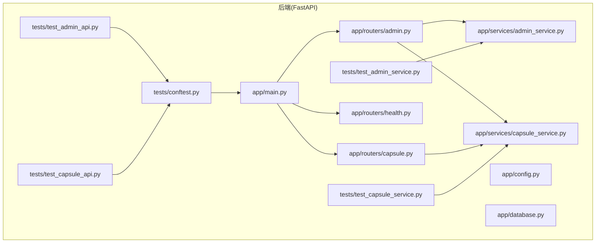
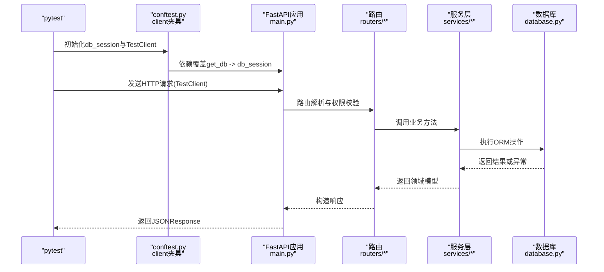
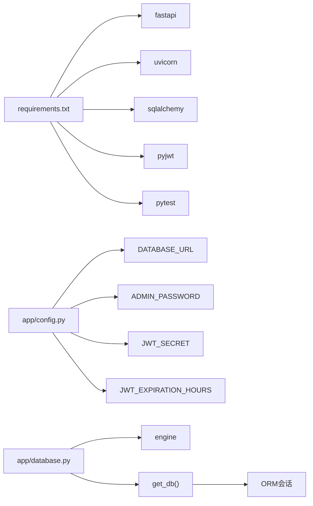

# 测试与部署

<cite>
**本文引用的文件**
- [backends/fastapi/tests/conftest.py](file://backends/fastapi/tests/conftest.py)
- [backends/fastapi/tests/test_admin_api.py](file://backends/fastapi/tests/test_admin_api.py)
- [backends/fastapi/tests/test_capsule_api.py](file://backends/fastapi/tests/test_capsule_api.py)
- [backends/fastapi/tests/test_admin_service.py](file://backends/fastapi/tests/test_admin_service.py)
- [backends/fastapi/tests/test_capsule_service.py](file://backends/fastapi/tests/test_capsule_service.py)
- [backends/fastapi/app/main.py](file://backends/fastapi/app/main.py)
- [backends/fastapi/app/database.py](file://backends/fastapi/app/database.py)
- [backends/fastapi/app/config.py](file://backends/fastapi/app/config.py)
- [backends/fastapi/app/routers/admin.py](file://backends/fastapi/app/routers/admin.py)
- [backends/fastapi/app/routers/capsule.py](file://backends/fastapi/app/routers/capsule.py)
- [backends/fastapi/app/routers/health.py](file://backends/fastapi/app/routers/health.py)
- [backends/fastapi/app/services/admin_service.py](file://backends/fastapi/app/services/admin_service.py)
- [backends/fastapi/app/services/capsule_service.py](file://backends/fastapi/app/services/capsule_service.py)
- [backends/fastapi/requirements.txt](file://backends/fastapi/requirements.txt)
- [scripts/test.sh](file://scripts/test.sh)
</cite>

## 目录
1. [简介](#简介)
2. [项目结构](#项目结构)
3. [核心组件](#核心组件)
4. [架构总览](#架构总览)
5. [详细组件分析](#详细组件分析)
6. [依赖分析](#依赖分析)
7. [性能考虑](#性能考虑)
8. [故障排查指南](#故障排查指南)
9. [结论](#结论)
10. [附录](#附录)

## 简介
本文件面向FastAPI后端的测试与部署，系统性梳理测试框架选择与配置、API与服务层测试编写模式、依赖注入与异常处理在测试中的应用、内存数据库与TestClient夹具设计、以及与之配套的脚本化测试执行流程。同时给出可扩展到CI/CD的实践建议，帮助团队建立稳定可靠的自动化测试与交付体系。

## 项目结构
后端FastAPI位于 backends/fastapi，测试位于 backends/fastapi/tests，核心应用入口、路由、服务、数据库与配置分别位于 app/ 下对应子模块。测试脚本位于 scripts/test.sh，用于统一触发多端测试（当前包含Spring Boot、Vue 3、Angular）。

图表来源
- [backends/fastapi/app/main.py:1-89](file://backends/fastapi/app/main.py#L1-L89)
- [backends/fastapi/app/routers/admin.py:1-55](file://backends/fastapi/app/routers/admin.py#L1-L55)
- [backends/fastapi/app/routers/capsule.py:1-31](file://backends/fastapi/app/routers/capsule.py#L1-L31)
- [backends/fastapi/app/routers/health.py:1-25](file://backends/fastapi/app/routers/health.py#L1-L25)
- [backends/fastapi/app/services/admin_service.py:1-42](file://backends/fastapi/app/services/admin_service.py#L1-L42)
- [backends/fastapi/app/services/capsule_service.py:1-144](file://backends/fastapi/app/services/capsule_service.py#L1-L144)
- [backends/fastapi/tests/conftest.py:1-47](file://backends/fastapi/tests/conftest.py#L1-L47)
- [backends/fastapi/tests/test_admin_api.py:1-77](file://backends/fastapi/tests/test_admin_api.py#L1-L77)
- [backends/fastapi/tests/test_capsule_api.py:1-69](file://backends/fastapi/tests/test_capsule_api.py#L1-L69)
- [backends/fastapi/tests/test_admin_service.py:1-30](file://backends/fastapi/tests/test_admin_service.py#L1-L30)
- [backends/fastapi/tests/test_capsule_service.py:1-89](file://backends/fastapi/tests/test_capsule_service.py#L1-L89)

章节来源
- [backends/fastapi/app/main.py:1-89](file://backends/fastapi/app/main.py#L1-L89)
- [backends/fastapi/tests/conftest.py:1-47](file://backends/fastapi/tests/conftest.py#L1-L47)
- [scripts/test.sh:1-34](file://scripts/test.sh#L1-L34)

## 核心组件
- 测试运行器与夹具
  - 使用pytest作为测试运行器，配合TestClient与内存数据库夹具，确保测试隔离与可重复性。
  - 夹具db_session创建内存SQLite，StaticPool保证连接复用；client夹具通过依赖覆盖get_db，使路由直接使用该会话。
- API层测试
  - 覆盖健康检查、创建胶囊、参数校验、未开启胶囊隐藏内容、管理员登录与鉴权、删除胶囊等场景。
  - 断言策略以HTTP状态码与响应体结构为主，结合错误码与消息字段进行精确验证。
- 服务层测试
  - 针对业务逻辑（创建、查询、删除、唯一编码生成、内容可见性控制）进行单元测试。
  - 使用db_session夹具注入真实会话，验证异常分支与边界条件。
- 异常与全局处理
  - 应用层集中定义异常处理器，统一返回ApiResponse结构，便于测试断言一致性。

章节来源
- [backends/fastapi/tests/conftest.py:16-47](file://backends/fastapi/tests/conftest.py#L16-L47)
- [backends/fastapi/tests/test_admin_api.py:1-77](file://backends/fastapi/tests/test_admin_api.py#L1-L77)
- [backends/fastapi/tests/test_capsule_api.py:1-69](file://backends/fastapi/tests/test_capsule_api.py#L1-L69)
- [backends/fastapi/tests/test_admin_service.py:1-30](file://backends/fastapi/tests/test_admin_service.py#L1-L30)
- [backends/fastapi/tests/test_capsule_service.py:1-89](file://backends/fastapi/tests/test_capsule_service.py#L1-L89)
- [backends/fastapi/app/main.py:37-89](file://backends/fastapi/app/main.py#L37-L89)

## 架构总览
下图展示测试夹具如何影响路由与服务层调用链，以及异常处理在请求生命周期中的位置。

图表来源
- [backends/fastapi/tests/conftest.py:34-47](file://backends/fastapi/tests/conftest.py#L34-L47)
- [backends/fastapi/app/main.py:19-35](file://backends/fastapi/app/main.py#L19-L35)
- [backends/fastapi/app/routers/admin.py:22-55](file://backends/fastapi/app/routers/admin.py#L22-L55)
- [backends/fastapi/app/routers/capsule.py:14-31](file://backends/fastapi/app/routers/capsule.py#L14-L31)
- [backends/fastapi/app/services/admin_service.py:18-42](file://backends/fastapi/app/services/admin_service.py#L18-L42)
- [backends/fastapi/app/services/capsule_service.py:79-144](file://backends/fastapi/app/services/capsule_service.py#L79-L144)
- [backends/fastapi/app/database.py:23-30](file://backends/fastapi/app/database.py#L23-L30)

## 详细组件分析

### 测试夹具与依赖注入（conftest.py）
- 内存数据库与会话
  - 使用SQLite内存数据库与StaticPool，避免跨测试干扰；测试结束后清理元数据，确保状态重置。
- TestClient与依赖覆盖
  - 通过app.dependency_overrides临时替换get_db，使路由层直接使用内存会话；测试结束恢复覆盖，避免污染其他测试。
- 设计要点
  - 夹具作用域为模块级，兼顾性能与隔离；关闭与清理在finally中保证鲁棒性。

章节来源
- [backends/fastapi/tests/conftest.py:16-47](file://backends/fastapi/tests/conftest.py#L16-L47)

### 管理员API测试（test_admin_api.py）
- 登录与鉴权
  - 正确密码返回200与token；错误密码返回401并携带错误码。
  - 无token访问受保护端点应返回4xx系列状态。
- 列表与删除
  - 成功登录后，携带Bearer Token访问管理员列表接口，断言分页字段存在且成功标志为真。
  - 创建胶囊后删除，再次查询应返回404，验证删除生效。

章节来源
- [backends/fastapi/tests/test_admin_api.py:13-77](file://backends/fastapi/tests/test_admin_api.py#L13-L77)
- [backends/fastapi/app/routers/admin.py:25-54](file://backends/fastapi/app/routers/admin.py#L25-L54)

### 胶囊API测试（test_capsule_api.py）
- 健康检查
  - 访问/health端点，断言200与success为真，data.status为UP。
- 创建胶囊
  - 正确请求返回201，断言返回8字符code、标题一致、消息为“胶囊创建成功”。
- 参数校验与缺失字段
  - 缺少必要字段返回400，断言错误码为VALIDATION_ERROR。
- 不存在与未开启胶囊
  - 查询不存在code返回404与CAPSULE_NOT_FOUND；未到开启时间content为null。

章节来源
- [backends/fastapi/tests/test_capsule_api.py:7-69](file://backends/fastapi/tests/test_capsule_api.py#L7-L69)
- [backends/fastapi/app/routers/health.py:14-24](file://backends/fastapi/app/routers/health.py#L14-L24)
- [backends/fastapi/app/routers/capsule.py:17-30](file://backends/fastapi/app/routers/capsule.py#L17-L30)

### 管理员服务测试（test_admin_service.py）
- 登录与验证
  - 正确密码返回非空字符串token；错误密码返回None。
  - 有效token经validate_token验证为True，无效token为False。

章节来源
- [backends/fastapi/tests/test_admin_service.py:7-29](file://backends/fastapi/tests/test_admin_service.py#L7-L29)
- [backends/fastapi/app/services/admin_service.py:18-42](file://backends/fastapi/app/services/admin_service.py#L18-L42)

### 胶囊服务测试（test_capsule_service.py）
- 创建胶囊
  - 断言返回code长度为8、标题一致、响应不包含content；open_at与created_at为ISO 8601字符串格式。
- 开启时间约束
  - openAt在过去的请求抛出ValueError，错误信息包含“开启时间必须在未来”。
- 可见性控制
  - 未开启胶囊查询时content为None；开启后content可见。
- 异常分支
  - 查询与删除不存在code时抛出自定义异常CapsuleNotFoundException。
- 删除流程
  - 删除后再次查询应抛出异常，验证删除生效。

章节来源
- [backends/fastapi/tests/test_capsule_service.py:17-89](file://backends/fastapi/tests/test_capsule_service.py#L17-L89)
- [backends/fastapi/app/services/capsule_service.py:79-144](file://backends/fastapi/app/services/capsule_service.py#L79-L144)

### 异常处理与统一响应（main.py）
- 全局异常映射
  - 将业务异常（如胶囊不存在、未授权）、参数校验错误、通用值错误与未知异常，统一包装为ApiResponse并返回相应HTTP状态码。
- 与测试的一致性
  - API测试可基于统一的success、errorCode与data结构断言，提升稳定性与可维护性。

章节来源
- [backends/fastapi/app/main.py:37-89](file://backends/fastapi/app/main.py#L37-L89)

### 路由与服务层交互（routers与services）
- 管理员路由
  - 登录无需认证；列表与删除需要管理员Token校验；依赖get_db获取会话。
- 胶囊路由
  - 创建胶囊返回201；查询胶囊根据开启时间决定是否返回content。
- 服务层职责
  - 管理员服务负责JWT生成与校验；胶囊服务负责唯一编码生成、可见性控制、分页查询与删除。

章节来源
- [backends/fastapi/app/routers/admin.py:22-55](file://backends/fastapi/app/routers/admin.py#L22-L55)
- [backends/fastapi/app/routers/capsule.py:14-31](file://backends/fastapi/app/routers/capsule.py#L14-L31)
- [backends/fastapi/app/services/admin_service.py:18-42](file://backends/fastapi/app/services/admin_service.py#L18-L42)
- [backends/fastapi/app/services/capsule_service.py:32-144](file://backends/fastapi/app/services/capsule_service.py#L32-L144)

## 依赖分析
- 测试依赖
  - pytest、httpx（TestClient底层）、sqlalchemy（ORM与引擎）、pyjwt（JWT测试）。
- 运行时依赖
  - fastapi、uvicorn、sqlalchemy、pyjwt。
- 配置来源
  - 数据库URL、管理员密码、JWT密钥与过期时长均来自环境变量，具备默认值。

图表来源
- [backends/fastapi/requirements.txt:1-7](file://backends/fastapi/requirements.txt#L1-L7)
- [backends/fastapi/app/config.py:8-17](file://backends/fastapi/app/config.py#L8-L17)
- [backends/fastapi/app/database.py:11-30](file://backends/fastapi/app/database.py#L11-L30)

章节来源
- [backends/fastapi/requirements.txt:1-7](file://backends/fastapi/requirements.txt#L1-L7)
- [backends/fastapi/app/config.py:8-17](file://backends/fastapi/app/config.py#L8-L17)
- [backends/fastapi/app/database.py:11-30](file://backends/fastapi/app/database.py#L11-L30)

## 性能考虑
- 测试性能
  - 内存数据库与StaticPool显著降低I/O开销；单测应避免不必要的外部依赖。
  - 对于高并发场景，可在本地使用uvicorn的多进程或多线程模式进行压力验证，但需注意测试隔离。
- 业务性能
  - 分页查询使用count与limit组合，避免一次性加载大量数据；对排序字段建立索引可进一步优化。
- 响应格式
  - 统一ApiResponse减少序列化成本，便于缓存与压缩。

## 故障排查指南
- 常见问题定位
  - 登录失败：确认ADMIN_PASSWORD与JWT_SECRET配置；核对请求体字段与Content-Type。
  - 401/403：检查Authorization头格式与Token有效期；确认verify_admin_token中间件是否生效。
  - 404：确认code是否正确生成与大小写；检查数据库中是否存在记录。
  - 400/422：查看全局异常处理器返回的errorCode与message，定位参数校验失败字段。
- 调试建议
  - 在conftest中保留db_session的回滚或重置逻辑，确保每次测试前状态一致。
  - 对关键服务方法增加日志或断点，观察输入参数与返回值。

章节来源
- [backends/fastapi/app/main.py:58-89](file://backends/fastapi/app/main.py#L58-L89)
- [backends/fastapi/tests/conftest.py:16-31](file://backends/fastapi/tests/conftest.py#L16-L31)

## 结论
本项目采用pytest + TestClient + 内存数据库的测试策略，结合统一异常处理与依赖注入，实现了API与服务层的全面覆盖。通过夹具与路由依赖覆盖，测试既高效又可靠。建议在此基础上引入CI/CD流水线，自动执行测试与质量检查，并逐步扩展性能与安全测试。

## 附录

### API测试编写模式与断言策略
- 模式
  - 准备阶段：构造请求体与时间戳；必要时先创建前置资源。
  - 执行阶段：使用TestClient发送HTTP请求。
  - 断言阶段：优先断言状态码，再断言success、errorCode与data结构。
- 示例路径
  - [管理员登录与鉴权:13-29](file://backends/fastapi/tests/test_admin_api.py#L13-L29)
  - [创建胶囊与字段断言:16-31](file://backends/fastapi/tests/test_capsule_api.py#L16-L31)
  - [参数校验与缺失字段:33-42](file://backends/fastapi/tests/test_capsule_api.py#L33-L42)

### 服务层测试与依赖注入
- 单元测试
  - 使用db_session夹具注入真实会话，验证业务规则与异常分支。
- 异步函数
  - 当前服务层为同步函数；若引入异步IO，可在测试中使用pytest-asyncio并调整夹具与路由依赖。
- 示例路径
  - [创建与可见性控制:17-62](file://backends/fastapi/tests/test_capsule_service.py#L17-L62)
  - [删除与异常分支:70-89](file://backends/fastapi/tests/test_capsule_service.py#L70-L89)

### Docker容器化与部署（建议）
- Dockerfile建议
  - 基于官方Python镜像，安装依赖并复制应用代码；暴露端口；设置启动命令为uvicorn。
- 镜像构建
  - 使用多阶段构建优化镜像体积；生产镜像禁用调试与开发依赖。
- 容器编排
  - 使用docker-compose编排应用与数据库；持久化SQLite至卷或切换为PostgreSQL。
- 部署要点
  - 设置环境变量（DATABASE_URL、ADMIN_PASSWORD、JWT_SECRET、JWT_EXPIRATION_HOURS）；启用健康检查与重启策略。

### CI/CD流水线（建议）
- 自动化测试
  - 触发器：push到主分支与PR；步骤：安装依赖、运行pytest、覆盖率统计。
- 代码质量
  - 添加lint（如ruff/flake8）与格式化检查（如black/isort）。
- 持续部署
  - 构建Docker镜像并推送到镜像仓库；在目标环境拉起容器；执行数据库迁移（如适用）。

### 性能测试与监控告警（建议）
- 性能测试
  - 使用Locust或wrk对关键端点（创建、查询、列表）施压，记录P95/P99延迟与吞吐。
- 负载测试
  - 逐步提升并发与数据规模，观察数据库锁、连接池与异常率变化。
- 监控告警
  - 指标：请求量、错误率、延迟、连接数、CPU/内存；告警：阈值触发与趋势异常。
  - 工具：Prometheus + Grafana或云厂商监控平台。