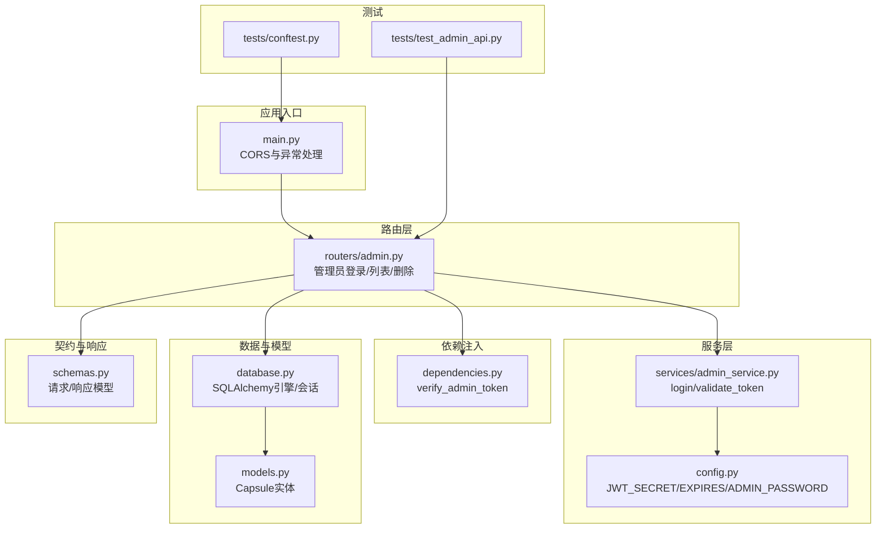
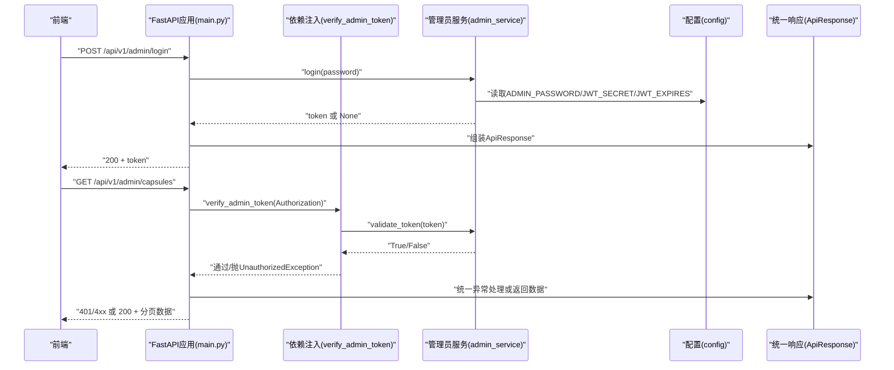
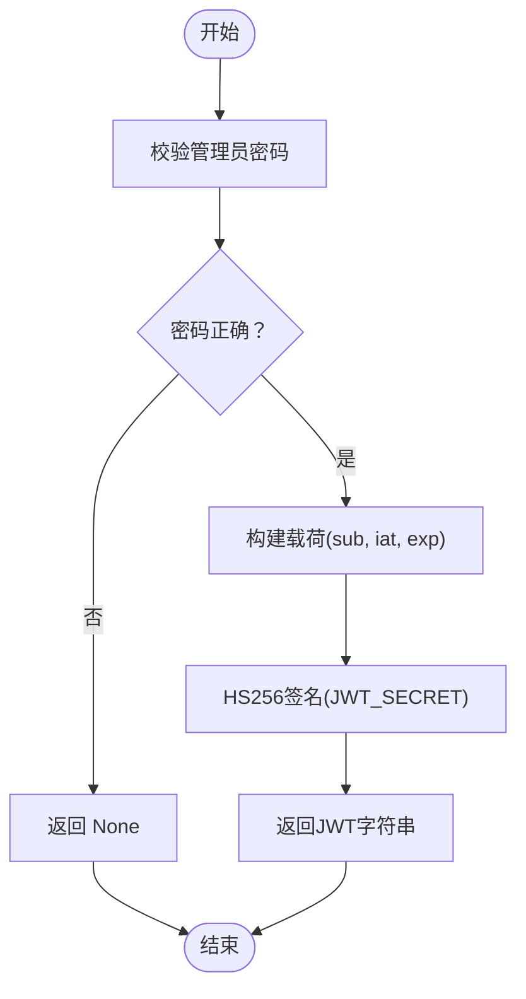
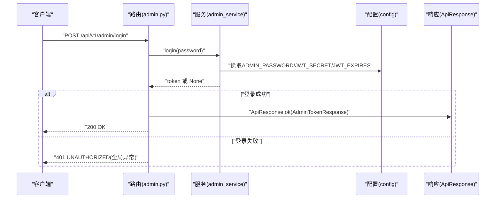
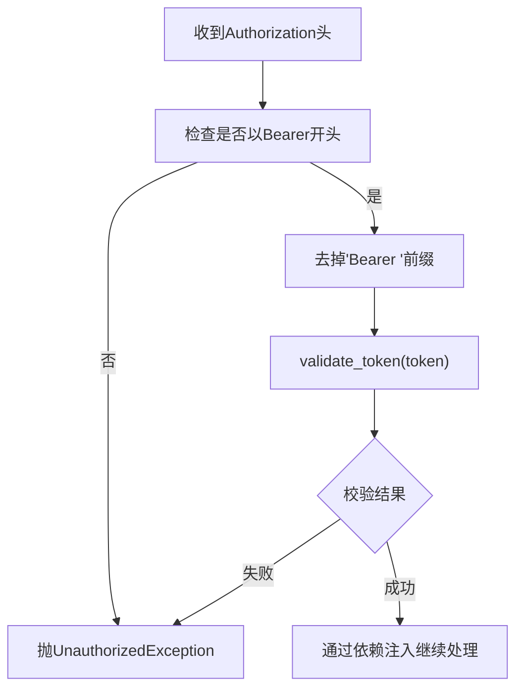
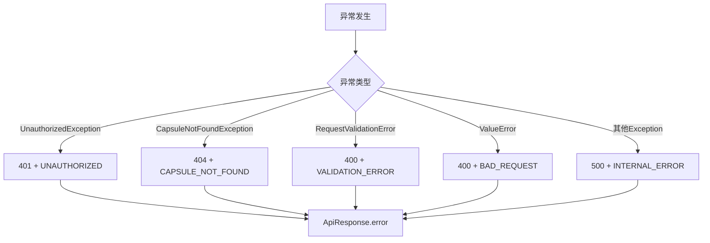
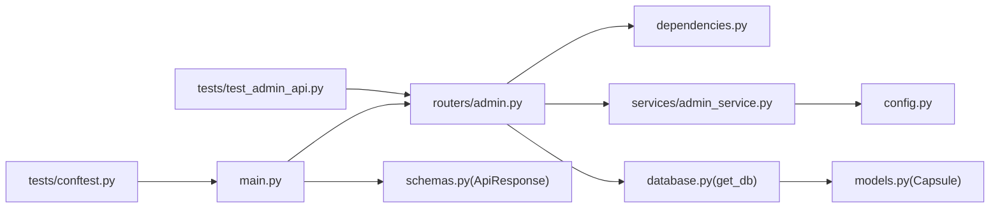

# 认证与安全机制

<cite>
**本文引用的文件**
- [backends/fastapi/app/main.py](file://backends/fastapi/app/main.py)
- [backends/fastapi/app/dependencies.py](file://backends/fastapi/app/dependencies.py)
- [backends/fastapi/app/routers/admin.py](file://backends/fastapi/app/routers/admin.py)
- [backends/fastapi/app/services/admin_service.py](file://backends/fastapi/app/services/admin_service.py)
- [backends/fastapi/app/config.py](file://backends/fastapi/app/config.py)
- [backends/fastapi/app/schemas.py](file://backends/fastapi/app/schemas.py)
- [backends/fastapi/app/database.py](file://backends/fastapi/app/database.py)
- [backends/fastapi/tests/test_admin_api.py](file://backends/fastapi/tests/test_admin_api.py)
- [backends/fastapi/tests/conftest.py](file://backends/fastapi/tests/conftest.py)
- [backends/fastapi/requirements.txt](file://backends/fastapi/requirements.txt)
</cite>

## 目录
1. [简介](#简介)
2. [项目结构](#项目结构)
3. [核心组件](#核心组件)
4. [架构总览](#架构总览)
5. [详细组件分析](#详细组件分析)
6. [依赖关系分析](#依赖关系分析)
7. [性能考虑](#性能考虑)
8. [故障排查指南](#故障排查指南)
9. [结论](#结论)
10. [附录](#附录)

## 简介
本文件聚焦于后端FastAPI实现的认证与安全机制，覆盖JWT认证的完整闭环：密码验证、token签发、token校验、依赖注入中的认证拦截、全局异常处理策略、CORS跨域配置与安全头建议、以及安全最佳实践与测试指南。读者可据此理解管理员登录流程、权限控制、错误处理与安全加固要点。

## 项目结构
FastAPI后端采用分层组织：入口应用负责CORS与全局异常处理；路由模块定义受保护与公开接口；依赖注入模块提供认证中间件；服务层封装JWT生成与校验、业务逻辑；配置模块集中管理敏感参数；数据模型与数据库会话通过SQLAlchemy管理；测试用例覆盖登录、鉴权与删除等关键场景。

图表来源
- [backends/fastapi/app/main.py:19-29](file://backends/fastapi/app/main.py#L19-L29)
- [backends/fastapi/app/routers/admin.py:22-54](file://backends/fastapi/app/routers/admin.py#L22-L54)
- [backends/fastapi/app/dependencies.py:10-22](file://backends/fastapi/app/dependencies.py#L10-L22)
- [backends/fastapi/app/services/admin_service.py:18-41](file://backends/fastapi/app/services/admin_service.py#L18-L41)
- [backends/fastapi/app/config.py:11-17](file://backends/fastapi/app/config.py#L11-L17)
- [backends/fastapi/app/database.py:11-29](file://backends/fastapi/app/database.py#L11-L29)
- [backends/fastapi/app/models.py:14-25](file://backends/fastapi/app/models.py#L14-L25)
- [backends/fastapi/app/schemas.py:47-95](file://backends/fastapi/app/schemas.py#L47-L95)
- [backends/fastapi/tests/test_admin_api.py:7-76](file://backends/fastapi/tests/test_admin_api.py#L7-L76)
- [backends/fastapi/tests/conftest.py:16-46](file://backends/fastapi/tests/conftest.py#L16-L46)

章节来源
- [backends/fastapi/app/main.py:19-89](file://backends/fastapi/app/main.py#L19-L89)
- [backends/fastapi/app/routers/admin.py:22-54](file://backends/fastapi/app/routers/admin.py#L22-L54)
- [backends/fastapi/app/dependencies.py:10-22](file://backends/fastapi/app/dependencies.py#L10-L22)
- [backends/fastapi/app/services/admin_service.py:18-41](file://backends/fastapi/app/services/admin_service.py#L18-L41)
- [backends/fastapi/app/config.py:11-17](file://backends/fastapi/app/config.py#L11-L17)
- [backends/fastapi/app/database.py:11-29](file://backends/fastapi/app/database.py#L11-L29)
- [backends/fastapi/app/models.py:14-25](file://backends/fastapi/app/models.py#L14-L25)
- [backends/fastapi/app/schemas.py:47-95](file://backends/fastapi/app/schemas.py#L47-L95)
- [backends/fastapi/tests/test_admin_api.py:7-76](file://backends/fastapi/tests/test_admin_api.py#L7-L76)
- [backends/fastapi/tests/conftest.py:16-46](file://backends/fastapi/tests/conftest.py#L16-L46)

## 核心组件
- 应用入口与CORS/异常处理：在应用启动时创建数据库表，配置CORS允许本地开发源，注册健康检查、胶囊与管理员路由；定义统一的异常处理，将业务异常映射为标准响应格式。
- 管理员认证服务：实现基于对称密钥HS256的JWT签发与解码校验；提供登录密码校验与token有效期管理。
- 依赖注入与认证中间件：从HTTP头提取Authorization Bearer token，调用服务进行校验，未通过则抛出自定义认证异常交由全局处理器统一处理。
- 路由与权限控制：管理员登录接口无需认证；胶囊列表与删除接口通过依赖注入强制要求有效token。
- 统一响应模型：所有接口返回统一的ApiResponse结构，便于前端处理与异常展示。
- 测试与配置：测试覆盖登录、鉴权缺失、带token访问与删除流程；配置项集中管理数据库URL、管理员密码、JWT密钥与过期时长。

章节来源
- [backends/fastapi/app/main.py:19-89](file://backends/fastapi/app/main.py#L19-L89)
- [backends/fastapi/app/services/admin_service.py:18-41](file://backends/fastapi/app/services/admin_service.py#L18-L41)
- [backends/fastapi/app/dependencies.py:10-22](file://backends/fastapi/app/dependencies.py#L10-L22)
- [backends/fastapi/app/routers/admin.py:25-54](file://backends/fastapi/app/routers/admin.py#L25-L54)
- [backends/fastapi/app/schemas.py:81-95](file://backends/fastapi/app/schemas.py#L81-L95)
- [backends/fastapi/app/config.py:11-17](file://backends/fastapi/app/config.py#L11-L17)
- [backends/fastapi/tests/test_admin_api.py:13-76](file://backends/fastapi/tests/test_admin_api.py#L13-L76)

## 架构总览
下图展示了管理员登录与受保护接口调用的端到端流程，包括CORS、认证依赖、服务层JWT处理与异常统一返回。

图表来源
- [backends/fastapi/app/routers/admin.py:25-54](file://backends/fastapi/app/routers/admin.py#L25-L54)
- [backends/fastapi/app/dependencies.py:10-22](file://backends/fastapi/app/dependencies.py#L10-L22)
- [backends/fastapi/app/services/admin_service.py:18-41](file://backends/fastapi/app/services/admin_service.py#L18-L41)
- [backends/fastapi/app/config.py:11-17](file://backends/fastapi/app/config.py#L11-L17)
- [backends/fastapi/app/main.py:37-89](file://backends/fastapi/app/main.py#L37-L89)
- [backends/fastapi/app/schemas.py:81-95](file://backends/fastapi/app/schemas.py#L81-L95)

## 详细组件分析

### JWT认证系统实现
- 签名算法与密钥：使用HS256对称密钥签名，密钥来自配置项，确保服务端与客户端共享。
- 载荷设计：包含sub（主体）、iat（签发时间）、exp（过期时间），过期时长由配置项控制。
- 签发流程：登录时比对管理员密码，正确则构造载荷并编码为JWT字符串。
- 校验流程：依赖注入中从Authorization头提取Bearer token，调用解码函数验证签名与有效期，失败则抛出认证异常。

图表来源
- [backends/fastapi/app/services/admin_service.py:18-32](file://backends/fastapi/app/services/admin_service.py#L18-L32)
- [backends/fastapi/app/config.py:11-17](file://backends/fastapi/app/config.py#L11-L17)

章节来源
- [backends/fastapi/app/services/admin_service.py:18-41](file://backends/fastapi/app/services/admin_service.py#L18-L41)
- [backends/fastapi/app/config.py:11-17](file://backends/fastapi/app/config.py#L11-L17)

### 管理员登录流程
- 接口定义：POST /api/v1/admin/login，无需认证。
- 处理逻辑：调用管理员服务执行密码校验与token签发；若失败抛出认证异常，由全局异常处理器返回统一错误响应。
- 响应格式：使用统一ApiResponse包装，包含token字段。

图表来源
- [backends/fastapi/app/routers/admin.py:25-30](file://backends/fastapi/app/routers/admin.py#L25-L30)
- [backends/fastapi/app/services/admin_service.py:18-32](file://backends/fastapi/app/services/admin_service.py#L18-L32)
- [backends/fastapi/app/main.py:49-55](file://backends/fastapi/app/main.py#L49-L55)
- [backends/fastapi/app/schemas.py:67-68](file://backends/fastapi/app/schemas.py#L67-L68)

章节来源
- [backends/fastapi/app/routers/admin.py:25-30](file://backends/fastapi/app/routers/admin.py#L25-L30)
- [backends/fastapi/app/services/admin_service.py:18-32](file://backends/fastapi/app/services/admin_service.py#L18-L32)
- [backends/fastapi/app/main.py:49-55](file://backends/fastapi/app/main.py#L49-L55)
- [backends/fastapi/app/schemas.py:67-68](file://backends/fastapi/app/schemas.py#L67-L68)

### 依赖注入中的认证依赖
- 依赖函数：verify_admin_token从Authorization头提取Bearer token。
- 校验逻辑：判断前缀、去除前缀后调用validate_token；失败抛出UnauthorizedException。
- 应用方式：在受保护路由上通过dependencies=[Depends(verify_admin_token)]启用。

图表来源
- [backends/fastapi/app/dependencies.py:10-22](file://backends/fastapi/app/dependencies.py#L10-L22)
- [backends/fastapi/app/services/admin_service.py:35-41](file://backends/fastapi/app/services/admin_service.py#L35-L41)

章节来源
- [backends/fastapi/app/dependencies.py:10-22](file://backends/fastapi/app/dependencies.py#L10-L22)
- [backends/fastapi/app/services/admin_service.py:35-41](file://backends/fastapi/app/services/admin_service.py#L35-L41)

### 全局异常处理策略
- 业务异常：CapsuleNotFoundException、UnauthorizedException分别映射为404与401，统一返回ApiResponse.error。
- 参数校验：RequestValidationError聚合错误位置与消息，返回400与VALIDATION_ERROR。
- 值错误：ValueError映射为400与BAD_REQUEST。
- 通用异常：Exception映射为500与INTERNAL_ERROR。

图表来源
- [backends/fastapi/app/main.py:40-88](file://backends/fastapi/app/main.py#L40-L88)

章节来源
- [backends/fastapi/app/main.py:40-88](file://backends/fastapi/app/main.py#L40-L88)

### CORS跨域配置与安全头建议
- CORS配置：允许本地开发域名正则匹配、允许常见方法与所有请求头、允许凭据、缓存时长1小时。
- 安全头建议：生产环境建议增加Content-Security-Policy、Strict-Transport-Security、X-Content-Type-Options、X-Frame-Options、Referrer-Policy等，结合反向代理或ASGI中间件统一添加。

章节来源
- [backends/fastapi/app/main.py:21-29](file://backends/fastapi/app/main.py#L21-L29)

### 统一响应模型与数据契约
- ApiResponse：统一success、data、message、errorCode字段，提供ok与error静态方法。
- AdminTokenResponse：登录成功返回token字段。
- PageResponse与CapsuleResponse：分页与胶囊实体的camelCase序列化模型。

章节来源
- [backends/fastapi/app/schemas.py:81-95](file://backends/fastapi/app/schemas.py#L81-L95)
- [backends/fastapi/app/schemas.py:67-79](file://backends/fastapi/app/schemas.py#L67-L79)

### 数据库与会话管理
- SQLAlchemy引擎与会话工厂：根据配置的DATABASE_URL创建连接，SQLite额外设置线程检查参数。
- 依赖注入：get_db提供FastAPI依赖，确保每个请求获取独立会话并在结束后关闭。

章节来源
- [backends/fastapi/app/database.py:11-29](file://backends/fastapi/app/database.py#L11-L29)

## 依赖关系分析
- 组件耦合：路由依赖依赖注入与服务层；服务层依赖配置；异常处理与响应模型被各层复用。
- 外部依赖：FastAPI、SQLAlchemy、PyJWT、HTTPX、pytest等。
- 循环依赖：当前结构未见循环导入，职责清晰。

图表来源
- [backends/fastapi/app/routers/admin.py:22-54](file://backends/fastapi/app/routers/admin.py#L22-L54)
- [backends/fastapi/app/dependencies.py:10-22](file://backends/fastapi/app/dependencies.py#L10-L22)
- [backends/fastapi/app/services/admin_service.py:18-41](file://backends/fastapi/app/services/admin_service.py#L18-L41)
- [backends/fastapi/app/config.py:11-17](file://backends/fastapi/app/config.py#L11-L17)
- [backends/fastapi/app/main.py:19-89](file://backends/fastapi/app/main.py#L19-L89)
- [backends/fastapi/app/schemas.py:81-95](file://backends/fastapi/app/schemas.py#L81-L95)
- [backends/fastapi/app/database.py:11-29](file://backends/fastapi/app/database.py#L11-L29)
- [backends/fastapi/app/models.py:14-25](file://backends/fastapi/app/models.py#L14-L25)
- [backends/fastapi/tests/test_admin_api.py:7-76](file://backends/fastapi/tests/test_admin_api.py#L7-L76)
- [backends/fastapi/tests/conftest.py:16-46](file://backends/fastapi/tests/conftest.py#L16-L46)

章节来源
- [backends/fastapi/app/routers/admin.py:22-54](file://backends/fastapi/app/routers/admin.py#L22-L54)
- [backends/fastapi/app/dependencies.py:10-22](file://backends/fastapi/app/dependencies.py#L10-L22)
- [backends/fastapi/app/services/admin_service.py:18-41](file://backends/fastapi/app/services/admin_service.py#L18-L41)
- [backends/fastapi/app/config.py:11-17](file://backends/fastapi/app/config.py#L11-L17)
- [backends/fastapi/app/main.py:19-89](file://backends/fastapi/app/main.py#L19-L89)
- [backends/fastapi/app/schemas.py:81-95](file://backends/fastapi/app/schemas.py#L81-L95)
- [backends/fastapi/app/database.py:11-29](file://backends/fastapi/app/database.py#L11-L29)
- [backends/fastapi/app/models.py:14-25](file://backends/fastapi/app/models.py#L14-L25)
- [backends/fastapi/tests/test_admin_api.py:7-76](file://backends/fastapi/tests/test_admin_api.py#L7-L76)
- [backends/fastapi/tests/conftest.py:16-46](file://backends/fastapi/tests/conftest.py#L16-L46)

## 性能考虑
- JWT解码开销：HS256为轻量算法，单次解码成本低；建议避免在高频路径重复解码，可通过中间件缓存短期有效的用户信息。
- 数据库连接：SQLite在开发环境足够；生产建议使用PostgreSQL/MySQL，配合连接池与只读副本。
- 异常处理：异常分支尽量短路，减少不必要的日志与序列化开销。
- CORS预检：合理设置allow_methods与allow_headers，避免过多OPTIONS请求。

## 故障排查指南
- 登录失败返回401：确认ADMIN_PASSWORD与请求体一致；检查JWT_SECRET一致性；核对客户端是否正确携带Authorization头。
- 无token访问受保护接口：返回400/401/422，检查依赖注入是否生效；确认路由dependencies配置。
- 删除接口返回404：确认胶囊code存在且大小写正确；检查数据库连接与数据一致性。
- 全局异常未按预期：检查异常处理器注册顺序与异常类型匹配；确认自定义异常类未被覆盖。

章节来源
- [backends/fastapi/app/main.py:40-88](file://backends/fastapi/app/main.py#L40-L88)
- [backends/fastapi/tests/test_admin_api.py:13-76](file://backends/fastapi/tests/test_admin_api.py#L13-L76)

## 结论
该FastAPI实现以简洁的HS256 JWT为核心，结合依赖注入与全局异常处理，提供了清晰的管理员认证与权限控制路径。通过统一响应模型与完善的测试用例，系统具备良好的可维护性与可扩展性。建议在生产环境中补充安全头、HTTPS、速率限制与审计日志等加固措施。

## 附录

### 安全最佳实践清单
- 密码与密钥
  - 使用强随机密钥作为JWT_SECRET，定期轮换。
  - 管理员密码仅用于初始登录，后续建议接入更安全的身份提供商。
- Token存储与传输
  - 前端避免localStorage持久化高危token；优先HttpOnly Cookie（需配合反向代理）。
  - 严格HTTPS传输，禁用混合内容。
- 防重放与风控
  - 引入nonce与时间戳窗口；对登录与敏感操作增加二次校验。
  - 实施速率限制与IP白名单策略。
- 运维与监控
  - 启用访问日志与审计事件；对异常与4xx/5xx进行告警。
  - 定期扫描依赖漏洞，升级至安全版本。

### 安全测试与漏洞扫描指南
- 自动化测试
  - 使用pytest与TestClient覆盖登录、鉴权缺失、非法token、越权访问等场景。
  - 在conftest中使用内存数据库隔离测试状态。
- 手工渗透测试
  - 尝试篡改Authorization头、修改token载荷、暴力破解密码。
  - 检查CORS配置是否过度宽松，验证预检请求行为。
- 依赖安全扫描
  - 使用pip-audit或类似工具扫描requirements.txt中的已知漏洞。
  - 关注PyJWT、SQLAlchemy、FastAPI等上游更新。

章节来源
- [backends/fastapi/tests/test_admin_api.py:13-76](file://backends/fastapi/tests/test_admin_api.py#L13-L76)
- [backends/fastapi/tests/conftest.py:16-46](file://backends/fastapi/tests/conftest.py#L16-L46)
- [backends/fastapi/requirements.txt:1-7](file://backends/fastapi/requirements.txt#L1-L7)