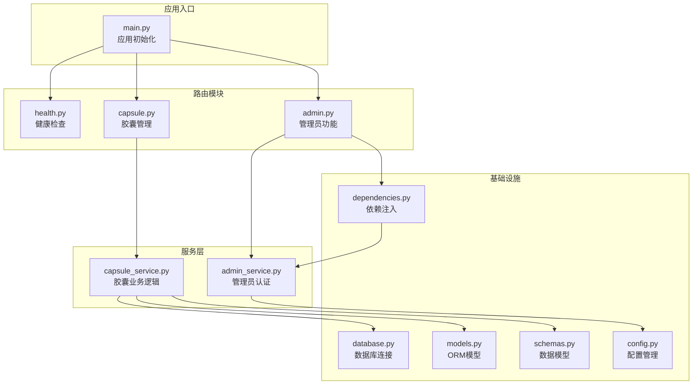
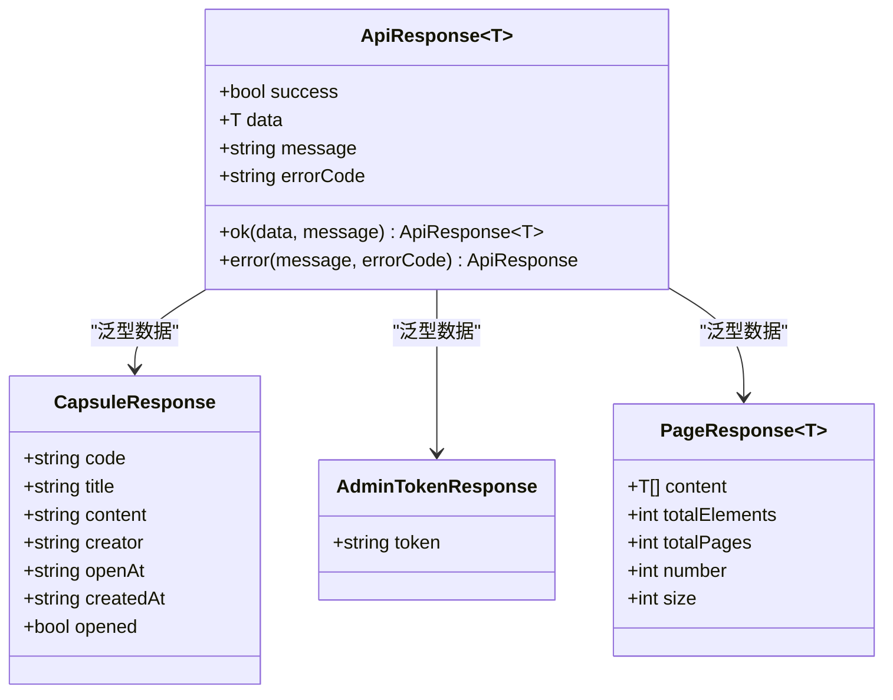
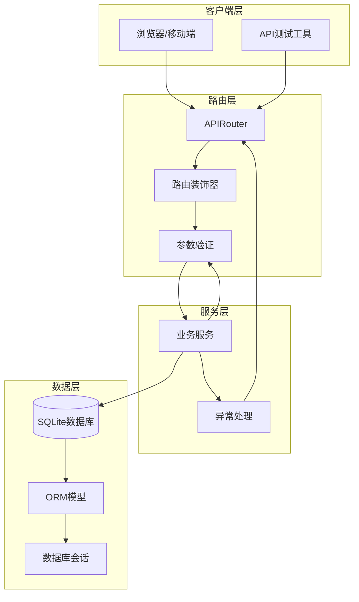
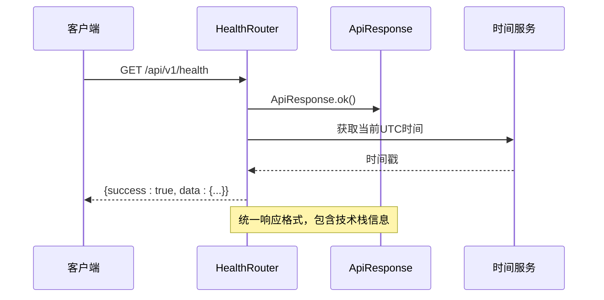
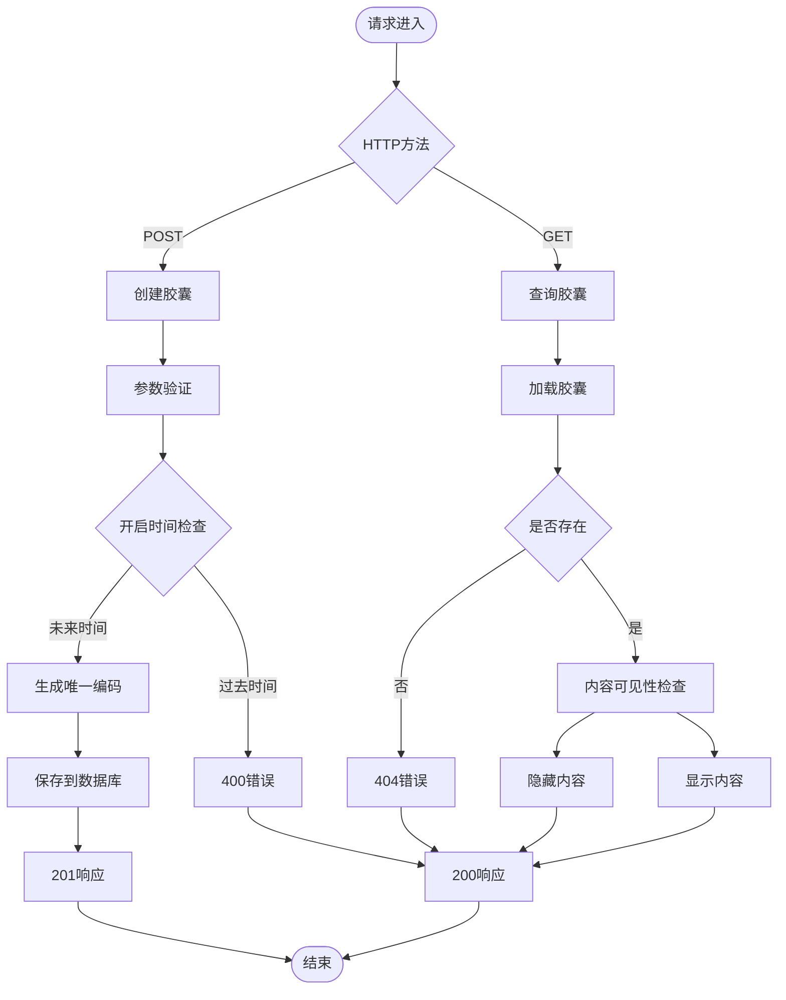
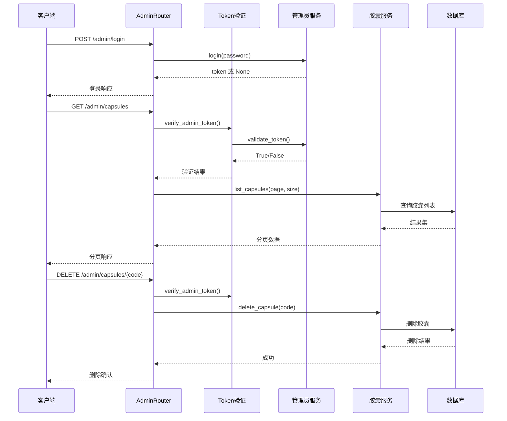
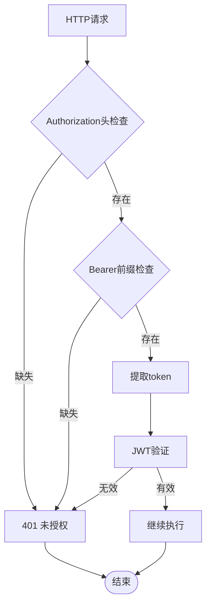
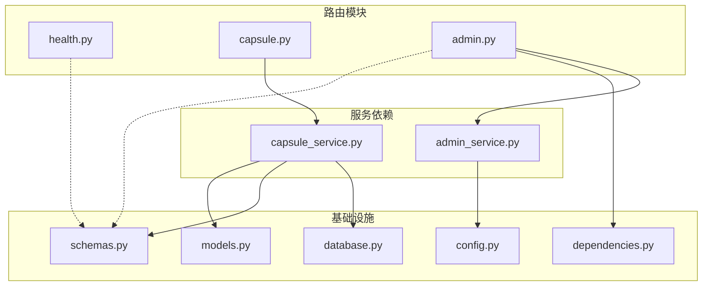
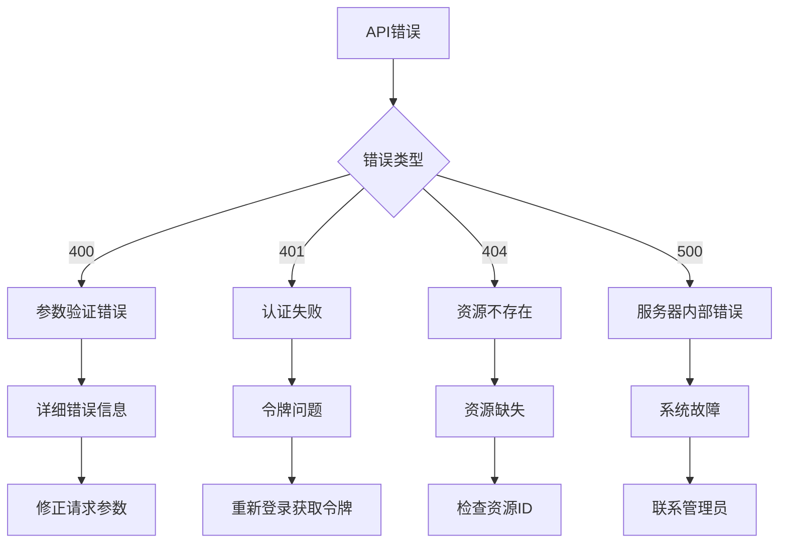

# 路由系统设计

<cite>
**本文档引用的文件**
- [health.py](file://backends/fastapi/app/routers/health.py)
- [capsule.py](file://backends/fastapi/app/routers/capsule.py)
- [admin.py](file://backends/fastapi/app/routers/admin.py)
- [main.py](file://backends/fastapi/app/main.py)
- [dependencies.py](file://backends/fastapi/app/dependencies.py)
- [schemas.py](file://backends/fastapi/app/schemas.py)
- [capsule_service.py](file://backends/fastapi/app/services/capsule_service.py)
- [admin_service.py](file://backends/fastapi/app/services/admin_service.py)
- [database.py](file://backends/fastapi/app/database.py)
- [models.py](file://backends/fastapi/app/models.py)
- [config.py](file://backends/fastapi/app/config.py)
- [test_capsule_api.py](file://backends/fastapi/tests/test_capsule_api.py)
- [test_admin_api.py](file://backends/fastapi/tests/test_admin_api.py)
</cite>

## 目录
1. [简介](#简介)
2. [项目结构](#项目结构)
3. [核心组件](#核心组件)
4. [架构概览](#架构概览)
5. [详细组件分析](#详细组件分析)
6. [依赖关系分析](#依赖关系分析)
7. [性能考虑](#性能考虑)
8. [故障排除指南](#故障排除指南)
9. [结论](#结论)

## 简介

本项目采用FastAPI构建RESTful API服务，实现了完整的时间胶囊管理系统。路由系统采用模块化设计，通过独立的路由文件组织不同功能域的API端点，包括健康检查、胶囊管理和管理员功能。系统采用现代化的开发实践，包括类型安全的Pydantic模型、依赖注入、中间件处理和统一的响应格式。

## 项目结构

后端FastAPI项目的路由系统采用清晰的分层架构：

**图表来源**
- [main.py:19-34](file://backends/fastapi/app/main.py#L19-L34)
- [health.py:11](file://backends/fastapi/app/routers/health.py#L11)
- [capsule.py:14](file://backends/fastapi/app/routers/capsule.py#L14)
- [admin.py:22](file://backends/fastapi/app/routers/admin.py#L22)

**章节来源**
- [main.py:19-34](file://backends/fastapi/app/main.py#L19-L34)
- [health.py:11](file://backends/fastapi/app/routers/health.py#L11)
- [capsule.py:14](file://backends/fastapi/app/routers/capsule.py#L14)
- [admin.py:22](file://backends/fastapi/app/routers/admin.py#L22)

## 核心组件

### 路由装饰器系统

FastAPI路由系统采用装饰器模式，每个路由函数都使用相应的装饰器声明HTTP方法和路径：

- `@router.get()` - 处理HTTP GET请求
- `@router.post()` - 处理HTTP POST请求  
- `@router.delete()` - 处理HTTP DELETE请求

装饰器参数配置：
- `prefix` - 路由前缀，如"/api/v1/capsules"
- `tags` - API标签，用于OpenAPI文档分类
- `response_model` - 响应数据模型验证
- `dependencies` - 依赖注入配置

### 统一响应格式

所有API响应都遵循统一的`ApiResponse<T>`格式：

**图表来源**
- [schemas.py:81-96](file://backends/fastapi/app/schemas.py#L81-L96)
- [schemas.py:54-65](file://backends/fastapi/app/schemas.py#L54-L65)
- [schemas.py:67-79](file://backends/fastapi/app/schemas.py#L67-L79)

**章节来源**
- [schemas.py:81-96](file://backends/fastapi/app/schemas.py#L81-L96)
- [schemas.py:54-65](file://backends/fastapi/app/schemas.py#L54-L65)
- [schemas.py:67-79](file://backends/fastapi/app/schemas.py#L67-L79)

## 架构概览

系统采用经典的三层架构模式，路由层负责HTTP请求处理，服务层封装业务逻辑，数据访问层处理数据库操作：

**图表来源**
- [main.py:19-34](file://backends/fastapi/app/main.py#L19-L34)
- [capsule_service.py:79-103](file://backends/fastapi/app/services/capsule_service.py#L79-L103)
- [admin_service.py:18-32](file://backends/fastapi/app/services/admin_service.py#L18-L32)

## 详细组件分析

### 健康检查路由 (health.py)

健康检查路由提供系统状态监控接口，采用最简化的实现模式：

**图表来源**
- [health.py:14-25](file://backends/fastapi/app/routers/health.py#L14-L25)
- [schemas.py:89-91](file://backends/fastapi/app/schemas.py#L89-L91)

主要特性：
- 单一GET端点，返回系统运行状态
- 包含技术栈信息（FastAPI版本、Python版本、数据库类型）
- 使用统一的响应格式确保前后端一致性

**章节来源**
- [health.py:14-25](file://backends/fastapi/app/routers/health.py#L14-L25)

### 胶囊管理路由 (capsule.py)

胶囊管理路由实现完整的CRUD操作，包含创建、查询、分页等功能：

**图表来源**
- [capsule.py:17-31](file://backends/fastapi/app/routers/capsule.py#L17-L31)
- [capsule_service.py:79-111](file://backends/fastapi/app/services/capsule_service.py#L79-L111)

#### HTTP方法定义

| 方法 | 路径 | 功能 | 参数 | 响应 |
|------|------|------|------|------|
| POST | `/api/v1/capsules` | 创建胶囊 | `CreateCapsuleRequest` | `CapsuleResponse` |
| GET | `/api/v1/capsules/{code}` | 查询胶囊 | `code: str` | `CapsuleResponse` |

#### 参数处理机制

**路径参数处理**：
- `{code}` 路径参数自动绑定到函数参数
- 类型转换：字符串参数自动作为路径参数处理

**查询参数解析**：
- `page: int = Query(default=0, ge=0)` - 分页起始页，最小值0
- `size: int = Query(default=20, ge=1, le=100)` - 分页大小，范围1-100

**请求体验证**：
- 使用Pydantic模型进行参数验证
- 自动类型转换和格式检查
- 详细的错误消息生成

**章节来源**
- [capsule.py:17-31](file://backends/fastapi/app/routers/capsule.py#L17-L31)
- [schemas.py:26-45](file://backends/fastapi/app/schemas.py#L26-L45)

### 管理员路由 (admin.py)

管理员路由实现认证驱动的管理功能，包含登录、列表查询和删除操作：

**图表来源**
- [admin.py:25-55](file://backends/fastapi/app/routers/admin.py#L25-L55)
- [dependencies.py:10-23](file://backends/fastapi/app/dependencies.py#L10-L23)

#### 认证中间件

管理员路由使用自定义依赖注入进行认证：

**图表来源**
- [dependencies.py:10-23](file://backends/fastapi/app/dependencies.py#L10-L23)

**章节来源**
- [admin.py:25-55](file://backends/fastapi/app/routers/admin.py#L25-L55)
- [dependencies.py:10-23](file://backends/fastapi/app/dependencies.py#L10-L23)

## 依赖关系分析

### 路由间依赖关系

**图表来源**
- [capsule.py:10-12](file://backends/fastapi/app/routers/capsule.py#L10-L12)
- [admin.py:10-19](file://backends/fastapi/app/routers/admin.py#L10-L19)
- [dependencies.py:7](file://backends/fastapi/app/dependencies.py#L7)

### 数据传递机制

系统采用依赖注入模式实现模块间解耦：

1. **数据库连接注入**：通过`Depends(get_db)`提供数据库会话
2. **认证令牌验证**：通过`verify_admin_token`依赖注入进行权限控制
3. **服务层调用**：路由层只负责参数处理，业务逻辑委托给服务层

**章节来源**
- [capsule.py:10-12](file://backends/fastapi/app/routers/capsule.py#L10-L12)
- [admin.py:10-19](file://backends/fastapi/app/routers/admin.py#L10-L19)
- [dependencies.py:10-23](file://backends/fastapi/app/dependencies.py#L10-L23)

## 性能考虑

### 数据库优化策略

1. **索引优化**：胶囊码使用唯一索引，提高查询性能
2. **分页查询**：管理员列表查询使用LIMIT/OFFSET模式
3. **连接池**：使用SQLAlchemy连接池减少连接开销

### 缓存策略

当前实现未包含缓存层，建议在以下场景考虑缓存：
- 热门胶囊的查询结果
- 管理员会话信息
- 配置数据

### 并发处理

- 使用异步数据库连接池
- 合理设置数据库连接超时
- 避免长事务阻塞

## 故障排除指南

### 常见错误类型

**图表来源**
- [main.py:40-89](file://backends/fastapi/app/main.py#L40-L89)

### 错误处理流程

系统实现了多层次的异常处理：

1. **业务异常**：`CapsuleNotFoundException`、`UnauthorizedException`
2. **参数异常**：`RequestValidationError`自动处理
3. **通用异常**：捕获所有未处理异常

**章节来源**
- [main.py:40-89](file://backends/fastapi/app/main.py#L40-L89)

### 调试技巧

1. **启用调试模式**：设置`DEBUG=True`获取详细错误信息
2. **日志记录**：使用uvicorn的日志配置
3. **数据库查询跟踪**：启用SQLAlchemy的查询日志

## 结论

本FastAPI路由系统设计体现了现代Web服务的最佳实践：

### 设计优势

1. **模块化架构**：清晰的路由分离，便于维护和扩展
2. **类型安全**：完整的Pydantic模型定义，提供编译时类型检查
3. **统一响应**：标准化的API响应格式，简化前端集成
4. **依赖注入**：松耦合的设计，便于单元测试和功能替换

### 扩展建议

1. **中间件增强**：添加请求日志、限流、熔断等中间件
2. **缓存层**：为热点数据添加Redis缓存
3. **监控指标**：集成Prometheus指标收集
4. **API版本控制**：实现向后兼容的版本管理

### 最佳实践总结

- 使用装饰器明确HTTP方法和路径
- 通过依赖注入实现关注点分离
- 统一异常处理和响应格式
- 严格的参数验证和错误处理
- 清晰的模块边界和职责划分

该路由系统为时间胶囊管理提供了稳定、可扩展的API基础，适合进一步的功能扩展和生产环境部署。