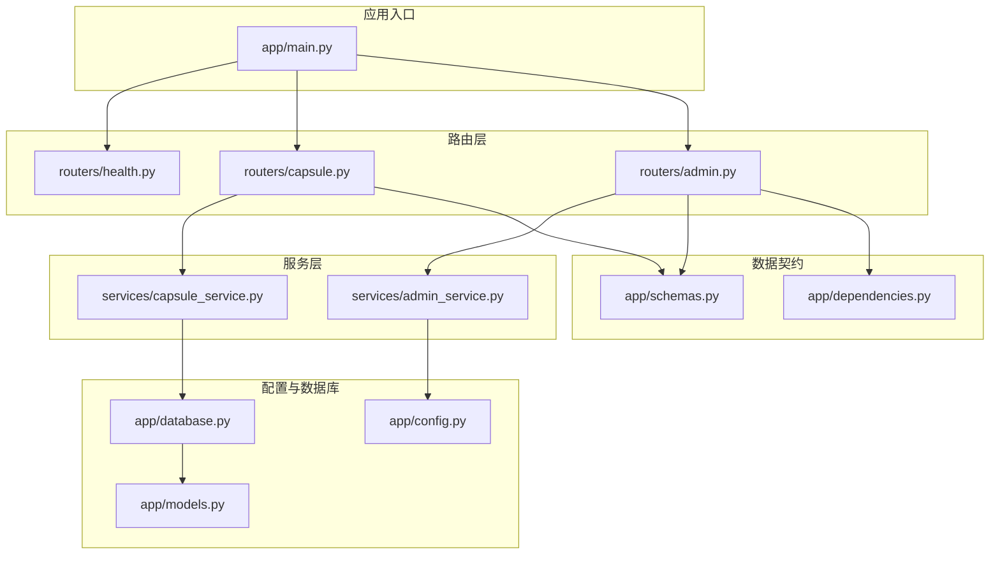
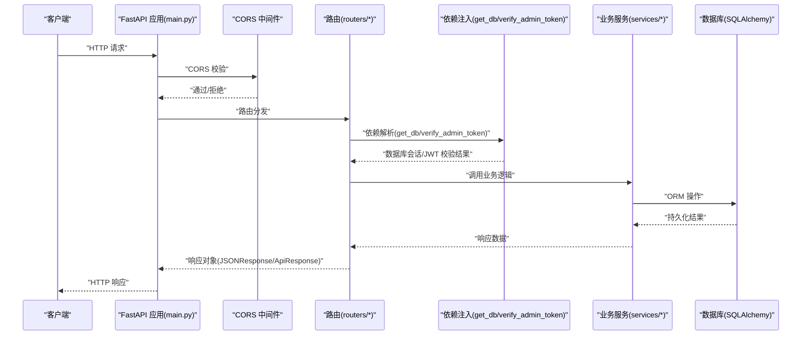
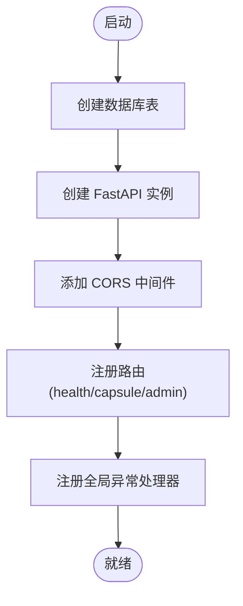
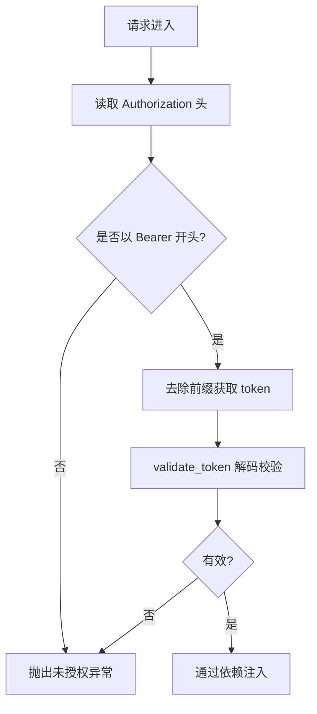
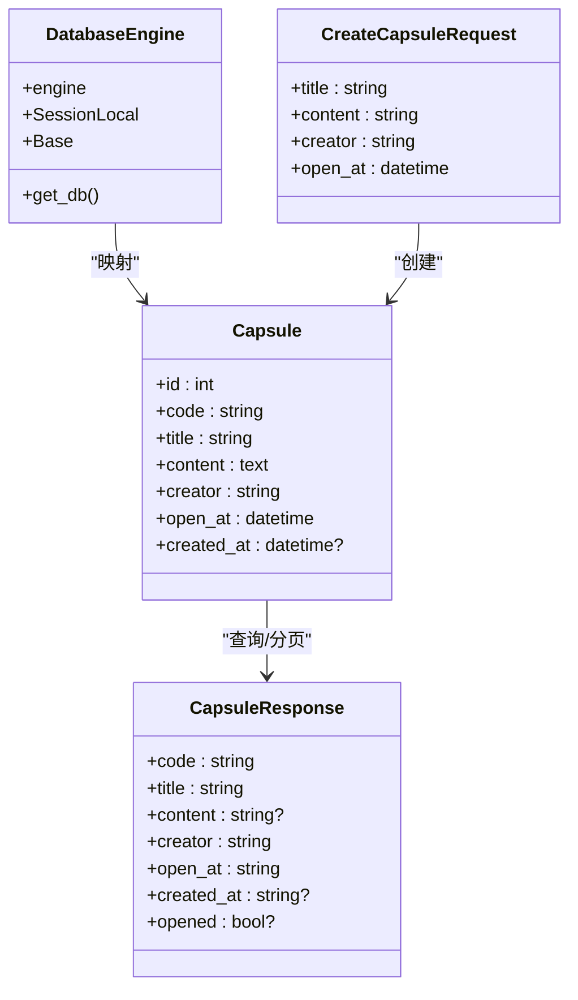
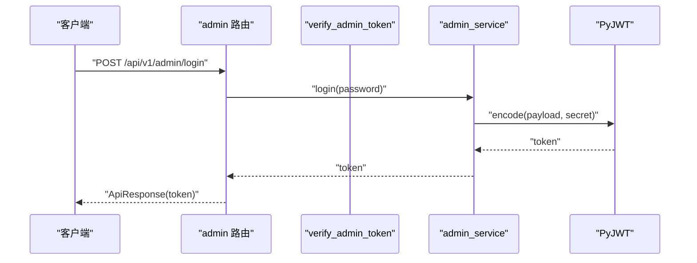
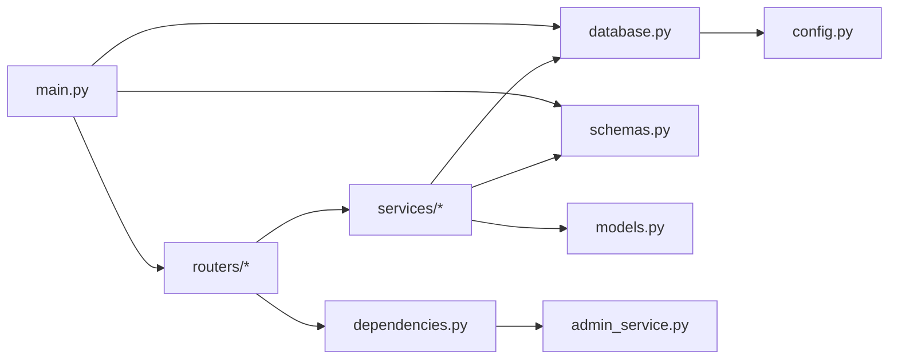

# 项目结构与配置

<cite>
**本文引用的文件**
- [backends/fastapi/app/main.py](file://backends/fastapi/app/main.py)
- [backends/fastapi/app/config.py](file://backends/fastapi/app/config.py)
- [backends/fastapi/app/dependencies.py](file://backends/fastapi/app/dependencies.py)
- [backends/fastapi/app/database.py](file://backends/fastapi/app/database.py)
- [backends/fastapi/app/models.py](file://backends/fastapi/app/models.py)
- [backends/fastapi/app/schemas.py](file://backends/fastapi/app/schemas.py)
- [backends/fastapi/app/routers/capsule.py](file://backends/fastapi/app/routers/capsule.py)
- [backends/fastapi/app/routers/admin.py](file://backends/fastapi/app/routers/admin.py)
- [backends/fastapi/app/routers/health.py](file://backends/fastapi/app/routers/health.py)
- [backends/fastapi/app/services/capsule_service.py](file://backends/fastapi/app/services/capsule_service.py)
- [backends/fastapi/app/services/admin_service.py](file://backends/fastapi/app/services/admin_service.py)
- [backends/fastapi/requirements.txt](file://backends/fastapi/requirements.txt)
- [backends/fastapi/README.md](file://backends/fastapi/README.md)
- [backends/fastapi/tests/conftest.py](file://backends/fastapi/tests/conftest.py)
- [backends/fastapi/tests/test_capsule_api.py](file://backends/fastapi/tests/test_capsule_api.py)
- [scripts/dev.sh](file://scripts/dev.sh)
- [scripts/build.sh](file://scripts/build.sh)
</cite>

## 目录
1. [简介](#简介)
2. [项目结构](#项目结构)
3. [核心组件](#核心组件)
4. [架构总览](#架构总览)
5. [详细组件分析](#详细组件分析)
6. [依赖分析](#依赖分析)
7. [性能考虑](#性能考虑)
8. [故障排查指南](#故障排查指南)
9. [结论](#结论)
10. [附录](#附录)

## 简介
本文件系统性梳理后端 FastAPI 项目的结构与配置，聚焦以下主题：
- 目录组织与模块职责划分（app/ 根目录下各模块）
- 应用入口 main.py 初始化流程（FastAPI 实例创建、中间件、路由注册、异常处理）
- 配置管理 config.py（环境变量读取、配置类设计、默认值）
- 依赖注入 dependencies.py（数据库会话、认证依赖、全局依赖）
- 依赖项 requirements.txt（版本要求与作用）
- 启动、开发调试、生产部署的完整配置指南

## 项目结构
后端采用标准 FastAPI 分层结构，按功能域划分模块：
- app/ 应用根目录
  - main.py 应用入口与全局异常处理
  - config.py 配置常量（数据库、JWT、管理员口令）
  - database.py 数据库引擎、会话工厂与依赖注入
  - models.py SQLAlchemy ORM 模型
  - schemas.py Pydantic 模型（请求/响应 DTO）
  - routers/ 路由模块（健康检查、胶囊、管理员）
  - services/ 业务服务（胶囊、管理员）
  - dependencies.py 依赖注入（JWT 校验）
- tests/ 测试目录（pytest + TestClient + 内存数据库）
- requirements.txt 依赖清单
- README.md 快速开始、运行方式、环境变量与 API 列表

图表来源
- [backends/fastapi/app/main.py:1-89](file://backends/fastapi/app/main.py#L1-L89)
- [backends/fastapi/app/config.py:1-18](file://backends/fastapi/app/config.py#L1-L18)
- [backends/fastapi/app/database.py:1-30](file://backends/fastapi/app/database.py#L1-L30)
- [backends/fastapi/app/models.py:1-26](file://backends/fastapi/app/models.py#L1-L26)
- [backends/fastapi/app/schemas.py:1-96](file://backends/fastapi/app/schemas.py#L1-L96)
- [backends/fastapi/app/routers/capsule.py:1-31](file://backends/fastapi/app/routers/capsule.py#L1-L31)
- [backends/fastapi/app/routers/admin.py:1-55](file://backends/fastapi/app/routers/admin.py#L1-L55)
- [backends/fastapi/app/routers/health.py:1-25](file://backends/fastapi/app/routers/health.py#L1-L25)
- [backends/fastapi/app/services/capsule_service.py:1-144](file://backends/fastapi/app/services/capsule_service.py#L1-L144)
- [backends/fastapi/app/services/admin_service.py:1-42](file://backends/fastapi/app/services/admin_service.py#L1-L42)
- [backends/fastapi/app/dependencies.py:1-23](file://backends/fastapi/app/dependencies.py#L1-L23)

章节来源
- [backends/fastapi/README.md:99-116](file://backends/fastapi/README.md#L99-L116)

## 核心组件
- 应用入口与初始化
  - 创建数据库表（首次启动）
  - 初始化 FastAPI 实例（标题、版本）
  - 配置 CORS 中间件（本地开发正则匹配、允许方法、头、凭证、缓存）
  - 注册路由（健康检查、胶囊、管理员）
  - 全局异常处理（业务异常、参数校验、值错误、通用异常）
- 配置管理
  - DATABASE_URL：数据库连接（默认 SQLite 相对路径）
  - ADMIN_PASSWORD：管理员登录口令
  - JWT_SECRET：JWT 签名密钥
  - JWT_EXPIRATION_HOURS：JWT 过期时间（小时）
- 依赖注入
  - get_db：数据库会话生成器（依赖注入）
  - verify_admin_token：管理员 JWT 校验依赖（Header 校验、令牌解码）
- 数据层
  - database.py：SQLAlchemy 引擎、会话工厂、Base 基类、get_db
  - models.py：Capsule 实体（code 唯一索引、UTC 时间字段）
  - schemas.py：请求/响应模型、驼峰序列化、ISO 8601 时间处理
- 业务服务
  - capsule_service.py：创建、查询、分页、删除；唯一编码生成；内容可见性控制
  - admin_service.py：登录签发 JWT；令牌验证
- 路由层
  - health：健康检查
  - capsule：创建、查询
  - admin：登录、分页查询、删除（均含管理员认证依赖）

章节来源
- [backends/fastapi/app/main.py:16-89](file://backends/fastapi/app/main.py#L16-L89)
- [backends/fastapi/app/config.py:8-18](file://backends/fastapi/app/config.py#L8-L18)
- [backends/fastapi/app/dependencies.py:10-23](file://backends/fastapi/app/dependencies.py#L10-L23)
- [backends/fastapi/app/database.py:11-30](file://backends/fastapi/app/database.py#L11-L30)
- [backends/fastapi/app/models.py:14-26](file://backends/fastapi/app/models.py#L14-L26)
- [backends/fastapi/app/schemas.py:26-96](file://backends/fastapi/app/schemas.py#L26-L96)
- [backends/fastapi/app/services/capsule_service.py:79-144](file://backends/fastapi/app/services/capsule_service.py#L79-L144)
- [backends/fastapi/app/services/admin_service.py:18-42](file://backends/fastapi/app/services/admin_service.py#L18-L42)
- [backends/fastapi/app/routers/health.py:14-25](file://backends/fastapi/app/routers/health.py#L14-L25)
- [backends/fastapi/app/routers/capsule.py:17-31](file://backends/fastapi/app/routers/capsule.py#L17-L31)
- [backends/fastapi/app/routers/admin.py:25-55](file://backends/fastapi/app/routers/admin.py#L25-L55)

## 架构总览
下图展示应用启动到请求处理的关键交互：入口文件初始化、中间件、路由、服务与数据库。

图表来源
- [backends/fastapi/app/main.py:19-34](file://backends/fastapi/app/main.py#L19-L34)
- [backends/fastapi/app/routers/capsule.py:17-31](file://backends/fastapi/app/routers/capsule.py#L17-L31)
- [backends/fastapi/app/routers/admin.py:33-55](file://backends/fastapi/app/routers/admin.py#L33-L55)
- [backends/fastapi/app/dependencies.py:10-23](file://backends/fastapi/app/dependencies.py#L10-L23)
- [backends/fastapi/app/database.py:23-30](file://backends/fastapi/app/database.py#L23-L30)
- [backends/fastapi/app/services/capsule_service.py:79-144](file://backends/fastapi/app/services/capsule_service.py#L79-L144)
- [backends/fastapi/app/services/admin_service.py:18-42](file://backends/fastapi/app/services/admin_service.py#L18-L42)

## 详细组件分析

### 应用入口 main.py 初始化流程
- 创建数据库表：启动即执行元数据创建
- 初始化 FastAPI 实例：设置标题与版本
- CORS 配置：本地开发正则匹配、允许方法、头、凭证、缓存
- 路由注册：include_router 注入健康检查、胶囊、管理员
- 全局异常处理：
  - 业务异常（胶囊不存在、未授权）
  - 参数校验错误（RequestValidationError）
  - 值错误（ValueError）
  - 通用异常（Exception）

图表来源
- [backends/fastapi/app/main.py:16-89](file://backends/fastapi/app/main.py#L16-L89)

章节来源
- [backends/fastapi/app/main.py:16-89](file://backends/fastapi/app/main.py#L16-L89)

### 配置管理 config.py
- DATABASE_URL：默认 SQLite 相对路径，可覆盖
- ADMIN_PASSWORD：默认管理员口令
- JWT_SECRET：默认 HS256 密钥
- JWT_EXPIRATION_HOURS：默认 2 小时

章节来源
- [backends/fastapi/app/config.py:8-18](file://backends/fastapi/app/config.py#L8-L18)

### 依赖注入 dependencies.py
- verify_admin_token：
  - 从 Authorization 头提取 Bearer 令牌
  - 校验前缀与有效性，无效则抛出未授权异常
  - 交由全局异常处理器统一处理

图表来源
- [backends/fastapi/app/dependencies.py:10-23](file://backends/fastapi/app/dependencies.py#L10-L23)
- [backends/fastapi/app/services/admin_service.py:35-42](file://backends/fastapi/app/services/admin_service.py#L35-L42)

章节来源
- [backends/fastapi/app/dependencies.py:10-23](file://backends/fastapi/app/dependencies.py#L10-L23)
- [backends/fastapi/app/services/admin_service.py:18-42](file://backends/fastapi/app/services/admin_service.py#L18-L42)

### 数据层与模式
- database.py
  - 引擎创建（SQLite 特殊 connect_args）
  - 会话工厂 SessionLocal
  - Base 基类
  - get_db 依赖注入生成器
- models.py
  - Capsule 表：code 唯一且带索引；open_at/created_at 为带时区 DateTime
- schemas.py
  - 请求模型：CreateCapsuleRequest、AdminLoginRequest
  - 响应模型：CapsuleResponse、AdminTokenResponse、PageResponse、ApiResponse
  - 统一驼峰命名别名生成器
  - 时间字段解析与序列化（ISO 8601）

图表来源
- [backends/fastapi/app/database.py:11-30](file://backends/fastapi/app/database.py#L11-L30)
- [backends/fastapi/app/models.py:14-26](file://backends/fastapi/app/models.py#L14-L26)
- [backends/fastapi/app/schemas.py:26-96](file://backends/fastapi/app/schemas.py#L26-L96)

章节来源
- [backends/fastapi/app/database.py:11-30](file://backends/fastapi/app/database.py#L11-L30)
- [backends/fastapi/app/models.py:14-26](file://backends/fastapi/app/models.py#L14-L26)
- [backends/fastapi/app/schemas.py:26-96](file://backends/fastapi/app/schemas.py#L26-L96)

### 业务服务
- capsule_service.py
  - 创建：校验 open_at 在未来；生成唯一 8 位 base62 编码；持久化并返回响应
  - 查询：根据 code 查询；不存在抛出业务异常
  - 分页：计算总页数与内容；管理员可见完整内容
  - 删除：不存在抛出业务异常
- admin_service.py
  - 登录：密码匹配则签发 JWT，包含 sub、iat、exp
  - 校验：HS256 解码校验，异常或失败返回无效

图表来源
- [backends/fastapi/app/routers/admin.py:25-31](file://backends/fastapi/app/routers/admin.py#L25-L31)
- [backends/fastapi/app/services/admin_service.py:18-32](file://backends/fastapi/app/services/admin_service.py#L18-L32)

章节来源
- [backends/fastapi/app/services/capsule_service.py:79-144](file://backends/fastapi/app/services/capsule_service.py#L79-L144)
- [backends/fastapi/app/services/admin_service.py:18-42](file://backends/fastapi/app/services/admin_service.py#L18-L42)
- [backends/fastapi/app/routers/admin.py:25-31](file://backends/fastapi/app/routers/admin.py#L25-L31)

### 路由层
- health：返回技术栈与时间戳
- capsule：创建（201）、查询（详情）
- admin：登录（明文口令）、分页查询（管理员认证）、删除（管理员认证）

章节来源
- [backends/fastapi/app/routers/health.py:14-25](file://backends/fastapi/app/routers/health.py#L14-L25)
- [backends/fastapi/app/routers/capsule.py:17-31](file://backends/fastapi/app/routers/capsule.py#L17-L31)
- [backends/fastapi/app/routers/admin.py:25-55](file://backends/fastapi/app/routers/admin.py#L25-L55)

## 依赖分析
- 外部依赖（requirements.txt）
  - fastapi>=0.115：Web 框架
  - uvicorn[standard]>=0.34：ASGI 服务器
  - sqlalchemy>=2.0：ORM 与数据库访问
  - pyjwt>=2.9：JWT 生成与校验
  - httpx>=0.28：HTTP 客户端（测试/集成）
  - pytest>=8.0：测试框架
- 内部模块耦合
  - main.py 依赖 routers、database、schemas、services 异常类型
  - routers 依赖 database.get_db、schemas、services
  - services 依赖 models、schemas、config、database
  - dependencies 依赖 admin_service
  - database 依赖 config
  - schemas 与 models 通过 SQLAlchemy 关联

图表来源
- [backends/fastapi/app/main.py:10-14](file://backends/fastapi/app/main.py#L10-L14)
- [backends/fastapi/app/routers/capsule.py:10-12](file://backends/fastapi/app/routers/capsule.py#L10-L12)
- [backends/fastapi/app/routers/admin.py:10-19](file://backends/fastapi/app/routers/admin.py#L10-L19)
- [backends/fastapi/app/dependencies.py:7-7](file://backends/fastapi/app/dependencies.py#L7-L7)
- [backends/fastapi/app/database.py:9-9](file://backends/fastapi/app/database.py#L9-L9)
- [backends/fastapi/app/services/admin_service.py:9-9](file://backends/fastapi/app/services/admin_service.py#L9-L9)
- [backends/fastapi/requirements.txt:1-7](file://backends/fastapi/requirements.txt#L1-L7)

章节来源
- [backends/fastapi/requirements.txt:1-7](file://backends/fastapi/requirements.txt#L1-L7)
- [backends/fastapi/app/main.py:10-14](file://backends/fastapi/app/main.py#L10-L14)

## 性能考虑
- 数据库连接
  - SQLite 默认单线程限制，多线程场景建议切换数据库或调整连接池策略
  - 已针对 SQLite 设置 connect_args，避免线程绑定问题
- 依赖注入
  - get_db 使用生成器确保会话在请求结束时关闭，避免连接泄漏
- 路由与服务
  - 分页查询按 limit/offset 实现，大数据量建议增加索引与优化查询
- 异常处理
  - 全局异常处理器减少重复样板代码，提升一致性

章节来源
- [backends/fastapi/app/database.py:11-30](file://backends/fastapi/app/database.py#L11-L30)
- [backends/fastapi/app/services/capsule_service.py:114-134](file://backends/fastapi/app/services/capsule_service.py#L114-L134)

## 故障排查指南
- 启动失败（数据库）
  - 检查 DATABASE_URL 是否可达；SQLite 路径是否存在
- 认证失败
  - 确认 Authorization 头格式为 Bearer <token>
  - 检查 JWT_SECRET 与 JWT_EXPIRATION_HOURS 是否一致
- 参数校验错误
  - 查看响应中 errorCode 为 VALIDATION_ERROR 的定位与消息
- 业务异常
  - CAPSULE_NOT_FOUND：查询不存在 code
  - UNAUTHORIZED：缺少或无效令牌

章节来源
- [backends/fastapi/app/main.py:37-89](file://backends/fastapi/app/main.py#L37-L89)
- [backends/fastapi/app/dependencies.py:10-23](file://backends/fastapi/app/dependencies.py#L10-L23)
- [backends/fastapi/app/services/capsule_service.py:25-30](file://backends/fastapi/app/services/capsule_service.py#L25-L30)
- [backends/fastapi/app/services/admin_service.py:12-16](file://backends/fastapi/app/services/admin_service.py#L12-L16)

## 结论
本项目采用清晰的分层架构与依赖注入，结合统一响应格式与全局异常处理，提供了简洁可靠的 API 能力。配置模块集中管理环境变量，便于在不同环境灵活切换。建议在生产环境中替换 SQLite、强化 JWT 密钥管理与日志监控，并对大分页查询进行索引与性能优化。

## 附录

### 启动与部署指南
- 开发模式
  - 使用 uvicorn 指向应用入口，启用 reload
  - 访问 Swagger UI 与 ReDoc 文档
- 生产模式
  - 使用多进程 workers 提升吞吐
- 环境变量
  - DATABASE_URL、ADMIN_PASSWORD、JWT_SECRET、JWT_EXPIRATION_HOURS

章节来源
- [backends/fastapi/README.md:41-75](file://backends/fastapi/README.md#L41-L75)

### 依赖项与版本要求
- fastapi>=0.115：Web 框架
- uvicorn[standard]>=0.34：ASGI 服务器
- sqlalchemy>=2.0：ORM
- pyjwt>=2.9：JWT
- httpx>=0.28：HTTP 客户端
- pytest>=8.0：测试

章节来源
- [backends/fastapi/requirements.txt:1-7](file://backends/fastapi/requirements.txt#L1-L7)

### 测试与开发脚本
- 测试
  - pytest 运行；内存 SQLite + TestClient；依赖覆盖 get_db
- 开发脚本
  - dev.sh：同时启动 Spring Boot 后端与多个前端开发服务器
  - build.sh：构建后端 JAR 与前端静态资源

章节来源
- [backends/fastapi/tests/conftest.py:16-47](file://backends/fastapi/tests/conftest.py#L16-L47)
- [backends/fastapi/tests/test_capsule_api.py:7-69](file://backends/fastapi/tests/test_capsule_api.py#L7-L69)
- [scripts/dev.sh:11-31](file://scripts/dev.sh#L11-L31)
- [scripts/build.sh:12-27](file://scripts/build.sh#L12-L27)