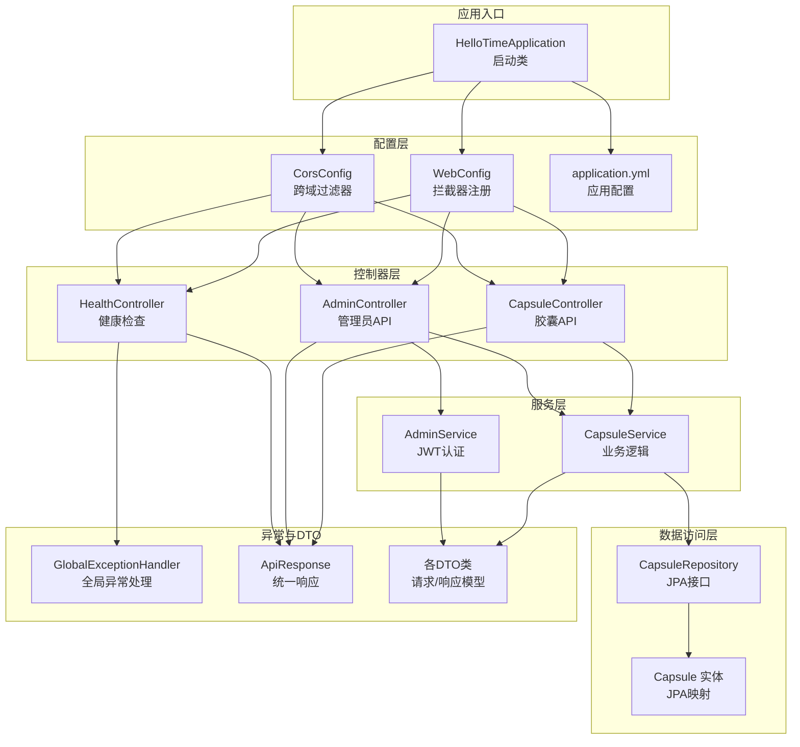
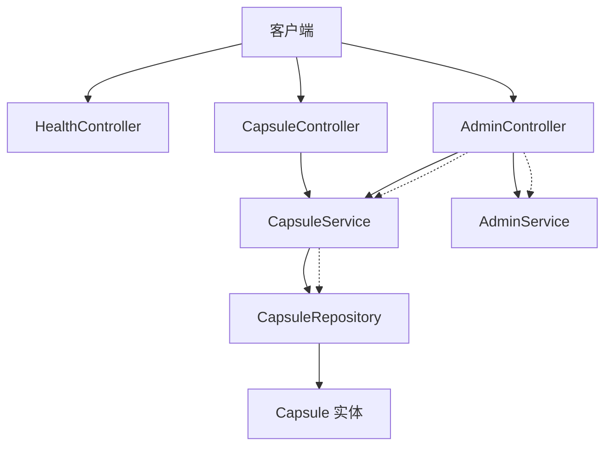
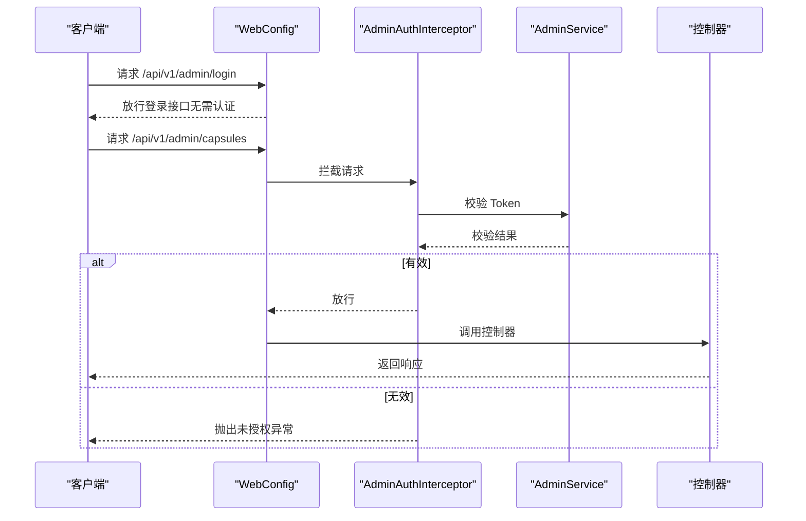
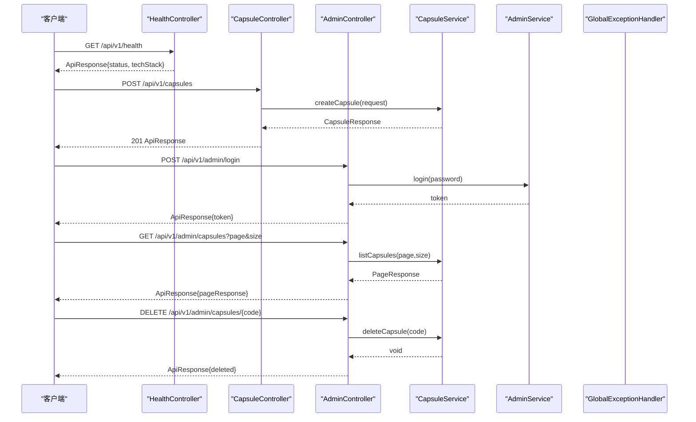
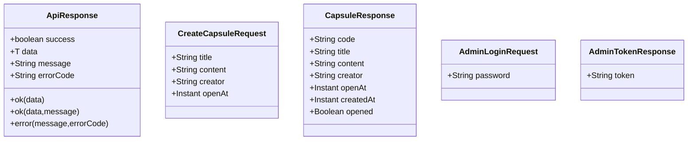
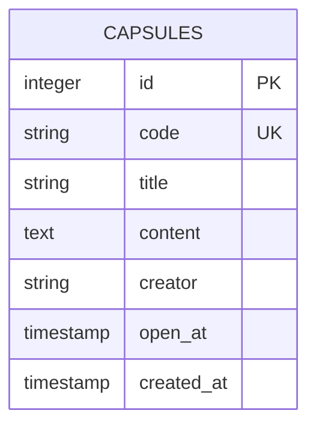
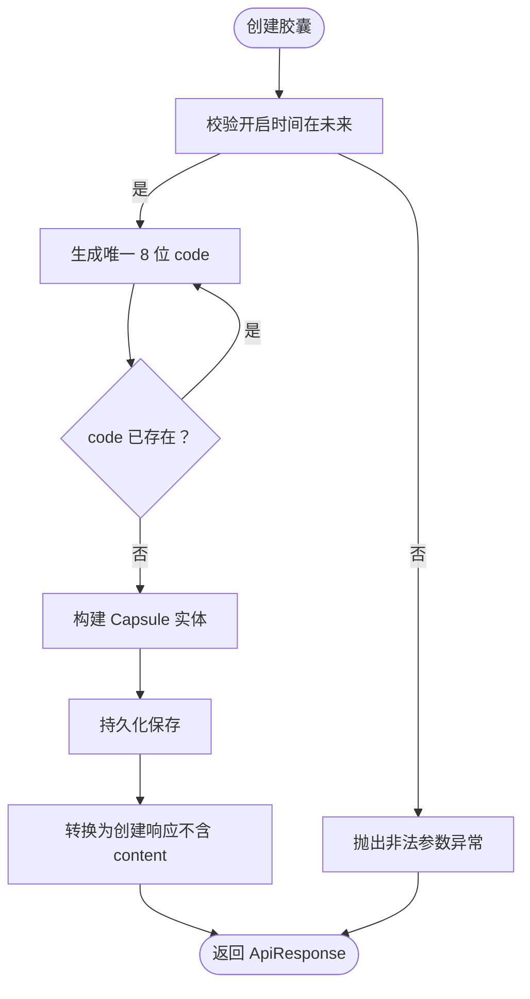
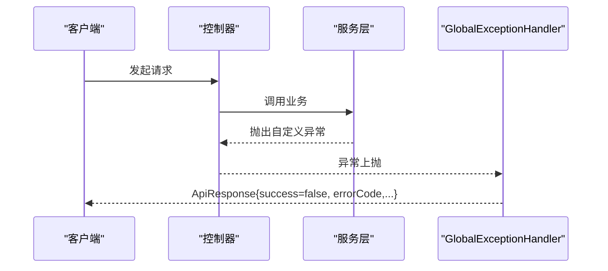
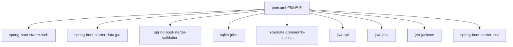

# Spring Boot 实现

<cite>
**本文引用的文件**
- [HelloTimeApplication.java](file://backends/spring-boot/src/main/java/com/hellotime/HelloTimeApplication.java)
- [application.yml](file://backends/spring-boot/src/main/resources/application.yml)
- [pom.xml](file://backends/spring-boot/pom.xml)
- [WebConfig.java](file://backends/spring-boot/src/main/java/com/hellotime/config/WebConfig.java)
- [CorsConfig.java](file://backends/spring-boot/src/main/java/com/hellotime/config/CorsConfig.java)
- [AdminAuthInterceptor.java](file://backends/spring-boot/src/main/java/com/hellotime/config/AdminAuthInterceptor.java)
- [HealthController.java](file://backends/spring-boot/src/main/java/com/hellotime/controller/HealthController.java)
- [CapsuleController.java](file://backends/spring-boot/src/main/java/com/hellotime/controller/CapsuleController.java)
- [AdminController.java](file://backends/spring-boot/src/main/java/com/hellotime/controller/AdminController.java)
- [ApiResponse.java](file://backends/spring-boot/src/main/java/com/hellotime/dto/ApiResponse.java)
- [CreateCapsuleRequest.java](file://backends/spring-boot/src/main/java/com/hellotime/dto/CreateCapsuleRequest.java)
- [CapsuleResponse.java](file://backends/spring-boot/src/main/java/com/hellotime/dto/CapsuleResponse.java)
- [AdminLoginRequest.java](file://backends/spring-boot/src/main/java/com/hellotime/dto/AdminLoginRequest.java)
- [AdminTokenResponse.java](file://backends/spring-boot/src/main/java/com/hellotime/dto/AdminTokenResponse.java)
- [Capsule.java](file://backends/spring-boot/src/main/java/com/hellotime/entity/Capsule.java)
- [CapsuleRepository.java](file://backends/spring-boot/src/main/java/com/hellotime/repository/CapsuleRepository.java)
- [CapsuleService.java](file://backends/spring-boot/src/main/java/com/hellotime/service/CapsuleService.java)
- [AdminService.java](file://backends/spring-boot/src/main/java/com/hellotime/service/AdminService.java)
- [GlobalExceptionHandler.java](file://backends/spring-boot/src/main/java/com/hellotime/exception/GlobalExceptionHandler.java)
- [CapsuleNotFoundException.java](file://backends/spring-boot/src/main/java/com/hellotime/exception/CapsuleNotFoundException.java)
- [UnauthorizedException.java](file://backends/spring-boot/src/main/java/com/hellotime/exception/UnauthorizedException.java)
</cite>

## 目录
1. [简介](#简介)
2. [项目结构](#项目结构)
3. [核心组件](#核心组件)
4. [架构总览](#架构总览)
5. [详细组件分析](#详细组件分析)
6. [依赖分析](#依赖分析)
7. [性能考虑](#性能考虑)
8. [故障排查指南](#故障排查指南)
9. [结论](#结论)
10. [附录](#附录)

## 简介
本项目为“时间胶囊”后端服务的 Spring Boot 实现，采用注解驱动开发、自动配置与依赖注入容器，结合 JPA/Hibernate 实现数据持久化，使用 SQLite 作为本地数据库。系统提供健康检查、时间胶囊的创建与查询、管理员登录与管理能力，并通过拦截器与 JWT 实现基础的认证与跨域支持。统一响应格式、DTO 模式与全局异常处理保证了接口的一致性与可维护性。

## 项目结构
后端代码位于 backends/spring-boot，采用按层次划分的包结构：
- config：Web 配置、跨域配置、拦截器
- controller：REST 控制器层
- dto：数据传输对象与统一响应封装
- entity：JPA 实体
- repository：数据访问层接口
- service：业务服务层
- exception：异常与全局异常处理

图表来源
- [HelloTimeApplication.java:1-12](file://backends/spring-boot/src/main/java/com/hellotime/HelloTimeApplication.java#L1-L12)
- [WebConfig.java:1-32](file://backends/spring-boot/src/main/java/com/hellotime/config/WebConfig.java#L1-L32)
- [CorsConfig.java:1-28](file://backends/spring-boot/src/main/java/com/hellotime/config/CorsConfig.java#L1-L28)
- [HealthController.java:1-28](file://backends/spring-boot/src/main/java/com/hellotime/controller/HealthController.java#L1-L28)
- [CapsuleController.java:1-57](file://backends/spring-boot/src/main/java/com/hellotime/controller/CapsuleController.java#L1-L57)
- [AdminController.java:1-78](file://backends/spring-boot/src/main/java/com/hellotime/controller/AdminController.java#L1-L78)
- [CapsuleService.java:1-195](file://backends/spring-boot/src/main/java/com/hellotime/service/CapsuleService.java#L1-L195)
- [AdminService.java:1-89](file://backends/spring-boot/src/main/java/com/hellotime/service/AdminService.java#L1-L89)
- [CapsuleRepository.java:1-48](file://backends/spring-boot/src/main/java/com/hellotime/repository/CapsuleRepository.java#L1-L48)
- [Capsule.java:1-90](file://backends/spring-boot/src/main/java/com/hellotime/entity/Capsule.java#L1-L90)
- [GlobalExceptionHandler.java:1-87](file://backends/spring-boot/src/main/java/com/hellotime/exception/GlobalExceptionHandler.java#L1-L87)
- [ApiResponse.java:1-68](file://backends/spring-boot/src/main/java/com/hellotime/dto/ApiResponse.java#L1-L68)

章节来源
- [HelloTimeApplication.java:1-12](file://backends/spring-boot/src/main/java/com/hellotime/HelloTimeApplication.java#L1-L12)
- [application.yml:1-22](file://backends/spring-boot/src/main/resources/application.yml#L1-L22)

## 核心组件
- 启动类与自动配置：应用入口通过注解驱动启动，自动装配 Web、JPA、验证等 Starter。
- 配置层：WebConfig 注册拦截器；CorsConfig 提供跨域支持；application.yml 配置数据源、JPA、服务器端口与应用参数。
- 控制器层：HealthController 提供健康检查；CapsuleController 提供胶囊的创建与查询；AdminController 提供管理员登录、分页列表与删除。
- 服务层：CapsuleService 实现业务逻辑（创建、查询、分页、删除、唯一码生成、开启时间控制）；AdminService 实现管理员登录与 JWT 签发与校验。
- 数据访问层：CapsuleRepository 继承 JpaRepository，提供基于方法名的查询与分页；Capsule 实体映射数据库表。
- 异常与统一响应：GlobalExceptionHandler 统一处理各类异常；ApiResponse 统一响应格式；自定义异常类用于业务错误。

章节来源
- [pom.xml:1-91](file://backends/spring-boot/pom.xml#L1-L91)
- [WebConfig.java:1-32](file://backends/spring-boot/src/main/java/com/hellotime/config/WebConfig.java#L1-L32)
- [CorsConfig.java:1-28](file://backends/spring-boot/src/main/java/com/hellotime/config/CorsConfig.java#L1-L28)
- [application.yml:1-22](file://backends/spring-boot/src/main/resources/application.yml#L1-L22)
- [HealthController.java:1-28](file://backends/spring-boot/src/main/java/com/hellotime/controller/HealthController.java#L1-L28)
- [CapsuleController.java:1-57](file://backends/spring-boot/src/main/java/com/hellotime/controller/CapsuleController.java#L1-L57)
- [AdminController.java:1-78](file://backends/spring-boot/src/main/java/com/hellotime/controller/AdminController.java#L1-L78)
- [CapsuleService.java:1-195](file://backends/spring-boot/src/main/java/com/hellotime/service/CapsuleService.java#L1-L195)
- [AdminService.java:1-89](file://backends/spring-boot/src/main/java/com/hellotime/service/AdminService.java#L1-L89)
- [CapsuleRepository.java:1-48](file://backends/spring-boot/src/main/java/com/hellotime/repository/CapsuleRepository.java#L1-L48)
- [Capsule.java:1-90](file://backends/spring-boot/src/main/java/com/hellotime/entity/Capsule.java#L1-L90)
- [GlobalExceptionHandler.java:1-87](file://backends/spring-boot/src/main/java/com/hellotime/exception/GlobalExceptionHandler.java#L1-L87)
- [ApiResponse.java:1-68](file://backends/spring-boot/src/main/java/com/hellotime/dto/ApiResponse.java#L1-L68)

## 架构总览
系统采用经典的分层架构：控制器层负责接收请求与返回响应；服务层承载业务逻辑；数据访问层负责与数据库交互；配置层提供拦截与跨域支持；异常层统一处理错误。整体通过依赖注入实现松耦合。

图表来源
- [HealthController.java:1-28](file://backends/spring-boot/src/main/java/com/hellotime/controller/HealthController.java#L1-L28)
- [CapsuleController.java:1-57](file://backends/spring-boot/src/main/java/com/hellotime/controller/CapsuleController.java#L1-L57)
- [AdminController.java:1-78](file://backends/spring-boot/src/main/java/com/hellotime/controller/AdminController.java#L1-L78)
- [CapsuleService.java:1-195](file://backends/spring-boot/src/main/java/com/hellotime/service/CapsuleService.java#L1-L195)
- [AdminService.java:1-89](file://backends/spring-boot/src/main/java/com/hellotime/service/AdminService.java#L1-L89)
- [CapsuleRepository.java:1-48](file://backends/spring-boot/src/main/java/com/hellotime/repository/CapsuleRepository.java#L1-L48)
- [Capsule.java:1-90](file://backends/spring-boot/src/main/java/com/hellotime/entity/Capsule.java#L1-L90)

## 详细组件分析

### 启动类与自动配置
- 启动类通过注解启用 Spring Boot 自动配置，扫描组件并启动嵌入式服务器。
- application.yml 配置数据源为 SQLite，JPA 方言为 SQLite，DDL 自动更新，关闭 SQL 输出；服务器端口 8080；应用参数包含管理员密码与 JWT 密钥及过期时长。

章节来源
- [HelloTimeApplication.java:1-12](file://backends/spring-boot/src/main/java/com/hellotime/HelloTimeApplication.java#L1-L12)
- [application.yml:1-22](file://backends/spring-boot/src/main/resources/application.yml#L1-L22)

### 配置层：Web 与跨域
- WebConfig：注册 AdminAuthInterceptor，拦截 /api/v1/admin/** 并排除 /api/v1/admin/login，实现管理员接口的统一认证。
- CorsConfig：配置允许本地开发域名、常用方法与头、允许凭据与缓存时间，仅对 /api/** 生效。

图表来源
- [WebConfig.java:1-32](file://backends/spring-boot/src/main/java/com/hellotime/config/WebConfig.java#L1-L32)
- [AdminAuthInterceptor.java:1-59](file://backends/spring-boot/src/main/java/com/hellotime/config/AdminAuthInterceptor.java#L1-L59)
- [AdminService.java:1-89](file://backends/spring-boot/src/main/java/com/hellotime/service/AdminService.java#L1-L89)
- [AdminController.java:1-78](file://backends/spring-boot/src/main/java/com/hellotime/controller/AdminController.java#L1-L78)

章节来源
- [WebConfig.java:1-32](file://backends/spring-boot/src/main/java/com/hellotime/config/WebConfig.java#L1-L32)
- [CorsConfig.java:1-28](file://backends/spring-boot/src/main/java/com/hellotime/config/CorsConfig.java#L1-L28)
- [AdminAuthInterceptor.java:1-59](file://backends/spring-boot/src/main/java/com/hellotime/config/AdminAuthInterceptor.java#L1-L59)

### 控制器层：RESTful API 设计
- HealthController：提供系统健康状态，返回统一响应。
- CapsuleController：提供创建胶囊（POST /api/v1/capsules）与查询胶囊（GET /api/v1/capsules/{code}）两个接口，使用 @Valid 参数校验与 ApiResponse 包装响应。
- AdminController：提供管理员登录（POST /api/v1/admin/login）、分页列表（GET /api/v1/admin/capsules）与删除（DELETE /api/v1/admin/capsules/{code}），均需认证。

图表来源
- [HealthController.java:1-28](file://backends/spring-boot/src/main/java/com/hellotime/controller/HealthController.java#L1-L28)
- [CapsuleController.java:1-57](file://backends/spring-boot/src/main/java/com/hellotime/controller/CapsuleController.java#L1-L57)
- [AdminController.java:1-78](file://backends/spring-boot/src/main/java/com/hellotime/controller/AdminController.java#L1-L78)
- [CapsuleService.java:1-195](file://backends/spring-boot/src/main/java/com/hellotime/service/CapsuleService.java#L1-L195)
- [AdminService.java:1-89](file://backends/spring-boot/src/main/java/com/hellotime/service/AdminService.java#L1-L89)
- [GlobalExceptionHandler.java:1-87](file://backends/spring-boot/src/main/java/com/hellotime/exception/GlobalExceptionHandler.java#L1-L87)

章节来源
- [HealthController.java:1-28](file://backends/spring-boot/src/main/java/com/hellotime/controller/HealthController.java#L1-L28)
- [CapsuleController.java:1-57](file://backends/spring-boot/src/main/java/com/hellotime/controller/CapsuleController.java#L1-L57)
- [AdminController.java:1-78](file://backends/spring-boot/src/main/java/com/hellotime/controller/AdminController.java#L1-L78)

### DTO 模式与统一响应
- ApiResponse：统一响应包装，包含 success、data、message、errorCode，静态工厂方法简化成功与失败响应构造。
- CreateCapsuleRequest：创建胶囊的请求 DTO，使用 Jakarta Validation 注解进行参数校验。
- CapsuleResponse：胶囊响应 DTO，包含 code、title、content（未到开启时间时为 null）、creator、openAt、createdAt、opened。
- AdminLoginRequest：管理员登录请求 DTO。
- AdminTokenResponse：管理员登录响应 DTO，包含 token。

图表来源
- [ApiResponse.java:1-68](file://backends/spring-boot/src/main/java/com/hellotime/dto/ApiResponse.java#L1-L68)
- [CreateCapsuleRequest.java:1-56](file://backends/spring-boot/src/main/java/com/hellotime/dto/CreateCapsuleRequest.java#L1-L56)
- [CapsuleResponse.java:1-31](file://backends/spring-boot/src/main/java/com/hellotime/dto/CapsuleResponse.java#L1-L31)
- [AdminLoginRequest.java:1-13](file://backends/spring-boot/src/main/java/com/hellotime/dto/AdminLoginRequest.java#L1-L13)
- [AdminTokenResponse.java:1-13](file://backends/spring-boot/src/main/java/com/hellotime/dto/AdminTokenResponse.java#L1-L13)

章节来源
- [ApiResponse.java:1-68](file://backends/spring-boot/src/main/java/com/hellotime/dto/ApiResponse.java#L1-L68)
- [CreateCapsuleRequest.java:1-56](file://backends/spring-boot/src/main/java/com/hellotime/dto/CreateCapsuleRequest.java#L1-L56)
- [CapsuleResponse.java:1-31](file://backends/spring-boot/src/main/java/com/hellotime/dto/CapsuleResponse.java#L1-L31)
- [AdminLoginRequest.java:1-13](file://backends/spring-boot/src/main/java/com/hellotime/dto/AdminLoginRequest.java#L1-L13)
- [AdminTokenResponse.java:1-13](file://backends/spring-boot/src/main/java/com/hellotime/dto/AdminTokenResponse.java#L1-L13)

### 实体层与数据访问层
- Capsule 实体：映射 capsules 表，包含 code（唯一 8 位）、title、content、creator、openAt、createdAt；持久化前回调设置创建时间。
- CapsuleRepository：继承 JpaRepository，提供按 code 查询、存在性检查、分页查询与按创建时间倒序、按 code 删除等方法。

图表来源
- [Capsule.java:1-90](file://backends/spring-boot/src/main/java/com/hellotime/entity/Capsule.java#L1-L90)
- [CapsuleRepository.java:1-48](file://backends/spring-boot/src/main/java/com/hellotime/repository/CapsuleRepository.java#L1-L48)

章节来源
- [Capsule.java:1-90](file://backends/spring-boot/src/main/java/com/hellotime/entity/Capsule.java#L1-L90)
- [CapsuleRepository.java:1-48](file://backends/spring-boot/src/main/java/com/hellotime/repository/CapsuleRepository.java#L1-L48)

### 服务层：业务逻辑实现
- CapsuleService：
  - createCapsule：校验开启时间在未来、生成唯一 8 位 code、保存并返回创建响应（不含 content）。
  - getCapsule：按 code 查询，未到开启时间不返回 content。
  - listCapsules：分页查询并转换为管理员视图（含 content）。
  - deleteCapsule：删除指定 code 的胶囊。
  - generateUniqueCode：循环重试确保唯一性。
  - toCreatedResponse/toDetailResponse/toAdminResponse：不同场景下的响应转换。
- AdminService：
  - login：校验管理员密码，签发 JWT（含签发时间、过期时间与签名）。
  - validateToken：验证签名与过期时间。

图表来源
- [CapsuleService.java:1-195](file://backends/spring-boot/src/main/java/com/hellotime/service/CapsuleService.java#L1-L195)

章节来源
- [CapsuleService.java:1-195](file://backends/spring-boot/src/main/java/com/hellotime/service/CapsuleService.java#L1-L195)
- [AdminService.java:1-89](file://backends/spring-boot/src/main/java/com/hellotime/service/AdminService.java#L1-L89)

### 全局异常处理与自定义异常
- GlobalExceptionHandler：统一处理以下异常并返回对应 HTTP 状态码与统一响应格式：
  - CapsuleNotFoundException → 404
  - UnauthorizedException → 401
  - MethodArgumentNotValidException → 400（含字段级错误）
  - IllegalArgumentException → 400
  - Exception（兜底）→ 500
- 自定义异常：CapsuleNotFoundException、UnauthorizedException。

图表来源
- [GlobalExceptionHandler.java:1-87](file://backends/spring-boot/src/main/java/com/hellotime/exception/GlobalExceptionHandler.java#L1-L87)
- [CapsuleNotFoundException.java:1-19](file://backends/spring-boot/src/main/java/com/hellotime/exception/CapsuleNotFoundException.java#L1-L19)
- [UnauthorizedException.java:1-19](file://backends/spring-boot/src/main/java/com/hellotime/exception/UnauthorizedException.java#L1-L19)

章节来源
- [GlobalExceptionHandler.java:1-87](file://backends/spring-boot/src/main/java/com/hellotime/exception/GlobalExceptionHandler.java#L1-L87)
- [CapsuleNotFoundException.java:1-19](file://backends/spring-boot/src/main/java/com/hellotime/exception/CapsuleNotFoundException.java#L1-L19)
- [UnauthorizedException.java:1-19](file://backends/spring-boot/src/main/java/com/hellotime/exception/UnauthorizedException.java#L1-L19)

## 依赖分析
- Maven 依赖：Web、JPA、验证、SQLite JDBC、Hibernate 社区方言、JJWT API/Impl/Jackson。
- 运行时插件：spring-boot-maven-plugin。

图表来源
- [pom.xml:1-91](file://backends/spring-boot/pom.xml#L1-L91)

章节来源
- [pom.xml:1-91](file://backends/spring-boot/pom.xml#L1-L91)

## 性能考虑
- 数据库：SQLite 适合开发与轻量场景；生产建议使用关系型数据库并启用连接池与索引优化。
- 查询：分页查询使用 PageRequest，避免一次性加载大量数据。
- 响应：ApiResponse 使用 JSON 序列化时忽略 null 字段，降低响应体积。
- 安全：JWT 密钥使用环境变量注入，避免硬编码；拦截器对 OPTIONS 预检请求放行，提升 CORS 性能。
- 事务：创建与删除使用 @Transactional，保证一致性与原子性。

## 故障排查指南
- 参数校验失败：检查请求 DTO 字段注解与前端传参，关注 400 响应中的字段级错误信息。
- 未授权访问：确认 Authorization 头是否以 Bearer 开头，Token 是否有效且未过期。
- 胶囊不存在：确认 code 是否正确，或是否已被删除。
- 服务器内部错误：查看日志定位异常堆栈，确认兜底异常处理器是否正常工作。

章节来源
- [GlobalExceptionHandler.java:1-87](file://backends/spring-boot/src/main/java/com/hellotime/exception/GlobalExceptionHandler.java#L1-L87)
- [AdminAuthInterceptor.java:1-59](file://backends/spring-boot/src/main/java/com/hellotime/config/AdminAuthInterceptor.java#L1-L59)
- [CapsuleService.java:1-195](file://backends/spring-boot/src/main/java/com/hellotime/service/CapsuleService.java#L1-L195)

## 结论
该 Spring Boot 实现遵循分层架构与最佳实践，通过统一响应、DTO 模式与全局异常处理提升了系统的可维护性与一致性。JWT 与拦截器提供了基础的管理员认证能力，跨域配置满足本地开发需求。建议在生产环境中完善安全策略（如 Spring Security 集成、HTTPS、限流与审计日志）与数据库性能优化。

## 附录
- 环境变量与配置项：
  - ADMIN_PASSWORD：管理员密码，默认值见 application.yml。
  - JWT_SECRET：JWT 密钥，默认值见 application.yml。
  - JWT_EXPIRATION_HOURS：Token 过期小时数，默认值见 application.yml。
- 接口概览（路径与方法）：
  - GET /api/v1/health
  - POST /api/v1/capsules
  - GET /api/v1/capsules/{code}
  - POST /api/v1/admin/login
  - GET /api/v1/admin/capsules?page&size
  - DELETE /api/v1/admin/capsules/{code}