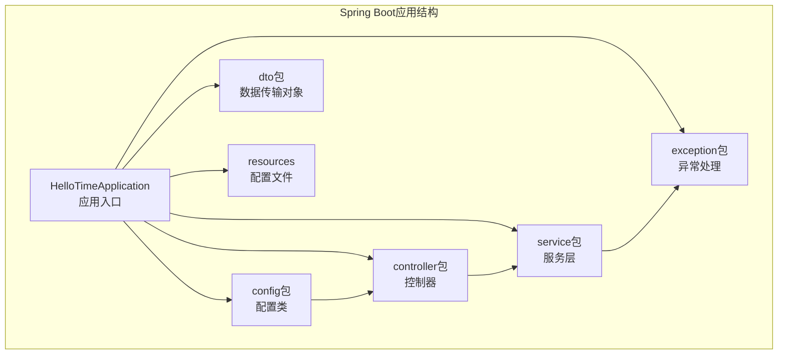
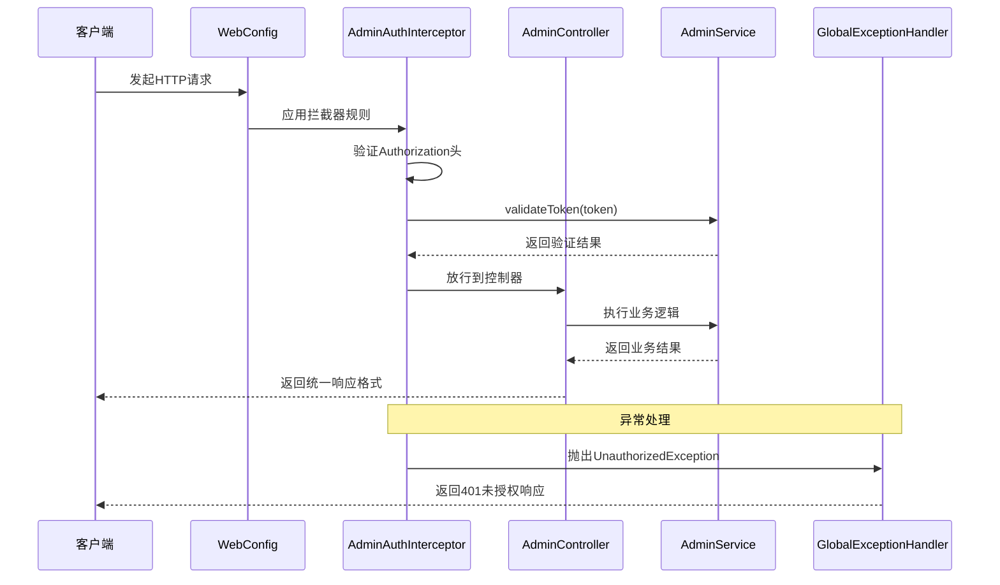
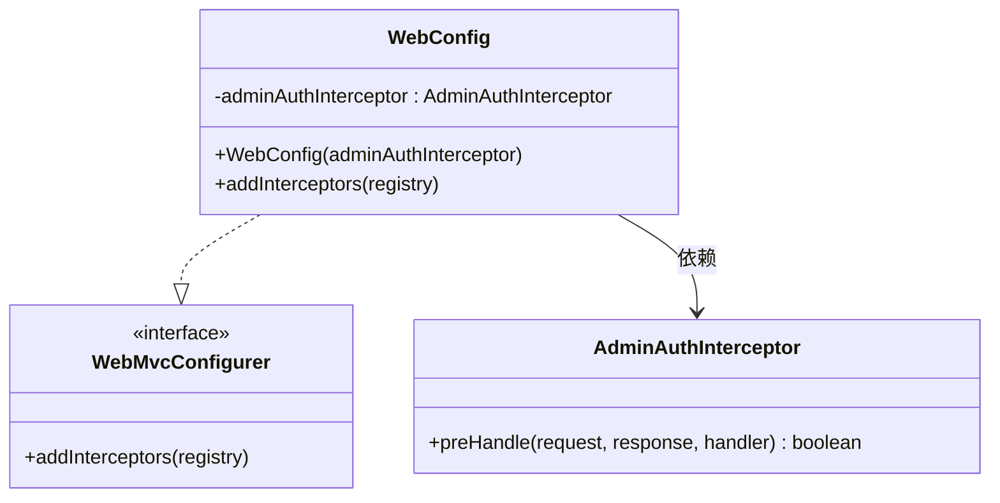
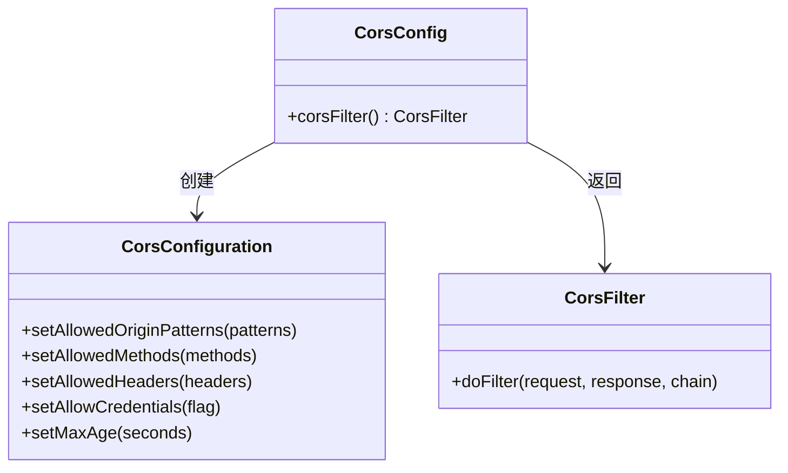
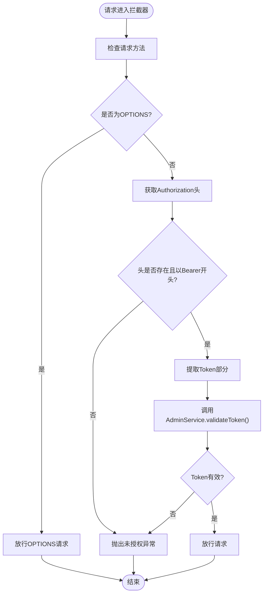
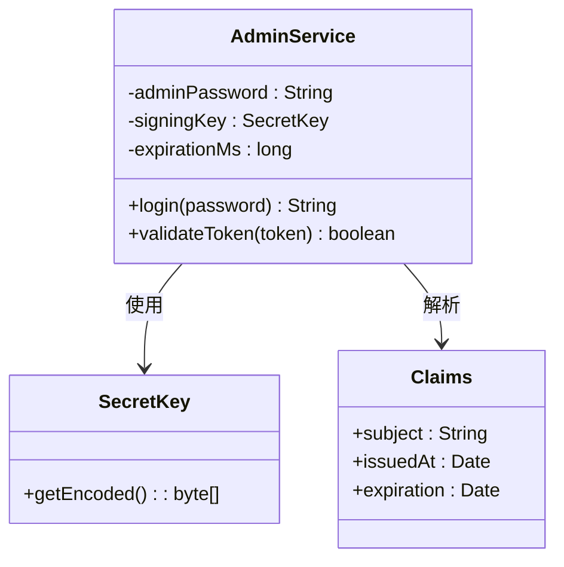
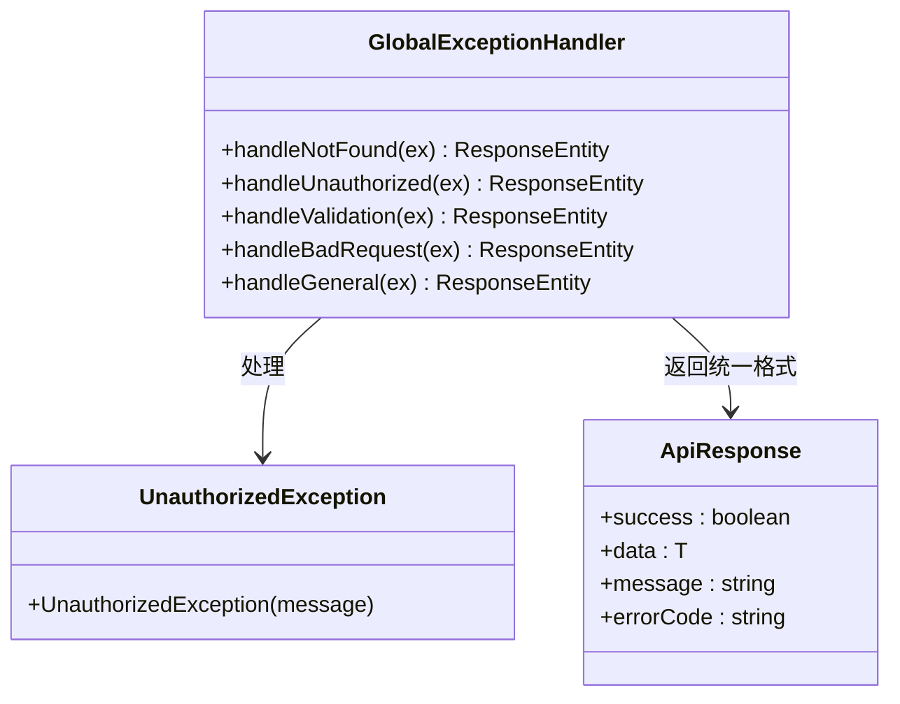
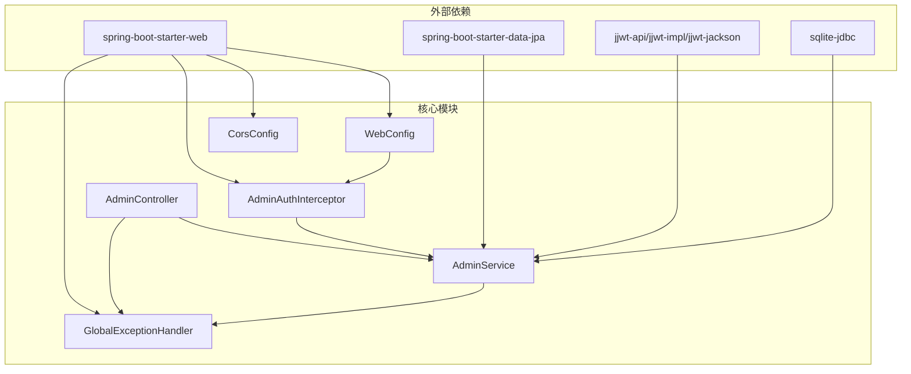

# Web配置与拦截器

<cite>
**本文档引用的文件**
- [WebConfig.java](file://backends/spring-boot/src/main/java/com/hellotime/config/WebConfig.java)
- [CorsConfig.java](file://backends/spring-boot/src/main/java/com/hellotime/config/CorsConfig.java)
- [AdminAuthInterceptor.java](file://backends/spring-boot/src/main/java/com/hellotime/config/AdminAuthInterceptor.java)
- [HelloTimeApplication.java](file://backends/spring-boot/src/main/java/com/hellotime/HelloTimeApplication.java)
- [AdminService.java](file://backends/spring-boot/src/main/java/com/hellotime/service/AdminService.java)
- [AdminController.java](file://backends/spring-boot/src/main/java/com/hellotime/controller/AdminController.java)
- [UnauthorizedException.java](file://backends/spring-boot/src/main/java/com/hellotime/exception/UnauthorizedException.java)
- [GlobalExceptionHandler.java](file://backends/spring-boot/src/main/java/com/hellotime/exception/GlobalExceptionHandler.java)
- [application.yml](file://backends/spring-boot/src/main/resources/application.yml)
- [pom.xml](file://backends/spring-boot/pom.xml)
- [ApiResponse.java](file://backends/spring-boot/src/main/java/com/hellotime/dto/ApiResponse.java)
- [AdminLoginRequest.java](file://backends/spring-boot/src/main/java/com/hellotime/dto/AdminLoginRequest.java)
</cite>

## 目录
1. [简介](#简介)
2. [项目结构](#项目结构)
3. [核心组件](#核心组件)
4. [架构概览](#架构概览)
5. [详细组件分析](#详细组件分析)
6. [依赖分析](#依赖分析)
7. [性能考虑](#性能考虑)
8. [故障排查指南](#故障排查指南)
9. [结论](#结论)
10. [附录](#附录)

## 简介
本文件深入解析Spring Boot Web配置与拦截器系统，重点涵盖以下方面：
- WebConfig类的WebMvcConfigurer实现，包括拦截器注册、静态资源处理策略等
- CorsConfig跨域配置类的设计，包括CORS策略配置、允许的源、方法、头信息等
- AdminAuthInterceptor管理员认证拦截器的实现原理，包括拦截规则、JWT token验证、权限检查逻辑
- 自定义拦截器开发指南、跨域问题排查方法、认证授权最佳实践和安全配置建议

该系统采用Spring Boot 3.2.5 + Spring MVC + JJWT实现，提供RESTful API服务，支持管理员认证、跨域访问控制以及统一异常处理。

## 项目结构
后端采用标准的Spring Boot目录结构，关键配置位于config包中，业务逻辑分布在controller、service、exception等包下。

**图表来源**
- [HelloTimeApplication.java:1-12](file://backends/spring-boot/src/main/java/com/hellotime/HelloTimeApplication.java#L1-L12)
- [WebConfig.java:1-32](file://backends/spring-boot/src/main/java/com/hellotime/config/WebConfig.java#L1-L32)

**章节来源**
- [HelloTimeApplication.java:1-12](file://backends/spring-boot/src/main/java/com/hellotime/HelloTimeApplication.java#L1-L12)
- [application.yml:1-22](file://backends/spring-boot/src/main/resources/application.yml#L1-L22)

## 核心组件
本系统的核心组件包括：
- WebConfig：Web MVC配置类，负责拦截器注册和视图控制器配置
- CorsConfig：跨域配置类，提供CORS过滤器配置
- AdminAuthInterceptor：管理员认证拦截器，基于JWT进行身份验证
- AdminService：管理员服务，提供JWT令牌生成和验证功能
- GlobalExceptionHandler：全局异常处理器，统一处理各类异常

**章节来源**
- [WebConfig.java:11-31](file://backends/spring-boot/src/main/java/com/hellotime/config/WebConfig.java#L11-L31)
- [CorsConfig.java:11-27](file://backends/spring-boot/src/main/java/com/hellotime/config/CorsConfig.java#L11-L27)
- [AdminAuthInterceptor.java:15-58](file://backends/spring-boot/src/main/java/com/hellotime/config/AdminAuthInterceptor.java#L15-L58)
- [AdminService.java:18-88](file://backends/spring-boot/src/main/java/com/hellotime/service/AdminService.java#L18-L88)
- [GlobalExceptionHandler.java:15-86](file://backends/spring-boot/src/main/java/com/hellotime/exception/GlobalExceptionHandler.java#L15-L86)

## 架构概览
系统采用分层架构设计，通过拦截器实现横切关注点，通过全局异常处理器保证一致的错误响应格式。

**图表来源**
- [WebConfig.java:25-30](file://backends/spring-boot/src/main/java/com/hellotime/config/WebConfig.java#L25-L30)
- [AdminAuthInterceptor.java:34-57](file://backends/spring-boot/src/main/java/com/hellotime/config/AdminAuthInterceptor.java#L34-L57)
- [GlobalExceptionHandler.java:37-41](file://backends/spring-boot/src/main/java/com/hellotime/exception/GlobalExceptionHandler.java#L37-L41)

## 详细组件分析

### WebConfig配置类分析
WebConfig实现了WebMvcConfigurer接口，主要负责拦截器的注册和配置。

**图表来源**
- [WebConfig.java:12-31](file://backends/spring-boot/src/main/java/com/hellotime/config/WebConfig.java#L12-L31)
- [AdminAuthInterceptor.java:16-58](file://backends/spring-boot/src/main/java/com/hellotime/config/AdminAuthInterceptor.java#L16-L58)

WebConfig的关键特性：
- **拦截器注册**：通过addInterceptors方法注册AdminAuthInterceptor
- **路径匹配**：使用addPathPatterns("/api/v1/admin/**")拦截所有管理员接口
- **排除规则**：使用excludePathPatterns排除登录接口，避免循环认证
- **依赖注入**：通过构造函数注入AdminAuthInterceptor实例

**章节来源**
- [WebConfig.java:14-30](file://backends/spring-boot/src/main/java/com/hellotime/config/WebConfig.java#L14-L30)

### CorsConfig跨域配置分析
CorsConfig提供了完整的CORS配置，确保前端应用能够正常访问后端API。

**图表来源**
- [CorsConfig.java:14-26](file://backends/spring-boot/src/main/java/com/hellotime/config/CorsConfig.java#L14-L26)

CorsConfig的核心配置：
- **允许的源**：使用通配符模式"http://localhost:*"支持本地开发环境
- **允许的方法**：GET、POST、PUT、DELETE、OPTIONS
- **允许的头**：使用通配符"*"允许所有头信息
- **凭证支持**：setAllowCredentials(true)允许携带Cookie
- **缓存时间**：setMaxAge(3600L)设置1小时的预检请求缓存

**章节来源**
- [CorsConfig.java:14-26](file://backends/spring-boot/src/main/java/com/hellotime/config/CorsConfig.java#L14-L26)

### AdminAuthInterceptor管理员认证拦截器分析
AdminAuthInterceptor实现了HandlerInterceptor接口，提供JWT令牌验证功能。

**图表来源**
- [AdminAuthInterceptor.java:34-57](file://backends/spring-boot/src/main/java/com/hellotime/config/AdminAuthInterceptor.java#L34-L57)

拦截器的处理流程：
1. **OPTIONS请求放行**：CORS预检请求直接放行
2. **Authorization头验证**：检查请求头是否存在且格式正确
3. **Token提取**：去除"Bearer "前缀获取实际Token
4. **Token验证**：调用AdminService.validateToken()验证JWT有效性
5. **异常处理**：任何验证失败都会抛出UnauthorizedException

**章节来源**
- [AdminAuthInterceptor.java:34-57](file://backends/spring-boot/src/main/java/com/hellotime/config/AdminAuthInterceptor.java#L34-L57)

### AdminService JWT服务分析
AdminService负责JWT令牌的生成和验证，使用JJWT库实现。

**图表来源**
- [AdminService.java:19-88](file://backends/spring-boot/src/main/java/com/hellotime/service/AdminService.java#L19-L88)

JWT配置细节：
- **签名算法**：HMAC-SHA256（由JJWT库自动选择）
- **密钥生成**：使用配置文件中的JWT_SECRET作为密钥材料
- **过期时间**：可配置，默认2小时
- **令牌结构**：包含sub、iat、exp声明

**章节来源**
- [AdminService.java:35-44](file://backends/spring-boot/src/main/java/com/hellotime/service/AdminService.java#L35-L44)
- [AdminService.java:75-87](file://backends/spring-boot/src/main/java/com/hellotime/service/AdminService.java#L75-L87)

### GlobalExceptionHandler全局异常处理分析
GlobalExceptionHandler提供统一的异常处理机制，确保API响应的一致性。

**图表来源**
- [GlobalExceptionHandler.java:16-86](file://backends/spring-boot/src/main/java/com/hellotime/exception/GlobalExceptionHandler.java#L16-L86)
- [UnauthorizedException.java:8-18](file://backends/spring-boot/src/main/java/com/hellotime/exception/UnauthorizedException.java#L8-18)

异常处理策略：
- **状态码映射**：401未授权、404未找到、400参数错误、500服务器错误
- **统一响应格式**：使用ApiResponse包装所有错误响应
- **错误码规范**：为每种错误类型分配唯一的错误码

**章节来源**
- [GlobalExceptionHandler.java:37-41](file://backends/spring-boot/src/main/java/com/hellotime/exception/GlobalExceptionHandler.java#L37-L41)

## 依赖分析
系统依赖关系清晰，遵循依赖倒置原则，各组件职责明确。

**图表来源**
- [pom.xml:25-72](file://backends/spring-boot/pom.xml#L25-L72)
- [WebConfig.java:14](file://backends/spring-boot/src/main/java/com/hellotime/config/WebConfig.java#L14)
- [AdminAuthInterceptor.java:18](file://backends/spring-boot/src/main/java/com/hellotime/config/AdminAuthInterceptor.java#L18)

**章节来源**
- [pom.xml:20-23](file://backends/spring-boot/pom.xml#L20-L23)
- [pom.xml:55-72](file://backends/spring-boot/pom.xml#L55-L72)

## 性能考虑
系统在设计时考虑了以下性能优化因素：
- **拦截器链路简单**：仅进行基本的JWT验证，避免复杂的业务逻辑
- **CORS预检缓存**：1小时的预检请求缓存减少重复的跨域检查
- **响应体压缩**：使用Jackson的@JsonInclude排除null字段，减少响应体积
- **数据库连接池**：Spring Boot自动配置合适的连接池参数

## 故障排查指南

### JWT认证问题排查
1. **Token格式错误**
   - 检查Authorization头是否以"Bearer "开头
   - 验证Token字符串是否完整，无额外空格

2. **Token过期问题**
   - 检查JWT_SECRET配置是否正确
   - 验证服务器时间同步情况
   - 确认expiration-hours配置值

3. **签名验证失败**
   - 确认使用相同的密钥生成和验证
   - 检查密钥长度是否满足HS256要求

### CORS跨域问题排查
1. **预检请求失败**
   - 检查浏览器开发者工具Network标签
   - 确认OPTIONS请求的响应头包含正确的CORS字段
   - 验证allowedOriginPatterns配置

2. **凭证传递问题**
   - 确认客户端设置了withCredentials选项
   - 检查服务端是否正确配置了allowCredentials

### 异常处理问题排查
1. **401未授权响应**
   - 检查异常处理器是否正确捕获UnauthorizedException
   - 验证ApiResponse的序列化配置

2. **500服务器错误**
   - 查看服务器日志获取完整堆栈信息
   - 确认全局异常处理器的兜底机制

**章节来源**
- [AdminAuthInterceptor.java:44-52](file://backends/spring-boot/src/main/java/com/hellotime/config/AdminAuthInterceptor.java#L44-L52)
- [GlobalExceptionHandler.java:37-41](file://backends/spring-boot/src/main/java/com/hellotime/exception/GlobalExceptionHandler.java#L37-L41)

## 结论
本Web配置与拦截器系统采用简洁而有效的架构设计，通过：
- 明确的分层架构和职责分离
- 基于JWT的轻量级认证机制
- 统一的异常处理和响应格式
- 完善的跨域支持

实现了高可用、易维护的RESTful API服务。系统设计充分考虑了开发效率和运行时性能，在保持安全性的同时提供了良好的扩展性。

## 附录

### 配置文件详解
application.yml包含以下关键配置：
- **数据库配置**：SQLite数据库连接，自动DDL更新
- **JWT配置**：密钥、过期时间等安全参数
- **应用配置**：管理员密码等业务参数

**章节来源**
- [application.yml:16-22](file://backends/spring-boot/src/main/resources/application.yml#L16-L22)

### API响应格式
所有API响应遵循统一的ApiResponse格式，包含success、data、message、errorCode字段，确保前后端交互的一致性。

**章节来源**
- [ApiResponse.java:15-55](file://backends/spring-boot/src/main/java/com/hellotime/dto/ApiResponse.java#L15-L55)