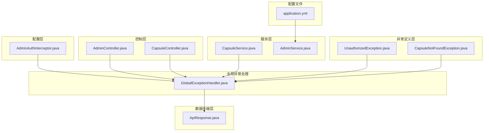
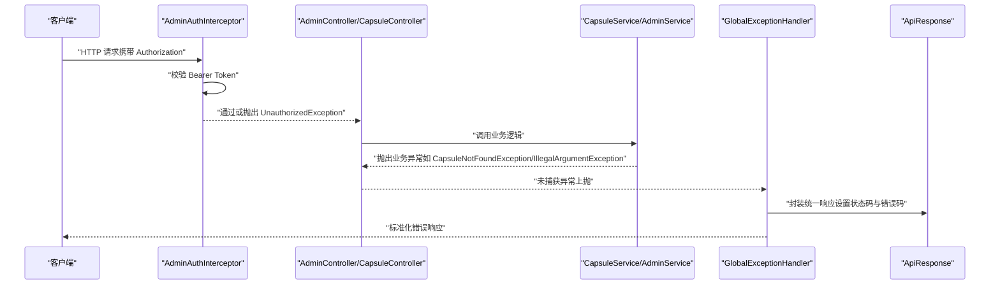
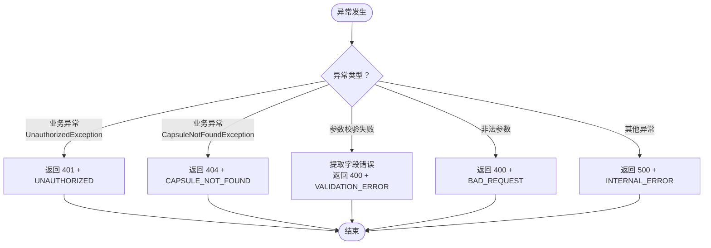
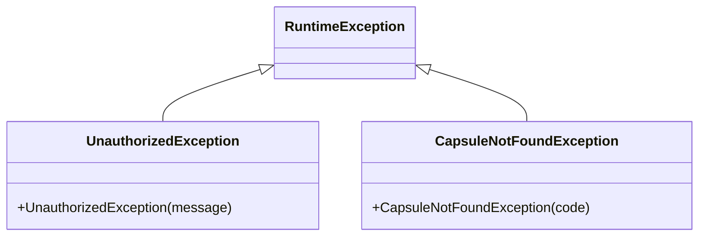
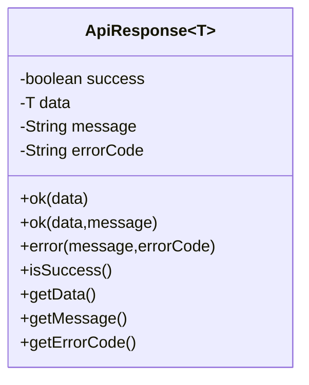
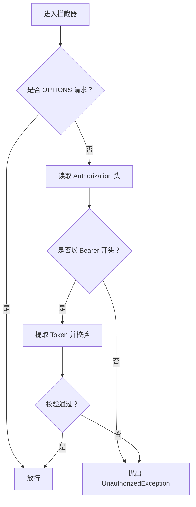
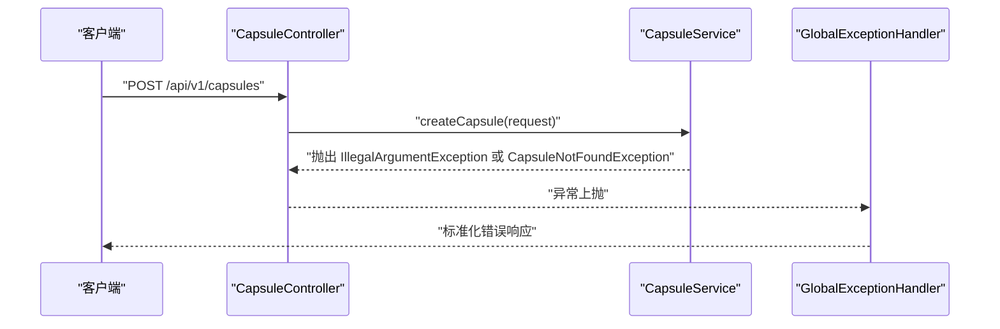
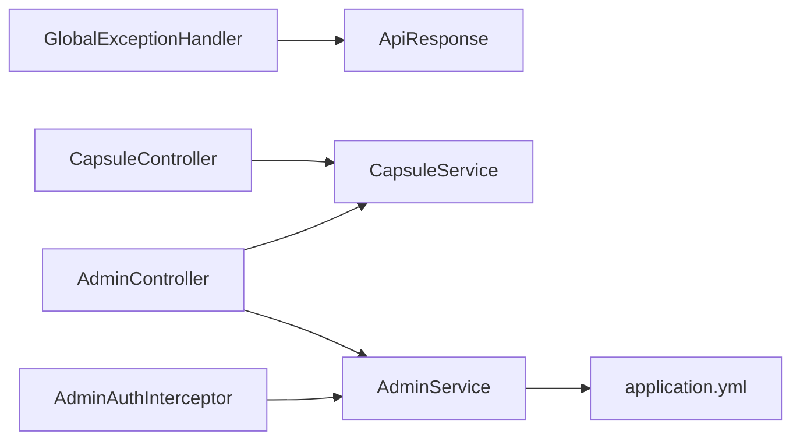

# 异常处理机制

<cite>
**本文引用的文件**
- [GlobalExceptionHandler.java](file://backends/spring-boot/src/main/java/com/hellotime/exception/GlobalExceptionHandler.java)
- [UnauthorizedException.java](file://backends/spring-boot/src/main/java/com/hellotime/exception/UnauthorizedException.java)
- [CapsuleNotFoundException.java](file://backends/spring-boot/src/main/java/com/hellotime/exception/CapsuleNotFoundException.java)
- [ApiResponse.java](file://backends/spring-boot/src/main/java/com/hellotime/dto/ApiResponse.java)
- [CapsuleController.java](file://backends/spring-boot/src/main/java/com/hellotime/controller/CapsuleController.java)
- [CapsuleService.java](file://backends/spring-boot/src/main/java/com/hellotime/service/CapsuleService.java)
- [AdminController.java](file://backends/spring-boot/src/main/java/com/hellotime/controller/AdminController.java)
- [AdminAuthInterceptor.java](file://backends/spring-boot/src/main/java/com/hellotime/config/AdminAuthInterceptor.java)
- [AdminService.java](file://backends/spring-boot/src/main/java/com/hellotime/service/AdminService.java)
- [application.yml](file://backends/spring-boot/src/main/resources/application.yml)
- [CapsuleControllerTest.java](file://backends/spring-boot/src/test/java/com/hellotime/controller/CapsuleControllerTest.java)
</cite>

## 目录
1. [简介](#简介)
2. [项目结构](#项目结构)
3. [核心组件](#核心组件)
4. [架构总览](#架构总览)
5. [详细组件分析](#详细组件分析)
6. [依赖分析](#依赖分析)
7. [性能考量](#性能考量)
8. [故障排查指南](#故障排查指南)
9. [结论](#结论)
10. [附录](#附录)

## 简介
本文件系统性梳理 Spring Boot 后端的时间胶囊项目的异常处理机制，重点覆盖：
- 全局异常处理架构：基于 @RestControllerAdvice 的统一异常捕获与响应格式标准化
- 异常分类与处理策略：针对业务异常、参数校验异常、非法参数异常与兜底异常的处理
- 自定义异常类设计：UnauthorizedException、CapsuleNotFoundException 等的继承体系与语义表达
- 最佳实践：异常分类策略、错误码设计、国际化、调试信息控制与安全考虑
- 测试与监控：异常处理测试编写思路、监控告警集成建议与故障排查流程

## 项目结构
Spring Boot 异常处理相关模块分布如下：
- 异常定义层：exception 包下定义业务异常与全局异常处理器
- 数据传输层：dto 包下的 ApiResponse 统一响应包装
- 控制层：controller 包下的控制器负责业务入口与参数校验
- 服务层：service 包下的业务逻辑抛出受控异常
- 配置层：config 包下的拦截器负责认证阶段的异常抛出
- 配置文件：application.yml 提供运行时配置（如 JWT 密钥、过期时间）

图表来源
- [GlobalExceptionHandler.java:15-86](file://backends/spring-boot/src/main/java/com/hellotime/exception/GlobalExceptionHandler.java#L15-L86)
- [UnauthorizedException.java:8-18](file://backends/spring-boot/src/main/java/com/hellotime/exception/UnauthorizedException.java#L8-L18)
- [CapsuleNotFoundException.java:8-18](file://backends/spring-boot/src/main/java/com/hellotime/exception/CapsuleNotFoundException.java#L8-L18)
- [ApiResponse.java:15-67](file://backends/spring-boot/src/main/java/com/hellotime/dto/ApiResponse.java#L15-L67)
- [CapsuleController.java:17-56](file://backends/spring-boot/src/main/java/com/hellotime/controller/CapsuleController.java#L17-L56)
- [AdminController.java:16-77](file://backends/spring-boot/src/main/java/com/hellotime/controller/AdminController.java#L16-L77)
- [CapsuleService.java:23-194](file://backends/spring-boot/src/main/java/com/hellotime/service/CapsuleService.java#L23-L194)
- [AdminAuthInterceptor.java:16-58](file://backends/spring-boot/src/main/java/com/hellotime/config/AdminAuthInterceptor.java#L16-L58)
- [AdminService.java:19-88](file://backends/spring-boot/src/main/java/com/hellotime/service/AdminService.java#L19-L88)
- [application.yml:16-22](file://backends/spring-boot/src/main/resources/application.yml#L16-L22)

章节来源
- [GlobalExceptionHandler.java:15-86](file://backends/spring-boot/src/main/java/com/hellotime/exception/GlobalExceptionHandler.java#L15-L86)
- [application.yml:16-22](file://backends/spring-boot/src/main/resources/application.yml#L16-L22)

## 核心组件
- 全局异常处理器：统一捕获各类异常，标准化响应格式与状态码
- 自定义异常类：业务语义明确的异常类型，便于分类处理与前端识别
- 统一响应包装：ApiResponse 提供统一的成功/失败结构，支持错误码与消息
- 认证拦截器：在进入控制器前进行 Token 校验，校验失败抛出未授权异常
- 业务服务：在业务规则不满足时抛出受控异常，交由全局处理器处理

章节来源
- [GlobalExceptionHandler.java:15-86](file://backends/spring-boot/src/main/java/com/hellotime/exception/GlobalExceptionHandler.java#L15-L86)
- [UnauthorizedException.java:8-18](file://backends/spring-boot/src/main/java/com/hellotime/exception/UnauthorizedException.java#L8-L18)
- [CapsuleNotFoundException.java:8-18](file://backends/spring-boot/src/main/java/com/hellotime/exception/CapsuleNotFoundException.java#L8-L18)
- [ApiResponse.java:15-67](file://backends/spring-boot/src/main/java/com/hellotime/dto/ApiResponse.java#L15-L67)
- [AdminAuthInterceptor.java:34-57](file://backends/spring-boot/src/main/java/com/hellotime/config/AdminAuthInterceptor.java#L34-L57)
- [CapsuleService.java:79-115](file://backends/spring-boot/src/main/java/com/hellotime/service/CapsuleService.java#L79-L115)

## 架构总览
全局异常处理采用 Spring MVC 的 @RestControllerAdvice 机制，在控制器层抛出的异常被统一捕获并转换为标准响应。认证拦截器在控制器之前进行 Token 校验，失败即抛出未授权异常；业务服务在参数或业务规则不满足时抛出相应异常；全局处理器根据异常类型返回对应的状态码与错误码。

图表来源
- [AdminAuthInterceptor.java:34-57](file://backends/spring-boot/src/main/java/com/hellotime/config/AdminAuthInterceptor.java#L34-L57)
- [AdminController.java:39-46](file://backends/spring-boot/src/main/java/com/hellotime/controller/AdminController.java#L39-L46)
- [CapsuleController.java:37-42](file://backends/spring-boot/src/main/java/com/hellotime/controller/CapsuleController.java#L37-L42)
- [CapsuleService.java:79-115](file://backends/spring-boot/src/main/java/com/hellotime/service/CapsuleService.java#L79-L115)
- [GlobalExceptionHandler.java:24-85](file://backends/spring-boot/src/main/java/com/hellotime/exception/GlobalExceptionHandler.java#L24-L85)
- [ApiResponse.java:49-55](file://backends/spring-boot/src/main/java/com/hellotime/dto/ApiResponse.java#L49-L55)

## 详细组件分析

### 全局异常处理器（GlobalExceptionHandler）
- 职责：统一捕获并处理各类异常，输出标准化响应
- 处理策略：
  - 业务异常：如胶囊未找到、未授权访问，返回对应状态码与错误码
  - 参数校验异常：MethodArgumentNotValidException，提取字段级错误并拼接为统一消息
  - 非法参数异常：IllegalArgumentException，返回 400 与错误码
  - 兜底异常：Exception，返回 500 与通用错误码，避免泄露堆栈细节
- 响应格式：使用 ApiResponse.error(...) 统一包装，包含 success=false、message、errorCode

图表来源
- [GlobalExceptionHandler.java:24-85](file://backends/spring-boot/src/main/java/com/hellotime/exception/GlobalExceptionHandler.java#L24-L85)
- [ApiResponse.java:49-55](file://backends/spring-boot/src/main/java/com/hellotime/dto/ApiResponse.java#L49-L55)

章节来源
- [GlobalExceptionHandler.java:15-86](file://backends/spring-boot/src/main/java/com/hellotime/exception/GlobalExceptionHandler.java#L15-L86)

### 自定义异常类
- UnauthorizedException：未授权访问异常，用于认证失败场景
- CapsuleNotFoundException：胶囊未找到异常，用于查询不存在的胶囊码
- 设计要点：继承 RuntimeException，构造函数传递业务语义消息，便于全局处理器映射与前端展示

图表来源
- [UnauthorizedException.java:8-18](file://backends/spring-boot/src/main/java/com/hellotime/exception/UnauthorizedException.java#L8-L18)
- [CapsuleNotFoundException.java:8-18](file://backends/spring-boot/src/main/java/com/hellotime/exception/CapsuleNotFoundException.java#L8-L18)

章节来源
- [UnauthorizedException.java:8-18](file://backends/spring-boot/src/main/java/com/hellotime/exception/UnauthorizedException.java#L8-L18)
- [CapsuleNotFoundException.java:8-18](file://backends/spring-boot/src/main/java/com/hellotime/exception/CapsuleNotFoundException.java#L8-L18)

### 统一响应包装（ApiResponse）
- 结构：success、data、message、errorCode
- 工具方法：ok(...) 成功响应；error(...) 失败响应
- 行为：序列化时忽略 null 字段，减少响应体积

图表来源
- [ApiResponse.java:15-67](file://backends/spring-boot/src/main/java/com/hellotime/dto/ApiResponse.java#L15-L67)

章节来源
- [ApiResponse.java:15-67](file://backends/spring-boot/src/main/java/com/hellotime/dto/ApiResponse.java#L15-L67)

### 认证拦截器（AdminAuthInterceptor）
- 职责：在控制器前校验 Authorization 头中的 Bearer Token
- 异常触发：缺失令牌、格式不正确、签名无效或过期时抛出 UnauthorizedException
- 放行条件：OPTIONS 预检请求直接放行

图表来源
- [AdminAuthInterceptor.java:34-57](file://backends/spring-boot/src/main/java/com/hellotime/config/AdminAuthInterceptor.java#L34-L57)

章节来源
- [AdminAuthInterceptor.java:16-58](file://backends/spring-boot/src/main/java/com/hellotime/config/AdminAuthInterceptor.java#L16-L58)

### 业务服务与控制器
- CapsuleService：在业务规则不满足时抛出受控异常（如非法参数、胶囊不存在）
- CapsuleController：负责参数校验（@Valid）与响应封装
- AdminController：登录接口在密码错误时抛出未授权异常

图表来源
- [CapsuleController.java:37-42](file://backends/spring-boot/src/main/java/com/hellotime/controller/CapsuleController.java#L37-L42)
- [CapsuleService.java:48-83](file://backends/spring-boot/src/main/java/com/hellotime/service/CapsuleService.java#L48-L83)
- [GlobalExceptionHandler.java:68-85](file://backends/spring-boot/src/main/java/com/hellotime/exception/GlobalExceptionHandler.java#L68-L85)

章节来源
- [CapsuleController.java:17-56](file://backends/spring-boot/src/main/java/com/hellotime/controller/CapsuleController.java#L17-L56)
- [CapsuleService.java:23-194](file://backends/spring-boot/src/main/java/com/hellotime/service/CapsuleService.java#L23-L194)
- [AdminController.java:39-46](file://backends/spring-boot/src/main/java/com/hellotime/controller/AdminController.java#L39-L46)

## 依赖分析
- 全局异常处理器依赖 ApiResponse 统一响应结构
- 控制器依赖服务层业务逻辑，服务层抛出受控异常
- 认证拦截器依赖 AdminService 的 Token 校验能力
- 配置文件提供 JWT 密钥与过期时间，影响拦截器与服务层行为

图表来源
- [GlobalExceptionHandler.java:15-86](file://backends/spring-boot/src/main/java/com/hellotime/exception/GlobalExceptionHandler.java#L15-L86)
- [CapsuleController.java:17-56](file://backends/spring-boot/src/main/java/com/hellotime/controller/CapsuleController.java#L17-L56)
- [AdminController.java:16-77](file://backends/spring-boot/src/main/java/com/hellotime/controller/AdminController.java#L16-L77)
- [AdminAuthInterceptor.java:16-58](file://backends/spring-boot/src/main/java/com/hellotime/config/AdminAuthInterceptor.java#L16-L58)
- [AdminService.java:19-88](file://backends/spring-boot/src/main/java/com/hellotime/service/AdminService.java#L19-L88)
- [application.yml:16-22](file://backends/spring-boot/src/main/resources/application.yml#L16-L22)

章节来源
- [application.yml:16-22](file://backends/spring-boot/src/main/resources/application.yml#L16-L22)

## 性能考量
- 响应体积优化：ApiResponse 使用 JSON 序列化时忽略 null 字段，降低网络传输开销
- 异常处理成本：全局处理器仅做轻量映射与封装，避免复杂计算；参数校验异常提取字段错误采用流式拼接，注意在高并发下避免过多字符串拼接
- 日志记录：建议在全局处理器中增加结构化日志记录（如错误码、异常类型、请求上下文），便于监控与审计

## 故障排查指南
- 400 参数校验失败：检查请求体字段与校验注解，确认错误码 VALIDATION_ERROR 对应的具体字段
- 401 未授权：确认 Authorization 头格式为 Bearer Token，检查 Token 是否有效、是否过期
- 404 胶囊不存在：确认查询的 8 位胶囊码是否存在，核对业务逻辑中是否正确抛出 CapsuleNotFoundException
- 500 内部错误：查看服务端日志，定位兜底异常处理路径，避免将敏感堆栈信息返回给客户端
- 单元测试参考：通过 MockMvc 验证各异常路径的响应状态与错误码，确保异常处理链路完整

章节来源
- [CapsuleControllerTest.java:30-92](file://backends/spring-boot/src/test/java/com/hellotime/controller/CapsuleControllerTest.java#L30-L92)

## 结论
该异常处理机制通过全局异常处理器实现了统一的异常捕获与响应格式标准化，结合自定义异常类与拦截器，形成了清晰的异常分类与处理策略。配合 ApiResponse 的统一封装与测试用例，能够有效提升系统的可维护性与可观测性。建议后续在日志与监控方面进一步完善，以支撑生产环境的稳定运行。

## 附录
- 错误码清单（示例）
  - UNAUTHORIZED：认证失败
  - CAPSULE_NOT_FOUND：胶囊不存在
  - VALIDATION_ERROR：参数校验失败
  - BAD_REQUEST：非法参数
  - INTERNAL_ERROR：服务器内部错误
- 国际化建议：将 message 字段替换为键值，结合 Spring MessageSource 实现多语言错误提示
- 安全建议：严格控制异常信息输出，避免泄露内部实现细节；对认证失败与业务异常进行差异化日志记录与告警