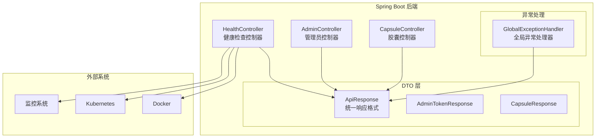
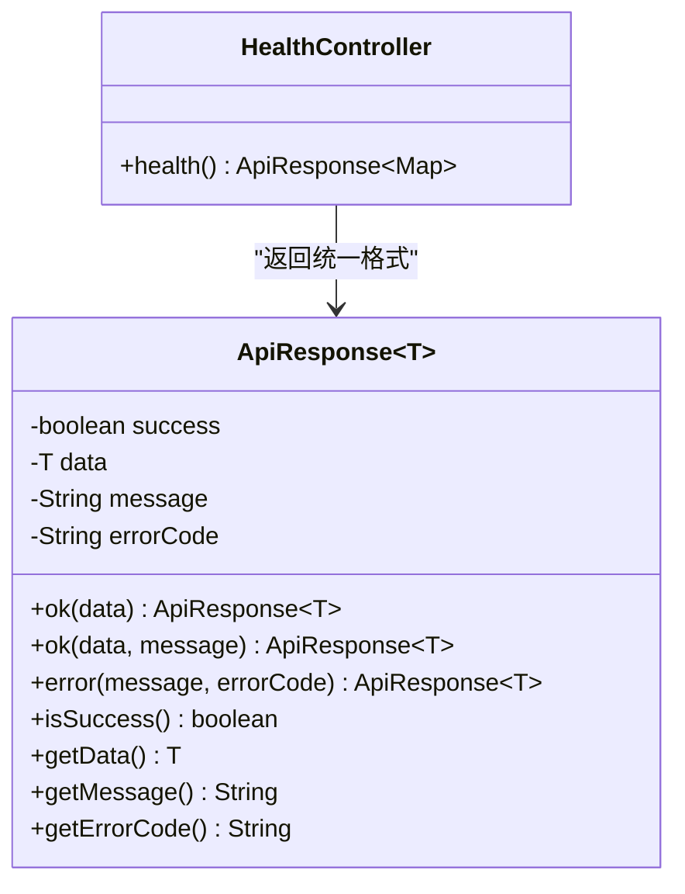
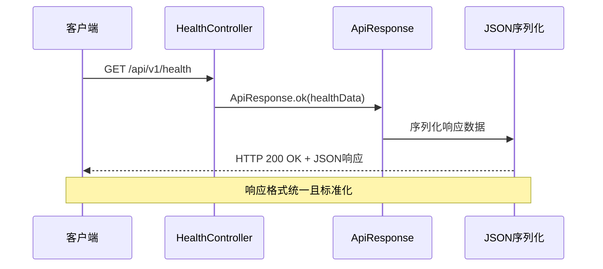
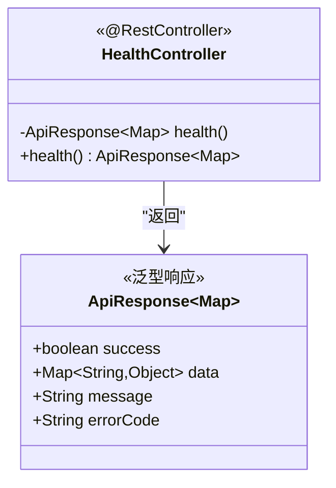
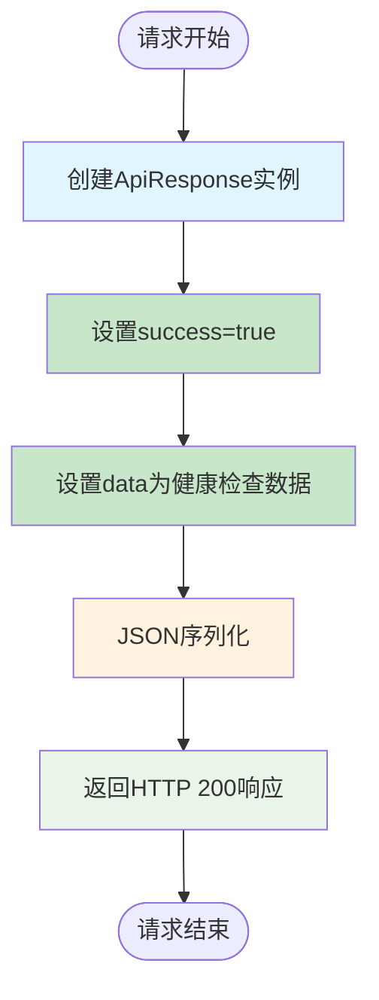
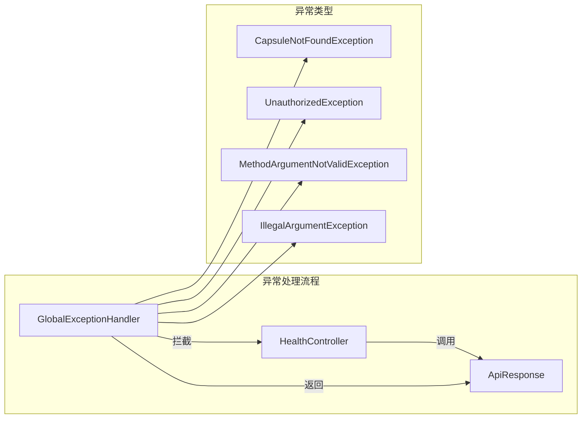
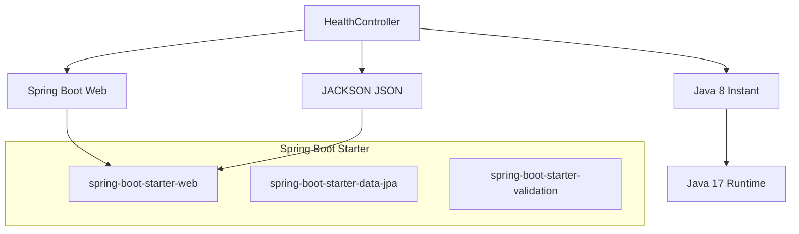
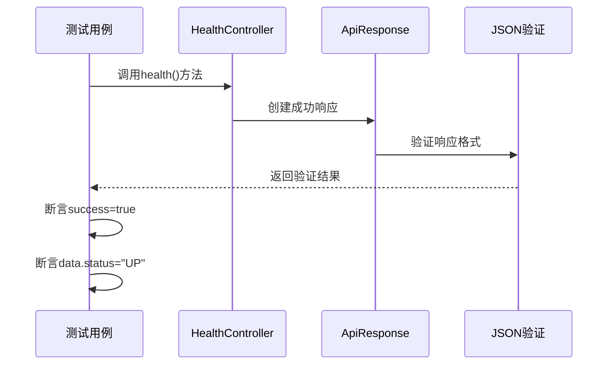

# 健康检查控制器

<cite>
**本文档引用的文件**
- [HealthController.java](file://backends/spring-boot/src/main/java/com/hellotime/controller/HealthController.java)
- [ApiResponse.java](file://backends/spring-boot/src/main/java/com/hellotime/dto/ApiResponse.java)
- [HelloTimeApplication.java](file://backends/spring-boot/src/main/java/com/hellotime/HelloTimeApplication.java)
- [application.yml](file://backends/spring-boot/src/main/resources/application.yml)
- [pom.xml](file://backends/spring-boot/pom.xml)
- [CapsuleControllerTest.java](file://backends/spring-boot/src/test/java/com/hellotime/controller/CapsuleControllerTest.java)
- [AdminController.java](file://backends/spring-boot/src/main/java/com/hellotime/controller/AdminController.java)
- [GlobalExceptionHandler.java](file://backends/spring-boot/src/main/java/com/hellotime/exception/GlobalExceptionHandler.java)
- [README.md](file://backends/spring-boot/README.md)
- [health.py](file://backends/fastapi/app/routers/health.py)
- [schemas.py](file://backends/fastapi/app/schemas.py)
</cite>

## 目录
1. [简介](#简介)
2. [项目结构](#项目结构)
3. [核心组件](#核心组件)
4. [架构概览](#架构概览)
5. [详细组件分析](#详细组件分析)
6. [依赖关系分析](#依赖关系分析)
7. [性能考虑](#性能考虑)
8. [故障排查指南](#故障排查指南)
9. [最佳实践](#最佳实践)
10. [结论](#结论)

## 简介

健康检查控制器是时间胶囊应用后端服务的重要组成部分，负责提供系统健康状态的实时监控接口。该控制器采用Spring Boot框架实现，通过RESTful API向外部系统和监控平台提供标准化的健康检查服务。

本控制器的核心职责包括：
- 提供系统运行状态的实时检查接口
- 返回包含技术栈信息的健康报告
- 支持容器编排平台的健康检查需求
- 与其他监控系统的集成能力

## 项目结构

时间胶囊应用采用分层架构设计，健康检查控制器位于controller层，与业务控制器（如胶囊控制器、管理员控制器）并列存在。



**图表来源**
- [HealthController.java:1-28](file://backends/spring-boot/src/main/java/com/hellotime/controller/HealthController.java#L1-L28)
- [AdminController.java:1-78](file://backends/spring-boot/src/main/java/com/hellotime/controller/AdminController.java#L1-L78)
- [ApiResponse.java:1-68](file://backends/spring-boot/src/main/java/com/hellotime/dto/ApiResponse.java#L1-L68)

**章节来源**
- [HealthController.java:1-28](file://backends/spring-boot/src/main/java/com/hellotime/controller/HealthController.java#L1-L28)
- [HelloTimeApplication.java:1-12](file://backends/spring-boot/src/main/java/com/hellotime/HelloTimeApplication.java#L1-L12)

## 核心组件

### HealthController 设计架构

HealthController类采用了Spring MVC的注解驱动开发模式，通过以下关键注解实现RESTful API：

- **@RestController**: 将控制器标记为RESTful服务端点，自动将返回值序列化为JSON格式
- **@RequestMapping("/api/v1")**: 定义控制器的基础路径前缀，确保所有子路径都以/api/v1开头
- **@GetMapping("/health")**: 映射HTTP GET请求到health()方法，提供健康检查端点

### ApiResponse 统一响应格式

ApiResponse类作为统一响应包装器，确保所有API接口返回一致的数据结构：



**图表来源**
- [ApiResponse.java:15-68](file://backends/spring-boot/src/main/java/com/hellotime/dto/ApiResponse.java#L15-L68)
- [HealthController.java:15-26](file://backends/spring-boot/src/main/java/com/hellotime/controller/HealthController.java#L15-L26)

**章节来源**
- [HealthController.java:11-26](file://backends/spring-boot/src/main/java/com/hellotime/controller/HealthController.java#L11-L26)
- [ApiResponse.java:15-68](file://backends/spring-boot/src/main/java/com/hellotime/dto/ApiResponse.java#L15-L68)

## 架构概览

健康检查控制器在整个系统架构中的位置和作用如下：



**图表来源**
- [HealthController.java:15-26](file://backends/spring-boot/src/main/java/com/hellotime/controller/HealthController.java#L15-L26)
- [ApiResponse.java:28-55](file://backends/spring-boot/src/main/java/com/hellotime/dto/ApiResponse.java#L28-L55)

### 技术栈集成

健康检查接口集成了以下核心技术组件：

| 组件 | 版本 | 用途 | 配置位置 |
|------|------|------|----------|
| Spring Boot | 3.2.5 | Web框架 | pom.xml |
| Java | 17 | 开发语言 | pom.xml |
| SQLite | 3.45.3.0 | 数据库 | application.yml |
| Jackson | 自带 | JSON序列化 | Spring Boot |

**章节来源**
- [pom.xml:20-23](file://backends/spring-boot/pom.xml#L20-L23)
- [application.yml:4-11](file://backends/spring-boot/src/main/resources/application.yml#L4-L11)

## 详细组件分析

### HealthController 类实现分析

#### 类结构设计

HealthController类采用简洁的设计模式，专注于单一职责——提供健康检查服务：



**图表来源**
- [HealthController.java:13-26](file://backends/spring-boot/src/main/java/com/hellotime/controller/HealthController.java#L13-L26)
- [ApiResponse.java:16-26](file://backends/spring-boot/src/main/java/com/hellotime/dto/ApiResponse.java#L16-L26)

#### health() 方法实现逻辑

health()方法的实现体现了简洁而高效的编程原则：

**响应数据结构设计**：
- **status**: 系统运行状态，固定返回"UP"
- **timestamp**: UTC时间戳，使用Instant.now()获取当前时间
- **techStack**: 技术栈信息，包含框架版本、语言版本、数据库类型

**状态信息返回机制**：
- 采用静态常量"UP"表示系统正常运行
- 便于监控系统识别和处理健康状态
- 符合业界标准的健康检查约定

**时间戳处理策略**：
- 使用Java 8的Instant类获取高精度时间
- 自动转换为ISO 8601格式字符串
- 确保全球时区的一致性

**技术栈信息展示**：
- 框架版本：Spring Boot 3.2.5
- 语言版本：Java 17
- 数据库类型：SQLite

**章节来源**
- [HealthController.java:16-26](file://backends/spring-boot/src/main/java/com/hellotime/controller/HealthController.java#L16-L26)

### ApiResponse 统一响应格式详解

#### 响应格式规范

ApiResponse类实现了统一的响应格式，确保前后端交互的一致性：



**图表来源**
- [ApiResponse.java:28-44](file://backends/spring-boot/src/main/java/com/hellotime/dto/ApiResponse.java#L28-L44)
- [HealthController.java:16-26](file://backends/spring-boot/src/main/java/com/hellotime/controller/HealthController.java#L16-L26)

#### 状态码设置机制

ApiResponse类提供了多种静态工厂方法来创建不同类型的响应：

- **ok(data)**: 创建成功响应，success字段设为true
- **ok(data, message)**: 创建带消息的成功响应
- **error(message, errorCode)**: 创建失败响应

这种设计确保了响应格式的标准化和一致性。

**章节来源**
- [ApiResponse.java:27-55](file://backends/spring-boot/src/main/java/com/hellotime/dto/ApiResponse.java#L27-L55)

### 错误处理机制

虽然健康检查接口相对简单，但整个应用的错误处理机制同样重要：



**图表来源**
- [GlobalExceptionHandler.java:24-85](file://backends/spring-boot/src/main/java/com/hellotime/exception/GlobalExceptionHandler.java#L24-L85)

**章节来源**
- [GlobalExceptionHandler.java:15-87](file://backends/spring-boot/src/main/java/com/hellotime/exception/GlobalExceptionHandler.java#L15-L87)

## 依赖关系分析

### 外部依赖关系

健康检查控制器的依赖关系相对简单，主要依赖于Spring Boot框架的核心功能：



**图表来源**
- [pom.xml:25-42](file://backends/spring-boot/pom.xml#L25-L42)
- [HealthController.java:3-6](file://backends/spring-boot/src/main/java/com/hellotime/controller/HealthController.java#L3-L6)

### 内部模块依赖

健康检查控制器与应用其他模块的关系：

| 依赖模块 | 用途 | 影响范围 |
|----------|------|----------|
| controller | 控制器基类 | HTTP请求处理 |
| dto | 数据传输对象 | 响应格式定义 |
| exception | 异常处理 | 错误响应处理 |

**章节来源**
- [pom.xml:25-79](file://backends/spring-boot/pom.xml#L25-L79)

## 性能考虑

### 响应时间优化

健康检查接口的性能特点：

- **零数据库查询**: 健康检查不涉及任何数据库操作
- **内存计算**: 所有响应数据都在内存中生成
- **快速响应**: 通常在毫秒级别内完成响应

### 内存使用分析

健康检查响应的数据结构设计考虑了内存效率：

- **轻量级数据**: 包含状态、时间戳和技术栈信息
- **不可变对象**: 使用Map.of()创建不可变映射
- **最小化序列化**: 仅包含必要的字段

### 并发处理能力

Spring Boot的异步处理机制确保了健康检查的高并发能力：

- **线程安全**: 响应数据不包含可变状态
- **无状态设计**: 每个请求独立处理
- **自动扩展**: 支持多实例部署

## 故障排查指南

### 常见问题诊断

#### 健康检查失败排查

1. **网络连接问题**
   - 检查端口8080是否被占用
   - 验证防火墙设置
   - 确认Docker容器端口映射

2. **应用启动问题**
   - 查看应用日志输出
   - 检查数据库连接配置
   - 验证环境变量设置

3. **响应格式异常**
   - 确认JSON序列化配置
   - 检查ApiResponse类的实现
   - 验证Jackson依赖版本

#### 监控集成问题

- **Kubernetes探针配置**: 确认livenessProbe和readinessProbe设置
- **Docker健康检查**: 验证HEALTHCHECK指令配置
- **负载均衡器**: 检查后端服务器健康检查配置

**章节来源**
- [CapsuleControllerTest.java:30-36](file://backends/spring-boot/src/test/java/com/hellotime/controller/CapsuleControllerTest.java#L30-L36)

### 测试验证方法

单元测试确保健康检查功能的正确性：



**图表来源**
- [CapsuleControllerTest.java:30-36](file://backends/spring-boot/src/test/java/com/hellotime/controller/CapsuleControllerTest.java#L30-L36)

**章节来源**
- [CapsuleControllerTest.java:30-36](file://backends/spring-boot/src/test/java/com/hellotime/controller/CapsuleControllerTest.java#L30-L36)

## 最佳实践

### 监控指标设计

#### 健康检查指标建议

| 指标类型 | 指标名称 | 描述 | 更新频率 |
|----------|----------|------|----------|
| 系统状态 | status | UP/DOWN | 每次请求 |
| 时间戳 | timestamp | UTC时间 | 每次请求 |
| 响应时间 | response_time_ms | 健康检查耗时 | 每次请求 |
| 内存使用 | heap_used_mb | JVM堆内存使用 | 定时采样 |
| 数据库连接 | db_connections | 数据库连接数 | 定时采样 |

#### 监控告警阈值

- **响应时间**: >500ms 告警，>2000ms 严重
- **系统状态**: DOWN 立即告警
- **内存使用**: >80% 告警，>90% 严重
- **数据库连接**: >90% 告警，>95% 严重

### 性能评估方法

#### 健康检查性能基准

| 指标 | 建议值 | 测试方法 |
|------|--------|----------|
| P95响应时间 | <100ms | 压力测试工具 |
| QPS | >1000 | 基准测试 |
| 内存峰值 | <50MB | 监控工具 |
| CPU使用率 | <10% | 系统监控 |

#### 性能优化建议

1. **缓存策略**: 对静态技术栈信息进行缓存
2. **连接池优化**: 配置合适的数据库连接池
3. **GC调优**: 根据应用特点调整JVM参数
4. **资源限制**: 设置合理的容器资源限制

### 故障排查方法

#### 日志分析技巧

1. **请求追踪**: 使用MDC添加请求ID
2. **性能分析**: 记录关键操作的执行时间
3. **错误分类**: 区分系统错误和业务错误
4. **告警聚合**: 避免重复告警的噪音

#### 排障工具推荐

- **APM工具**: New Relic、AppDynamics
- **日志分析**: ELK Stack、Grafana Loki
- **性能监控**: Prometheus + Grafana
- **分布式追踪**: Jaeger、Zipkin

### 部署最佳实践

#### 容器化部署

```yaml
# Docker Compose 示例
version: '3.8'
services:
  hellotime:
    image: hellotime-backend:latest
    ports:
      - "8080:8080"
    healthcheck:
      test: ["CMD", "curl", "-f", "http://localhost:8080/api/v1/health"]
      interval: 30s
      timeout: 10s
      retries: 3
    restart: unless-stopped
```

#### Kubernetes 配置

```yaml
# Kubernetes Deployment 示例
apiVersion: apps/v1
kind: Deployment
metadata:
  name: hellotime-deployment
spec:
  template:
    spec:
      containers:
      - name: hellotime
        livenessProbe:
          httpGet:
            path: /api/v1/health
            port: 8080
          initialDelaySeconds: 30
          periodSeconds: 10
        readinessProbe:
          httpGet:
            path: /api/v1/health
            port: 8080
          initialDelaySeconds: 5
          periodSeconds: 5
```

## 结论

健康检查控制器作为时间胶囊应用的重要组成部分，展现了现代微服务架构的最佳实践。通过简洁的设计、标准化的响应格式和完善的错误处理机制，该控制器为系统的稳定运行提供了可靠保障。

### 主要优势

1. **设计简洁**: 采用最少代码实现最大功能
2. **响应标准化**: 统一的JSON响应格式便于集成
3. **性能优异**: 内存计算，响应速度快
4. **易于监控**: 标准化的健康检查接口
5. **扩展性强**: 为未来的监控和运维提供基础

### 发展方向

随着应用规模的增长，健康检查控制器可以进一步完善：

1. **指标丰富化**: 添加更多系统运行指标
2. **智能告警**: 基于机器学习的异常检测
3. **分布式追踪**: 完整的请求链路追踪
4. **自愈能力**: 自动化的故障恢复机制

通过持续优化和改进，健康检查控制器将继续为时间胶囊应用的稳定运行保驾护航。