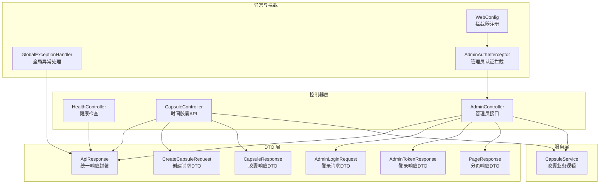
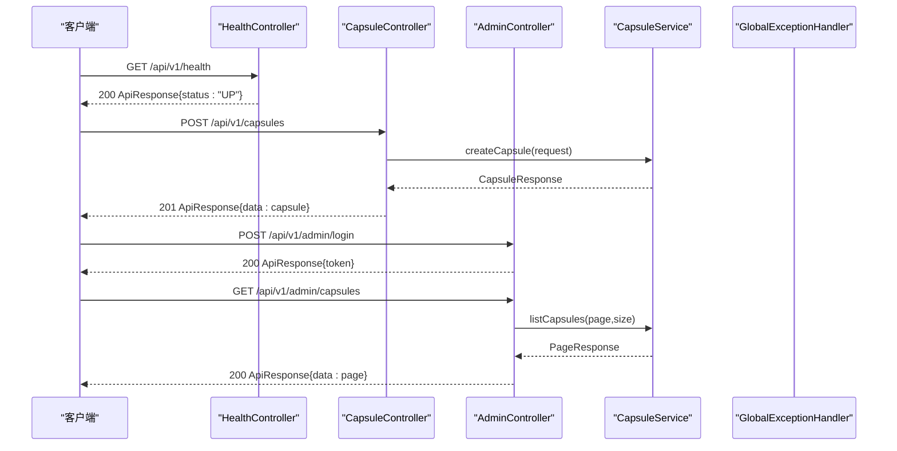
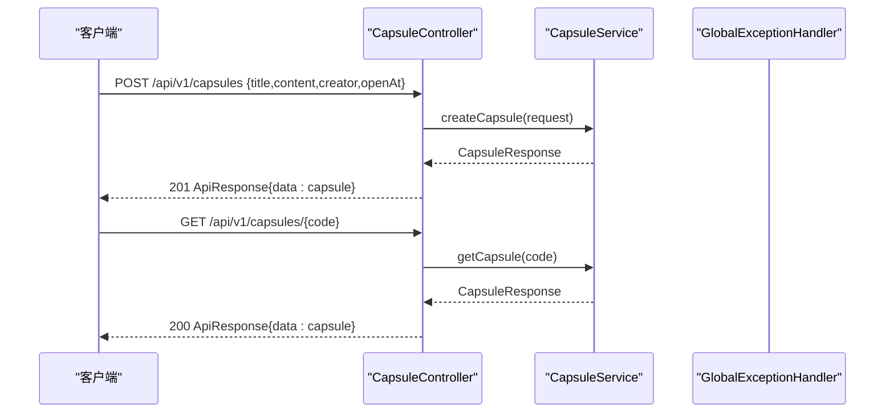
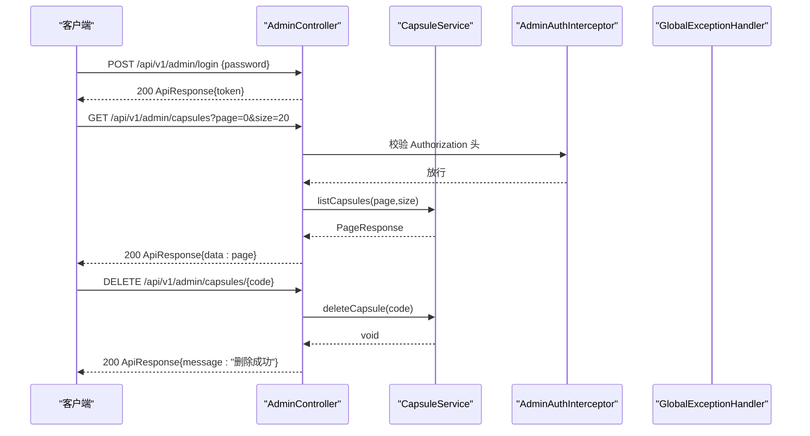
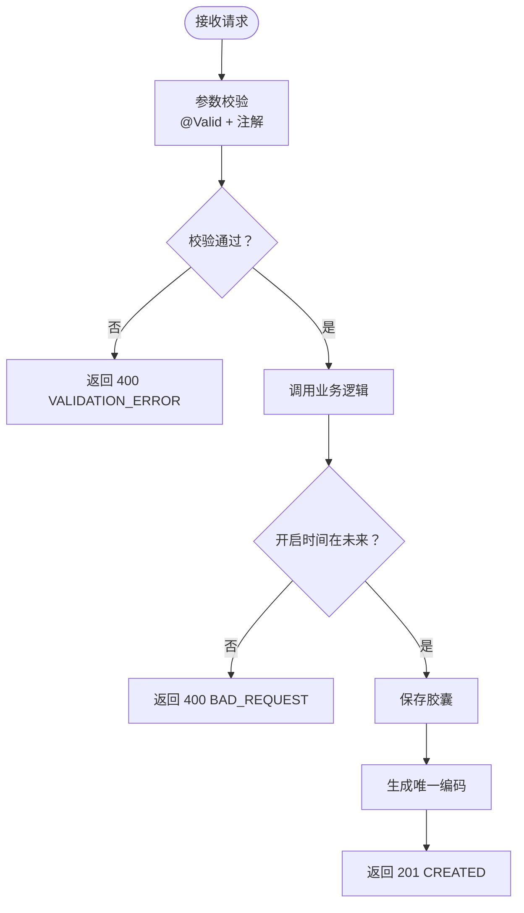
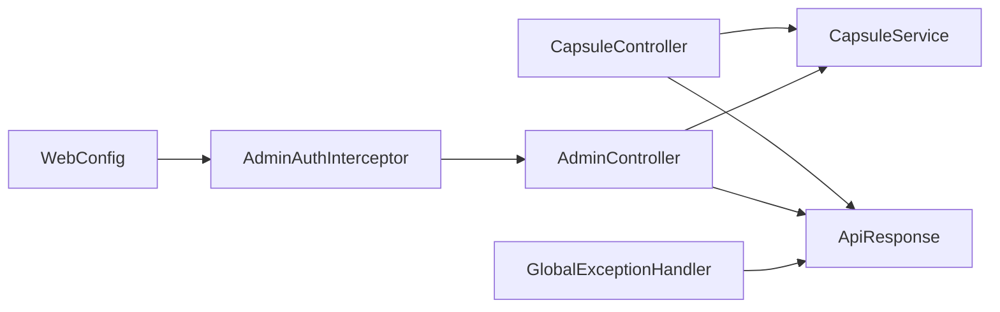

# 控制器层设计

<cite>
**本文档引用的文件**
- [HealthController.java](file://backends/spring-boot/src/main/java/com/hellotime/controller/HealthController.java)
- [CapsuleController.java](file://backends/spring-boot/src/main/java/com/hellotime/controller/CapsuleController.java)
- [AdminController.java](file://backends/spring-boot/src/main/java/com/hellotime/controller/AdminController.java)
- [ApiResponse.java](file://backends/spring-boot/src/main/java/com/hellotime/dto/ApiResponse.java)
- [CreateCapsuleRequest.java](file://backends/spring-boot/src/main/java/com/hellotime/dto/CreateCapsuleRequest.java)
- [CapsuleResponse.java](file://backends/spring-boot/src/main/java/com/hellotime/dto/CapsuleResponse.java)
- [AdminLoginRequest.java](file://backends/spring-boot/src/main/java/com/hellotime/dto/AdminLoginRequest.java)
- [AdminTokenResponse.java](file://backends/spring-boot/src/main/java/com/hellotime/dto/AdminTokenResponse.java)
- [PageResponse.java](file://backends/spring-boot/src/main/java/com/hellotime/dto/PageResponse.java)
- [GlobalExceptionHandler.java](file://backends/spring-boot/src/main/java/com/hellotime/exception/GlobalExceptionHandler.java)
- [AdminAuthInterceptor.java](file://backends/spring-boot/src/main/java/com/hellotime/config/AdminAuthInterceptor.java)
- [WebConfig.java](file://backends/spring-boot/src/main/java/com/hellotime/config/WebConfig.java)
- [CapsuleService.java](file://backends/spring-boot/src/main/java/com/hellotime/service/CapsuleService.java)
- [CapsuleControllerTest.java](file://backends/spring-boot/src/test/java/com/hellotime/controller/CapsuleControllerTest.java)
- [AdminControllerTest.java](file://backends/spring-boot/src/test/java/com/hellotime/controller/AdminControllerTest.java)
- [pom.xml](file://backends/spring-boot/pom.xml)
</cite>

## 目录
1. [引言](#引言)
2. [项目结构](#项目结构)
3. [核心组件](#核心组件)
4. [架构总览](#架构总览)
5. [详细组件分析](#详细组件分析)
6. [依赖关系分析](#依赖关系分析)
7. [性能考虑](#性能考虑)
8. [故障排查指南](#故障排查指南)
9. [结论](#结论)
10. [附录](#附录)

## 引言
本文件系统性梳理 Spring Boot 后端控制器层的架构设计与实现细节，重点覆盖以下方面：
- RESTful API 设计原则：HTTP 方法映射、URL 路径设计、请求参数处理、响应状态码设置
- HealthController 健康检查接口：应用状态监控、数据库连接检查、外部服务可用性验证
- CapsuleController 时间胶囊 API：创建、查询、删除等核心业务接口的参数验证、业务逻辑调用、异常处理
- AdminController 管理员接口：登录认证、数据管理、权限控制
- 单元测试编写指南、API 文档生成、错误处理最佳实践与性能优化建议

## 项目结构
后端采用标准 Spring Boot 结构，控制器层位于 controller 包，配合 DTO、Service、Repository、Exception、Config 等模块协同工作。

图表来源
- [HealthController.java:1-28](file://backends/spring-boot/src/main/java/com/hellotime/controller/HealthController.java#L1-L28)
- [CapsuleController.java:1-57](file://backends/spring-boot/src/main/java/com/hellotime/controller/CapsuleController.java#L1-L57)
- [AdminController.java:1-78](file://backends/spring-boot/src/main/java/com/hellotime/controller/AdminController.java#L1-L78)
- [ApiResponse.java:1-68](file://backends/spring-boot/src/main/java/com/hellotime/dto/ApiResponse.java#L1-L68)
- [CreateCapsuleRequest.java:1-56](file://backends/spring-boot/src/main/java/com/hellotime/dto/CreateCapsuleRequest.java#L1-L56)
- [CapsuleResponse.java:1-31](file://backends/spring-boot/src/main/java/com/hellotime/dto/CapsuleResponse.java#L1-L31)
- [AdminLoginRequest.java:1-13](file://backends/spring-boot/src/main/java/com/hellotime/dto/AdminLoginRequest.java#L1-L13)
- [AdminTokenResponse.java:1-13](file://backends/spring-boot/src/main/java/com/hellotime/dto/AdminTokenResponse.java#L1-L13)
- [PageResponse.java:1-26](file://backends/spring-boot/src/main/java/com/hellotime/dto/PageResponse.java#L1-L26)
- [GlobalExceptionHandler.java:1-87](file://backends/spring-boot/src/main/java/com/hellotime/exception/GlobalExceptionHandler.java#L1-L87)
- [AdminAuthInterceptor.java:1-59](file://backends/spring-boot/src/main/java/com/hellotime/config/AdminAuthInterceptor.java#L1-L59)
- [WebConfig.java:1-32](file://backends/spring-boot/src/main/java/com/hellotime/config/WebConfig.java#L1-L32)
- [CapsuleService.java:1-195](file://backends/spring-boot/src/main/java/com/hellotime/service/CapsuleService.java#L1-L195)

章节来源
- [HealthController.java:1-28](file://backends/spring-boot/src/main/java/com/hellotime/controller/HealthController.java#L1-L28)
- [CapsuleController.java:1-57](file://backends/spring-boot/src/main/java/com/hellotime/controller/CapsuleController.java#L1-L57)
- [AdminController.java:1-78](file://backends/spring-boot/src/main/java/com/hellotime/controller/AdminController.java#L1-L78)

## 核心组件
- 统一响应封装：所有接口返回统一的 ApiResponse<T> 结构，包含 success、data、message、errorCode 等字段，便于前端一致处理。
- 参数校验：使用 Jakarta Validation 注解对请求参数进行声明式校验，结合全局异常处理器统一返回 400 错误。
- 异常处理：通过 @RestControllerAdvice 全局捕获业务异常、参数校验异常、非法参数异常与通用异常，统一输出标准化错误响应。
- 权限控制：基于拦截器对 /api/v1/admin/** 路径进行认证拦截，支持 Bearer Token 校验，并排除登录接口。

章节来源
- [ApiResponse.java:1-68](file://backends/spring-boot/src/main/java/com/hellotime/dto/ApiResponse.java#L1-L68)
- [GlobalExceptionHandler.java:1-87](file://backends/spring-boot/src/main/java/com/hellotime/exception/GlobalExceptionHandler.java#L1-L87)
- [AdminAuthInterceptor.java:1-59](file://backends/spring-boot/src/main/java/com/hellotime/config/AdminAuthInterceptor.java#L1-L59)
- [WebConfig.java:1-32](file://backends/spring-boot/src/main/java/com/hellotime/config/WebConfig.java#L1-L32)

## 架构总览
控制器层通过 RESTful 接口对外提供能力，统一由 ApiResponse 封装响应；参数校验与异常处理由 DTO 与全局异常处理器共同保障；管理员接口通过拦截器实现基于 JWT 的认证控制。

图表来源
- [HealthController.java:15-26](file://backends/spring-boot/src/main/java/com/hellotime/controller/HealthController.java#L15-L26)
- [CapsuleController.java:37-42](file://backends/spring-boot/src/main/java/com/hellotime/controller/CapsuleController.java#L37-L42)
- [AdminController.java:39-46](file://backends/spring-boot/src/main/java/com/hellotime/controller/AdminController.java#L39-L46)
- [CapsuleService.java:48-69](file://backends/spring-boot/src/main/java/com/hellotime/service/CapsuleService.java#L48-L69)
- [GlobalExceptionHandler.java:24-41](file://backends/spring-boot/src/main/java/com/hellotime/exception/GlobalExceptionHandler.java#L24-L41)

## 详细组件分析

### HealthController 健康检查接口
- 路径设计：/api/v1/health，GET 方法
- 返回结构：统一 ApiResponse，包含 status、timestamp、techStack 等信息
- 设计要点：
  - 响应体中包含技术栈信息，便于运维监控
  - 使用 Instant 记录时间戳，保证跨时区一致性
  - 返回 200 OK，体现服务健康状态

章节来源
- [HealthController.java:15-26](file://backends/spring-boot/src/main/java/com/hellotime/controller/HealthController.java#L15-L26)
- [ApiResponse.java:27-55](file://backends/spring-boot/src/main/java/com/hellotime/dto/ApiResponse.java#L27-L55)

### CapsuleController 时间胶囊 API
- 基础路径：/api/v1/capsules
- 接口设计：
  - POST /api/v1/capsules：创建胶囊
    - 请求体：CreateCapsuleRequest（标题、内容、创建者、开启时间）
    - 参数校验：使用 @NotBlank、@Size、@NotNull 等注解
    - 业务逻辑：服务层校验开启时间必须在未来，生成唯一 8 位编码，持久化后返回创建响应
    - 响应状态：201 Created
  - GET /api/v1/capsules/{code}：查询胶囊详情
    - 路径参数：8 位胶囊码
    - 业务逻辑：根据开启时间决定是否返回 content；管理员可查看全部内容
    - 响应状态：200 OK

图表来源
- [CapsuleController.java:37-55](file://backends/spring-boot/src/main/java/com/hellotime/controller/CapsuleController.java#L37-L55)
- [CapsuleService.java:48-83](file://backends/spring-boot/src/main/java/com/hellotime/service/CapsuleService.java#L48-L83)
- [CreateCapsuleRequest.java:13-56](file://backends/spring-boot/src/main/java/com/hellotime/dto/CreateCapsuleRequest.java#L13-L56)
- [CapsuleResponse.java:6-31](file://backends/spring-boot/src/main/java/com/hellotime/dto/CapsuleResponse.java#L6-L31)

章节来源
- [CapsuleController.java:12-57](file://backends/spring-boot/src/main/java/com/hellotime/controller/CapsuleController.java#L12-L57)
- [CapsuleService.java:48-83](file://backends/spring-boot/src/main/java/com/hellotime/service/CapsuleService.java#L48-L83)
- [CreateCapsuleRequest.java:13-56](file://backends/spring-boot/src/main/java/com/hellotime/dto/CreateCapsuleRequest.java#L13-L56)
- [CapsuleResponse.java:6-31](file://backends/spring-boot/src/main/java/com/hellotime/dto/CapsuleResponse.java#L6-L31)

### AdminController 管理员接口
- 基础路径：/api/v1/admin
- 认证机制：拦截器对 /api/v1/admin/** 进行认证，要求 Authorization: Bearer <token>
- 接口设计：
  - POST /api/v1/admin/login：管理员登录
    - 请求体：AdminLoginRequest（密码）
    - 返回：AdminTokenResponse（token）
    - 异常：密码错误时抛出 UnauthorizedException
  - GET /api/v1/admin/capsules?page=&size=：分页查询所有胶囊
    - 查询参数：page（默认 0）、size（默认 20）
    - 返回：PageResponse<CapsuleResponse>
  - DELETE /api/v1/admin/capsules/{code}：删除指定胶囊
    - 路径参数：8 位胶囊码
    - 返回：空数据的 ApiResponse

图表来源
- [AdminController.java:39-76](file://backends/spring-boot/src/main/java/com/hellotime/controller/AdminController.java#L39-L76)
- [AdminAuthInterceptor.java:34-57](file://backends/spring-boot/src/main/java/com/hellotime/config/AdminAuthInterceptor.java#L34-L57)
- [CapsuleService.java:93-115](file://backends/spring-boot/src/main/java/com/hellotime/service/CapsuleService.java#L93-L115)
- [AdminLoginRequest.java:5-13](file://backends/spring-boot/src/main/java/com/hellotime/dto/AdminLoginRequest.java#L5-L13)
- [AdminTokenResponse.java:3-13](file://backends/spring-boot/src/main/java/com/hellotime/dto/AdminTokenResponse.java#L3-L13)
- [PageResponse.java:5-26](file://backends/spring-boot/src/main/java/com/hellotime/dto/PageResponse.java#L5-L26)

章节来源
- [AdminController.java:10-78](file://backends/spring-boot/src/main/java/com/hellotime/controller/AdminController.java#L10-L78)
- [AdminAuthInterceptor.java:10-59](file://backends/spring-boot/src/main/java/com/hellotime/config/AdminAuthInterceptor.java#L10-L59)
- [WebConfig.java:20-31](file://backends/spring-boot/src/main/java/com/hellotime/config/WebConfig.java#L20-L31)

### 参数验证与业务逻辑
- 参数验证：
  - CreateCapsuleRequest：标题、内容、创建者必填且长度限制；开启时间必填且需在未来
  - AdminLoginRequest：密码必填
- 业务逻辑：
  - CapsuleService：生成唯一 8 位编码、校验开启时间、按开启时间决定是否返回 content、分页查询与删除
  - AdminService：登录与 Token 校验（由拦截器调用）

图表来源
- [CreateCapsuleRequest.java:13-56](file://backends/spring-boot/src/main/java/com/hellotime/dto/CreateCapsuleRequest.java#L13-L56)
- [CapsuleService.java:48-69](file://backends/spring-boot/src/main/java/com/hellotime/service/CapsuleService.java#L48-L69)
- [GlobalExceptionHandler.java:43-59](file://backends/spring-boot/src/main/java/com/hellotime/exception/GlobalExceptionHandler.java#L43-L59)

章节来源
- [CreateCapsuleRequest.java:13-56](file://backends/spring-boot/src/main/java/com/hellotime/dto/CreateCapsuleRequest.java#L13-L56)
- [CapsuleService.java:48-69](file://backends/spring-boot/src/main/java/com/hellotime/service/CapsuleService.java#L48-L69)
- [GlobalExceptionHandler.java:43-59](file://backends/spring-boot/src/main/java/com/hellotime/exception/GlobalExceptionHandler.java#L43-L59)

## 依赖关系分析
- 控制器依赖服务层，服务层依赖仓库层与领域模型
- 全局异常处理器对控制器层透明，统一处理各类异常
- 拦截器在控制器执行前进行认证校验，避免未授权访问

图表来源
- [CapsuleController.java:21-28](file://backends/spring-boot/src/main/java/com/hellotime/controller/CapsuleController.java#L21-L28)
- [AdminController.java:20-29](file://backends/spring-boot/src/main/java/com/hellotime/controller/AdminController.java#L20-L29)
- [GlobalExceptionHandler.java:15-87](file://backends/spring-boot/src/main/java/com/hellotime/exception/GlobalExceptionHandler.java#L15-L87)
- [AdminAuthInterceptor.java:15-59](file://backends/spring-boot/src/main/java/com/hellotime/config/AdminAuthInterceptor.java#L15-L59)
- [WebConfig.java:12-31](file://backends/spring-boot/src/main/java/com/hellotime/config/WebConfig.java#L12-L31)

章节来源
- [CapsuleController.java:21-28](file://backends/spring-boot/src/main/java/com/hellotime/controller/CapsuleController.java#L21-L28)
- [AdminController.java:20-29](file://backends/spring-boot/src/main/java/com/hellotime/controller/AdminController.java#L20-L29)
- [GlobalExceptionHandler.java:15-87](file://backends/spring-boot/src/main/java/com/hellotime/exception/GlobalExceptionHandler.java#L15-L87)
- [AdminAuthInterceptor.java:15-59](file://backends/spring-boot/src/main/java/com/hellotime/config/AdminAuthInterceptor.java#L15-L59)
- [WebConfig.java:12-31](file://backends/spring-boot/src/main/java/com/hellotime/config/WebConfig.java#L12-L31)

## 性能考虑
- 响应体压缩：启用 Gzip 压缩以降低传输体积（可在 WebMvcConfigurer 中配置）
- 分页查询：管理员接口使用分页参数，避免一次性返回大量数据
- DTO 序列化：使用 @JsonInclude(NON_NULL) 减少响应体积
- 数据库索引：为 code、openAt、createdAt 等常用查询字段建立索引
- 缓存策略：对热点查询（如公开胶囊详情）可引入缓存层（Redis/Memcached），注意开启时间到达后的失效策略

## 故障排查指南
- 400 参数校验失败：检查请求体字段是否满足注解约束，关注字段名与错误信息
- 401 未授权：确认 Authorization 头格式为 Bearer <token>，并确保 Token 有效未过期
- 404 胶囊不存在：核对 8 位胶囊码是否正确，确认数据库中是否存在该记录
- 500 服务器内部错误：查看日志中的异常堆栈，定位具体业务异常或数据库问题

章节来源
- [GlobalExceptionHandler.java:18-85](file://backends/spring-boot/src/main/java/com/hellotime/exception/GlobalExceptionHandler.java#L18-L85)
- [AdminAuthInterceptor.java:34-57](file://backends/spring-boot/src/main/java/com/hellotime/config/AdminAuthInterceptor.java#L34-L57)

## 结论
控制器层通过清晰的 RESTful 设计、统一的响应封装、完善的参数校验与异常处理，以及基于拦截器的认证控制，构建了稳定、易维护、可扩展的后端接口体系。CapsuleController 提供了完整的胶囊生命周期管理能力，AdminController 实现了管理员的登录与数据管理，HealthController 则提供了基础的健康监控入口。整体架构遵循单一职责与依赖倒置原则，便于后续演进与测试。

## 附录

### API 设计最佳实践
- HTTP 方法选择：幂等使用 GET/PUT/DELETE，非幂等使用 POST/DELETE
- URL 设计：使用名词复数形式，路径参数用于资源标识
- 响应状态码：严格区分 2xx/4xx/5xx，错误码语义化
- 版本控制：路径中包含版本号（如 /api/v1）

### 单元测试编写指南
- 使用 @WebMvcTest 或 @AutoConfigureMockMvc 测试控制器
- 使用 @Transactional 回滚数据库变更，保证测试隔离
- 覆盖场景：
  - 正常流程：创建、查询、分页、删除
  - 参数校验：缺失字段、超长、非法值
  - 异常流程：未授权、资源不存在、业务校验失败
- 断言要点：状态码、JSON 路径、统一响应字段

章节来源
- [CapsuleControllerTest.java:30-94](file://backends/spring-boot/src/test/java/com/hellotime/controller/CapsuleControllerTest.java#L30-L94)
- [AdminControllerTest.java:31-113](file://backends/spring-boot/src/test/java/com/hellotime/controller/AdminControllerTest.java#L31-L113)

### API 文档生成
- Swagger/OpenAPI：集成 SpringDoc OpenAPI，自动生成接口文档
- 文档规范：统一描述请求参数、响应结构、错误码与示例

章节来源
- [pom.xml:25-80](file://backends/spring-boot/pom.xml#L25-L80)