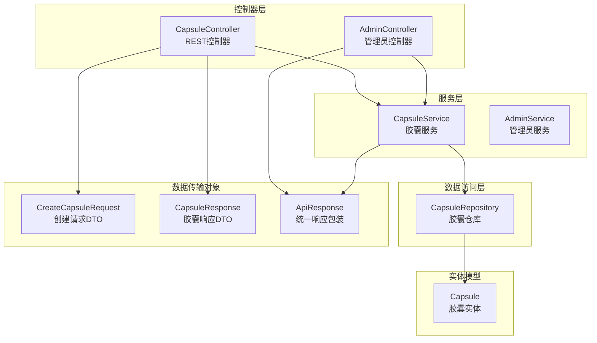
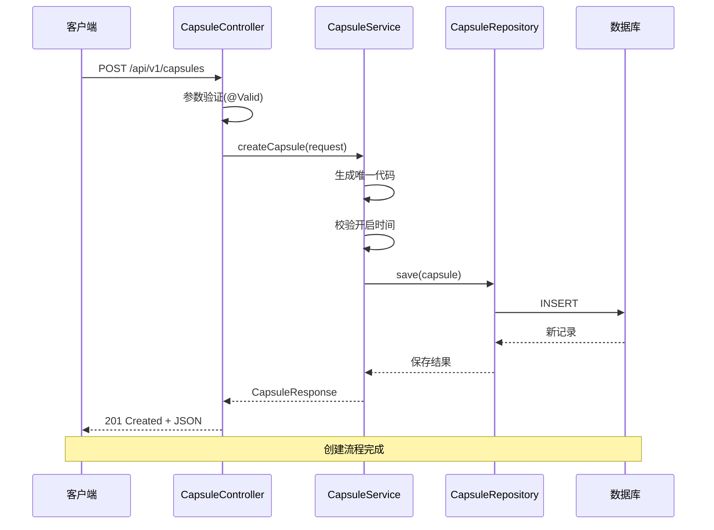
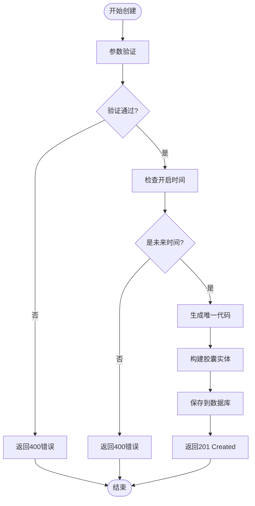
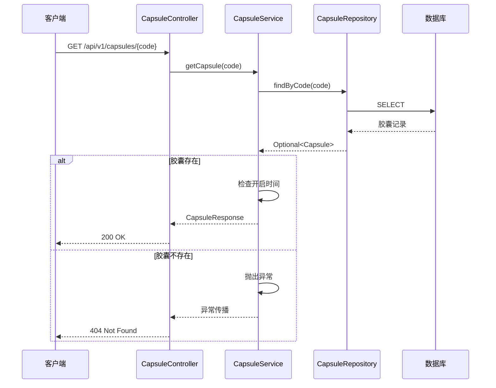
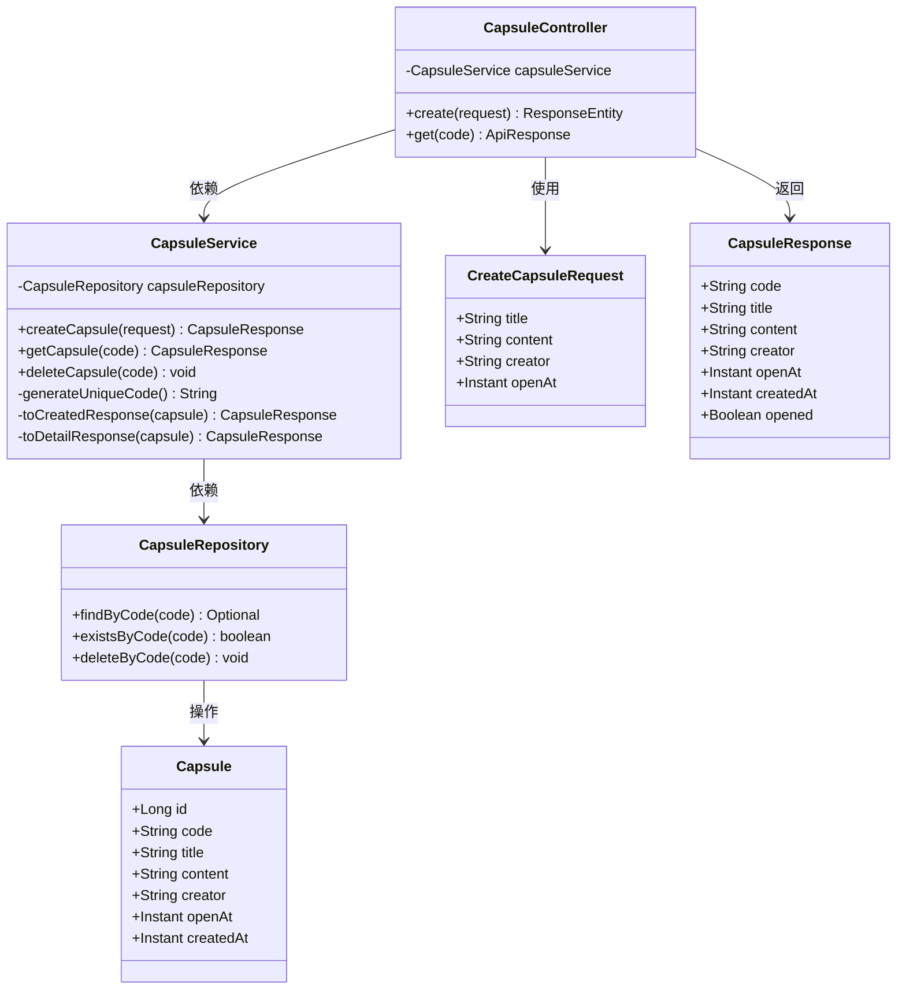

# 时间胶囊控制器

<cite>
**本文档引用的文件**
- [CapsuleController.java](file://backends/spring-boot/src/main/java/com/hellotime/controller/CapsuleController.java)
- [CapsuleService.java](file://backends/spring-boot/src/main/java/com/hellotime/service/CapsuleService.java)
- [CreateCapsuleRequest.java](file://backends/spring-boot/src/main/java/com/hellotime/dto/CreateCapsuleRequest.java)
- [CapsuleResponse.java](file://backends/spring-boot/src/main/java/com/hellotime/dto/CapsuleResponse.java)
- [Capsule.java](file://backends/spring-boot/src/main/java/com/hellotime/entity/Capsule.java)
- [CapsuleRepository.java](file://backends/spring-boot/src/main/java/com/hellotime/repository/CapsuleRepository.java)
- [ApiResponse.java](file://backends/spring-boot/src/main/java/com/hellotime/dto/ApiResponse.java)
- [GlobalExceptionHandler.java](file://backends/spring-boot/src/main/java/com/hellotime/exception/GlobalExceptionHandler.java)
- [CapsuleNotFoundException.java](file://backends/spring-boot/src/main/java/com/hellotime/exception/CapsuleNotFoundException.java)
- [AdminController.java](file://backends/spring-boot/src/main/java/com/hellotime/controller/AdminController.java)
- [AdminAuthInterceptor.java](file://backends/spring-boot/src/main/java/com/hellotime/config/AdminAuthInterceptor.java)
- [WebConfig.java](file://backends/spring-boot/src/main/java/com/hellotime/config/WebConfig.java)
- [CapsuleControllerTest.java](file://backends/spring-boot/src/test/java/com/hellotime/controller/CapsuleControllerTest.java)
</cite>

## 目录
1. [简介](#简介)
2. [项目结构](#项目结构)
3. [核心组件](#核心组件)
4. [架构概览](#架构概览)
5. [详细组件分析](#详细组件分析)
6. [依赖关系分析](#依赖关系分析)
7. [性能考虑](#性能考虑)
8. [故障排除指南](#故障排除指南)
9. [结论](#结论)

## 简介

时间胶囊控制器是HelloTime项目的核心组件之一，负责处理与时间胶囊相关的HTTP请求。该控制器实现了RESTful API设计原则，提供了胶囊的创建、查询等核心功能。系统采用Spring Boot框架构建，使用JPA进行数据持久化，实现了完整的业务逻辑处理和错误处理机制。

## 项目结构

时间胶囊控制器位于Spring Boot后端项目的controller包中，遵循标准的MVC架构模式：

**图表来源**
- [CapsuleController.java:17-56](file://backends/spring-boot/src/main/java/com/hellotime/controller/CapsuleController.java#L17-L56)
- [CapsuleService.java:22-194](file://backends/spring-boot/src/main/java/com/hellotime/service/CapsuleService.java#L22-L194)
- [CapsuleRepository.java:15-47](file://backends/spring-boot/src/main/java/com/hellotime/repository/CapsuleRepository.java#L15-L47)

**章节来源**
- [CapsuleController.java:1-57](file://backends/spring-boot/src/main/java/com/hellotime/controller/CapsuleController.java#L1-L57)
- [CapsuleService.java:1-195](file://backends/spring-boot/src/main/java/com/hellotime/service/CapsuleService.java#L1-L195)

## 核心组件

### 控制器层设计

时间胶囊控制器采用@RestController注解，提供RESTful API接口。基础路径为/api/v1/capsules，实现了以下核心功能：

- **创建胶囊**：POST /api/v1/capsules
- **查询胶囊**：GET /api/v1/capsules/{code}

### 数据传输对象

系统使用DTO模式进行数据传输，确保API接口的稳定性和安全性：

- **CreateCapsuleRequest**：封装创建胶囊的请求参数
- **CapsuleResponse**：封装胶囊的响应数据
- **ApiResponse**：统一API响应格式

### 异常处理机制

系统实现了全局异常处理机制，统一处理各种业务异常和参数校验异常，确保API响应的一致性。

**章节来源**
- [CapsuleController.java:12-56](file://backends/spring-boot/src/main/java/com/hellotime/controller/CapsuleController.java#L12-L56)
- [CreateCapsuleRequest.java:8-56](file://backends/spring-boot/src/main/java/com/hellotime/dto/CreateCapsuleRequest.java#L8-L56)
- [CapsuleResponse.java:6-31](file://backends/spring-boot/src/main/java/com/hellotime/dto/CapsuleResponse.java#L6-L31)
- [ApiResponse.java:15-68](file://backends/spring-boot/src/main/java/com/hellotime/dto/ApiResponse.java#L15-L68)

## 架构概览

时间胶囊控制器采用分层架构设计，各层职责明确，耦合度低：

**图表来源**
- [CapsuleController.java:37-42](file://backends/spring-boot/src/main/java/com/hellotime/controller/CapsuleController.java#L37-L42)
- [CapsuleService.java:48-69](file://backends/spring-boot/src/main/java/com/hellotime/service/CapsuleService.java#L48-L69)
- [CapsuleRepository.java:46-46](file://backends/spring-boot/src/main/java/com/hellotime/repository/CapsuleRepository.java#L46-L46)

**章节来源**
- [CapsuleController.java:17-56](file://backends/spring-boot/src/main/java/com/hellotime/controller/CapsuleController.java#L17-L56)
- [CapsuleService.java:18-195](file://backends/spring-boot/src/main/java/com/hellotime/service/CapsuleService.java#L18-L195)

## 详细组件分析

### CapsuleController类分析

CapsuleController是时间胶囊功能的主要入口点，实现了RESTful API的所有核心功能。

#### HTTP方法映射策略

控制器使用标准的HTTP方法映射：

- **POST**：用于创建新的时间胶囊资源
- **GET**：用于获取现有时间胶囊的详细信息

#### URL路径设计规范

- **基础路径**：/api/v1/capsules
- **创建接口**：/api/v1/capsules（POST）
- **查询接口**：/api/v1/capsules/{code}（GET）

#### 参数绑定机制

控制器使用Spring MVC的参数绑定机制：

- **@RequestBody**：绑定HTTP请求体中的JSON数据
- **@PathVariable**：从URL路径中提取参数
- **@Valid**：启用Bean验证框架进行参数校验

**章节来源**
- [CapsuleController.java:17-56](file://backends/spring-boot/src/main/java/com/hellotime/controller/CapsuleController.java#L17-L56)

### createCapsule()创建接口实现

createCapsule()方法实现了时间胶囊的创建功能，具有完整的业务逻辑和错误处理。

#### 请求参数验证

使用Jakarta Validation注解进行参数校验：

- **标题验证**：不能为空，最多100个字符
- **内容验证**：不能为空
- **创建者验证**：不能为空，最多30个字符
- **开启时间验证**：不能为空，且必须是未来时间

#### 业务逻辑调用

创建过程包含以下关键步骤：

1. **开启时间校验**：确保开启时间在未来
2. **唯一代码生成**：生成8位唯一的胶囊码
3. **实体构建**：将请求参数转换为胶囊实体
4. **数据持久化**：保存到数据库

#### 响应数据处理

创建成功后返回201状态码和胶囊基本信息（不包含content字段）。

**图表来源**
- [CapsuleController.java:37-42](file://backends/spring-boot/src/main/java/com/hellotime/controller/CapsuleController.java#L37-L42)
- [CapsuleService.java:48-69](file://backends/spring-boot/src/main/java/com/hellotime/service/CapsuleService.java#L48-L69)

**章节来源**
- [CapsuleController.java:30-42](file://backends/spring-boot/src/main/java/com/hellotime/controller/CapsuleController.java#L30-L42)
- [CreateCapsuleRequest.java:13-56](file://backends/spring-boot/src/main/java/com/hellotime/dto/CreateCapsuleRequest.java#L13-L56)
- [CapsuleService.java:48-69](file://backends/spring-boot/src/main/java/com/hellotime/service/CapsuleService.java#L48-L69)

### getCapsule()查询接口设计

getCapsule()方法实现了时间胶囊的查询功能，具有智能的内容访问控制。

#### 路径参数提取

使用@PathVariable注解从URL路径中提取8位胶囊码。

#### 业务服务调用

查询过程包含以下逻辑：

1. **数据检索**：根据胶囊码查询数据库
2. **存在性检查**：如果不存在抛出异常
3. **访问控制**：根据当前时间决定是否返回内容

#### 异常处理机制

当胶囊不存在时，抛出CapsuleNotFoundException，由全局异常处理器统一处理。

**图表来源**
- [CapsuleController.java:51-55](file://backends/spring-boot/src/main/java/com/hellotime/controller/CapsuleController.java#L51-L55)
- [CapsuleService.java:79-83](file://backends/spring-boot/src/main/java/com/hellotime/service/CapsuleService.java#L79-L83)
- [CapsuleRepository.java:23-23](file://backends/spring-boot/src/main/java/com/hellotime/repository/CapsuleRepository.java#L23-L23)

**章节来源**
- [CapsuleController.java:44-55](file://backends/spring-boot/src/main/java/com/hellotime/controller/CapsuleController.java#L44-L55)
- [CapsuleService.java:79-83](file://backends/spring-boot/src/main/java/com/hellotime/service/CapsuleService.java#L79-L83)

### deleteCapsule()删除接口实现

虽然CapsuleController中没有直接的删除接口，但CapsuleService提供了删除功能，AdminController实现了管理员删除接口。

#### 权限验证

删除操作需要管理员权限，通过JWT Token进行身份验证。

#### 数据清理

删除操作包含以下步骤：

1. **存在性检查**：确认胶囊是否存在
2. **权限验证**：验证管理员Token
3. **数据删除**：从数据库中移除记录

#### 事务管理

删除操作使用@Transactional注解确保操作的原子性。

**章节来源**
- [CapsuleService.java:109-115](file://backends/spring-boot/src/main/java/com/hellotime/service/CapsuleService.java#L109-L115)
- [AdminController.java:72-76](file://backends/spring-boot/src/main/java/com/hellotime/controller/AdminController.java#L72-L76)

## 依赖关系分析

时间胶囊控制器的依赖关系清晰明确，遵循依赖倒置原则：

**图表来源**
- [CapsuleController.java:21-28](file://backends/spring-boot/src/main/java/com/hellotime/controller/CapsuleController.java#L21-L28)
- [CapsuleService.java:34-38](file://backends/spring-boot/src/main/java/com/hellotime/service/CapsuleService.java#L34-L38)
- [CapsuleRepository.java:15-47](file://backends/spring-boot/src/main/java/com/hellotime/repository/CapsuleRepository.java#L15-L47)

**章节来源**
- [CapsuleController.java:21-28](file://backends/spring-boot/src/main/java/com/hellotime/controller/CapsuleController.java#L21-L28)
- [CapsuleService.java:34-38](file://backends/spring-boot/src/main/java/com/hellotime/service/CapsuleService.java#L34-L38)

## 性能考虑

### 数据库优化

- **索引设计**：胶囊码使用唯一索引，确保查询效率
- **查询优化**：使用JPA方法命名约定自动生成高效SQL
- **连接池**：合理配置数据库连接池参数

### 缓存策略

- **响应缓存**：对于未开启的胶囊，可以考虑适当的缓存策略
- **热点数据**：热门胶囊可以使用Redis等缓存技术

### 并发控制

- **唯一性保证**：胶囊码生成使用循环重试机制
- **事务隔离**：使用@Transactional确保数据一致性

## 故障排除指南

### 常见问题及解决方案

#### 参数验证失败

**症状**：返回400 Bad Request，包含具体的字段错误信息

**原因**：请求参数不符合验证规则

**解决方案**：
- 检查必填字段是否完整
- 验证字符串长度限制
- 确认时间参数的正确性

#### 胶囊不存在

**症状**：返回404 Not Found，错误码为CAPSULE_NOT_FOUND

**原因**：查询的胶囊码不存在

**解决方案**：
- 确认胶囊码的正确性
- 检查胶囊是否已被删除
- 验证查询URL的格式

#### 开启时间错误

**症状**：返回400 Bad Request，提示开启时间必须在未来

**原因**：设置的开启时间早于当前时间

**解决方案**：
- 确保开启时间晚于当前时间
- 检查时区设置
- 验证时间戳的准确性

#### 数据库连接问题

**症状**：返回500 Internal Server Error

**原因**：数据库连接异常或查询超时

**解决方案**：
- 检查数据库连接配置
- 监控数据库性能
- 优化慢查询语句

**章节来源**
- [GlobalExceptionHandler.java:15-87](file://backends/spring-boot/src/main/java/com/hellotime/exception/GlobalExceptionHandler.java#L15-L87)
- [CapsuleControllerTest.java:38-94](file://backends/spring-boot/src/test/java/com/hellotime/controller/CapsuleControllerTest.java#L38-L94)

## 结论

时间胶囊控制器实现了完整的RESTful API设计，具有以下特点：

1. **清晰的架构设计**：采用分层架构，职责分离明确
2. **完善的参数验证**：使用Bean验证框架确保数据完整性
3. **智能的访问控制**：根据时间动态控制内容可见性
4. **统一的异常处理**：全局异常处理器提供一致的错误响应
5. **良好的扩展性**：模块化设计便于功能扩展

该控制器为时间胶囊功能提供了稳定可靠的技术基础，支持未来更多的业务场景扩展。