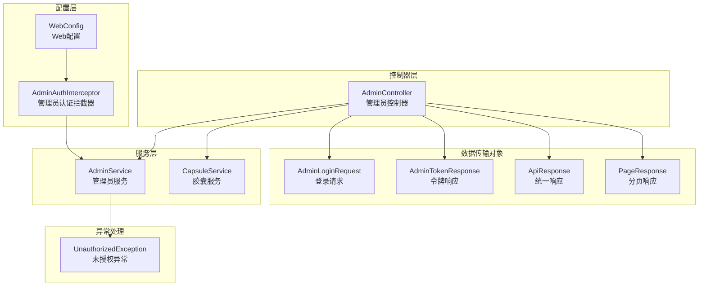
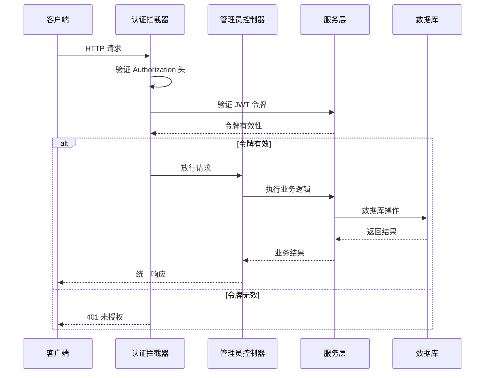
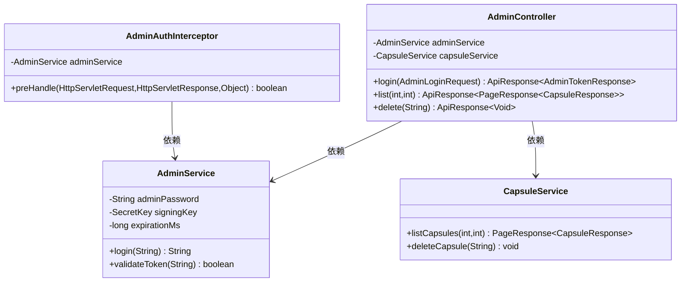
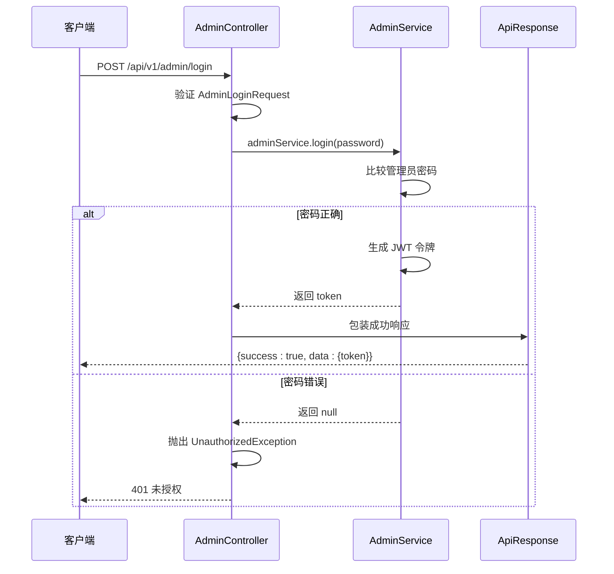
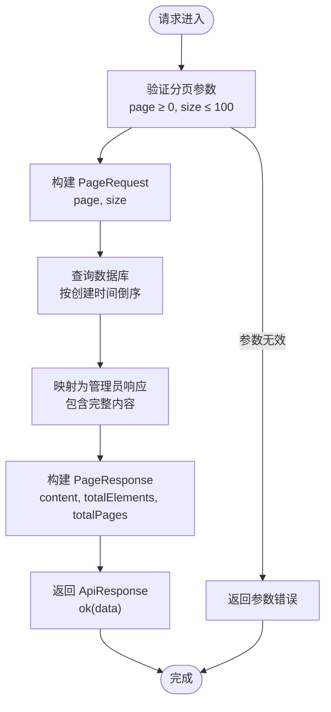
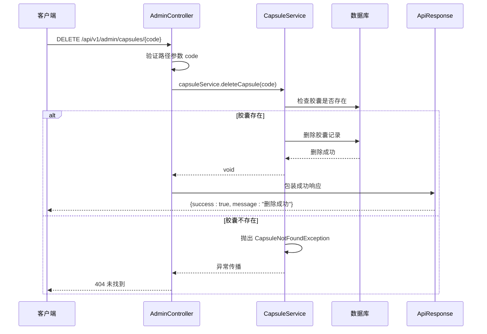
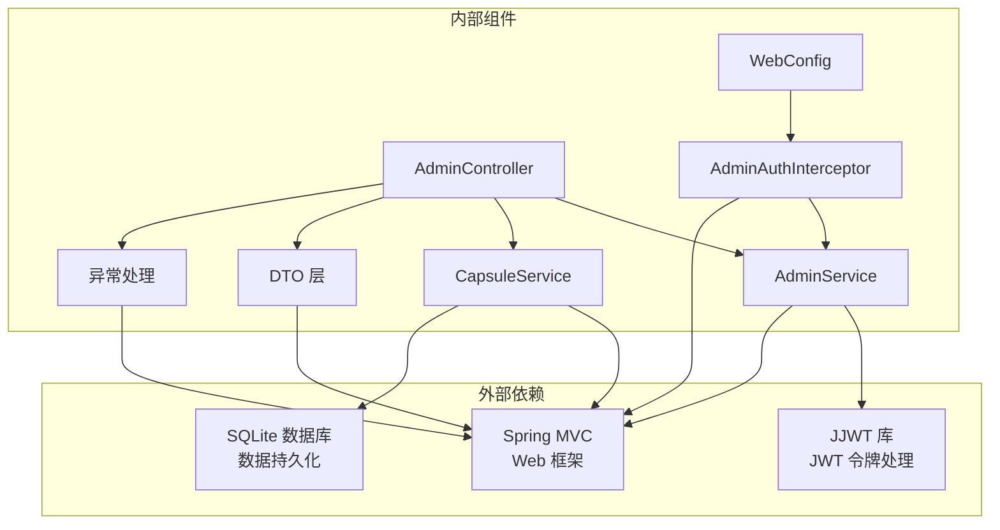
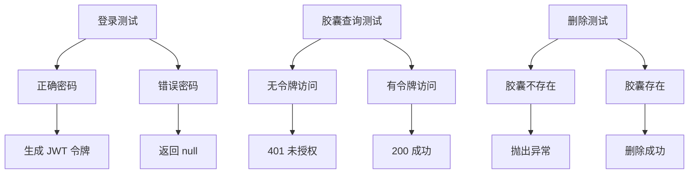

# 管理员控制器

<cite>
**本文档引用的文件**
- [AdminController.java](file://backends/spring-boot/src/main/java/com/hellotime/controller/AdminController.java)
- [AdminService.java](file://backends/spring-boot/src/main/java/com/hellotime/service/AdminService.java)
- [AdminAuthInterceptor.java](file://backends/spring-boot/src/main/java/com/hellotime/config/AdminAuthInterceptor.java)
- [WebConfig.java](file://backends/spring-boot/src/main/java/com/hellotime/config/WebConfig.java)
- [AdminLoginRequest.java](file://backends/spring-boot/src/main/java/com/hellotime/dto/AdminLoginRequest.java)
- [AdminTokenResponse.java](file://backends/spring-boot/src/main/java/com/hellotime/dto/AdminTokenResponse.java)
- [ApiResponse.java](file://backends/spring-boot/src/main/java/com/hellotime/dto/ApiResponse.java)
- [PageResponse.java](file://backends/spring-boot/src/main/java/com/hellotime/dto/PageResponse.java)
- [UnauthorizedException.java](file://backends/spring-boot/src/main/java/com/hellotime/exception/UnauthorizedException.java)
- [application.yml](file://backends/spring-boot/src/main/resources/application.yml)
- [CapsuleService.java](file://backends/spring-boot/src/main/java/com/hellotime/service/CapsuleService.java)
- [AdminControllerTest.java](file://backends/spring-boot/src/test/java/com/hellotime/controller/AdminControllerTest.java)
- [AdminServiceTest.java](file://backends/spring-boot/src/test/java/com/hellotime/service/AdminServiceTest.java)
- [AdminLogin.tsx](file://frontends/react-ts/src/components/AdminLogin.tsx)
- [useAdmin.ts](file://frontends/react-ts/src/hooks/useAdmin.ts)
</cite>

## 目录
1. [简介](#简介)
2. [项目结构](#项目结构)
3. [核心组件](#核心组件)
4. [架构概览](#架构概览)
5. [详细组件分析](#详细组件分析)
6. [依赖关系分析](#依赖关系分析)
7. [性能考虑](#性能考虑)
8. [故障排除指南](#故障排除指南)
9. [结论](#结论)

## 简介

管理员控制器是 HelloTime 时间胶囊管理系统中的核心安全组件，负责处理管理员相关的 HTTP 请求。该控制器实现了完整的认证授权体系，包括基于 JWT 的令牌验证、权限控制机制和安全策略实施。

系统采用 Spring Boot 技术栈构建，通过拦截器模式实现全局认证拦截，确保所有管理员接口都经过严格的身份验证。控制器提供了三个主要功能：管理员登录认证、胶囊列表查询和胶囊删除管理。

## 项目结构

管理员控制器位于 Spring Boot 后端项目的控制器层，采用标准的分层架构设计：

**图表来源**
- [AdminController.java:18-78](file://backends/spring-boot/src/main/java/com/hellotime/controller/AdminController.java#L18-L78)
- [AdminService.java:19-89](file://backends/spring-boot/src/main/java/com/hellotime/service/AdminService.java#L19-L89)
- [AdminAuthInterceptor.java:16-59](file://backends/spring-boot/src/main/java/com/hellotime/config/AdminAuthInterceptor.java#L16-L59)

**章节来源**
- [AdminController.java:10-18](file://backends/spring-boot/src/main/java/com/hellotime/controller/AdminController.java#L10-L18)
- [WebConfig.java:12-32](file://backends/spring-boot/src/main/java/com/hellotime/config/WebConfig.java#L12-L32)

## 核心组件

管理员控制器由多个核心组件协同工作，形成完整的认证授权体系：

### 控制器组件
- **AdminController**: 主控制器，处理所有管理员相关的 HTTP 请求
- **AdminService**: 管理员认证服务，负责密码验证和 JWT 令牌生成
- **CapsuleService**: 胶囊管理服务，提供胶囊查询和删除功能

### 安全组件
- **AdminAuthInterceptor**: 全局认证拦截器，验证 JWT 令牌的有效性
- **WebConfig**: Web 配置类，注册和配置拦截器
- **UnauthorizedException**: 自定义未授权异常，统一处理认证失败

### 数据传输组件
- **AdminLoginRequest**: 登录请求数据模型
- **AdminTokenResponse**: 令牌响应数据模型
- **ApiResponse**: 统一 API 响应包装类
- **PageResponse**: 分页响应数据模型

**章节来源**
- [AdminService.java:14-44](file://backends/spring-boot/src/main/java/com/hellotime/service/AdminService.java#L14-L44)
- [AdminAuthInterceptor.java:10-33](file://backends/spring-boot/src/main/java/com/hellotime/config/AdminAuthInterceptor.java#L10-L33)
- [ApiResponse.java:5-26](file://backends/spring-boot/src/main/java/com/hellotime/dto/ApiResponse.java#L5-L26)

## 架构概览

管理员控制器采用拦截器模式实现全局认证，形成了清晰的职责分离：

**图表来源**
- [AdminAuthInterceptor.java:34-57](file://backends/spring-boot/src/main/java/com/hellotime/config/AdminAuthInterceptor.java#L34-L57)
- [AdminController.java:39-76](file://backends/spring-boot/src/main/java/com/hellotime/controller/AdminController.java#L39-L76)

系统架构特点：
- **拦截器模式**: 通过 AdminAuthInterceptor 实现全局认证拦截
- **依赖注入**: 使用构造函数注入依赖，提高代码可测试性
- **统一响应**: 所有接口返回 ApiResponse 格式，确保前后端一致性
- **配置驱动**: 通过 application.yml 配置 JWT 密钥和过期时间

**章节来源**
- [WebConfig.java:25-30](file://backends/spring-boot/src/main/java/com/hellotime/config/WebConfig.java#L25-L30)
- [application.yml:16-22](file://backends/spring-boot/src/main/resources/application.yml#L16-L22)

## 详细组件分析

### AdminController 类分析

AdminController 是管理员功能的核心控制器，采用 RESTful 设计原则：

**图表来源**
- [AdminController.java:18-29](file://backends/spring-boot/src/main/java/com/hellotime/controller/AdminController.java#L18-L29)
- [AdminService.java:19-44](file://backends/spring-boot/src/main/java/com/hellotime/service/AdminService.java#L19-L44)
- [CapsuleService.java:23-38](file://backends/spring-boot/src/main/java/com/hellotime/service/CapsuleService.java#L23-L38)
- [AdminAuthInterceptor.java:16-22](file://backends/spring-boot/src/main/java/com/hellotime/config/AdminAuthInterceptor.java#L16-L22)

#### 认证授权设计

控制器实现了严格的认证授权机制：

1. **全局拦截**: 通过 WebConfig 配置，所有 `/api/v1/admin/**` 路径的请求都会被拦截
2. **例外处理**: `/api/v1/admin/login` 接口除外，允许未认证访问
3. **令牌验证**: 拦截器检查 Authorization 头中的 Bearer 令牌
4. **异常处理**: 无效令牌抛出 UnauthorizedException 异常

#### 权限控制机制

权限控制通过以下层次实现：

1. **基础路径权限**: 所有管理员接口都需要认证
2. **操作权限**: 管理员功能仅限于登录用户
3. **数据权限**: 管理员可以查看所有胶囊数据，包括未开启的内容

**章节来源**
- [AdminController.java:31-46](file://backends/spring-boot/src/main/java/com/hellotime/controller/AdminController.java#L31-L46)
- [AdminAuthInterceptor.java:34-57](file://backends/spring-boot/src/main/java/com/hellotime/config/AdminAuthInterceptor.java#L34-L57)

### login() 登录接口实现

login() 方法实现了完整的登录认证流程：

**图表来源**
- [AdminController.java:39-46](file://backends/spring-boot/src/main/java/com/hellotime/controller/AdminController.java#L39-L46)
- [AdminService.java:53-66](file://backends/spring-boot/src/main/java/com/hellotime/service/AdminService.java#L53-L66)

#### 用户名密码验证

登录接口采用简单的字符串比较方式进行身份验证：

1. **请求验证**: 使用 @Valid 注解确保密码字段非空
2. **密码比较**: 直接比较请求密码与配置文件中的管理员密码
3. **安全性考虑**: 密码存储在环境变量中，支持运行时配置

#### 令牌生成流程

JWT 令牌生成遵循标准流程：

1. **令牌构建**: 使用 JJWT 库构建包含主题、签发时间和过期时间的令牌
2. **签名算法**: 采用 HMAC-SHA256 算法进行数字签名
3. **过期时间**: 默认 2 小时，可通过配置调整
4. **响应封装**: 使用 ApiResponse 包装令牌数据

#### 响应数据封装

统一响应格式确保前后端交互一致性：

1. **成功响应**: `{success: true, data: {token}, message: "登录成功"}`
2. **错误响应**: 通过 UnauthorizedException 统一处理
3. **状态码**: 正确返回 200，认证失败返回 401

**章节来源**
- [AdminLoginRequest.java:5-12](file://backends/spring-boot/src/main/java/com/hellotime/dto/AdminLoginRequest.java#L5-L12)
- [AdminTokenResponse.java:3-12](file://backends/spring-boot/src/main/java/com/hellotime/dto/AdminTokenResponse.java#L3-L12)
- [ApiResponse.java:27-55](file://backends/spring-boot/src/main/java/com/hellotime/dto/ApiResponse.java#L27-L55)

### getAdminCapsules() 管理员胶囊查询接口

list() 方法实现了管理员专用的胶囊查询功能：

**图表来源**
- [AdminController.java:57-62](file://backends/spring-boot/src/main/java/com/hellotime/controller/AdminController.java#L57-L62)
- [CapsuleService.java:93-100](file://backends/spring-boot/src/main/java/com/hellotime/service/CapsuleService.java#L93-L100)

#### 分页处理

分页查询实现了完整的分页功能：

1. **参数验证**: 默认页码 0，默认每页 20 条记录
2. **范围限制**: 最大每页 100 条记录，防止资源滥用
3. **排序规则**: 按创建时间倒序排列，最新的在前
4. **数据转换**: 将数据库实体转换为管理员专用响应格式

#### 数据过滤

管理员查询与普通用户查询的区别：

1. **内容完整性**: 管理员可以看到所有胶囊的完整内容
2. **时间过滤**: 不受开启时间限制，可以查看未到开启时间的胶囊
3. **权限提升**: 管理员权限覆盖普通用户的访问限制

#### 权限验证

权限验证通过拦截器链路实现：

1. **全局拦截**: 所有管理员接口都经过认证拦截
2. **令牌验证**: 确保请求携带有效的 JWT 令牌
3. **访问控制**: 未认证用户无法访问管理员功能

**章节来源**
- [CapsuleService.java:85-100](file://backends/spring-boot/src/main/java/com/hellotime/service/CapsuleService.java#L85-L100)
- [PageResponse.java:5-25](file://backends/spring-boot/src/main/java/com/hellotime/dto/PageResponse.java#L5-L25)

### deleteAdminCapsule() 管理员删除接口

delete() 方法实现了管理员专用的胶囊删除功能：

**图表来源**
- [AdminController.java:72-76](file://backends/spring-boot/src/main/java/com/hellotime/controller/AdminController.java#L72-L76)
- [CapsuleService.java:109-115](file://backends/spring-boot/src/main/java/com/hellotime/service/CapsuleService.java#L109-L115)

#### 操作权限检查

删除操作的权限控制：

1. **认证要求**: 必须通过管理员认证拦截
2. **参数验证**: 确保 8 位胶囊码格式正确
3. **存在性检查**: 删除前验证胶囊确实存在

#### 数据安全保护

删除操作的安全措施：

1. **事务保证**: 使用 @Transactional 确保操作原子性
2. **异常处理**: 不存在的胶囊抛出特定异常
3. **数据完整性**: 删除后无法恢复，确保数据安全

#### 审计日志记录

虽然当前实现未包含审计日志，但删除操作具备以下审计特征：

1. **操作记录**: 删除操作会在数据库层面留下痕迹
2. **权限追踪**: 通过 JWT 令牌关联管理员身份
3. **时间戳**: 数据库自动记录删除时间

**章节来源**
- [CapsuleService.java:102-115](file://backends/spring-boot/src/main/java/com/hellotime/service/CapsuleService.java#L102-L115)

## 依赖关系分析

管理员控制器的依赖关系体现了清晰的分层架构：

**图表来源**
- [AdminController.java:3-8](file://backends/spring-boot/src/main/java/com/hellotime/controller/AdminController.java#L3-L8)
- [AdminService.java:3-12](file://backends/spring-boot/src/main/java/com/hellotime/service/AdminService.java#L3-L12)
- [AdminAuthInterceptor.java:3-8](file://backends/spring-boot/src/main/java/com/hellotime/config/AdminAuthInterceptor.java#L3-L8)

### 组件耦合度分析

系统设计遵循低耦合高内聚原则：

1. **控制器与服务**: 通过接口解耦，便于单元测试
2. **服务与数据层**: 通过 Repository 模式隔离数据访问
3. **配置与实现**: 通过 Spring 配置类实现横切关注点

### 外部依赖管理

依赖管理策略：

1. **JWT 依赖**: 专门用于令牌处理，职责单一
2. **数据库驱动**: 支持 SQLite，便于开发和部署
3. **Web 框架**: Spring MVC 提供完整的 Web 功能

**章节来源**
- [AdminService.java:35-44](file://backends/spring-boot/src/main/java/com/hellotime/service/AdminService.java#L35-L44)
- [application.yml:4-11](file://backends/spring-boot/src/main/resources/application.yml#L4-L11)

## 性能考虑

管理员控制器在设计时充分考虑了性能优化：

### 认证性能优化

1. **令牌缓存**: JWT 解析结果可在内存中缓存，减少重复计算
2. **异步处理**: 认证拦截器采用同步阻塞模式，确保安全性优先
3. **连接池**: 数据库连接使用连接池，提高并发性能

### 查询性能优化

1. **索引策略**: 按创建时间排序的查询使用合适的数据库索引
2. **分页限制**: 限制每页最大记录数，防止内存溢出
3. **投影查询**: 管理员查询使用投影查询，只返回必要字段

### 缓存策略

1. **令牌验证**: 可以考虑实现令牌黑名单缓存
2. **配置缓存**: 应用配置在启动时加载，运行时不变
3. **响应缓存**: 对于静态数据查询可考虑适当的缓存策略

## 故障排除指南

### 常见认证问题

#### 401 未授权错误

可能原因及解决方案：

1. **缺少 Authorization 头**
   - 检查客户端是否正确设置请求头
   - 确认使用 "Bearer " 前缀

2. **令牌格式错误**
   - 验证 JWT 令牌格式是否正确
   - 检查令牌是否被意外修改

3. **令牌过期**
   - 重新登录获取新令牌
   - 检查服务器时间同步

#### 403 禁止访问

可能原因：
- 令牌有效但无管理员权限
- 操作超出权限范围

### 测试验证

通过单元测试验证核心功能：

**图表来源**
- [AdminControllerTest.java:43-66](file://backends/spring-boot/src/test/java/com/hellotime/controller/AdminControllerTest.java#L43-L66)
- [AdminServiceTest.java:15-37](file://backends/spring-boot/src/test/java/com/hellotime/service/AdminServiceTest.java#L15-L37)

**章节来源**
- [AdminControllerTest.java:31-111](file://backends/spring-boot/src/test/java/com/hellotime/controller/AdminControllerTest.java#L31-L111)
- [AdminServiceTest.java:9-38](file://backends/spring-boot/src/test/java/com/hellotime/service/AdminServiceTest.java#L9-L38)

## 结论

管理员控制器实现了完整的认证授权体系，具有以下特点：

### 安全性优势

1. **多层防护**: 拦截器、令牌验证、权限控制形成多重安全保障
2. **最小权限**: 仅授予必要的管理员权限
3. **透明审计**: 通过 JWT 令牌实现操作可追溯

### 架构设计亮点

1. **清晰分层**: 控制器、服务、数据层职责明确
2. **依赖注入**: 提高代码可测试性和可维护性
3. **统一响应**: 确保前后端交互一致性

### 改进建议

1. **审计日志**: 增加详细的操作审计日志
2. **速率限制**: 实施 API 调用频率限制
3. **监控告警**: 添加系统性能监控和异常告警

该控制器为时间胶囊管理系统提供了安全可靠的管理员功能，为后续功能扩展奠定了良好的基础。