# 数据传输对象设计

<cite>
**本文档引用的文件**
- [ApiResponse.java](file://backends/spring-boot/src/main/java/com/hellotime/dto/ApiResponse.java)
- [AdminLoginRequest.java](file://backends/spring-boot/src/main/java/com/hellotime/dto/AdminLoginRequest.java)
- [CreateCapsuleRequest.java](file://backends/spring-boot/src/main/java/com/hellotime/dto/CreateCapsuleRequest.java)
- [CapsuleResponse.java](file://backends/spring-boot/src/main/java/com/hellotime/dto/CapsuleResponse.java)
- [AdminTokenResponse.java](file://backends/spring-boot/src/main/java/com/hellotime/dto/AdminTokenResponse.java)
- [PageResponse.java](file://backends/spring-boot/src/main/java/com/hellotime/dto/PageResponse.java)
- [AdminController.java](file://backends/spring-boot/src/main/java/com/hellotime/controller/AdminController.java)
- [CapsuleController.java](file://backends/spring-boot/src/main/java/com/hellotime/controller/CapsuleController.java)
- [AdminService.java](file://backends/spring-boot/src/main/java/com/hellotime/service/AdminService.java)
- [CapsuleService.java](file://backends/spring-boot/src/main/java/com/hellotime/service/CapsuleService.java)
- [GlobalExceptionHandler.java](file://backends/spring-boot/src/main/java/com/hellotime/exception/GlobalExceptionHandler.java)
- [CapsuleNotFoundException.java](file://backends/spring-boot/src/main/java/com/hellotime/exception/CapsuleNotFoundException.java)
- [UnauthorizedException.java](file://backends/spring-boot/src/main/java/com/hellotime/exception/UnauthorizedException.java)
- [application.yml](file://backends/spring-boot/src/main/resources/application.yml)
- [AdminControllerTest.java](file://backends/spring-boot/src/test/java/com/hellotime/controller/AdminControllerTest.java)
- [CapsuleControllerTest.java](file://backends/spring-boot/src/test/java/com/hellotime/controller/CapsuleControllerTest.java)
</cite>

## 目录
1. [简介](#简介)
2. [项目结构](#项目结构)
3. [核心组件](#核心组件)
4. [架构总览](#架构总览)
5. [详细组件分析](#详细组件分析)
6. [依赖分析](#依赖分析)
7. [性能考虑](#性能考虑)
8. [故障排查指南](#故障排查指南)
9. [结论](#结论)
10. [附录](#附录)

## 简介
本文件系统性梳理 Spring Boot 后端中数据传输对象（DTO）的设计与实现，重点覆盖以下方面：
- DTO 在分层架构中的职责边界与数据封装策略
- 统一响应格式 ApiResponse 的设计与序列化配置
- 请求 DTO 的参数校验注解、字段约束与业务规则验证
- 响应 DTO 的字段映射、数据转换与嵌套对象处理
- 最佳实践、数据验证策略、序列化配置与版本兼容性建议

## 项目结构
后端采用标准的分层架构，DTO 位于独立包中，控制器负责接收请求与返回响应，服务层承载业务逻辑，异常处理器统一输出错误响应。

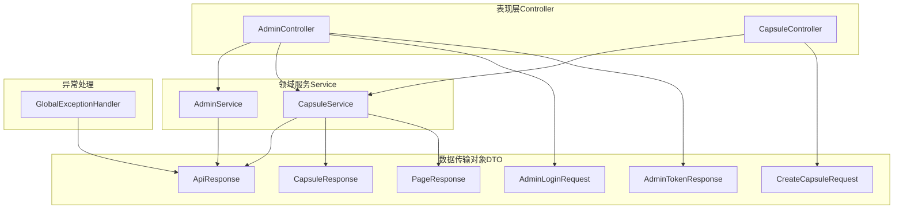

图表来源
- [AdminController.java:16-77](file://backends/spring-boot/src/main/java/com/hellotime/controller/AdminController.java#L16-L77)
- [CapsuleController.java:17-56](file://backends/spring-boot/src/main/java/com/hellotime/controller/CapsuleController.java#L17-L56)
- [AdminService.java:18-88](file://backends/spring-boot/src/main/java/com/hellotime/service/AdminService.java#L18-L88)
- [CapsuleService.java:22-194](file://backends/spring-boot/src/main/java/com/hellotime/service/CapsuleService.java#L22-L194)
- [ApiResponse.java:16-67](file://backends/spring-boot/src/main/java/com/hellotime/dto/ApiResponse.java#L16-L67)
- [PageResponse.java:5-25](file://backends/spring-boot/src/main/java/com/hellotime/dto/PageResponse.java#L5-L25)
- [CreateCapsuleRequest.java:13-55](file://backends/spring-boot/src/main/java/com/hellotime/dto/CreateCapsuleRequest.java#L13-L55)
- [AdminLoginRequest.java:5-12](file://backends/spring-boot/src/main/java/com/hellotime/dto/AdminLoginRequest.java#L5-L12)
- [AdminTokenResponse.java:3-12](file://backends/spring-boot/src/main/java/com/hellotime/dto/AdminTokenResponse.java#L3-L12)
- [CapsuleResponse.java:7-30](file://backends/spring-boot/src/main/java/com/hellotime/dto/CapsuleResponse.java#L7-L30)
- [GlobalExceptionHandler.java:15-86](file://backends/spring-boot/src/main/java/com/hellotime/exception/GlobalExceptionHandler.java#L15-L86)

章节来源
- [AdminController.java:16-77](file://backends/spring-boot/src/main/java/com/hellotime/controller/AdminController.java#L16-L77)
- [CapsuleController.java:17-56](file://backends/spring-boot/src/main/java/com/hellotime/controller/CapsuleController.java#L17-L56)
- [CapsuleService.java:22-194](file://backends/spring-boot/src/main/java/com/hellotime/service/CapsuleService.java#L22-L194)

## 核心组件
- 统一响应包装类 ApiResponse<T>：提供 success、data、message、errorCode 字段，静态工厂方法 ok/error，配合 Jackson 的非空序列化策略，保证响应结构一致且体积最小化。
- 请求 DTO：CreateCapsuleRequest、AdminLoginRequest，使用 Jakarta Validation 注解进行输入校验；业务规则在服务层补充校验（如开启时间必须在未来）。
- 响应 DTO：CapsuleResponse、AdminTokenResponse、PageResponse<T>，负责对外暴露的数据结构与字段映射。
- 控制器：AdminController、CapsuleController，负责接收请求、调用服务、返回 ApiResponse 包装的响应。
- 异常处理：GlobalExceptionHandler，统一拦截各类异常并以 ApiResponse 格式返回。

章节来源
- [ApiResponse.java:16-67](file://backends/spring-boot/src/main/java/com/hellotime/dto/ApiResponse.java#L16-L67)
- [CreateCapsuleRequest.java:13-55](file://backends/spring-boot/src/main/java/com/hellotime/dto/CreateCapsuleRequest.java#L13-L55)
- [AdminLoginRequest.java:5-12](file://backends/spring-boot/src/main/java/com/hellotime/dto/AdminLoginRequest.java#L5-L12)
- [CapsuleResponse.java:7-30](file://backends/spring-boot/src/main/java/com/hellotime/dto/CapsuleResponse.java#L7-L30)
- [AdminTokenResponse.java:3-12](file://backends/spring-boot/src/main/java/com/hellotime/dto/AdminTokenResponse.java#L3-L12)
- [PageResponse.java:5-25](file://backends/spring-boot/src/main/java/com/hellotime/dto/PageResponse.java#L5-L25)
- [GlobalExceptionHandler.java:15-86](file://backends/spring-boot/src/main/java/com/hellotime/exception/GlobalExceptionHandler.java#L15-L86)

## 架构总览
下图展示请求从控制器到服务层再到响应封装的整体流程，以及统一错误处理机制。

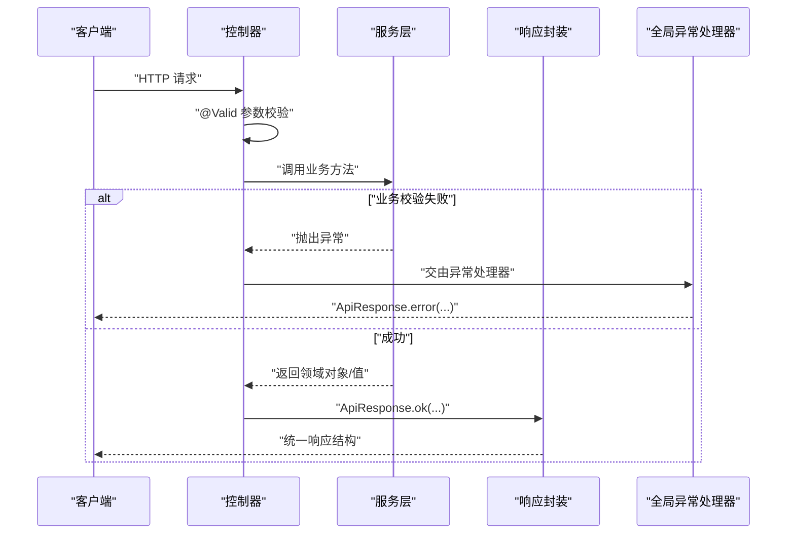

图表来源
- [CapsuleController.java:37-41](file://backends/spring-boot/src/main/java/com/hellotime/controller/CapsuleController.java#L37-L41)
- [AdminController.java:39-46](file://backends/spring-boot/src/main/java/com/hellotime/controller/AdminController.java#L39-L46)
- [CapsuleService.java:48-69](file://backends/spring-boot/src/main/java/com/hellotime/service/CapsuleService.java#L48-L69)
- [GlobalExceptionHandler.java:50-72](file://backends/spring-boot/src/main/java/com/hellotime/exception/GlobalExceptionHandler.java#L50-L72)
- [ApiResponse.java:27-55](file://backends/spring-boot/src/main/java/com/hellotime/dto/ApiResponse.java#L27-L55)

## 详细组件分析

### 统一响应格式 ApiResponse
- 设计目标：前后端一致的响应契约，便于前端统一处理成功与失败分支。
- 关键特性：
  - 泛型支持任意数据类型 data
  - Jackson 非空序列化策略，避免冗余字段
  - 静态工厂方法 ok/error，简化调用
- 成功响应：success=true，data=实际数据，可选 message
- 失败响应：success=false，data=null，必填 message 与 errorCode

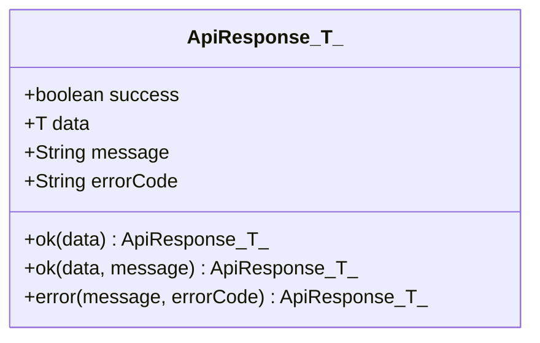

图表来源
- [ApiResponse.java:16-67](file://backends/spring-boot/src/main/java/com/hellotime/dto/ApiResponse.java#L16-L67)

章节来源
- [ApiResponse.java:16-67](file://backends/spring-boot/src/main/java/com/hellotime/dto/ApiResponse.java#L16-L67)

### 请求 DTO：CreateCapsuleRequest
- 字段与约束：
  - 标题：非空、长度限制
  - 内容：非空
  - 发布者：非空、长度限制
  - 开启时间：非空（业务上要求未来时间）
- 业务规则：
  - 服务层进一步校验开启时间必须晚于当前时间，否则抛出非法参数异常
- 控制器使用 @Valid 自动触发校验，异常由全局处理器统一返回

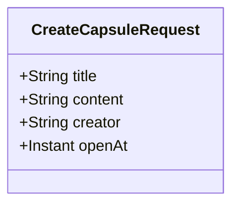

图表来源
- [CreateCapsuleRequest.java:13-55](file://backends/spring-boot/src/main/java/com/hellotime/dto/CreateCapsuleRequest.java#L13-L55)

章节来源
- [CreateCapsuleRequest.java:13-55](file://backends/spring-boot/src/main/java/com/hellotime/dto/CreateCapsuleRequest.java#L13-L55)
- [CapsuleService.java:48-53](file://backends/spring-boot/src/main/java/com/hellotime/service/CapsuleService.java#L48-L53)
- [CapsuleController.java:37-41](file://backends/spring-boot/src/main/java/com/hellotime/controller/CapsuleController.java#L37-L41)

### 请求 DTO：AdminLoginRequest
- 字段与约束：密码非空
- 控制器直接使用 @Valid 校验，错误由全局异常处理器返回

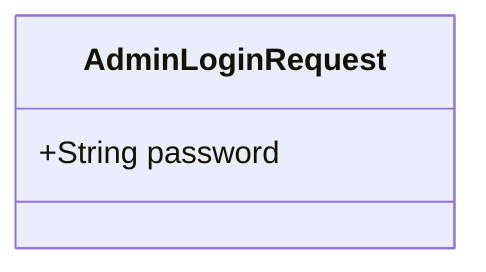

图表来源
- [AdminLoginRequest.java:5-12](file://backends/spring-boot/src/main/java/com/hellotime/dto/AdminLoginRequest.java#L5-L12)

章节来源
- [AdminLoginRequest.java:5-12](file://backends/spring-boot/src/main/java/com/hellotime/dto/AdminLoginRequest.java#L5-L12)
- [AdminController.java:39-46](file://backends/spring-boot/src/main/java/com/hellotime/controller/AdminController.java#L39-L46)

### 响应 DTO：CapsuleResponse
- 字段映射：code、title、content、creator、openAt、createdAt、opened
- 数据转换与条件逻辑：
  - 详情页：未到开启时间时不返回 content，opened 字段标识状态
  - 管理员视图：始终返回完整内容
- 序列化：使用 Jackson 非空策略，content 可能为 null

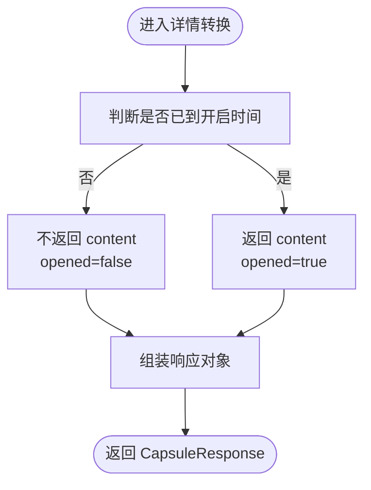

图表来源
- [CapsuleService.java:157-177](file://backends/spring-boot/src/main/java/com/hellotime/service/CapsuleService.java#L157-L177)
- [CapsuleResponse.java:7-30](file://backends/spring-boot/src/main/java/com/hellotime/dto/CapsuleResponse.java#L7-L30)

章节来源
- [CapsuleResponse.java:7-30](file://backends/spring-boot/src/main/java/com/hellotime/dto/CapsuleResponse.java#L7-L30)
- [CapsuleService.java:157-177](file://backends/spring-boot/src/main/java/com/hellotime/service/CapsuleService.java#L157-L177)

### 响应 DTO：AdminTokenResponse
- 字段：token
- 用途：管理员登录成功后的响应载体

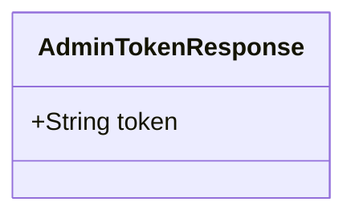

图表来源
- [AdminTokenResponse.java:3-12](file://backends/spring-boot/src/main/java/com/hellotime/dto/AdminTokenResponse.java#L3-L12)

章节来源
- [AdminTokenResponse.java:3-12](file://backends/spring-boot/src/main/java/com/hellotime/dto/AdminTokenResponse.java#L3-L12)
- [AdminController.java:39-46](file://backends/spring-boot/src/main/java/com/hellotime/controller/AdminController.java#L39-L46)

### 响应 DTO：PageResponse<T>
- 字段：content（元素为 T）、totalElements、totalPages、number、size
- 用途：分页查询的统一响应载体，结合 CapsuleResponse 实现管理员胶囊列表分页

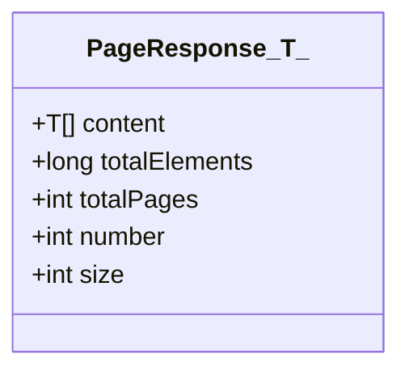

图表来源
- [PageResponse.java:5-25](file://backends/spring-boot/src/main/java/com/hellotime/dto/PageResponse.java#L5-L25)

章节来源
- [PageResponse.java:5-25](file://backends/spring-boot/src/main/java/com/hellotime/dto/PageResponse.java#L5-L25)
- [CapsuleService.java:93-100](file://backends/spring-boot/src/main/java/com/hellotime/service/CapsuleService.java#L93-L100)
- [AdminController.java:57-62](file://backends/spring-boot/src/main/java/com/hellotime/controller/AdminController.java#L57-L62)

### 控制器与服务交互流程
- CapsuleController.create：接收 CreateCapsuleRequest，调用服务创建胶囊，返回 ApiResponse.ok(CapsuleResponse)，状态码 201
- CapsuleController.get：根据 code 查询详情，返回 ApiResponse.ok(CapsuleResponse)
- AdminController.login：接收 AdminLoginRequest，调用服务生成 token，返回 ApiResponse.ok(AdminTokenResponse)
- AdminController.list：分页查询胶囊列表，返回 ApiResponse.ok(PageResponse<CapsuleResponse>)
- AdminController.delete：删除指定胶囊，返回 ApiResponse.ok(null, message)

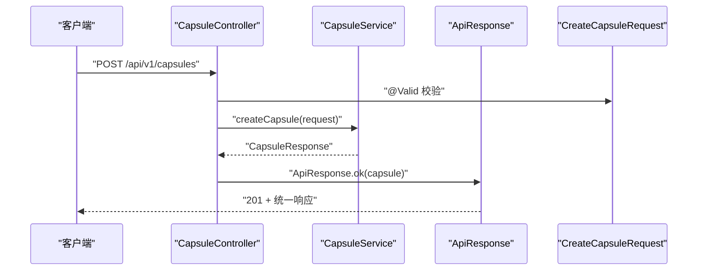

图表来源
- [CapsuleController.java:37-41](file://backends/spring-boot/src/main/java/com/hellotime/controller/CapsuleController.java#L37-L41)
- [CapsuleService.java:48-69](file://backends/spring-boot/src/main/java/com/hellotime/service/CapsuleService.java#L48-L69)
- [CreateCapsuleRequest.java:13-55](file://backends/spring-boot/src/main/java/com/hellotime/dto/CreateCapsuleRequest.java#L13-L55)
- [ApiResponse.java:27-44](file://backends/spring-boot/src/main/java/com/hellotime/dto/ApiResponse.java#L27-L44)

章节来源
- [CapsuleController.java:37-55](file://backends/spring-boot/src/main/java/com/hellotime/controller/CapsuleController.java#L37-L55)
- [AdminController.java:39-76](file://backends/spring-boot/src/main/java/com/hellotime/controller/AdminController.java#L39-L76)
- [CapsuleService.java:48-115](file://backends/spring-boot/src/main/java/com/hellotime/service/CapsuleService.java#L48-L115)

## 依赖分析
- 控制器依赖服务层与 DTO，服务层依赖仓库与 DTO，形成清晰的单向依赖。
- 全局异常处理器对控制器与服务层透明，统一输出 ApiResponse 格式。
- Jackson 非空序列化策略在多个 DTO 中复用，降低响应体积。

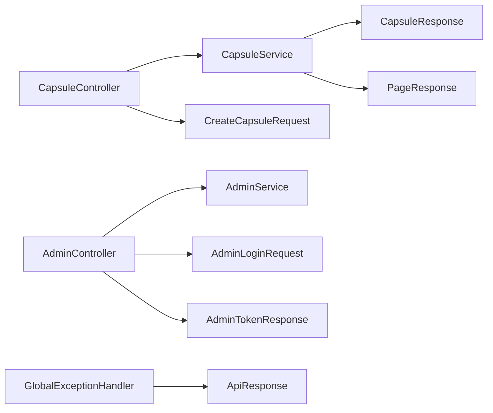

图表来源
- [CapsuleController.java:17-56](file://backends/spring-boot/src/main/java/com/hellotime/controller/CapsuleController.java#L17-L56)
- [AdminController.java:16-77](file://backends/spring-boot/src/main/java/com/hellotime/controller/AdminController.java#L16-L77)
- [CapsuleService.java:22-194](file://backends/spring-boot/src/main/java/com/hellotime/service/CapsuleService.java#L22-L194)
- [AdminService.java:18-88](file://backends/spring-boot/src/main/java/com/hellotime/service/AdminService.java#L18-L88)
- [GlobalExceptionHandler.java:15-86](file://backends/spring-boot/src/main/java/com/hellotime/exception/GlobalExceptionHandler.java#L15-L86)
- [ApiResponse.java:16-67](file://backends/spring-boot/src/main/java/com/hellotime/dto/ApiResponse.java#L16-L67)

章节来源
- [GlobalExceptionHandler.java:15-86](file://backends/spring-boot/src/main/java/com/hellotime/exception/GlobalExceptionHandler.java#L15-L86)

## 性能考虑
- 响应体积优化：ApiResponse 与各响应 DTO 使用 Jackson 非空序列化策略，避免发送 null 字段，减少网络传输开销。
- 分页查询：PageResponse 支持分页，结合数据库分页查询，避免一次性返回大量数据。
- 业务逻辑延迟：详情页在未到开启时间时不返回 content，既满足安全需求又减少响应负载。
- 序列化配置：application.yml 中未显式开启 JSON 序列化细节配置，默认行为已足够简洁。

章节来源
- [ApiResponse.java:15-15](file://backends/spring-boot/src/main/java/com/hellotime/dto/ApiResponse.java#L15-L15)
- [CapsuleResponse.java:6-6](file://backends/spring-boot/src/main/java/com/hellotime/dto/CapsuleResponse.java#L6-L6)
- [CapsuleService.java:169-176](file://backends/spring-boot/src/main/java/com/hellotime/service/CapsuleService.java#L169-L176)
- [application.yml:1-22](file://backends/spring-boot/src/main/resources/application.yml#L1-L22)

## 故障排查指南
- 参数校验失败：MethodArgumentNotValidException 会被捕获并返回 errorCode=VALIDATION_ERROR，message 包含字段级错误信息。
- 业务参数非法：IllegalArgumentException 返回 errorCode=BAD_REQUEST。
- 资源未找到：CapsuleNotFoundException 返回 errorCode=CAPSULE_NOT_FOUND。
- 未授权访问：UnauthorizedException 返回 errorCode=UNAUTHORIZED。
- 通用异常：Exception 返回 errorCode=INTERNAL_ERROR。

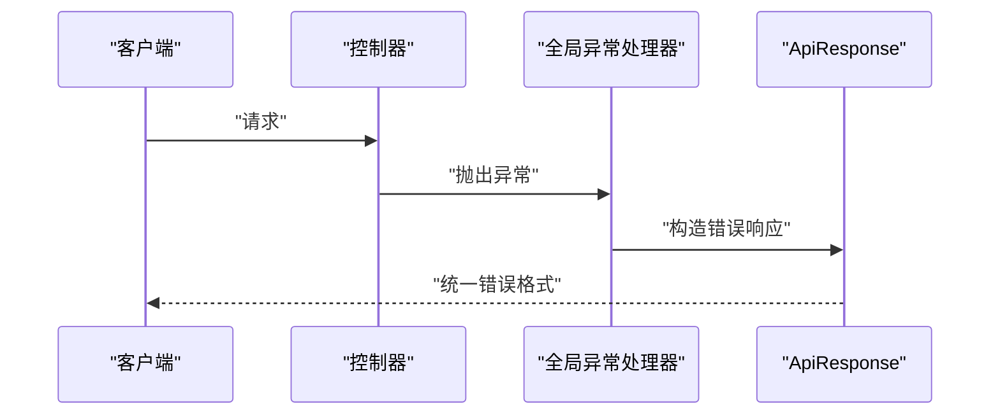

图表来源
- [GlobalExceptionHandler.java:24-85](file://backends/spring-boot/src/main/java/com/hellotime/exception/GlobalExceptionHandler.java#L24-L85)
- [CapsuleNotFoundException.java:8-18](file://backends/spring-boot/src/main/java/com/hellotime/exception/CapsuleNotFoundException.java#L8-L18)
- [UnauthorizedException.java:8-18](file://backends/spring-boot/src/main/java/com/hellotime/exception/UnauthorizedException.java#L8-L18)

章节来源
- [GlobalExceptionHandler.java:15-86](file://backends/spring-boot/src/main/java/com/hellotime/exception/GlobalExceptionHandler.java#L15-L86)
- [CapsuleControllerTest.java:56-71](file://backends/spring-boot/src/test/java/com/hellotime/controller/CapsuleControllerTest.java#L56-L71)
- [AdminControllerTest.java:56-72](file://backends/spring-boot/src/test/java/com/hellotime/controller/AdminControllerTest.java#L56-L72)

## 结论
本项目通过 DTO 将请求与响应数据结构化，配合统一响应格式与全局异常处理，实现了前后端一致的交互契约。请求 DTO 使用 Jakarta Validation 注解进行输入校验，服务层补充业务规则校验，响应 DTO 负责字段映射与条件数据呈现。整体设计在保证接口稳定性与安全性的同时，兼顾了性能与可维护性。

## 附录

### DTO 最佳实践清单
- 输入校验：优先在请求 DTO 中声明约束，服务层补充业务规则校验。
- 输出控制：使用非空序列化策略隐藏冗余字段；对敏感信息按需裁剪。
- 响应统一：统一使用 ApiResponse 包裹响应，明确 success、message、errorCode。
- 分页设计：使用 PageResponse 统一分页结构，避免一次性返回海量数据。
- 版本兼容：新增字段采用非必填与默认值策略，避免破坏现有客户端。

### 数据验证策略
- 使用 Jakarta Validation 注解定义字段约束（非空、长度、数值范围等）。
- 在控制器层使用 @Valid 触发校验，异常由全局处理器统一处理。
- 业务规则校验在服务层进行，抛出语义化的异常类型。

### 序列化配置
- ApiResponse 与响应 DTO 使用 Jackson 非空序列化策略，减少响应体积。
- application.yml 中未配置额外序列化开关，保持默认行为简洁可靠。

### 版本兼容性处理
- 新增字段采用可选策略，避免破坏旧客户端。
- 错误码与响应结构保持稳定，便于前端统一处理。

章节来源
- [ApiResponse.java:15-15](file://backends/spring-boot/src/main/java/com/hellotime/dto/ApiResponse.java#L15-L15)
- [GlobalExceptionHandler.java:50-72](file://backends/spring-boot/src/main/java/com/hellotime/exception/GlobalExceptionHandler.java#L50-L72)
- [application.yml:1-22](file://backends/spring-boot/src/main/resources/application.yml#L1-L22)