# 数据访问层设计

<cite>
**本文档引用的文件**
- [Capsule.java](file://backends/spring-boot/src/main/java/com/hellotime/entity/Capsule.java)
- [CapsuleRepository.java](file://backends/spring-boot/src/main/java/com/hellotime/repository/CapsuleRepository.java)
- [CapsuleService.java](file://backends/spring-boot/src/main/java/com/hellotime/service/CapsuleService.java)
- [CapsuleController.java](file://backends/spring-boot/src/main/java/com/hellotime/controller/CapsuleController.java)
- [CapsuleResponse.java](file://backends/spring-boot/src/main/java/com/hellotime/dto/CapsuleResponse.java)
- [CreateCapsuleRequest.java](file://backends/spring-boot/src/main/java/com/hellotime/dto/CreateCapsuleRequest.java)
- [application.yml](file://backends/spring-boot/src/main/resources/application.yml)
- [pom.xml](file://backends/spring-boot/pom.xml)
- [database-schema.md](file://docs/database-schema.md)
- [CapsuleServiceTest.java](file://backends/spring-boot/src/test/java/com/hellotime/service/CapsuleServiceTest.java)
</cite>

## 目录
1. [简介](#简介)
2. [项目结构](#项目结构)
3. [核心组件](#核心组件)
4. [架构概览](#架构概览)
5. [详细组件分析](#详细组件分析)
6. [依赖关系分析](#依赖关系分析)
7. [性能考虑](#性能考虑)
8. [故障排除指南](#故障排除指南)
9. [结论](#结论)

## 简介

本文件深入解析Spring Boot数据访问层的完整架构设计，重点涵盖JPA实体映射、Repository实现、Spring Data JPA特性以及数据访问最佳实践。该系统采用SQLite作为数据存储，实现了时间胶囊的核心功能：胶囊创建、查询、删除以及管理员功能。

## 项目结构

后端采用标准的Spring Boot三层架构模式，数据访问层位于中间层，负责与数据库交互并提供业务逻辑支持。

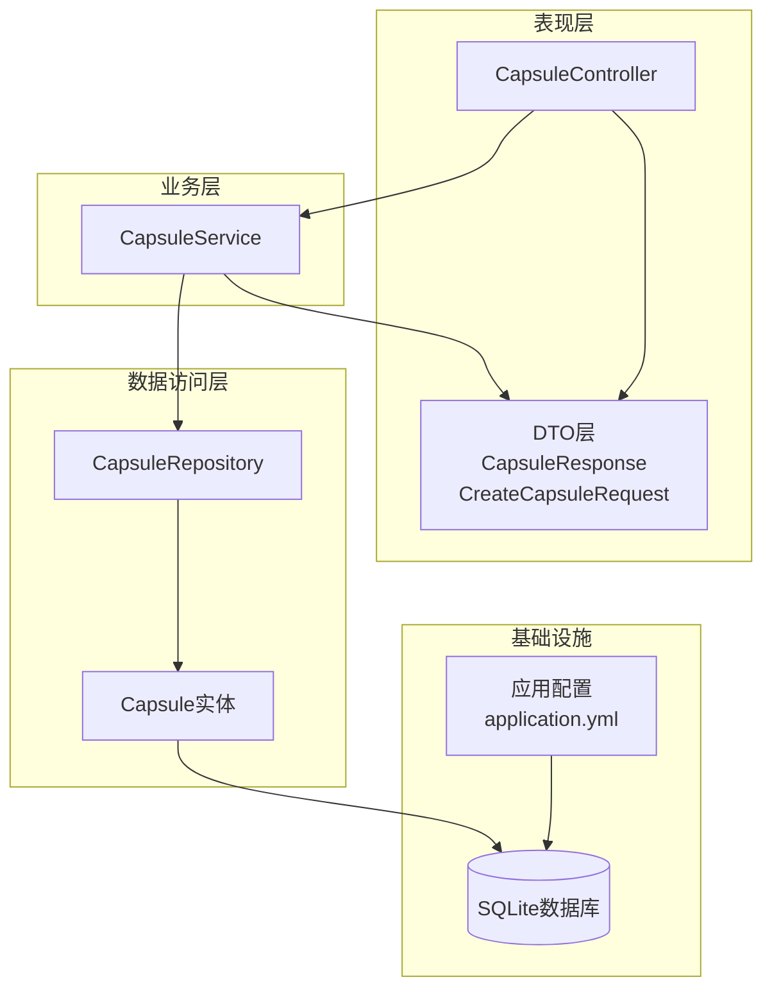

**图表来源**
- [CapsuleController.java:1-57](file://backends/spring-boot/src/main/java/com/hellotime/controller/CapsuleController.java#L1-L57)
- [CapsuleService.java:1-195](file://backends/spring-boot/src/main/java/com/hellotime/service/CapsuleService.java#L1-L195)
- [CapsuleRepository.java:1-48](file://backends/spring-boot/src/main/java/com/hellotime/repository/CapsuleRepository.java#L1-L48)
- [Capsule.java:1-90](file://backends/spring-boot/src/main/java/com/hellotime/entity/Capsule.java#L1-L90)

**章节来源**
- [application.yml:1-22](file://backends/spring-boot/src/main/resources/application.yml#L1-L22)
- [pom.xml:1-91](file://backends/spring-boot/pom.xml#L1-L91)

## 核心组件

### 实体映射设计

Capsule实体类采用完整的JPA注解配置，实现了以下设计原则：

#### 主键策略
- 使用`@Id`和`@GeneratedValue(strategy = GenerationType.IDENTITY)`实现数据库自增主键
- 支持SQLite的AUTOINCREMENT特性

#### 字段映射策略
- 所有字段均使用`@Column`注解明确映射关系
- 采用显式约束定义：`nullable = false`、`unique = true`、`length = N`
- 特殊字段使用`columnDefinition`自定义SQL类型

#### 时间戳处理
- `@PrePersist`回调自动设置创建时间
- 使用`Instant`类型处理UTC时间戳
- 区分`open_at`（开启时间）和`created_at`（创建时间）

**章节来源**
- [Capsule.java:10-58](file://backends/spring-boot/src/main/java/com/hellotime/entity/Capsule.java#L10-L58)

### Repository接口实现

CapsuleRepository继承JpaRepository，自动获得完整的CRUD功能，并扩展了特定查询方法：

#### 自动实现的CRUD操作
- 继承JpaRepository获得标准的CRUD方法
- 支持分页排序功能
- 提供事务性操作保证

#### 自定义查询方法
- `findByCode(String code)`：基于方法名的动态查询
- `existsByCode(String code)`：布尔存在性检查
- `findAllByOrderByCreatedAtDesc(Pageable pageable)`：排序分页查询

**章节来源**
- [CapsuleRepository.java:15-47](file://backends/spring-boot/src/main/java/com/hellotime/repository/CapsuleRepository.java#L15-L47)

### Spring Data JPA特性

#### 动态查询生成
Spring Data JPA根据方法命名规则自动生成SQL查询：
- `findByCode` → `SELECT * FROM capsules WHERE code = ?`
- `existsByCode` → `SELECT EXISTS(SELECT 1 FROM capsules WHERE code = ?)`
- `findAllByOrderByCreatedAtDesc` → `SELECT * FROM capsules ORDER BY created_at DESC`

#### 事务管理
- `@Transactional`注解确保业务操作的原子性
- 支持嵌套事务和回滚机制
- 自动管理连接生命周期

**章节来源**
- [CapsuleService.java:48-115](file://backends/spring-boot/src/main/java/com/hellotime/service/CapsuleService.java#L48-L115)

## 架构概览

系统采用分层架构，数据访问层通过Repository模式实现数据持久化抽象。

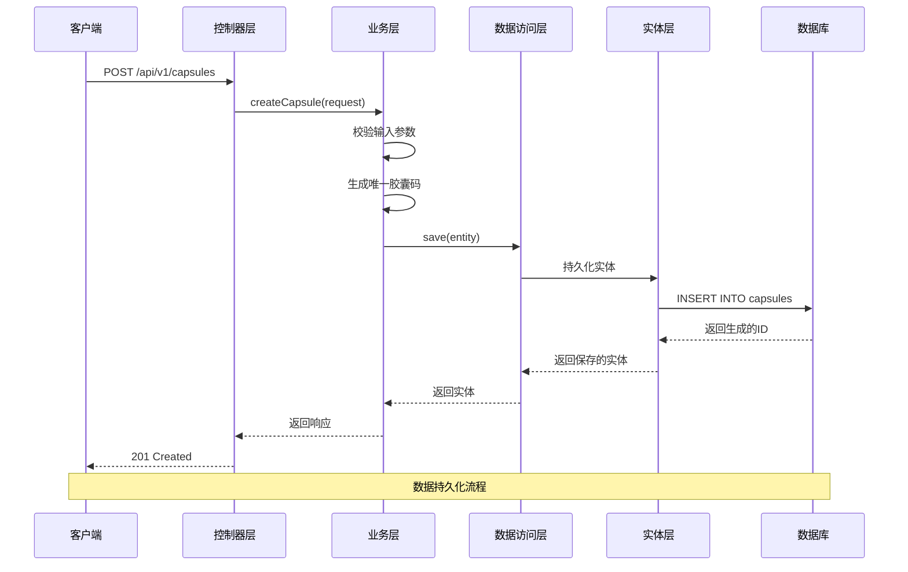

**图表来源**
- [CapsuleController.java:37-42](file://backends/spring-boot/src/main/java/com/hellotime/controller/CapsuleController.java#L37-L42)
- [CapsuleService.java:48-69](file://backends/spring-boot/src/main/java/com/hellotime/service/CapsuleService.java#L48-L69)
- [CapsuleRepository.java:15](file://backends/spring-boot/src/main/java/com/hellotime/repository/CapsuleRepository.java#L15)

## 详细组件分析

### Capsule实体类完整设计

#### 字段定义与数据类型选择

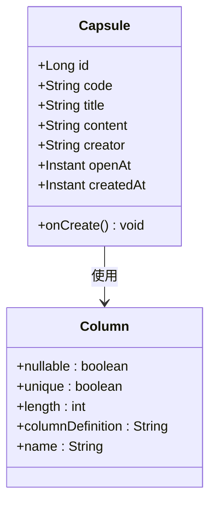

**图表来源**
- [Capsule.java:17-57](file://backends/spring-boot/src/main/java/com/hellotime/entity/Capsule.java#L17-L57)

#### 约束条件设计

| 字段 | 约束类型 | 具体要求 | 设计目的 |
|------|----------|----------|----------|
| id | 主键 | 自动生成 | 唯一标识记录 |
| code | 唯一+非空 | 8位字符串 | 胶囊唯一编码 |
| title | 非空 | 最多100字符 | 标题显示 |
| content | 非空 | TEXT类型 | 长文本存储 |
| creator | 非空 | 最多30字符 | 发布者标识 |
| open_at | 非空 | UTC时间戳 | 开启时间控制 |
| created_at | 非空 | UTC时间戳 | 记录创建时间 |

#### 时间戳处理机制

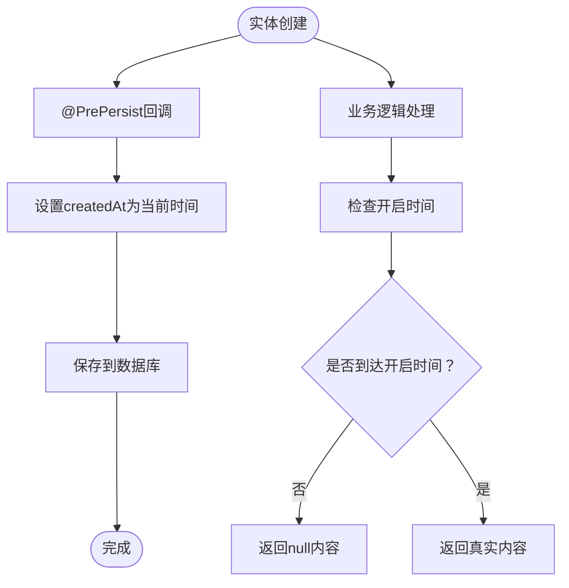

**图表来源**
- [Capsule.java:62-65](file://backends/spring-boot/src/main/java/com/hellotime/entity/Capsule.java#L62-L65)
- [CapsuleService.java:161-177](file://backends/spring-boot/src/main/java/com/hellotime/service/CapsuleService.java#L161-L177)

**章节来源**
- [Capsule.java:14-88](file://backends/spring-boot/src/main/java/com/hellotime/entity/Capsule.java#L14-L88)

### CapsuleRepository接口实现

#### 方法命名规范

Spring Data JPA遵循严格的命名约定：

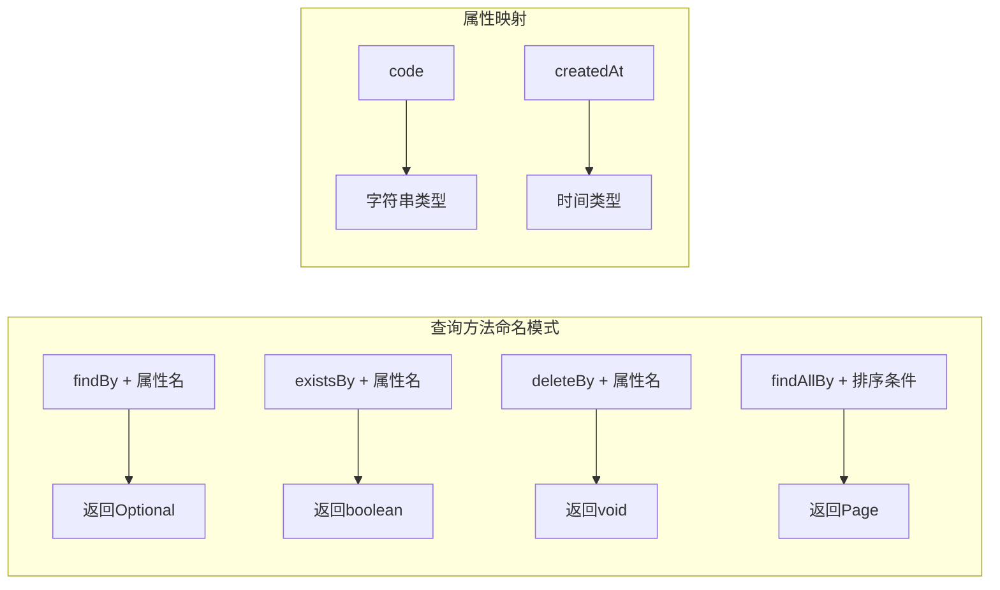

**图表来源**
- [CapsuleRepository.java:23-39](file://backends/spring-boot/src/main/java/com/hellotime/repository/CapsuleRepository.java#L23-L39)

#### 分页排序实现

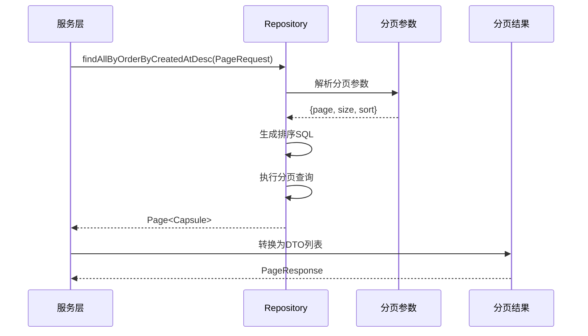

**图表来源**
- [CapsuleService.java:93-100](file://backends/spring-boot/src/main/java/com/hellotime/service/CapsuleService.java#L93-L100)
- [CapsuleRepository.java:39](file://backends/spring-boot/src/main/java/com/hellotime/repository/CapsuleRepository.java#L39)

**章节来源**
- [CapsuleRepository.java:15-47](file://backends/spring-boot/src/main/java/com/hellotime/repository/CapsuleRepository.java#L15-L47)

### Spring Data JPA特性详解

#### 自动实现的CRUD操作

| 操作类型 | 方法示例 | 功能描述 |
|----------|----------|----------|
| 创建 | `save(entity)` | 持久化新实体 |
| 读取 | `findById(id)` | 按主键查询 |
| 更新 | `save(entity)` | 更新现有实体 |
| 删除 | `deleteById(id)` | 按主键删除 |
| 查询 | `findAll()` | 获取所有记录 |

#### 动态查询实现

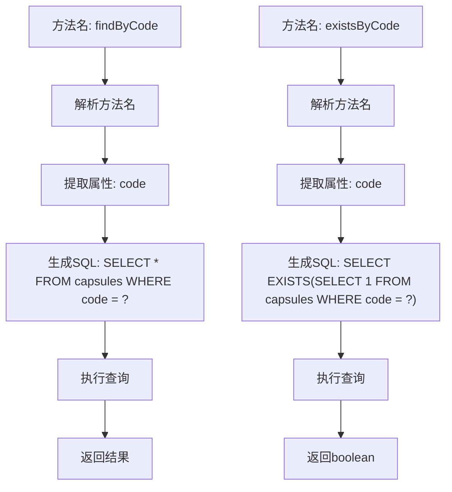

**图表来源**
- [CapsuleRepository.java:23-31](file://backends/spring-boot/src/main/java/com/hellotime/repository/CapsuleRepository.java#L23-L31)

#### 事务管理机制

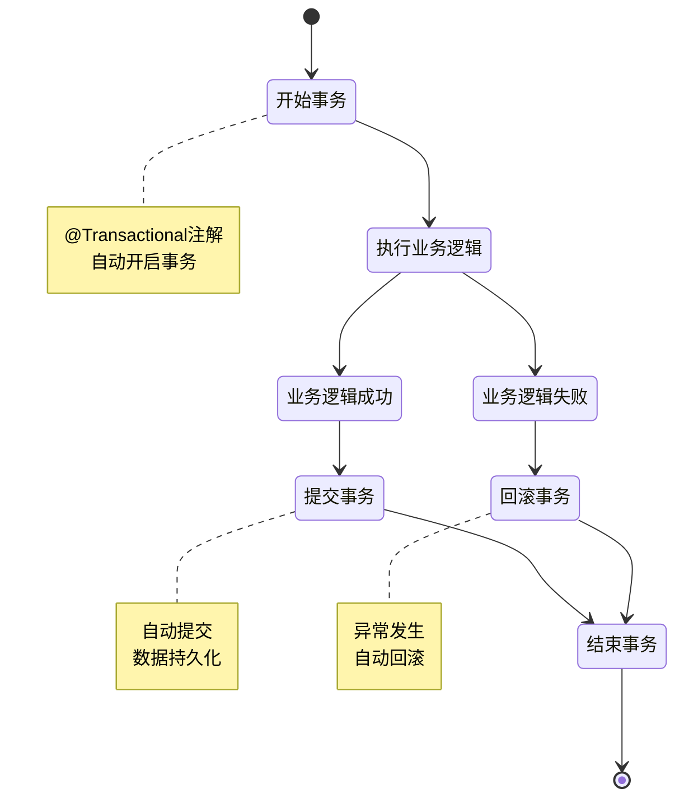

**图表来源**
- [CapsuleService.java:48](file://backends/spring-boot/src/main/java/com/hellotime/service/CapsuleService.java#L48)
- [CapsuleService.java:109](file://backends/spring-boot/src/main/java/com/hellotime/service/CapsuleService.java#L109)

**章节来源**
- [CapsuleService.java:12-12](file://backends/spring-boot/src/main/java/com/hellotime/service/CapsuleService.java#L12)

## 依赖关系分析

### 外部依赖关系

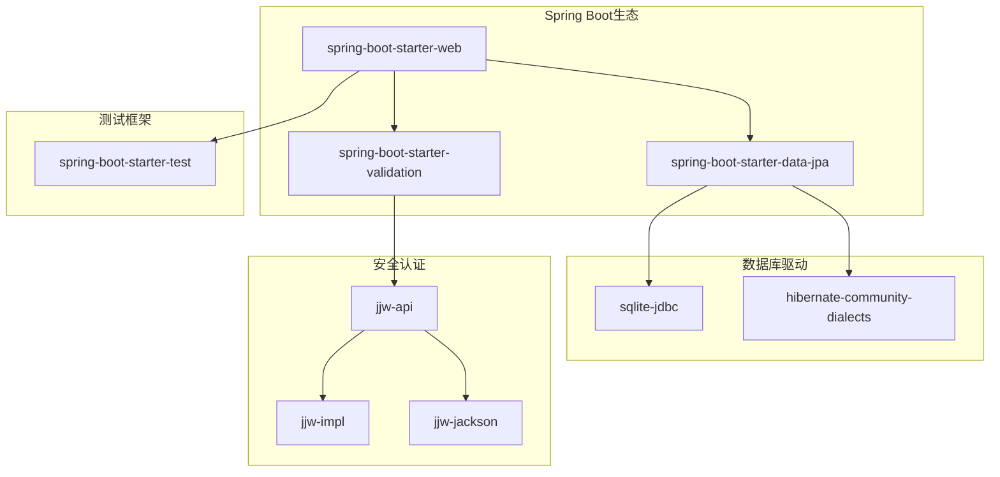

**图表来源**
- [pom.xml:25-79](file://backends/spring-boot/pom.xml#L25-L79)

### 内部模块依赖

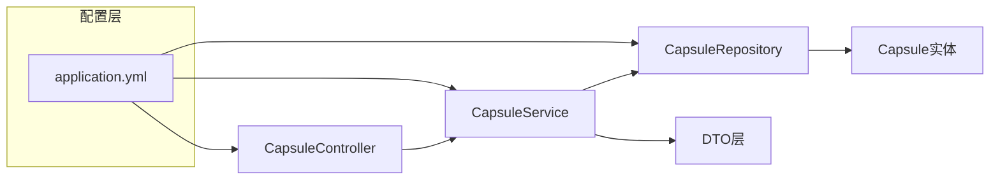

**图表来源**
- [CapsuleController.java:21-28](file://backends/spring-boot/src/main/java/com/hellotime/controller/CapsuleController.java#L21-L28)
- [CapsuleService.java:34-38](file://backends/spring-boot/src/main/java/com/hellotime/service/CapsuleService.java#L34-L38)

**章节来源**
- [pom.xml:1-91](file://backends/spring-boot/pom.xml#L1-L91)

## 性能考虑

### 数据库配置优化

#### SQLite配置策略
- 使用`ddl-auto: update`自动管理表结构
- 配置SQLite方言以优化SQL生成
- 关闭SQL日志输出以减少性能开销

#### 连接池配置
- Spring Boot默认提供连接池管理
- 建议根据并发需求调整连接池大小
- 合理设置超时时间和最大连接数

### 查询性能优化

#### 索引策略
- `code`字段自动创建唯一索引
- 建议为高频查询字段创建索引
- 避免在WHERE子句中使用函数表达式

#### 查询优化技巧
- 使用投影查询减少数据传输
- 合理使用分页避免全表扫描
- 避免N+1查询问题

### 缓存策略

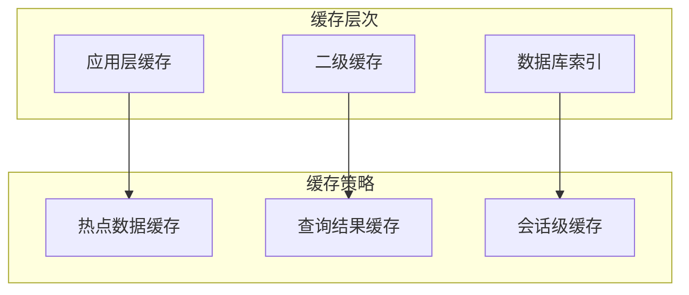

## 故障排除指南

### 常见问题诊断

#### 数据库连接问题
- 检查SQLite数据库文件路径
- 验证数据库驱动版本兼容性
- 确认数据库文件权限设置

#### 实体映射错误
- 验证@Entity注解正确性
- 检查字段类型映射一致性
- 确认主键生成策略配置

#### 查询性能问题
- 使用EXPLAIN分析SQL执行计划
- 检查索引使用情况
- 优化查询条件和排序字段

### 测试验证

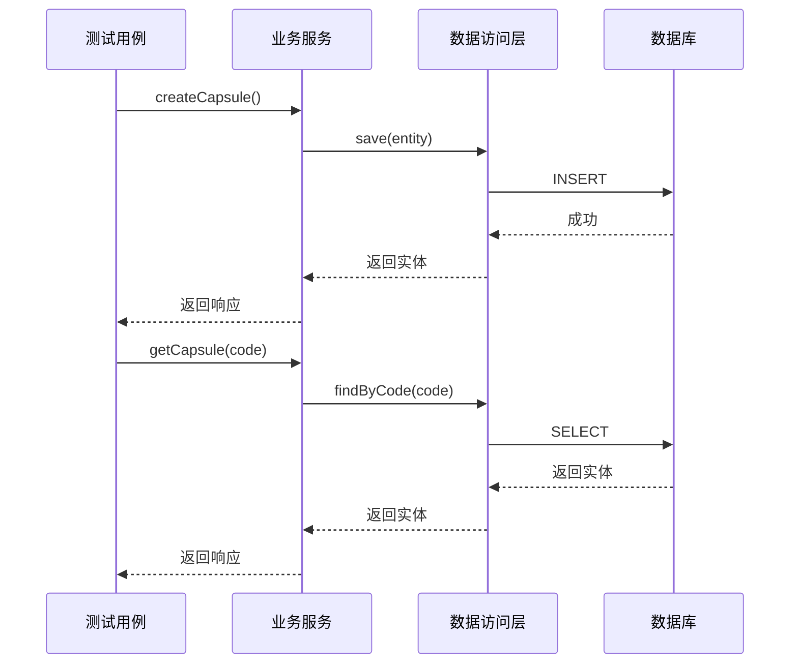

**图表来源**
- [CapsuleServiceTest.java:27-42](file://backends/spring-boot/src/test/java/com/hellotime/service/CapsuleServiceTest.java#L27-L42)
- [CapsuleServiceTest.java:55-69](file://backends/spring-boot/src/test/java/com/hellotime/service/CapsuleServiceTest.java#L55-L69)

**章节来源**
- [CapsuleServiceTest.java:17-95](file://backends/spring-boot/src/test/java/com/hellotime/service/CapsuleServiceTest.java#L17-L95)

## 结论

本数据访问层设计充分体现了Spring Data JPA的优势，通过简洁的注解配置和自动化的查询生成，实现了高效的数据持久化功能。Capsule实体类的设计考虑了时间胶囊的特殊需求，包括时间戳处理、内容隐藏机制等。Repository接口通过方法命名规范实现了直观的查询语义，配合Spring Data JPA的动态查询生成功能，大大减少了样板代码的编写。

系统采用SQLite作为轻量级数据库，适合技术展示和小规模部署场景。通过合理的配置和优化策略，可以在保证功能完整性的同时维持良好的性能表现。建议在生产环境中进一步完善监控、缓存和备份策略，以提升系统的稳定性和可靠性。