# 时间胶囊核心服务

<cite>
**本文档引用的文件**
- [CapsuleService.java](file://backends/spring-boot/src/main/java/com/hellotime/service/CapsuleService.java)
- [CapsuleRepository.java](file://backends/spring-boot/src/main/java/com/hellotime/repository/CapsuleRepository.java)
- [Capsule.java](file://backends/spring-boot/src/main/java/com/hellotime/entity/Capsule.java)
- [CapsuleResponse.java](file://backends/spring-boot/src/main/java/com/hellotime/dto/CapsuleResponse.java)
- [CreateCapsuleRequest.java](file://backends/spring-boot/src/main/java/com/hellotime/dto/CreateCapsuleRequest.java)
- [CapsuleController.java](file://backends/spring-boot/src/main/java/com/hellotime/controller/CapsuleController.java)
- [application.yml](file://backends/spring-boot/src/main/resources/application.yml)
- [CapsuleServiceTest.java](file://backends/spring-boot/src/test/java/com/hellotime/service/CapsuleServiceTest.java)
- [capsule_service.py](file://backends/fastapi/app/services/capsule_service.py)
- [models.py](file://backends/fastapi/app/models.py)
- [capsule.py](file://backends/fastapi/app/routers/capsule.py)
- [test_capsule_service.py](file://backends/fastapi/tests/test_capsule_service.py)
</cite>

## 目录
1. [简介](#简介)
2. [项目结构](#项目结构)
3. [核心组件](#核心组件)
4. [架构概览](#架构概览)
5. [详细组件分析](#详细组件分析)
6. [依赖关系分析](#依赖关系分析)
7. [性能考虑](#性能考虑)
8. [故障排除指南](#故障排除指南)
9. [结论](#结论)

## 简介

时间胶囊核心服务是一个基于Spring Boot和FastAPI的分布式应用，提供了时间胶囊的创建、查询、删除和分页管理功能。该服务的核心特性包括：

- **时间延迟机制**：通过开启时间控制胶囊内容的可见性
- **唯一编码系统**：8位Base62字符的唯一识别码
- **安全随机数生成**：使用SecureRandom确保编码的随机性和安全性
- **事务性操作**：保证数据一致性和完整性
- **多层验证机制**：输入验证、业务逻辑验证和异常处理

## 项目结构

时间胶囊服务采用分层架构设计，主要分为以下层次：

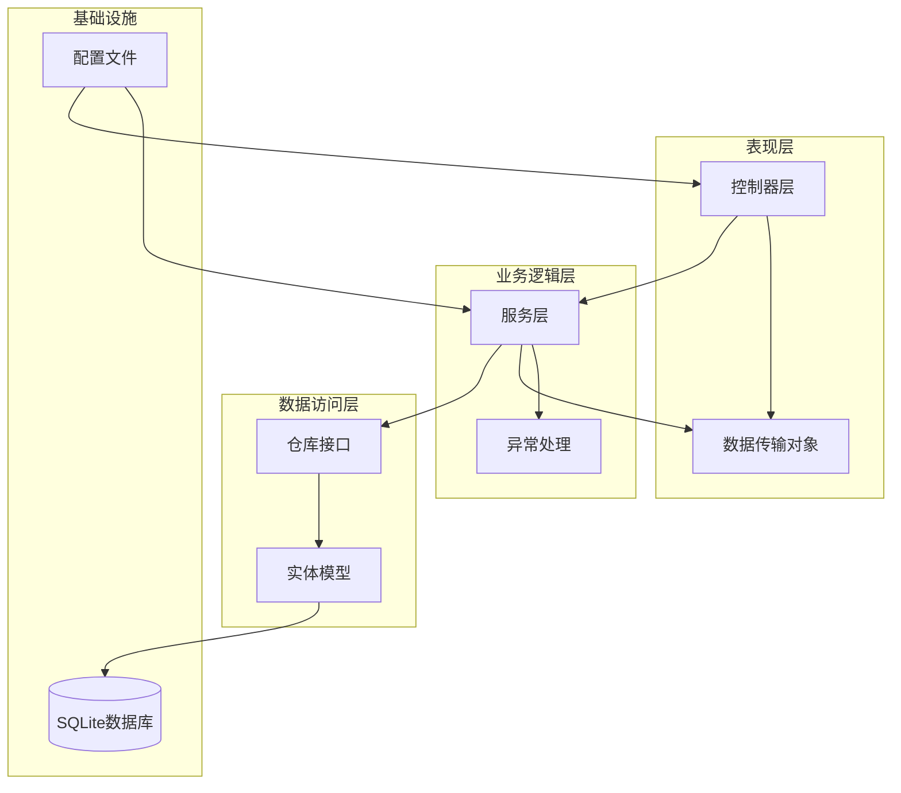

**图表来源**
- [CapsuleController.java:17-56](file://backends/spring-boot/src/main/java/com/hellotime/controller/CapsuleController.java#L17-L56)
- [CapsuleService.java:22-38](file://backends/spring-boot/src/main/java/com/hellotime/service/CapsuleService.java#L22-L38)
- [CapsuleRepository.java:15-47](file://backends/spring-boot/src/main/java/com/hellotime/repository/CapsuleRepository.java#L15-L47)

**章节来源**
- [CapsuleController.java:1-57](file://backends/spring-boot/src/main/java/com/hellotime/controller/CapsuleController.java#L1-L57)
- [CapsuleService.java:1-195](file://backends/spring-boot/src/main/java/com/hellotime/service/CapsuleService.java#L1-L195)
- [CapsuleRepository.java:1-48](file://backends/spring-boot/src/main/java/com/hellotime/repository/CapsuleRepository.java#L1-L48)

## 核心组件

### 数据模型设计

时间胶囊系统的核心数据模型围绕Capsule实体构建，具有以下关键属性：

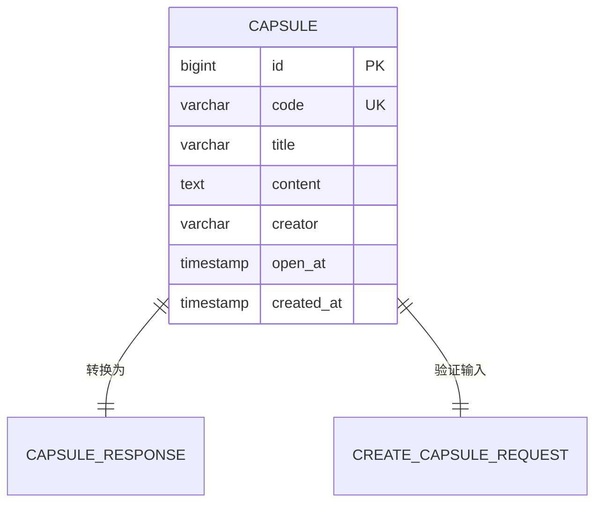

**图表来源**
- [Capsule.java:12-58](file://backends/spring-boot/src/main/java/com/hellotime/entity/Capsule.java#L12-L58)
- [CapsuleResponse.java:7-14](file://backends/spring-boot/src/main/java/com/hellotime/dto/CapsuleResponse.java#L7-L14)

### 关键常量配置

系统使用一组精心设计的常量来确保功能的正确性和安全性：

| 常量名称 | 值 | 描述 | 用途 |
|---------|-----|------|------|
| CODE_CHARS | "ABCDEFGHIJKLMNOPQRSTUVWXYZabcdefghijklmnopqrstuvwxyz0123456789" | Base62字符集 | 生成唯一编码 |
| CODE_LENGTH | 8 | 编码长度 | 确保足够的唯一性空间 |
| MAX_RETRIES | 10 | 最大重试次数 | 防止无限循环 |
| SecureRandom | 实例 | 安全随机数生成器 | 生成加密安全的随机数 |

**章节来源**
- [CapsuleService.java:25-32](file://backends/spring-boot/src/main/java/com/hellotime/service/CapsuleService.java#L25-L32)

## 架构概览

时间胶囊服务采用经典的三层架构模式，实现了清晰的关注点分离：

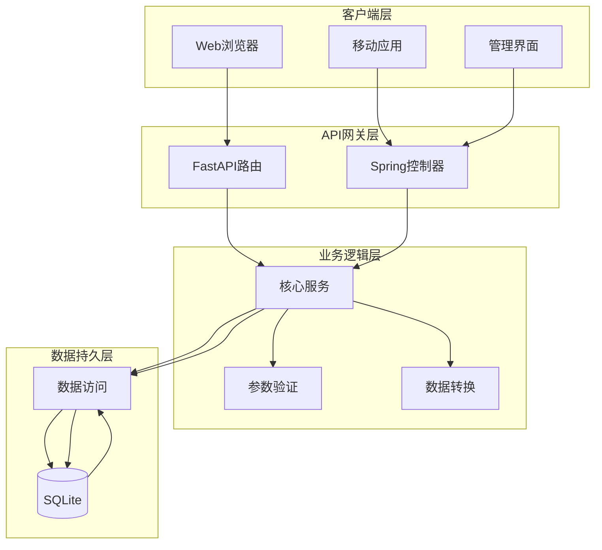

**图表来源**
- [capsule.py:14-30](file://backends/fastapi/app/routers/capsule.py#L14-L30)
- [CapsuleController.java:17-56](file://backends/spring-boot/src/main/java/com/hellotime/controller/CapsuleController.java#L17-L56)
- [CapsuleService.java:22-38](file://backends/spring-boot/src/main/java/com/hellotime/service/CapsuleService.java#L22-L38)

## 详细组件分析

### CapsuleService核心服务类

CapsuleService是整个系统的核心业务逻辑实现，负责处理所有时间胶囊相关的业务操作。

#### 核心业务方法

##### createCapsule方法 - 事务处理与数据验证

createCapsule方法实现了完整的事务性创建流程：

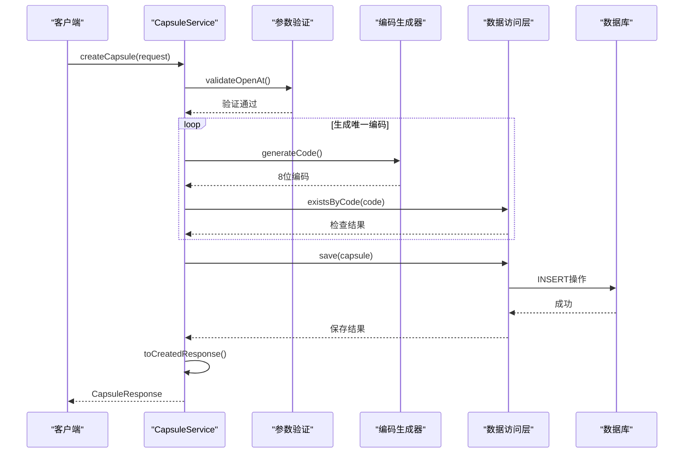

**图表来源**
- [CapsuleService.java:48-69](file://backends/spring-boot/src/main/java/com/hellotime/service/CapsuleService.java#L48-L69)
- [CapsuleService.java:121-129](file://backends/spring-boot/src/main/java/com/hellotime/service/CapsuleService.java#L121-L129)

**章节来源**
- [CapsuleService.java:48-69](file://backends/spring-boot/src/main/java/com/hellotime/service/CapsuleService.java#L48-L69)

##### getCapsule方法 - 时间判断逻辑与内容隐藏机制

getCapsule方法实现了智能的内容隐藏机制：

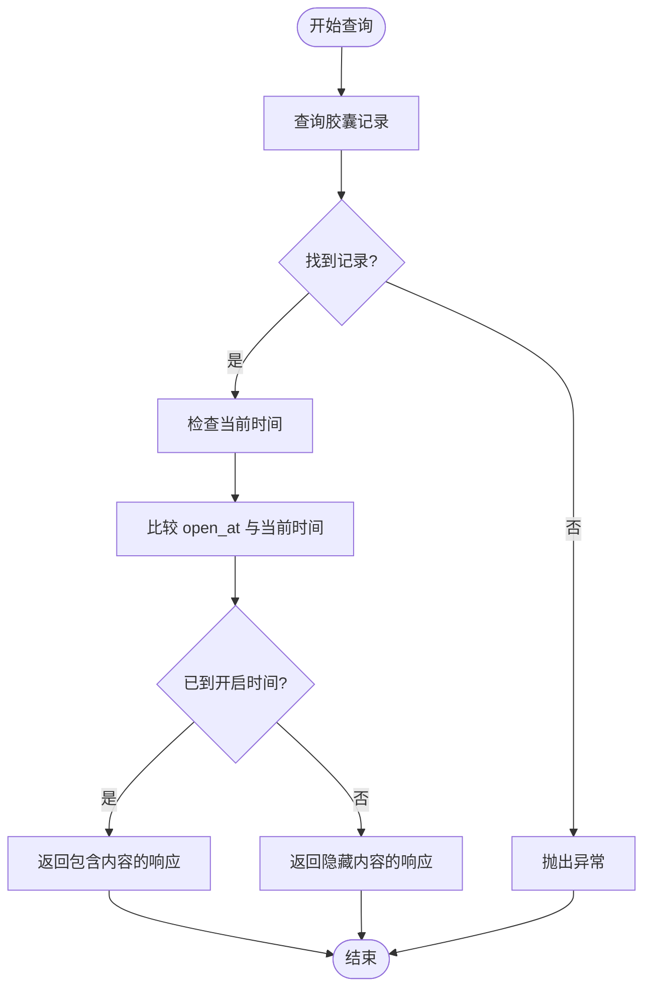

**图表来源**
- [CapsuleService.java:79-83](file://backends/spring-boot/src/main/java/com/hellotime/service/CapsuleService.java#L79-L83)
- [CapsuleService.java:161-177](file://backends/spring-boot/src/main/java/com/hellotime/service/CapsuleService.java#L161-L177)

**章节来源**
- [CapsuleService.java:79-83](file://backends/spring-boot/src/main/java/com/hellotime/service/CapsuleService.java#L79-L83)

##### listCapsules方法 - 分页查询实现

listCapsules方法提供了高效的分页查询功能：

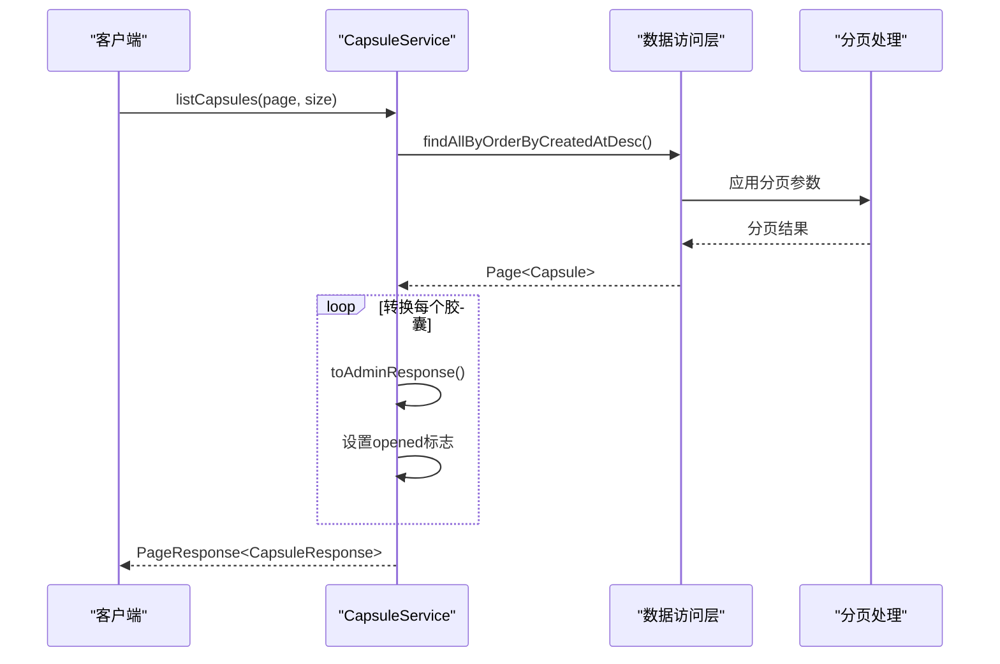

**图表来源**
- [CapsuleService.java:93-100](file://backends/spring-boot/src/main/java/com/hellotime/service/CapsuleService.java#L93-L100)
- [CapsuleRepository.java:39-46](file://backends/spring-boot/src/main/java/com/hellotime/repository/CapsuleRepository.java#L39-L46)

**章节来源**
- [CapsuleService.java:93-100](file://backends/spring-boot/src/main/java/com/hellotime/service/CapsuleService.java#L93-L100)

#### 数据转换方法

##### toCreatedResponse方法

toCreatedResponse方法专门用于创建响应，确保不泄露敏感内容：

| 字段 | 是否包含 | 说明 |
|------|----------|------|
| code | ✓ | 唯一识别码 |
| title | ✓ | 胶囊标题 |
| creator | ✓ | 创建者昵称 |
| openAt | ✓ | 开启时间 |
| createdAt | ✓ | 创建时间 |
| content | ✗ | 创建响应中隐藏 |
| opened | ✗ | 创建响应中隐藏 |

##### toDetailResponse方法

toDetailResponse方法实现了智能的内容访问控制：

| 条件 | 返回内容 | 说明 |
|------|----------|------|
| 已到开启时间 | 包含content | 用户可以查看完整内容 |
| 未到开启时间 | 隐藏content | 内容字段为null |
| opened标志 | 始终包含 | 显示开启状态 |

##### toAdminResponse方法

toAdminResponse方法为管理员提供完整信息访问：

| 字段 | 是否包含 | 说明 |
|------|----------|------|
| code | ✓ | 唯一识别码 |
| title | ✓ | 胶囊标题 |
| content | ✓ | 完整内容（管理员可见） |
| creator | ✓ | 创建者昵称 |
| openAt | ✓ | 开启时间 |
| createdAt | ✓ | 创建时间 |
| opened | ✓ | 开启状态 |

**章节来源**
- [CapsuleService.java:147-193](file://backends/spring-boot/src/main/java/com/hellotime/service/CapsuleService.java#L147-L193)

### 数据访问层设计

CapsuleRepository继承了Spring Data JPA的JpaRepository，提供了丰富的数据访问功能：

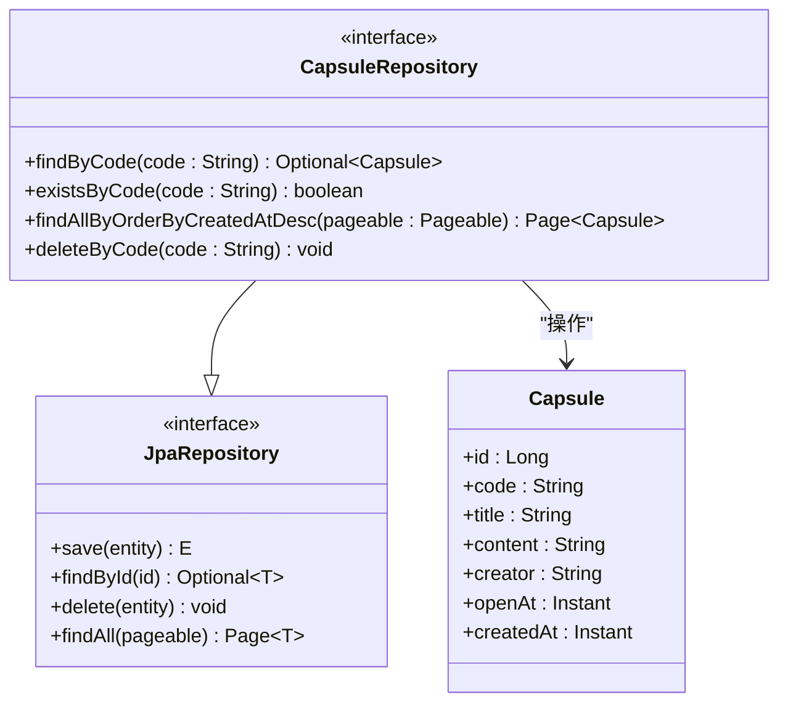

**图表来源**
- [CapsuleRepository.java:15-47](file://backends/spring-boot/src/main/java/com/hellotime/repository/CapsuleRepository.java#L15-L47)
- [Capsule.java:12-58](file://backends/spring-boot/src/main/java/com/hellotime/entity/Capsule.java#L12-L58)

**章节来源**
- [CapsuleRepository.java:15-47](file://backends/spring-boot/src/main/java/com/hellotime/repository/CapsuleRepository.java#L15-L47)

### 安全与可靠性机制

#### SecureRandom安全随机数生成

系统使用Java的SecureRandom类确保编码生成的安全性：

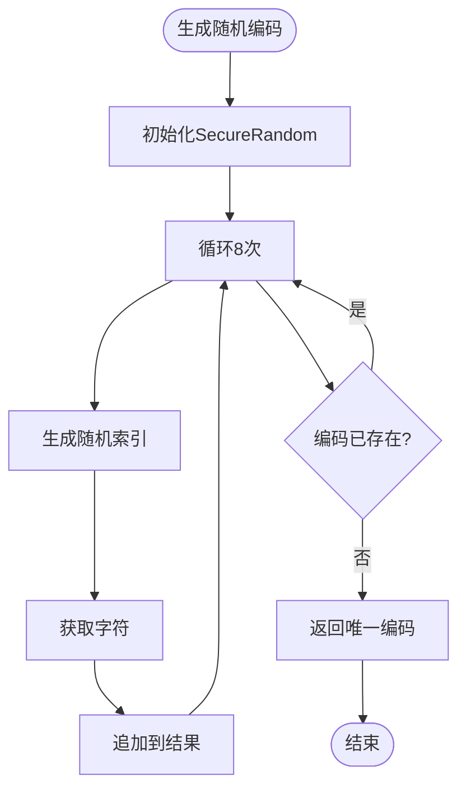

**图表来源**
- [CapsuleService.java:135-141](file://backends/spring-boot/src/main/java/com/hellotime/service/CapsuleService.java#L135-L141)
- [CapsuleService.java:121-129](file://backends/spring-boot/src/main/java/com/hellotime/service/CapsuleService.java#L121-L129)

#### MAX_RETRIES重试机制

系统实现了10次最大重试机制来防止无限循环：

| 重试次数 | 概率 | 说明 |
|----------|------|------|
| 第1次 | ~100% | 几乎总是成功 |
| 第2次 | ~99.99% | 极小概率冲突 |
| 第10次 | ~99.99% | 高概率成功 |
| 超过10次 | 0% | 抛出运行时异常 |

**章节来源**
- [CapsuleService.java:29-30](file://backends/spring-boot/src/main/java/com/hellotime/service/CapsuleService.java#L29-L30)
- [CapsuleService.java:121-129](file://backends/spring-boot/src/main/java/com/hellotime/service/CapsuleService.java#L121-L129)

## 依赖关系分析

### 外部依赖关系

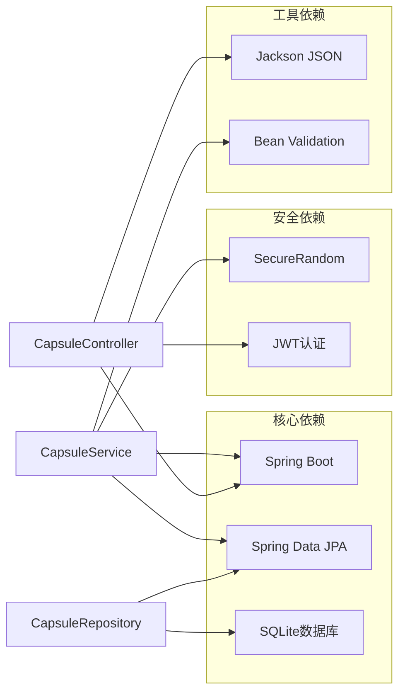

**图表来源**
- [CapsuleService.java:1-12](file://backends/spring-boot/src/main/java/com/hellotime/service/CapsuleService.java#L1-L12)
- [application.yml:1-22](file://backends/spring-boot/src/main/resources/application.yml#L1-L22)

### 内部模块依赖

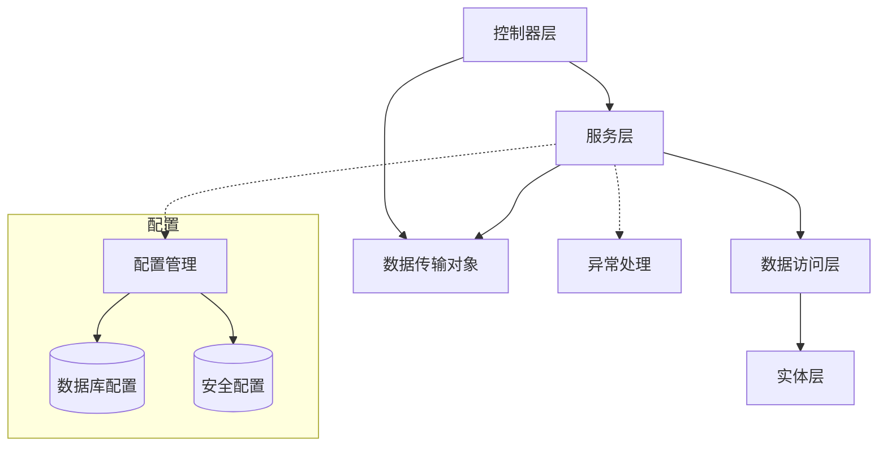

**图表来源**
- [CapsuleController.java:21-28](file://backends/spring-boot/src/main/java/com/hellotime/controller/CapsuleController.java#L21-L28)
- [CapsuleService.java:34-38](file://backends/spring-boot/src/main/java/com/hellotime/service/CapsuleService.java#L34-L38)

**章节来源**
- [application.yml:1-22](file://backends/spring-boot/src/main/resources/application.yml#L1-L22)

## 性能考虑

### 数据库优化策略

1. **索引优化**：在code字段上建立了唯一索引，确保查询效率
2. **分页查询**：使用JPA的Pageable接口实现高效分页
3. **批量操作**：支持批量删除和查询操作

### 缓存策略

虽然当前实现未包含缓存层，但建议在生产环境中考虑：

- **查询结果缓存**：对热门胶囊内容进行缓存
- **元数据缓存**：缓存统计信息和配置数据
- **会话缓存**：缓存用户会话信息

### 并发控制

系统通过以下机制确保并发安全：

- **事务隔离**：使用@Transactional注解确保操作原子性
- **乐观锁**：可选的版本号机制防止并发修改冲突
- **连接池**：合理配置数据库连接池参数

## 故障排除指南

### 常见问题及解决方案

#### 编码生成失败

**问题描述**：无法生成唯一的8位编码

**可能原因**：
1. 数据库中已存在大量胶囊记录
2. SecureRandom实例初始化失败
3. 系统时间异常

**解决方案**：
1. 检查数据库中现有记录数量
2. 验证系统时间和时区设置
3. 查看应用程序日志中的异常信息

#### 时间判断异常

**问题描述**：胶囊内容显示不符合预期

**可能原因**：
1. 服务器时间不同步
2. 时区设置错误
3. Instant对象时区信息缺失

**解决方案**：
1. 同步服务器时间
2. 检查应用配置中的时区设置
3. 验证时间戳的时区信息

#### 数据库连接问题

**问题描述**：无法连接到SQLite数据库

**可能原因**：
1. 数据库文件权限不足
2. 数据库文件损坏
3. 路径配置错误

**解决方案**：
1. 检查数据库文件权限
2. 验证数据库文件完整性
3. 确认数据库路径配置正确

**章节来源**
- [CapsuleServiceTest.java:44-53](file://backends/spring-boot/src/test/java/com/hellotime/service/CapsuleServiceTest.java#L44-L53)
- [CapsuleServiceTest.java:55-69](file://backends/spring-boot/src/test/java/com/hellotime/service/CapsuleServiceTest.java#L55-L69)

### 测试覆盖范围

系统提供了全面的测试覆盖：

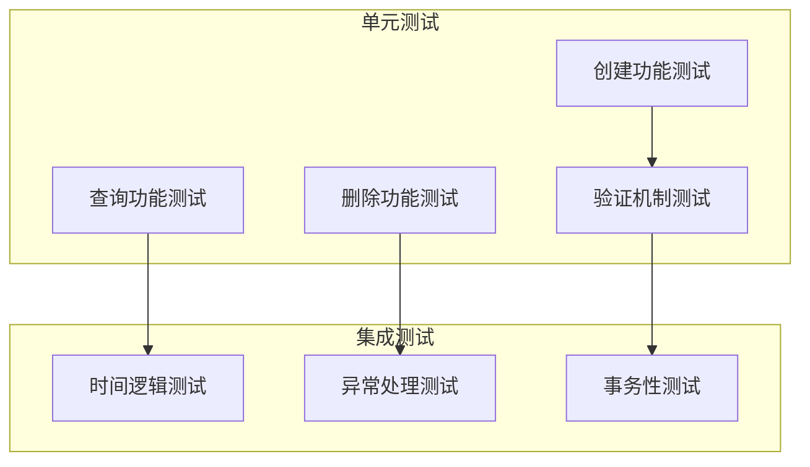

**图表来源**
- [CapsuleServiceTest.java:27-42](file://backends/spring-boot/src/test/java/com/hellotime/service/CapsuleServiceTest.java#L27-L42)
- [test_capsule_service.py:17-34](file://backends/fastapi/tests/test_capsule_service.py#L17-L34)

**章节来源**
- [CapsuleServiceTest.java:1-95](file://backends/spring-boot/src/test/java/com/hellotime/service/CapsuleServiceTest.java#L1-L95)
- [test_capsule_service.py:1-89](file://backends/fastapi/tests/test_capsule_service.py#L1-L89)

## 结论

时间胶囊核心服务展现了现代Java企业级应用的最佳实践：

### 技术优势

1. **架构清晰**：分层架构确保了代码的可维护性和可扩展性
2. **安全性强**：使用SecureRandom确保编码生成的安全性
3. **可靠性高**：完善的异常处理和重试机制
4. **性能优秀**：合理的数据库设计和查询优化

### 设计亮点

1. **智能内容控制**：基于时间的动态内容可见性
2. **统一的数据模型**：清晰的实体关系设计
3. **灵活的转换机制**：针对不同用户角色的差异化响应
4. **完善的测试体系**：全面的单元测试和集成测试

### 改进建议

1. **添加缓存层**：提升高频查询的性能
2. **增强监控**：添加详细的性能指标和日志记录
3. **扩展认证**：支持更灵活的用户认证机制
4. **优化数据库**：考虑使用更强大的数据库引擎

该服务为时间胶囊应用提供了坚实的技术基础，其设计理念和实现方式值得在类似项目中借鉴和参考。